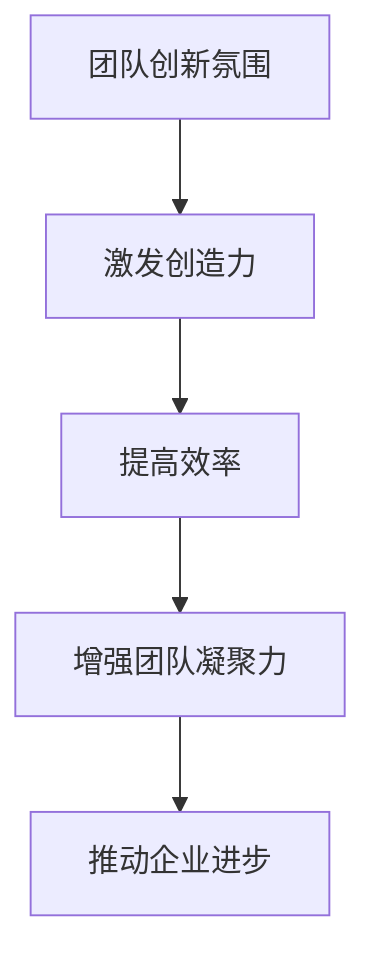

                 

### 文章标题

团队创新氛围：营造鼓励创新的环境

> 关键词：团队创新氛围、鼓励创新、组织文化、领导力、创新机制、创新工具

> 摘要：本文将深入探讨团队创新氛围的重要性，分析其核心要素，并提供实用的策略和案例分析，以帮助组织营造一个鼓励创新的环境。

---

## 引言

在当今快速变化的市场环境中，创新能力已成为企业竞争力的关键因素。团队创新氛围作为激发创新活力的基石，其重要性不言而喻。一个良好的创新氛围能够促进团队成员的创造力，提高工作效率，增强团队凝聚力，从而推动企业持续发展。本文将围绕团队创新氛围的概念、核心要素、营造策略和实践案例展开深入探讨，以期为组织提供有益的参考和启示。

## 什么是团队创新氛围

### 定义与创新氛围的关系

团队创新氛围是指一个组织内部在特定文化、结构、机制和资源支持下，鼓励、支持创新行为和思维的总体环境。其核心在于激发团队成员的创新潜力，使其在不断的尝试和探索中实现个人和团队的成长。创新氛围的定义可以表示为：

$$
\text{创新氛围} = \text{组织文化} + \text{组织结构} + \text{激励机制} + \text{资源支持}
$$

### 创新氛围的重要性

创新氛围对团队和个人有着深远的影响。首先，它能够激发团队成员的创造力，使他们在面对挑战时能够提出新颖的解决方案。其次，良好的创新氛围有助于提高团队的工作效率，通过协同合作实现资源的最优配置。此外，创新氛围还能增强团队凝聚力，使成员在共同的目标和价值观下形成紧密的协作关系。以下是创新氛围对团队和创新的影响的 Mermaid 流程图：

### 创新氛围的核心要素

创新氛围的形成离不开以下几个核心要素：

1. **文化**：组织文化是创新氛围的根基，它决定了组织对待创新的态度和行为。开放、包容、鼓励尝试和失败的文化能够为创新提供土壤。
2. **结构**：组织结构应当支持灵活的协作和快速决策，避免过度层级化和官僚主义，以促进创新。
3. **机制**：创新机制包括奖励、反馈和资源分配等，它们为创新提供了动力和支持。
4. **技能**：团队成员应当具备多样化的技能，以应对不同类型的创新挑战。
5. **资源**：包括资金、技术、时间等，资源支持是创新成功的关键因素。

接下来，我们将逐一详细探讨这些核心要素。

## 创新氛围的分类与特征

### 开放型创新氛围

开放型创新氛围强调外部合作和知识共享，组织内部对外的边界相对模糊，鼓励外部专家和客户参与到创新过程中。这种氛围通常具有以下特征：

- **高透明度**：内部信息对外部开放，外部反馈对内部创新有直接影响。
- **合作网络**：与供应商、客户、研究机构等建立紧密的合作关系。
- **快速响应**：对市场变化和技术进步反应迅速。

### 聚焦型创新氛围

聚焦型创新氛围则更加注重内部资源的优化配置和流程的精细化管理，以实现特定领域的创新突破。其特征包括：

- **明确目标**：组织有明确的创新目标和战略方向。
- **高效协作**：团队成员紧密协作，确保创新项目的顺利进行。
- **严格评审**：对创新项目进行严格的评审，确保资源投入的有效性。

### 创新型组织的特征

无论是开放型还是聚焦型创新氛围，一个创新型的组织通常具备以下特征：

- **领导力**：领导者具备创新意识和能力，能够引领团队实现创新。
- **灵活组织**：组织结构灵活，能够迅速适应环境变化。
- **持续学习**：组织成员持续学习，不断提升自身的知识和技能。
- **激励机制**：建立有效的激励机制，鼓励创新和承担风险。

### 创新氛围的评价与测量

评价和测量创新氛围对于组织来说至关重要，它有助于了解现状，发现不足，并制定改进措施。以下是一些常用的评价与测量方法：

- **问卷调查**：通过问卷收集团队成员对创新氛围的主观感受和意见。
- **关键绩效指标（KPI）**：建立与创新氛围相关的关键绩效指标，如创新项目成功率、新产品推出时间等。
- **员工反馈**：定期与员工进行一对一沟通，了解其对创新氛围的满意度和建议。
- **案例分析**：通过分析创新成功的案例，评估创新氛围的成效。

### 创新氛围评价工具

- **创新氛围评估量表**：一种常用的评估工具，包含多个指标，用于评价创新氛围的质量。
- **创新指数**：通过综合多个维度的数据，计算出一个创新指数，反映组织的创新氛围水平。

## 营造创新氛围的策略

### 领导力与文化建设

领导者在营造创新氛围中扮演着关键角色。以下是一些领导力与文化建设策略：

1. **树立创新愿景**：领导者需要明确组织的创新目标，并以此激励团队。
2. **鼓励尝试与失败**：领导者应当鼓励团队成员勇于尝试，并对失败持宽容态度。
3. **建立开放沟通机制**：鼓励团队成员之间进行开放、坦诚的沟通，分享想法和反馈。

### 组织结构与机制

1. **扁平化组织结构**：减少管理层级，提高决策速度，促进创新。
2. **跨部门协作**：建立跨部门团队，促进不同部门之间的知识共享和协同创新。
3. **创新流程设计**：建立系统化的创新流程，确保创新项目从构思到实施的顺利进行。

### 技能培养与资源分配

1. **多样化技能培养**：提供培训和学习机会，提升团队成员的技能多样性。
2. **资源优先配置**：将资源优先分配给创新项目，确保其得到足够的支持。
3. **外部合作与资源整合**：与其他组织合作，共享资源，拓展创新网络。

### 创新环境与工具

1. **创新空间设计**：为团队成员提供舒适、开放的办公环境，激发创造力。
2. **创新工具使用**：利用现代技术工具，如人工智能、大数据分析等，提升创新效率。
3. **创新方法论**：引入创新方法论，如设计思维、敏捷开发等，指导创新实践。

## 创新氛围的实践与案例分析

### 成功的创新氛围案例分析

以某知名科技公司为例，该公司通过以下措施成功营造了创新氛围：

- **领导力**：领导者鼓励员工提出创新想法，并设立专项基金支持创新项目。
- **文化建设**：公司文化强调开放和包容，鼓励员工勇于尝试和表达意见。
- **流程机制**：建立快速响应机制，简化审批流程，确保创新项目能够快速启动。
- **资源支持**：提供充足的资源和时间，确保创新项目顺利进行。

### 失败的创新氛围案例分析

以另一家科技公司为例，该公司在营造创新氛围方面遭遇了挫折：

- **领导力不足**：领导者对创新持保守态度，缺乏对创新项目的支持和鼓励。
- **文化建设缺失**：公司文化缺乏开放和包容，员工对提出创新想法持谨慎态度。
- **资源不足**：资源分配不合理，创新项目常常因缺乏资金和时间支持而中途夭折。

### 实践指南

为了有效营造创新氛围，组织可以遵循以下步骤：

1. **明确创新目标**：确定组织需要解决的关键问题，明确创新目标。
2. **评估现状**：评估当前创新氛围的现状，识别存在的问题和改进方向。
3. **制定策略**：根据评估结果，制定具体的创新氛围营造策略。
4. **实施与反馈**：实施策略，并定期收集反馈，根据反馈调整和优化策略。

## 持续优化与创新氛围的维护

### 创新氛围的动态调整

创新氛围不是一成不变的，随着组织的发展和外部环境的变化，创新氛围也需要不断调整和优化。以下是一些动态调整的策略：

1. **定期评估**：定期对创新氛围进行评估，了解团队成员的反馈和意见。
2. **灵活调整**：根据评估结果，灵活调整创新策略和文化建设措施。
3. **持续改进**：鼓励团队成员持续提出改进建议，并付诸实践。

### 创新氛围的评估与反馈

1. **多维度评估**：从文化、结构、机制、资源等多个维度对创新氛围进行评估。
2. **员工参与**：鼓励员工参与到创新氛围评估过程中，收集他们的真实反馈。
3. **数据驱动**：利用数据分析工具，量化评估创新氛围的成效。

### 创新氛围的持续发展

1. **领导力培养**：持续提升领导者的创新意识和管理能力，为创新氛围提供坚实的领导力支持。
2. **文化建设**：将创新文化融入到组织日常运营中，使其成为组织的核心价值观。
3. **资源投入**：确保持续的资源投入，为创新提供必要的资金、技术和人才支持。

## 结论

团队创新氛围是激发创新活力的关键因素。通过领导力、文化建设、组织结构、激励机制和资源支持等多个方面的共同努力，组织可以营造一个鼓励创新的环境。有效的创新氛围不仅能够提高团队成员的创造力，还能推动企业的持续发展和竞争优势。本文提供了详细的策略和实践指南，希望对组织在营造创新氛围方面有所启示。

### 作者信息

作者：AI天才研究院/AI Genius Institute & 禅与计算机程序设计艺术 /Zen And The Art of Computer Programming

---

本文详细探讨了团队创新氛围的重要性、核心要素、营造策略以及实践案例，旨在为组织提供一套系统的创新氛围营造方案。通过本文的介绍，希望读者能够深刻理解创新氛围的重要性，并掌握有效的营造策略，从而在组织中激发创新的活力。在未来的工作中，持续优化和创新氛围，推动组织的持续发展。感谢阅读，希望本文对您有所启发。如果您有任何疑问或建议，欢迎留言交流。再次感谢您的关注和支持！

