                 

**团队创造力激发：突破思维局限的方法**

## 关键词
- 团队创造力，思维模式，心态转变，创新技术，领导力，协作工具，个人成长

## 摘要
本文旨在探讨团队创造力激发的方法，特别是在突破思维局限方面的策略。通过分析心态、技术和领导力等因素，本文提供了一系列实用的方法和技巧，帮助企业团队实现创新和高效的工作方式。

## 引言
在当今快速变化和竞争激烈的商业环境中，团队创造力成为企业成功的关键因素。一个能够不断创新和解决问题的团队，能够在市场中脱颖而出。然而，团队创造力并非自然而然产生，它需要一系列的策略和方法的激发。本文将围绕以下几个方面展开讨论：

1. **团队创造力的定义与重要性**
2. **团队创造力面临的挑战**
3. **心态与创造力的关系**
4. **创新技术与工具**
5. **领导力在创造力激发中的作用**
6. **技术对团队创造力的支持**
7. **个人成长与团队创造力**
8. **结论与未来展望**

通过上述结构，本文希望能够为读者提供一个系统、全面的理解，并掌握激发团队创造力的实际方法。

## 一、团队创造力的定义与重要性

### 定义
团队创造力是指团队成员在共同工作中，通过创新思维和协作，产生新的想法、解决方案或产品。它不仅涉及个人能力的发挥，更强调团队成员之间的互动和协同效应。在组织层面，团队创造力表现为对问题的新颖解决、市场机会的敏锐把握以及对现有流程的持续优化。

### 重要性
团队创造力对企业的成功至关重要，主要表现在以下几个方面：

1. **市场竞争优势**：创新的产品和服务可以帮助企业建立独特的市场定位，从而在竞争中脱颖而出。
2. **持续发展动力**：创新思维能够推动企业不断进步，适应市场变化，保持长期竞争力。
3. **员工满意度**：一个鼓励创新的团队环境能够提高员工的参与感和成就感，从而提升整体工作满意度。
4. **组织学习与成长**：通过团队的创造性工作，企业能够不断积累知识和经验，促进组织整体的学习和成长。

### 团队创造力与个人创造力的关系
团队创造力和个人创造力是相辅相成的。个人创造力是团队创造力的基础，每个团队成员的创新能力汇聚在一起，形成团队的集体智慧。然而，团队创造力不仅仅是个人能力的简单叠加，它强调的是团队成员之间的协作、沟通和共同解决问题的能力。以下是一个简化的Mermaid流程图，展示了团队创造力与个人创造力之间的联系：

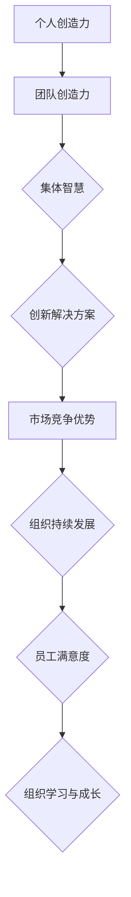

通过上述关系架构，可以看出，个人创造力是团队创造力的重要组成部分，而团队创造力又进一步促进企业的市场竞争力、组织持续发展和员工满意度，从而推动组织的整体成长。

## 二、团队创造力面临的挑战

### 团队规模与创造力

#### 背景介绍
团队规模对创造力有着显著的影响。研究表明，团队规模过大会导致沟通成本增加、协作难度上升，从而影响团队创造力。相反，团队规模过小可能导致知识和资源的局限，难以产生多样化的想法。

#### 核心概念与联系
团队规模与创造力的关系可以用协作网络理论来解释。协作网络中的节点代表团队成员，边代表团队成员之间的沟通和互动。当团队规模增加时，节点数量增加，边的数量和复杂度也随之增加，导致信息过载和沟通效率下降。以下是一个简化的Mermaid流程图，展示了团队规模与创造力之间的关系：

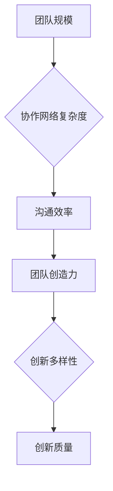

#### 算法原理讲解
为了提高团队创造力，我们可以采用以下算法原理：

1. **核心团队法**：将团队划分为若干个核心小组，每个小组专注于特定领域，从而降低整体沟通成本，提高创造力。
2. **轮换机制**：定期轮换团队成员，确保团队内部的多元化和新思想的引入。

### 领导风格与创造力

#### 背景介绍
领导风格对团队创造力有着重要影响。权威型领导可能会限制团队成员的自主性和创新思维，而民主型领导则更倾向于鼓励团队成员参与决策和提出建议。

#### 核心概念与联系
领导风格与团队创造力的关系可以用领导行为理论来解释。权威型领导可能会通过严格的规章制度和控制来维护团队秩序，但这也可能抑制团队成员的创造力和积极性。相反，民主型领导通过鼓励开放沟通和团队成员的参与，激发团队的创造潜能。

#### 算法原理讲解
以下是几种领导风格对团队创造力的影响算法原理：

1. **激励算法**：民主型领导通过设置奖励机制来激励团队成员提出创新想法，从而提高团队创造力。
2. **反馈机制**：权威型领导通过定期反馈和指导来帮助团队成员修正和改进他们的想法，以提高创新质量。

### 外部环境与创造力

#### 背景介绍
外部环境对团队创造力有着不可忽视的影响。市场变化、竞争压力和资源限制等因素都可能对团队创造力产生负面影响。

#### 核心概念与联系
外部环境与团队创造力的关系可以用环境适应理论来解释。团队需要具备快速适应外部环境变化的能力，以保持创造力和市场竞争力。以下是一个简化的Mermaid流程图，展示了外部环境与团队创造力之间的关系：

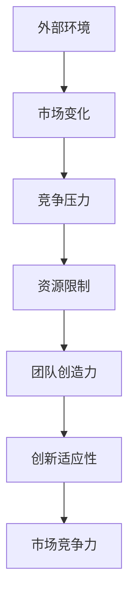

#### 算法原理讲解
为了提高团队在复杂外部环境下的创造力，我们可以采用以下算法原理：

1. **敏捷开发**：采用敏捷开发方法，快速响应市场变化，确保团队始终保持创新活力。
2. **资源优化**：通过资源调配和优先级管理，确保团队在资源有限的情况下依然能够产生高质量的创新成果。

### 团队协作方式与创造力

#### 背景介绍
团队协作方式对团队创造力有着直接的影响。传统的层级式协作可能导致信息不畅和决策延迟，而扁平化的协作方式则更加灵活和高效。

#### 核心概念与联系
团队协作方式与团队创造力的关系可以用网络协作理论来解释。扁平化的协作方式通过消除层级壁垒，促进信息流通和知识共享，从而提高团队创造力。以下是一个简化的Mermaid流程图，展示了团队协作方式与团队创造力之间的关系：

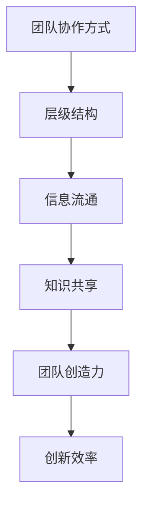

#### 算法原理讲解
以下是几种团队协作方式对团队创造力的影响算法原理：

1. **知识共享平台**：建立共享平台，如知识库、协作工具等，促进团队成员之间的信息交流和知识共享。
2. **跨部门协作**：通过跨部门项目或团队，引入外部视角和不同领域的专业知识，激发创新思维。

通过上述分析，我们可以看出，团队创造力面临多种挑战，包括团队规模、领导风格、外部环境和团队协作方式等。理解这些挑战并采取相应的策略，是提高团队创造力的关键。

## 三、心态与创造力

### 固定型心态与成长型心态

#### 背景介绍
心态是影响团队创造力的重要因素。固定型心态认为能力和智慧是固定的，无法改变，因此倾向于避免失败和挑战。相反，成长型心态认为能力和智慧可以通过努力和学习不断进步，因此更愿意接受挑战和尝试新事物。

#### 核心概念与联系
固定型心态和成长型心态对团队创造力的影响可以用心理学中的成长理论来解释。固定型心态可能导致团队成员害怕失败、缺乏自信和创新能力，从而抑制团队创造力。而成长型心态则能够激发团队成员的积极性和创新潜力，促进团队创造力的发展。

以下是一个简化的Mermaid流程图，展示了固定型心态与成长型心态对团队创造力的影响：

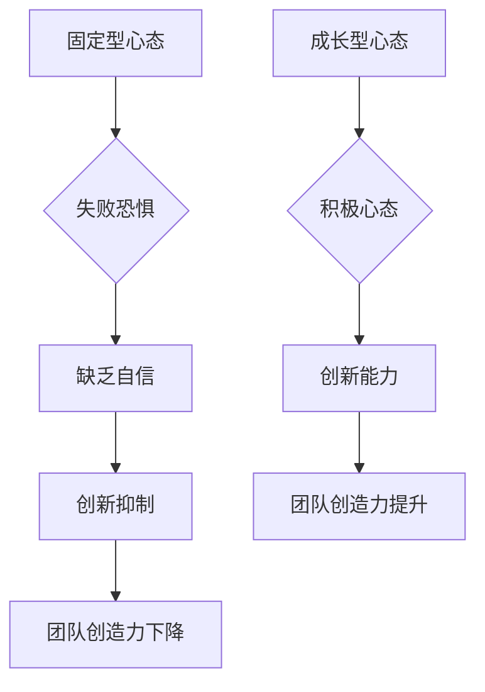

#### 算法原理讲解
以下是几种转变心态的方法，以提高团队创造力：

1. **正面反馈**：通过正面反馈和认可，增强团队成员的自信心和成长型心态。
2. **学习机会**：提供持续学习和发展的机会，帮助团队成员建立成长型心态。

### 如何从固定型心态转变为成长型心态

#### 背景介绍
许多团队成员可能发现自己更倾向于固定型心态，这是由于长期的教育、职业经历和社会影响。要转变心态，需要一系列的策略和方法。

#### 核心概念与联系
转变心态的方法包括自我反思、积极学习、接受失败和挑战等。以下是一个简化的Mermaid流程图，展示了从固定型心态转变为成长型心态的步骤：

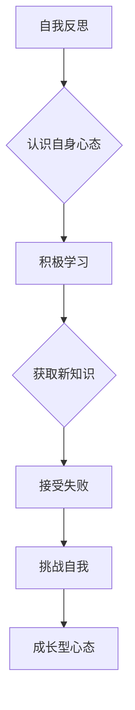

#### 算法原理讲解
以下是具体的转变方法：

1. **自我反思**：定期进行自我反思，识别自己的固定型心态，并思考如何转变。
2. **积极学习**：通过参加培训、阅读书籍、参与研讨会等方式，不断学习新知识和技能。
3. **接受失败**：将失败视为学习的机会，从中吸取经验教训，不断提升自己。
4. **挑战自我**：主动接受新的挑战，尝试新的任务和项目，以培养成长型心态。

通过上述方法，团队成员可以逐步从固定型心态转变为成长型心态，从而提高团队创造力。

### 团队心态建设的重要性

#### 背景介绍
团队心态建设是提高团队创造力的重要一环。一个积极、健康的团队心态能够促进团队成员之间的沟通和协作，激发创新思维。

#### 核心概念与联系
团队心态建设包括建立积极的团队文化、促进团队成员之间的信任和合作等。以下是一个简化的Mermaid流程图，展示了团队心态建设对团队创造力的积极影响：

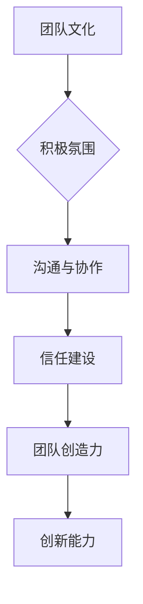

#### 算法原理讲解
以下是几种团队心态建设的方法：

1. **定期团建**：通过团队建设活动，增强团队成员之间的情感联系和信任。
2. **领导力培训**：提供领导力培训，帮助领导者建立积极的团队文化和促进团队成员的成长。

通过团队心态建设，企业可以创造一个支持创新和成长的团队环境，从而提高团队创造力。

### 总结
心态对团队创造力有着重要影响。固定型心态可能抑制创造力，而成长型心态则能够激发创新思维。通过自我反思、积极学习和接受失败等方法，团队成员可以逐步转变心态，提高团队创造力。同时，团队心态建设也是提高团队创造力的关键因素。企业可以通过建立积极文化和促进信任建设，打造一个支持创新和成长的团队环境。

## 四、创新技术与工具

### 创新技术的定义与作用

#### 定义
创新技术是指应用于团队创造力和创新过程中的各种方法、工具和平台。这些技术旨在帮助团队成员更好地沟通、协作和产生新的想法。

#### 作用
创新技术在团队创造力中发挥着重要作用，主要包括以下几个方面：

1. **促进知识共享**：通过创新技术，团队成员可以轻松分享知识、经验和见解，从而激发新的创意。
2. **提高协作效率**：创新技术提供了高效的协作平台，使团队成员能够更快速地沟通和合作，缩短创新周期。
3. **激发创新思维**：创新技术如思维导图、设计思维等，可以引导团队成员进行系统化的思考，从而产生更多的创新想法。

### 通用创新工具及其应用

#### 1. 思维导图（Mind Mapping）

##### 背景介绍
思维导图是一种图形化的工具，用于组织和表达思维过程。它通过连接关键词、图像和颜色等元素，帮助团队成员梳理思路、激发创意。

##### 应用场景
- **项目规划**：用于制定项目计划、梳理项目需求。
- **问题解决**：用于分析问题、找到解决方案。
- **知识共享**：用于记录和分享团队成员的知识和经验。

##### 算法原理讲解
思维导图的构建过程如下：

1. **确定中心主题**：在思维导图的中心位置写下或绘制中心主题。
2. **添加分支**：围绕中心主题，添加相关的子主题和关键词。
3. **连接分支**：通过线条将相关的分支连接起来，形成一个有结构的思维导图。

以下是一个简化的思维导图示例：

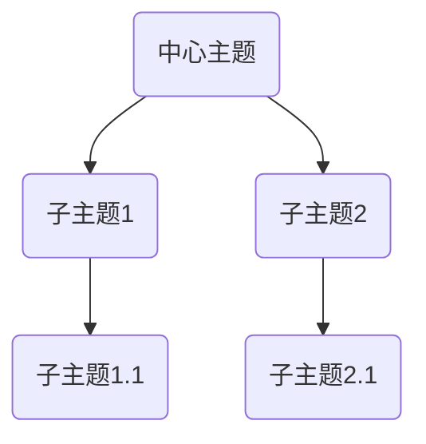

#### 2. 设计思维（Design Thinking）

##### 背景介绍
设计思维是一种以人为本的创新方法，强调通过用户研究和迭代反馈来解决问题和创造价值。它分为五个阶段：共鸣（Empathize）、定义（Define）、构思（Ideate）、原型（Prototype）和测试（Test）。

##### 应用场景
- **产品开发**：用于设计新产品或改进现有产品。
- **服务设计**：用于优化服务流程和提高用户体验。
- **团队协作**：用于解决团队内部的问题和提升工作效率。

##### 算法原理讲解
设计思维的流程如下：

1. **共鸣**：深入了解用户的需求和问题。
2. **定义**：明确要解决的问题和目标。
3. **构思**：生成多个解决方案的创意。
4. **原型**：构建并测试初步的原型。
5. **测试**：通过用户反馈不断迭代和优化原型。

以下是一个简化的设计思维流程图：

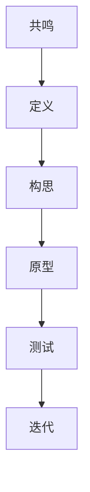

#### 3. Scratch编程语言

##### 背景介绍
Scratch是一种可视化编程语言，特别适合初学者和学习者使用。它通过积木式的编程模块，帮助用户理解和应用编程概念。

##### 应用场景
- **编程教育**：用于教授编程基础和算法思维。
- **创意表达**：用于制作动画、游戏和交互式故事。
- **团队协作**：用于团队项目中的代码协作和任务分配。

##### 算法原理讲解
Scratch编程的基本原理包括：

1. **积木模块**：通过拖放积木模块来编写程序。
2. **事件驱动**：程序基于事件（如鼠标点击、键盘输入等）触发执行。
3. **模块化编程**：将程序划分为不同的模块，便于管理和复用。

以下是一个简单的Scratch程序示例：

```python
when Green Flag clicked
say "Hello, world!" for (3) seconds
```

#### 4. Git版本控制系统

##### 背景介绍
Git是一种分布式版本控制系统，用于跟踪源代码历史和协作开发。它支持快速、高效和安全的代码管理。

##### 应用场景
- **软件开发**：用于管理代码库、跟踪版本和协作开发。
- **文档管理**：用于维护项目文档和设计文件。
- **团队协作**：用于团队项目中的代码评审和任务分配。

##### 算法原理讲解
Git的主要功能包括：

1. **提交**：将代码更改保存到本地仓库。
2. **推送**：将本地仓库的更改发送到远程仓库。
3. **拉取**：从远程仓库获取其他人的更改。
4. **分支管理**：创建、合并和删除分支，以便于并行开发。

以下是一个简化的Git操作流程：

```bash
git init                  # 初始化本地仓库
git add .                # 添加所有文件到暂存区
git commit -m "initial commit"  # 提交更改
git remote add origin <repository_url>  # 添加远程仓库
git push -u origin master  # 推送更改到远程仓库
```

通过上述创新技术和工具，团队可以更好地沟通、协作和激发创新思维，从而提高整体创造力。

### 总结
创新技术与工具是团队创造力的重要组成部分。思维导图、设计思维、Scratch编程语言和Git等工具，可以帮助团队成员更高效地沟通、协作和产生新的创意。通过理解和应用这些技术，团队可以打破思维局限，提高创造力，从而在竞争激烈的市场中脱颖而出。

## 五、领导力与创造力

### 领导风格对团队创造力的影响

#### 背景介绍
领导风格是领导者管理团队、处理问题的行为和态度模式。不同的领导风格会对团队创造力产生不同的影响。通常，领导风格可以分为三种类型：权威型、民主型和参与型。

#### 核心概念与联系
权威型领导强调集中决策和控制，可能导致团队成员的自主性和创新能力受到限制。民主型领导鼓励团队成员参与决策，提供更多的自由和灵活性，有助于激发团队创造力。参与型领导则更加注重团队协作和共同决策，能够最大程度地发挥团队成员的潜力。

以下是一个简化的Mermaid流程图，展示了不同领导风格对团队创造力的影响：

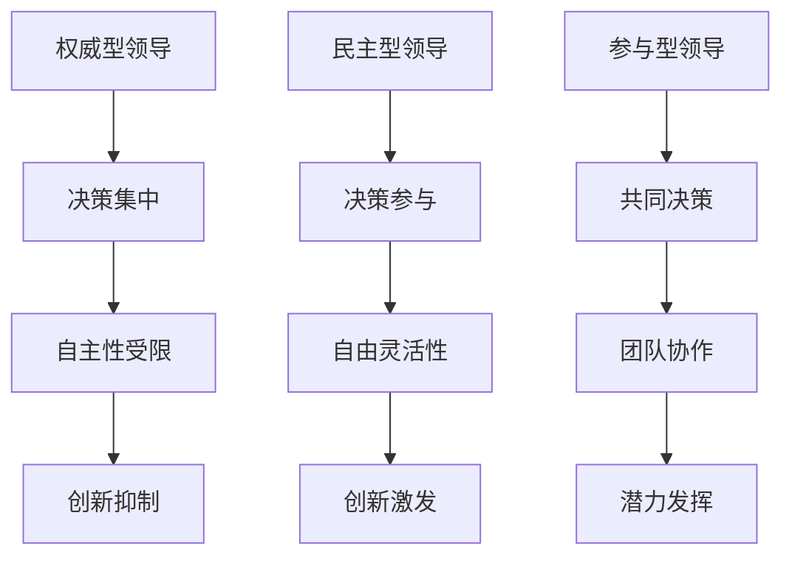

#### 算法原理讲解
以下是几种领导风格对团队创造力的影响算法原理：

1. **权威型领导**：通过强化管理制度和规范，确保团队在高度结构化的环境中运作，但可能抑制团队成员的自主性和创新思维。
2. **民主型领导**：通过定期召开团队会议、收集成员意见和反馈，激发团队成员的参与感和创造力。
3. **参与型领导**：通过鼓励团队成员共同参与决策和项目管理，建立信任和共同目标，从而提高团队创造力和创新能力。

### 领导者在激发团队创造力中的作用

#### 背景介绍
领导者在团队创造力中扮演着至关重要的角色。他们不仅需要制定策略和目标，还要为团队成员提供支持和资源，激发他们的创新潜力。

#### 核心概念与联系
领导者在激发团队创造力中的作用主要包括以下几个方面：

1. **提供清晰的目标和愿景**：领导者需要明确团队的目标和愿景，为团队成员指明方向，激发他们的创造力和积极性。
2. **建立支持创新的团队文化**：领导者需要建立一种鼓励创新和失败容忍的文化，让团队成员感到安全和有动力去尝试新事物。
3. **提供资源和培训**：领导者需要为团队成员提供必要的资源和培训，帮助他们掌握新技能和知识，从而提高创新能力。

以下是一个简化的Mermaid流程图，展示了领导者在激发团队创造力中的作用：

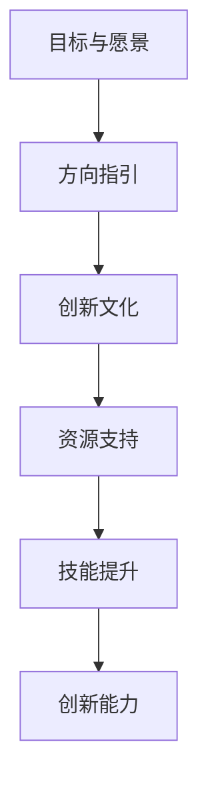

#### 算法原理讲解
以下是领导者在激发团队创造力中可以采取的具体措施：

1. **目标与愿景**：通过定期的团队会议和沟通，明确团队的目标和愿景，确保团队成员对团队的方向有清晰的认识。
2. **创新文化**：通过鼓励团队成员分享创意、接受失败和提供反馈，建立一种支持创新的团队文化。
3. **资源支持**：通过提供必要的资金、技术支持和培训，帮助团队成员掌握新技能和知识，提高创新能力。
4. **技能提升**：通过组织内部培训和外部学习机会，帮助团队成员不断提升个人技能和知识水平，为团队创造力提供坚实的基础。

### 领导者如何激励团队成员

#### 背景介绍
领导者需要激励团队成员，激发他们的内在动力和创新能力。激励方法多种多样，包括物质激励、精神激励和参与式激励等。

#### 核心概念与联系
激励方法的选择应与团队成员的个人需求和团队目标相结合。物质激励如奖金和晋升可以提供短期动力，而精神激励如认可和奖励可以提供长期的内在动力。参与式激励如提供决策参与机会和项目负责权，可以增强团队成员的责任感和归属感。

以下是一个简化的Mermaid流程图，展示了不同的激励方法及其对团队创造力的影响：

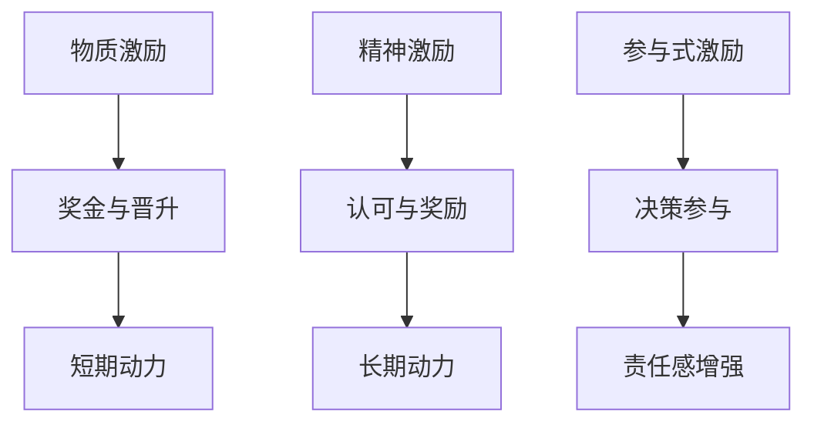

#### 算法原理讲解
以下是领导者可以采取的具体激励方法：

1. **物质激励**：通过奖金、晋升和其他福利，提供短期动力和激励。
2. **精神激励**：通过公开表扬、感谢信和其他形式的认可，提供长期内在动力。
3. **参与式激励**：通过提供项目负责权、参与决策过程和提供反馈机会，增强团队成员的责任感和归属感。

### 总结
领导者在激发团队创造力中发挥着至关重要的作用。通过提供清晰的目标和愿景、建立支持创新的文化、提供资源和培训以及采取有效的激励方法，领导者可以激发团队成员的内在动力和创新能力，从而提高团队创造力。不同的领导风格和激励方法应根据团队的具体情况和目标进行选择和应用。

## 六、技术对团队创造力的支持

### 背景介绍
在当今数字化时代，技术已经成为团队创造力不可或缺的推动力量。通过使用合适的工具和平台，团队可以更加高效地协作、创新和实现目标。以下是一些关键技术及其在团队创造力中的具体应用。

### 1. 云计算平台

#### 功能与应用
云计算平台如AWS、Azure和Google Cloud提供了强大的计算、存储和数据处理能力，使得团队可以轻松地访问和处理大量数据，从而激发创新。

#### 实际案例
- **案例分析**：某科技公司通过使用AWS的云计算服务，构建了一个高效的数据分析平台，帮助团队成员快速处理和分析大数据，从而找到新的商业机会。
- **代码示例**：

```python
import boto3

# 初始化AWS S3客户端
s3_client = boto3.client('s3')

# 上传文件到S3
s3_client.upload_file('local_file.csv', 'my_bucket', 'data.csv')

# 下载文件从S3
s3_client.download_file('my_bucket', 'data.csv', 'local_file.csv')
```

### 2. 团队协作工具

#### 功能与应用
团队协作工具如Slack、Trello和Asana等，为团队成员提供了一个集中的沟通和任务管理平台，提高了协作效率和创造力。

#### 实际案例
- **案例分析**：某创业团队使用Trello进行项目管理，通过创建不同的看板和卡片，清晰地跟踪项目进展和任务分配，提高了团队协作效率。
- **代码示例**：

```javascript
// 使用Slack API发送消息
const axios = require('axios');

const slackMessage = {
  text: 'New task created!',
  channels: '#general',
};

axios.post('https://slack.com/api/chat.postMessage', slackMessage)
  .then(response => console.log('Message sent:', response.data))
  .catch(error => console.error('Error sending message:', error));
```

### 3. 人工智能与机器学习

#### 功能与应用
人工智能和机器学习技术可以处理复杂的任务，如预测分析、自动化决策和智能推荐等，为团队创造力提供强大的支持。

#### 实际案例
- **案例分析**：某电商平台使用机器学习算法分析用户行为数据，预测购买趋势，从而优化库存管理和营销策略，提高销售额。
- **代码示例**：

```python
import pandas as pd
from sklearn.model_selection import train_test_split
from sklearn.ensemble import RandomForestClassifier

# 读取数据
data = pd.read_csv('customer_data.csv')

# 分割数据为特征和目标
X = data.drop('target', axis=1)
y = data['target']

# 划分训练集和测试集
X_train, X_test, y_train, y_test = train_test_split(X, y, test_size=0.2, random_state=42)

# 训练模型
model = RandomForestClassifier(n_estimators=100)
model.fit(X_train, y_train)

# 预测测试集
predictions = model.predict(X_test)

# 评估模型
accuracy = model.score(X_test, y_test)
print('Model accuracy:', accuracy)
```

### 4. 协作式设计工具

#### 功能与应用
协作式设计工具如Figma和Adobe XD，为团队成员提供了一个实时协作和反馈的平台，有助于快速原型设计和迭代。

#### 实际案例
- **案例分析**：某产品团队使用Figma进行界面设计，通过实时协作和即时反馈，缩短了设计到产品发布的时间。
- **代码示例**：

```javascript
// 使用Figma API创建文件
const axios = require('axios');

const figmaData = {
  name: 'Design File',
  desc: 'A collaborative design file',
  role: 'TEAM',
};

axios.post('https://api.figma.com/v1/files', figmaData, {
  headers: {
    'X-Figma-Token': 'your_api_token',
  },
})
  .then(response => console.log('File created:', response.data))
  .catch(error => console.error('Error creating file:', error));
```

### 总结
技术为团队创造力提供了强大的支持，从云计算平台、团队协作工具到人工智能和协作式设计工具，每一种技术都在不同层面提高了团队的协作效率和创造力。通过合理利用这些技术，团队可以更加高效地实现目标，推动创新。

## 七、个人成长与团队创造力

### 个人成长的重要性

#### 背景介绍
个人成长是团队创造力的重要基础。一个团队成员的个人成长不仅能够提升自身的技能和知识，还能够为团队带来新的视角和创新点。个人成长主要体现在以下几个方面：

1. **知识扩展**：通过不断学习和掌握新知识，团队成员能够拓展视野，提高解决问题的能力。
2. **技能提升**：通过实践和培训，团队成员可以提升专业技能，从而在团队项目中发挥更大的作用。
3. **经验积累**：通过实际工作，团队成员可以积累宝贵的经验，提高问题解决和项目管理的效率。

#### 核心概念与联系
个人成长与团队创造力之间的关系可以用系统动力学来解释。个人成长不仅为团队成员提供了新的知识和技能，还增强了团队成员之间的协作效率和创新能力。以下是一个简化的Mermaid流程图，展示了个人成长与团队创造力之间的关系：

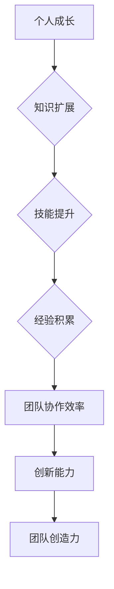

#### 算法原理讲解
以下是几种个人成长的方法，以促进团队创造力：

1. **持续学习**：通过参加在线课程、阅读专业书籍和参加行业会议，不断更新知识和技能。
2. **实践应用**：通过实际项目和工作任务，将学到的知识应用到实践中，提高解决问题的能力。
3. **反思总结**：通过定期反思和总结，分析工作中的经验和教训，不断提高个人成长速度。

### 个人技能提升对团队创造力的贡献

#### 背景介绍
个人技能的提升对团队创造力有着直接的贡献。一个团队成员的个人技能越强，越能够为团队带来新的视角和解决方案，从而提高团队的整体创造力。

#### 核心概念与联系
个人技能提升与团队创造力之间的关系可以用复杂系统理论来解释。在复杂系统中，每个组件（即团队成员）的能力和性能都会对整个系统的功能产生影响。个人技能的提升不仅提高了团队成员的个体能力，还增强了团队整体的协作效率和创新能力。以下是一个简化的Mermaid流程图，展示了个人技能提升与团队创造力之间的关系：

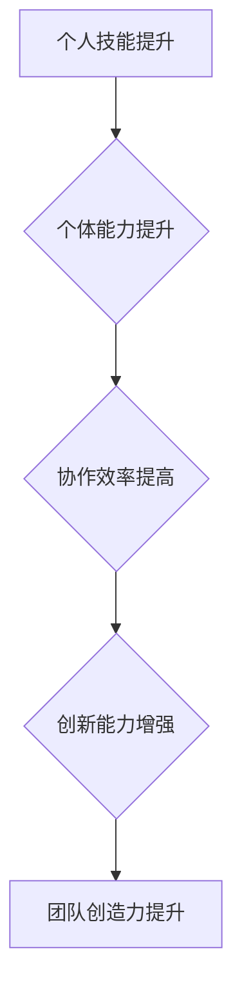

#### 算法原理讲解
以下是几种个人技能提升的方法，以促进团队创造力：

1. **专业培训**：通过参加专业培训课程，系统性地提升专业技能。
2. **实战经验**：通过实际项目和工作任务，不断积累实战经验，提高解决复杂问题的能力。
3. **跨领域学习**：通过学习其他领域的知识和技能，拓宽视野，为团队带来新的创新思路。

### 如何通过个人成长促进团队创造力

#### 背景介绍
个人成长不仅仅是个人能力的提升，更是对团队整体创造力的推动。通过个人成长，团队成员可以更好地理解和应用各种创新技术和工具，从而提高团队的整体创造力。

#### 核心概念与联系
个人成长与团队创造力之间的关系可以用网络协同效应理论来解释。在网络协同效应中，每个节点（即团队成员）的能力和贡献都会通过网络效应放大，从而提高整个系统的整体性能。以下是一个简化的Mermaid流程图，展示了个人成长如何促进团队创造力：

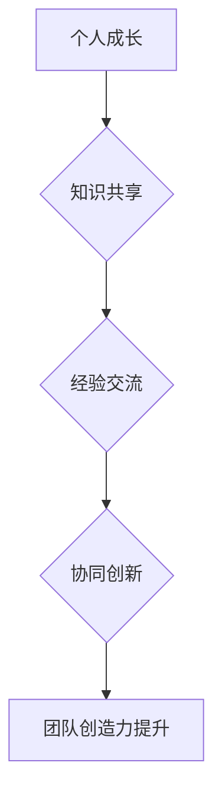

#### 算法原理讲解
以下是几种通过个人成长促进团队创造力的方法：

1. **知识共享**：通过定期组织知识分享会议和研讨会，促进团队成员之间的知识交流，提高整体创新水平。
2. **经验交流**：通过实际项目和任务中的经验交流，帮助团队成员相互学习，共同成长。
3. **协同创新**：通过跨部门和跨职能团队的合作，促进不同领域的知识和技能的整合，从而激发新的创意和解决方案。

### 总结
个人成长是团队创造力的重要推动力。通过知识扩展、技能提升和经验积累，团队成员可以提升自身能力，从而为团队带来新的视角和创新点。个人成长不仅促进了团队成员的个体发展，还提高了团队整体的协作效率和创新能力，从而推动了团队创造力的提升。

## 八、结论与未来展望

### 总结
本文系统地探讨了团队创造力激发的方法，特别是在突破思维局限方面的策略。通过分析心态、技术和领导力等因素，本文提供了一系列实用的方法和技巧，帮助企业团队实现创新和高效的工作方式。核心内容主要包括：

1. **团队创造力的定义与重要性**：团队创造力是指通过团队成员的创新思维和协作，产生新的想法、解决方案或产品。它对企业的市场竞争优势、持续发展动力、员工满意度和组织学习与成长具有重要作用。

2. **心态与创造力**：心态对团队创造力有重要影响。固定型心态可能抑制创造力，而成长型心态则能够激发创新思维。通过自我反思、积极学习和接受失败等方法，团队成员可以逐步转变心态，提高团队创造力。

3. **创新技术与工具**：创新技术如思维导图、设计思维、Scratch编程语言和Git等，为团队提供了高效的协作和创新的平台，提高了团队的创造力。

4. **领导力在创造力激发中的作用**：领导者通过提供清晰的目标和愿景、建立支持创新的文化、提供资源和培训以及采取有效的激励方法，可以激发团队成员的内在动力和创新能力，从而提高团队创造力。

5. **技术对团队创造力的支持**：云计算平台、团队协作工具、人工智能与机器学习、协作式设计工具等技术为团队提供了强大的支持，提高了协作效率和创造力。

6. **个人成长与团队创造力**：个人成长是团队创造力的重要基础。通过知识扩展、技能提升和经验积累，团队成员可以提升自身能力，从而为团队带来新的视角和创新点。

### 未来展望
未来，团队创造力的研究和发展将主要集中在以下几个方面：

1. **个性化创新管理**：随着技术的发展，未来的创新管理将更加注重个性化，根据团队成员的特点和需求，提供定制化的培训和激励措施，从而提高团队创造力。

2. **跨领域创新合作**：跨领域的合作将越来越普遍，不同领域知识和技能的融合将激发新的创意和解决方案，推动团队创造力的发展。

3. **数字化创新生态系统**：数字化工具和平台将更加普及，形成支持创新的生态系统，提供更加灵活和高效的协作环境。

4. **持续学习的文化**：企业将更加重视持续学习，通过在线课程、研讨会和内部培训等方式，不断提升团队成员的技能和知识，为团队创造力提供持续的动力。

通过上述未来展望，企业可以更好地理解和应对不断变化的市场和技术环境，持续激发团队创造力，保持竞争优势。

## 附录

### 拓展阅读

1. **《创新者的思考方式》** - 克里斯·格里菲斯
   - 本书详细介绍了创新者如何通过不同的思维方式和策略来激发创意，适用于企业团队和个人成长。

2. **《设计思维》** - 戴夫·布恩
   - 设计思维是一种以人为本的创新方法，通过用户研究和迭代反馈，帮助团队产生创新的解决方案。

3. **《创新者的DNA》** - 史蒂芬·霍金、莱昂纳德·蒙洛迪诺
   - 本书探讨了创新者的心理特质和思维方式，为团队如何培养和激发创造力提供了有价值的见解。

### 使用模板与工具

1. **思维导图模板** - 启迪思维网
   - 提供多种思维导图模板，帮助团队成员进行思路梳理和创意生成。

2. **设计思维工作坊** - IDEO
   - IDEO提供的设计思维工作坊模板，适用于团队开展创新项目。

3. **Git分支管理模板** - GitHub
   - GitHub上的Git分支管理模板，帮助团队高效地进行代码协作和任务分配。

### 最佳实践建议

1. **定期团建活动**：定期组织团队建设活动，增强团队成员之间的信任和沟通。

2. **知识共享会议**：定期召开知识共享会议，促进团队成员之间的经验交流和知识传递。

3. **创新激励机制**：建立创新激励机制，鼓励团队成员提出新的创意和解决方案。

### 注意事项

1. **避免过度竞争**：过度竞争可能导致团队成员之间的紧张关系，影响团队合作和创造力。

2. **关注团队成员心理健康**：确保团队成员在工作中保持良好的心理健康，避免压力过大。

3. **平衡创新与风险管理**：在推动创新的同时，注意风险控制，确保创新的可行性和实用性。

通过以上拓展阅读、工具模板、最佳实践建议和注意事项，企业团队可以更好地激发创造力，实现持续创新和发展。

