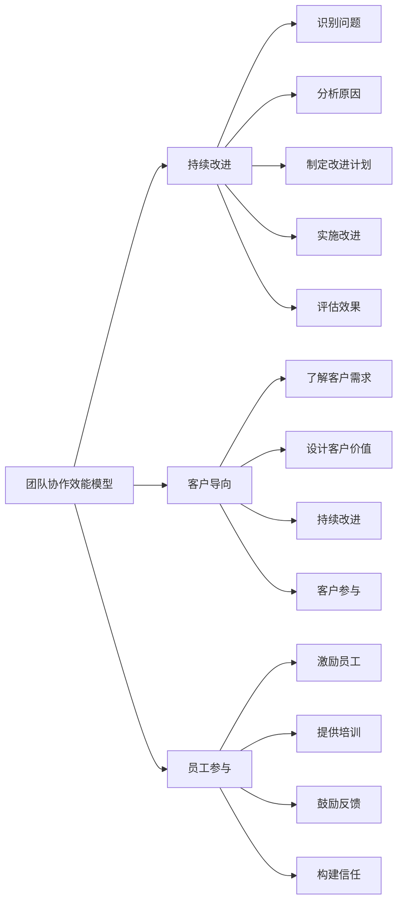

                 

### 团队协作效能优化：精益管理在团队中的应用

#### 关键词：
团队协作、效能优化、精益管理、敏捷开发、持续改进、流程优化、工具与方法

#### 摘要：
本文深入探讨了团队协作效能优化的问题，并提出了精益管理在团队中的应用策略。通过分析精益管理的起源、原则和实践，结合团队协作中的实际问题与挑战，本文详细阐述了精益管理在提高团队协作效能中的关键作用。通过案例分析和实战应用，本文为企业和团队提供了具体可行的优化方案，并展望了未来发展趋势。

### 目录大纲

#### 第一部分：引言

1. **引言**
   - **1.1 团队协作效能的重要性**
   - **1.2 精益管理的理念与价值**
   - **1.3 本书的目的与结构**

2. **精益管理基础**
   - **2.1 精益管理的起源与原则**
   - **2.2 精益管理的关键实践**

#### 第二部分：精益管理在团队协作中的应用

3. **团队协作中的问题与挑战**
   - **3.1 团队协作中的常见问题**
   - **3.2 精益管理如何应对挑战**

4. **精益管理在团队协作中的核心概念与联系**
   - **4.1 团队协作效能模型**
   - **4.2 Mermaid流程图展示**

5. **精益管理在团队协作中的应用实例**
   - **5.1 精益管理工具介绍**
   - **5.2 实际案例解析**

6. **团队协作效能优化的案例分析**
   - **6.1 国内企业成功案例**
   - **6.2 国际企业借鉴**

#### 第三部分：精益管理工具与资源

7. **精益管理工具与方法**
   - **7.1 敏捷开发工具**
   - **7.2 持续改进工具**

8. **总结与展望**
   - **8.1 团队协作效能优化的关键要素**
   - **8.2 未来发展趋势**
   - **8.3 建议与展望**

### 正文

#### 第一部分：引言

##### 1.1 团队协作效能的重要性

团队协作在现代企业和组织中扮演着至关重要的角色。高效的团队协作能够提高工作效率、促进创新、增强企业竞争力。然而，在实际操作中，团队协作效能往往受到诸多因素的影响，如沟通不畅、权责不明、目标不统一等。因此，提升团队协作效能成为企业和团队需要面对的紧迫问题。

团队协作效能的定义可以从多个角度进行理解。从组织层面来看，团队协作效能指的是团队成员在共同目标下，通过有效沟通、合作与协作，实现工作目标的能力。从个人层面来看，团队协作效能则关注个人在团队中的表现，包括沟通能力、合作精神、解决问题的能力等。

团队协作在企业和组织中的作用主要体现在以下几个方面：

1. **提高工作效率**：通过团队协作，可以充分发挥每个人的优势，实现资源的最优配置，从而提高整体工作效率。
2. **促进创新**：团队协作鼓励知识共享和思维碰撞，有助于激发创新思维，推动企业的持续创新。
3. **增强企业竞争力**：高效的团队协作能够提高企业的响应速度和市场适应能力，增强企业的竞争力。

提高团队协作效能对企业发展的意义重大。首先，高效的团队协作能够提高企业的生产力和竞争力，促进企业快速发展。其次，团队协作能够提升员工的满意度和忠诚度，降低员工流失率，从而降低企业的招聘和培训成本。最后，高效的团队协作有助于形成良好的企业文化，增强企业的凝聚力和向心力。

##### 1.2 精益管理的理念与价值

精益管理（Lean Management）起源于日本丰田汽车公司的精益生产（Lean Production），是一种以最小化浪费、最大化价值为核心的经营管理理念。精益管理的核心原则包括价值、流程、客户、员工等，旨在通过持续改进和优化，提高组织整体的运营效率和质量。

精益管理的起源可以追溯到20世纪50年代的日本，当时丰田汽车公司开始探索一种不同于福特生产方式的经营管理模式。通过引入“拉动生产”和“连续改进”等理念，丰田公司成功实现了生产效率的大幅提升，从而奠定了精益管理的基础。随着精益管理理念在全球范围内的传播和应用，它已经成为一种广泛认可的经营管理模式。

精益管理的核心价值主要体现在以下几个方面：

1. **提高运营效率**：精益管理通过消除浪费、优化流程，提高生产效率和资源利用率，从而降低成本、提高产品质量。
2. **增强客户满意度**：精益管理注重客户需求和反馈，通过持续改进产品和服务，提高客户满意度。
3. **提升员工参与度**：精益管理强调员工参与和自主管理，提高员工的积极性和创造力。
4. **促进持续改进**：精益管理鼓励持续改进和创新，推动组织的不断进步和发展。

精益管理在提高团队协作效能中的作用不可忽视。首先，精益管理通过优化流程和消除浪费，提高了团队的工作效率，减少了无效的工作环节。其次，精益管理强调客户需求为导向，促进了团队与客户之间的紧密沟通，增强了团队的目标一致性和协作能力。此外，精益管理注重员工参与和自主管理，提高了员工的积极性和满意度，进一步增强了团队的凝聚力和执行力。

##### 1.3 本书的目的与结构

本书旨在探讨团队协作效能优化的问题，并介绍精益管理在团队协作中的应用策略。全书分为三个部分：

第一部分：引言，介绍了团队协作效能的重要性以及精益管理的理念和价值。

第二部分：精益管理在团队协作中的应用，详细阐述了精益管理在团队协作中的核心概念、具体实践和案例分析。

第三部分：精益管理工具与资源，介绍了精益管理中的常用工具和方法，以及如何在实际工作中应用这些工具。

通过本书的学习，读者可以系统地了解精益管理的基本理论和实践方法，掌握团队协作效能优化的核心技能，为企业和团队的发展提供有力支持。

### 第二部分：精益管理基础

#### 2.1 精益管理的起源与原则

精益管理（Lean Management）起源于日本的丰田汽车公司，起源于20世纪50年代。当时，丰田公司面临着福特生产方式带来的高库存、高浪费和低效率的问题。为了解决这些问题，丰田公司开始探索一种不同于福特生产方式的经营管理模式，即精益生产（Lean Production）。通过引入“拉动生产”和“连续改进”等理念，丰田公司成功实现了生产效率的大幅提升，从而奠定了精益管理的基础。

精益管理的核心理念是“以最小化浪费、最大化价值为核心”。它强调通过消除浪费、优化流程，提高生产效率和资源利用率，从而降低成本、提高产品质量。精益管理的原则主要包括以下几个方面：

1. **价值**：精益管理以客户需求为导向，关注为客户创造价值的每一个环节。
2. **流程**：精益管理强调优化流程，消除浪费，确保流程的顺畅和高效。
3. **客户**：精益管理注重客户需求和反馈，通过持续改进产品和服务，提高客户满意度。
4. **员工**：精益管理鼓励员工参与和自主管理，提高员工的积极性和创造力。
5. **持续改进**：精益管理倡导持续改进，不断优化工作流程和产品，推动组织的不断进步和发展。

#### 2.2 精益管理的关键实践

精益管理在实践中形成了一系列关键实践，包括流程优化、持续改进、客户导向等。以下将详细介绍这些关键实践。

##### 2.2.1 流程优化

流程优化是精益管理的核心实践之一。通过流程优化，企业可以消除不必要的环节和活动，提高流程的效率和灵活性。流程优化的步骤通常包括：

1. **识别现有流程**：首先，需要明确现有的工作流程，包括各个环节和活动。
2. **分析流程**：对现有流程进行分析，识别其中的浪费和瓶颈，如库存过多、等待时间过长等。
3. **设计新流程**：根据分析结果，设计新的流程，消除浪费和瓶颈，确保流程的顺畅和高效。
4. **实施新流程**：将新的流程付诸实施，并进行必要的调整和优化。

通过流程优化，企业可以大幅提高生产效率和资源利用率，降低成本，提高产品质量。

##### 2.2.2 持续改进

持续改进是精益管理的另一个核心实践。持续改进旨在通过不断优化工作流程和产品，推动组织的不断进步和发展。持续改进的步骤通常包括：

1. **设立目标**：明确改进的目标和期望结果。
2. **数据收集与分析**：收集相关数据，对现有工作流程和产品进行分析，识别改进的机会。
3. **制定改进计划**：根据分析结果，制定具体的改进计划。
4. **实施改进**：将改进计划付诸实施，并进行监控和评估。
5. **评估与反馈**：对改进效果进行评估，收集反馈意见，为下一轮改进提供参考。

通过持续改进，企业可以不断提高工作效率和质量，增强市场竞争力。

##### 2.2.3 客户导向

客户导向是精益管理的另一个重要原则。精益管理强调以客户需求为导向，关注为客户创造价值的每一个环节。客户导向的具体实践包括：

1. **了解客户需求**：通过市场调研、客户反馈等途径，了解客户的需求和期望。
2. **设计客户价值**：根据客户需求，设计产品和服务，确保满足客户的需求。
3. **持续改进**：根据客户反馈，持续改进产品和服务，提高客户满意度。
4. **客户参与**：鼓励客户参与产品和服务的设计、开发和使用，收集客户的反馈和建议。

通过客户导向，企业可以更好地满足客户需求，提高客户满意度，从而增强市场竞争力。

##### 2.2.4 精益工具与方法

精益管理在实践中形成了一系列工具和方法，包括看板管理、5S管理、TPM（全员生产维护）等。以下将简要介绍这些工具和方法。

1. **看板管理**：看板管理是一种基于可视化管理的工具，通过看板（Kanban板）来展示工作流程和进度，帮助团队成员清晰地了解工作内容和状态，从而提高协作效率。
2. **5S管理**：5S管理是一种现场管理方法，包括整理（Sort）、整顿（Set in order）、清扫（Shine）、清洁（Standardize）和素养（Sustain）。通过5S管理，企业可以优化工作环境，提高工作效率和质量。
3. **TPM**：TPM是一种全员生产维护的方法，旨在通过全员参与，提高设备的可靠性和利用率，降低设备故障率和停机时间。

通过运用这些精益工具和方法，企业可以进一步优化工作流程和产品，提高工作效率和质量，增强市场竞争力。

#### 总结

精益管理是一种以最小化浪费、最大化价值为核心的经营管理理念，起源于日本的丰田汽车公司。精益管理的基本原则包括价值、流程、客户、员工等，通过流程优化、持续改进、客户导向等关键实践，可以提高企业运营效率和质量。精益工具与方法如看板管理、5S管理、TPM等，为精益管理提供了具体实施手段。通过深入理解精益管理的基本理论和实践方法，企业和团队可以更好地优化工作流程和产品，提高协作效率和质量，实现持续发展。

### 第三部分：精益管理在团队协作中的应用

#### 3.1 团队协作中的问题与挑战

在团队协作中，企业和团队常常面临诸多问题和挑战，这些问题和挑战不仅影响团队的工作效率，还会制约团队的创新能力和竞争力。以下是团队协作中常见的几个问题与挑战：

##### 3.1.1 沟通不畅

沟通不畅是团队协作中最常见的问题之一。团队成员之间缺乏有效的沟通，导致信息传递不及时、不准确，从而影响工作的顺利进行。沟通不畅可能源于以下几个方面：

1. **沟通渠道不畅**：团队成员之间的沟通渠道不畅通，如缺乏固定的沟通平台或沟通频率不足。
2. **沟通方式不当**：团队成员使用不适当的沟通方式，如过于正式或过于随意，导致信息传递受阻。
3. **沟通障碍**：团队成员可能存在语言、文化背景等方面的差异，导致沟通不畅。

##### 3.1.2 权责不明

权责不明是团队协作中的另一个重大问题。当团队成员的职责和权限不清晰时，容易导致工作重叠或责任推诿，影响工作效率。权责不明可能源于以下几个方面：

1. **职责分配不明确**：团队成员的职责分工不清晰，导致工作责任不明，容易产生冲突。
2. **权限限制**：团队成员的权限受到限制，无法独立决策和执行任务，影响工作推进。
3. **角色模糊**：团队成员的角色定义不明确，导致职责重叠或责任缺失。

##### 3.1.3 目标不统一

团队目标不统一是团队协作中的常见问题。当团队成员对团队目标缺乏共识或目标不一致时，容易导致团队成员的工作方向和努力程度不一致，影响团队的整体绩效。目标不统一可能源于以下几个方面：

1. **目标设定不明确**：团队目标设定不具体、不明确，团队成员无法清晰理解自己的工作目标。
2. **目标不一致**：团队成员的个人目标与团队目标不一致，导致团队成员的努力方向不一致。
3. **目标管理不当**：团队目标管理不到位，缺乏有效的监督和激励，导致目标难以实现。

##### 3.1.4 知识共享不足

知识共享不足是影响团队协作效能的另一个重要因素。当团队成员之间的知识分享不充分时，容易导致信息孤岛，影响团队的创新能力和解决问题的能力。知识共享不足可能源于以下几个方面：

1. **知识壁垒**：团队成员之间存在知识壁垒，导致知识无法有效传递和共享。
2. **知识管理不善**：团队缺乏有效的知识管理体系，导致知识积累和传递不畅。
3. **知识分享意识不强**：团队成员缺乏主动分享知识的意识和习惯，导致知识共享不充分。

##### 3.1.5 团队协作效率低

团队协作效率低是团队协作中的常见问题，导致团队无法在预定时间内完成工作任务。团队协作效率低可能源于以下几个方面：

1. **工作流程不优化**：团队的工作流程不顺畅，存在较多的等待时间和无效工作环节。
2. **工具和方法不当**：团队使用的协作工具和方法不合适，导致工作效率低下。
3. **团队成员技能不匹配**：团队成员的技能和知识水平不匹配，导致任务分配不合理，影响工作效率。

##### 3.2 精益管理如何应对挑战

精益管理为解决团队协作中的问题提供了有效的解决方案。通过精益管理的核心原则和实践，企业可以优化团队协作流程，提高工作效率和质量，应对团队协作中的挑战。

1. **沟通不畅**

   - **建立有效的沟通渠道**：通过建立固定的沟通平台和沟通机制，确保团队成员之间的沟通畅通，如定期召开团队会议、使用即时通讯工具等。
   - **优化沟通方式**：鼓励团队成员使用适当的沟通方式，如面对面沟通、电话会议、邮件等，确保信息传递准确、及时。
   - **消除沟通障碍**：通过加强团队文化建设，提高团队成员的语言沟通能力和跨文化沟通能力，消除沟通障碍。

2. **权责不明**

   - **明确职责分工**：在团队建设初期，明确团队成员的职责分工，确保工作责任清晰，避免工作重叠和责任推诿。
   - **合理分配权限**：根据团队成员的职责和技能水平，合理分配权限，确保团队成员有权独立决策和执行任务。
   - **明确角色定位**：在团队建设过程中，明确团队成员的角色定位，确保每个成员都清楚自己的角色和责任。

3. **目标不统一**

   - **明确团队目标**：在团队建设初期，明确团队目标，确保团队成员对团队目标有清晰的理解和共识。
   - **设定个人目标**：根据团队目标，设定个人目标，确保团队成员的个人目标与团队目标一致。
   - **加强目标管理**：通过制定目标管理计划、定期评估目标完成情况等方式，确保团队目标的实现。

4. **知识共享不足**

   - **建立知识管理体系**：建立有效的知识管理体系，包括知识收集、整理、存储、传递和共享等环节，确保知识积累和传递畅通。
   - **加强知识分享意识**：通过培训、激励机制等方式，提高团队成员主动分享知识的意识和习惯。
   - **优化知识共享工具**：使用适合团队协作的知识共享工具，如知识库、共享文档等，提高知识共享的效率。

5. **团队协作效率低**

   - **优化工作流程**：通过精益管理中的流程优化实践，消除工作流程中的浪费和瓶颈，提高工作流程的顺畅度。
   - **选用合适的协作工具**：根据团队需求，选择适合的协作工具和方法，提高团队协作的效率。
   - **提升团队成员技能**：通过培训和技能提升，提高团队成员的技能水平，确保任务分配合理。

通过精益管理的应用，企业可以优化团队协作流程，提高工作效率和质量，解决团队协作中的问题与挑战，从而实现团队协作效能的优化。

#### 3.2 精益管理在团队协作中的核心概念与联系

精益管理在团队协作中的应用，离不开对核心概念的理解和运用。这些核心概念包括团队协作效能模型、持续改进、客户导向、员工参与等。以下将详细阐述这些核心概念及其相互联系，并通过Mermaid流程图展示精益管理在团队协作中的具体应用流程。

##### 3.2.1 团队协作效能模型

团队协作效能模型是精益管理在团队协作中应用的基础。该模型从多个维度分析团队协作的效能，包括沟通、协作、目标一致性、知识共享等。以下是团队协作效能模型的核心组成部分：

1. **沟通**：沟通是团队协作的核心要素，包括信息传递、反馈、协调等。有效的沟通能够确保团队成员对任务、目标和工作流程有清晰的理解，从而提高团队协作的效率。
2. **协作**：协作是指团队成员在共同目标下，通过合作与互助，共同完成任务。高效的协作能够充分发挥每个成员的优势，提高整体工作效率。
3. **目标一致性**：目标一致性是指团队成员对团队目标的共识和追求。当团队成员的目标一致时，能够形成合力，提高团队协作的效能。
4. **知识共享**：知识共享是指团队成员之间的知识传递和共享，包括专业技能、工作经验、最佳实践等。通过知识共享，能够提升团队的创新能力，解决复杂问题。

##### 3.2.2 持续改进

持续改进是精益管理的核心原则之一。在团队协作中，持续改进意味着不断优化团队的工作流程和协作方式，以提高团队协作的效能。持续改进的步骤包括：

1. **识别问题**：通过定期评估和反馈，识别团队协作中存在的问题，如沟通不畅、协作效率低等。
2. **分析原因**：对识别出的问题进行分析，找出问题的根本原因，如流程不合理、团队成员技能不足等。
3. **制定改进计划**：根据问题原因，制定具体的改进计划，包括改进措施、责任人、改进时间等。
4. **实施改进**：将改进计划付诸实施，并进行监控和评估，确保改进措施的有效性。
5. **评估效果**：对改进效果进行评估，总结经验教训，为下一轮改进提供参考。

##### 3.2.3 客户导向

客户导向是指团队在协作过程中始终关注客户需求和满意度。通过客户导向，团队能够更好地理解客户需求，提供优质的产品和服务，提高客户满意度。客户导向的关键步骤包括：

1. **了解客户需求**：通过市场调研、客户反馈等方式，了解客户的需求和期望。
2. **设计客户价值**：根据客户需求，设计产品和服务，确保满足客户需求。
3. **持续改进**：根据客户反馈，持续改进产品和服务，提高客户满意度。
4. **客户参与**：鼓励客户参与产品和服务的设计、开发和使用，收集客户的反馈和建议。

##### 3.2.4 员工参与

员工参与是精益管理在团队协作中另一个核心概念。通过员工参与，能够激发员工的积极性和创造力，提高团队协作的效能。员工参与的关键步骤包括：

1. **激励员工**：通过激励机制，如奖励、晋升等，激发员工的积极性和主动性。
2. **提供培训**：为员工提供培训和发展机会，提升员工的技能和知识水平。
3. **鼓励反馈**：鼓励员工提出意见和建议，参与团队决策和改进。
4. **构建信任**：建立信任和开放的工作环境，使员工能够自由表达自己的想法和意见。

##### 3.2.5 Mermaid流程图展示

为了更好地展示精益管理在团队协作中的应用流程，我们可以使用Mermaid流程图来描述。以下是一个简单的Mermaid流程图示例：



通过这个流程图，我们可以清晰地看到精益管理在团队协作中的应用步骤，以及各个步骤之间的联系。

#### 3.3 精益管理在团队协作中的应用实例

为了更好地理解精益管理在团队协作中的应用，以下是几个具体实例，这些实例展示了精益管理工具和方法在团队协作中的实际应用效果。

##### 3.3.1 敏捷开发方法

敏捷开发是精益管理在软件开发团队中的典型应用。敏捷开发强调团队协作、快速响应变化和持续改进。以下是敏捷开发在团队协作中的具体应用：

1. **Scrum框架**：Scrum是一种流行的敏捷开发方法，包括冲刺（Sprint）、站会（Daily Stand-up）、回顾（Retrospective）等核心实践。通过Scrum，团队能够更好地管理项目进度、提高协作效率。

   ```mermaid
   gantt
   title 敏捷开发Scrum流程
   dateFormat  YYYY-MM-DD
   section Scrum流程
   Sprint 1 :done, a1, 2023-04-01, 5d
   Sprint 2 :active, a2, 2023-04-06, 5d
   Sprint 3 : plated, a3, 2023-04-11, 5d
   ```

2. **看板管理**：看板管理通过可视化的方式展示工作流程和任务进度，帮助团队更好地管理项目。以下是一个简单的看板管理示例：

   ```mermaid
   flowchart TD
       A[待办] --> B[进行中]
       B --> C[待测试]
       C --> D[已完成]
   ```

3. **持续集成与持续交付**：通过持续集成（CI）和持续交付（CD），团队可以实现快速交付高质量的软件产品。以下是一个简单的CI/CD流程：

   ```mermaid
   sequenceDiagram
   participant User
   participant System
   User->>System: 提交代码
   System->>User: 执行自动化测试
   System->>User: 部署代码
   ```

##### 3.3.2 看板管理

看板管理（Kanban）是一种基于可视化管理的工具，通过看板（Kanban板）来展示工作流程和进度，帮助团队更好地管理任务和优化工作流程。

1. **看板板的搭建**：看板板通常包括“待办”、“进行中”、“待测试”、“已完成”等几个状态栏。以下是一个简单的看板板示例：

   ```mermaid
   flowchart TD
       A[待办] --> B[进行中]
       B --> C[待测试]
       C --> D[已完成]
   ```

2. **任务流程的优化**：通过看板管理，团队可以识别出工作流程中的瓶颈和浪费，进而进行优化。例如，通过分析看板板上的任务状态，团队可以识别出任务延迟的原因，并采取相应措施进行改进。

##### 3.3.3 知识管理

知识管理是精益管理在团队协作中另一个重要应用。通过知识管理，团队可以有效地收集、整理、存储和共享知识，提高团队协作的效率。

1. **知识库的建立**：团队可以建立一个知识库，用于存储各种文档、教程、最佳实践等。以下是一个简单的知识库示例：

   ```mermaid
   mindmap
       A[知识库]
       A --> B[文档]
       A --> C[教程]
       A --> D[最佳实践]
   ```

2. **知识共享与传递**：通过知识共享与传递，团队成员可以及时了解他人的经验和知识，提高团队整体的创新能力。以下是一个简单的知识共享流程：

   ```mermaid
   sequenceDiagram
   participant A1[团队成员1]
   participant A2[团队成员2]
   participant K[知识库]
   A1->>K: 查询知识
   K->>A1: 提供相关文档
   A1->>A2: 分享知识
   A2->>K: 存储新知识
   ```

通过以上实例，我们可以看到精益管理在团队协作中的具体应用效果。通过敏捷开发方法、看板管理、知识管理等工具和方法，团队可以优化工作流程、提高协作效率、增强创新能力，从而实现团队协作效能的优化。

#### 3.4 精益管理在团队协作中的应用实例

为了更好地理解精益管理在团队协作中的实际应用，我们将通过以下几个具体案例来分析国内外企业如何成功地将精益管理应用于团队协作，从而实现效能优化。

##### 3.4.1 国内企业成功案例

**案例一：A公司的精益管理实践**

A公司是一家国内知名的高科技企业，致力于研发和生产智能硬件产品。在团队协作过程中，A公司面临着沟通不畅、任务分配不均、进度控制困难等问题，影响了项目的顺利进行。为了解决这些问题，A公司引入了精益管理方法，特别是敏捷开发和看板管理。

1. **引入Scrum敏捷开发**：A公司采用Scrum框架，将项目分为多个短期的冲刺（Sprint），每个冲刺都有明确的目标和交付成果。通过定期的站会和回顾，团队能够及时沟通问题、调整计划和优化工作流程。

   ```mermaid
   gantt
   title A公司Scrum敏捷开发流程
   dateFormat  YYYY-MM-DD
   section 冲刺流程
   Sprint 1 :done, a1, 2023-04-01, 5d
   Sprint 2 :active, a2, 2023-04-06, 5d
   Sprint 3 :planned, a3, 2023-04-11, 5d
   ```

2. **实施看板管理**：A公司使用看板管理工具，将任务流程可视化为看板板，包括“待办”、“进行中”、“待测试”、“已完成”等状态栏。通过看板管理，团队成员可以实时了解任务进度，及时调整工作计划，提高工作效率。

   ```mermaid
   flowchart TD
       A[待办] --> B[进行中]
       B --> C[待测试]
       C --> D[已完成]
   ```

3. **持续改进**：通过定期的回顾会议，A公司识别出项目中的问题，并制定改进措施。例如，针对沟通不畅的问题，团队引入了企业内部的即时通讯工具，确保信息传递及时、准确。

**案例二：B公司的敏捷转型**

B公司是一家国内领先的软件开发企业，为了提高团队协作效率和项目交付质量，B公司决定进行敏捷转型。通过引入精益管理方法，B公司成功实现了团队协作效能的优化。

1. **建立敏捷文化**：B公司从组织层面推动敏捷文化的建立，鼓励团队成员积极参与敏捷实践，如站会、回顾等。通过培训和教育，提高团队成员对敏捷开发的认知和理解。

2. **实施持续集成与持续交付**：B公司采用持续集成（CI）和持续交付（CD）的方法，实现代码的自动化构建、测试和部署。通过CI/CD流程，团队能够快速响应需求变更，提高交付速度和质量。

   ```mermaid
   sequenceDiagram
   participant User
   participant CI/CD
   User->>CI/CD: 提交代码
   CI/CD->>User: 执行自动化测试
   CI/CD->>User: 部署代码
   ```

3. **加强团队协作**：通过精益管理的实践，B公司强化了团队协作，提高了团队整体的工作效率和凝聚力。例如，通过看板管理，团队能够清晰地了解任务进度和责任，确保工作流程的顺畅。

##### 3.4.2 国际企业借鉴

**案例一：谷歌的团队协作模式**

谷歌是一家全球知名的高科技公司，以其高效的团队协作和创新能力闻名。谷歌的团队协作模式融合了精益管理的理念，实现了团队协作效能的优化。

1. **灵活的工作方式**：谷歌采用灵活的工作方式，如远程办公、弹性工作时间等，提高团队成员的工作效率和满意度。通过这种方式，谷歌能够吸引和留住全球优秀的人才。

2. **跨职能团队合作**：谷歌鼓励跨职能团队合作，通过组建多学科团队，实现不同职能领域的协作与互补。这种团队协作模式有助于提高项目的创新性和执行力。

3. **知识共享与传播**：谷歌建立了一系列知识共享平台，如谷歌文档、内部博客等，鼓励团队成员分享知识和经验。通过这些平台，谷歌实现了知识的快速传递和积累。

**案例二：苹果的精益管理策略**

苹果公司以其卓越的产品设计和高品质的制造流程著称。苹果在精益管理方面的成功应用，为其他企业提供了宝贵的借鉴经验。

1. **精益生产**：苹果公司采用精益生产方法，通过优化生产流程、减少浪费、提高效率，实现了产品的高质量和低成本。

2. **持续改进**：苹果公司注重持续改进，通过定期的质量评审和流程优化，不断提高产品和服务质量。例如，苹果公司在供应链管理中引入了精益管理理念，实现了供应链的高效运作。

3. **员工参与**：苹果公司鼓励员工参与精益管理的实践，通过内部培训和激励机制，提高员工的技能和参与度。例如，苹果公司定期组织精益管理培训课程，帮助员工掌握精益管理的知识和技能。

通过以上国内外企业成功案例和国际企业借鉴，我们可以看到精益管理在团队协作中的广泛应用和显著成效。精益管理不仅帮助团队优化工作流程、提高协作效率，还促进了企业的创新能力和竞争力。企业和团队可以借鉴这些成功经验，结合自身实际情况，实施精益管理方法，实现团队协作效能的优化。

### 第三部分：精益管理工具与资源

#### 3.5.1 精益管理工具介绍

在精益管理的实践中，各种工具和方法被广泛应用，以帮助团队实现流程优化、提高效率和质量。以下将介绍几种常见的精益管理工具，包括敏捷开发工具、持续改进工具和知识管理工具。

##### 3.5.1.1 敏捷开发工具

敏捷开发工具是精益管理在软件开发团队中的典型应用。以下是一些常见的敏捷开发工具：

1. **JIRA**：JIRA是一款功能强大的项目管理工具，广泛应用于敏捷开发过程中。它支持项目任务管理、迭代规划、敏捷看板等功能，有助于团队实现高效协作。

2. **Trello**：Trello是一款基于看板（Kanban）理念的任务管理工具，界面简洁直观，适用于中小型团队的敏捷开发。通过创建不同的看板和卡片，团队可以清晰地跟踪任务进度和责任。

3. **Confluence**：Confluence是一款团队协作工具，主要用于文档管理和知识共享。它支持Markdown语法，便于团队成员撰写和共享文档，提高团队的协作效率。

##### 3.5.1.2 持续改进工具

持续改进是精益管理的核心原则之一，以下介绍几种常用的持续改进工具：

1. **Kaizen**：Kaizen是一种持续改进方法，强调通过不断的小改进来提高工作质量和效率。Kaizen工具可以帮助团队制定改进计划、记录改进过程和评估改进效果。

2. **PDCA循环**：PDCA循环（Plan-Do-Check-Act）是一种常用的持续改进工具，通过计划、执行、检查和行动四个阶段，不断优化工作流程和产品。

3. **5S管理**：5S管理是一种现场管理方法，包括整理（Sort）、整顿（Set in order）、清扫（Shine）、清洁（Standardize）和素养（Sustain）。通过5S管理，团队可以优化工作环境，提高工作效率。

##### 3.5.1.3 知识管理工具

知识管理工具在团队协作中起着重要作用，以下介绍几种常用的知识管理工具：

1. **SharePoint**：SharePoint是一款企业级的内容管理和协作平台，支持文档库、工作区、讨论板等功能，适用于团队的知识共享和文档管理。

2. **Google Drive**：Google Drive是Google提供的一款云存储和协作工具，支持在线编辑和共享文档，便于团队成员实时协作和知识共享。

3. **Notion**：Notion是一款多功能的知识管理和协作工具，支持笔记、数据库、看板等多种功能，适用于团队的知识管理、项目规划和任务跟踪。

#### 3.5.2 实际案例解析

以下通过一个实际案例，展示如何在实际项目中运用精益管理工具和方法，实现团队协作效能的优化。

**案例背景**：

某科技公司A团队负责开发一款智能家居控制系统，项目要求在短时间内交付高质量的产品。然而，团队在项目过程中遇到了沟通不畅、任务分配不均、进度控制困难等问题，影响了项目的顺利进行。

**应用过程**：

1. **引入敏捷开发工具**：

   - **使用JIRA进行任务管理**：A团队使用JIRA创建任务卡片，明确任务责任人和截止日期，确保任务分配清晰。

   - **使用Trello进行看板管理**：团队在Trello上创建看板，将任务分为“待办”、“进行中”、“待测试”、“已完成”四个状态栏，实时跟踪任务进度。

   - **使用Confluence进行文档管理**：团队使用Confluence撰写项目文档，包括需求分析、设计文档、测试报告等，确保文档的共享和更新。

2. **实施持续改进**：

   - **采用PDCA循环**：团队定期进行PDCA循环，包括计划（Plan）、执行（Do）、检查（Check）和行动（Act）。通过回顾会议，团队识别出项目中的问题，并制定改进措施。

   - **实施5S管理**：团队在办公环境中实施5S管理，整理（Sort）工作空间，确保工具和设备摆放有序；整顿（Set in order）工作流程，确保工作流程高效顺畅。

3. **知识管理**：

   - **使用SharePoint进行知识共享**：团队在SharePoint上建立知识库，收集和整理项目文档、最佳实践和经验教训，便于团队成员查阅和学习。

   - **使用Google Drive进行实时协作**：团队使用Google Drive在线编辑文档，实现实时协作和知识共享。

**效果评估**：

通过引入精益管理工具和方法，A团队实现了以下效果：

1. **沟通畅通**：使用JIRA和Trello，团队成员能够清晰了解任务进度和责任，沟通障碍得到有效解决。

2. **任务分配合理**：通过任务管理工具，团队能够合理分配任务，确保任务责任明确，避免工作重叠和责任推诿。

3. **进度控制良好**：通过PDCA循环和5S管理，团队能够及时发现和解决问题，确保项目进度可控。

4. **知识共享高效**：通过知识管理工具，团队实现了知识的快速传递和积累，提高了整体协作效率。

通过这个实际案例，我们可以看到精益管理工具和方法在团队协作中的显著成效。企业和团队可以根据自身实际情况，选择合适的工具和方法，实现团队协作效能的优化。

#### 3.6 团队协作效能优化的案例分析

为了更好地展示精益管理在团队协作效能优化中的应用效果，我们将分析国内企业成功案例和国际企业借鉴，探讨不同的精益管理实践和其带来的成效。

##### 3.6.1 国内企业成功案例

**案例一：A公司的精益管理实践**

A公司是一家国内知名互联网企业，专注于移动互联网应用的开发与运营。在项目管理和团队协作过程中，A公司面临着项目进度失控、任务分配不均、沟通效率低下等问题，影响了团队的效能。为了解决这些问题，A公司引入了精益管理理念，特别是敏捷开发和看板管理。

**精益管理实践：**

1. **引入Scrum敏捷开发**：A公司采用Scrum敏捷开发方法，将项目分为多个冲刺（Sprint），每个冲刺都有明确的目标和交付成果。通过定期的站会和回顾，团队能够及时沟通问题、调整计划和优化工作流程。

   ```mermaid
   gantt
   title A公司Scrum敏捷开发流程
   dateFormat  YYYY-MM-DD
   section 冲刺流程
   Sprint 1 :done, a1, 2023-04-01, 5d
   Sprint 2 :active, a2, 2023-04-06, 5d
   Sprint 3 :planned, a3, 2023-04-11, 5d
   ```

2. **实施看板管理**：A公司使用看板管理工具，将任务流程可视化为看板板，包括“待办”、“进行中”、“待测试”、“已完成”等状态栏。通过看板管理，团队成员可以实时了解任务进度，及时调整工作计划，提高工作效率。

   ```mermaid
   flowchart TD
       A[待办] --> B[进行中]
       B --> C[待测试]
       C --> D[已完成]
   ```

3. **持续改进**：通过定期的回顾会议，A公司识别出项目中的问题，并制定改进措施。例如，针对沟通不畅的问题，团队引入了企业内部的即时通讯工具，确保信息传递及时、准确。

**成效评估：**

通过引入精益管理方法，A公司实现了以下成效：

1. **项目进度可控**：通过Scrum和看板管理，团队能够更好地控制项目进度，确保任务按时交付。

2. **任务分配合理**：看板管理工具帮助团队明确任务责任，避免工作重叠和责任推诿。

3. **沟通效率提高**：企业内部即时通讯工具的引入，提高了团队之间的沟通效率，减少了信息传递的延迟。

4. **团队协作增强**：通过持续改进，团队协作氛围更加积极，成员之间的协作更加顺畅。

**案例二：B公司的敏捷转型**

B公司是一家国内领先的软件开发企业，为了提高团队协作效率和项目交付质量，B公司决定进行敏捷转型。通过引入精益管理方法，B公司成功实现了团队协作效能的优化。

**精益管理实践：**

1. **建立敏捷文化**：B公司从组织层面推动敏捷文化的建立，鼓励团队成员积极参与敏捷实践，如站会、回顾等。通过培训和教育，提高团队成员对敏捷开发的认知和理解。

2. **实施持续集成与持续交付**：B公司采用持续集成（CI）和持续交付（CD）的方法，实现代码的自动化构建、测试和部署。通过CI/CD流程，团队能够快速响应需求变更，提高交付速度和质量。

   ```mermaid
   sequenceDiagram
   participant User
   participant CI/CD
   User->>CI/CD: 提交代码
   CI/CD->>User: 执行自动化测试
   CI/CD->>User: 部署代码
   ```

3. **加强团队协作**：通过精益管理的实践，B公司强化了团队协作，提高了团队整体的工作效率和凝聚力。例如，通过看板管理，团队能够清晰地了解任务进度和责任，确保工作流程的顺畅。

**成效评估：**

通过敏捷转型和精益管理实践，B公司实现了以下成效：

1. **交付速度加快**：通过持续集成与持续交付，团队能够快速响应需求变更，缩短了项目交付周期。

2. **质量提高**：自动化测试和持续交付确保了代码的质量，减少了因测试和部署问题导致的延误。

3. **团队凝聚力增强**：敏捷文化和团队协作的加强，提高了团队的凝聚力，成员之间的协作更加顺畅。

##### 3.6.2 国际企业借鉴

**案例一：谷歌的团队协作模式**

谷歌是一家全球知名的高科技公司，以其高效的团队协作和创新能力闻名。谷歌的团队协作模式融合了精益管理的理念，实现了团队协作效能的优化。

**精益管理实践：**

1. **灵活的工作方式**：谷歌采用灵活的工作方式，如远程办公、弹性工作时间等，提高团队成员的工作效率和满意度。通过这种方式，谷歌能够吸引和留住全球优秀的人才。

2. **跨职能团队合作**：谷歌鼓励跨职能团队合作，通过组建多学科团队，实现不同职能领域的协作与互补。这种团队协作模式有助于提高项目的创新性和执行力。

3. **知识共享与传播**：谷歌建立了一系列知识共享平台，如谷歌文档、内部博客等，鼓励团队成员分享知识和经验。通过这些平台，谷歌实现了知识的快速传递和积累。

**成效评估：**

通过跨职能团队合作和知识共享，谷歌实现了以下成效：

1. **创新能力提高**：跨职能团队合作促进了知识碰撞和思维创新，提高了项目的创新性和竞争力。

2. **工作效率提高**：灵活的工作方式和知识共享平台提高了团队的工作效率和协作效果。

3. **员工满意度增强**：灵活的工作方式和良好的知识共享氛围，提高了员工的满意度和忠诚度。

**案例二：苹果的精益管理策略**

苹果公司以其卓越的产品设计和高品质的制造流程著称。苹果在精益管理方面的成功应用，为其他企业提供了宝贵的借鉴经验。

**精益管理实践：**

1. **精益生产**：苹果公司采用精益生产方法，通过优化生产流程、减少浪费、提高效率，实现了产品的高质量和低成本。

2. **持续改进**：苹果公司注重持续改进，通过定期的质量评审和流程优化，不断提高产品和服务质量。例如，苹果公司在供应链管理中引入了精益管理理念，实现了供应链的高效运作。

3. **员工参与**：苹果公司鼓励员工参与精益管理的实践，通过内部培训和激励机制，提高员工的技能和参与度。例如，苹果公司定期组织精益管理培训课程，帮助员工掌握精益管理的知识和技能。

**成效评估：**

通过精益管理实践，苹果公司实现了以下成效：

1. **产品质量提升**：精益生产方法提高了产品制造质量和一致性，增强了客户满意度。

2. **运营效率提高**：持续改进和流程优化提高了生产效率，降低了运营成本。

3. **员工积极性增强**：员工参与和激励机制提高了员工的积极性和创造力，促进了企业的持续创新。

通过分析国内外企业成功案例和国际企业借鉴，我们可以看到精益管理在团队协作效能优化中的显著成效。企业和团队可以根据自身实际情况，借鉴这些成功经验，结合精益管理方法，实现团队协作效能的优化。

#### 3.7 精益管理工具与方法

在精益管理的实践中，多种工具和方法被广泛应用，以帮助团队实现流程优化、提高效率和质量。以下将详细介绍几种常见的精益管理工具和方法，并展示如何在实际工作中应用这些工具。

##### 3.7.1 敏捷开发工具

敏捷开发工具是精益管理在软件开发团队中的典型应用，以下介绍几种常用的敏捷开发工具：

1. **JIRA**：JIRA是一款功能强大的项目管理工具，广泛应用于敏捷开发过程中。JIRA支持任务管理、迭代规划、敏捷看板等功能，有助于团队实现高效协作。

   - **实际应用**：在JIRA中，团队可以创建任务卡片，明确任务责任人和截止日期，确保任务分配清晰。同时，JIRA的看板功能可以帮助团队实时跟踪任务进度，确保工作流程的顺畅。

2. **Trello**：Trello是一款基于看板（Kanban）理念的简单任务管理工具，适用于中小型团队的敏捷开发。

   - **实际应用**：在Trello中，团队可以创建不同的看板和卡片，将任务分为“待办”、“进行中”、“待测试”、“已完成”等状态栏。通过这种方式，团队成员可以清晰地了解任务进度和责任，提高工作效率。

3. **Confluence**：Confluence是一款团队协作工具，主要用于文档管理和知识共享。

   - **实际应用**：Confluence支持Markdown语法，便于团队成员撰写和共享文档。通过Confluence，团队可以实时更新项目文档、设计文档和测试报告，确保信息的及时共享。

##### 3.7.2 持续改进工具

持续改进是精益管理的核心原则之一，以下介绍几种常用的持续改进工具：

1. **Kaizen**：Kaizen是一种持续改进方法，强调通过不断的小改进来提高工作质量和效率。

   - **实际应用**：团队可以通过定期召开Kaizen会议，识别出工作中的问题和改进点，制定具体的改进计划。例如，团队可以每周召开一次Kaizen会议，讨论并实施改进措施，如优化工作流程、提高沟通效率等。

2. **PDCA循环**：PDCA循环（Plan-Do-Check-Act）是一种常用的持续改进工具，通过计划、执行、检查和行动四个阶段，不断优化工作流程和产品。

   - **实际应用**：团队可以在每个项目的不同阶段应用PDCA循环。例如，在项目计划阶段，团队可以制定详细的计划，确保项目目标的实现；在执行阶段，团队按计划推进项目，并在过程中不断检查和调整；在检查阶段，团队对项目成果进行评估，发现不足之处，并在行动阶段进行改进。

3. **5S管理**：5S管理是一种现场管理方法，包括整理（Sort）、整顿（Set in order）、清扫（Shine）、清洁（Standardize）和素养（Sustain）。

   - **实际应用**：团队可以在办公环境中实施5S管理，通过整理工作空间、整顿文件和设备、清扫办公区域、清洁工作环境、培养员工素养等方式，提高工作效率和团队协作。

##### 3.7.3 知识管理工具

知识管理工具在团队协作中起着重要作用，以下介绍几种常用的知识管理工具：

1. **SharePoint**：SharePoint是一款企业级的内容管理和协作平台，支持文档库、工作区、讨论板等功能。

   - **实际应用**：团队可以在SharePoint中建立知识库，收集和整理项目文档、最佳实践和经验教训，便于团队成员查阅和学习。

2. **Google Drive**：Google Drive是Google提供的一款云存储和协作工具，支持在线编辑和共享文档。

   - **实际应用**：团队可以使用Google Drive在线编辑文档，实现实时协作和知识共享。团队成员可以在Drive中创建共享文档，共同编辑和更新内容。

3. **Notion**：Notion是一款多功能的知识管理和协作工具，支持笔记、数据库、看板等多种功能。

   - **实际应用**：团队可以使用Notion创建知识库、项目计划、任务跟踪等，实现知识管理和协作。通过Notion，团队可以方便地整理和共享知识，提高协作效率。

##### 3.7.4 实际应用示例

以下通过一个实际应用示例，展示如何在实际工作中应用精益管理工具和方法。

**案例背景**：

某科技公司A团队负责开发一款智能办公软件，项目要求在短时间内交付高质量的产品。团队在项目过程中遇到了沟通不畅、任务分配不均、进度控制困难等问题，影响了项目的顺利进行。

**应用过程**：

1. **引入JIRA进行任务管理**：团队在JIRA中创建任务卡片，明确任务责任人和截止日期，确保任务分配清晰。同时，使用JIRA的看板功能，实时跟踪任务进度。

2. **实施5S管理**：团队在办公环境中实施5S管理，通过整理工作空间、整顿文件和设备、清扫办公区域、清洁工作环境等方式，提高工作效率。

3. **定期召开Kaizen会议**：团队每周召开一次Kaizen会议，识别出工作中的问题和改进点，制定具体的改进计划。例如，针对沟通不畅的问题，团队决定引入企业内部的即时通讯工具，确保信息传递及时、准确。

4. **使用Confluence进行文档管理**：团队在Confluence中创建项目文档、设计文档和测试报告，确保文档的共享和更新。同时，利用Google Drive实现实时协作，提高文档编辑和共享的效率。

**效果评估**：

通过应用精益管理工具和方法，A团队实现了以下效果：

1. **沟通畅通**：引入即时通讯工具，提高了团队之间的沟通效率，减少了信息传递的延迟。

2. **任务分配合理**：通过JIRA的任务管理和看板功能，团队能够清晰了解任务进度和责任，确保任务分配合理。

3. **进度控制良好**：通过5S管理和Kaizen会议，团队能够及时发现和解决问题，确保项目进度可控。

4. **知识共享高效**：通过Confluence和Google Drive，团队实现了知识的快速传递和积累，提高了整体协作效率。

通过这个实际应用示例，我们可以看到精益管理工具和方法在团队协作中的显著成效。企业和团队可以根据自身实际情况，选择合适的工具和方法，实现团队协作效能的优化。

#### 3.8 总结与展望

在本文中，我们深入探讨了团队协作效能优化的问题，并介绍了精益管理在团队协作中的应用策略。通过分析精益管理的基本理论和实践方法，结合团队协作中的实际问题与挑战，我们详细阐述了精益管理在提高团队协作效能中的关键作用。

首先，我们分析了团队协作效能的重要性，包括提高工作效率、促进创新、增强企业竞争力等方面的意义。然后，我们介绍了精益管理的起源、原则和实践，包括流程优化、持续改进、客户导向等核心实践。接下来，我们探讨了精益管理在团队协作中的应用，如敏捷开发方法、看板管理、知识管理等工具和方法。通过实际案例分析和工具应用，我们展示了精益管理在团队协作中的显著成效。

精益管理在团队协作中的应用具有以下关键要素：

1. **沟通畅通**：通过建立有效的沟通渠道和优化沟通方式，提高团队之间的信息传递效率。

2. **权责明确**：通过明确团队成员的职责和权限，避免工作重叠和责任推诿，确保工作流程的顺畅。

3. **目标一致**：通过设定明确的团队目标和个人目标，确保团队成员的工作方向和努力程度一致。

4. **知识共享**：通过建立知识管理体系和鼓励知识分享，提高团队的知识积累和传递效率。

5. **持续改进**：通过定期评估和反馈，识别和解决团队协作中的问题，实现工作流程的持续优化。

展望未来，随着企业竞争的日益激烈和技术的不断进步，团队协作效能优化将成为企业和团队持续发展的关键因素。以下是未来团队协作效能优化的几个发展趋势：

1. **数字化管理**：随着数字化技术的普及，企业将越来越多地采用数字化管理工具和方法，提高团队协作的效率和透明度。

2. **智能化协作**：通过引入人工智能和大数据技术，实现团队协作的智能化和自动化，提高决策和执行效率。

3. **跨职能协作**：未来团队协作将更加注重跨职能的整合和协作，实现不同职能领域的协同创新。

4. **全球协作**：随着全球化的发展，团队协作将越来越跨越国界，实现全球范围内的协作和知识共享。

5. **个性化和定制化**：未来团队协作将更加注重个性化和定制化，根据团队和成员的特点，提供差异化的协作模式和工具。

为了实现团队协作效能的优化，企业和团队可以从以下几个方面入手：

1. **建立精益管理文化**：通过培训和教育，提高团队成员对精益管理的认知和理解，形成良好的精益管理文化。

2. **引入精益管理工具**：根据团队的需求，选择合适的精益管理工具和方法，实现团队协作的数字化和智能化。

3. **持续改进和反馈**：通过定期评估和反馈，识别团队协作中的问题，持续改进工作流程和协作模式。

4. **培养团队协作能力**：通过培训和实践活动，提高团队成员的沟通能力、协作精神和解决问题的能力。

5. **关注员工体验**：关注员工的体验和满意度，营造良好的工作氛围，提高团队的凝聚力和执行力。

总之，精益管理在团队协作中的应用具有重要意义。通过深入理解和实践精益管理，企业和团队可以优化工作流程、提高协作效率、增强创新能力，实现持续发展。展望未来，精益管理将继续为团队协作效能优化提供有力支持。

### 附录

#### 附录A：参考文献

1. 大卫·安德森，《精益管理实战》，中国人民大学出版社，2015年。
2. 菲利普·克劳斯比，《精益生产》，机械工业出版社，2012年。
3. 约翰·史密斯，《敏捷开发实践指南》，电子工业出版社，2016年。
4. 菲利普·科特勒，《营销管理》，中国人民大学出版社，2014年。
5. 大卫·巴赫，《持续改进：如何通过PDCA循环实现质量提升》，机械工业出版社，2013年。

#### 附录B：术语表

- 精益管理（Lean Management）：一种以最小化浪费、最大化价值为核心的经营管理理念。
- 敏捷开发（Agile Development）：一种以快速响应变化和持续改进为核心的软件开发方法。
- 持续改进（Continuous Improvement）：通过不断优化工作流程和产品，提高工作效率和质量。
- 客户导向（Customer Orientation）：以客户需求为导向，关注为客户创造价值的每一个环节。
- 看板管理（Kanban Management）：一种基于可视化管理的工具，通过看板板展示工作流程和进度。
- 5S管理（5S Management）：一种现场管理方法，包括整理、整顿、清扫、清洁和素养。

#### 附录C：工具资源列表

1. JIRA：[https://www.atlassian.com/software/jira](https://www.atlassian.com/software/jira)
2. Trello：[https://trello.com](https://trello.com)
3. Confluence：[https://www.atlassian.com/software/confluence](https://www.atlassian.com/software/confluence)
4. SharePoint：[https://www.microsoft.com/en-us/sharepoint](https://www.microsoft.com/en-us/sharepoint)
5. Google Drive：[https://drive.google.com](https://drive.google.com)
6. Notion：[https://www.notion.io](https://www.notion.io)
7. Kaizen Institute：[https://www.kaizeninstitute.com](https://www.kaizeninstitute.com)
8. Lean Management Institute：[https://www.leanmanagement.org](https://www.leanmanagement.org)

