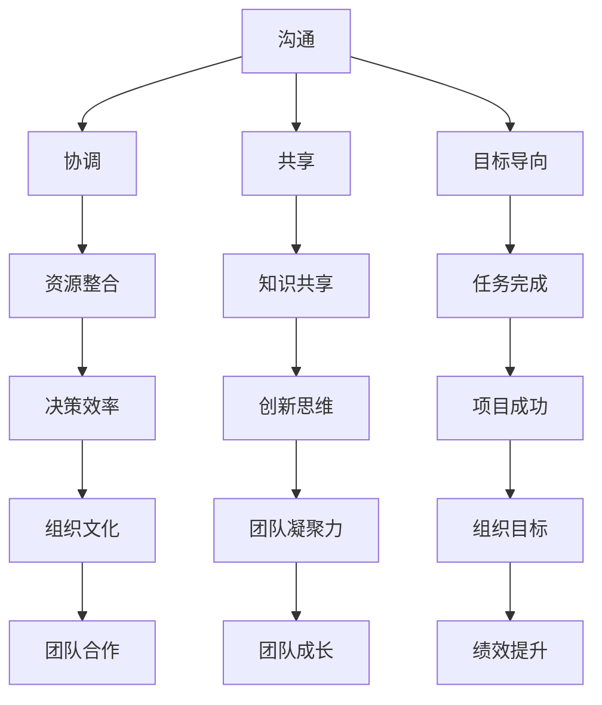

                 

### 1.1. 引言

**团队协作能力：培养默契配合的工作模式**

在当今快速发展的技术时代，团队协作已成为实现组织目标和提升工作效率的关键因素。本文旨在探讨团队协作的重要性，分析其核心概念，探讨其演变历史，并展望其在现代工作环境中的角色。我们将逐步深入理解团队协作的各个方面，为读者提供系统性的认识。

团队协作的定义较为广泛，但核心在于不同成员之间的沟通、协调与共享资源，以实现共同的目标。这不仅包括技术层面，如共同完成项目任务，还涉及组织文化、沟通机制和协作工具等多个层面。

团队协作的演变历程可以追溯到工业革命时期，当时团队协作更多地基于工作任务的分解和专业化分工。然而，随着信息技术的飞速发展，团队协作逐渐从基于物理空间的传统模式，转向数字化、网络化的工作模式。

在现代工作环境中，团队协作的重要性日益凸显。它不仅能够提高工作效率，还能促进创新思维和知识共享。有效的团队协作有助于降低项目风险，提升团队凝聚力和组织文化。

本文将首先定义团队协作的核心概念，包括其定义、组成部分和关键特征。接着，我们将探讨团队协作的理论基础，分析不同类型的团队协作模式及其适用场景。在此基础上，我们将深入探讨团队协作中的挑战，包括沟通障碍、冲突管理和资源分配等问题，并提出相应的解决策略。

最后，我们将结合实际案例，展示团队协作的成功实践，分析其背后的关键因素，并总结团队协作的最佳实践。通过本文的阅读，读者将能够全面理解团队协作的内涵，掌握有效的协作方法，提升团队协作能力。

### 1.2. 核心概念与联系

为了深入理解团队协作，我们需要明确其核心概念，并分析这些概念之间的联系。团队协作的核心概念包括：沟通、协调、共享和目标导向。以下是一个Mermaid流程图，展示了这些概念之间的关系架构。

**沟通**是团队协作的基础，它包括信息的传递、接收和反馈。有效的沟通能够确保团队成员对项目目标和任务有清晰的理解，减少误解和错误。

**协调**是指在团队协作过程中，成员之间的相互配合和合作，旨在实现资源的最优配置和任务的顺利进行。协调是确保团队目标实现的重要手段。

**共享**包括知识、资源和经验，它是团队协作的重要特征。共享能够促进团队成员之间的信任和合作，提高整体工作效率。

**目标导向**是指团队在协作过程中始终围绕共同的目标展开工作。目标导向有助于团队明确方向，集中精力，提高工作效果。

这些核心概念相互联系，共同构成团队协作的完整体系。沟通是协调和共享的前提，协调是实现目标的重要保障，而共享和目标导向则分别从不同角度推动团队协作的深入发展。

通过理解这些核心概念及其关系，我们可以更好地把握团队协作的本质，从而在实践中运用这些概念，提高团队协作效果。

### 1.3. 团队协作的历史背景

团队协作的概念并非一蹴而就，其演变历程可以追溯到古代社会。在农业时代，人们通过集体劳动进行耕作，这是早期团队协作的雏形。随着工业革命的到来，团队协作进入了新的阶段。工厂中的工人被组织成生产小组，通过分工合作完成生产任务，这一模式奠定了现代团队协作的基础。

进入20世纪，团队协作逐渐成为企业管理的重要策略。亨利·福特的大规模生产模式强调流水线作业和团队协作，极大地提高了生产效率。在二战期间，军事组织中的团队协作模式进一步推广到商业领域，使得团队合作成为企业竞争的重要手段。

计算机技术的发展进一步推动了团队协作的变革。随着信息技术和网络通信的普及，远程团队协作成为可能，团队协作模式逐渐从物理空间转向虚拟空间。20世纪80年代，软件公司开始采用敏捷开发模式，强调团队成员之间的密切合作和快速响应，这标志着现代团队协作理念的成熟。

不同历史阶段的团队协作模式各具特点，但核心目标都是为了提高工作效率和实现共同目标。农业时代的团队协作依赖于直接的劳动分工和集体行动，工业时代的团队协作则强调分工和专业化，而现代团队协作则更加注重沟通、协作和创新。

团队协作的历史演变不仅反映了社会和技术的进步，也为现代团队管理提供了宝贵的经验。理解这些历史背景，有助于我们更好地把握团队协作的本质，并在实际工作中运用这些理念，提升团队协作能力。

### 1.4. 团队协作在现代工作环境中的角色

在现代工作环境中，团队协作扮演着至关重要的角色。随着全球化、信息技术的迅猛发展以及市场竞争的加剧，团队协作不仅成为企业提升竞争力的关键，也是个人职业生涯发展的必备技能。以下是团队协作在现代工作环境中的几个关键角色：

**1. 提高工作效率**

团队协作能够充分利用每位成员的专业技能和知识，通过分工合作实现高效的工作流程。在复杂的项目中，团队成员可以专注于自己的领域，从而提高整体工作效率。例如，软件开发项目中，前端、后端和测试团队之间的紧密协作可以确保项目按时交付并达到预期质量。

**2. 促进知识共享和创新**

团队协作提供了一个平台，使得不同背景和技能的成员可以相互学习和交流。这种知识共享有助于激发创新思维，推动新技术的研发和应用。通过定期会议、讨论和知识分享会，团队成员可以共同探讨问题，提出解决方案，从而推动团队创新。

**3. 增强团队凝聚力和组织文化**

有效的团队协作能够增强团队成员之间的信任和默契，提升团队凝聚力。在一个协作良好的团队中，成员之间相互支持、共同成长，形成积极向上的组织文化。这种文化不仅有助于提高员工的满意度和忠诚度，还能增强企业的整体竞争力。

**4. 降低项目风险**

在复杂项目中，风险是不可避免的。通过团队协作，可以将风险分配到不同的团队成员中，从而降低整体项目的风险。团队成员之间的沟通和协作有助于及时发现和解决问题，确保项目顺利进行。

**5. 实现组织目标**

团队协作的核心目标是实现组织的目标。一个协作良好的团队可以更好地理解和执行组织战略，确保项目目标与组织目标的一致性。通过共同的努力和合作，团队可以更快地实现组织目标，推动企业持续发展。

总之，团队协作在现代工作环境中的角色不可替代。它不仅提高了工作效率和创新能力，还增强了团队凝聚力和组织文化，为组织目标的实现提供了强有力的支持。理解并善于运用团队协作的原理和方法，是每个团队成员和组织管理者的重要任务。

### 2. 团队协作的挑战和问题

尽管团队协作具有诸多优势，但在实际操作中，仍面临着一系列挑战和问题。以下是团队协作中常见的几个挑战：

**1. 沟通障碍**

沟通是团队协作的核心，但也是最容易出问题的一环。团队成员之间的沟通障碍可能源于语言、文化差异、信息传递不畅等。例如，远程团队协作中的时差问题可能导致沟通延迟，影响工作效率。

**2. 冲突管理**

团队中的冲突难以避免，这些冲突可能源于任务分配不均、目标不一致或个人风格差异。若不及时解决，冲突可能会影响团队凝聚力和工作效率。有效的冲突管理需要团队领导者具备良好的沟通技巧和调解能力。

**3. 资源分配**

资源分配问题在团队协作中也较为普遍。团队成员往往面临资源有限的现实，如何合理分配资源成为一大挑战。资源不足可能导致任务延误或项目失败，而资源过剩则可能造成资源浪费。

**4. 人员流动**

团队中人员的流动，如离职、晋升或转岗，会给团队协作带来波动。新成员的加入需要时间适应团队文化，而成员的离职则可能打破团队的稳定结构。人员流动不仅影响团队的士气，还可能影响项目的进展。

**5. 工作负荷不均**

工作负荷不均是团队协作中的常见问题。有些成员可能承担过多的工作，而另一些成员则可能工作量不足。这种不平衡可能导致成员之间的不满和团队凝聚力的下降。

为了应对这些挑战，团队需要采取一系列策略：

**1. 提升沟通能力**

团队应定期进行沟通培训，提高成员的沟通技巧。采用现代化的沟通工具，如即时通讯软件、视频会议和项目管理平台，可以提高沟通效率。

**2. 建立冲突解决机制**

团队应建立有效的冲突解决机制，鼓励成员表达自己的观点，并共同寻找解决方案。团队领导者应积极调解冲突，确保团队和谐。

**3. 合理分配资源**

团队领导者应确保资源的合理分配，避免资源浪费。通过明确任务目标和责任，可以减少资源争夺和浪费。

**4. 管理人员流动**

企业应制定有效的人员流动管理策略，为新成员提供充分的培训和指导，帮助他们快速融入团队。同时，应关注成员的职业发展，减少离职率。

**5. 平衡工作负荷**

团队领导者应关注成员的工作负荷，通过合理分配任务和提供支持，确保每个成员的工作量均衡。定期评估团队绩效，及时调整任务分配。

通过上述策略，团队可以有效地应对协作中的挑战，提高整体协作效果，从而实现组织目标。

### 2.1. 常见团队协作问题及解决策略

团队协作中的问题多种多样，以下列举几种常见问题及其解决策略：

**1. 沟通不畅**

- **问题**：团队成员之间沟通不足，信息传递不及时或错误。
- **解决策略**：
  - **明确沟通目标**：每次沟通前明确讨论主题和目标。
  - **多样化沟通工具**：结合使用电子邮件、即时通讯、视频会议等多种工具。
  - **定期沟通会议**：设立定期会议，确保团队成员有充分的交流机会。

**2. 冲突频发**

- **问题**：团队成员因任务分配、目标不同或个人风格差异而产生冲突。
- **解决策略**：
  - **建立冲突管理机制**：制定明确的冲突处理流程和规则。
  - **鼓励表达**：鼓励团队成员表达意见，尊重不同观点。
  - **调解与协商**：团队领导者应积极调解冲突，引导双方找到共同点。

**3. 资源分配不均**

- **问题**：部分成员资源过多，而另一些成员资源不足。
- **解决策略**：
  - **资源评估与调整**：定期评估资源分配情况，确保资源合理利用。
  - **任务调整**：根据成员能力调整任务分配，避免工作负荷不均。
  - **透明化分配**：明确资源分配标准和流程，提高透明度。

**4. 人员流动**

- **问题**：人员流动频繁，影响团队稳定性和项目进展。
- **解决策略**：
  - **新成员培训**：为新成员提供充分的培训和指导，帮助他们快速融入团队。
  - **职业发展规划**：关注成员职业发展，减少离职率。
  - **团队文化建设**：建立积极向上的团队文化，提高成员归属感。

**5. 工作负荷不均**

- **问题**：部分成员工作负荷过大，而另一些成员工作不足。
- **解决策略**：
  - **任务分配与反馈**：定期评估任务分配情况，及时调整。
  - **提供支持**：为工作负荷大的成员提供必要的支持和资源。
  - **激励机制**：设立合理的激励机制，鼓励成员积极参与。

通过上述策略，团队可以有效地应对协作中的常见问题，提高整体协作效果，从而实现组织目标。

### 3. 团队协作原则

团队协作的有效性取决于一系列基本原则的遵循。以下是团队协作中的几个核心原则，及其背后的理论依据和实际应用。

#### 3.1. 共同目标

**原则**：团队协作应围绕共同的目标进行。

**理论依据**：目标一致性理论认为，当团队成员拥有共同的目标时，他们更可能协同合作，提高团队的整体绩效。

**应用**：
- **设定明确目标**：在项目启动时，团队应共同设定明确的目标和里程碑，确保每个成员都了解自己的职责和目标。
- **定期回顾**：定期召开团队会议，回顾进度并调整目标，确保团队始终朝着共同的目标前进。

#### 3.2. 沟通机制

**原则**：建立有效的沟通机制，确保信息流畅传递。

**理论依据**：沟通理论指出，有效沟通是团队合作的基础，它有助于降低误解和冲突，提高工作效率。

**应用**：
- **透明化沟通**：采用项目管理工具，如JIRA或Trello，使任务和进展透明化。
- **多元化沟通**：结合使用邮件、即时通讯、视频会议等多种沟通方式，满足不同成员的沟通需求。

#### 3.3. 权力分布

**原则**：权力应合理分配，确保每个成员都有决策权和责任感。

**理论依据**：委托代理理论认为，合理的权力分配能够激发团队成员的积极性和责任感。

**应用**：
- **分配任务与权力**：根据成员的专业技能和兴趣，分配任务和相应的决策权。
- **授权**：团队领导者应授权给团队成员，使其在各自的领域内具有自主决策权。

#### 3.4. 信任建设

**原则**：建立信任，促进团队成员之间的相互信任和支持。

**理论依据**：信任理论指出，信任是团队合作的重要基础，它能够减少猜疑和摩擦，提高团队凝聚力。

**应用**：
- **开放沟通**：鼓励团队成员表达观点，建立开放的沟通环境。
- **诚信行为**：团队成员应保持诚信，履行承诺，增强彼此之间的信任。

#### 3.5. 绩效评估

**原则**：建立科学的绩效评估体系，激励团队成员持续改进。

**理论依据**：绩效评估理论认为，通过评估成员的绩效，可以激发其工作动力，提高整体团队效能。

**应用**：
- **定量与定性结合**：绩效评估应结合定量和定性指标，全面评估成员的贡献。
- **反馈与改进**：定期给予成员反馈，并制定改进计划，帮助其不断提升。

通过遵循这些原则，团队可以建立有效的协作模式，提高整体效能，实现组织目标。

#### 3.6. 持续学习

**原则**：持续学习和知识共享，推动团队持续进步。

**理论依据**：学习型组织理论认为，团队应不断学习和适应变化，以保持竞争优势。

**应用**：
- **培训与发展**：定期组织培训，提高团队成员的专业技能。
- **知识管理**：建立知识库，促进团队成员之间的知识共享和经验交流。

#### 3.7. 责任分担

**原则**：责任分担，确保每个成员都能承担相应责任。

**理论依据**：责任分担理论指出，通过明确责任，可以减少依赖性，提高团队整体效能。

**应用**：
- **明确责任**：制定详细的工作职责和任务分工，确保每个成员都清楚自己的责任。
- **共同监督**：建立团队监督机制，共同监督任务的执行和完成情况。

#### 3.8. 动态调整

**原则**：根据项目进展和团队状态，动态调整协作模式和策略。

**理论依据**：动态管理理论认为，团队应根据实际情况灵活调整，以应对变化和挑战。

**应用**：
- **定期评估**：定期评估团队协作效果，发现问题和不足，及时调整策略。
- **适应性调整**：根据项目需求和团队状态，灵活调整资源和任务分配。

通过以上原则，团队可以建立稳定的协作模式，提升整体效能，实现组织目标。在实际应用中，团队应根据自身特点和环境，灵活运用这些原则，以达到最佳协作效果。

### 4. 团队协作工具与技术

在当今信息化时代，团队协作工具和技术已经成为提升团队工作效率和协作效果的重要手段。这些工具不仅帮助团队成员更好地沟通和共享信息，还能优化工作流程，提高项目的执行效率。以下是几种常见的团队协作工具及其在团队协作中的应用。

#### 4.1. 项目管理工具

项目管理工具是团队协作中不可或缺的一部分，它们能够帮助团队跟踪项目进度、分配任务、管理资源，并提供一个统一的平台来协调团队的工作。以下是几种常用的项目管理工具：

**1. Trello**

Trello是一个基于看板的项目管理工具，它通过卡片和列表的形式来展示项目任务和进度。团队成员可以在Trello上创建任务卡片，设定截止日期，并分配给特定的成员。Trello的简单界面和灵活的操作使得它非常适合小团队和复杂项目的协作。

**2. Asana**

Asana是一个功能丰富的项目管理工具，它支持任务分配、进度跟踪、团队协作等多种功能。Asana提供多种视图模式，如列表视图、看板视图和甘特图，使得团队成员可以根据自己的偏好来管理任务。Asana还支持集成其他工具，如Slack和Google Drive，进一步提升了团队协作的便利性。

**3. JIRA**

JIRA是一款专为软件开发团队设计的项目管理工具，它提供了丰富的功能，包括Bug跟踪、任务管理、敏捷开发等。JIRA可以帮助团队制定Scrum计划，跟踪任务进度，管理代码库，并生成详细的报告。JIRA的强大扩展性和定制性使其成为许多大型企业的首选。

#### 4.2. 沟通与协作工具

有效的沟通是团队协作的核心，而现代化的沟通与协作工具能够显著提升团队的沟通效率。以下是几种常用的沟通与协作工具：

**1. Slack**

Slack是一个流行的团队沟通工具，它支持实时消息、文件共享、频道讨论等多种功能。Slack的灵活性和扩展性使其成为许多团队的首选。通过Slack，团队成员可以轻松地创建频道，进行主题讨论，共享文件，并实时跟进任务进度。

**2. Microsoft Teams**

Microsoft Teams是微软推出的集成沟通和协作平台，它集成了聊天、视频会议、文档共享等功能。Teams还与Office 365的其他服务紧密集成，如OneDrive和Excel，使得团队可以方便地进行协作和共享资源。

**3. Zoom**

Zoom是一个专业的视频会议工具，它支持高清视频、实时聊天和屏幕共享等功能。Zoom的可靠性和易用性使其成为远程团队协作的首选。Zoom还提供了多种会议功能，如虚拟会议室、录制会议等，方便团队成员进行在线交流和协作。

#### 4.3. 文档共享与管理工具

文档共享与管理工具能够帮助团队高效地管理和共享文档，确保团队成员能够随时访问和更新文档。以下是几种常用的文档共享与管理工具：

**1. Google Docs**

Google Docs是一个在线文档编辑工具，它支持多人实时编辑和协作。团队成员可以在Google Docs上创建、编辑和共享文档，确保所有成员都能够及时查看和更新文档内容。Google Docs还提供了版本控制和权限管理功能，方便团队进行文档管理。

**2. Dropbox**

Dropbox是一个云存储和文档共享工具，它提供了便捷的文件存储和共享功能。团队成员可以将文档上传到Dropbox，并设置共享权限，使得其他成员可以方便地访问和下载文档。Dropbox还支持实时同步和备份，确保文档的安全性和可用性。

**3. Notion**

Notion是一个功能强大的文档和笔记工具，它支持多种内容类型，如笔记、表格、看板等。Notion的灵活性和自定义性使其成为团队协作的理想选择。团队成员可以在Notion中创建项目文档、任务列表和知识库，方便地进行信息共享和协作。

#### 4.4. 应用与实际案例

以下是团队协作工具在实际项目中的应用案例：

**案例1：软件开发团队**

一个软件开发团队使用Trello来跟踪项目任务，确保每个任务都有明确的负责人和截止日期。团队成员通过Slack进行日常沟通，及时讨论问题和分享进展。他们使用Google Docs来编写和共享项目文档，确保所有成员都能实时更新文档内容。通过这些工具的结合使用，团队能够高效地协同工作，按时交付高质量的项目。

**案例2：市场营销团队**

一个市场营销团队使用Asana来管理营销活动，确保每个活动都有明确的计划和执行步骤。团队成员通过Microsoft Teams进行实时沟通，讨论营销策略和创意。他们使用Dropbox来存储和共享营销素材，确保团队成员能够随时访问和更新素材。通过这些工具的协作，团队能够高效地推进营销活动，提高市场推广效果。

总之，团队协作工具和技术的选择和应用对于团队协作的效果至关重要。通过合理选择和运用这些工具，团队可以提升工作效率，优化工作流程，实现项目目标。在实际应用中，团队应根据自身需求和项目特点，灵活选择和调整工具，以实现最佳协作效果。

### 5. 沟通技能在团队协作中的作用

在团队协作中，沟通技能发挥着至关重要的作用。有效的沟通不仅能确保信息的准确传递，还能增强团队成员之间的信任和合作。以下将探讨几种关键的沟通技能，包括有效表达、倾听和反馈，并解释它们如何提高团队协作效果。

#### 5.1. 有效表达

**1. 明确信息**

有效表达的首要原则是确保信息清晰明确。团队成员在沟通时，应避免使用模糊或模棱两可的语言，以免产生误解。例如，在传达任务要求时，应明确任务的细节、目标和预期成果，确保每位成员都理解任务的内容和目标。

**2. 结构化信息**

在传达信息时，采用结构化的方式能够提高沟通效率。例如，可以采用“背景-问题-解决方案-行动计划”的结构，使信息更加系统和有条理。这种方式有助于团队成员快速抓住重点，减少不必要的讨论和误解。

**3. 使用非言语沟通**

除了语言表达，非言语沟通如肢体语言、面部表情和声音的语调也是沟通的重要组成部分。团队成员应学会通过这些非言语手段来增强信息的传达效果。例如，在讨论中保持微笑和开放的姿态，可以传达友好和合作的意愿，有助于建立良好的团队氛围。

#### 5.2. 倾听

**1. 积极倾听**

积极倾听不仅仅是听对方说话，更重要的是理解对方的意图和感受。团队成员在倾听时应保持专注，避免打断对方的发言，并通过肢体语言和反馈来表示自己在认真听。例如，点头、目光接触和适当的回应如“我明白了”或“继续说”，可以表明自己在倾听并理解对方。

**2. 善于提问**

倾听不仅仅是听，还要主动提问以确认理解。通过提问，团队成员可以更好地理解对方的观点和需求，减少误解和歧义。例如，在听取报告后，可以提问“你是怎么考虑这个问题的？”或“你认为有哪些潜在的风险？”来深入了解对方的思考过程。

**3. 识别非言语信号**

非言语信号如肢体语言、面部表情和声音的语调往往能传达更多的信息。团队成员应学会识别这些信号，以更好地理解对方的感受和意图。例如，一个紧皱的眉头或低沉的声音可能表明对方感到困扰或不满，这时团队成员应主动询问并提供帮助。

#### 5.3. 反馈

**1. 及时反馈**

及时反馈是团队协作中非常重要的一环。通过及时反馈，团队成员可以及时纠正错误，改进工作方法，确保项目进展顺利。例如，在完成任务后，团队成员应立即对任务完成情况进行反馈，指出优点和需要改进的地方。

**2. 具体和建设性**

在给予反馈时，应具体而建设性地表达意见。具体反馈能明确指出问题所在，而建设性反馈则能提出改进的建议。例如，可以说“你在这个任务中做得很好，但在项目报告的格式上可以更加统一”，这样的反馈既肯定了对方的工作，又提出了具体的改进建议。

**3. 尊重和善意**

在反馈时，应保持尊重和善意。反馈不应是对成员的批评，而应是帮助成员成长和改进的机会。例如，可以使用“我觉得”或“我建议”这样的开场白，表明反馈是基于自己的观察和意见，而非指责对方。

通过掌握和运用这些沟通技能，团队成员可以显著提高沟通效果，减少误解和冲突，增强团队协作的效能。有效的沟通不仅有助于项目成功，还能促进团队成员之间的信任和合作，为团队的长远发展打下坚实基础。

### 6. 领导力在团队协作中的作用

领导力在团队协作中起着至关重要的作用，它不仅影响团队的整体绩效，还塑造团队的文化和氛围。以下是领导力在团队协作中的几个关键方面：

#### 6.1. 团队领导的角色和责任

**1. 明确目标**

团队领导者需要为团队设定明确的目标和方向。这些目标应具体、可衡量，并与组织的整体战略保持一致。通过明确目标，领导者可以帮助团队成员集中精力，提高工作效率。

**2. 激励和激励**

领导者应激发团队成员的积极性和创造力，为团队提供动力。这可以通过设置激励机制、认可成员的贡献和提供职业发展机会来实现。有效的激励可以增强团队成员的归属感和工作热情。

**3. 沟通和协调**

领导者需要保持与团队成员的沟通畅通，确保信息传递准确无误。此外，领导者还应在团队内部协调不同成员之间的工作，解决潜在的问题和冲突，确保团队协作顺畅。

#### 6.2. 培养团队文化

**1. 合作和信任**

领导者应致力于培养一个合作和信任的团队文化。通过鼓励团队成员之间的相互支持和协作，可以增强团队的凝聚力和合作效率。信任是团队合作的基础，领导者应通过诚实、透明和公正的行为建立信任。

**2. 创新和开放**

领导者应鼓励团队成员创新思维，并为创新提供支持和资源。一个开放的团队文化可以鼓励成员分享想法和反馈，从而推动团队不断进步。领导者应支持成员尝试新方法，并为失败提供学习机会。

**3. 尊重和多样性**

领导者应尊重团队成员的差异，包括文化背景、工作经验和技能。通过尊重多样性，团队可以充分利用不同成员的优势，提高整体绩效。此外，领导者应确保所有成员都感受到被尊重和重视，以增强团队凝聚力。

#### 6.3. 领导力的最佳实践

**1. 持续学习**

领导者应不断学习和提升自己的技能，以适应不断变化的工作环境。通过参加培训、阅读相关书籍和与行业专家交流，领导者可以保持自己的竞争力，为团队提供高质量的领导。

**2. 自我反思**

领导者应定期进行自我反思，识别自己的优势和不足。通过自我反思，领导者可以不断提升自己的领导能力，并在团队中树立榜样。

**3. 指导和支持**

领导者应提供明确的指导和持续的支持，帮助团队成员发展技能和实现职业目标。通过提供反馈和指导，领导者可以帮助团队成员克服困难，提高工作表现。

通过这些最佳实践，领导者可以提升团队协作的效果，促进团队的长期发展。有效的领导不仅能够推动团队实现目标，还能为团队成员提供成长和发展的机会，为组织的成功奠定坚实基础。

### 7. 实际案例解析：团队协作的成功实践

为了更好地理解团队协作的实际应用和效果，我们来看几个具体的案例，分析其成功背后的关键因素。

#### 7.1. 案例一：敏捷开发团队

**背景**：某科技公司采用敏捷开发模式，组建了一个由产品经理、设计师、开发人员和测试人员组成的多功能团队。

**关键因素**：

1. **明确的共同目标**：团队成员共同设定了可量化的项目目标，并定期回顾进度，确保每个人都明确任务和方向。

2. **有效的沟通机制**：团队通过每日站立会议、迭代回顾和评审会议，保持了沟通的流畅和信息的透明化。这些会议确保了团队成员之间的信息共享和协作。

3. **灵活的资源配置**：团队根据项目需求动态调整资源分配，确保每个成员的工作负荷均衡。同时，团队领导者提供了必要的支持，确保成员能够专注于各自的任务。

**结果**：通过敏捷开发模式，团队成功缩短了项目周期，提高了产品质量，并增强了团队成员之间的信任和合作。

#### 7.2. 案例二：跨国远程团队

**背景**：某国际公司拥有多个分布在全球的团队，这些团队需要紧密协作来完成跨国项目。

**关键因素**：

1. **现代化的沟通工具**：团队采用了Slack、Zoom等实时沟通工具，确保团队成员可以随时进行沟通和协作。这些工具的灵活性和高效性大大提升了团队的沟通效率。

2. **时间管理和调度**：团队通过协调时区差异，制定了合理的会议和任务时间表，确保团队成员在最佳工作时间内参与会议和任务。

3. **清晰的职责划分**：每个团队成员都有明确的职责和任务，避免了工作重叠和冲突。团队领导者定期检查任务进展，及时调整任务分配，确保项目顺利推进。

**结果**：通过有效的沟通和协调，团队成功克服了地域和时区的障碍，实现了高效的跨国协作，按时交付了高质量的项目。

#### 7.3. 案例三：初创企业团队

**背景**：某初创企业在资源有限的情况下，需要高效利用团队资源，以快速响应市场变化。

**关键因素**：

1. **扁平化的组织结构**：初创企业采用扁平化的组织结构，减少了管理层级，提高了决策效率。团队成员可以直接向领导汇报，减少了信息传递的延迟。

2. **灵活的工作模式**：团队成员可以灵活安排工作时间，根据个人需求和项目进度调整工作计划。这种灵活性提高了团队成员的工作效率和满意度。

3. **持续的学习和改进**：初创企业鼓励团队成员不断学习和提升技能，通过定期的培训和技术分享会，团队保持了技术的前沿性和创新能力。

**结果**：通过扁平化的组织结构和灵活的工作模式，初创企业能够迅速响应市场变化，推出创新产品，并在竞争激烈的市场中脱颖而出。

这些实际案例展示了团队协作在不同场景下的成功实践。通过明确目标、有效沟通、合理配置资源和持续学习，团队可以克服各种挑战，实现高效协作，推动组织目标的实现。理解并借鉴这些成功经验，有助于提升团队协作能力，实现组织的长期发展。

### 8. 团队协作能力培养与提升策略

培养和提升团队协作能力是一个系统性的过程，需要从个人、团队和组织三个层面采取综合性的策略。以下是一些具体的培养与提升策略：

#### 8.1. 个人层面

**1. 提高沟通能力**

个人应重视沟通技能的提升，包括口头表达、书面表达和非言语沟通。参加沟通培训课程，学习有效的沟通方法和技巧，例如主动倾听、清晰表达和积极反馈。

**2. 发展跨文化意识**

在全球化的工作环境中，跨文化沟通能力至关重要。个人应了解不同文化背景的沟通方式和习惯，学会尊重和包容不同的观点，以提高跨文化协作的效能。

**3. 增强自我管理能力**

个人应学会自我管理，包括时间管理、情绪管理和目标设定。通过提高自我管理能力，个人可以更好地适应团队节奏，减少工作压力，提高工作效率。

#### 8.2. 团队层面

**1. 定期团队建设活动**

团队应定期组织团队建设活动，如团队培训、团队拓展和团队讨论会。这些活动有助于增强团队成员之间的信任和默契，提高团队凝聚力。

**2. 明确职责和任务**

团队领导者应确保每个成员都明确自己的职责和任务，并通过透明化任务分配和进度跟踪，减少误解和冲突。

**3. 建立反馈和评估机制**

团队应建立有效的反馈和评估机制，鼓励成员提供和接受建设性的反馈。定期的绩效评估和反馈会议可以帮助团队成员了解自己的表现，找到改进的方向。

#### 8.3. 组织层面

**1. 培养协作文化**

组织应培养一种协作文化，鼓励和支持团队协作。通过建立明确的协作目标和奖励机制，组织可以激励团队成员积极参与协作，提高整体协作效果。

**2. 提供培训和资源**

组织应为团队成员提供必要的培训和资源，包括技术培训、沟通培训和团队协作工具。通过持续的学习和提升，团队成员可以更好地适应协作需求，提高协作效能。

**3. 建立沟通和协作平台**

组织应建立高效的沟通和协作平台，如项目管理工具和即时通讯工具。这些平台可以帮助团队成员方便地沟通和协作，提高整体工作效率。

通过以上策略，个人、团队和组织可以共同推动团队协作能力的培养和提升，实现更高效的团队协作和更优的组织绩效。

### 总结

团队协作能力在现代社会中的重要性不言而喻。有效的团队协作不仅能够提高工作效率，促进知识共享和创新，还能增强团队凝聚力和组织文化，为组织目标的实现提供强有力的支持。本文通过逐步分析团队协作的核心概念、历史背景、现代工作环境中的角色、面临的挑战、协作原则、工具与技术、沟通技能、领导力以及实际案例，系统地探讨了团队协作的各个方面。

首先，我们明确了团队协作的定义、核心概念和组成部分，并探讨了其在不同历史阶段的演变过程。接着，我们分析了团队协作在现代工作环境中的角色和重要性，强调了沟通、协调、共享和目标导向在团队协作中的关键作用。随后，我们讨论了团队协作中面临的挑战和解决策略，包括沟通障碍、冲突管理和资源分配问题。

在核心原则部分，我们详细阐述了共同目标、沟通机制、权力分布、信任建设、绩效评估、持续学习、责任分担和动态调整等原则，并解释了它们的理论依据和应用。团队协作工具与技术部分则介绍了项目管理工具、沟通与协作工具、文档共享与管理工具等，展示了这些工具在实际项目中的应用和效果。

沟通技能和领导力是团队协作中不可或缺的一部分。通过提高沟通技能，如有效表达、积极倾听和反馈，团队成员可以更好地理解彼此，减少误解和冲突。领导力则通过设定明确的目标、培养团队文化、激励和指导团队成员，为团队协作提供方向和动力。

最后，我们通过实际案例展示了团队协作的成功实践，并提出了培养和提升团队协作能力的策略，包括个人、团队和组织三个层面的具体措施。通过这些策略，个人和团队可以不断提高协作能力，实现更高效的协作和更优的绩效。

总之，团队协作能力是现代组织中不可或缺的重要能力。理解并应用团队协作的原理和方法，对于提升团队效能和组织竞争力具有重要意义。希望本文能够为读者提供有价值的参考和启示，助力团队协作能力的提升和实践。

### 拓展阅读

为了进一步深入了解团队协作的能力培养和提升策略，以下是一些推荐阅读的材料：

1. **《敏捷开发：实践指南》**（Agile Project Management: Creating Innovative Products）- 作者：Jeff Sutherland。本书详细介绍了敏捷开发的方法论，包括团队协作、持续交付和迭代开发，为团队协作提供了实践指导。

2. **《团队协作的艺术》**（The Five Dysfunctions of a Team: A Leadership Fable）- 作者：Patrick Lencioni。本书通过一个寓言故事，探讨了团队协作中常见的五个障碍，并提出了解决策略。

3. **《第五项修炼：学习型组织的艺术与实务》**（The Fifth Discipline: The Art & Practice of The Learning Organization）- 作者：Peter Senge。本书提出了学习型组织的概念，强调了持续学习和团队协作在组织发展中的重要性。

4. **《团队领导力》**（The Leadership Challenge: How to Make Extraordinary Things Happen in Organizations）- 作者：Jim Kouzes 和 Barry Posner。本书详细介绍了领导力的关键要素，包括激励、沟通和团队协作，为团队领导者提供了实用的指导。

5. **《数字转型：如何构建敏捷组织》**（The Lean Startup: How Today's Entrepreneurs Use Continuous Innovation to Create Radically Successful Businesses）- 作者：Eric Ries。本书介绍了精益创业方法，强调了快速迭代和团队协作在创新中的关键作用。

通过阅读这些书籍，读者可以更全面地了解团队协作的理论和实践，为提升团队协作能力提供更多的思路和策略。希望这些建议能够帮助读者在团队协作的道路上取得更大的进步。

