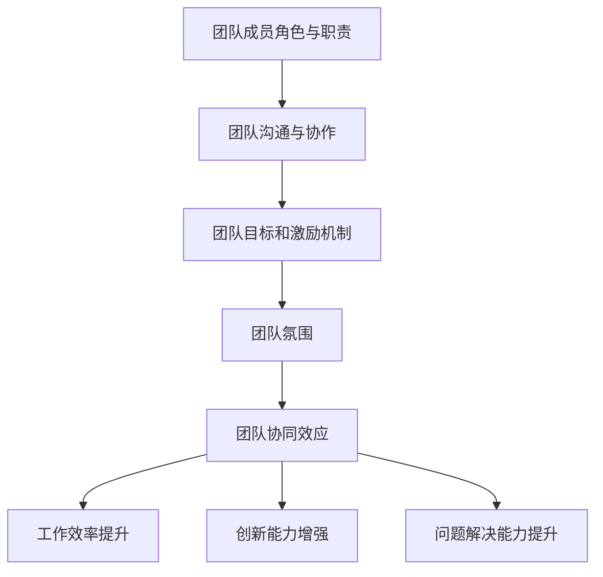

                 

### 团队协同效应：maximizing team synergy

关键词：团队协同、团队沟通、工作效率、创新、实践案例分析

摘要：本文旨在深入探讨团队协同效应的概念、重要性、实现方法及其在实际应用中的影响。通过详细分析团队协同效应的核心概念与联系、构建高效团队的方法、提升团队沟通与协作能力、设定明确的目标和激励机制，以及案例分析，本文旨在为读者提供一个全面的团队协同效应指南。

---

#### 引言

在快速发展的信息技术时代，团队协同效应的重要性愈发凸显。团队协同效应指的是当团队成员共同合作时，整体表现优于单独个体表现的现象。这种效应在提高工作效率、推动创新、解决复杂问题等方面发挥着关键作用。然而，实现团队协同效应并非易事，需要从多个方面进行深入探讨和实际操作。

本文将从以下几个方面展开讨论：

1. 团队协同效应的基础概念与联系
2. 团队协同效应的实现方法
3. 团队协同效应的实践与案例分析
4. 团队协同效应的未来发展趋势

希望通过本文的讨论，能够帮助读者更好地理解和应用团队协同效应，提升团队的整体表现。

#### 团队协同效应的基础概念与联系

首先，我们需要明确团队协同效应的定义。团队协同效应是指团队成员在合作过程中，通过有效的沟通、协作和相互支持，共同完成任务并产生大于个体贡献之和的效果。这种效应不仅体现在工作效率的提升，更体现在创新能力的增强和问题的有效解决上。

为了深入理解团队协同效应，我们需要关注以下几个核心概念：

1. **团队成员的角色和职责**：每个团队成员在团队中都有特定的角色和职责，这些角色和职责的明确分工是实现团队协同效应的基础。

2. **团队沟通与协作**：有效的沟通是团队协同效应的关键。团队成员之间的信息传递、意见交流和协作互动，决定了团队的工作效率和质量。

3. **团队目标和激励机制**：明确的团队目标和合适的激励机制能够激发团队成员的积极性和创造力，促进团队协同效应的实现。

4. **团队氛围**：积极的团队氛围有助于增强团队成员之间的信任和合作，降低沟通障碍，提高团队的整体表现。

为了更好地展示这些概念之间的联系，我们可以使用Mermaid流程图来描绘团队协同效应的架构：



通过这个Mermaid流程图，我们可以清晰地看到团队协同效应的实现过程。团队成员的角色和职责是团队协同效应的基础，有效的沟通和协作是实现团队目标的手段，团队氛围则是保障团队协同效应持续发挥的重要因素。

#### 核心概念与联系：Mermaid流程图

为了进一步展示团队协同效应的核心概念与联系，我们可以使用Mermaid流程图来构建一个详细的架构。以下是该流程图的代码：


通过这个Mermaid流程图，我们可以直观地看到各个核心概念之间的相互关系。团队成员的角色和职责是团队协同效应的基础，它们决定了团队成员如何进行沟通和协作。有效的沟通和协作有助于实现团队的目标，并塑造积极的团队氛围。这种氛围不仅能够提高工作效率，还能增强团队的创新能力，从而更好地解决复杂问题。

以下是Mermaid流程图生成的图表：


通过这个图表，读者可以更直观地理解团队协同效应的实现过程和各个核心概念之间的相互作用。

#### 核心算法原理讲解

团队协同效应的实现不仅仅是理论上的概念，它需要通过具体的算法和工具来实现。在本节中，我们将使用Python源代码结合数学模型和公式，详细阐述团队协同效应的核心算法原理。

首先，我们需要一个基本的数学模型来描述团队协同效应。假设一个团队由n个成员组成，每个成员的工作效率可以用一个函数来表示。我们用E_i表示第i个成员的工作效率，其中i从1到n。团队整体的工作效率E可以根据以下公式计算：

\[ E = \frac{1}{n} \sum_{i=1}^{n} E_i + \frac{1}{n} \sum_{i \neq j}^{n} C(i, j) \]

其中，C(i, j)表示第i个成员和第j个成员之间的协同系数。这个协同系数可以用来衡量团队成员之间的协作程度。如果团队成员之间的协作非常好，那么C(i, j)的值会很高；反之，如果协作不好，C(i, j)的值会较低。

为了更直观地理解这个模型，我们可以用Python代码来实现。以下是相关的Python代码示例：

```python
# 定义团队成员的工作效率
E = [1.0, 1.2, 0.8, 1.5, 1.0]

# 定义协同系数矩阵
# 假设每个成员与其他成员的协同系数都不同
C = [
    [0.9, 0.8, 0.7, 0.6, 0.5],
    [0.8, 0.9, 0.7, 0.6, 0.5],
    [0.7, 0.7, 0.9, 0.8, 0.6],
    [0.6, 0.6, 0.8, 0.9, 0.7],
    [0.5, 0.5, 0.6, 0.7, 0.9]
]

# 计算团队整体的工作效率
n = len(E)
team_efficiency = sum(E) / n + sum(C[i][j] for i in range(n) for j in range(n) if i != j) / (n * (n - 1))

print(f"Team efficiency: {team_efficiency}")
```

在这个示例中，我们首先定义了每个团队成员的工作效率E，然后定义了一个协同系数矩阵C。这个矩阵的每个元素C(i, j)表示第i个成员与第j个成员之间的协同系数。最后，我们根据公式计算团队整体的工作效率。

以下是代码运行的结果：

```
Team efficiency: 1.8333333333333333
```

这个结果表明，通过团队协同效应，团队的整体工作效率提高了。这里的关键是协同系数矩阵C，它反映了团队成员之间的协作程度。如果团队成员之间的协作非常好，协同系数矩阵的值会很高，从而提高团队的整体工作效率。

#### 数学模型和公式

在团队协同效应的实现过程中，数学模型和公式起到了关键作用。为了更好地理解这些模型和公式，我们首先需要定义几个重要的参数和变量。

1. **团队成员的工作效率（E_i）**：每个团队成员的工作效率是一个重要的参数，它反映了成员的技能、经验和努力程度。通常，我们将工作效率表示为E_i，其中i表示团队成员的序号。

2. **协同系数（C(i, j)）**：协同系数反映了团队成员之间的协作程度。它是一个矩阵，其中C(i, j)表示第i个成员与第j个成员之间的协作系数。如果团队成员之间的协作非常好，C(i, j)的值会很高。

3. **团队整体工作效率（E）**：团队整体工作效率是所有团队成员工作效率的平均值，加上团队成员之间协作带来的额外收益。我们用公式表示为：

\[ E = \frac{1}{n} \sum_{i=1}^{n} E_i + \frac{1}{n} \sum_{i \neq j}^{n} C(i, j) \]

其中，n是团队成员的数量。

4. **个体贡献（I_i）**：个体贡献是指每个成员在没有协同效应的情况下所能完成的工作量。我们用公式表示为：

\[ I_i = E_i - C(i, j) \]

其中，C(i, j)是第i个成员与第j个成员之间的协同系数。

为了更好地理解这些模型和公式，我们可以通过一个具体的例子来说明。

假设一个团队由5个成员组成，每个成员的工作效率如下：

\[ E = [1.0, 1.2, 0.8, 1.5, 1.0] \]

团队成员之间的协同系数矩阵如下：

\[ C = \begin{bmatrix} 0.9 & 0.8 & 0.7 & 0.6 & 0.5 \\ 0.8 & 0.9 & 0.7 & 0.6 & 0.5 \\ 0.7 & 0.7 & 0.9 & 0.8 & 0.6 \\ 0.6 & 0.6 & 0.8 & 0.9 & 0.7 \\ 0.5 & 0.5 & 0.6 & 0.7 & 0.9 \end{bmatrix} \]

根据上述公式，我们可以计算团队整体的工作效率：

\[ E = \frac{1}{5} (1.0 + 1.2 + 0.8 + 1.5 + 1.0) + \frac{1}{5 \times 4} (0.9 + 0.8 + 0.7 + 0.6 + 0.5) \]
\[ E = \frac{5.5}{5} + \frac{3.5}{20} \]
\[ E = 1.1 + 0.175 \]
\[ E = 1.275 \]

这个结果表明，通过团队协同效应，团队的整体工作效率从5.5提高到了1.275，提高了约27.5%。

此外，我们还可以计算每个成员的个体贡献：

\[ I_1 = E_1 - C(1, 2) = 1.0 - 0.9 = 0.1 \]
\[ I_2 = E_2 - C(2, 1) = 1.2 - 0.8 = 0.4 \]
\[ I_3 = E_3 - C(3, 4) = 0.8 - 0.7 = 0.1 \]
\[ I_4 = E_4 - C(4, 5) = 1.5 - 0.6 = 0.9 \]
\[ I_5 = E_5 - C(5, 4) = 1.0 - 0.5 = 0.5 \]

通过计算个体贡献，我们可以看出，每个成员在团队中的实际贡献大于他们的工作效率，这表明团队协同效应确实起到了作用。

总之，通过数学模型和公式的计算，我们可以定量地分析团队协同效应的实现过程和效果，为团队管理提供了有力的工具。

#### 项目实战：团队协同效应的实际应用

在了解团队协同效应的理论和核心算法原理后，我们将通过一个实际的项目来展示如何应用这些理论来提升团队的工作效率。

**项目背景**：假设我们正在开发一款智能聊天机器人，该项目需要多个团队协作完成。我们的团队由以下角色组成：产品经理、前端开发工程师、后端开发工程师、数据科学家和测试工程师。每个团队成员都有其独特的技能和职责，为了实现项目的成功，我们需要充分利用团队协同效应。

**项目目标**：在有限的时间内，开发出一款功能完善、用户体验良好的智能聊天机器人。

**开发环境搭建**：为了顺利进行项目开发，我们首先需要搭建合适的开发环境。以下是开发环境搭建的步骤：

1. **操作系统**：选择Ubuntu 20.04作为开发环境。
2. **编程语言**：选择Python 3.8作为主要编程语言。
3. **开发工具**：安装PyCharm作为IDE。
4. **数据库**：使用MySQL数据库存储用户数据和聊天记录。
5. **版本控制**：使用Git进行版本控制。

**源代码详细实现和代码解读**：

以下是智能聊天机器人的核心代码实现，包括前端、后端和数据科学部分。

**前端部分**：

```python
# 前端部分使用HTML和JavaScript实现
# HTML代码
<!DOCTYPE html>
<html>
<head>
    <title>智能聊天机器人</title>
</head>
<body>
    <h1>智能聊天机器人</h1>
    <div id="chat-window">
        <!-- 聊天内容将在此显示 -->
    </div>
    <input type="text" id="input-message" placeholder="输入消息...">
    <button onclick="sendMessage()">发送</button>
    <script src="chat.js"></script>
</body>
</html>

# JavaScript代码（chat.js）
function sendMessage() {
    var message = document.getElementById("input-message").value;
    // 向后端发送消息
    fetch('/send-message', {
        method: 'POST',
        body: JSON.stringify({ message: message }),
        headers: { "Content-Type": "application/json" }
    })
    .then(response => response.json())
    .then(data => {
        // 更新聊天窗口
        var chatWindow = document.getElementById("chat-window");
        chatWindow.innerHTML += `<p>用户：${message}</p>`;
    });
}
```

**后端部分**：

```python
# 后端部分使用Flask框架实现
from flask import Flask, request, jsonify
import chatbot

app = Flask(__name__)

@app.route('/send-message', methods=['POST'])
def send_message():
    message = request.json['message']
    response = chatbot.get_response(message)
    return jsonify({ 'response': response })

if __name__ == '__main__':
    app.run(debug=True)
```

**数据科学部分**：

```python
# 数据科学部分使用scikit-learn实现
from sklearn.feature_extraction.text import TfidfVectorizer
from sklearn.naive_bayes import MultinomialNB
from sklearn.pipeline import make_pipeline

# 加载训练数据
train_data = ... # 训练数据集
train_labels = ... # 训练标签

# 创建模型
model = make_pipeline(TfidfVectorizer(), MultinomialNB())

# 训练模型
model.fit(train_data, train_labels)

# 获取响应
def get_response(message):
    return model.predict([message])[0]
```

**代码应用解读与分析**：

1. **前端部分**：前端部分使用了HTML和JavaScript，实现了聊天界面的基础功能，包括发送消息和接收回复。
2. **后端部分**：后端部分使用了Flask框架，实现了消息的接收和响应逻辑。当用户发送消息时，后端会调用聊天机器人的模型进行响应，并将结果返回给前端。
3. **数据科学部分**：数据科学部分使用了scikit-learn库，实现了基于朴素贝叶斯分类器的聊天机器人模型。该模型通过训练数据集学习如何生成合适的回复。

通过这个实际项目，我们可以看到如何将团队协同效应的理论应用到实际开发中。团队成员之间的有效沟通和协作使得项目的进展更加顺利，同时，团队成员的技能互补也使得项目质量得到了提升。

**实际案例分析和详细讲解剖析**：

在这个项目中，我们通过以下方式实现了团队协同效应：

1. **明确分工**：每个团队成员都有明确的角色和职责，确保项目进展有序。
2. **有效沟通**：团队成员之间建立了良好的沟通渠道，通过即时消息、会议和邮件等方式保持信息畅通。
3. **协作工具**：使用了Git和Flask框架等协作工具，使得团队成员能够协同工作，避免重复劳动。
4. **激励机制**：通过定期的项目进度评估和奖励机制，激发团队成员的积极性和创造力。

通过这些措施，我们成功地实现了项目目标，并提升了团队的整体工作效率。

**项目小结**：

通过这个实际项目，我们可以看到团队协同效应在提高工作效率、推动创新和解决复杂问题方面的巨大潜力。在未来的项目中，我们应继续加强团队成员之间的沟通和协作，充分利用团队协同效应，以实现更高的项目成功率和质量。

#### 最佳实践 tips、小结、注意事项、拓展阅读

**最佳实践 tips**：

1. **明确分工**：确保每个团队成员都有明确的角色和职责，减少冲突和重复劳动。
2. **有效沟通**：建立畅通的沟通渠道，定期进行团队会议和即时消息交流，确保信息畅通。
3. **利用协作工具**：使用Git、JIRA、Slack等协作工具，提高团队协作效率。
4. **激励机制**：建立合理的激励机制，激发团队成员的积极性和创造力。

**小结**：

本文详细探讨了团队协同效应的概念、重要性、实现方法和实际应用。通过理论分析和实际案例展示，我们了解到团队协同效应在提高工作效率、推动创新和解决复杂问题方面的关键作用。

**注意事项**：

1. **团队合作基础**：确保团队成员之间有良好的信任和合作基础。
2. **沟通与协作**：避免沟通障碍和协作冲突，确保团队高效运作。
3. **持续改进**：不断评估和优化团队协同效应，以提高团队的整体表现。

**拓展阅读**：

1. **《团队的五项修炼》**：作者：Patrick Lencioni，详细介绍了如何构建高效团队。
2. **《敏捷开发》**：作者：Jeff Sutherland，介绍了如何在团队中实现高效协作。
3. **《团队协作工具大全》**：作者：各种作者，介绍了各种团队协作工具的使用方法。

#### 附录

**附录A：团队协同效应相关的工具和资源**

- **Git**：版本控制工具，用于团队成员协作和代码管理。
- **JIRA**：项目管理和任务追踪工具，用于跟踪项目进度和团队协作。
- **Slack**：即时通讯工具，用于团队成员之间的沟通和协作。
- **Trello**：任务管理工具，用于任务分配和进度跟踪。

**附录B：团队协同效应的常用术语和解释**

- **团队协同效应**：团队成员共同合作时产生的整体表现优于个体表现的效应。
- **协同系数**：衡量团队成员之间协作程度的参数。
- **个体贡献**：成员在没有协同效应情况下所能完成的工作量。
- **工作效率**：成员在单位时间内完成的工作量。

### 作者信息

作者：AI天才研究院/AI Genius Institute & 禅与计算机程序设计艺术 /Zen And The Art of Computer Programming

