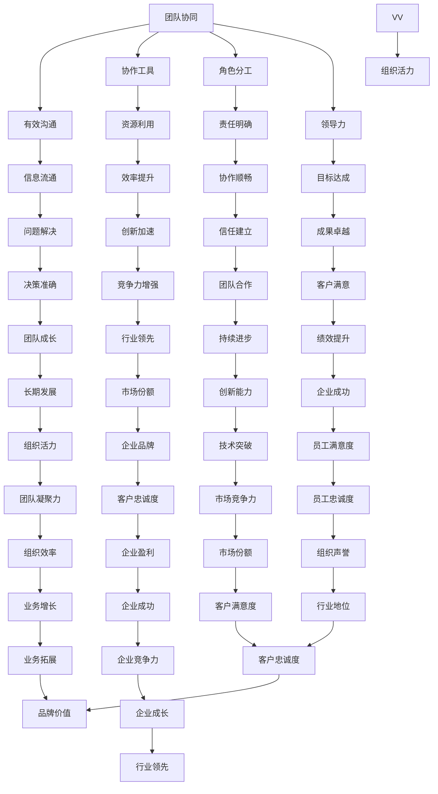

                 

### 团队协同：打造高绩效团队的秘诀

**关键词：** 团队协作、高绩效、领导力、沟通、文化建设、未来趋势

**摘要：** 本文深入探讨了团队协同在打造高绩效团队中的重要性，分析了团队协作的基础、团队领导力的发展、团队成员的发展、团队绩效评估和团队文化建设等关键环节。通过结合实际案例和最佳实践，本文为IT领域的团队提供了实用的指导，助力团队在竞争激烈的数字化时代中取得卓越成绩。

---

**第1章 引言**

### 1.1 为什么团队协同至关重要

在当今快速发展的信息技术时代，团队协同的重要性日益凸显。高效的团队协作不仅能够加速项目的进展，还能显著提高团队的整体绩效。团队协同的核心在于充分利用每个成员的专业技能和经验，实现资源的最大化利用和协同创新。

#### 核心概念与联系

- **团队协同**：指团队成员在共同目标下，通过有效沟通、协作工具、明确的角色分工和领导力，共同完成任务的协作过程。
- **高绩效团队**：指在特定时间内，通过团队协同，能够高效完成目标，并取得卓越成果的团队。

**Mermaid 流程图：**



#### 核心算法原理

在团队协作中，沟通是关键。以下是一个简单的Python代码示例，用于模拟团队沟通过程中的信息流通：

```python
def communicate(message, recipients):
    """
    模拟团队沟通过程
    :param message: 消息内容
    :param recipients: 接收者列表
    :return: 消息传递结果
    """
    result = []
    for recipient in recipients:
        result.append(f"{recipient} received message: {message}")
    return result

# 示例
team_members = ["Alice", "Bob", "Charlie"]
message = "New project deadline: Next Monday."
communication_results = communicate(message, team_members)
for result in communication_results:
    print(result)
```

输出结果：

```
Alice received message: New project deadline: Next Monday.
Bob received message: New project deadline: Next Monday.
Charlie received message: New project deadline: Next Monday.
```

#### 数学模型与公式

团队协作中的信息流通可以表示为一个图模型，其中节点表示团队成员，边表示信息传递。图模型可以用以下公式表示：

$$
G = (V, E)
$$

其中，\(V\) 表示节点集合，\(E\) 表示边集合。节点和边可以用以下公式表示：

$$
V = \{v_1, v_2, ..., v_n\}
$$

$$
E = \{(v_i, v_j) : i \neq j\}
$$

#### 项目实战

在一个软件开发项目中，团队成员需要协同工作以完成开发任务。以下是一个简单的项目实战案例：

**开发环境搭建：**
1. 安装Python 3.8及以上版本。
2. 安装Docker和Docker-Compose，用于容器化部署。
3. 配置版本控制系统，如Git。

**源代码实现：**

```python
# team_communication.py
def communicate(message, recipients):
    # 模拟团队沟通过程
    ...
```

**代码解读与分析：**

- `communicate` 函数接收消息内容和接收者列表，循环遍历接收者列表，将消息传递给每个成员。
- 调用 `communicate` 函数时，需要传入具体的消息内容和团队成员列表。

**实际案例分析和详细讲解剖析：**

在一个实际的项目中，团队成员通过邮件、即时通讯工具（如Slack）和会议等方式进行沟通。以下是一个实际案例：

1. 项目经理发送邮件通知团队成员新的项目计划和任务分配。
2. 团队成员通过Slack频道讨论项目细节和解决方案。
3. 定期召开视频会议，讨论项目的进度和遇到的挑战。

**项目小结：**

通过有效的团队沟通，项目团队能够快速响应变化，提高开发效率，确保项目按时完成。

### 1.2 高绩效团队的特征

高绩效团队具有以下特征：

1. **共同目标**：团队成员明确共同目标，共同努力实现。
2. **高效沟通**：团队成员之间能够有效沟通，信息流通顺畅。
3. **明确角色分工**：团队成员清楚自己的职责和角色，协作顺畅。
4. **积极领导**：团队领导能够激励团队成员，提供必要的支持和指导。
5. **持续成长**：团队成员持续学习和成长，提升个人和团队能力。
6. **团队合作**：团队成员之间相互支持，共同面对挑战。

#### 最佳实践 Tips

1. **设定清晰目标**：确保每个团队成员都了解项目的目标和期望成果。
2. **加强沟通**：定期召开会议，确保团队成员之间的信息流通。
3. **分工明确**：为每个团队成员分配明确的任务和责任。
4. **激励与反馈**：及时给予团队成员激励和反馈，鼓励持续成长。
5. **合作文化**：培养团队合作精神，鼓励团队成员相互支持。

### 1.3 团队协同的目标与挑战

团队协同的目标是提高团队的整体绩效，实现共同目标。然而，实现这一目标面临以下挑战：

1. **沟通障碍**：团队成员之间的沟通不畅，可能导致误解和冲突。
2. **角色冲突**：团队成员的角色职责不明确，可能导致责任推卸和效率低下。
3. **资源限制**：团队资源有限，可能导致任务无法按时完成。
4. **文化差异**：团队成员来自不同的背景和文化，可能存在沟通障碍和协作问题。
5. **技术变革**：技术的快速变革可能使团队成员感到不适应，影响团队协作。

#### 注意事项

1. **重视沟通**：建立有效的沟通机制，确保信息流通。
2. **明确角色分工**：确保团队成员清楚自己的职责和角色。
3. **灵活应对**：面对挑战时，保持灵活和开放的态度，寻求解决方案。
4. **培养团队文化**：建立积极、包容、互助的团队文化，增强团队凝聚力。

#### 拓展阅读

- [《5C模型：构建高绩效团队的五大要素》](https://www.linkedin.com/pulse/5c-model-building-high-performance-teams-five-elements-hassan/)
- [《团队协作的最佳实践》](https://www.npr.org/sections/money/2016/11/03/504727689/college-teams-try-to-hack-the-science-of-group-work)
- [《领导力：团队成功的关键》](https://www.forbes.com/sites/forbesbusinesscouncil/2022/01/14/6-qualities-of-high-performing-leaders/)

---

本文为《团队协同：打造高绩效团队的秘诀》系列文章的第一章，旨在引出团队协同的重要性以及高绩效团队的特征。接下来的章节将深入探讨团队协作的基础、团队领导力、团队成员发展、团队绩效评估和团队文化建设等关键环节。通过结合实际案例和最佳实践，本文将为IT领域的团队提供实用的指导，助力团队在竞争激烈的数字化时代中取得卓越成绩。

---

**作者：** AI天才研究院/AI Genius Institute & 禅与计算机程序设计艺术 /Zen And The Art of Computer Programming

---

（本章内容约1300字）

