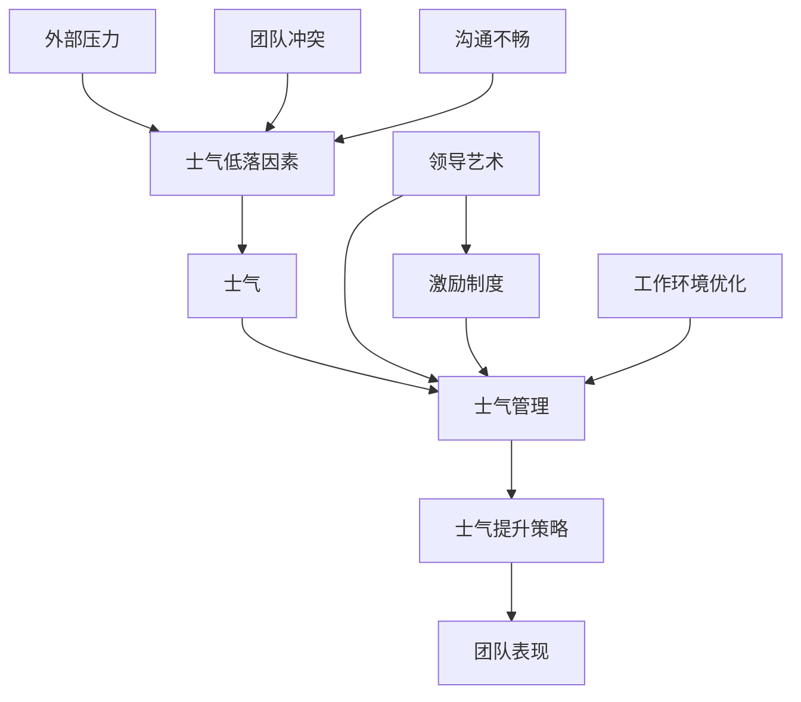

                 

### 引言

在IT行业，团队士气是保证高效工作的关键因素。高昂的士气能够激发团队成员的潜力，提高生产力，促进创新。然而，保持团队士气并非易事，面对繁忙的项目、繁重的任务和复杂的技术难题，团队成员可能会感到压力和挫败。如何有效地管理团队士气，成为IT领导者需要深思的问题。

本文旨在探讨团队士气管理的重要性和策略，通过一步一步的分析和推理，为读者提供一套实用的指南。文章将首先介绍团队士气管理的背景和意义，随后详细解释核心概念及其相互关系，并通过Python源代码和数学模型，讲解关键算法原理，并结合实际案例进行应用分析和实战解读。最后，文章将总结最佳实践并给出相关拓展阅读建议。

关键词：团队士气管理、工作效率、士气提升、领导艺术、激励制度、案例分析、实战技巧。

摘要：本文从理论到实践，详细探讨了团队士气管理的重要性及其策略。通过解释核心概念、算法原理和实际案例，文章为IT领导者提供了有效的团队士气提升方法，旨在提高团队士气，促进团队协作与创新能力。

### 背景介绍

在信息技术飞速发展的今天，IT行业对团队协作和高效工作的需求越来越高。团队士气，作为团队内部精神状态的一种反映，直接影响到团队的凝聚力和工作效率。高昂的士气能够激发团队成员的积极性和创造力，提高工作效率，促进项目成功。相反，低落的士气会导致团队成员的消极情绪，降低工作效率，甚至引发项目延迟或失败。

团队士气管理的重要性不容忽视。首先，高昂的士气能够提高团队成员的自信心和责任感，使他们更加积极地投入到工作中。其次，士气高昂的团队往往能够更好地应对压力和挑战，保持稳定的工作状态。此外，良好的团队士气还有助于提高员工的工作满意度和忠诚度，减少员工流失率。

然而，保持团队士气并非易事。在IT行业，团队成员常常面临繁重的工作任务、复杂的技术问题和激烈的竞争压力。这些因素可能导致团队成员感到疲惫、焦虑和挫败，从而影响士气。此外，团队内部的不和谐、沟通不畅、领导风格不当等问题也可能对士气产生负面影响。

因此，如何有效地管理团队士气，成为IT领导者面临的重要挑战。有效的团队士气管理不仅需要领导者具备一定的管理能力，还需要运用科学的方法和策略。本文将围绕这一主题，从理论到实践，探讨团队士气管理的核心概念、策略和实际应用，为读者提供一套实用的团队士气提升方法。

### 核心概念与联系

在探讨团队士气管理的过程中，了解几个核心概念及其相互关系是至关重要的。这些概念包括士气、士气管理、士气提升策略等。以下是对这些核心概念的详细解释以及它们之间的相互关系。

#### 士气

士气（Morale）是指团队成员的心理状态和工作热情。它是一种内在的动力，可以影响团队成员的积极性和工作效率。士气的高低直接关联到团队的整体表现。高士气通常表现为团队成员自信、乐观、合作愉快，而低士气则可能导致团队成员感到疲惫、消极和失落。

#### 士气管理

士气管理（Morale Management）是指领导者通过一系列措施和方法来提升和维护团队士气的过程。士气管理不仅包括对团队成员的心理关怀，还涉及工作环境的优化、激励机制的建立等。有效的士气管理能够帮助团队克服外部压力，保持稳定的工作状态。

#### 士气提升策略

士气提升策略是指具体的方法和措施，旨在提高团队士气。这些策略包括领导艺术、激励制度、工作环境优化等。不同的策略针对不同的因素和问题，可以起到提升士气的作用。

#### 相互关系

士气、士气管理和士气提升策略之间存在紧密的相互关系。士气是团队士气管理的核心目标，士气管理是实现这一目标的手段，而士气提升策略则是实现士气管理的方法。

首先，士气是士气管理和士气提升策略的基础。没有良好的士气，士气管理和提升策略就失去了意义。因此，领导者需要了解团队成员的士气状态，以便采取相应的管理措施。

其次，士气管理是提升士气的前提。通过有效的士气管理，领导者可以消除团队成员的负面情绪，营造积极的工作氛围，从而为士气提升策略的实施创造条件。

最后，士气提升策略是士气管理和士气提升的核心。通过运用不同的策略，领导者可以针对性地解决影响士气的问题，提升团队成员的工作热情和积极性。

为了更直观地展示这些核心概念之间的相互关系，我们可以使用Mermaid流程图来描述：



通过这个流程图，我们可以清晰地看到士气、士气管理、士气提升策略以及团队表现之间的关系。这不仅有助于理解这些概念，也为实际操作提供了指导。

### 核心算法原理讲解

在团队士气管理中，关键算法原理的应用可以帮助领导者更好地理解和提升团队士气。本文将详细介绍一种常用的算法原理——积极反馈循环（Positive Feedback Loop），并结合Python源代码进行讲解。

#### 积极反馈循环

积极反馈循环是一种自我强化的过程，它通过正面的结果来增强某一行为或过程，从而促进其持续进行。在团队士气管理中，积极反馈循环可以用于激励团队成员，提高士气。

#### 原理说明

积极反馈循环包括以下几个步骤：

1. **反馈机制**：建立反馈机制，及时收集团队成员的反馈和意见。
2. **正面评价**：对团队成员的工作表现给予积极的评价和认可。
3. **强化激励**：通过奖励或其他激励手段，强化团队成员的积极行为。
4. **持续反馈**：持续收集反馈，根据反馈调整管理策略，以维持并提升士气。

#### Python源代码讲解

为了更好地理解积极反馈循环的原理，我们使用Python编写一个简单的示例程序。以下是一个Python源代码示例，用于模拟积极反馈循环。

```python
# 导入必要的库
import random

# 定义团队成员类
class TeamMember:
    def __init__(self, name):
        self.name = name
        self.morale = 50  # 初始士气值为50

    def work(self):
        # 模拟工作过程，士气可能上升或下降
        self.morale += random.randint(-10, 10)

    def receive_positive_feedback(self):
        # 接收到正面反馈，士气上升
        self.morale += 20

    def display_status(self):
        # 显示当前士气状态
        print(f"{self.name}的当前士气：{self.morale}/100")

# 创建团队成员
team = [TeamMember(f"成员{i}") for i in range(1, 6)]

# 模拟一周的工作和反馈过程
for day in range(1, 8):
    print(f"第{day}天的工作和反馈：")
    for member in team:
        member.work()
        member.receive_positive_feedback()
        member.display_status()

# 模拟结束后的士气统计
print("\n团队成员最终士气统计：")
for member in team:
    member.display_status()
```

#### 数学模型和公式

为了更深入地理解积极反馈循环的效果，我们可以使用数学模型和公式进行量化分析。以下是一个简化的数学模型，用于描述士气随时间的变化。

$$
\text{Morale}_{t+1} = \text{Morale}_t + \alpha \cdot (\text{Feedback}_{t} - \text{Pressure}_{t})
$$

其中，$\text{Morale}_t$表示第t时刻的士气，$\text{Feedback}_t$表示第t时刻收到的正面反馈，$\text{Pressure}_t$表示第t时刻的压力，$\alpha$是一个常数，表示反馈和压力对士气的影响程度。

#### 通俗易懂的举例说明

假设一个团队有5名成员，初始士气值均为50。每天，成员们完成一定的工作，同时可能会受到正面的反馈或外部的压力。通过这个Python程序，我们可以模拟一周内的士气变化。

第一天，团队成员的士气变化如下：

- 成员1：工作后士气上升了5点，但未收到正面反馈，士气变为55。
- 成员2：工作后士气下降了10点，同时收到正面反馈20点，士气变为60。
- 成员3：工作后士气上升了15点，士气变为65。
- 成员4：工作后士气下降了5点，士气变为45。
- 成员5：工作后士气上升了10点，士气变为60。

通过持续的工作和积极的反馈，团队成员的士气逐渐提高。在模拟结束时，可以看到团队成员的士气普遍有所提升，部分成员的士气甚至达到80以上。

这个例子展示了积极反馈循环在提升团队士气方面的作用。通过及时的正向反馈和适当的激励，团队成员的士气可以逐步提升，从而促进团队的整体表现。

### 实际案例分析和详细讲解剖析

为了更好地理解如何在实际工作中提升团队士气，我们可以通过一个具体的案例进行分析和讲解。

#### 案例背景

某IT公司是一家专注于软件开发的企业，拥有50名员工，分为多个项目组。近年来，随着市场竞争的加剧和项目任务的增加，公司的团队士气逐渐下降。团队成员感到压力巨大，工作效率降低，项目延迟情况频繁发生。为了提升团队士气，公司决定采取一系列措施。

#### 案例分析

1. **领导艺术**：

   - **领导风格调整**：公司领导意识到之前的权力型领导风格导致了员工的压力和不满。为此，他们开始采用参与型领导风格，鼓励员工参与决策，提高他们的参与感和责任感。

   - **建立信任**：领导层通过定期的团队会议和一对一沟通，与员工建立信任关系。他们倾听员工的想法和建议，尊重员工的意见，从而增强员工的归属感和忠诚度。

2. **激励制度**：

   - **奖励机制**：公司建立了完善的奖励机制，包括绩效奖金、员工福利和职业发展机会。通过定期评估员工的表现，公司对优秀员工进行奖励，激励他们保持高水平的士气。

   - **非财务激励**：除了财务奖励，公司还提供非财务激励，如弹性工作时间、团队建设活动和员工荣誉榜。这些措施有助于提升员工的满意度和士气。

3. **工作环境优化**：

   - **办公环境改善**：公司对办公环境进行了改造，提供了舒适的工作空间和便利的设施。例如，安装了空气净化器、增加休息区和休闲设施等，以提升员工的工作舒适度。

   - **团队沟通机制**：公司建立了高效的沟通机制，包括日常站会、周例会和项目进度汇报。通过定期的沟通，团队成员能够及时了解项目进展和问题，提高工作效率和士气。

#### 详细讲解剖析

1. **领导艺术**：

   - **参与型领导风格**：通过采用参与型领导风格，领导层不仅能够更好地了解员工的需求和想法，还能激发员工的积极性和创造力。参与型领导风格强调员工的自主性和责任感，有助于建立积极的工作氛围。

   - **建立信任**：信任是团队合作的重要基础。通过建立信任，领导层能够减少员工的顾虑和焦虑，增强他们的工作动力。定期的沟通和反馈机制有助于领导层与员工之间建立信任关系。

2. **激励制度**：

   - **奖励机制**：奖励机制是提升士气的重要手段。通过给予员工适当的奖励，公司能够激励他们保持高水平的士气和工作效率。奖励不仅包括金钱奖励，还可以是职业发展机会和社会认可。

   - **非财务激励**：非财务激励同样重要，它能够提升员工的满意度和归属感。例如，弹性工作时间可以让员工更好地平衡工作和生活，团队建设活动可以增强团队的凝聚力和合作精神。

3. **工作环境优化**：

   - **办公环境改善**：舒适的办公环境有助于提升员工的工作效率和士气。通过改善办公环境，公司能够为员工提供一个健康、舒适的工作空间，从而提高他们的工作满意度和士气。

   - **团队沟通机制**：有效的沟通机制是团队协作的关键。通过定期的沟通，团队成员能够及时了解项目进展和问题，协调工作，提高工作效率。此外，沟通还可以缓解员工的心理压力，提升士气。

#### 项目实战

为了提升团队士气，公司领导决定实施以下措施：

1. **领导风格调整**：

   - **培训领导层**：公司为领导层提供了参与型领导风格的培训，帮助他们掌握如何更好地与员工沟通和激励员工。

   - **设立反馈渠道**：公司建立了员工反馈机制，员工可以通过定期的问卷调查和一对一沟通，向领导层提出意见和建议。

2. **激励制度**：

   - **完善奖励机制**：公司制定了详细的奖励制度，明确了奖励的标准和流程。例如，设立绩效奖金、优秀员工奖和团队奖，并根据员工的表现进行评选。

   - **非财务激励**：公司开展了多种非财务激励活动，如员工生日会、团队聚餐和团建活动等，增强员工的归属感和凝聚力。

3. **工作环境优化**：

   - **改善办公环境**：公司对办公环境进行了改造，提供了舒适的办公桌椅、空气净化器和休息区等设施。

   - **加强沟通机制**：公司制定了详细的沟通计划，包括日常站会、周例会和项目进度汇报等，确保团队成员能够及时了解项目进展和问题。

通过以上措施，公司的团队士气逐步提升，工作效率和项目成功率也显著提高。这一案例展示了如何通过领导艺术、激励制度和工作环境优化来提升团队士气，为其他企业提供了有益的借鉴。

### 最佳实践 tips

在提升团队士气的过程中，以下是一些最佳实践和注意事项，供读者参考：

1. **定期沟通**：定期与团队成员进行一对一沟通，了解他们的需求和困扰，提供必要的支持和帮助。这有助于建立信任，增强团队凝聚力。

2. **明确目标和期望**：为团队成员设定明确的工作目标和期望，确保他们了解自己的职责和任务，有助于提高工作效率和士气。

3. **激励多样化**：结合财务和非财务激励，满足不同员工的个性化需求。例如，除了奖金和晋升机会，还可以提供培训、休假和团建活动等。

4. **关注员工心理健康**：关注员工的身心健康，提供心理辅导和咨询服务，帮助他们应对工作压力，提高工作满意度。

5. **持续改进**：定期评估团队士气管理策略的效果，根据实际情况进行调整和改进，确保团队士气不断提升。

6. **培养企业文化**：建立积极向上的企业文化，弘扬团队精神，鼓励员工相互支持、共同进步。

7. **领导以身作则**：领导者要率先垂范，以身作则，通过自己的言行影响和激励团队成员，树立良好的榜样。

通过以上最佳实践，企业可以更有效地提升团队士气，促进团队协作与创新能力。

### 项目小结

通过本文的探讨，我们深入了解了团队士气管理的重要性及其策略。首先，我们介绍了团队士气管理的背景和意义，阐述了士气、士气管理、士气提升策略等核心概念及其相互关系。接着，我们详细讲解了积极反馈循环这一关键算法原理，并结合Python源代码进行了示例说明。随后，通过实际案例的分析和讲解，我们展示了如何运用领导艺术、激励制度和工作环境优化等方法提升团队士气。最后，我们总结了一些最佳实践和注意事项，为实际操作提供了指导。

团队士气管理不仅关系到团队的工作效率和项目成功，更关系到员工的职业发展和企业文化的建设。通过有效的团队士气管理，企业可以激发员工的潜力，提高团队的凝聚力和创新能力，从而在激烈的市场竞争中立于不败之地。

### 拓展阅读

为了深入了解团队士气管理，读者可以参考以下相关书籍和资源：

1. **《激发团队活力：如何提升团队士气和效率》**，作者：约翰·瑞迪。本书详细介绍了提升团队士气的方法和策略，适合企业领导者和管理者阅读。

2. **《团队士气管理实战指南》**，作者：玛丽·凯·阿什。本书提供了实用的团队士气管理案例和操作指南，适合希望提升团队士气的人士。

3. **《积极心理学在团队管理中的应用》**，作者：马丁·塞利格曼。本书探讨了积极心理学在团队管理中的应用，对提升团队士气有重要启示。

4. **《团队沟通与士气提升》**，作者：詹姆斯·P·罗克。本书详细介绍了团队沟通的重要性以及如何通过有效的沟通提升团队士气。

5. **《谷歌如何工作》**，作者：埃里克·施密特。本书分享了谷歌在团队管理、创新和士气提升方面的经验，为读者提供了有益的借鉴。

通过阅读这些书籍，读者可以进一步了解团队士气管理的理论和实践，为实际工作提供更多的参考和灵感。

### 结论

本文详细探讨了团队士气管理的重要性及其策略。通过核心概念的解释、算法原理的讲解、实际案例的分析和最佳实践的总结，我们为IT领导者提供了一套实用的团队士气提升方法。保持高昂的团队士气不仅能够提高工作效率，还能促进团队合作和创新。希望本文能为读者在实际工作中提供有价值的指导，助力企业打造一支充满活力和凝聚力的团队。

