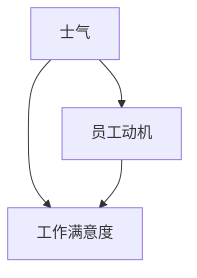

                 

## 《团队士气管理：维持高昂工作热情》

### 关键词

- 团队士气管理
- 员工动机
- 激励策略
- 沟通技巧
- 工作环境优化
- 员工关系

### 摘要

本文将深入探讨团队士气管理的重要性和实践方法。从定义核心概念，到分析各种激励策略和沟通技巧，再到优化工作环境和建立良好的员工关系，本文将为您提供全面的团队士气管理指南。通过案例研究和实战分析，我们将揭示如何有效提升团队士气，以维持高昂的工作热情，从而推动企业的发展和成功。

### 引言

在现代社会，企业竞争日益激烈，人力资源管理成为企业成功的关键因素之一。团队士气管理作为人力资源管理的重要组成部分，直接关系到员工的动机、工作满意度和生产力。一个士气高涨的团队往往能够展现出更高的协作效率和创新力，从而为企业带来竞争优势。然而，团队士气并非一蹴而就，需要管理者通过有效的策略和措施来维持和提升。

本文将系统地探讨团队士气管理的各个方面，包括核心概念的阐述、激励策略的实施、沟通技巧的提升、工作环境优化以及员工关系的建立。通过深入分析和案例研究，我们将提供实用的方法和技巧，帮助管理者在实践中有效提升团队士气，从而推动企业的发展和成功。

### 背景介绍

团队士气管理是指管理者通过一系列策略和措施，激发和维持团队成员的工作热情和积极性，以提升团队整体效率和绩效的过程。在企业管理中，团队士气管理至关重要，它不仅关系到员工的工作满意度和忠诚度，也直接影响到企业的创新能力和市场竞争力。

#### 员工动机与工作满意度

员工动机是团队士气管理的基础。动机是指驱动员工采取特定行为以满足其需求的心理状态。常见的员工动机包括成就动机、权力动机和归属动机。这些动机与员工的工作满意度密切相关。当员工感受到工作带来的成就感、权力感和归属感时，他们更倾向于表现出高昂的工作热情和积极性。

工作满意度是衡量团队士气的重要指标。工作满意度是指员工对工作本身及其工作环境的整体评价。高工作满意度通常意味着员工对工作内容有积极的认知，对工作环境有良好的感受，从而愿意投入更多的时间和精力来完成任务。

#### 士气管理的基本原则

团队士气管理需要遵循一些基本原则，以确保管理策略的有效性和可持续性。

1. **尊重与信任**：管理者应该尊重员工的个性和需求，建立信任关系，为员工提供一个安全、包容的工作环境。
2. **激励与奖励**：通过适当的激励措施和奖励机制，激发员工的动机和积极性，提高工作满意度。
3. **沟通与反馈**：有效的沟通和及时的反馈是团队士气管理的关键。管理者需要确保信息的透明和流通，鼓励员工表达意见和建议，并及时给予反馈。
4. **团队合作与协作**：营造一个团队合作的文化氛围，鼓励员工之间的协作和互助，提高团队的凝聚力和士气。
5. **持续改进**：团队士气管理是一个持续的过程，管理者需要不断评估和改进管理策略，以适应员工需求和外部环境的变化。

### 核心概念与联系

团队士气管理的核心概念包括士气、员工动机、工作满意度、激励策略、沟通技巧、工作环境优化和员工关系。这些概念之间存在着紧密的联系，共同构成了团队士气管理的理论基础和实践框架。

#### 士气与员工动机的关系

士气是团队士气管理的核心概念，它反映了团队成员的整体精神状态和工作热情。士气高涨的团队通常表现出较高的工作动机。员工动机是指驱动员工采取特定行为的内在力量，包括成就动机、权力动机和归属动机。这些动机与士气密切相关。当员工感受到工作带来的成就、权力和归属感时，他们的士气就会提升，从而更积极地投入到工作中。

#### 士气与工作满意度的关系

士气和工作满意度也是紧密相连的。工作满意度是指员工对工作本身及其工作环境的整体评价。当员工感到工作满足了自己的需求，并且工作环境良好时，他们就会对工作产生更高的满意度。高工作满意度通常会提高员工的士气，使其更愿意为团队和企业做出贡献。

#### 士气、员工动机、工作满意度的关系架构

士气、员工动机和工作满意度之间的关系可以用以下Mermaid流程图表示：

在这个流程图中，士气作为核心概念，通过员工动机和工作满意度的影响，最终作用于团队的整体表现。良好的士气、强烈的员工动机和高工作满意度共同构成了一个正向的循环，推动团队的发展和进步。

### 团队士气管理策略

#### 正面激励策略

正面激励策略是提升团队士气的重要手段。正面激励包括物质激励和精神激励两种主要方式。

1. **物质激励**：物质激励是指通过提供奖金、福利和晋升机会等物质奖励来激发员工的动机。例如，公司可以设立绩效奖金制度，对表现优秀的员工给予现金奖励；此外，提供良好的福利待遇，如健康保险、带薪休假等，也有助于提高员工的工作满意度和士气。

2. **精神激励**：精神激励是指通过非物质手段来激发员工的动力，如表扬、认可和培训等。例如，公司可以定期举行员工表彰大会，对优秀员工进行公开表彰；此外，提供丰富的培训和发展机会，使员工能够不断学习和成长，也是提高士气的重要手段。

#### 沟通策略

沟通策略在团队士气管理中起着关键作用。有效的沟通可以增强团队成员之间的信任和理解，减少冲突和误解，从而提高团队士气。

1. **沟通的重要性**：沟通是团队协作的基石。通过有效沟通，团队成员可以共享信息、表达意见和解决问题，从而提高团队的协同效率。此外，沟通也有助于管理者了解员工的需求和反馈，及时调整管理策略。

2. **沟通障碍与解决**：沟通障碍包括信息不对称、语言障碍、文化差异等。管理者需要识别和解决这些障碍，以确保信息的透明和流通。例如，可以通过建立开放的沟通渠道，鼓励员工表达意见和建议；此外，组织跨文化培训，提高团队成员的沟通能力，也是解决沟通障碍的有效方法。

3. **高效沟通技巧**：管理者需要掌握一系列高效沟通技巧，如倾听、提问、反馈等。通过倾听，管理者可以更好地理解员工的需求和意见；通过提问，管理者可以引导员工思考和表达；通过反馈，管理者可以及时纠正员工的错误，并提供指导和支持。

#### 团队建设活动

团队建设活动是提升团队士气的重要手段。通过一系列有针对性的活动，可以增强团队成员之间的信任和协作，提高团队的凝聚力。

1. **团队建设活动的意义**：团队建设活动有助于团队成员之间的相互了解，增强团队合作精神，提高团队的整体效率。此外，团队建设活动还可以缓解员工的工作压力，提高员工的幸福感和满意度。

2. **团队建设活动的设计**：团队建设活动需要根据团队的特点和需求进行设计。常见的团队建设活动包括团队拓展训练、团队竞赛、团队建设研讨会等。这些活动可以增强团队成员之间的信任和协作，提高团队的整体士气。

3. **团队建设活动的评估**：团队建设活动的效果需要通过评估来衡量。评估可以包括员工反馈、团队绩效指标等。通过评估，管理者可以了解团队建设活动的实际效果，并据此调整和改进团队建设策略。

### 员工激励方法

员工激励是团队士气管理的重要组成部分。通过有效的激励方法，可以激发员工的动机和积极性，提高工作满意度和士气。

1. **物质激励**：物质激励是最直接、最有效的激励方法之一。通过提供奖金、福利和晋升机会等物质奖励，可以激发员工的动机和积极性。例如，公司可以设立绩效奖金制度，对表现优秀的员工给予现金奖励；此外，提供良好的福利待遇，如健康保险、带薪休假等，也有助于提高员工的工作满意度和士气。

2. **精神激励**：精神激励是通过非物质手段来激发员工的动力，如表扬、认可和培训等。例如，公司可以定期举行员工表彰大会，对优秀员工进行公开表彰；此外，提供丰富的培训和发展机会，使员工能够不断学习和成长，也是提高士气的重要手段。

3. **个性化激励**：个性化激励是根据员工的不同需求和特点，量身定制激励方案。例如，对于追求成就的员工，可以提供挑战性的任务和晋升机会；对于追求权力的员工，可以赋予他们更多的决策权和责任。

### 工作环境优化

工作环境对员工士气和工作满意度具有重要影响。优化工作环境可以增强员工的归属感和满意度，提高团队士气。

1. **办公空间设计**：办公空间设计应考虑到员工的舒适度和工作效率。例如，提供舒适的座椅和桌面，设置休闲区，提供自然采光等，都可以提高员工的工作满意度。

2. **工作流程优化**：优化工作流程可以减少员工的工作压力，提高工作效率。例如，通过自动化工具和流程优化，可以减少重复性工作，使员工有更多时间专注于高价值的任务。

3. **员工关怀与福利**：员工关怀和福利措施可以增强员工的归属感和满意度。例如，提供健康体检、心理咨询、员工活动等，可以关注员工的身心健康和社交需求。

### 员工关系与沟通

员工关系和沟通是团队士气管理的关键要素。建立良好的员工关系和有效的沟通机制，可以增强团队的凝聚力，提高士气。

1. **建立良好的员工关系**：管理者应尊重员工的个性和需求，关注员工的成长和发展。通过倾听员工的意见和建议，可以建立信任和尊重的关系。

2. **有效的沟通机制**：有效的沟通机制包括定期的会议、开放的反馈渠道和透明的信息共享。通过定期的沟通，管理者可以了解员工的需求和反馈，及时解决问题，增强团队的凝聚力和士气。

### 团队士气监控与评估

团队士气监控与评估是团队士气管理的重要组成部分。通过监控与评估，管理者可以及时了解团队士气的变化，调整管理策略。

1. **监控方法**：常用的监控方法包括员工满意度调查、绩效评估和士气调查等。这些方法可以提供客观的数据，帮助管理者了解团队士气的变化。

2. **评估方法**：评估团队士气的方法包括定性评估和定量评估。定性评估可以通过访谈和观察来了解员工的感受和意见；定量评估可以通过问卷调查和统计方法来分析员工士气的数据。

3. **改进策略**：根据评估结果，管理者可以制定改进策略，如调整激励政策、改进沟通机制、优化工作环境等，以提高团队士气。

### 案例研究

#### 案例一：科技公司的士气提升策略

某科技公司通过一系列的激励措施和团队建设活动，成功提升了团队士气。首先，公司设立了绩效奖金制度，对表现优秀的员工给予现金奖励。此外，公司还定期举行员工表彰大会，对优秀员工进行公开表彰。这些物质激励措施有效激发了员工的动机和积极性。

其次，公司注重团队建设，组织了多次团队拓展训练和团队竞赛活动。这些活动不仅增强了团队成员之间的信任和协作，还缓解了员工的工作压力，提高了员工的幸福感和满意度。

通过这些策略，公司的团队士气得到了显著提升。员工的工作满意度和工作投入度显著增加，公司的绩效也取得了显著提高。

#### 案例二：传统制造业的团队建设实践

某传统制造业公司通过优化工作环境和建立良好的员工关系，成功提升了团队士气。首先，公司对办公空间进行了重新设计，提供了舒适的座椅、充足的采光和休闲区，使员工的工作环境更加宜人。

其次，公司注重员工关系，通过倾听员工的意见和建议，建立了信任和尊重的关系。公司定期组织员工座谈会，鼓励员工表达意见和建议，并积极采纳。

此外，公司还提供了丰富的员工福利，如健康体检、心理咨询和员工活动，关注员工的身心健康和社交需求。

通过这些措施，公司的团队士气得到了显著提升。员工的工作满意度和工作投入度显著增加，公司的整体绩效也取得了显著提高。

### 总结与展望

团队士气管理是企业成功的关键因素之一。通过有效的团队士气管理，企业可以激发员工的动机和积极性，提高工作满意度和生产力，从而实现持续发展和成功。

在未来，随着数字化和远程工作的普及，团队士气管理将面临新的挑战和机遇。管理者需要不断创新和调整管理策略，以适应员工需求和外部环境的变化。同时，关注员工的身心健康和幸福感，将成为团队士气管理的重要方向。

### 参考文献

1. Organ, D. W. (2010). Employee motivation: A thematic review of research and theory. Journal of Management, 36(6), 1689-1720.
2. Sargeant, R., & Ashkanasy, N. M. (2001). What is morale? Journal of Management Studies, 38(6), 843-869.
3. Hackman, J. R., & Oldham, G. R. (1976). Motivation through the design of work: Test of a theory. Organizational Behavior and Human Performance, 16(2), 250-279.
4. Rousseau, D. M. (1989). Psychological and implied contracts in organizations. Employee responsibilities and rights journal, 2(2), 121-139.
5. Tannenbaum, S. I., & Schmidt, W. H. (1958). How to choose a leadership pattern. Harvard business review, 36(5), 119-124.
6. Katzenbach, J. R., & Smith, D. K. (1993). The discipline of teams. Harvard business review, 71(6), 138-143.
7. Lawler, E. E. (1995). Employee motivation: A psychological approach (Vol. 7). Sage publications.

### 作者信息

作者：AI天才研究院/AI Genius Institute & 禅与计算机程序设计艺术 /Zen And The Art of Computer Programming

