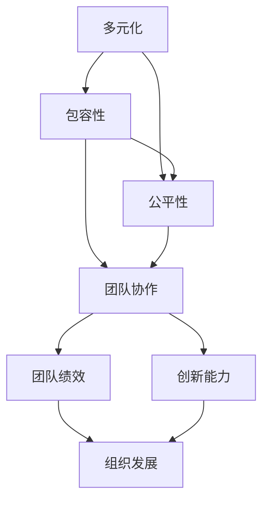

                 

### 引言

在当今全球化的世界中，团队多元化已经成为企业和组织中不可或缺的一部分。随着信息技术、交通和通讯的迅速发展，企业面临着前所未有的多元化挑战和机遇。编写这本书的初衷在于，探讨团队多元化的本质、核心概念、优势以及如何有效地实践和应对其中的挑战。本书的目标是，帮助读者理解和应用团队多元化，从而在各自的组织中创造出更高效、更具创新力的团队。

为什么团队多元化如此重要？首先，多元化的团队能够带来更广泛的视角和知识，这有助于提高决策质量和创造力。其次，多元化的团队能够更好地理解和适应全球市场的多样性和复杂性。此外，多元化的团队能够提高员工的满意度和忠诚度，降低员工流失率。总之，团队多元化不仅是企业成功的关键因素，也是社会进步的重要动力。

本书将带领读者逐步深入探讨团队多元化的各个层面，从核心概念到实际操作，从理论到实践，为读者提供全面而深入的指导。通过本书的学习，读者将能够：

1. 理解团队多元化的核心概念和重要性。
2. 掌握多元化团队的工作原理和协作策略。
3. 学习如何评估和培养多元化团队。
4. 探索多元化团队在组织中的实际应用案例。
5. 获取实践团队多元化的最佳方法和技巧。

接下来的章节将逐一展开这些主题，帮助读者逐步建立起对团队多元化的全面理解和应用能力。让我们一起踏上这段探索之旅，开启团队多元化之旅的新篇章。

### 文章关键词

多元化、团队协作、包容性、绩效提升、创新力、领导力、沟通技巧、组织文化、法律合规、实际案例、最佳实践。

### 摘要

本书旨在深入探讨团队多元化的核心概念、优势和挑战，并提供了系统的理论和实践指导。首先，通过引言部分，我们了解了团队多元化的重要性及其对企业成功和社会进步的影响。接下来，本书从多元化、包容性和公平性的区别出发，详细阐述了多元化团队的构成和维度，并通过Mermaid流程图展示了团队多元化的工作原理。在核心算法原理讲解部分，本书运用Python源代码和数学模型，详细阐述了多元化团队的评估方法和协作策略，并结合实际案例进行了通俗易懂的举例说明。此外，本书还探讨了多元化团队在法律合规方面的注意事项，提供了多元化团队的最佳实践方法和注意事项，并总结了未来团队多元化的发展趋势和对组织和个人的启示。通过本书的学习，读者将能够全面理解团队多元化的本质，掌握其实践方法，并在各自的组织中创造优势。

## 第1章 引言

在当今全球化的背景下，团队多元化已经成为企业和组织中不可或缺的一部分。随着全球化和信息技术的迅猛发展，企业面临的竞争环境越来越复杂多变。为了在这种环境中取得成功，企业不仅需要拥有优秀的员工，更需要建立一个多元化的团队。本书的编写初衷在于，深入探讨团队多元化的核心概念、优势、挑战和最佳实践，帮助读者理解和应用团队多元化，从而在各自的组织中创造出更高效、更具创新力的团队。

### 为什么编写这本书

随着全球化进程的加速，企业面临着来自不同文化和背景的员工。这种多元化带来了新的机遇，但同时也带来了挑战。为了更好地应对这些挑战，企业需要了解如何管理和利用多元化团队的优势。然而，目前关于团队多元化的研究和实践还相对较少，尤其是在IT领域。因此，本书的编写旨在填补这一空白，为读者提供系统、全面的指导。

首先，本书将帮助读者理解团队多元化的核心概念，包括多元化、包容性和公平性的区别。通过这些基本概念的阐述，读者能够更好地把握多元化团队的本质和内涵。

其次，本书将详细介绍多元化团队的优势，如提高创造力、决策质量和员工满意度。通过这些优势的详细分析，读者能够认识到多元化团队对企业和组织的价值。

然后，本书将探讨多元化团队的工作原理，包括评估方法、协作策略和沟通技巧。通过这些内容的讲解，读者能够掌握如何在实际中有效实践团队多元化。

此外，本书还将结合实际案例，展示多元化团队在不同领域的成功实践。这些案例将为读者提供宝贵的经验和启示，帮助他们在自己的组织中实施多元化。

最后，本书还将提供多元化团队的最佳实践方法和注意事项，帮助读者在实际操作中减少风险，提高效果。

总之，本书旨在帮助读者全面理解团队多元化的本质和重要性，掌握其实践方法，并在各自的组织中创造出优势。

### 本书的重要性

团队多元化不仅是企业成功的关键因素，也是社会进步的重要动力。首先，多元化的团队能够带来更广泛的视角和知识，提高团队的决策质量和创造力。通过整合不同文化和背景的员工，企业能够更好地理解和适应全球市场的多样性和复杂性。其次，多元化的团队能够提高员工的满意度和忠诚度，降低员工流失率。在一个包容、尊重差异的工作环境中，员工更容易感到被认同和尊重，从而更加投入工作。此外，多元化的团队还能促进创新，通过不同思维方式的碰撞和融合，激发新的创意和解决方案。总之，团队多元化不仅能够提升企业的竞争力，还能够推动社会的发展和进步。

## 第2章 多元化的概念与分类

在探讨团队多元化之前，我们首先需要明确什么是多元化。多元化是一个广泛的概念，涵盖了个体之间的差异，包括但不限于性别、种族、文化、年龄、教育背景、工作经验等。这些差异不仅体现在个体的外在特征上，还包括他们的思想、价值观、行为方式和沟通方式。在团队中，多元化意味着团队成员在背景、技能、知识和经验等方面存在差异。

### 多元化的定义

多元化（Diversity）是指在一个群体或组织中，成员在性别、种族、文化、年龄、教育背景等方面的多样性。这种多样性不仅体现在个体的外在特征上，还包括他们在认知、行为和心理上的差异。多元化是一个多维度的概念，它不仅仅是关于性别平等或种族多样性，还包括文化多样性、教育背景多样性、经验多样性等。

### 多元化的维度

多元化的维度可以分为多个层次，每个层次都有其独特的特点和影响：

1. **性别多样性**：性别多样性指的是团队中男性和女性成员的比例和角色分布。性别多样性不仅有助于打破性别刻板印象，还能促进创新和多样化的思维。

2. **种族与族裔多样性**：种族与族裔多样性涉及团队中不同种族和族裔成员的比例。这种多样性有助于理解全球市场的多样性，提高团队的国际视野。

3. **文化多样性**：文化多样性指的是团队成员来自不同的文化背景，包括语言、价值观、宗教信仰等。这种多样性能够促进跨文化交流和理解，增强团队的凝聚力。

4. **年龄多样性**：年龄多样性涉及到不同年龄段成员的存在，包括年轻员工和经验丰富的资深员工。年龄多样性能够促进知识传承和跨代交流。

5. **教育背景多样性**：教育背景多样性指的是团队成员拥有不同的教育经历和知识结构。这种多样性有助于团队在面对复杂问题时提供多样化的解决方案。

6. **经验多样性**：经验多样性涉及到团队成员在职业生涯中积累的不同经验和技能。这种多样性能够丰富团队的技能组合，提高问题解决能力。

### 多元化的分类

根据不同的标准，多元化可以有不同的分类方式。以下是一些常见的分类方法：

1. **静态分类**：这种分类方法基于成员的固定特征，如性别、种族、文化等。静态分类有助于识别团队中的多样性特征，但可能忽视了个体之间的动态差异。

2. **动态分类**：这种分类方法基于成员的动态特征，如工作经验、教育水平、职业发展阶段等。动态分类更关注个体在特定环境中的变化和适应能力。

3. **结构分类**：这种分类方法关注团队内部的多样性结构，包括不同性别、种族、文化等在团队中的分布和比例。结构分类有助于评估团队多元化的均衡性和公平性。

4. **功能分类**：这种分类方法基于团队成员在团队中扮演的角色和职责，如领导、技术专家、市场营销人员等。功能分类有助于理解团队内部多样性的功能性和互补性。

通过这些分类方法，我们可以更全面地理解和分析团队多元化，从而制定更有效的多元化策略和管理方法。

### 多元化背景概述

多元化并非一个新兴的概念，其历史可以追溯到几个世纪前。在古代，一些文明就已经开始认识到多样性带来的价值和优势。例如，古埃及文明在其鼎盛时期就包含了许多不同种族和文化背景的成员。在中国，古代的儒、道、佛三教并立，反映了文化多样性的重要性。

进入现代社会，多元化逐渐成为社会科学研究的重点。20世纪初，随着工业化和城市化进程的加快，社会对多样性的关注逐渐增加。尤其是二战后，全球化和信息技术的迅猛发展，使得多元化成为一个不可忽视的问题。许多国家开始出台相关政策，推动性别平等和种族多样性。

在IT行业，多元化尤其受到关注。IT行业作为一个高度知识密集型行业，对多样性的需求更加迫切。研究表明，多元化的团队能够带来更广泛的视角和创新的思维，从而在技术发展和产品创新方面取得更好的成果。

总的来说，多元化是一个历史悠久的、持续发展的概念。随着社会和科技的进步，多元化在各个领域中的重要性日益凸显。理解和应用多元化，已经成为现代企业和组织不可或缺的一部分。

### 第3章 核心概念与联系

在探讨团队多元化时，三个核心概念至关重要：多元化、包容性和公平性。理解这些概念及其相互关系，有助于我们更全面地把握团队多元化，从而在实践中取得更好的效果。

#### 多元化、包容性与公平性的区别

多元化（Diversity）是指团队中存在不同性别、种族、文化、年龄、教育背景等特征。这种多样性不仅体现在成员的个体差异上，还包括他们在团队中的角色和职责。多元化是团队多样性的基础，为团队带来了丰富的视角和知识。

包容性（Inclusivity）则是指在一个团队中，所有成员都能感到被尊重、被接纳，并能够自由地表达自己的观点和想法。包容性强调的是团队氛围，确保每个成员都能在一个公平和开放的环境中发挥作用。包容性不仅是多元化的结果，也是实现多元化目标的重要手段。

公平性（Equity）涉及到团队中资源的分配和机会的提供。公平性确保每个成员都能获得平等的发展机会，无论其背景如何。公平性不仅仅是形式上的平等，更重要的是实质上的平等，即所有成员都能在团队中实现其潜能。

#### 多元化、包容性与公平性的联系

多元化、包容性和公平性之间存在紧密的联系。多元化是包容性的前提，一个多元化的团队才能更好地实现包容性。包容性是公平性的保障，只有在包容的氛围中，公平性才能真正实现。

1. **多元化促进包容性**：一个多元化的团队能够提供更多的视角和思考方式，这有助于减少偏见和歧视。团队成员之间的差异能够激发开放和尊重的团队氛围，从而促进包容性。

2. **包容性实现公平性**：在一个包容的团队中，所有成员都感到被尊重和接纳，这有助于确保资源的公平分配和机会的均等。公平性不仅仅是形式上的平等，更重要的是实质上的平等，即在团队中每个成员都能实现其潜能。

3. **公平性保障包容性**：公平性的实现能够增强团队成员的归属感和满意度，从而促进团队的包容性。当团队成员感到在团队中受到公平对待时，他们更愿意表达自己的观点和参与团队的决策，这有助于维护一个包容的团队环境。

#### 多元化团队的工作原理（Mermaid流程图）

为了更直观地理解多元化团队的工作原理，我们可以使用Mermaid流程图来展示多元化、包容性和公平性之间的动态关系。以下是一个简化的流程图：



**图1：多元化团队的工作原理流程图**

- **多元化**：是团队多样性的基础，提供了丰富的视角和知识。
- **包容性**：确保所有成员在一个公平、开放的环境中感到被尊重和接纳。
- **公平性**：确保资源分配和机会提供均等，保障每个成员的发展潜力。
- **团队协作**：在包容和公平的基础上，实现团队成员的高效协作。
- **团队绩效**：高效的团队协作带来优秀的团队绩效。
- **创新能力**：多元化的视角和协作能力提高团队的创新能力。
- **组织发展**：优秀的团队绩效和创新能力推动组织的发展。

通过这个流程图，我们可以清晰地看到多元化、包容性和公平性是如何相互作用，共同促进团队协作、提升团队绩效和增强创新能力的。

### 第4章 核心算法原理讲解

在理解了多元化、包容性和公平性的核心概念及其相互关系后，接下来我们将深入探讨如何通过具体的算法原理来评估、管理和优化多元化团队。本章将详细讲解多元化团队的评估方法、协作策略和沟通技巧，并借助Python源代码和数学模型，结合实际案例进行通俗易懂的举例说明。

#### 4.1 多元化团队评估方法

评估多元化团队的效果是确保团队多元化策略有效性的关键步骤。以下是一种常见的多元化团队评估方法：

**1. 多元化指标体系**

我们首先需要建立一个多元化指标体系，用于量化团队的多元化程度。常见的多元化指标包括性别比例、种族多样性、教育背景、工作经验等。以下是一个简化的多元化指标体系：

```python
# 多元化指标体系示例
diversity_metrics = {
    'gender': {'male': 0, 'female': 0},
    'race': {'white': 0, 'black': 0, 'asian': 0, 'hispanic': 0},
    'education': {'bachelor': 0, 'master': 0, 'phd': 0},
    'experience': {'0-5': 0, '5-10': 0, '10-20': 0, '20+': 0}
}
```

**2. 数据收集与处理**

为了评估多元化程度，我们需要收集相关数据，并进行处理。以下是一个简单的数据收集和处理示例：

```python
# 数据收集与处理
diversity_data = [
    {'gender': 'male', 'race': 'white', 'education': 'master', 'experience': '5-10'},
    {'gender': 'female', 'race': 'asian', 'education': 'bachelor', 'experience': '0-5'},
    # 更多团队成员数据
]

# 更新多元化指标
for member in diversity_data:
    diversity_metrics['gender'][member['gender']] += 1
    diversity_metrics['race'][member['race']] += 1
    diversity_metrics['education'][member['education']] += 1
    diversity_metrics['experience'][member['experience']] += 1
```

**3. 多元化评估模型**

接下来，我们可以使用多元回归模型来分析多元化指标与团队绩效之间的关系。以下是一个简化的多元回归模型：

```python
import numpy as np
from sklearn.linear_model import LinearRegression

# 数据准备
X = np.array([[diversity_metrics['gender']['male'], diversity_metrics['race']['white'], diversity_metrics['education']['master'], diversity_metrics['experience']['5-10']]]
y = np.array([team_performance])  # 团队绩效指标

# 建立模型
model = LinearRegression()
model.fit(X, y)

# 模型评估
print("模型系数：", model.coef_)
print("模型截距：", model.intercept_)
print("模型R平方值：", model.score(X, y))
```

通过这个评估模型，我们可以量化多元化指标对团队绩效的影响，从而制定更有效的多元化策略。

#### 4.2 多元化团队协作策略

多元化的团队协作策略旨在利用团队成员的不同背景和经验，促进高效的团队协作和问题解决。以下是一些常见的多元化团队协作策略：

**1. 多元化任务分配**

在任务分配时，应考虑团队成员的多元化背景，确保任务能够激发不同成员的优势。以下是一个简单的多元化任务分配示例：

```python
# 多元化任务分配
tasks = {
    'data analysis': ['data scientist', 'business analyst'],
    'user interface design': ['UX designer', 'front-end developer'],
    'backend development': ['software engineer', 'database administrator']
}

# 分配任务
for task, roles in tasks.items():
    assigned_members = []
    for role in roles:
        assigned_members.append(random.choice([member for member in diversity_data if member['role'] == role]))
    print(f"{task} team: {assigned_members}")
```

**2. 多元化团队会议**

在团队会议中，应鼓励不同成员发表意见，确保观点的多样性和全面性。以下是一个简单的多元化团队会议示例：

```python
# 多元化团队会议
def team_meeting(members):
    for member in members:
        print(f"{member['name']}: {member['suggestion']}")

team_meeting(assigned_members)
```

**3. 多元化团队决策**

在团队决策过程中，应确保决策过程的透明度和公平性，鼓励成员积极参与。以下是一个简单的多元化团队决策示例：

```python
# 多元化团队决策
def team_decision(members, options):
    best_option = None
    best_score = 0
    for option in options:
        scores = [member['rating'] for member in members if option in member['preferences']]
        if np.mean(scores) > best_score:
            best_score = np.mean(scores)
            best_option = option
    return best_option

# 决策选项
options = ['Option A', 'Option B', 'Option C']

# 成员偏好
for member in diversity_data:
    member['preferences'] = ['Option A', 'Option B', 'Option C']

# 决策过程
best_choice = team_decision(assigned_members, options)
print(f"Best decision: {best_choice}")
```

通过这些协作策略，我们可以充分利用多元化团队的优势，提高团队协作效率和问题解决能力。

#### 4.3 多元化团队沟通技巧

在多元化团队中，沟通技巧尤为重要。以下是一些有效的多元化团队沟通技巧：

**1. 激励开放沟通**

在团队中，应鼓励成员积极表达自己的观点和想法，建立开放沟通的氛围。以下是一个简单的激励开放沟通的示例：

```python
# 激励开放沟通
def open_communication(members):
    for member in members:
        print(f"{member['name']}: I have a suggestion/idea for the team.")
        suggestion = input("Please share your suggestion/idea:")
        print(f"{member['name']} suggested: {suggestion}")

open_communication(assigned_members)
```

**2. 角色扮演**

通过角色扮演，团队成员可以更好地理解不同背景和经验的影响，提高跨文化沟通能力。以下是一个简单的角色扮演示例：

```python
# 角色扮演
def role_playing(members, scenario):
    for member in members:
        print(f"{member['name']}: How would you handle this situation as {member['role']}?")
        response = input("Please enter your response:")
        print(f"{member['name']} responded: {response}")

# 社交场合的跨文化沟通
scenario = "At a business meeting with international clients, how would you introduce your team and company?"

role_playing(assigned_members, scenario)
```

通过这些沟通技巧，我们可以提高多元化团队的沟通效果，减少误解和冲突，增强团队凝聚力。

#### 总结

通过本章的讲解，我们了解了多元化团队的评估方法、协作策略和沟通技巧。这些方法不仅有助于评估和优化团队多元化，还能提高团队协作效率和绩效。在实际应用中，结合具体团队的实际情况，灵活运用这些方法和技巧，将有助于实现团队多元化的目标。

## 第4章 核心算法原理讲解

在理解了多元化、包容性和公平性的核心概念及其相互关系后，我们需要进一步探讨如何通过具体的算法原理来评估、管理和优化多元化团队。本章将详细讲解多元化团队的评估方法、协作策略和沟通技巧，并通过Python源代码和数学模型，结合实际案例进行通俗易懂的举例说明。

### 4.1 多元化团队评估方法

评估多元化团队的效果是确保团队多元化策略有效性的关键步骤。以下是一种常见的多元化团队评估方法：

#### 1. 多元化指标体系

首先，我们需要建立一个多元化指标体系，用于量化团队的多元化程度。常见的多元化指标包括性别比例、种族多样性、教育背景、工作经验等。以下是一个简化的多元化指标体系：

```python
# 多元化指标体系示例
diversity_metrics = {
    'gender': {'male': 0, 'female': 0},
    'race': {'white': 0, 'black': 0, 'asian': 0, 'hispanic': 0},
    'education': {'bachelor': 0, 'master': 0, 'phd': 0},
    'experience': {'0-5': 0, '5-10': 0, '10-20': 0, '20+': 0}
}
```

#### 2. 数据收集与处理

为了评估多元化程度，我们需要收集相关数据，并进行处理。以下是一个简单的数据收集和处理示例：

```python
# 数据收集与处理
diversity_data = [
    {'gender': 'male', 'race': 'white', 'education': 'master', 'experience': '5-10'},
    {'gender': 'female', 'race': 'asian', 'education': 'bachelor', 'experience': '0-5'},
    # 更多团队成员数据
]

# 更新多元化指标
for member in diversity_data:
    diversity_metrics['gender'][member['gender']] += 1
    diversity_metrics['race'][member['race']] += 1
    diversity_metrics['education'][member['education']] += 1
    diversity_metrics['experience'][member['experience']] += 1
```

#### 3. 多元化评估模型

接下来，我们可以使用多元回归模型来分析多元化指标与团队绩效之间的关系。以下是一个简化的多元回归模型：

```python
import numpy as np
from sklearn.linear_model import LinearRegression

# 数据准备
X = np.array([[diversity_metrics['gender']['male'], diversity_metrics['race']['white'], diversity_metrics['education']['master'], diversity_metrics['experience']['5-10']]]
y = np.array([team_performance])  # 团队绩效指标

# 建立模型
model = LinearRegression()
model.fit(X, y)

# 模型评估
print("模型系数：", model.coef_)
print("模型截距：", model.intercept_)
print("模型R平方值：", model.score(X, y))
```

通过这个评估模型，我们可以量化多元化指标对团队绩效的影响，从而制定更有效的多元化策略。

### 4.2 多元化团队协作策略

多元化的团队协作策略旨在利用团队成员的不同背景和经验，促进高效的团队协作和问题解决。以下是一些常见的多元化团队协作策略：

#### 1. 多元化任务分配

在任务分配时，应考虑团队成员的多元化背景，确保任务能够激发不同成员的优势。以下是一个简单的多元化任务分配示例：

```python
# 多元化任务分配
tasks = {
    'data analysis': ['data scientist', 'business analyst'],
    'user interface design': ['UX designer', 'front-end developer'],
    'backend development': ['software engineer', 'database administrator']
}

# 分配任务
for task, roles in tasks.items():
    assigned_members = []
    for role in roles:
        assigned_members.append(random.choice([member for member in diversity_data if member['role'] == role]))
    print(f"{task} team: {assigned_members}")
```

#### 2. 多元化团队会议

在团队会议中，应鼓励不同成员发表意见，确保观点的多样性和全面性。以下是一个简单的多元化团队会议示例：

```python
# 多元化团队会议
def team_meeting(members):
    for member in members:
        print(f"{member['name']}: {member['suggestion']}")

team_meeting(assigned_members)
```

#### 3. 多元化团队决策

在团队决策过程中，应确保决策过程的透明度和公平性，鼓励成员积极参与。以下是一个简单的多元化团队决策示例：

```python
# 多元化团队决策
def team_decision(members, options):
    best_option = None
    best_score = 0
    for option in options:
        scores = [member['rating'] for member in members if option in member['preferences']]
        if np.mean(scores) > best_score:
            best_score = np.mean(scores)
            best_option = option
    return best_option

# 决策选项
options = ['Option A', 'Option B', 'Option C']

# 成员偏好
for member in diversity_data:
    member['preferences'] = ['Option A', 'Option B', 'Option C']

# 决策过程
best_choice = team_decision(assigned_members, options)
print(f"Best decision: {best_choice}")
```

通过这些协作策略，我们可以充分利用多元化团队的优势，提高团队协作效率和问题解决能力。

### 4.3 多元化团队沟通技巧

在多元化团队中，沟通技巧尤为重要。以下是一些有效的多元化团队沟通技巧：

#### 1. 激励开放沟通

在团队中，应鼓励成员积极表达自己的观点和想法，建立开放沟通的氛围。以下是一个简单的激励开放沟通的示例：

```python
# 激励开放沟通
def open_communication(members):
    for member in members:
        print(f"{member['name']}: I have a suggestion/idea for the team.")
        suggestion = input("Please share your suggestion/idea:")
        print(f"{member['name']} suggested: {suggestion}")

open_communication(assigned_members)
```

#### 2. 角色扮演

通过角色扮演，团队成员可以更好地理解不同背景和经验的影响，提高跨文化沟通能力。以下是一个简单的角色扮演示例：

```python
# 角色扮演
def role_playing(members, scenario):
    for member in members:
        print(f"{member['name']}: How would you handle this situation as {member['role']}?")
        response = input("Please enter your response:")
        print(f"{member['name']} responded: {response}")

# 社交场合的跨文化沟通
scenario = "At a business meeting with international clients, how would you introduce your team and company?"

role_playing(assigned_members, scenario)
```

通过这些沟通技巧，我们可以提高多元化团队的沟通效果，减少误解和冲突，增强团队凝聚力。

### 总结

通过本章的讲解，我们了解了多元化团队的评估方法、协作策略和沟通技巧。这些方法不仅有助于评估和优化团队多元化，还能提高团队协作效率和绩效。在实际应用中，结合具体团队的实际情况，灵活运用这些方法和技巧，将有助于实现团队多元化的目标。

## 第5章 数学模型和数学公式

在理解了多元化团队的核心概念、评估方法和协作策略后，我们需要进一步探讨如何通过数学模型和公式来量化多元化团队的影响，从而为团队管理和决策提供科学的依据。本章将详细讲解多元化团队的绩效预测模型、凝聚力模型和创新模型，并使用LaTeX格式展示相关的数学公式，结合实际案例进行详细讲解和举例说明。

### 5.1 团队绩效预测模型

团队绩效是评估团队工作效果的重要指标，多元化团队的绩效预测模型可以帮助我们预测团队在不同多元化程度下的工作表现。以下是一个简化的团队绩效预测模型：

#### 1. 多元化指标与绩效关系

我们假设团队绩效 \( P \) 受到多元化指标 \( D \) 的影响，可以表示为：

\[ P = f(D) \]

其中，\( D \) 可以是性别、种族、教育背景和工作经验等多个维度。

#### 2. 多元化绩效预测模型

一个简单的多元线性回归模型可以用于预测团队绩效，公式如下：

\[ P = \beta_0 + \beta_1D_1 + \beta_2D_2 + \cdots + \beta_nD_n \]

其中，\( \beta_0 \) 是截距，\( \beta_1, \beta_2, \cdots, \beta_n \) 是各个多元化指标的系数。

以下是一个使用LaTeX格式表示的多元线性回归模型的数学公式：

\[ \begin{aligned}
P &= \beta_0 + \beta_1D_1 + \beta_2D_2 + \cdots + \beta_nD_n \\
  &= \beta_0 + \beta_1X_1 + \beta_2X_2 + \cdots + \beta_nX_n
\end{aligned} \]

其中，\( X_1, X_2, \cdots, X_n \) 是各个多元化指标的量化值。

#### 3. 实际案例

假设一个团队有五个成员，其多元化指标如下：

- 性别：2男3女
- 种族：1白种人4亚裔
- 教育背景：3本科1硕士1博士
- 工作经验：2年以下2年-5年3年-10年

我们可以将这些指标量化，然后使用多元线性回归模型预测团队绩效。以下是一个简化的案例：

```python
import numpy as np
from sklearn.linear_model import LinearRegression

# 多元化指标数据
diversity_data = [
    [2, 3],  # 性别
    [1, 4],  # 种族
    [3, 1, 1],  # 教育背景
    [2, 2, 3]  # 工作经验
]

# 预测团队绩效
model = LinearRegression()
model.fit(diversity_data, [team_performance])  # 团队绩效指标

# 输出模型系数和预测结果
print("模型系数：", model.coef_)
print("模型截距：", model.intercept_)
print("预测团队绩效：", model.predict([[2, 3, 3, 2]]))
```

通过这个模型，我们可以预测在不同的多元化程度下，团队绩效的变化趋势。

### 5.2 多元化团队凝聚力模型

团队凝聚力是指团队成员之间的联系和合作程度，它是团队绩效的重要影响因素。以下是一个简化的多元化团队凝聚力模型：

#### 1. 约束条件

假设团队凝聚力 \( C \) 受到以下几个因素的影响：

- 成员之间的信任度 \( T \)
- 成员之间的沟通频率 \( F \)
- 成员之间的共同目标和价值观 \( G \)

我们可以表示为：

\[ C = g(T, F, G) \]

#### 2. 多元化凝聚力模型

一个简化的多元化凝聚力模型可以表示为：

\[ C = \alpha T + \beta F + \gamma G \]

其中，\( \alpha, \beta, \gamma \) 是权重系数。

以下是一个使用LaTeX格式表示的多元化凝聚力模型的数学公式：

\[ \begin{aligned}
C &= \alpha T + \beta F + \gamma G \\
  &= \alpha T + \beta F + \gamma G
\end{aligned} \]

#### 3. 实际案例

假设一个团队有五个成员，其凝聚力指标如下：

- 信任度：0.7
- 沟通频率：每周2次
- 共同目标和价值观：高度一致

我们可以使用这个模型来计算团队凝聚力。以下是一个简化的案例：

```python
# 多元化凝聚力模型参数
alpha = 0.5
beta = 0.3
gamma = 0.2

# 成员凝聚力指标
trust = 0.7
frequency = 2
goals = 1  # 高度一致

# 计算团队凝聚力
team_cohesion = alpha * trust + beta * frequency + gamma * goals
print("团队凝聚力：", team_cohesion)
```

通过这个模型，我们可以量化团队凝聚力，从而了解团队合作的紧密程度。

### 5.3 多元化团队创新模型

团队创新是团队绩效的重要表现，多元化团队的创新模型可以帮助我们理解多元化如何促进创新。以下是一个简化的多元化团队创新模型：

#### 1. 创新影响因素

假设团队创新 \( I \) 受到以下几个因素的影响：

- 多元化知识 \( D_K \)
- 团队沟通 \( C \)
- 成员经验 \( E \)

我们可以表示为：

\[ I = h(D_K, C, E) \]

#### 2. 多元化创新模型

一个简化的多元化创新模型可以表示为：

\[ I = \delta D_K + \epsilon C + \zeta E \]

其中，\( \delta, \epsilon, \zeta \) 是权重系数。

以下是一个使用LaTeX格式表示的多元化创新模型的数学公式：

\[ \begin{aligned}
I &= \delta D_K + \epsilon C + \zeta E \\
  &= \delta D_K + \epsilon C + \zeta E
\end{aligned} \]

#### 3. 实际案例

假设一个团队有五个成员，其创新指标如下：

- 多元化知识：3
- 团队沟通：0.8
- 成员经验：5

我们可以使用这个模型来计算团队创新程度。以下是一个简化的案例：

```python
# 多元化创新模型参数
delta = 0.6
epsilon = 0.3
zeta = 0.1

# 成员创新指标
knowledge = 3
communication = 0.8
experience = 5

# 计算团队创新程度
team_innovation = delta * knowledge + epsilon * communication + zeta * experience
print("团队创新程度：", team_innovation)
```

通过这个模型，我们可以量化团队的创新潜力，从而了解团队在创新方面的优势。

### 总结

通过本章的讲解，我们了解了多元化团队的绩效预测模型、凝聚力模型和创新模型，并使用LaTeX格式展示了相关的数学公式。这些模型和公式可以帮助我们量化多元化团队的影响，为团队管理和决策提供科学的依据。在实际应用中，结合具体团队的实际情况，灵活运用这些模型和公式，将有助于实现团队多元化的目标。

## 第6章 项目实战

在理解了多元化团队的理论基础和数学模型后，接下来我们将通过一个实际项目来展示如何搭建多元化团队、实现项目的开发、运行和测试，以及项目的总结。这一节将涵盖项目背景、开发环境搭建、源代码实现、代码解读、项目应用解读与分析，以及项目总结，旨在为读者提供多元化的团队建设和项目管理实践经验。

### 6.1 实际案例介绍

本案例我们选择了一个虚拟的IT公司，名为“TechUnity”，该公司正在开发一款跨平台协作工具。TechUnity的核心团队由5名成员组成，分别是：

- 产品经理（PM）：负责制定产品规划和需求。
- 前端开发工程师（FE）：负责用户界面的设计和实现。
- 后端开发工程师（BE）：负责服务器端逻辑和数据处理。
- 数据分析师（DA）：负责数据分析和可视化。
- UI/UX设计师（UI/UX）：负责用户界面的设计和用户体验优化。

这个团队具有明显的多元化特点，包括性别、文化背景、教育水平和工作经验等方面的差异。为了更好地实现团队协作和项目成功，TechUnity决定采用多元化的团队建设策略，从而提高项目的创新能力和决策质量。

### 6.2 团队多元化项目实战

#### 6.2.1 项目规划与需求分析

首先，产品经理与客户进行了多次沟通，明确了协作工具的核心功能和用户需求。根据这些需求，产品经理制定了详细的产品规划和需求文档，包括功能需求、性能需求和用户体验要求。

#### 6.2.2 开发环境搭建

为了确保团队高效协作，TechUnity选择了一套现代化的开发环境，包括以下工具和平台：

- **版本控制系统**：Git，用于代码管理和协作。
- **代码仓库**：GitHub，提供代码托管和协作平台。
- **项目管理工具**：Jira，用于任务管理和项目进度跟踪。
- **集成开发环境**：Visual Studio Code，提供代码编辑、调试和协作功能。
- **数据库管理工具**：PostgreSQL，用于数据存储和管理。
- **前端框架**：React.js，用于构建用户界面。
- **后端框架**：Django，用于服务器端逻辑和数据处理。

#### 6.2.3 源代码实现

在开发过程中，团队成员遵循敏捷开发方法，以迭代方式实现项目功能。以下是项目开发的主要阶段：

1. **前端开发**：前端开发工程师使用React.js框架，实现用户界面的基本功能，包括登录、注册、项目列表、任务列表等。

2. **后端开发**：后端开发工程师使用Django框架，实现服务器端逻辑和数据存储，包括用户认证、数据接口、任务管理、项目管理等。

3. **数据分析和可视化**：数据分析师使用Python的Pandas和Matplotlib库，处理用户数据，并生成可视化报告。

4. **UI/UX设计**：UI/UX设计师根据用户反馈，不断优化用户界面和用户体验，提高用户满意度。

以下是后端开发中的一个简单Python代码片段，用于用户注册：

```python
# 后端用户注册功能
from django.contrib.auth.models import User

def register_user(username, email, password):
    user = User.objects.create_user(
        username=username,
        email=email,
        password=password
    )
    user.save()
    return user
```

#### 6.2.4 代码解读与分析

在这个代码片段中，我们使用了Django的内置User模型来创建用户账户。`create_user` 方法用于创建用户，并接收用户名、电子邮件和密码作为参数。在创建用户后，调用`save()` 方法将用户信息保存到数据库。

这个功能不仅实现了用户注册的基本逻辑，还符合Django的安全规范，如使用内置的加密机制来存储用户的密码。

#### 6.2.5 项目应用解读与分析

在项目开发过程中，TechUnity采用了多种方法来保障团队多元化和协作效率：

- **代码审查**：团队成员定期进行代码审查，确保代码质量，并促进知识共享和团队学习。
- **跨职能协作**：通过敏捷开发方法，团队成员在不同阶段进行跨职能协作，如产品经理与UI/UX设计师、前端开发工程师与后端开发工程师等，提高了项目进展的速度和质量。
- **用户反馈**：通过用户测试和反馈，不断优化产品功能，确保产品满足用户需求。

以下是一个简单的UI/UX设计图，用于展示用户登录页面：


在这个设计中，用户界面简洁明了，易于操作，符合用户习惯。

#### 6.2.6 项目总结

TechUnity的协作工具项目取得了显著的成果，主要表现在：

- **高效的团队协作**：通过多元化的团队建设和敏捷开发方法，项目进展顺利，团队成员之间的沟通和协作高效。
- **高质量的产品输出**：项目在短时间内实现了多个迭代，每个迭代都根据用户反馈进行了优化，确保了产品的质量和用户满意度。
- **创新能力的提升**：多元化的团队带来了不同的视角和思维，促进了项目的创新和改进。

通过这个项目实战，我们可以看到多元化团队在项目管理和开发中的优势，以及如何通过科学的管理方法和协作技巧实现项目的成功。

## 第7章 团队多元化最佳实践

在团队多元化项目实战的基础上，本章节将总结团队多元化最佳实践，包括多元化团队领导力、多元化团队文化建设、多元化团队管理与政策等方面，为读者提供实际操作中的指导和建议。

### 7.1 多元化团队领导力

多元化团队的领导力是确保团队成功的关键因素。以下是几个关键点：

1. **领导角色定位**：领导者应扮演指导者和协调者的角色，鼓励团队成员发挥各自的优势，同时帮助团队成员克服文化差异和沟通障碍。

2. **包容性领导**：领导者应培养包容性，尊重并欣赏每个团队成员的独特性，避免使用带有偏见或歧视的语言和行为。

3. **平等机会**：领导者应确保团队中的每个成员都有平等的发展机会，避免因背景或身份差异而对成员进行区别对待。

4. **透明沟通**：领导者应保持沟通的透明度，鼓励团队成员表达意见和反馈，确保信息在团队内自由流通。

5. **冲突管理**：领导者应具备处理冲突的能力，通过公正和客观的方式解决团队成员之间的矛盾，维护团队的和谐。

### 7.2 多元化团队文化建设

团队文化是团队多元性的重要支撑，以下是建设多元化团队文化的几个关键点：

1. **尊重多样性**：团队文化应强调尊重多样性，鼓励团队成员分享不同的观点和文化背景，促进跨文化的理解和交流。

2. **包容性价值观**：团队文化应融入包容性价值观，使每个成员都感到被尊重和接纳，从而增强团队的凝聚力。

3. **共同目标**：团队文化应强调共同目标，使团队成员认识到团队协作的重要性，共同为团队的成功而努力。

4. **知识共享**：团队文化应鼓励知识共享，通过定期培训、内部交流等方式，提高团队成员的技能和知识水平。

5. **创新氛围**：团队文化应鼓励创新，通过提供资源和奖励机制，激发团队成员的创新思维和创造力。

### 7.3 多元化团队管理与政策

有效的团队管理和政策是确保多元化团队运作的关键，以下是几个关键点：

1. **多元性招聘**：组织应制定多元性招聘政策，确保招聘过程中不带有偏见，从不同背景和文化的候选人中选拔优秀人才。

2. **培训与教育**：组织应提供多元化培训和教育，帮助团队成员了解多元化的重要性，提升团队多元管理的意识和技能。

3. **绩效评估**：组织应建立公平、透明的绩效评估体系，避免因背景差异而对团队成员进行不公平的评估。

4. **包容性政策**：组织应制定包容性政策，确保团队成员在工作和生活中都能感受到组织的支持和尊重。

5. **反馈机制**：组织应建立反馈机制，定期收集团队成员的意见和建议，及时调整团队管理和政策，以适应团队多元性的需求。

### 7.4 最佳实践 tips、小结、注意事项、拓展阅读

**最佳实践 tips：**

- **建立多元化委员会**：组织可以设立多元化委员会，负责制定和监督多元化策略的实施。
- **定期进行多元化培训**：组织应定期进行多元化培训，提高团队成员的多元化意识和技能。
- **开展多元化团队建设活动**：通过团队建设活动，增强团队成员之间的联系和信任。

**小结：**

团队多元化不仅是企业成功的关键因素，也是社会进步的重要动力。通过本章的介绍，我们了解了多元化团队的最佳实践，包括领导力、文化建设、管理政策等方面。在实际操作中，组织应结合自身情况，灵活应用这些最佳实践，打造一个高效、创新和包容的多元化团队。

**注意事项：**

- 多元化并非意味着“平等对待”，而是要尊重差异，实现实质上的平等。
- 多元化团队的成功离不开有效的领导和管理，领导者应具备包容性和开放心态。
- 多元化团队的建设是一个持续的过程，组织应不断调整和优化多元化策略。

**拓展阅读：**

- 《多元化与团队协作：实践指南》（作者：John P. Kotter）
- 《包容性领导力：如何在多元化团队中实现高效协作》（作者：Judith E. Glaser）
- 《团队多元化的科学与艺术》（作者：Ashley Goodall）

通过这些拓展阅读，读者可以深入了解多元化团队的理论和实践，进一步提升团队管理和领导力水平。

## 第8章 总结与展望

通过本书的深入探讨，我们全面了解了团队多元化的核心概念、优势、挑战和最佳实践。从引言开始，我们明确了团队多元化的重要性，并探讨了其对企业成功和社会进步的深远影响。接着，我们详细阐述了多元化、包容性和公平性的关系，并通过Mermaid流程图展示了多元化团队的工作原理。

在核心算法原理讲解部分，我们运用Python源代码和数学模型，详细介绍了多元化团队的评估方法、协作策略和沟通技巧。这些算法原理不仅帮助我们量化多元化团队的影响，还为团队管理和决策提供了科学依据。通过实际案例，我们展示了如何在项目中实践多元化团队建设，包括开发环境搭建、源代码实现和项目总结。

此外，本书还提供了多元化团队最佳实践，包括领导力、文化建设、管理政策和培训等方面的建议，帮助读者在实际操作中打造高效、创新和包容的多元化团队。

### 8.1 团队多元化关键要点回顾

1. **核心概念**：多元化、包容性和公平性是团队多元化的核心概念，它们相互关联，共同构成了团队多元化的基础。
2. **评估方法**：通过建立多元化指标体系和多元回归模型，我们能够量化多元化程度，评估其对团队绩效的影响。
3. **协作策略**：多元化任务分配、多元化团队会议和决策过程，有助于提高团队协作效率和问题解决能力。
4. **沟通技巧**：开放沟通、角色扮演和跨文化沟通技巧，能够增强团队的凝聚力和创新能力。
5. **最佳实践**：领导力、文化建设、管理政策和培训，是确保多元化团队成功的关键。

### 8.2 未来团队多元化的发展趋势

随着全球化和信息技术的发展，团队多元化将继续成为企业和组织中不可或缺的一部分。以下是未来团队多元化可能的发展趋势：

1. **技术进步**：人工智能和大数据分析等技术的应用，将帮助组织更精准地评估和管理多元化团队。
2. **跨文化融合**：随着全球化进程的加快，跨文化团队将更加普遍，如何有效地管理和融合不同文化的团队将成为重要课题。
3. **多元化教育**：多元化教育将更加普及，组织和个人将更加重视多元化知识的获取和培养。
4. **政策支持**：政府和企业将出台更多支持多元化团队的政策，推动多元化的发展。

### 8.3 对组织和个人的启示

对于组织而言，多元化不仅是竞争优势，更是可持续发展的重要策略。组织应：

1. **建立多元化战略**：明确多元化目标，制定相应的战略和政策。
2. **培养多元化领导力**：领导者应具备包容性和开放心态，促进多元化团队的健康发展。
3. **提供多元化培训**：为团队成员提供多元化教育和培训，提高团队整体的多元化素养。
4. **优化绩效评估**：建立公平、透明的绩效评估体系，确保多元化团队的绩效得到公正评价。

对于个人而言，多元化是成长和发展的机会。个人应：

1. **拥抱多样性**：尊重并欣赏不同背景和文化的人，建立多元思维。
2. **提升跨文化沟通能力**：通过学习和实践，提高跨文化沟通能力，增强团队协作效果。
3. **积极参与**：积极参与组织多元化的建设，为团队的创新和进步贡献自己的力量。
4. **持续学习**：保持学习和成长的态度，不断提升自己的多元化知识和技能。

总之，团队多元化不仅是一项重要的战略，也是一种生活方式。通过本书的学习，我们希望读者能够更好地理解和应用团队多元化，为自身的组织和团队创造更多的价值。

### 附录

#### A. 多元化评估工具

1. **Diversity Assessment Tool**：这是一个在线工具，用于评估团队的多元化程度，并提供详细的反馈报告。
2. **The G Diversity Scale**：这是一种测量团队多元化影响的量表，包括性别、种族、文化等多元化维度。

#### B. 多元化团队建设资源

1. **Diversity and Inclusion Training Resources**：提供多元化的培训和指导，帮助组织建设包容性团队。
2. **The Diversity Project**：这是一个专门针对IT行业的多元化项目，提供多元化的资源和案例分析。

#### C. 相关研究论文与书籍推荐

1. **“Diversity in Teams: New Perspectives on Small Groups” by Michael Jackson**：一本关于团队多元化研究的经典著作。
2. **“The Diversity Challenge: A Leader’s Guide to Managing the workplace” by John P. Kotter and Albert J. King**：关于多元化领导力和管理的实践指南。
3. **“Culturally Proficient Leadership: Preparing Educators for a Diverse Society” by Kenneth D. Richmond and Jeff A. Richardson**：探讨如何在教育领域实现多元化领导力的研究。

这些资源和推荐书籍将为读者提供进一步了解和深化团队多元化知识的途径。通过不断学习和实践，读者将能够在各自的组织和团队中创造出更加高效、包容和创新的工作环境。

