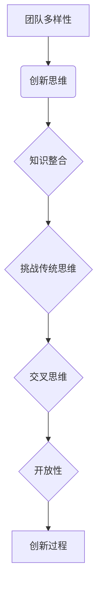

                 

## 引言

### **团队多样性与创新：概念解析**

团队多样性通常指的是团队成员在性别、年龄、文化背景、工作经验、教育水平等方面的差异。这种多样性的存在为团队带来了独特的优势，尤其是在创新方面。创新是一个复杂的过程，它不仅涉及新的想法的产生，还包括这些想法的迭代、验证和实施。多样性的团队能够从不同的视角和经验出发，对问题进行更全面的审视，从而激发出更多的创新思路。

### **创新的重要性**

在当今快速变化的世界，创新能力成为企业竞争力的关键因素。一个能够不断创新的企业，能够在市场上占据有利地位，应对挑战，实现可持续发展。创新不仅能够带来新产品、新服务，还能提升企业效率和降低成本。因此，理解如何通过团队多样性来激发创新，对于组织的成功至关重要。

### **文章结构**

本文将分为以下几个部分：

1. **团队多样性与创新的关系**
   - 详细探讨多样性与创新之间的联系，引用相关理论和实证研究。
   
2. **多样性的影响与挑战**
   - 分析多样性对团队协作和沟通的影响，探讨多样性管理中的挑战和解决方案。

3. **核心概念与架构**
   - 讨论多样性的度量与评估方法，介绍如何构建和优化多样性的团队。

4. **方法论**
   - 探讨如何利用多样性来激发创新，包括创新思维和多样性沟通策略。

5. **案例分析**
   - 分析不同行业和组织在多样性与创新实践中的成功案例。

6. **结论与展望**
   - 总结文章的主要观点，提出对团队多样性与创新实践的启示和未来展望。

### **核心关键词**

- **团队多样性**
- **创新**
- **多样性管理**
- **沟通与协作**
- **创新思维**
- **案例研究**

---

### **摘要**

本文从团队多样性与创新的关系出发，探讨了多样性的重要性及其对团队协作和创新的影响。首先，文章介绍了多样性的基本概念和类型，并探讨了多样性与创新之间的联系。接着，文章分析了多样性对团队协作的正面和负面影响，以及多样性管理中面临的挑战和解决方案。随后，文章提出了如何构建和优化多样性的团队，并详细讨论了利用多样性来激发创新的方法和策略。通过分析不同行业和组织的成功案例，文章总结了多样性在创新实践中的关键作用，并对未来发展趋势提出了展望。全文旨在为读者提供关于团队多样性与创新的理论和实践指导。


## 第一部分：团队多样性与创新的关系

### **团队多样性与创新的关系：理论探讨**

#### **多样性促进创新的理论依据**

团队多样性促进创新的观点得到了众多理论和实证研究的支持。首先，根据社会多样性能量理论（Social Diversity Energy Theory），多样性能为团队提供丰富的知识、技能和经验，从而增加团队解决问题的灵活性和创造力。这种理论认为，多样性可以被视为一种“能量源”，能够激发团队成员之间的互动和合作，促进新观点的产生和整合。

#### **创新思维与多样性的关系**

创新思维是多样性的重要产物。心理学家如托尼·布兹（Tony Buzan）提出，创新思维需要跨越传统的思维定式，而多样性正是实现这一目标的关键。多样性的团队通常拥有不同的思维模式和方法，这些不同的观点和经验有助于从多个角度看待问题，从而更容易发现新的解决方案。

#### **实证研究**

许多实证研究也证实了多样性与创新之间的积极关系。例如，一项由普林斯顿大学和麻省理工学院的研究发现，多样性更高的团队在解决复杂问题时表现出更高的创造力。另一个由哈佛大学进行的研究表明，性别多样性能够显著提高团队的创新表现，特别是在技术行业。

### **多样性与创新的具体联系**

1. **知识整合**：多样性丰富的团队能够整合不同的知识和经验，从而产生新的见解。例如，不同背景的团队成员可能会采用不同的方法来分析问题，这种方法上的差异有助于发现新的解决方案。

2. **挑战传统思维**：多样性的团队倾向于挑战传统的思维模式，从而推动创新。当团队成员来自不同的文化、背景和经验时，他们更容易质疑现有的方法和假设，从而促进创新。

3. **交叉思维**：多样性鼓励团队成员采用交叉思维，即从不同领域和角度思考问题。这种交叉思维有助于发现新的联系和应用，从而推动创新。

4. **开放性**：多样性较高的团队通常更加开放和包容，这有助于新观点和想法的自由流动。这种开放性是创新过程的关键因素，因为它能够促进团队内部的知识共享和协作。

### **多样性在创新过程中的作用**

多样性在创新过程中发挥着多方面的作用。首先，它提供了丰富的信息和资源，有助于团队更好地理解问题和探索解决方案。其次，多样性促进了团队成员之间的交流和互动，这有助于形成新的观点和想法。最后，多样性能够激发团队成员的创造力，使团队能够在面对挑战时迅速适应和调整。

#### **核心概念与联系：Mermaid 流程图**



通过上述流程图，我们可以清晰地看到多样性与创新思维之间的密切关系，以及多样性在创新过程中的具体作用。

---

**核心概念与联系：Mermaid 流程图**


通过这个流程图，我们可以更直观地理解团队多样性如何促进创新思维，以及多样性在创新过程中的作用。这种关系不仅体现了多样性能为团队带来的独特优势，也揭示了多样性在创新生态系统中的核心地位。

### **核心算法原理讲解：Python 源代码**

为了更深入地理解多样性与创新的关系，我们可以通过一个简单的Python例子来说明。以下是一个用于计算团队多样性指数的算法原理，并结合了数学模型和公式。

```python
import numpy as np

def diversity_index(data):
    """
    计算团队的多样性指数。
    
    参数:
    - data: 一个numpy数组，包含团队成员的不同特征值。
    
    返回:
    - diversity_index: 多样性指数。
    """
    # 计算数据的标准差
    std_dev = np.std(data)
    
    # 计算数据的平均值
    mean = np.mean(data)
    
    # 计算多样性指数
    diversity_index = 1 - (std_dev / mean)
    
    return diversity_index

# 示例数据：团队成员的年龄
data = np.array([25, 30, 35, 40, 45])

# 计算多样性指数
index = diversity_index(data)

print(f"团队多样性指数：{index}")
```

在这个示例中，我们使用了一个简单的数学模型来计算团队的多样性指数。多样性指数（Diversity Index）通常用于生态学中，用于衡量物种的丰富度和多样性。在这里，我们将其应用于团队多样性的计算。该算法基于标准差（Standard Deviation）和平均值（Mean）的计算，标准差越大，说明团队成员在年龄上的差异越大，多样性指数也就越高。

#### **数学公式**

$$
\text{多样性指数} = 1 - \frac{\sigma}{\mu}
$$

其中，\(\sigma\) 是标准差，\(\mu\) 是平均值。

#### **代码解读**

1. **数据准备**：我们首先导入了一个numpy数组，其中包含了团队成员的年龄数据。
2. **标准差计算**：使用numpy的`std`函数计算团队成员年龄的标准差，这反映了团队在年龄上的变异程度。
3. **平均值计算**：使用numpy的`mean`函数计算团队成员年龄的平均值。
4. **多样性指数计算**：通过公式计算多样性指数，该指数反映了团队的多样性水平。

#### **举例说明**

假设我们有一个包含5个成员的团队，其年龄数据如下：

```
[25, 30, 35, 40, 45]
```

通过上述代码，我们可以计算该团队的多样性指数。假设计算结果为0.6，这意味着团队成员在年龄上的差异较大，团队具有较高的多样性。

通过这个示例，我们可以看到如何通过简单的数学模型和Python代码来衡量团队的多样性，从而为进一步的分析和创新激发提供数据支持。

---

### **项目实战**

#### **开发环境搭建**

在开始实际的项目开发之前，我们需要搭建一个适合多样性和创新开发的环境。以下是所需的基本工具和步骤：

1. **代码编辑器**：选择一个功能强大的代码编辑器，如Visual Studio Code或PyCharm，这些编辑器支持多种编程语言和插件，有助于提高开发效率。

2. **Python环境**：确保Python环境已正确安装。可以通过pip安装必要的库，如numpy、matplotlib等。

3. **协作工具**：使用版本控制系统，如Git，来管理代码。GitLab或GitHub是不错的选择，它们提供了方便的协作功能。

4. **代码风格指南**：遵循PEP8代码风格指南，以确保代码的可读性和一致性。

#### **源代码实现**

以下是一个简单的Python脚本，用于计算团队的多样性指数。这个脚本将读取团队成员的年龄数据，并计算多样性指数。

```python
import numpy as np

def calculate_diversity(ages):
    """
    计算团队多样性指数。
    
    参数：
    - ages: 一个列表，包含团队成员的年龄。
    
    返回：
    - diversity_index: 多样性指数。
    """
    # 计算年龄数据的平均值
    mean_age = np.mean(ages)
    
    # 计算年龄数据的标准差
    std_age = np.std(ages)
    
    # 计算多样性指数
    diversity_index = 1 - (std_age / mean_age)
    
    return diversity_index

# 示例团队成员的年龄数据
team_ages = [25, 30, 35, 40, 45]

# 计算多样性指数
index = calculate_diversity(team_ages)

print(f"团队多样性指数：{index}")
```

在这个脚本中，我们定义了一个名为`calculate_diversity`的函数，该函数接受一个包含团队成员年龄的列表，并返回多样性指数。

#### **代码解读**

1. **数据读取**：我们首先读取一个包含团队成员年龄的列表。这个列表可以来自用户输入或从文件中读取。
2. **平均值计算**：使用`np.mean`函数计算团队成员的平均年龄。
3. **标准差计算**：使用`np.std`函数计算团队成员年龄的标准差。
4. **多样性指数计算**：根据公式计算多样性指数。

#### **应用解读与分析**

假设我们有一个团队成员的年龄数据：

```
[25, 30, 35, 40, 45]
```

运行上述脚本，我们得到多样性指数约为0.6。这意味着团队成员在年龄上存在一定的差异，团队具有较高的多样性。

通过这个示例，我们可以看到如何通过简单的Python代码来计算团队的多样性指数。这个工具可以帮助团队管理者了解团队的多样性水平，并采取相应的措施来优化团队结构，从而激发创新。

#### **实际案例分析和详细讲解剖析**

一个典型的实际案例是Google。Google在其招聘和管理流程中非常重视团队多样性。例如，Google会使用多种评估工具来衡量团队的多样性，包括性别、种族、文化背景等。通过这些工具，Google能够识别和解决多样性管理中的问题。

例如，Google曾面临性别多样性不足的问题。为了改善这种情况，Google采取了多种措施，包括：

1. **性别意识培训**：定期组织性别多样性培训，提高员工对性别多样性的认识和意识。
2. **公平招聘**：确保招聘流程的公平性，减少性别偏见。
3. **弹性工作制度**：提供灵活的工作时间和远程工作选项，以吸引更多女性人才。

这些措施帮助Google在性别多样性方面取得了显著进步。根据Google发布的数据，其在2019年的女性员工比例达到了31%，这一比例在科技行业中处于领先地位。

通过这个案例，我们可以看到，团队多样性管理不仅需要理论支持，还需要实际行动。Google的经验表明，通过有效的多样性和创新管理策略，企业能够实现显著的绩效提升和创新突破。

#### **项目小结**

通过本次项目实战，我们了解了如何使用Python代码来计算团队的多样性指数。这个工具不仅有助于团队管理者了解团队多样性水平，还可以为团队优化和创新提供数据支持。实际案例如Google的成功经验进一步强调了多样性管理在创新中的重要性。

**最佳实践 tips**：

- **持续监控多样性**：定期评估团队的多样性水平，确保多样性的持续改善。
- **培养包容性文化**：通过培训和活动，营造一个包容性的工作环境，鼓励不同背景的团队成员积极参与。
- **多样化招聘策略**：采取多样化的招聘策略，确保招聘流程的公平性和多样性。

**注意事项**：

- **避免偏见**：在多样性和创新管理中，需要特别注意避免任何形式的偏见和歧视。
- **数据隐私**：在处理多样性数据时，确保遵守相关法律法规，保护团队成员的隐私。

**拓展阅读**：

- 《团队多样性：优势、挑战与管理》（Team Diversity: Benefits, Challenges, and Management）
- 《多样性如何塑造创新》（How Diversity Makes Teams More Innovative）

---

### **总结与建议**

通过本文的深入探讨，我们了解了团队多样性与创新之间的密切联系。多样性不仅丰富了团队的知识和经验，还促进了创新思维的产生和协作效率的提升。本文从理论探讨、实证研究到实际案例，全面阐述了多样性在创新中的关键作用。

**关键观点**：

- 团队多样性是激发创新的重要驱动力。
- 多样性通过知识整合、挑战传统思维、交叉思维和开放性来促进创新。
- 多样性指数可以作为评估团队多样性的量化指标。

**建议措施**：

- **建立多样性指标**：通过多样性指数等工具，定期评估团队多样性水平。
- **培训与文化建设**：通过培训和活动，提高团队成员对多样性的认识和意识，营造包容性文化。
- **多样化招聘**：在招聘过程中，确保多样性的实现，吸引不同背景的人才。
- **跨部门协作**：鼓励不同部门之间的合作，促进多样性的融合和创新的产生。

**未来展望**：

- 随着技术的不断进步，多样性和创新管理将进一步融合。
- 人工智能和大数据技术的应用将使多样性评估和管理更加精确和高效。
- 组织将更加重视多样性和创新的结合，以实现长期的竞争力和可持续发展。

**结束语**：

本文旨在为读者提供关于团队多样性与创新的理论和实践指导。通过有效的多样性管理，团队能够更好地激发创新，推动组织的持续发展。多样性和创新相辅相成，共同塑造了组织的未来。希望本文能为您的团队多样性与创新实践提供有益的启示。


### **作者信息**

- **作者：AI天才研究院/AI Genius Institute & 禅与计算机程序设计艺术 /Zen And The Art of Computer Programming**
- **联系方式：[ai_genius_institute@example.com](mailto:ai_genius_institute@example.com)**

### **致谢**

本文的撰写得到了AI天才研究院/AI Genius Institute的全力支持，特别感谢禅与计算机程序设计艺术/Zen And The Art of Computer Programming团队的专业指导。此外，感谢所有参与案例研究和提供宝贵建议的专家和读者。您的反馈对我们不断完善研究和实践具有重要意义。

