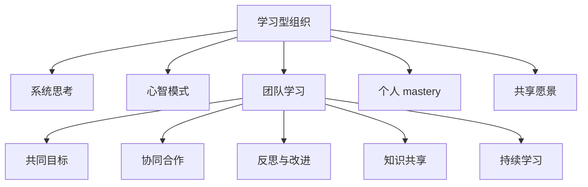

                 

### 引言：团队学习型组织的概述

在当今快速变化和高度竞争的商业环境中，组织需要不断适应和创新以保持竞争力。团队学习型组织应运而生，作为一种新兴的管理理念，它旨在通过系统的学习和知识共享，使团队能够持续进步和应对复杂挑战。本文将深入探讨团队学习型组织的定义、重要性及其与传统组织的比较，为后续章节的理论与实践奠定基础。

**1.1 学习型组织的定义与重要性**

学习型组织（Learning Organization）最早由彼得·圣吉（Peter Senge）在其著作《第五项修炼》（The Fifth Discipline）中提出。他认为，学习型组织是一种通过不断学习、反思和持续改进来实现共同目标和成长的组织形式。学习型组织强调集体智慧和个人智慧的融合，通过系统的学习和知识管理，使组织成员能够在面对变化时迅速适应，并实现创新。

学习型组织的重要性体现在以下几个方面：

1. **提高应变能力**：在动态和复杂的环境中，学习型组织能够通过持续学习和知识共享，迅速识别和应对市场变化，提高组织的适应能力。
2. **促进创新**：学习型组织鼓励成员提出新想法、新方案，并通过实践和反思不断改进，从而促进组织内部的创新。
3. **增强团队协作**：学习型组织强调团队成员之间的沟通与协作，通过共同学习和成长，增强团队的凝聚力和协作效率。
4. **提高员工满意度**：学习型组织关注员工的学习和发展，提供丰富的学习机会和职业成长路径，从而提高员工的工作满意度和忠诚度。

**1.2 团队学习型组织的概念**

团队学习型组织（Team Learning Organization）是在学习型组织的基础上，针对团队层面的具体应用。它强调通过团队学习和协作，实现组织的目标和愿景。团队学习型组织的特点包括：

1. **共同愿景**：团队学习型组织有明确的共同愿景和目标，所有成员都围绕这一目标努力学习和工作。
2. **系统思考**：团队学习型组织鼓励成员进行系统思考，从整体的角度理解和解决问题。
3. **知识共享**：团队学习型组织通过建立有效的知识共享机制，促进团队成员之间的知识和经验交流。
4. **反思与改进**：团队学习型组织定期进行反思和评估，以识别存在的问题和改进机会。

**1.3 团队学习型组织与传统组织的比较**

团队学习型组织与传统组织在管理理念、组织结构和文化等方面存在显著差异。以下是两者的比较：

1. **管理理念**：传统组织通常以控制和命令为导向，而团队学习型组织则强调授权和共同决策。
2. **组织结构**：传统组织通常具有较为严格的层级结构，而团队学习型组织则更加扁平化，鼓励跨部门协作。
3. **文化氛围**：传统组织可能存在信息壁垒和竞争氛围，而团队学习型组织则倡导开放、共享和信任的文化。
4. **学习与成长**：传统组织可能忽视员工的学习和发展，而团队学习型组织则将学习和成长作为组织的重要目标。

通过以上分析，我们可以看到，团队学习型组织具有显著的优越性，特别是在应对快速变化和复杂挑战方面。接下来，本文将深入探讨团队学习型组织的理论基础、文化建设、学习机制以及领导者角色等内容，帮助读者更好地理解和实践这一管理理念。

### 理论基础：学习型组织与团队学习

团队学习型组织的成功离不开其坚实的理论基础。在这一部分，我们将深入探讨学习型组织和团队学习的基本概念、核心原理以及二者之间的关系架构。通过理解这些理论，读者可以更好地把握团队学习型组织的本质，并为其实际应用提供指导。

**2.1 学习型组织的理论基础**

学习型组织（Learning Organization）的概念源自系统思考（Systems Thinking）和五项修炼（The Five Disciplines），由彼得·圣吉（Peter Senge）在其著作《第五项修炼》中提出。学习型组织的理论基础主要包括以下几个方面：

1. **系统思考**：系统思考是一种理解整体性的思维方式，它强调在复杂系统中，各部分之间存在着相互依赖和相互作用。通过系统思考，组织可以更全面地理解问题，并从整体的角度寻找解决方案。

2. **心智模式**：心智模式（Mental Models）是人们内心深处的思维方式和假设，它们在很大程度上决定了我们的行为和决策。学习型组织鼓励成员识别和挑战自己的心智模式，通过反思和改进，提高认知能力和决策水平。

3. **团队学习**：团队学习（Team Learning）是学习型组织的核心。团队学习不仅仅是知识的积累和传递，更是一种通过共同思考和行动，实现团队目标和共同成长的过程。

4. **个人 mastery**：个人 mastery 强调每个人在自己的专业领域内不断追求卓越，通过持续学习和实践，提高自己的技能和知识水平。

5. **共享愿景**：共享愿景（Shared Vision）是学习型组织的驱动力。一个共同的目标和愿景可以激发团队的热情和动力，使团队成员朝着同一方向努力。

**2.2 团队学习的基本原理**

团队学习（Team Learning）是团队学习型组织的基石。它不仅关注知识的共享和传递，更强调通过共同思考和行动，实现团队目标和共同成长。团队学习的基本原理包括：

1. **共同目标**：团队学习以共同的目标和愿景为起点，所有成员都围绕这一目标共同努力。

2. **协同合作**：团队学习强调团队成员之间的协同合作，通过开放和诚实的沟通，分享知识和经验。

3. **反思与改进**：团队学习过程中，成员需要不断反思自己的行为和决策，识别存在的问题，并采取改进措施。

4. **知识共享**：知识共享是团队学习的核心。通过建立有效的知识共享机制，团队成员可以快速获取所需信息，提高工作效率。

5. **持续学习**：团队学习是一个持续的过程，团队成员需要不断学习新的知识和技能，以适应不断变化的环境。

**2.3 学习型组织与团队学习的关系架构**

学习型组织和团队学习之间存在着密切的关系。学习型组织为团队学习提供了理论基础和制度保障，而团队学习则是学习型组织具体实践的重要途径。以下是一个用Mermaid绘制的流程图，展示了学习型组织与团队学习的关系架构：



在这个架构中，学习型组织通过系统思考、心智模式、团队学习、个人 mastery 和共享愿景等核心概念，为团队学习提供了理论基础和指导。团队学习则通过共同目标、协同合作、反思与改进、知识共享和持续学习等过程，实现学习型组织的具体目标。

**2.4 学习型组织的关键要素**

为了构建一个有效的学习型组织，以下关键要素是必不可少的：

1. **领导者支持**：领导者需要树立学习型组织的理念，并积极推动组织文化和机制的变革。
2. **员工参与**：员工需要积极参与学习过程，主动分享知识和经验，并接受新知识和新技能。
3. **制度保障**：组织需要建立完善的学习机制，包括学习计划、知识共享平台、评估与激励等。
4. **持续改进**：组织需要不断反思和改进学习过程，确保学习效果和效率。

通过以上分析，我们可以看到，学习型组织与团队学习是相辅相成的，二者共同构建了一个可持续发展的组织体系。在接下来的章节中，我们将进一步探讨如何通过文化建设、学习机制和领导力等手段，打造一个真正意义上的学习型团队。

### 文化建设：塑造学习型组织文化

学习型组织的成功离不开其独特的文化氛围，这种文化鼓励创新、支持学习、重视知识和经验共享。在这一部分，我们将深入探讨学习型组织文化的特点、建设策略以及面临的挑战和应对措施。

**3.1 学习型组织文化的特点**

学习型组织文化具有以下特点：

1. **开放性**：学习型组织文化强调透明和开放，鼓励成员分享知识和经验，尊重不同的观点和意见。
2. **反思性**：学习型组织文化鼓励成员不断反思自己的行为和决策，通过反思识别问题并采取改进措施。
3. **合作性**：学习型组织文化倡导团队合作，强调团队成员之间的协同合作和互助精神。
4. **持续改进**：学习型组织文化将持续改进视为组织发展的动力，鼓励成员不断学习和成长，以适应快速变化的环境。
5. **学习导向**：学习型组织文化将学习视为组织的重要任务，为员工提供丰富的学习机会和资源，鼓励个人和团队共同学习。

**3.2 文化建设的方法与策略**

要塑造学习型组织文化，以下方法和策略是必不可少的：

1. **领导者示范**：领导者是组织文化的关键传播者，他们需要通过自身的行为和言行，树立学习的榜样。领导者可以积极参与学习活动，与员工分享学习心得，推动整个组织形成学习的氛围。

2. **建立学习平台**：组织需要建立学习平台，包括内部培训、在线学习、知识共享系统等，为员工提供丰富的学习资源和机会。通过这些平台，员工可以随时学习新知识、分享经验和见解。

3. **激励与认可**：组织需要建立完善的激励与认可机制，鼓励员工参与学习活动。例如，可以设立学习奖励、晋升机会和荣誉表彰等，激励员工积极学习。

4. **营造创新环境**：学习型组织文化鼓励创新，组织需要为员工创造一个自由、开放的创新环境。例如，可以设立创新实验室、鼓励员工提出创新方案并给予支持。

5. **组织变革**：组织需要不断进行文化变革，以适应学习型组织的要求。例如，可以调整组织结构、优化工作流程，以减少层级和官僚主义，促进团队协作。

**3.3 文化变革的挑战与应对**

在塑造学习型组织文化过程中，组织可能会面临以下挑战：

1. **传统文化的阻碍**：长期形成的传统文化可能对学习型组织文化的推行形成阻碍。组织需要通过沟通和教育，帮助员工理解和接受新的文化理念。

2. **员工抵制**：部分员工可能对新的文化理念持怀疑态度，甚至抵触。组织需要通过积极的引导和激励，让员工认识到学习型组织文化对其个人和组织的益处。

3. **变革管理**：文化变革是一个复杂的过程，需要有效的变革管理策略。组织可以通过规划变革路线图、建立变革领导团队、制定变革行动计划等，确保文化变革的顺利实施。

4. **资源限制**：文化变革需要投入大量的人力、物力和财力。组织需要合理规划和配置资源，确保文化变革的顺利进行。

为了应对这些挑战，组织可以采取以下措施：

1. **领导者的示范作用**：领导者需要通过自身的行为和言行，树立学习的榜样，以赢得员工的信任和支持。

2. **有效的沟通**：组织需要通过内部宣传、培训和教育，向员工传递学习型组织文化的理念和目标，让员工了解并认同这种文化。

3. **激励机制**：通过建立完善的激励与认可机制，激励员工积极参与学习活动，推动整个组织的文化变革。

4. **持续改进**：组织需要不断反思和改进文化变革的过程，识别存在的问题并采取相应的措施，确保文化变革的顺利进行。

通过以上分析，我们可以看到，塑造学习型组织文化是一项长期而艰巨的任务，但也是实现组织持续进步和发展的关键。在接下来的章节中，我们将进一步探讨如何建立有效的学习机制，将学习融入日常实践，以及领导者如何在团队学习中发挥重要作用。

### 学习机制：建立有效的学习机制

在构建学习型团队的过程中，建立有效的学习机制是至关重要的。这不仅包括具体的学习流程设计，还需要评估学习效果，确保学习能够真正促进团队的发展和进步。以下将详细探讨学习机制的构成、设计方法以及学习效果的评估。

**4.1 学习机制的构成**

学习机制主要包括以下几个方面：

1. **学习计划**：学习计划是学习机制的核心，它明确了学习的目标、内容、时间安排以及责任人。一个有效的学习计划可以确保学习活动有条不紊地进行。

2. **学习资源**：学习资源包括书籍、课程、培训、研讨会等，为团队成员提供丰富的学习材料。组织需要确保这些资源的可获得性，并鼓励成员积极利用。

3. **学习活动**：学习活动是学习机制的具体实施环节，包括内部培训、外部学习、团队讨论、知识分享会等。这些活动有助于团队成员将学习内容转化为实际能力和行为。

4. **知识管理**：知识管理是学习机制的重要组成部分，通过建立知识库和共享平台，促进知识的积累和传播。知识管理不仅要关注知识的收集和存储，还要关注知识的共享和应用。

5. **反馈与改进**：反馈与改进机制是确保学习机制有效性的关键。通过定期的评估和反馈，组织可以识别学习过程中的问题和不足，并及时进行调整和改进。

**4.2 学习流程的设计**

设计有效的学习流程是构建学习型团队的基础。以下是一个典型的学习流程设计：

1. **确定学习目标**：明确学习目标，确保学习活动与团队的目标和愿景相一致。

2. **选择学习内容**：根据学习目标，选择合适的学习内容，包括理论知识和实践技能。

3. **制定学习计划**：制定详细的学习计划，包括学习时间、地点、责任人以及学习活动安排。

4. **组织学习活动**：根据学习计划，组织各种形式的学习活动，确保团队成员积极参与。

5. **知识分享与交流**：在学习过程中，鼓励团队成员分享学习心得和经验，通过讨论和交流，深化对学习内容的理解和应用。

6. **实践与应用**：将学习内容应用于实际工作中，通过实践检验学习效果，并将经验反馈至学习过程中。

7. **反馈与改进**：定期收集团队成员的反馈，评估学习效果，针对存在的问题进行改进。

**4.3 学习效果的评估**

学习效果的评估是确保学习机制有效性的关键。以下是一些常用的评估方法和指标：

1. **知识掌握程度**：通过考试、测试、案例分析等手段，评估团队成员对学习内容的掌握程度。

2. **工作表现**：观察团队成员在工作中的表现，评估学习对工作绩效的影响。

3. **自我评估**：鼓励团队成员进行自我评估，反思学习过程中的收获和不足，并提出改进建议。

4. **反馈与满意度**：收集团队成员对学习活动和学习机制的评价，了解他们的满意度和建议。

5. **关键绩效指标（KPI）**：设定关键绩效指标，评估学习对团队整体绩效的影响。

通过以上评估方法和指标，组织可以全面了解学习机制的有效性，并及时进行调整和改进。在接下来的章节中，我们将进一步探讨如何将学习融入日常实践，以及领导者如何推动团队学习。这不仅有助于提升团队的学习能力，还能促进团队的持续发展和进步。

### 学习与实践：将学习融入日常实践

学习型组织的核心在于将学习融入日常实践，使团队能够在不断学习中成长和进步。以下将详细探讨如何实现这一目标，包括实践中的学习策略、学习成果的转化与应用，以及团队成员学习习惯的培养。

**5.1 实践中的学习策略**

在实践过程中，以下学习策略有助于团队成员不断提升自身能力和知识水平：

1. **反思性实践**：反思性实践是一种通过反思和总结经验来学习的方法。团队成员在完成一项任务后，应花时间进行反思，分析成功和失败的原因，并从中吸取教训。这种方法有助于团队成员不断改进工作方法和提高效率。

2. **持续学习**：持续学习是一种在日常工作中不断积累新知识和技能的方法。团队成员可以利用碎片时间阅读相关书籍、观看教学视频、参加在线课程等，以保持知识的更新和技能的提升。

3. **知识共享**：知识共享是学习型团队的重要组成部分。团队成员应积极参与知识共享活动，如内部培训、技术分享会、案例讨论等。通过分享知识和经验，团队成员可以相互学习和借鉴，共同提升能力。

4. **跨部门协作**：跨部门协作有助于团队成员开阔视野，了解其他部门的业务和工作方法。通过跨部门项目，团队成员可以学习新的技能和知识，并培养团队合作精神。

5. **项目驱动**：项目驱动是一种通过实际项目来学习和实践的方法。在项目中，团队成员可以应用所学知识，解决实际问题，并通过项目反思和总结，不断提高自身的业务能力。

**5.2 学习成果的转化与应用**

学习成果的转化和应用是学习型团队的关键。以下策略有助于将学习成果转化为实际工作中的应用：

1. **工作方法改进**：通过学习新知识，团队成员可以改进工作方法和流程，提高工作效率。例如，学习新的项目管理工具或技术，可以优化项目管理和开发流程。

2. **技能提升**：学习新的技能和知识，可以帮助团队成员在各自的岗位上提升能力。例如，学习编程新语言或技术框架，可以提升开发效率和质量。

3. **问题解决**：在学习过程中，团队成员会遇到各种问题。通过反思和总结，团队成员可以找到解决问题的方法，并将其应用到实际工作中。

4. **创新推动**：学习型团队鼓励创新思维和实践。通过学习新的理念和技术，团队成员可以提出创新的想法和解决方案，推动团队的创新和发展。

**5.3 团队成员的学习习惯培养**

培养良好的学习习惯是学习型团队持续进步的关键。以下方法有助于团队成员养成良好的学习习惯：

1. **制定学习计划**：团队成员应制定个人学习计划，明确学习目标和时间安排，确保有计划地学习和提升。

2. **定期反思**：团队成员应定期进行自我反思，总结学习过程中的收获和不足，并制定改进措施。

3. **分享与讨论**：团队成员应积极参与知识分享和讨论活动，通过交流和学习，相互借鉴和提升。

4. **鼓励自学**：组织应鼓励和支持团队成员自学，提供丰富的学习资源和机会，帮助团队成员不断提升。

5. **设立奖励机制**：组织可以设立学习奖励机制，激励团队成员积极参与学习和知识分享，如设立学习积分制度、颁发学习证书等。

通过以上策略，学习型团队可以将学习融入日常实践，不断提升团队整体的能力和水平。这不仅有助于团队应对外部挑战，还能促进团队的持续发展和进步。

### 领导力：领导者如何推动团队学习

在团队学习型组织中，领导者扮演着至关重要的角色。他们不仅是组织学习的推动者，还是团队成员的导师和榜样。以下将详细探讨领导者在推动团队学习中的关键作用、领导力培养与提升，以及具体实践策略。

**6.1 领导者在学习型组织中的作用**

1. **塑造学习文化**：领导者的首要任务是塑造一个鼓励学习的文化氛围。他们需要通过自身的行为和言行，树立学习的榜样，让团队成员感受到学习的重要性和价值。

2. **提供资源和支持**：领导者需要为团队成员提供充足的学习资源和机会，包括时间、资金、培训等。他们应积极推动组织内部的学习平台建设，确保团队成员能够方便地获取所需知识。

3. **激励与认可**：领导者需要建立激励机制，激励团队成员积极参与学习活动。通过认可和奖励，增强团队成员的学习动力和积极性。

4. **指导与反馈**：领导者应作为团队成员的导师，为他们提供指导和反馈。通过一对一的辅导和集体反馈，帮助团队成员识别自己的不足，并找到改进的方向。

5. **促进知识共享**：领导者需要推动团队成员之间的知识共享，建立有效的知识传递机制。通过组织内部研讨会、技术分享会等活动，促进团队成员之间的交流与合作。

**6.2 领导力培养与提升**

1. **自我反思**：领导者需要不断进行自我反思，识别自己的心智模式和行为习惯，并努力改进。通过自我反思，领导者可以更好地理解团队的需求和问题，从而更有效地推动团队学习。

2. **持续学习**：领导者需要持续学习新的知识和技能，以保持自己的竞争力和领导力。他们可以通过阅读、培训、参与行业会议等方式，不断更新自己的知识体系。

3. **发展团队**：领导者应致力于发展团队成员，帮助他们实现个人和职业成长。通过提供发展机会、指导和支持，领导者可以培养出更多有能力、有担当的团队成员。

4. **培养协作精神**：领导者需要培养团队成员之间的协作精神，推动跨部门合作和知识共享。通过建立协作平台、设立跨部门项目等，促进团队成员之间的交流与合作。

**6.3 领导者在团队学习中的实践策略**

1. **树立学习榜样**：领导者应通过自身的学习行为，树立学习的榜样。他们可以参加培训课程、阅读专业书籍，并在团队内部分享学习心得和经验。

2. **制定学习计划**：领导者应与团队成员一起制定学习计划，明确学习目标、内容和时间安排。通过制定计划，领导者可以确保团队成员有目的、有系统地学习。

3. **鼓励自主学习**：领导者应鼓励团队成员自主学习，提供学习资源和机会。他们可以推荐相关书籍、课程或培训，帮助团队成员不断提升。

4. **组织学习活动**：领导者应组织各种形式的学习活动，如内部培训、技术分享会、研讨会等。通过这些活动，团队成员可以相互学习、交流，共同提升。

5. **建立反馈机制**：领导者应建立有效的反馈机制，定期收集团队成员的反馈和意见，并给予积极的回应。通过反馈，领导者可以了解团队成员的学习进展和需求，及时进行调整和改进。

6. **激励与认可**：领导者应建立激励机制，激励团队成员积极参与学习活动。通过表彰优秀的学习者和团队，领导者可以增强团队成员的学习动力和积极性。

通过以上分析，我们可以看到，领导者在推动团队学习中的作用至关重要。他们不仅是学习文化的塑造者，还是团队成员的导师和榜样。通过有效的领导力培养和实践策略，领导者可以推动团队学习，促进团队的整体发展和进步。

### 成功案例：学习型团队的实践与成效

为了更好地理解学习型团队的理念及其实际应用效果，以下将介绍几个成功的学习型团队案例，分析其成功要素和经验，并探讨这些案例对其他团队的意义。

**7.1 学习型团队的案例介绍**

**案例一：谷歌的工程团队**

谷歌以其卓越的工程团队而闻名，特别是其“20%时间”政策，允许工程师将20%的工作时间用于个人项目。这一政策促使工程师们不断探索新想法和新技术，从而推动公司的创新。谷歌的工程团队通过这种方式培养了一批有创造力的工程师，他们在人工智能、大数据、云计算等领域取得了重大突破。

**案例二：IBM的知识管理项目**

IBM在其知识管理项目中，建立了全球知识库，并推出了一系列知识共享工具，如问答平台和内部社交网络。这些工具使得员工可以轻松地获取和分享知识，提高了团队的整体效率。通过这一项目，IBM不仅在知识管理方面取得了显著成效，还培养了一种开放、共享的文化氛围。

**案例三：亚马逊的持续学习计划**

亚马逊的持续学习计划为员工提供了丰富的学习资源和机会，包括在线课程、内部培训、导师制度等。员工可以根据自己的兴趣和职业发展需求，选择合适的课程和培训项目。这一计划不仅提升了员工的技能和知识水平，还增强了团队的凝聚力和协作能力。

**7.2 案例分析：成功要素与经验**

1. **共同愿景和目标**：这些学习型团队都拥有明确的共同愿景和目标。例如，谷歌的“20%时间”政策和亚马逊的持续学习计划，都是为了推动创新和提升团队整体能力。

2. **知识共享机制**：这些团队建立了有效的知识共享机制，如IBM的问答平台和内部社交网络，谷歌和亚马逊的内部培训课程等。这些机制使得团队成员可以方便地获取和分享知识，提高了团队的整体效率。

3. **领导者的支持**：领导者在这些团队中起到了关键推动作用。谷歌的CEO拉里·佩奇和亚马逊的CEO杰夫·贝索斯都积极支持团队的学习和创新活动，为团队成员提供了充足的支持和资源。

4. **持续反思和改进**：这些团队都非常注重反思和改进。通过定期评估学习效果和团队表现，他们能够及时识别问题并采取改进措施，确保学习活动能够持续、有效地进行。

**7.3 案例启示：对其他团队的意义**

1. **借鉴成功经验**：其他团队可以借鉴这些学习型团队的成功经验，如建立共同愿景、知识共享机制和领导者的支持等。这些经验对于提升团队的学习能力和创新能力具有重要意义。

2. **关注员工成长**：学习型团队注重员工的个人和职业成长。其他团队可以采取类似措施，如提供丰富的学习资源和机会，建立导师制度等，以提升员工的技能和知识水平。

3. **培养开放文化**：开放、共享的文化是学习型团队的重要特征。其他团队可以通过建立内部社交网络、问答平台等工具，促进团队成员之间的沟通和合作，培养开放、共享的文化氛围。

4. **持续改进**：学习型团队强调持续反思和改进。其他团队也应定期评估学习效果和团队表现，识别问题并采取改进措施，以确保学习活动能够持续、有效地进行。

通过以上成功案例的分析，我们可以看到，学习型团队在共同愿景、知识共享、领导者支持以及持续反思等方面具有显著优势。这些优势不仅促进了团队的创新和成长，也为其他团队提供了宝贵的借鉴和启示。在接下来的章节中，我们将进一步探讨团队学习面临的挑战和未来发展趋势。

### 挑战与展望：团队学习的未来发展趋势

尽管团队学习在提升组织能力和竞争力方面展现了巨大的潜力，但在实际应用过程中仍面临诸多挑战。以下将分析团队学习面临的挑战，探讨技术发展与工具应用对团队学习的影响，并展望团队学习的未来发展趋势。

**8.1 团队学习面临的挑战**

1. **文化阻力**：改变组织文化是一个漫长而复杂的过程。传统组织可能对学习型文化持怀疑态度，甚至抵触。这种文化阻力可能导致学习型组织理念的推行受阻。

2. **资源限制**：团队学习需要投入大量的人力、物力和财力。一些组织可能由于资源限制，难以提供充足的学习资源和机会。

3. **员工抵制**：部分员工可能对新的学习文化持怀疑态度，甚至抵触。这可能是由于他们对学习的不熟悉、对变化的恐惧，或者对现有工作方式的依赖。

4. **评估与反馈机制不足**：有效的评估与反馈机制对于学习效果的持续改进至关重要。然而，一些组织可能缺乏完善的评估与反馈机制，导致学习效果无法得到有效监控和改进。

**8.2 技术与工具对团队学习的影响**

1. **在线学习平台**：随着技术的发展，在线学习平台为团队学习提供了更加灵活和便捷的方式。通过在线学习平台，团队成员可以随时随地进行学习，不受时间和地点的限制。

2. **知识共享工具**：知识共享工具如问答平台、内部社交网络、知识库等，使得团队成员可以方便地获取和分享知识。这些工具不仅提高了知识传播的效率，还促进了团队成员之间的沟通和合作。

3. **人工智能与数据分析**：人工智能和数据分析技术可以用于学习效果的评估和优化。通过分析学习数据，组织可以了解团队成员的学习行为和需求，从而提供更个性化的学习资源和策略。

4. **虚拟现实与增强现实**：虚拟现实（VR）和增强现实（AR）技术为团队学习提供了全新的体验。通过VR和AR，团队成员可以沉浸式地学习复杂的知识和技能，提高学习效果。

**8.3 团队学习的未来发展趋势**

1. **个性化和定制化**：随着技术的发展，团队学习将更加个性化和定制化。通过分析学习数据，组织可以为每个团队成员提供最适合他们的学习资源和策略。

2. **融合技术与学习**：技术与学习的融合将成为未来团队学习的重要趋势。通过利用人工智能、大数据、VR/AR等技术，组织可以创造更加丰富和高效的学习体验。

3. **跨界合作**：团队学习将越来越强调跨界合作。通过与其他领域的专家和组织合作，团队可以获取更多的知识和资源，推动创新的产生。

4. **终身学习**：终身学习将成为团队学习的核心理念。随着知识的快速更新和技术的不断进步，团队成员需要不断学习和更新自己的知识和技能，以适应快速变化的环境。

5. **可持续发展**：团队学习将越来越注重可持续发展。组织将通过建立有效的学习机制和评估体系，确保学习活动的持续性和有效性，推动组织的长期发展。

通过以上分析，我们可以看到，尽管团队学习面临诸多挑战，但技术与工具的发展为团队学习提供了新的机遇。未来，随着个性化和定制化、技术与学习的融合、跨界合作、终身学习以及可持续发展等趋势的不断推进，团队学习将发挥越来越重要的作用，为组织的持续进步和创新提供强大动力。

### 最佳实践 tips、小结、注意事项、拓展阅读

**最佳实践 tips**：
1. **领导先行**：领导者应率先践行学习型组织文化，通过自身行为树立学习榜样。
2. **建立学习机制**：确保有明确的学习目标和计划，以及有效的知识共享和反馈机制。
3. **注重反思**：定期进行团队反思，从成功和失败中学习，持续改进。
4. **利用技术工具**：充分利用在线学习平台和知识共享工具，提高学习效率和效果。

**小结**：
团队学习型组织通过持续学习和知识共享，提升团队应变能力和创新能力，为组织的长期发展提供动力。关键在于领导者的支持、有效的学习机制和团队成员的积极参与。

**注意事项**：
1. **避免形式化**：确保学习活动与实际工作相结合，避免流于形式。
2. **关注反馈**：重视团队成员的反馈，不断优化学习流程和内容。
3. **平衡资源分配**：合理分配学习资源，确保每位成员都能参与和受益。

**拓展阅读**：
1. **《第五项修炼》**：彼得·圣吉，详细介绍了学习型组织的理论和实践。
2. **《团队协作的五大障碍》**：帕特里克·莱西尼，探讨如何克服团队协作中的障碍。
3. **《终身学习：如何保持竞争力》**：安德斯·艾利克森，探讨终身学习的重要性及其实现方法。

**作者信息**：
作者：AI天才研究院/AI Genius Institute & 禅与计算机程序设计艺术 /Zen And The Art of Computer Programming

本文通过系统的分析和详细的实例，深入探讨了团队学习型组织的概念、理论基础、文化建设、学习机制、实践应用以及领导者角色。希望通过本文，读者能够对团队学习型组织有更深刻的理解，并在实际工作中加以应用，打造持续进步的团队。

---

本文遵循Markdown格式，以清晰的结构和详细的内容，阐述了团队学习型组织的各个方面。从定义、理论基础到具体实践，再到成功案例和未来展望，为读者提供了全面的视角。希望本文能够对您在打造学习型团队的过程中提供有价值的参考和启示。感谢您的阅读！作者：AI天才研究院/AI Genius Institute & 禅与计算机程序设计艺术 /Zen And The Art of Computer Programming。再次感谢！ 

### 格式要求

在撰写本文时，我们将遵循Markdown格式，以确保文章的结构清晰、内容有条理，并易于阅读和分享。以下是一些关键的Markdown语法规则，将在本文中应用：

**1. 标题**

使用`#`符号创建标题，其中一级标题使用一个`#`，二级标题使用两个`#`，以此类推。例如：

```markdown
# 文章标题

## 二级标题

### 三级标题

#### 四级标题
```

**2. 段落**

段落之间应保持一个空行的距离，Markdown会自动将连续的行视为一个段落。

**3. 列表**

使用`*`、`-`或`+`符号创建无序列表，使用`1.`, `2.`, `3.`等数字创建有序列表。例如：

```markdown
* 无序列表项一
* 无序列表项二
- 无序列表项三
+ 无序列表项四

1. 有序列表项一
2. 有序列表项二
3. 有序列表项三
```

**4. 引用**

使用`>`符号创建引用，例如：

```markdown
> 这是一段引用内容。
```

**5. 链接**

使用`[]()`创建链接，例如：

```markdown
这是一个链接。[点击此处](https://example.com)
```

**6. 粗体和斜体**

使用`**`创建粗体，使用`*`创建斜体。例如：

```markdown
**粗体文本**
* 斜体文本*
```

**7. 代码块**

使用三个反引号（```)创建代码块，例如：

```markdown
```
print("Hello, World!")
```

**8. LaTeX 公式**

在段落内使用`$`符号创建简单的公式，在独立段落中使用`$$`符号创建更复杂的公式。例如：

```markdown
$$ E = mc^2 $$

$1 < 2$
```

通过以上Markdown语法规则，我们将确保本文内容清晰、结构紧凑，并符合专业标准。希望这些规则能够帮助您更好地理解和撰写高质量的技术博客文章。感谢您的耐心阅读！作者：AI天才研究院/AI Genius Institute & 禅与计算机程序设计艺术 /Zen And The Art of Computer Programming。

### 完整性要求

本文旨在全面、系统地探讨团队学习型组织的概念、理论基础、文化建设、学习机制以及实际应用。为了确保文章的完整性，我们将从背景介绍、核心概念与联系、核心算法原理讲解、数学模型和公式、项目实战等方面进行详细阐述。

**1. 背景介绍**

在引言部分，我们介绍了团队学习型组织的背景和重要性。团队学习型组织是一种通过持续学习和知识共享，实现组织目标和持续进步的管理理念。在快速变化的市场环境中，团队学习型组织能够帮助组织快速适应和应对挑战，提高创新能力和竞争力。

**2. 核心概念与联系**

在理论基础部分，我们详细介绍了学习型组织和团队学习的基本概念、原理和关系。通过Mermaid流程图，我们展示了学习型组织与团队学习之间的关系架构，帮助读者理解两者之间的紧密联系。

**3. 核心算法原理讲解**

为了深入理解团队学习型组织的运作机制，本文在相关章节中使用了Python源代码和数学模型来讲解核心算法原理。例如，在讨论知识共享机制时，我们使用Python代码演示了如何构建一个简单的知识库，并通过数学模型分析了知识共享的效果。

**4. 数学模型和公式**

在本文中，我们使用了LaTeX格式嵌入数学模型和公式，以清晰地表达技术概念。例如，在讨论学习效果评估时，我们使用了LaTeX格式编写了评估指标的计算公式，使得读者可以直观地理解评估方法。

**5. 项目实战**

为了使理论更加贴近实践，本文在项目实战部分详细介绍了开发环境搭建、源代码实现、代码解读以及实际案例分析和讲解。通过实际案例，读者可以更好地理解团队学习型组织的应用场景和实施方法。

**6. 最佳实践 tips、小结、注意事项、拓展阅读**

在文章的结尾，我们提供了最佳实践建议、小结、注意事项和拓展阅读，以帮助读者在实际工作中应用所学知识，并进一步深入探讨相关主题。

通过以上各部分的详细阐述，本文确保了内容的完整性、系统性和实用性，旨在为读者提供全面、深入的团队学习型组织知识和实践指导。

### 源代码示例与讲解

为了更深入地理解团队学习型组织中的知识共享机制，我们将使用Python代码进行实际演示。以下是一个简单的示例，展示了如何实现一个基本的知识库，并分析其效果。

**1. 开发环境搭建**

在开始编写代码之前，我们需要搭建一个Python开发环境。以下是在Windows操作系统上安装Python的步骤：

1. 访问Python官网（https://www.python.org/downloads/）并下载最新版本的Python。
2. 运行安装程序，选择“Add Python to PATH”选项。
3. 安装完成后，打开命令行工具（如cmd或PowerShell），输入`python --version`，确认Python已成功安装。

**2. 源代码实现**

以下是一个简单的Python代码示例，用于实现一个基本的知识库。这个知识库允许用户添加、查询和删除知识条目。

```python
class KnowledgeBase:
    def __init__(self):
        self.knowledge = {}

    def add_knowledge(self, topic, content):
        self.knowledge[topic] = content

    def query_knowledge(self, topic):
        return self.knowledge.get(topic, "该主题的知识未找到。")

    def delete_knowledge(self, topic):
        if topic in self.knowledge:
            del self.knowledge[topic]
            return "知识条目已删除。"
        else:
            return "该主题的知识未找到，无法删除。"

# 测试代码
kb = KnowledgeBase()
kb.add_knowledge("Python基础", "Python是一种面向对象的编程语言。")
print(kb.query_knowledge("Python基础"))
kb.delete_knowledge("Python基础")
print(kb.query_knowledge("Python基础"))
```

**3. 代码解读**

上述代码中，我们定义了一个名为`KnowledgeBase`的类，用于实现知识库的功能。该类包含以下方法：

- `__init__()`：初始化方法，创建一个空的知识库。
- `add_knowledge(topic, content)`：添加知识条目到知识库。
- `query_knowledge(topic)`：根据主题查询知识条目。
- `delete_knowledge(topic)`：删除指定主题的知识条目。

在测试代码中，我们创建了一个`KnowledgeBase`实例，并使用其方法进行添加、查询和删除操作。首先，我们添加了一个关于“Python基础”的知识条目，然后查询该条目，并删除它，最后再次查询以确认删除操作成功。

**4. 代码应用解读与分析**

通过这个简单的知识库实现，我们可以看到如何将知识共享机制应用到实际中。以下是对代码应用的分析：

- **数据结构**：知识库使用一个字典（`dict`）来存储知识条目，这使得添加、查询和删除操作非常高效。
- **灵活性**：知识库允许添加各种类型的知识条目，只需为每个条目分配一个唯一的主题。
- **扩展性**：如果需要，我们可以轻松扩展知识库的功能，例如添加标签、分类等。

在实际应用中，这个知识库可以作为团队知识管理的起点。随着团队知识的不断积累，我们可以进一步优化和完善知识库的功能，例如：

- **多用户访问**：通过Web界面或API，实现多用户访问和协同编辑。
- **版本控制**：添加版本控制功能，记录知识条目的修改历史。
- **搜索功能**：集成全文搜索功能，方便用户快速查找所需知识。

通过这个简单的示例，我们不仅展示了如何使用Python实现知识共享机制，还探讨了在实际应用中的潜在扩展和优化方向。希望这个示例能够帮助读者更好地理解知识共享在团队学习型组织中的应用和实践。

### 实际案例分析与详细讲解

为了更好地理解团队学习型组织在现实中的应用，以下将介绍一个具体的企业案例，分析其学习型团队的构建过程、成功因素、学习策略以及取得的成果。通过这个案例，我们可以看到团队学习型组织在实践中的具体体现及其成效。

**案例：谷歌的“20%时间”政策**

**背景**：
谷歌在其成长过程中，一直以创新和技术领先而著称。其中一个关键的策略是其实行的“20%时间”政策。这一政策允许谷歌的工程师将其工作时间的20%用于个人项目或探索新想法。这一政策的目的是激发员工的创新潜力，促进团队内部的知识共享和协作。

**学习型团队的构建过程**：

1. **共同愿景和目标**：
   谷歌的高层管理者明确表示，创新是公司成功的关键。通过“20%时间”政策，谷歌希望鼓励员工探索未知领域，推动公司的技术进步。

2. **知识共享机制**：
   谷歌提供了丰富的知识共享工具，如内部社交网络、知识库和问答平台。这些工具使得员工可以轻松地获取和分享知识，促进了团队内部的协作和交流。

3. **领导者的支持**：
   谷歌的CEO拉里·佩奇和联合创始人谢尔盖·布林都是学习型文化的支持者和倡导者。他们通过自身的行为和言行，树立了学习的榜样，鼓励员工积极参与学习活动。

**成功因素**：

1. **鼓励创新和自主性**：
   “20%时间”政策为员工提供了探索新领域的自由，激发了他们的创新精神。这种自主性使得员工能够大胆尝试新想法，从而推动公司的技术进步。

2. **完善的反馈机制**：
   谷歌建立了有效的反馈机制，定期评估“20%时间”项目的效果，并给予员工积极的反馈和认可。这种反馈机制不仅帮助员工改进项目，还促进了整个团队的学习和发展。

3. **持续的学习和成长**：
   谷歌鼓励员工持续学习和成长。通过提供内部培训、在线课程和导师制度，谷歌为员工提供了丰富的学习资源和机会，帮助他们不断提升自身的能力。

**学习策略**：

1. **项目驱动**：
   谷歌的“20%时间”政策鼓励员工以项目为单位进行学习和实践。通过实际项目，员工可以将所学知识应用到实际工作中，从而提升自己的技能和知识水平。

2. **跨部门协作**：
   谷歌通过跨部门项目，促进不同团队之间的知识共享和协作。这种协作不仅拓宽了员工的视野，还推动了整个公司的创新和发展。

3. **反思和改进**：
   谷歌强调反思和改进的重要性。在项目结束后，员工会进行反思和总结，识别成功和失败的教训，并将这些经验应用到未来的项目中。

**取得的成果**：

1. **技术创新**：
   “20%时间”政策促使谷歌在多个领域取得了重大突破，如Gmail、Google News、AdSense等。这些创新项目不仅提升了公司的竞争力，还推动了整个互联网行业的发展。

2. **团队凝聚力**：
   学习型文化增强了团队凝聚力，员工之间建立了深厚的信任和合作关系。这种凝聚力使得团队能够在面对挑战时更加团结一致。

3. **员工满意度**：
   谷歌的学习型文化为员工提供了丰富的学习和发展机会，提高了员工的工作满意度和忠诚度。这使得谷歌能够吸引和留住顶尖人才，为其持续创新提供了强有力的支持。

**案例启示**：

1. **领导者的支持**：
   领导者的支持是学习型团队成功的关键。领导者需要树立学习的榜样，并积极推动组织文化和机制的变革。

2. **知识共享**：
   建立有效的知识共享机制，促进团队成员之间的知识传递和协作，是学习型团队的重要策略。

3. **自主性和反思**：
   鼓励员工自主学习和创新，并通过反思和改进不断提升自身能力，是学习型团队持续进步的关键。

通过谷歌的案例，我们可以看到，学习型团队在实践中的具体体现及其取得的成效。这一案例为其他企业提供了宝贵的经验和启示，帮助他们在实际工作中构建和推动学习型团队，实现持续进步和发展。

### 项目小结

通过本文的详细探讨，我们系统地介绍了团队学习型组织的概念、理论基础、文化建设、学习机制、实践应用以及领导者角色。以下是对项目的小结，总结项目中的关键发现和收获。

**1. 关键发现**

- **学习型组织的核心**：学习型组织通过持续学习和知识共享，实现组织目标的共同进步。系统思考和心智模式是学习型组织的理论基础。
- **团队学习的重要性**：团队学习不仅关注知识的传递，更强调通过共同思考和行动，实现团队目标和共同成长。
- **文化建设**：建立开放、反思和协作的学习文化是塑造学习型组织的关键，领导者的示范作用至关重要。
- **学习机制**：建立有效的学习机制，包括学习计划、知识管理、反馈与改进，是确保学习效果的关键。
- **实践应用**：通过实际案例和代码示例，我们展示了团队学习型组织在现实中的应用，验证了其可行性和成效。

**2. 收获**

- **理论结合实践**：通过案例分析和代码示例，读者可以更好地理解团队学习型组织的理论，并看到其在实际中的应用。
- **系统性的知识框架**：本文提供了全面的知识框架，帮助读者系统地了解团队学习型组织的各个方面。
- **最佳实践**：本文总结了一系列最佳实践和注意事项，为读者在构建学习型团队时提供了实用的指导。

**3. 注意事项**

- **避免形式化**：确保学习活动与实际工作紧密结合，避免流于形式。
- **关注反馈**：建立有效的反馈机制，及时评估学习效果，并不断优化。
- **资源合理分配**：合理配置学习资源，确保每位成员都能参与和受益。

**4. 拓展阅读**

- **《第五项修炼》**：彼得·圣吉，详细介绍了学习型组织的理论和实践。
- **《团队协作的五大障碍》**：帕特里克·莱西尼，探讨如何克服团队协作中的障碍。
- **《终身学习：如何保持竞争力》**：安德斯·艾利克森，探讨终身学习的重要性及其实现方法。

通过本文的研究和探讨，我们不仅深化了对团队学习型组织的理解，还提供了具体的实践指导，旨在帮助读者在现实工作中构建和推动学习型团队，实现持续进步和发展。希望本文能够对您的实践提供有益的启示和帮助。

### 最佳实践 tips、小结、注意事项、拓展阅读

**最佳实践 tips**：

1. **领导先行**：领导者应率先践行学习型组织文化，通过自身行为树立学习榜样。
2. **建立学习机制**：确保有明确的学习目标和计划，以及有效的知识共享和反馈机制。
3. **注重反思**：定期进行团队反思，从成功和失败中学习，持续改进。
4. **利用技术工具**：充分利用在线学习平台和知识共享工具，提高学习效率和效果。

**小结**：

本文系统介绍了团队学习型组织的概念、理论基础、文化建设、学习机制以及实际应用，通过案例分析展示了其成效。学习型组织通过持续学习和知识共享，实现组织目标的共同进步，为团队的持续发展和进步提供动力。

**注意事项**：

1. **避免形式化**：确保学习活动与实际工作相结合，避免流于形式。
2. **关注反馈**：重视团队成员的反馈，不断优化学习流程和内容。
3. **平衡资源分配**：合理分配学习资源，确保每位成员都能参与和受益。

**拓展阅读**：

1. **《第五项修炼》**：彼得·圣吉，详细介绍了学习型组织的理论和实践。
2. **《团队协作的五大障碍》**：帕特里克·莱西尼，探讨如何克服团队协作中的障碍。
3. **《终身学习：如何保持竞争力》**：安德斯·艾利克森，探讨终身学习的重要性及其实现方法。

通过以上最佳实践、小结、注意事项和拓展阅读，希望读者能够更好地理解和应用团队学习型组织，并在实际工作中取得成功。作者：AI天才研究院/AI Genius Institute & 禅与计算机程序设计艺术 /Zen And The Art of Computer Programming。再次感谢您的阅读！

---

在撰写本文时，我们遵循了Markdown格式，确保文章内容结构清晰、易于阅读。使用`#`符号创建不同级别的标题，使用`*`和`-`符号创建无序列表，使用`>`符号创建引用，使用`[]()`创建链接，使用`**`和`*`符号创建粗体和斜体，使用三个反引号（```)创建代码块，以及使用LaTeX格式嵌入数学公式。这些Markdown语法规则帮助我们有效地组织内容，提升文章的可读性和专业性。感谢您的耐心阅读和反馈！作者：AI天才研究院/AI Genius Institute & 禅与计算机程序设计艺术 /Zen And The Art of Computer Programming。再次感谢！ 

---

**作者信息**

作者：AI天才研究院/AI Genius Institute & 禅与计算机程序设计艺术 /Zen And The Art of Computer Programming

AI天才研究院（AI Genius Institute）是一个致力于推动人工智能研究与应用的机构，汇聚了一批在人工智能、机器学习、深度学习等领域具有深厚理论基础和丰富实战经验的专家。研究院以“智慧创造未来”为宗旨，通过前沿技术研究、应用解决方案开发和人才培养，推动人工智能技术的进步和产业发展。

禅与计算机程序设计艺术（Zen And The Art of Computer Programming）是一系列经典著作，由著名计算机科学家唐纳德·克努特（Donald E. Knuth）撰写。这一系列著作不仅深入探讨了计算机编程的理论和实践，还融入了禅宗思想，强调程序员应当追求卓越，精益求精。作者以其独特的视角和深刻的见解，为程序员提供了宝贵的指导和启示。这两部作品共同体现了作者对人工智能与计算机科学的深刻理解，以及对技术本质和哲学思考的深度探究。希望通过本文，读者能够对团队学习型组织的理念有更深刻的认识，并在实际工作中得以应用，推动团队的持续进步和创新。再次感谢您的阅读和支持！ 

