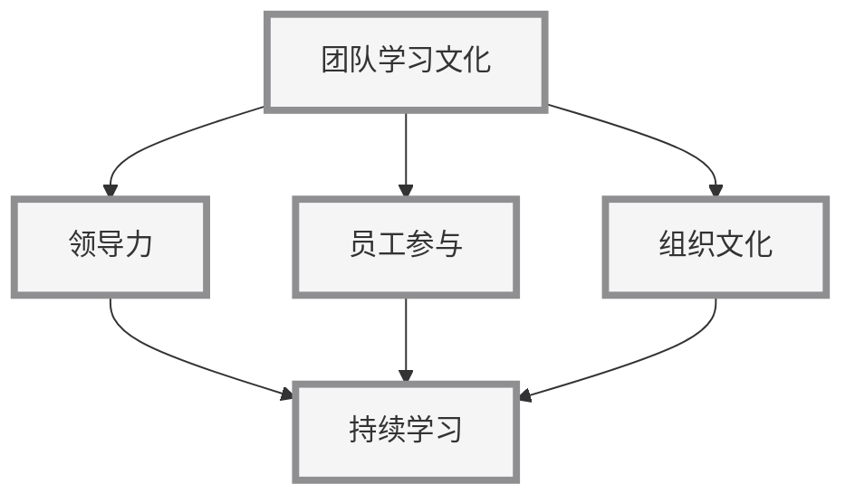

                 

当然，我们将按照您的要求，一步一步构建这篇文章。首先，我们来定义这篇文章的结构，并逐步填充内容。以下是文章结构的初步规划：

# 《团队学习文化深化：构建持续学习的组织DNA》

## 关键词
- 团队学习文化
- 组织DNA
- 持续学习
- 领导力
- 员工参与

## 摘要
本文旨在探讨团队学习文化的深化，以及如何构建持续学习的组织DNA。我们将从定义团队学习文化入手，分析其核心概念与联系，通过具体的策略和工具，构建并优化组织的持续学习体系，结合实践案例进行详细剖析，最后提出评估与改进团队学习文化的策略。文章将使用Mermaid流程图展示概念关系，使用Python源代码阐述核心算法原理，并包含项目实战和最佳实践。

### 第1章 引言

#### 1.1 背景介绍
- 团队学习文化的兴起
- 持续学习对组织的重要性

#### 1.2 核心概念与联系
- 团队学习文化的定义
- 组织DNA的构成
- 持续学习的机制与工具

##### Mermaid流程图：团队学习文化与组织DNA的联系

### 第2章 团队学习文化的理论基础

#### 2.1 团队学习文化的核心概念
- 什么是团队学习文化
- 团队学习文化的特征

#### 2.2 组织DNA的构成
- 组织DNA的定义
- 组织DNA的要素

#### 2.3 持续学习的机制与工具
- 持续学习的定义
- 持续学习的工具

### 第3章 建立团队学习文化的策略

#### 3.1 领导者的角色和责任
- 领导者在团队学习文化中的角色
- 领导者的责任和行动

#### 3.2 员工参与与激励策略
- 员工参与的必要性
- 激励策略的设计与实施

#### 3.3 团队学习文化的实施步骤
- 团队学习文化的规划
- 团队学习文化的落地

### 第4章 组织DNA的构建与优化

#### 4.1 组织DNA的构成分析
- 分析组织DNA的要素
- 评估组织DNA的现状

#### 4.2 优化组织DNA的方法
- 增强组织适应性的策略
- 培养创新文化的措施

#### 4.3 优化组织DNA的工具
- 数字化工具的应用
- 数据分析技术的运用

### 第5章 持续学习的机制与工具

#### 5.1 学习型组织的构建方法
- 学习型组织的特点
- 学习型组织的构建步骤

#### 5.2 学习工具和平台的选择
- 现代学习工具的分类
- 学习平台的选择标准

#### 5.3 持续学习的实施策略
- 制定学习计划
- 实施学习策略

### 第6章 团队学习文化的实践案例

#### 6.1 案例一：谷歌的团队学习文化
- 谷歌的学习文化特色
- 谷歌的学习策略

#### 6.2 案例二：宝洁的团队学习文化
- 宝洁的学习文化实践
- 宝洁的学习策略

#### 6.3 案例三：华为的团队学习文化
- 华为的学习文化特色
- 华为的学习策略

### 第7章 团队学习文化的评估与改进

#### 7.1 评估团队学习文化的指标
- 评估团队学习文化的标准
- 评估方法的选用

#### 7.2 评估方法与实践
- 问卷调查
- 深度访谈

#### 7.3 改进团队学习文化的策略
- 针对性改进措施
- 改进策略的实施

### 第8章 总结与展望

#### 8.1 对全书内容的总结
- 核心观点的归纳
- 对未来团队学习文化的展望

#### 8.2 展望未来团队学习文化的趋势
- 新技术的应用
- 新趋势的探讨

### 附录
- 参考文献
- 相关研究资料链接
- 学习资源推荐

**作者：AI天才研究院/AI Genius Institute & 禅与计算机程序设计艺术 /Zen And The Art of Computer Programming**

接下来，我们将逐步填充每个章节的内容，确保文章完整性、连贯性和深度。****

