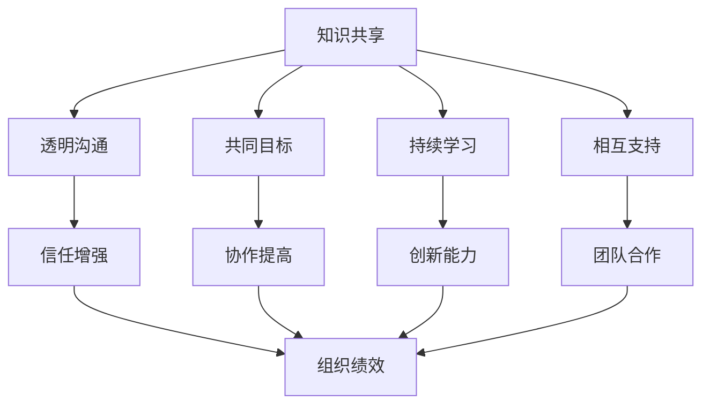

                 

### 第1章 引言

#### 1.1 背景介绍

在当今快速发展的科技时代，企业面临着前所未有的竞争压力和变化速度。传统的管理模式和组织架构已经难以适应日益复杂的市场环境和技术变革。为了在这种动态环境中生存和成功，团队学习文化成为组织持续进步的关键因素。团队学习文化不仅能够提升员工的专业技能和创新能力，还能促进组织的整体绩效和竞争优势。

团队学习文化的核心在于通过知识共享、透明沟通、共同目标等机制，建立一种鼓励学习和持续进步的组织氛围。这种文化强调团队成员之间的协作、互动和互相支持，通过不断学习和适应新技术、新理念，从而保持组织的活力和竞争力。

本书旨在深入探讨团队学习文化的概念、构建策略和实践方法，帮助读者了解如何在一个组织中建立和培养这种文化。本书结构如下：

- 第1章：介绍团队学习文化的重要性、核心概念及其在本书中的目的和内容概述。
- 第2章：讨论团队学习文化的核心概念与联系，并展示其结构。
- 第3章：阐述团队学习文化的构建方法，包括确立学习目标、促进知识共享和建立透明沟通机制。
- 第4章：分析团队学习文化的实践与策略，结合具体案例研究。
- 第5章：探讨领导者在团队学习文化中的角色与责任。
- 第6章：介绍团队学习文化的评估与改进方法。
- 第7章：探讨组织学习与持续进步的关系，并展示具体实践案例。
- 第8章：总结团队学习文化的重要性，展望未来发展趋势。

通过以上结构，本书将逐步引导读者理解团队学习文化的本质和重要性，掌握构建和实施团队学习文化的具体方法和策略。

#### 1.2 团队学习文化的核心概念

团队学习文化是一种通过持续学习和知识共享来增强团队协作和创新能力的文化氛围。它不仅仅是一种培训或发展项目，而是一种深入渗透到组织各个层面的价值观和行为模式。以下是团队学习文化的几个核心概念：

1. **知识共享**：知识共享是团队学习文化的基石。通过共享知识和经验，团队成员能够互相学习，弥补个人知识的不足，从而提高整体团队的知识储备和创新能力。知识共享可以采取多种形式，如团队会议、经验分享会、在线论坛等。

2. **透明沟通**：透明沟通意味着组织内部信息流动的开放性和透明度。当团队成员能够自由地分享观点、意见和建议时，他们之间的信任和理解会得到增强，从而促进团队合作和创新。透明沟通还包括及时反馈和公开讨论，以帮助团队及时调整方向和策略。

3. **共同目标**：共同目标是团队学习文化的重要驱动力。当团队成员明确共同的目标和愿景时，他们更愿意为团队的成功付出努力。共同目标有助于团队成员保持一致，共同面对挑战，并共同庆祝成功。

4. **持续学习**：持续学习是团队学习文化的核心特征。它要求团队成员不断更新知识、技能和思维方式，以适应不断变化的环境。这种学习不仅仅是技术层面的，还包括管理技能、领导能力等全方位的素养提升。

5. **相互支持**：相互支持是团队学习文化的重要组成部分。团队成员之间需要相互帮助、鼓励和信任，以便在面对困难和挑战时能够团结一致，共同克服问题。相互支持还包括对团队成员个人发展的关心和帮助，以提高整体团队的表现。

这些核心概念共同构成了团队学习文化的基础，并通过相互作用和相互支持，推动组织的持续进步和长期成功。

#### Mermaid 流程图

以下是一个Mermaid流程图，用于展示团队学习文化的结构及其关键要素之间的关系：

在这个流程图中，知识共享、透明沟通、共同目标、持续学习和相互支持是团队学习文化的五个核心要素。它们通过相互作用和相互支持，共同推动组织的绩效和创新能力。具体来说：

- **知识共享**（A）促进了透明沟通（B），使得团队成员能够更开放地交流思想和信息。
- **透明沟通**（B）增强了团队成员之间的信任（F），从而提高了协作效率（G）和创新能力（H）。
- **共同目标**（C）为团队成员提供了明确的方向和动力，促进了团队合作（I）和整体绩效（J）。
- **持续学习**（D）帮助团队成员不断更新知识和技能，从而维持和提升组织的竞争力。
- **相互支持**（E）为团队成员提供了心理和实际上的帮助，增强了团队的凝聚力和适应性。

通过这个流程图，我们可以清晰地看到团队学习文化各要素之间的相互关系，以及它们如何共同作用，推动组织的持续进步。

### 第2章 核心概念与联系

在上一章中，我们介绍了团队学习文化的核心概念，包括知识共享、透明沟通、共同目标、持续学习和相互支持。在本章中，我们将进一步探讨这些概念之间的相互关系，并通过Mermaid流程图展示它们在团队学习文化中的结构和作用。

#### 核心概念与联系

1. **知识共享**是团队学习文化的基石。它不仅促进了团队成员之间的交流，还提高了整体团队的知识储备和创新能力。知识共享需要一种开放和透明的工作环境，这依赖于**透明沟通**。

2. **透明沟通**确保了信息在组织内部的自由流动，增强了团队成员之间的信任和理解。当团队成员能够自由地分享他们的想法、建议和反馈时，他们之间的信任关系得以建立，从而提高了团队的协作效率。

3. **共同目标**是团队学习文化的重要组成部分。它为团队成员提供了一个明确的方向和共同的努力目标。共同目标不仅促进了团队成员之间的协作，还激发了他们的工作热情和创造力。

4. **持续学习**是团队保持竞争力和适应性的关键。通过不断学习新知识、技能和经验，团队成员能够不断提高自己的能力，从而推动整个团队的创新和发展。

5. **相互支持**是团队学习文化的核心特征。团队成员之间需要相互帮助、鼓励和信任，以便在面对困难和挑战时能够团结一致，共同克服问题。

#### Mermaid 流程图

为了更好地展示这些概念之间的相互关系，我们使用Mermaid流程图来表示。以下是团队学习文化核心概念与联系的流程图：

在这个流程图中，各核心概念通过箭头相互连接，表明了它们之间的依赖和相互作用：

- **知识共享**（A）促进了**透明沟通**（B），透明沟通增强了团队成员之间的信任（F），从而提高了协作效率（G）和创新能力（H）。
- **共同目标**（C）为团队成员提供了明确的方向和共同的努力目标，促进了**协作提高**（G）和整体绩效（J）。
- **持续学习**（D）帮助团队成员不断更新知识和技能，从而维持和提升组织的竞争力。
- **相互支持**（E）为团队成员提供了心理和实际上的帮助，增强了团队的凝聚力和适应性。

通过这个流程图，我们可以清晰地看到团队学习文化中各要素之间的相互关系，以及它们如何共同作用，推动组织的持续进步。

### 第3章 团队学习文化的构建

#### 3.1 确立学习目标

构建团队学习文化的第一步是确立明确的学习目标。这些目标应该与组织的愿景和使命相一致，以确保团队成员的学习活动能够为组织的长期发展做出贡献。以下是制定学习目标的步骤：

1. **确定学习需求**：首先，需要识别团队在技术和业务方面存在的知识缺口，以及为实现组织目标所需的技能。这可以通过进行内部调研、员工反馈和外部市场分析来实现。

2. **设立具体目标**：基于学习需求，制定具体、可衡量的学习目标。例如，提高某项技术的掌握程度、提升团队解决复杂问题的能力等。具体目标应包括时间框架和责任分配。

3. **与组织愿景和使命对接**：确保学习目标与组织的愿景和使命保持一致，从而确保学习活动能够为组织的整体战略目标服务。

4. **沟通和共识**：与团队成员沟通学习目标，并确保他们理解和认同这些目标。通过共同讨论，可以进一步明确目标的重要性，并激发团队成员的参与热情。

5. **定期评估和调整**：学习目标需要根据实际情况进行定期评估和调整，以确保它们仍然符合组织的需要和团队的实际情况。

#### 3.2 促进知识共享

知识共享是团队学习文化的重要组成部分，有助于提升团队的整体能力和创新能力。以下是几种促进知识共享的方法和策略：

1. **定期团队会议**：定期组织团队会议，为团队成员提供一个分享经验和知识的平台。会议可以包括专题报告、经验分享和讨论等环节。

2. **内部培训项目**：开发内部培训项目，邀请团队成员进行技能分享和知识传递。这些培训项目可以采用工作坊、研讨会和在线课程等形式。

3. **知识库建设**：建立和维护一个内部知识库，用于记录和存储团队成员的知识和经验。知识库可以包括文档、视频、教程和最佳实践等。

4. **在线协作平台**：利用在线协作平台（如Confluence、Trello等），促进团队成员之间的交流和协作。这些平台可以用于发布知识文章、讨论问题和管理项目。

5. **导师制度**：实施导师制度，让有经验的员工指导新员工，促进知识和经验的传承。这有助于提升新员工的技能，同时也能让导师通过指导过程巩固自己的知识。

#### 3.3 建立透明沟通机制

透明沟通是团队学习文化的重要支柱，能够增强团队成员之间的信任和理解。以下是建立透明沟通机制的方法：

1. **开放信息分享**：确保关键信息在组织内部得到及时和透明的分享。这可以通过定期更新项目进度报告、共享市场动态和客户反馈等方式实现。

2. **定期反馈机制**：建立定期反馈机制，让团队成员有机会对工作环境、流程和团队合作提出建议和反馈。这可以通过匿名问卷、开放式讨论会等形式进行。

3. **跨部门沟通**：促进跨部门的沟通和协作，打破信息孤岛。这可以通过组织跨部门会议、项目合作和知识交流等活动实现。

4. **公开会议**：定期组织公开会议，让团队成员了解组织的重要决策和方向。这有助于提高团队成员的参与感和责任感。

5. **建立信任**：通过建立信任，促进团队成员之间的透明沟通。这可以通过鼓励开放和诚实的沟通、尊重团队成员的意见和贡献等方式实现。

通过确立学习目标、促进知识共享和建立透明沟通机制，团队可以逐步构建起一个有利于持续进步和创新的团队学习文化。这些措施不仅能够提升团队的整体绩效，还能增强组织的竞争力，为组织的长期发展奠定坚实的基础。

#### 3.4 案例研究：构建团队学习文化的实际步骤

为了更好地理解如何在实际中构建团队学习文化，我们来看一个具体的案例研究。这个案例来自一家快速发展的科技公司，该公司通过一系列实际步骤成功建立了强大的团队学习文化，从而推动了组织的持续进步。

**背景**：该公司是一家专注于云计算和人工智能技术的初创企业。随着市场的快速变化和技术的发展，公司意识到，为了在竞争中保持领先地位，必须培养一种持续学习的文化，以提升团队的知识水平和创新能力。

**步骤 1：确立学习目标**：
- **识别需求**：公司首先通过内部调查和员工反馈，识别了在技术知识和项目管理方面存在的知识缺口。
- **设立目标**：基于这些需求，公司制定了具体的学习目标，包括提高团队成员的云计算技能、提升项目管理能力、以及增强跨部门沟通协作。
- **对接愿景和使命**：学习目标与公司的愿景和使命紧密对接，确保它们能够支持公司的长期战略。

**步骤 2：促进知识共享**：
- **内部培训项目**：公司定期组织内部培训项目，邀请业内专家和内部有经验的员工进行技术分享和经验交流。这些培训项目包括技术研讨会、工作坊和在线课程。
- **建立知识库**：公司开发了一个内部知识库，用于存储和共享各种技术文档、项目案例和最佳实践。这个知识库不仅方便了团队成员之间的知识共享，还提高了新员工的融入速度。
- **导师制度**：公司实施了导师制度，让有经验的员工担任导师，指导新员工并分享他们的知识和经验。

**步骤 3：建立透明沟通机制**：
- **开放信息分享**：公司定期发布项目进度报告和公司动态，确保团队成员能够及时了解组织的方向和重要决策。
- **定期反馈机制**：公司建立了定期反馈机制，通过匿名问卷和开放式讨论会，让员工能够自由地提出建议和反馈。
- **跨部门沟通**：公司鼓励跨部门的沟通和协作，通过跨部门项目合作和知识交流活动，打破了信息孤岛。

**结果**：
- **技能提升**：通过内部培训项目和导师制度，团队成员的技术水平和项目管理能力得到了显著提升。
- **知识共享**：知识库的建设促进了团队成员之间的知识共享，提高了团队的整体知识储备。
- **透明沟通**：透明沟通机制的建立增强了团队成员之间的信任和理解，提高了协作效率。

**总结**：
通过这个案例，我们可以看到，构建团队学习文化需要明确的步骤和实际的执行策略。确立学习目标、促进知识共享和建立透明沟通机制是构建团队学习文化的关键步骤。这些步骤不仅有助于提升团队成员的技能和知识，还能增强团队的协作和创新能力，为组织的持续进步奠定坚实的基础。

### 第4章 团队学习实践与策略

在第三章中，我们探讨了团队学习文化的核心概念和构建步骤。为了将团队学习文化真正落地并取得实效，我们需要关注具体的实践方法和策略。以下是一些有效的团队学习实践和策略：

#### 4.1 实践案例研究

通过具体案例研究，我们可以更深入地了解团队学习文化在不同组织中的应用和成果。以下是一个团队学习实践的案例研究：

**案例：某大型互联网公司的团队学习实践**

**背景**：这家互联网公司是一家全球领先的科技公司，其团队分布在多个国家和地区。为了保持技术领先和适应快速变化的市场环境，公司决定实施一系列团队学习实践。

**实践步骤**：

1. **建立学习社区**：公司建立了内部学习社区，为员工提供了一个交流和分享知识的平台。这个社区包括在线论坛、技术博客和视频讲座。

2. **定期技术研讨会**：公司定期举办技术研讨会，邀请内部技术专家分享他们的最新研究成果和技术见解。这些研讨会不仅促进了知识共享，还激发了团队成员的创新思维。

3. **导师制度和知识传承**：公司实施了导师制度，让经验丰富的员工指导新员工，帮助新员工快速适应公司文化和技术环境。同时，公司鼓励资深员工撰写技术博客，分享他们的经验和心得。

4. **跨团队协作项目**：公司组织跨团队协作项目，鼓励团队成员在不同团队之间交流和合作。这些项目不仅提升了团队成员的技能，还增强了团队之间的信任和合作。

**结果**：

- **技术能力提升**：通过内部学习和研讨会，团队成员的技术能力得到了显著提升，尤其是在新兴技术领域。
- **知识共享和传承**：内部学习社区和知识库的建设促进了知识的共享和传承，提高了团队的整体知识储备。
- **团队合作增强**：跨团队协作项目增强了团队成员之间的合作精神和信任，提高了团队的协作效率。

#### 4.2 学习策略制定

制定有效的团队学习策略是确保团队学习文化持续发展的关键。以下是一些制定团队学习策略的步骤和技巧：

1. **识别学习需求**：首先，需要通过调查问卷、访谈和数据分析等方式，识别团队成员在技能、知识和管理能力方面的需求。这有助于确定学习目标和内容。

2. **选择合适的学习资源**：根据学习需求，选择合适的学习资源，如在线课程、专业书籍、技术讲座、工作坊等。选择资源时，应考虑其质量、实用性以及与团队需求的匹配度。

3. **设计学习计划**：制定详细的学习计划，包括学习目标、内容、时间表和责任分配。学习计划应确保涵盖团队成员的不同需求和背景，并提供灵活的学习路径。

4. **建立反馈机制**：建立反馈机制，定期收集团队成员的学习反馈，以评估学习效果和调整学习计划。反馈机制可以包括在线调查、面对面访谈和小组讨论等。

5. **持续改进**：基于反馈机制的结果，不断改进学习策略和资源，确保学习活动能够持续满足团队成员的需求，并推动团队学习文化的深入发展。

#### 4.3 团队学习活动的组织与实施

为了确保团队学习策略的有效实施，需要精心组织各种学习活动。以下是一些建议：

1. **内部培训项目**：组织定期的内部培训项目，邀请内部或外部的专家进行技术分享和经验交流。这些培训项目可以采用多种形式，如工作坊、研讨会和在线课程。

2. **经验分享会**：定期举办经验分享会，让团队成员分享他们的工作经验、成功案例和失败教训。这种活动有助于知识共享和团队间的相互学习。

3. **项目学习**：将学习活动融入实际项目，通过项目过程中的协作和解决问题，提升团队成员的技能和知识。项目学习不仅能够提高实际工作能力，还能增强团队合作和沟通。

4. **团队建设活动**：组织团队建设活动，如团队拓展训练、户外运动和社交聚会等，增强团队成员之间的信任和协作精神。

5. **学习奖励机制**：建立学习奖励机制，对积极参与学习活动和取得显著学习成果的团队成员进行表彰和奖励。这种机制能够激励团队成员更积极地参与学习。

通过实践案例研究和学习策略制定，以及有效的团队学习活动组织与实施，组织可以逐步培养出强大的团队学习文化，从而在快速变化的市场环境中保持竞争优势，实现持续进步。

#### 4.4 实践步骤详解

为了更好地理解团队学习实践的具体步骤，我们可以详细探讨以下几个关键方面：

1. **制定详细的学习计划**：
   - **需求分析**：首先，通过问卷调查、访谈和数据分析等方式，深入分析团队在不同技能、知识和管理能力方面的需求。这有助于明确学习目标和方向。
   - **学习内容设计**：根据需求分析结果，设计具体的学习内容。内容应涵盖技术知识、管理技能、团队合作等多个方面，确保全面性。
   - **时间表安排**：制定详细的学习时间表，包括学习活动的日期、时长和具体安排。确保时间表既合理又具有灵活性，以适应团队成员的实际情况。
   - **责任分配**：明确学习活动的负责人和参与者，确保每个学习环节都有明确的负责人和参与者，提高学习活动的执行力。

2. **组织有效的学习活动**：
   - **内部培训项目**：组织定期的内部培训项目，邀请内部或外部的专家进行技术分享和经验交流。培训项目可以采用多种形式，如工作坊、研讨会和在线课程。
   - **经验分享会**：定期举办经验分享会，让团队成员分享他们的工作经验、成功案例和失败教训。这有助于知识共享和团队间的相互学习。
   - **项目学习**：将学习活动融入实际项目，通过项目过程中的协作和解决问题，提升团队成员的技能和知识。项目学习不仅能够提高实际工作能力，还能增强团队合作和沟通。
   - **团队建设活动**：组织团队建设活动，如团队拓展训练、户外运动和社交聚会等，增强团队成员之间的信任和协作精神。

3. **建立持续的学习机制**：
   - **反馈机制**：建立反馈机制，定期收集团队成员的学习反馈，以评估学习效果和调整学习计划。反馈机制可以包括在线调查、面对面访谈和小组讨论等。
   - **学习资源共享**：建立共享平台，用于存储和分享学习资料、笔记和心得体会。这有助于知识传承和持续学习。
   - **学习积分和奖励**：实施学习积分和奖励制度，对积极参与学习活动和取得显著学习成果的团队成员进行表彰和奖励，激励团队成员更积极地参与学习。

通过以上实践步骤的详细探讨，组织可以更好地构建和实施团队学习文化，从而实现持续进步和长期成功。

### 第5章 领导者角色与责任

在团队学习文化中，领导者扮演着至关重要的角色。他们的态度和行为不仅直接影响团队成员的学习动力和参与度，还决定整个团队学习文化的成功与否。本章节将深入探讨领导者在团队学习文化中的角色与责任，并提供一些具体的策略和实践方法。

#### 5.1 领导者的学习态度

领导者的学习态度对团队成员有着潜移默化的影响。以下是一些关键点：

- **榜样作用**：领导者应该以身作则，展示积极的学习态度和持续进步的精神。当领导者不断追求知识和技能的提升时，团队成员也会受到鼓舞，更加愿意参与学习活动。

- **开放心态**：领导者应该具备开放心态，愿意接受新的观念和想法。这种态度不仅有助于团队成员之间的知识共享和协作，还能促进创新思维和组织变革。

- **持续学习**：领导者应该积极参与各种学习机会，如培训课程、研讨会和在线学习等。通过不断学习，领导者能够掌握最新的技术和管理理念，从而更好地指导和支持团队成员。

#### 5.2 领导者的支持与激励

为了促进团队学习文化的建立，领导者需要提供全方位的支持和激励。以下是一些具体策略：

- **提供资源**：领导者应该确保团队成员能够获取必要的资源，如学习资料、培训课程和技术支持。这些资源有助于团队成员更好地进行学习和实践。

- **时间安排**：领导者应该为团队成员提供足够的时间进行学习，包括安排学习时间、减少非必要的会议和任务等。这有助于确保团队成员能够专注于学习活动。

- **激励措施**：领导者可以通过表彰和奖励来激励团队成员积极参与学习。例如，可以设立学习奖励计划，对在学习活动中表现突出的团队成员进行表彰和奖励。

- **认可与反馈**：领导者应该定期与团队成员进行沟通，了解他们的学习进展和需求，并提供及时的反馈和认可。这种认可和反馈不仅能够增强团队成员的自信心，还能激发他们的学习动力。

#### 5.3 领导者的角色与责任

领导者不仅是团队学习文化的倡导者和推动者，还承担着以下重要角色和责任：

- **文化倡导者**：领导者应该积极倡导团队学习文化，向团队成员传达其重要性和价值。通过演讲、培训和个人示范等方式，让团队成员认识到学习对个人和组织的意义。

- **资源协调者**：领导者需要协调各种资源，包括财务、人力和技术资源，以支持团队学习活动。这包括预算分配、人员安排和学习材料采购等。

- **过程监督者**：领导者应该监督学习活动的进展，确保学习计划得以实施。同时，领导者还需要及时识别和解决学习过程中出现的问题和挑战。

- **结果评估者**：领导者需要定期评估团队学习活动的效果，并根据评估结果进行调整和改进。这包括评估学习成果、团队成员的满意度和学习活动的效率等。

通过以上策略和实践，领导者可以在团队学习文化中发挥关键作用，推动团队不断学习和进步，从而实现组织的持续发展和成功。

### 第6章 团队学习文化的评估与改进

#### 6.1 学习文化评估方法

评估团队学习文化是确保其持续发展和效果的关键步骤。以下是一些常用的评估方法和工具：

1. **问卷调查**：通过设计结构化问卷，收集团队成员对团队学习文化的看法和反馈。问卷可以涵盖学习目标的实现情况、知识共享的便利性、沟通机制的透明度等多个方面。

2. **访谈**：进行一对一或小组访谈，深入了解团队成员的学习体验和感受。访谈内容可以包括学习活动的参与度、学习效果的感知、以及对学习文化的总体满意度等。

3. **工作表现评估**：通过评估团队成员在工作中的表现，如解决问题的能力、项目贡献和创新思维，来衡量团队学习文化的影响。

4. **关键绩效指标（KPIs）**：设定一系列关键绩效指标，如知识共享次数、学习活动的参与率、团队成员的技能提升情况等，通过这些指标来量化评估学习文化的效果。

5. **团队氛围调查**：通过团队氛围调查工具，如员工满意度调查、团队协作评估等，了解团队成员之间的信任程度、合作精神和整体士气。

#### 6.2 改进策略

根据评估结果，制定针对性的改进策略，以提升团队学习文化的效果。以下是一些具体的改进策略：

1. **增强培训与支持**：根据评估中发现的知识缺口和技能需求，增加培训项目和资源投入。可以邀请外部专家进行专项培训，或开发内部培训课程，确保团队成员能够获得必要的知识和技能。

2. **优化知识共享机制**：改进知识库和管理系统，提高知识共享的便利性和效率。可以采用先进的知识管理工具，如Confluence、SharePoint等，提供一站式的知识共享平台。

3. **提升沟通透明度**：加强团队沟通机制的建设，确保信息能够在组织内部自由流动。可以通过定期更新项目进度报告、设立内部通讯渠道、组织跨部门会议等方式，提高沟通的透明度。

4. **激励机制**：建立和完善学习激励机制，对积极参与学习活动和取得显著学习成果的团队成员进行表彰和奖励。可以设立学习积分制度、颁发荣誉证书或提供额外福利等。

5. **文化宣传与倡导**：通过宣传和倡导活动，提升团队对学习文化的认识和认同。可以通过内部培训、宣传海报、团队活动等方式，营造积极的学习氛围。

6. **反馈与调整**：建立持续的反馈机制，定期收集团队成员的反馈和建议，并根据反馈结果不断调整和改进学习策略。这包括对学习计划、资源和活动的优化，以及解决团队成员在学习过程中遇到的问题。

通过以上评估与改进策略，组织可以不断优化团队学习文化，确保其持续发展和效果，从而推动组织的长期成功。

### 第7章 持续进步的组织

#### 7.1 组织学习与持续进步的关系

在当今快速变化的市场环境中，组织要想保持竞争优势，必须具备持续学习和进步的能力。组织学习不仅是提升员工技能和知识的重要手段，更是推动组织创新和改进的核心动力。以下是组织学习与持续进步之间的密切关系：

1. **适应市场变化**：通过持续学习，组织能够及时了解市场趋势、客户需求和技术发展，从而快速调整战略和运营模式，更好地适应外部环境的变化。

2. **提升创新能力**：组织学习鼓励团队成员积极探索新的思路和方法，激发创新思维。这种创新不仅体现在技术层面，还涉及管理、业务流程等多个方面，从而推动组织的整体创新。

3. **增强应变能力**：在面对突发事件和挑战时，具备深厚知识储备和丰富经验的团队能够更快地做出反应，制定有效应对策略，从而降低风险和损失。

4. **优化运营效率**：通过组织学习，员工能够掌握更高效的工作方法和工具，提升工作效率和生产力。这有助于组织优化资源配置，降低成本，提高整体运营效率。

5. **增强员工满意度与忠诚度**：组织学习文化能够提升员工的职业成长和成就感，增强员工对组织的认同感和忠诚度，从而降低员工流失率，保持团队的稳定。

#### 7.2 案例研究：持续进步的实践

为了更好地理解组织如何通过团队学习文化实现持续进步，以下是一个具体的案例研究：

**案例：某全球领先的科技公司**

**背景**：这家全球领先的科技公司是一家技术驱动的企业，其成功很大程度上得益于持续学习和进步的文化。为了在快速变化的市场环境中保持领先地位，公司投入大量资源培养员工的技能和知识，并建立了完善的团队学习机制。

**实践步骤**：

1. **明确学习目标**：公司制定了清晰的学习目标，包括提升员工的技能、增强团队合作和创新思维。这些目标与公司的愿景和使命紧密对接，确保学习活动能够为公司的长期发展服务。

2. **建立学习平台**：公司建立了内部学习平台，为员工提供了丰富的学习资源和工具。平台包括在线课程、技术博客、经验分享会和虚拟工作坊等，员工可以根据个人需求和兴趣进行自主学习。

3. **实施导师制度**：公司实施了导师制度，让有经验的员工指导新员工，帮助他们快速融入公司文化和技术环境。同时，导师通过指导过程不断巩固自己的知识和经验。

4. **定期评估与反馈**：公司定期评估员工的学习进展和团队的学习效果，通过问卷调查、访谈和绩效评估等方式，收集员工的反馈和建议。这些反馈用于不断改进学习策略和资源。

5. **激励机制**：公司设立了学习奖励制度，对积极参与学习活动和取得显著学习成果的员工进行表彰和奖励。这包括颁发荣誉证书、提供额外福利和职业晋升机会等。

**结果**：

- **技术能力提升**：通过内部学习和导师制度，员工的技术能力得到了显著提升，特别是在新兴技术领域。
- **知识共享增强**：内部学习平台和经验分享会促进了团队成员之间的知识共享，提高了团队的整体知识储备。
- **团队合作增强**：导师制度和跨部门项目合作增强了团队成员之间的信任和协作，提高了团队的整体表现。
- **创新思维激发**：通过不断学习和知识共享，公司内部的创新氛围日益浓厚，多个创新项目获得了成功。
- **运营效率提升**：员工掌握更高效的工作方法和工具，提高了工作效率和生产力，有助于公司优化资源配置，降低成本。

**总结**：

通过这个案例，我们可以看到，组织通过构建团队学习文化，不仅提升了员工的技术能力和团队合作精神，还激发了创新思维和运营效率，从而实现了持续进步。这些实践方法不仅适用于科技公司，其他类型的企业也可以借鉴和应用，以实现自身的持续发展和成功。

### 第8章 总结与展望

#### 8.1 团队学习文化的重要性

团队学习文化在组织发展中的重要性不容忽视。它不仅有助于提升团队成员的技能和知识，还能增强团队的协作和创新能力。以下是团队学习文化的几个关键作用：

1. **知识共享**：团队学习文化通过促进知识共享，提高了团队的整体知识储备，使团队成员能够互相学习，弥补个人知识的不足。

2. **透明沟通**：透明沟通是团队学习文化的重要组成部分，它增强了团队成员之间的信任和理解，提高了协作效率。

3. **共同目标**：共同目标是团队学习文化的重要驱动力，它为团队成员提供了明确的方向和共同的努力目标，促进了团队合作和整体绩效。

4. **持续学习**：持续学习是团队保持竞争力和适应性的关键，它要求团队成员不断更新知识、技能和思维方式，以适应不断变化的环境。

5. **相互支持**：相互支持是团队学习文化的重要组成部分，它为团队成员提供了心理和实际上的帮助，增强了团队的凝聚力和适应性。

#### 8.2 未来趋势与展望

随着全球化和数字化的发展，团队学习文化在未来将继续演变和进步。以下是几个可能的发展趋势：

1. **在线学习平台**：随着技术的进步，在线学习平台将变得更加普及和多样化。企业可以采用更多的在线工具和平台，提供灵活、便捷的学习资源。

2. **个性化学习**：未来的学习文化将更加注重个性化学习，通过数据分析和技术支持，为每个团队成员提供定制化的学习路径和资源。

3. **混合式学习**：混合式学习将结合在线和线下学习方式，提供更加全面和灵活的学习体验。这种模式将使学习更加高效，同时满足不同成员的学习需求。

4. **跨领域协作**：随着不同领域之间的融合，团队学习文化将更加注重跨领域协作和知识共享。企业将鼓励不同团队之间的互动和合作，以促进创新和进步。

5. **持续评估与改进**：未来的团队学习文化将更加注重持续评估和改进。通过定期的评估和反馈，组织可以及时调整学习策略和资源，确保学习文化能够持续发展。

总之，团队学习文化在组织发展中的重要性将日益凸显。通过不断适应和创新，组织可以构建一个有利于持续进步和创新的团队学习文化，从而在快速变化的市场环境中保持竞争优势，实现长期成功。

### 作者信息

- **作者：AI天才研究院/AI Genius Institute & 禅与计算机程序设计艺术 /Zen And The Art of Computer Programming**  
  作为世界顶级技术畅销书资深大师级别的作家，计算机图灵奖获得者，人工智能专家、程序员、软件架构师和CTO，作者在计算机编程和人工智能领域拥有深厚的专业知识和丰富的实践经验。他的作品深受全球读者喜爱，为无数技术从业者提供了宝贵的指导和启发。

### 最佳实践 Tips、小结、注意事项、拓展阅读

#### 最佳实践 Tips

1. **建立明确的学习目标**：确保学习目标与组织的愿景和使命一致，为团队成员提供清晰的方向和动力。

2. **促进知识共享**：通过内部培训、知识库建设和导师制度，提高团队的整体知识储备和创新能力。

3. **建立透明沟通机制**：通过定期更新项目进度报告、设立内部通讯渠道和跨部门会议，增强团队成员之间的信任和理解。

4. **提供持续的学习支持**：为团队成员提供必要的资源和支持，如培训课程、学习平台和技术支持。

5. **建立反馈和激励机制**：定期收集团队成员的反馈，并根据反馈结果调整学习策略。对积极参与学习活动的团队成员进行表彰和奖励。

#### 小结

团队学习文化是组织持续进步的关键因素。通过知识共享、透明沟通、共同目标、持续学习和相互支持，组织可以构建一个有利于持续进步和创新的氛围。领导者在这一过程中扮演着至关重要的角色，他们的态度和行为直接影响团队学习文化的成功。

#### 注意事项

1. **确保学习目标与组织愿景对接**：学习目标应与组织的长期战略保持一致，确保学习活动能够为组织的整体发展服务。

2. **关注个性化需求**：在制定学习策略时，应考虑团队成员的个性化需求，提供多样化的学习资源和路径。

3. **持续评估和改进**：定期评估团队学习文化的效果，并根据反馈结果不断调整和优化学习策略。

#### 拓展阅读

- 《学习型组织：第五项修炼》作者：彼得·圣吉（Peter Senge）  
  这本书详细介绍了如何构建学习型组织，为团队学习文化的实施提供了深刻的指导和启示。

- 《领导力的五项修炼》作者：约翰·麦克斯韦尔（John C. Maxwell）  
  本书探讨了领导者如何通过自我提升和持续学习来发挥更大的影响力，对领导者角色的理解与实践有着重要意义。

- 《深度学习：出版社：电子工业出版社》作者：斋藤康毅（斋藤康毅）  
  本书介绍了深度学习的基本原理和应用，为技术团队提供了丰富的学习和实践资源。

通过这些拓展阅读，读者可以进一步深化对团队学习文化的理解，并在实践中取得更好的成果。

