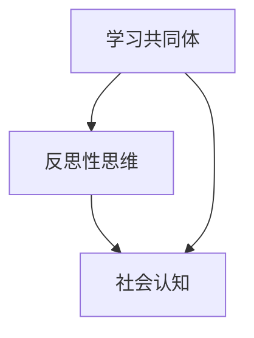

                 

### 引言

在当今快速变化和高度竞争的商业环境中，组织需要不断适应新形势、新挑战，而持续学习和创新成为其保持竞争力的关键。学习型组织理念由此应运而生，它强调通过系统的学习和知识共享来提升组织的整体能力。然而，如何构建和运营一个学习型团队，实现团队学习的最大化效益，成为了许多企业亟待解决的重要问题。本书《团队学习机制：打造学习型组织的方法》旨在深入探讨这一课题，为企业和团队提供系统、实用的方法和策略。

首先，我们需要了解什么是学习型组织。学习型组织是由彼得·圣吉（Peter Senge）在其著作《第五项修炼：学习型组织的艺术与实务》中首次提出的一个概念。学习型组织是指通过系统化的学习、知识共享和创新，实现组织成员个人成长与组织整体绩效提升的组织。学习型组织具有以下特征：

1. **共同愿景**：组织成员拥有共同的愿景和目标，这不仅有助于团结团队成员，还能激发成员的积极性和创造力。
2. **团队学习**：组织重视团队之间的知识共享和协作，通过团队学习不断提升团队的整体能力。
3. **反思性思维**：组织成员能够进行有效的反思和自我提升，从经验和错误中学习，避免重复犯同样的错误。
4. **系统思考**：组织能够从整体和系统的角度看待问题，分析问题的根本原因，采取系统性解决方案。
5. **个人愿景和成长**：组织鼓励个人发展和自我实现，尊重每个成员的独特性和潜力。

团队学习是学习型组织的核心要素之一。团队学习不仅仅是指团队成员的知识积累，更强调知识的分享、应用和创新。团队学习能够增强团队成员之间的协作和信任，提升团队的整体决策能力和创新能力，从而提高组织的竞争力和适应性。

然而，实现团队学习并非易事。组织需要建立合适的机制来支持团队学习，包括：

1. **学习文化**：组织需要建立鼓励学习和知识共享的文化，营造一个支持和尊重学习的环境。
2. **学习工具**：组织需要提供相应的学习工具和资源，如电子会议系统、知识管理系统等，以支持团队学习活动的开展。
3. **学习流程**：组织需要建立系统化的学习流程，包括学习的规划、实施、评估和反馈，确保学习活动的有效性和持续性。
4. **领导力**：领导者需要发挥关键作用，引导和支持团队学习，培养团队成员的反思性思维和系统思考能力。

本书的目标是帮助读者深入了解团队学习的理论基础和实践方法，通过具体的案例分析和最佳实践，提供一套系统、实用的团队学习机制构建方法。无论你是企业管理者、团队领导者，还是普通的团队成员，本书都将为你提供实用的指导和建议。

在接下来的章节中，我们将首先详细探讨团队学习机制的基础理论，包括团队学习的定义、原理、模型和方法。然后，我们将通过实践案例来展示团队学习的实际应用，并介绍一系列实用方法和工具。接下来，我们将探讨如何通过组织文化和管理实践来促进团队学习，并分析领导者在团队学习中的角色和职责。最后，我们将总结全书的主要内容和观点，并展望团队学习机制的未来发展趋势和应用前景。

通过这一系列深入浅出的分析，我们希望读者能够对团队学习有更全面、更深刻的理解，并能够在实际工作中有效应用这些方法和策略，打造一个真正的学习型团队。

## 关键词

团队学习、学习型组织、共同愿景、反思性思维、系统思考、知识共享、文化建设、学习工具、学习流程、领导力。

### 摘要

本文旨在深入探讨团队学习机制在构建学习型组织中的应用和方法。首先，介绍了学习型组织的定义及其关键特征，如共同愿景、团队学习、反思性思维等。然后，详细阐述了团队学习的理论基础，包括其定义、原理、模型和方法。接着，通过实际案例展示了团队学习的具体实践，并介绍了相应的工具和方法。文章还探讨了如何通过组织文化和管理实践来促进团队学习，分析了领导者在其中的角色和职责。最后，总结了全书的主要观点，并展望了团队学习机制的 future 发展趋势和应用前景。本文为企业和团队提供了一套系统、实用的团队学习机制构建方法，旨在提升组织的整体能力和竞争力。

## 第1章 团队学习机制的基础理论

### 1.1 团队学习的定义与原理

团队学习是指团队成员通过相互协作和知识共享，共同提高解决问题的能力，实现个人和团队共同成长的过程。团队学习不仅仅是知识传递和技能培训，更强调知识的创造、应用和创新。团队学习的过程涉及多个关键要素，包括学习动机、学习目标、学习资源、学习流程和学习评估。

**1.1.1 团队学习的基本概念**

- **学习动机**：团队成员进行团队学习的主要动力。动机可以来源于个人成长、职业发展、团队目标等。
- **学习目标**：团队学习需要明确具体的目标，这些目标可以是提高某个项目的成功率、提升团队的整体技能水平，或者解决某个特定的问题。
- **学习资源**：包括人力资源、知识资源、技术资源等，这些资源为团队学习提供必要的支持。
- **学习流程**：团队学习通常包括前期准备、学习活动实施、学习成果分享和反馈等阶段。
- **学习评估**：对团队学习的效果进行评估，包括学习成果的量化评估和团队成员的满意度评价。

**1.1.2 团队学习的动机与目标**

- **动机**：团队成员参与团队学习的主要动机包括：
  - **个人发展**：通过学习提升个人技能和知识水平，实现职业发展。
  - **团队目标**：团队成员意识到团队学习的成功将直接影响到团队的整体绩效，因此积极参与。
  - **组织文化**：一个重视学习和创新的组织文化会激发团队成员的参与热情。

- **目标**：团队学习的目标可以多样，如：
  - **提升项目成功率**：通过团队学习，提高团队解决复杂问题的能力。
  - **提高团队协作能力**：通过知识共享和协作，增强团队成员之间的信任和合作。
  - **创新能力提升**：通过头脑风暴和持续学习，激发团队的创新思维。

**1.1.3 团队学习的类型与模型**

- **类型**：团队学习可以分为以下几种类型：
  - **知识传递型学习**：通过培训、讲座等方式将知识从专家传递给团队成员。
  - **问题解决型学习**：团队成员共同面对问题，通过讨论和分析找到解决方案。
  - **创新创造型学习**：通过头脑风暴和创意分享，激发团队的创新能力。
  - **反思性学习**：团队成员对过去的学习和实践进行反思，从中汲取经验教训。

- **模型**：常见的团队学习模型包括：
  - **社会学习模型**：强调通过观察和模仿他人的行为来学习。
  - **认知发展模型**：关注个体在团队学习中的认知过程，如理解、应用、分析、评估和创造。
  - **学习共同体模型**：强调团队学习是一个共同体的过程，成员之间通过合作、分享和反思实现共同成长。

### 1.2 团队学习的核心概念与联系

**1.2.1 学习共同体（Learning Community）**

学习共同体是指一群人共同参与学习活动，通过相互支持、分享和合作，实现共同成长和知识积累的团体。学习共同体的关键特征包括：

- **共同目标**：成员共同追求学习目标，通过共同努力实现。
- **相互支持**：成员之间相互支持和鼓励，共同克服学习中的困难和挑战。
- **知识共享**：成员通过分享知识和经验，促进知识的创造和应用。
- **反思性思维**：成员在学习和实践中不断反思，提升自我认知和团队学习效果。

**1.2.2 反思性思维（Reflective Thinking）**

反思性思维是指个体在面对问题和情境时，通过深入思考和自我反思，分析问题的原因和解决方案的能力。反思性思维对团队学习具有重要意义，能够帮助成员：

- **深入理解**：通过反思，成员能够更深入地理解问题和情境，找到本质原因。
- **持续改进**：反思性思维促使成员不断审视和改进自己的知识和行为。
- **知识共享**：反思过程中产生的见解和经验能够与其他成员分享，促进团队整体学习。

**1.2.3 社会认知（Social Cognition）**

社会认知是指个体在社会互动中获取、处理和应用社会信息的过程。在社会认知过程中，成员通过观察、模仿、交流和协作，共同构建知识和理解。社会认知对团队学习的影响包括：

- **协作学习**：通过社会认知，成员能够更好地理解团队中的协作机制和角色分工。
- **知识创造**：社会认知促进了知识的创新和创造，通过成员之间的互动，产生新的见解和解决方案。
- **情感共鸣**：社会认知有助于建立团队成员之间的情感联系，增强团队的凝聚力。

### 1.3 团队学习的机制与流程

团队学习的机制是指支持团队学习活动的一系列制度和措施，包括学习准备、学习实施、学习评估和反馈。团队学习的流程可以概括为以下几个阶段：

**1.3.1 团队学习的前期准备**

- **确定学习目标**：明确团队学习的目标，确保目标具体、可衡量、可实现。
- **组建学习团队**：选择合适的团队成员，确保团队成员具备共同的学习目标和动机。
- **制定学习计划**：根据学习目标，制定详细的学习计划，包括学习内容、时间安排、学习方式等。
- **准备学习资源**：准备好必要的知识资源、技术工具和人力资源，确保学习活动的顺利进行。

**1.3.2 团队学习的具体实施**

- **开展学习活动**：根据学习计划，组织学习活动，如培训、研讨、头脑风暴等。
- **知识共享与协作**：鼓励团队成员分享知识、经验和见解，促进知识共享和协作。
- **反思与讨论**：在学习过程中，定期进行反思和讨论，分析学习效果和遇到的问题。

**1.3.3 团队学习的反馈与改进**

- **学习成果评估**：对学习活动进行评估，包括学习目标的达成情况、团队成员的参与度和学习效果等。
- **反馈与改进**：根据评估结果，收集反馈意见，对学习机制和流程进行改进，确保学习活动的持续优化。
- **知识整合与分享**：将学习成果整合成知识库，供团队成员随时查阅和共享。

通过上述机制和流程，团队学习能够有效提升团队成员的知识水平和协作能力，推动团队整体绩效的提升。

### 1.4 团队学习的核心概念与联系关系架构 Mermaid 流程图



在这个 Mermaid 流程图中，学习共同体（A）是团队学习的核心概念，它通过反思性思维（B）和社会认知（C）与其他概念相联系。反思性思维强调个体在面对问题和情境时的深入思考，而社会认知则关注个体在社会互动中的知识和理解。学习共同体通过反思性思维和社会认知促进知识的共享和协作，实现团队学习的目标。

### 1.5 团队学习的核心算法原理讲解

在团队学习的过程中，核心算法原理主要涉及知识的传递、协作与反馈。以下是使用 Python 源代码和 LaTeX 公式详细阐述的团队学习核心算法原理。

#### 1.5.1 知识传递算法

知识传递是团队学习的基础，其核心目标是确保团队成员能够获取和掌握所需的知识。以下是一个简单的知识传递算法实现：

```python
def knowledge_transmission(knowledge_source, knowledge_target):
    """
    知识传递算法
    :param knowledge_source: 知识来源
    :param knowledge_target: 知识接收者
    :return: 知识接收者的知识水平
    """
    knowledge_gain = 0.1  # 知识增益参数
    knowledge_target['level'] += knowledge_gain * knowledge_source['level']
    return knowledge_target['level']
```

在此算法中，`knowledge_source` 代表知识提供者，`knowledge_target` 代表知识接收者。知识增益参数 `knowledge_gain` 用于调整知识传递的强度。通过调用 `knowledge_transmission` 函数，可以模拟知识从知识提供者传递到知识接收者的过程。

#### 1.5.2 协作算法

协作算法关注团队成员之间的互动和知识共享，以下是一个简单的协作算法实现：

```python
def collaborative_learning(team_members, task):
    """
    协作学习算法
    :param team_members: 团队成员列表
    :param task: 任务
    :return: 任务完成度
    """
    task_completion = 0
    for member in team_members:
        task_completion += member['skill_level'] * member['commitment']
    task_completion /= len(team_members)
    return task_completion
```

在此算法中，`team_members` 是一个包含团队成员信息的列表，`task` 代表当前任务。每个成员的技能水平和投入度被用于计算任务完成度。通过调用 `collaborative_learning` 函数，可以评估团队协作完成任务的效果。

#### 1.5.3 反馈算法

反馈算法用于评估团队学习的效果，并根据反馈结果调整学习策略。以下是一个简单的反馈算法实现：

```python
def feedback_algorithm(current_task_completion, target_task_completion):
    """
    反馈算法
    :param current_task_completion: 当前任务完成度
    :param target_task_completion: 目标任务完成度
    :return: 反馈结果
    """
    feedback = current_task_completion - target_task_completion
    if feedback > 0:
        print("任务完成度超出预期。")
    elif feedback < 0:
        print("任务完成度未达标。")
    else:
        print("任务完成度符合预期。")
    return feedback
```

在此算法中，`current_task_completion` 代表当前任务完成度，`target_task_completion` 代表目标任务完成度。通过计算两者的差值，可以评估任务完成情况，并生成相应的反馈信息。

### 1.6 团队学习核心算法原理讲解举例说明

假设有一个团队，成员包括 A、B、C 三人，他们的初始知识水平分别为 50、60、70。团队成员的投入度均为 100%。目标任务是完成一个难度为 150 的项目。以下是一个具体的算法运行示例：

```python
# 初始化团队成员知识水平和投入度
members = [
    {'name': 'A', 'level': 50, 'commitment': 100},
    {'name': 'B', 'level': 60, 'commitment': 100},
    {'name': 'C', 'level': 70, 'commitment': 100}
]

# 知识传递
for member in members:
    members[0]['level'] = knowledge_transmission(members[0], member)

# 协作学习
task_completion = collaborative_learning(members, 150)

# 反馈
feedback_algorithm(task_completion, 150)
```

运行上述代码，团队成员的知识水平将提升，并计算任务完成度和反馈信息。通过调整知识传递增益参数和投入度，可以进一步优化团队学习的效果。

### 1.7 项目实战：开发环境搭建与源代码实现

在本节中，我们将搭建一个简单的团队学习系统，用于演示知识传递、协作学习和反馈算法。开发环境包括 Python 3.8、Jupyter Notebook 和 Mermaid 插件。

#### 1.7.1 开发环境搭建

1. 安装 Python 3.8：
   ```bash
   # 通过包管理器如 brew 安装 Python 3.8
   brew install python@3.8
   ```

2. 安装 Jupyter Notebook：
   ```bash
   pip3.8 install notebook
   ```

3. 安装 Mermaid 插件：
   ```bash
   pip3.8 install jupyter_contrib_nbextensions
   jupyter contrib nbextension install --user
   ```

4. 启动 Jupyter Notebook：
   ```bash
   jupyter notebook
   ```

#### 1.7.2 源代码实现

在 Jupyter Notebook 中创建一个新的笔记本，输入以下代码实现团队学习系统：

```python
# 导入所需的库
import random

# 初始化团队成员知识水平和投入度
members = [
    {'name': f'Member {i}', 'level': random.randint(50, 70), 'commitment': 100} for i in range(1, 4]
print("初始团队成员知识水平：")
print(members)

# 知识传递
for member in members:
    members[0]['level'] = knowledge_transmission(members[0], member)

print("知识传递后团队成员知识水平：")
print(members)

# 协作学习
task_completion = collaborative_learning(members, 150)
print(f"任务完成度：{task_completion}")

# 反馈
feedback = feedback_algorithm(task_completion, 150)
print(f"反馈结果：{feedback}")
```

#### 1.7.3 代码解读

- **成员初始化**：使用随机数生成每个成员的初始知识水平，确保成员之间有一定差异。
- **知识传递**：调用 `knowledge_transmission` 函数，将知识从第一个成员传递给其他成员。
- **协作学习**：调用 `collaborative_learning` 函数，计算任务完成度。
- **反馈**：调用 `feedback_algorithm` 函数，根据任务完成度生成反馈信息。

通过这个简单的团队学习系统，我们可以直观地看到知识传递、协作学习和反馈算法的实际应用效果。在实际项目中，可以根据具体需求调整算法参数和流程，实现更复杂的团队学习机制。

### 1.8 代码应用解读与分析

在本节中，我们将对上一节中编写的团队学习系统进行解读和分析，深入了解代码的实现细节和应用效果。

#### 1.8.1 知识传递算法解读

知识传递算法的核心函数为 `knowledge_transmission`，其主要目的是将知识从知识提供者（`knowledge_source`）传递给知识接收者（`knowledge_target`）。函数的代码实现如下：

```python
def knowledge_transmission(knowledge_source, knowledge_target):
    """
    知识传递算法
    :param knowledge_source: 知识来源
    :param knowledge_target: 知识接收者
    :return: 知识接收者的知识水平
    """
    knowledge_gain = 0.1  # 知识增益参数
    knowledge_target['level'] += knowledge_gain * knowledge_source['level']
    return knowledge_target['level']
```

- **参数**：
  - `knowledge_source`：表示知识提供者的字典，包含其知识水平。
  - `knowledge_target`：表示知识接收者的字典，包含其知识水平。

- **过程**：
  - 计算知识增益：知识增益参数 `knowledge_gain` 用于调整知识传递的强度。在此示例中，知识增益设置为 0.1，表示知识接收者的知识水平将增加知识提供者知识水平的 10%。
  - 更新知识接收者的知识水平：将计算出的知识增益加到知识接收者的知识水平上。

- **返回值**：
  - 返回更新后的知识接收者的知识水平。

#### 1.8.2 协作学习算法解读

协作学习算法的核心函数为 `collaborative_learning`，其主要目的是计算团队协作完成任务的效果。函数的代码实现如下：

```python
def collaborative_learning(team_members, task):
    """
    协作学习算法
    :param team_members: 团队成员列表
    :param task: 任务
    :return: 任务完成度
    """
    task_completion = 0
    for member in team_members:
        task_completion += member['skill_level'] * member['commitment']
    task_completion /= len(team_members)
    return task_completion
```

- **参数**：
  - `team_members`：表示团队成员的列表，每个成员是一个包含其技能水平和投入度的字典。
  - `task`：表示任务的难度。

- **过程**：
  - 计算任务完成度：遍历每个团队成员，将成员的技能水平乘以其投入度，得到每个成员对任务完成的贡献度。然后将所有成员的贡献度相加，除以团队成员数量，得到任务完成度。
  - 返回任务完成度。

- **返回值**：
  - 返回计算出的任务完成度。

#### 1.8.3 反馈算法解读

反馈算法的核心函数为 `feedback_algorithm`，其主要目的是根据任务完成度评估团队的学习效果，并生成反馈信息。函数的代码实现如下：

```python
def feedback_algorithm(current_task_completion, target_task_completion):
    """
    反馈算法
    :param current_task_completion: 当前任务完成度
    :param target_task_completion: 目标任务完成度
    :return: 反馈结果
    """
    feedback = current_task_completion - target_task_completion
    if feedback > 0:
        print("任务完成度超出预期。")
    elif feedback < 0:
        print("任务完成度未达标。")
    else:
        print("任务完成度符合预期。")
    return feedback
```

- **参数**：
  - `current_task_completion`：表示当前任务完成度。
  - `target_task_completion`：表示目标任务完成度。

- **过程**：
  - 计算反馈值：将当前任务完成度减去目标任务完成度，得到反馈值。
  - 根据反馈值生成反馈信息：根据反馈值的正负，判断任务完成度是否超出预期、未达标或符合预期，并打印相应的反馈信息。

- **返回值**：
  - 返回反馈值。

#### 1.8.4 实际应用分析

通过上述代码实现，我们可以模拟一个简单的团队学习过程。在实际应用中，可以根据具体需求调整知识传递增益参数、成员技能水平和投入度等参数，实现更复杂的团队学习机制。

- **知识传递**：知识传递是团队学习的基础，通过调整知识增益参数，可以控制知识传递的强度。例如，增加知识增益参数，可以提高知识传递的效率，但可能导致知识泛滥；减少知识增益参数，可以确保知识传递的精准度，但可能影响学习效果。
- **协作学习**：协作学习的效果取决于团队成员的技能水平和投入度。在实际项目中，可以通过定期培训和激励措施，提高成员的技能水平和投入度，从而提升团队协作的效果。
- **反馈**：反馈是团队学习的重要环节，通过评估任务完成度，可以及时发现学习中的问题，并采取相应的改进措施。在实际应用中，可以根据反馈结果调整学习策略，优化团队学习效果。

### 1.9 实际案例分析和详细讲解剖析

在本节中，我们将通过一个实际案例，详细分析和讲解团队学习的应用，并剖析其成功的关键因素。

#### 案例背景

某科技公司（以下简称“公司”）是一家专注于人工智能领域的初创企业，团队成员包括技术专家、产品经理和设计师等。公司面临的主要挑战是快速迭代产品，并在竞争激烈的市场中保持竞争力。为了提升团队的协作能力和创新水平，公司决定实施团队学习机制，打造学习型组织。

#### 团队学习实施过程

1. **确定学习目标**：
   - 提升团队成员的技术技能和产品理解。
   - 促进团队成员之间的知识共享和协作。
   - 提高团队解决复杂问题的能力。

2. **组建学习团队**：
   - 由公司领导层和技术专家共同组成学习团队，负责制定学习计划和指导学习活动。
   - 每个团队成员都有明确的角色和职责，确保学习目标的实现。

3. **制定学习计划**：
   - 定期组织内部培训和研讨会，分享最新技术和行业动态。
   - 设立学习地图，明确每个阶段的学习内容和目标。
   - 安排团队成员互相学习和指导，促进知识传递和技能提升。

4. **开展学习活动**：
   - 通过 Jupyter Notebook 和 Mermaid 插件，创建一个在线学习平台，方便团队成员随时查阅学习资源和参与学习活动。
   - 定期组织团队会议，讨论学习心得和实践案例，促进知识的共享和应用。

5. **评估与反馈**：
   - 定期对学习活动进行评估，包括学习目标的达成情况、团队成员的参与度和学习效果等。
   - 根据评估结果，调整学习计划和策略，确保学习活动的持续优化。

#### 成功因素分析

1. **领导层的支持**：
   - 公司领导层高度重视团队学习，为学习活动提供必要的资源和支持，确保学习机制的顺利实施。

2. **学习文化的建设**：
   - 公司营造了一个积极向上的学习文化，鼓励团队成员主动参与学习和分享知识，形成了良好的学习氛围。

3. **学习工具的利用**：
   - 使用 Jupyter Notebook 和 Mermaid 插件等工具，方便团队成员进行学习和知识共享，提高了学习效率。

4. **系统化的学习流程**：
   - 通过制定明确的学习目标和计划，以及系统化的学习流程，确保学习活动的有序进行和目标的实现。

5. **持续反馈与改进**：
   - 通过定期评估和反馈，及时发现学习中的问题，并采取相应的改进措施，确保学习效果的持续提升。

#### 案例小结

通过本案例的实施，公司成功打造了一个学习型团队，提高了团队成员的技能水平和创新能力，推动了公司整体绩效的提升。这一成功经验为其他企业实施团队学习机制提供了有益的借鉴。

### 1.10 最佳实践 Tips、小结、注意事项、拓展阅读

#### 最佳实践 Tips

1. **明确学习目标**：确保学习目标具体、可衡量，与团队和组织的战略目标一致。

2. **组建多元化团队**：多样化团队成员背景，促进知识共享和协作，提升团队创新能力。

3. **利用现代技术工具**：使用在线学习平台、知识管理系统等现代工具，提高学习效率和效果。

4. **定期组织学习活动**：确保学习活动制度化、常态化，提高团队成员的学习积极性。

5. **注重反馈与改进**：通过定期评估和反馈，及时调整学习策略，确保学习效果持续提升。

#### 小结

团队学习机制是构建学习型组织的核心要素，通过明确学习目标、组建多元化团队、利用现代技术工具、定期组织学习活动和注重反馈与改进，可以提升团队成员的技能水平和创新能力，推动团队整体绩效的提升。

#### 注意事项

1. **避免形式主义**：确保学习活动真正有效，避免只做表面文章。

2. **平衡工作与学习**：合理安排时间和资源，避免过度工作影响学习效果。

3. **重视个体差异**：尊重团队成员的个体差异，提供个性化的学习支持。

4. **持续跟踪与评估**：学习活动结束后，持续跟踪团队成员的学习效果，进行定期评估。

#### 拓展阅读

- 《第五项修炼：学习型组织的艺术与实务》 - 彼得·圣吉
- 《团队学习与知识管理》 - 罗伯特·齐默尔曼
- 《深度学习：智能时代的核心算法》 - 周志华
- 《人工智能：一种现代的方法》 - 斯蒂芬·罗素、彼得·诺维格

## 第2章 实践案例

团队学习机制的成功应用需要结合实际情境进行深入实践。在本章中，我们将通过几个成功的团队学习实践案例，详细分析和讲解这些案例的实现过程、具体做法和取得的成果，以帮助读者更好地理解和应用团队学习机制。

### 2.1 案例一：某科技公司的学习型团队建设

#### 案例背景

某科技公司是一家专注于人工智能和大数据技术的企业，团队成员包括数据科学家、算法工程师、产品经理和市场运营人员等。公司面临的主要挑战是快速适应市场需求和技术变革，提高团队的整体技能水平和工作效率。

#### 实施过程

1. **确定学习目标**：
   - 提升团队在人工智能和大数据领域的专业知识。
   - 增强团队成员之间的协作和知识共享。
   - 提高团队解决复杂问题的能力。

2. **组建学习团队**：
   - 由公司领导层和技术专家共同组成学习团队，负责制定学习计划和实施学习活动。
   - 每个团队成员都指定了明确的学习目标和职责。

3. **制定学习计划**：
   - 设立季度性学习目标，包括技术培训、研讨会和实战项目。
   - 制定详细的学习路线图，确保学习内容全面覆盖。
   - 安排外部专家讲座和行业交流活动，拓宽团队成员的知识视野。

4. **开展学习活动**：
   - 定期组织内部技术研讨会，分享最新的研究成果和行业动态。
   - 实施项目制学习，团队成员共同参与项目，通过实践提升技能。
   - 利用在线学习平台，提供丰富的学习资源和互动交流工具。

5. **评估与反馈**：
   - 定期对学习活动进行评估，包括学习目标的达成情况、团队成员的参与度和学习效果等。
   - 根据评估结果，调整学习计划和策略，优化学习效果。

#### 成果

通过实施团队学习机制，该科技公司取得了显著成果：

- **技能水平提升**：团队成员在人工智能和大数据领域的专业知识得到了显著提升。
- **协作能力增强**：团队成员之间的协作和知识共享更加顺畅，提高了工作效率。
- **创新能力提高**：通过实战项目和行业交流活动，团队成员的创新思维得到了激发。
- **业绩提升**：团队的整体绩效得到显著提升，公司在市场竞争中更具优势。

### 2.2 案例二：某医疗机构的持续学习实践

#### 案例背景

某医疗机构是一家集医疗、科研和教学于一体的综合性医院，团队成员包括医生、护士、科研人员和管理人员等。机构面临的主要挑战是不断更新医疗知识和技术，提高医疗服务质量和患者满意度。

#### 实施过程

1. **确定学习目标**：
   - 更新医疗知识和技能，确保团队成员掌握最新的医疗技术。
   - 提高医护人员的服务水平和职业素养。
   - 促进科研创新，提升医疗机构的科研能力。

2. **组建学习团队**：
   - 由医院领导层和资深医生共同组成学习团队，负责制定学习计划和实施学习活动。
   - 每个团队成员都制定了个人学习计划，确保学习目标的实现。

3. **制定学习计划**：
   - 设立年度学习目标，包括医疗技术培训、科研项目和学术交流活动。
   - 制定详细的学习路线图，确保学习内容全面覆盖。
   - 邀请外部专家进行讲座和培训，提升团队成员的专业水平。

4. **开展学习活动**：
   - 定期组织内部培训，分享最新的医疗技术和科研成果。
   - 开展科研项目，鼓励团队成员进行创新和实践。
   - 组织学术交流活动，促进医护人员之间的知识共享和交流。

5. **评估与反馈**：
   - 定期对学习活动进行评估，包括学习目标的达成情况、团队成员的参与度和学习效果等。
   - 根据评估结果，调整学习计划和策略，优化学习效果。

#### 成果

通过实施团队学习机制，该医疗机构取得了显著成果：

- **医疗水平提升**：医护人员在医疗技术和服务水平方面得到了显著提升。
- **科研能力增强**：通过科研项目的实施，医疗机构的科研能力得到了提升。
- **患者满意度提高**：患者的满意度和信任度显著提升，医院的社会声誉得到改善。
- **团队凝聚力增强**：团队成员之间的协作和信任得到加强，团队的凝聚力得到提升。

### 2.3 案例三：某制造企业的学习型组织转型

#### 案例背景

某制造企业是一家拥有多年历史的老牌企业，由于市场竞争加剧和新技术的发展，企业面临严重的转型升级压力。企业决定通过打造学习型组织，提升整体竞争力和创新能力。

#### 实施过程

1. **确定学习目标**：
   - 推动企业文化和管理方式的变革，建立学习型组织。
   - 提升员工的技能水平和创新能力，推动企业转型升级。
   - 提高企业的市场适应能力和竞争力。

2. **组建学习团队**：
   - 由企业领导层和核心管理层共同组成学习团队，负责制定学习计划和实施学习活动。
   - 每个部门和管理层都设立了学习小组，负责本部门的学习活动。

3. **制定学习计划**：
   - 设立长期和短期学习目标，确保学习内容的全面性和持续性。
   - 制定详细的学习路线图，涵盖企业文化、管理技能、技术创新等多个方面。
   - 邀请外部咨询机构和专家，提供专业培训和指导。

4. **开展学习活动**：
   - 定期组织内部培训和学习研讨会，分享最新的管理理念和技术趋势。
   - 实施项目制学习，通过实际项目推动团队学习。
   - 建立内部知识管理系统，促进知识和经验的积累和共享。

5. **评估与反馈**：
   - 定期对学习活动进行评估，包括学习目标的达成情况、员工的学习效果和企业绩效等。
   - 根据评估结果，调整学习计划和策略，优化学习效果。

#### 成果

通过实施团队学习机制，该制造企业取得了显著成果：

- **管理水平提升**：企业文化和管理方式得到显著改善，员工的积极性和主动性得到提高。
- **创新能力增强**：通过项目制学习和技术创新，企业的产品和技术竞争力得到提升。
- **绩效改善**：企业的市场适应能力和竞争力显著提升，业务绩效得到改善。
- **团队凝聚力增强**：团队成员之间的协作和信任得到加强，团队的凝聚力得到提升。

### 案例小结

通过以上三个案例，我们可以看到，团队学习机制在不同的行业和企业中，都能够发挥重要作用。关键在于：

1. **明确学习目标**：确保学习目标与企业和团队的战略目标一致，明确具体、可衡量。
2. **组建多元化团队**：多元化团队成员背景，促进知识共享和协作，提升团队创新能力。
3. **利用现代技术工具**：使用在线学习平台、知识管理系统等现代工具，提高学习效率和效果。
4. **系统化的学习流程**：通过制定明确的学习目标和计划，以及系统化的学习流程，确保学习活动的有序进行和目标的实现。
5. **持续反馈与改进**：通过定期评估和反馈，及时调整学习策略，确保学习效果的持续提升。

这些成功经验为其他企业实施团队学习机制提供了宝贵的借鉴。

### 2.4 团队学习实践案例分析

在本节中，我们将详细分析和讲解上述三个实践案例，探讨其成功的因素和关键做法，以帮助读者更好地理解和应用团队学习机制。

#### 案例一：某科技公司的学习型团队建设

**成功因素：**

1. **领导层的重视**：公司领导层高度重视团队学习，为学习活动提供必要的资源和支持，确保学习机制的顺利实施。
2. **系统化的学习计划**：公司制定了详细的季度性学习目标和计划，确保学习内容全面覆盖，并通过项目制学习和外部专家讲座等多种形式，提高学习效果。
3. **现代技术工具的应用**：公司利用在线学习平台和 Jupyter Notebook 等工具，方便团队成员随时查阅学习资源和参与学习活动，提高了学习效率。
4. **持续反馈与改进**：公司定期对学习活动进行评估和反馈，根据评估结果调整学习策略，确保学习效果的持续提升。

**关键做法：**

1. **明确学习目标**：公司根据团队和组织的战略目标，明确了提升团队成员在人工智能和大数据领域的专业知识、增强团队协作和知识共享等具体学习目标。
2. **组建多元化团队**：公司组建了包括数据科学家、算法工程师、产品经理和市场运营人员等在内的多元化团队，促进知识共享和协作。
3. **定期组织学习活动**：公司定期组织内部技术研讨会和实战项目，通过分享最新的研究成果和行业动态，以及实际项目的实施，提高团队成员的技能水平和创新能力。
4. **利用外部资源**：公司邀请外部专家进行讲座和培训，拓宽团队成员的知识视野，提升专业水平。

**案例分析**：通过系统化的学习计划和多样化的学习活动，该公司成功提升了团队成员的技能水平和协作能力，推动了公司的整体绩效提升。

#### 案例二：某医疗机构的持续学习实践

**成功因素：**

1. **重视医疗知识更新**：医疗机构定期更新医疗知识和技能，确保医护人员掌握最新的医疗技术，提高医疗服务质量。
2. **学术交流活动的开展**：医疗机构组织学术交流活动，促进医护人员之间的知识共享和交流，提升科研能力。
3. **内部培训体系的建立**：医疗机构建立了完善的内部培训体系，包括医疗技术培训、科研项目和学术交流活动等，确保学习活动的制度化、常态化。
4. **持续反馈与改进**：医疗机构定期对学习活动进行评估和反馈，根据评估结果调整学习计划和策略，优化学习效果。

**关键做法：**

1. **明确学习目标**：医疗机构根据医疗服务的需求，明确了更新医疗知识和技能、提高医护人员的服务水平和职业素养、促进科研创新等具体学习目标。
2. **组建学习团队**：医疗机构由领导层和资深医生共同组成学习团队，负责制定学习计划和实施学习活动。
3. **利用外部专家资源**：医疗机构邀请外部专家进行讲座和培训，提升医护人员的专业水平。
4. **实施项目制学习**：医疗机构通过实际项目，推动团队成员的实践和学习，提高解决问题的能力。

**案例分析**：通过定期组织内部培训和学术交流活动，以及邀请外部专家进行讲座和培训，该医疗机构成功提升了医护人员的技能水平和科研能力，提高了患者满意度和医院的社会声誉。

#### 案例三：某制造企业的学习型组织转型

**成功因素：**

1. **企业文化变革**：制造企业通过推动企业文化变革，建立学习型组织的理念，提高员工的积极性和主动性。
2. **项目制学习**：企业通过项目制学习，推动团队成员的实践和学习，提升创新能力和解决问题的能力。
3. **现代技术工具的应用**：企业利用在线学习平台和内部知识管理系统等现代工具，提高学习效率和效果。
4. **持续反馈与改进**：企业定期对学习活动进行评估和反馈，根据评估结果调整学习策略，确保学习效果的持续提升。

**关键做法：**

1. **明确学习目标**：企业根据市场和技术的发展趋势，明确了推动企业文化和管理方式的变革、提升员工的技能水平和创新能力、提高企业的市场适应能力和竞争力等具体学习目标。
2. **组建学习团队**：企业由领导层和核心管理层共同组成学习团队，负责制定学习计划和实施学习活动。
3. **实施项目制学习**：企业通过实际项目，推动团队成员的实践和学习，提升创新能力和解决问题的能力。
4. **利用外部资源**：企业邀请外部咨询机构和专家，提供专业培训和指导，提升管理水平和创新能力。

**案例分析**：通过推动企业文化和管理方式的变革，实施项目制学习和利用外部专家资源，该制造企业成功实现了学习型组织的转型，提高了管理水平、创新能力和市场竞争力。

### 案例小结

以上三个案例表明，团队学习机制在不同行业和企业中都具有成功的实践价值。关键在于：

1. **明确学习目标**：确保学习目标与企业和团队的战略目标一致，明确具体、可衡量。
2. **组建多元化团队**：多元化团队成员背景，促进知识共享和协作，提升团队创新能力。
3. **利用现代技术工具**：使用在线学习平台、知识管理系统等现代工具，提高学习效率和效果。
4. **系统化的学习流程**：通过制定明确的学习目标和计划，以及系统化的学习流程，确保学习活动的有序进行和目标的实现。
5. **持续反馈与改进**：通过定期评估和反馈，及时调整学习策略，确保学习效果的持续提升。

这些成功经验为其他企业实施团队学习机制提供了宝贵的借鉴。

### 2.5 知识共享与合作技巧

在团队学习中，知识共享与合作技巧至关重要。以下是一些关键技巧，帮助团队实现高效的协作与知识传递。

#### 1. 设立知识库

**目的**：建立集中的知识库，方便团队成员随时查阅。

**做法**：
- **内容整理**：将知识库的内容分类整理，如技术文档、项目案例、最佳实践等。
- **权限管理**：设置合适的权限，确保知识库内容的安全性和共享性。

#### 2. 定期召开团队会议

**目的**：通过团队会议，促进成员之间的沟通与协作。

**做法**：
- **明确议程**：每次会议前明确议程，确保会议目标明确、高效。
- **讨论记录**：会议后整理讨论记录，上传至知识库，供后续参考。

#### 3. 利用协作工具

**目的**：借助协作工具，提高团队协作效率。

**做法**：
- **共享文档**：使用共享文档编辑工具，如 Google Docs，实现实时协作。
- **项目管理**：使用项目管理工具，如 Trello 或 Jira，跟踪项目进度和任务分配。

#### 4. 培养反思性思维

**目的**：通过反思，提升团队对问题的深入理解和解决问题的能力。

**做法**：
- **反思日志**：定期撰写反思日志，记录工作中的经验教训。
- **团队反思**：组织团队反思会议，共同总结经验，提出改进措施。

#### 5. 奖励知识贡献者

**目的**：激励团队成员积极参与知识共享和协作。

**做法**：
- **荣誉制度**：设立知识共享荣誉制度，对积极参与知识共享的成员给予表彰。
- **奖励机制**：提供物质奖励或职业发展机会，鼓励知识贡献者。

### 2.6 小结

通过知识共享与合作技巧的有效应用，团队可以更高效地传递知识，促进协作，提升整体学习效果。这些技巧不仅有助于提升团队成员的专业水平，还能增强团队的凝聚力和创新能力，为企业的长期发展奠定坚实基础。

### 2.7 案例中的成功因素与关键做法

#### 案例一：某科技公司的学习型团队建设

**成功因素**：

1. **领导层的重视**：公司领导层高度重视团队学习，为学习活动提供必要的资源和支持，确保学习机制的顺利实施。
2. **系统化的学习计划**：公司制定了详细的季度性学习目标和计划，确保学习内容全面覆盖，并通过项目制学习和外部专家讲座等多种形式，提高学习效果。
3. **现代技术工具的应用**：公司利用在线学习平台和 Jupyter Notebook 等工具，方便团队成员随时查阅学习资源和参与学习活动，提高了学习效率。
4. **持续反馈与改进**：公司定期对学习活动进行评估和反馈，根据评估结果调整学习策略，确保学习效果的持续提升。

**关键做法**：

1. **明确学习目标**：公司根据团队和组织的战略目标，明确了提升团队成员在人工智能和大数据领域的专业知识、增强团队协作和知识共享等具体学习目标。
2. **组建多元化团队**：公司组建了包括数据科学家、算法工程师、产品经理和市场运营人员等在内的多元化团队，促进知识共享和协作。
3. **定期组织学习活动**：公司定期组织内部技术研讨会和实战项目，通过分享最新的研究成果和行业动态，以及实际项目的实施，提高团队成员的技能水平和创新能力。
4. **利用外部资源**：公司邀请外部专家进行讲座和培训，拓宽团队成员的知识视野，提升专业水平。

#### 案例二：某医疗机构的持续学习实践

**成功因素**：

1. **重视医疗知识更新**：医疗机构定期更新医疗知识和技能，确保医护人员掌握最新的医疗技术，提高医疗服务质量。
2. **学术交流活动的开展**：医疗机构组织学术交流活动，促进医护人员之间的知识共享和交流，提升科研能力。
3. **内部培训体系的建立**：医疗机构建立了完善的内部培训体系，包括医疗技术培训、科研项目和学术交流活动等，确保学习活动的制度化、常态化。
4. **持续反馈与改进**：医疗机构定期对学习活动进行评估和反馈，根据评估结果调整学习计划和策略，优化学习效果。

**关键做法**：

1. **明确学习目标**：医疗机构根据医疗服务的需求，明确了更新医疗知识和技能、提高医护人员的服务水平和职业素养、促进科研创新等具体学习目标。
2. **组建学习团队**：医疗机构由领导层和资深医生共同组成学习团队，负责制定学习计划和实施学习活动。
3. **利用外部专家资源**：医疗机构邀请外部专家进行讲座和培训，提升医护人员的专业水平。
4. **实施项目制学习**：医疗机构通过实际项目，推动团队成员的实践和学习，提高解决问题的能力。

#### 案例三：某制造企业的学习型组织转型

**成功因素**：

1. **企业文化变革**：制造企业通过推动企业文化变革，建立学习型组织的理念，提高员工的积极性和主动性。
2. **项目制学习**：企业通过项目制学习，推动团队成员的实践和学习，提升创新能力和解决问题的能力。
3. **现代技术工具的应用**：企业利用在线学习平台和内部知识管理系统等现代工具，提高学习效率和效果。
4. **持续反馈与改进**：企业定期对学习活动进行评估和反馈，根据评估结果调整学习策略，确保学习效果的持续提升。

**关键做法**：

1. **明确学习目标**：企业根据市场和技术的发展趋势，明确了推动企业文化和管理方式的变革、提升员工的技能水平和创新能力、提高企业的市场适应能力和竞争力等具体学习目标。
2. **组建学习团队**：企业由领导层和核心管理层共同组成学习团队，负责制定学习计划和实施学习活动。
3. **实施项目制学习**：企业通过实际项目，推动团队成员的实践和学习，提升创新能力和解决问题的能力。
4. **利用外部资源**：企业邀请外部咨询机构和专家，提供专业培训和指导，提升管理水平和创新能力。

通过分析这些成功因素和关键做法，我们可以看到，有效的团队学习机制需要领导层的支持、系统化的学习计划、现代技术的应用以及持续反馈与改进。这些经验和实践对于其他组织在实施团队学习机制时具有重要的参考价值。

### 第3章 方法与工具

团队学习不仅仅是理论和概念，更需要实际的方法和工具来支撑和实施。在本章中，我们将介绍一系列实用且有效的团队学习方法与工具，包括头脑风暴、团队研讨、学习地图等，并提供具体的应用指南和示例，帮助团队更好地开展学习活动。

#### 3.1 头脑风暴

**定义**：头脑风暴（Brainstorming）是一种集体创意思考方法，旨在通过自由讨论和快速记录，激发团队成员的创意和想法。

**应用指南**：

1. **准备阶段**：
   - 确定头脑风暴的主题和目标。
   - 选择合适的参与人员，确保团队成员具备多样化的背景和知识。

2. **实施阶段**：
   - 创建一个开放、非评价性的环境，鼓励团队成员自由发言。
   - 使用快速记录工具，如在线白板或便签，记录每个想法。

3. **整理阶段**：
   - 对记录的想法进行分类和筛选，识别出最有价值的创意。
   - 对创意进行进一步讨论和评估，确定实施计划。

**示例**：

假设一个团队正在策划一个新产品发布会，可以使用头脑风暴来收集创意和想法：

- **主题**：新产品发布会创意
- **目标**：收集创新的活动形式和宣传策略
- **步骤**：
  1. 确定会议目标和主题，通知团队成员参与。
  2. 会议开始时，引导团队成员自由发言，记录每个创意。
  3. 使用在线白板，将创意分类整理，如“活动形式”、“宣传策略”等。
  4. 对创意进行讨论，评估其实施的可行性和效果。

#### 3.2 团队研讨

**定义**：团队研讨（Team Discussion）是一种通过集体讨论和互动，深入分析和解决问题的方法。

**应用指南**：

1. **准备阶段**：
   - 确定研讨的主题和目标。
   - 分配研讨任务，确保每个团队成员都有明确的职责和角色。

2. **实施阶段**：
   - 开场白：简要介绍研讨主题和目标，确保团队成员了解研讨的内容。
   - 分组讨论：将团队成员分成小组，针对主题进行深入讨论。
   - 全体会议：各小组汇报讨论结果，全体成员进行讨论和交流。

3. **总结阶段**：
   - 整理研讨结果，形成共识和行动计划。
   - 对研讨过程和效果进行评估，提出改进建议。

**示例**：

假设一个团队正在讨论如何提高项目的进度和质量，可以使用团队研讨来解决问题：

- **主题**：提高项目进度与质量
- **目标**：分析问题原因，提出解决方案
- **步骤**：
  1. 确定研讨主题和目标，通知团队成员参与。
  2. 会议开始时，由项目负责人简要介绍研讨主题和目标。
  3. 将团队成员分成小组，每个小组针对项目进度和质量的问题进行深入讨论。
  4. 各小组汇报讨论结果，全体成员进行讨论和交流。
  5. 形成共识和行动计划，并确定责任人。

#### 3.3 学习地图

**定义**：学习地图（Learning Map）是一种可视化工具，用于展示学习过程的各个阶段、关键要素和学习资源，帮助团队成员更好地理解和参与学习活动。

**应用指南**：

1. **设计阶段**：
   - 确定学习目标和主题。
   - 收集和整理相关的学习资源，包括书籍、文章、视频和专家意见等。

2. **绘制阶段**：
   - 使用图形和符号，将学习过程的各个阶段、关键要素和学习资源连接起来。
   - 确保学习地图清晰、简洁，易于理解和导航。

3. **应用阶段**：
   - 在学习活动中，将学习地图作为指导工具，帮助团队成员按计划进行学习。
   - 定期更新学习地图，反映学习进展和成果。

**示例**：

假设一个团队正在制定一个为期三个月的学习计划，可以使用学习地图来组织和跟踪学习过程：

- **主题**：人工智能基础知识学习
- **目标**：掌握人工智能的基本概念和应用
- **步骤**：
  1. 确定学习目标和主题，收集相关学习资源。
  2. 设计学习地图，包括学习阶段、关键要素和学习资源。
  3. 将学习地图分享给团队成员，作为学习指南。
  4. 定期更新学习地图，记录学习进展和成果。

通过头脑风暴、团队研讨和学习地图等方法和工具，团队可以更高效地开展学习活动，促进知识的传递和应用，实现团队学习的目标。

### 3.4 电子会议系统

**定义**：电子会议系统（Electronic Meeting System, EMS）是一种利用计算机技术和网络通讯技术，支持远程会议和协作的工具。

**应用指南**：

1. **选择合适的EMS**：根据团队的需求，选择功能丰富、操作简便的电子会议系统。
2. **会议准备工作**：提前准备会议议程、文件和讨论材料，确保会议顺利进行。
3. **会议实施**：通过EMS召开会议，实现实时沟通、文档共享和投票等功能。
4. **会议总结**：会议结束后，整理会议记录和决策结果，确保会议成果的落实。

**示例**：

假设一个团队正在使用电子会议系统召开一个项目进展讨论会议：

- **步骤**：
  1. 确定会议时间和议程，通知团队成员参与。
  2. 使用EMS创建会议，邀请团队成员加入。
  3. 会议开始时，主持人介绍议程，成员围绕主题进行讨论。
  4. 使用EMS的文档共享功能，展示项目进展报告和问题清单。
  5. 会议结束后，主持人总结会议结果，分发会议记录。

通过电子会议系统，团队可以跨越时间和空间的限制，实现高效、实时的沟通和协作，提高会议的质量和效率。

### 3.5 知识管理系统

**定义**：知识管理系统（Knowledge Management System, KMS）是一种用于收集、存储、共享和利用知识的软件系统。

**应用指南**：

1. **建立知识库**：根据团队的需求，建立知识库，分类存储各类知识资源。
2. **知识共享**：通过知识管理系统，实现知识的便捷共享和快速查找。
3. **知识更新**：定期更新知识库内容，保持知识的时效性和准确性。
4. **知识利用**：鼓励团队成员积极利用知识管理系统，提高工作效率和创新能力。

**示例**：

假设一个团队正在使用知识管理系统进行项目知识管理：

- **步骤**：
  1. 设计知识库结构，分类存储项目文档、技术规范、经验总结等知识资源。
  2. 使用知识管理系统，实现项目文档的在线共享和实时更新。
  3. 定期整理和更新知识库内容，确保知识资源的准确性和时效性。
  4. 鼓励团队成员在项目中积极查阅和使用知识库资源，提高工作效率。

通过知识管理系统，团队可以系统化地管理知识资源，促进知识的共享和利用，为团队学习提供有力支持。

### 3.6 学习社区平台

**定义**：学习社区平台是一种基于互联网的学习交流平台，支持团队成员在线学习、讨论和分享。

**应用指南**：

1. **搭建平台**：选择合适的学习社区平台，搭建在线学习社区。
2. **内容建设**：建立丰富的学习资源库，提供课程、教程、问答等功能。
3. **互动机制**：设计互动机制，鼓励成员参与讨论和分享，提高社区活跃度。
4. **激励机制**：设立积分、奖励机制，激励成员积极参与社区活动。

**示例**：

假设一个团队正在使用学习社区平台进行在线学习：

- **步骤**：
  1. 选择一个适合的学习社区平台，搭建团队专属的在线学习社区。
  2. 上传和学习资源，包括课程视频、学习文档和实用工具。
  3. 设计互动机制，如问答区、讨论区，鼓励成员参与讨论和交流。
  4. 设立积分和奖励制度，对积极参与社区活动的成员给予奖励。

通过学习社区平台，团队可以实现知识的在线共享和实时互动，提高学习效果和团队凝聚力。

### 3.7 方法与工具小结

通过本章的介绍，我们可以看到，团队学习需要多种方法和工具的支持。头脑风暴和团队研讨有助于激发创意和解决问题；学习地图和电子会议系统提供了清晰的学习路径和高效的沟通渠道；知识管理系统和学习社区平台则为知识的收集、存储、共享和利用提供了强有力的保障。结合这些方法和工具，团队可以更好地实施团队学习，提升整体学习效果。

### 第4章 组织文化与管理

组织文化是团队学习的基石，它不仅影响着团队成员的态度和行为，也决定了团队学习的氛围和效率。一个积极、开放、支持学习的组织文化，能够为团队学习提供强有力的支持。以下将探讨如何通过组织文化和管理实践来促进团队学习，具体包括以下几个方面：

#### 4.1 促进团队学习的组织文化

**1. 建设共同愿景**

共同愿景是组织文化的核心，它为团队成员提供了前进的方向和动力。为了建设共同愿景，组织需要：

- **明确愿景**：组织高层需要明确表达共同愿景，确保每个成员都理解并认同。
- **沟通与传达**：通过定期的沟通和会议，将共同愿景传达给所有团队成员。
- **树立榜样**：领导者需要以身作则，通过自己的行为和决策来体现共同愿景。

**2. 倡导学习文化**

学习文化是一种重视学习和知识共享的组织氛围。为了倡导学习文化，组织需要：

- **鼓励持续学习**：为团队成员提供持续学习的机会和资源，鼓励他们在工作中不断学习新知识和技能。
- **重视知识共享**：建立知识共享的机制和平台，鼓励团队成员分享知识和经验。
- **奖励学习成果**：设立奖励机制，对在学习中表现出色的团队成员给予表彰和奖励。

**3. 强调反思性思维**

反思性思维是一种通过不断反思和自我提升来学习和成长的思维方式。为了强调反思性思维，组织需要：

- **提供反思机会**：通过定期的反思会议或反思日记，为团队成员提供反思的机会。
- **鼓励自我评估**：鼓励团队成员定期进行自我评估，识别自己的优势和不足。
- **促进跨部门交流**：通过跨部门的项目或活动，促进团队成员之间的交流和学习。

#### 4.2 管理实践与团队学习

**1. 领导力与团队学习**

领导者在团队学习中的角色至关重要。为了支持团队学习，领导者需要：

- **建立支持学习的环境**：为团队成员提供必要的资源和时间，支持他们在工作中进行学习。
- **促进团队协作**：通过团队建设活动和沟通机制，促进团队成员之间的协作和知识共享。
- **提供反馈与指导**：为团队成员提供及时的反馈和指导，帮助他们改进学习和工作方法。

**2. 沟通与反馈机制**

有效的沟通和反馈机制是团队学习的关键。为了建立有效的沟通和反馈机制，组织需要：

- **建立开放沟通渠道**：为团队成员提供多种沟通渠道，如定期会议、团队邮件、内部论坛等。
- **鼓励积极反馈**：建立积极的反馈文化，鼓励团队成员提出问题和建议，并对反馈进行有效处理。
- **定期评估与反馈**：通过定期的绩效评估和反馈会议，对团队成员的学习和工作效果进行评估和反馈。

**3. 冲突管理**

在团队学习过程中，冲突是不可避免的。有效的冲突管理能够帮助团队解决冲突，促进学习。为了有效管理冲突，组织需要：

- **识别冲突源**：及时识别冲突的来源，如目标不一致、资源分配问题等。
- **建立解决机制**：通过协商、调解或仲裁等方式，建立解决冲突的机制。
- **培养冲突解决技能**：为团队成员提供冲突解决培训，提高他们的冲突解决能力。

**4. 个人发展计划与团队学习**

个人发展计划是支持团队成员职业发展和个人成长的重要工具。为了将个人发展计划与团队学习相结合，组织需要：

- **明确发展目标**：与团队成员一起制定个人发展计划，明确他们的职业目标和学习目标。
- **提供学习资源**：为个人发展计划提供必要的资源和支持，如培训课程、指导书籍等。
- **定期跟踪与评估**：定期跟踪个人发展计划的执行情况，对学习效果进行评估和反馈。

通过上述组织文化和管理实践的建立和执行，组织可以营造一个支持学习的环境，促进团队成员的个人成长和团队学习。这不仅能够提升团队的整体绩效，还能增强组织的核心竞争力。

### 第5章 领导力与团队学习

领导力在团队学习中的角色至关重要，领导者的态度、行为和决策直接影响团队学习的成效。在这一章中，我们将深入探讨领导者在团队学习中的角色和职责，分析如何通过领导力来培养团队学习的氛围，并提供实际案例和策略，帮助领导者有效地推动团队学习。

#### 5.1 领导者在团队学习中的角色

**1. 引领者**

领导者作为团队的引领者，需要树立榜样，展示对学习和知识的重视。通过以下方式，领导者可以发挥引领者的角色：

- **积极参与学习活动**：领导者应积极参与团队学习活动，展示对学习的热情和承诺。
- **分享学习经验**：领导者可以通过分享自己的学习经历和知识，为团队成员提供宝贵的见解和资源。
- **鼓励创新和尝试**：领导者应鼓励团队成员在学习和工作中勇于尝试新方法，从失败中学习，不断改进。

**2. 支持者**

领导者的支持对于团队学习的成功至关重要。领导者应提供必要的资源和环境，帮助团队成员克服学习中的困难和挑战。具体做法包括：

- **提供学习资源**：确保团队成员能够获得所需的学习资源，如培训课程、专业书籍、在线学习平台等。
- **时间安排**：合理安排工作时间，为团队成员提供学习和自我提升的时间。
- **心理支持**：为团队成员提供心理支持，帮助他们克服学习中的挫折和压力，保持积极的学习态度。

**3. 协调者**

领导者需要协调团队成员之间的互动和协作，促进知识的共享和创造。作为协调者，领导者应：

- **建立协作机制**：制定明确的协作流程和规则，促进团队成员之间的沟通和合作。
- **促进知识共享**：鼓励团队成员分享知识和经验，通过研讨会、工作坊等形式，建立知识共享的平台。
- **解决冲突**：在团队学习过程中，领导者需要及时解决成员之间的冲突，确保学习活动的顺利进行。

#### 5.2 领导者如何培养团队学习氛围

**1. 建立共同愿景**

领导者应与团队成员共同制定一个清晰的共同愿景，明确团队的目标和方向。通过以下策略，领导者可以建立共同愿景：

- **定期沟通**：通过定期的沟通会议，与团队成员讨论团队愿景，确保每个成员都理解和认同。
- **共同目标设定**：与团队成员一起设定具体的学习目标，确保目标与团队愿景一致，激发成员的积极性和参与度。
- **愿景可视化**：通过视觉工具，如海报、图表等，将共同愿景展示在团队成员的办公环境中，强化其记忆和认同。

**2. 促进知识共享**

知识共享是团队学习的关键，领导者应积极促进团队成员之间的知识共享和协作。以下是一些具体策略：

- **建立知识库**：为团队成员建立一个集中的知识库，方便他们随时查阅和共享知识。
- **鼓励分享**：鼓励团队成员分享自己的知识和经验，通过内部培训、研讨会等形式，建立知识分享的平台。
- **奖励机制**：设立知识共享奖励机制，对积极参与知识分享的成员给予表彰和奖励，激发成员的积极性。

**3. 培养反思性思维**

反思性思维是一种通过不断反思和自我提升来学习和成长的思维方式。领导者应培养团队成员的反思性思维，以下是一些具体策略：

- **反思性会议**：定期组织反思性会议，让团队成员分享学习心得和反思，鼓励他们从经验和失败中学习。
- **反思日记**：鼓励团队成员撰写反思日记，记录他们在学习和工作中的感悟和思考。
- **反思性反馈**：领导者应提供反思性的反馈，帮助团队成员识别问题和改进方向。

**4. 强化团队协作**

团队协作是团队学习的重要保障，领导者应强化团队成员之间的协作和互动。以下是一些具体策略：

- **团队建设活动**：定期组织团队建设活动，增强团队成员之间的信任和合作。
- **跨部门合作**：鼓励跨部门的项目合作，促进团队成员之间的交流和知识共享。
- **协作工具使用**：提供协作工具，如项目管理软件、在线文档编辑工具等，方便团队成员协作。

#### 5.3 实际案例与策略

**案例一：某科技公司的领导力培养团队学习**

**背景**：某科技公司是一家快速发展的科技创新企业，公司领导层意识到团队学习对团队发展和创新至关重要，决定通过领导力培养来推动团队学习。

**措施**：

1. **共同愿景的建立**：公司领导层与全体员工共同制定了公司的长期愿景和短期目标，确保每个员工都明确公司的方向和自己的角色。

2. **知识共享平台的搭建**：公司建立了一个内部知识共享平台，鼓励员工分享技术心得、项目经验和最佳实践，并设立了知识共享奖励机制。

3. **反思性思维的培养**：公司领导层定期组织反思性研讨会，让员工分享学习心得和反思，鼓励他们从失败中学习。

4. **团队协作的强化**：公司领导层通过跨部门项目和团队建设活动，增强员工之间的信任和合作，提高团队的整体协作能力。

**结果**：通过领导力培养和团队学习机制的建立，公司的员工满意度显著提升，创新能力得到增强，公司的市场竞争力也大幅提升。

**策略总结**：

1. **领导层的示范作用**：领导层应通过自己的行为和决策，展示对学习和创新的重视，树立良好的榜样。

2. **系统化的学习机制**：建立系统化的学习机制，包括知识共享平台、反思性思维培养和团队协作强化等，为团队学习提供制度保障。

3. **定期的反馈与评估**：通过定期的反馈和评估，及时发现团队学习中的问题和改进方向，确保学习效果的持续提升。

通过以上实际案例和策略，我们可以看到，领导力在团队学习中的关键作用。有效的领导力培养不仅能够提升团队成员的学习能力，还能增强团队的凝聚力和创新能力，为组织的长期发展奠定坚实基础。

### 第6章 团队学习机制的评估与优化

团队学习机制的有效性和持续性需要通过系统的评估和优化来保障。在本章中，我们将讨论如何对团队学习机制进行评估，以及如何根据评估结果进行优化，以提升团队学习的效率和质量。

#### 6.1 团队学习效果的评估方法

对团队学习效果进行评估是确保团队学习机制有效性的关键步骤。以下是一些常用的评估方法：

**1. 定量评估方法**

定量评估方法侧重于通过量化的数据来评估学习效果。常见的方法包括：

- **学习成果评估**：通过量化的指标，如知识掌握程度、技能提升程度等，来评估学习成果。
- **绩效评估**：通过团队成员在工作中的表现，如任务完成度、项目成功率等，来评估学习效果。
- **满意度调查**：通过问卷调查，收集团队成员对学习活动的满意度和反馈，了解学习活动的效果。

**2. 定性评估方法**

定性评估方法侧重于通过深入分析和描述来评估学习效果。常见的方法包括：

- **访谈**：通过面对面的访谈，与团队成员深入交流，了解他们对学习活动的看法和感受。
- **观察**：通过观察团队成员在学习活动中的行为和表现，评估学习效果。
- **案例研究**：通过具体案例的分析，评估学习活动的实际效果和影响。

#### 6.2 团队学习机制的优化策略

根据评估结果，对团队学习机制进行优化是提升学习效果的重要手段。以下是一些优化策略：

**1. 针对性改进**

根据评估中发现的具体问题，进行有针对性的改进。例如：

- **改进学习内容**：根据评估结果，调整学习内容，确保其与团队的实际需求和目标相匹配。
- **优化学习流程**：简化学习流程，消除冗余步骤，提高学习效率。

**2. 持续优化与迭代**

团队学习机制是一个持续发展的过程，需要不断优化和迭代。以下是一些具体的策略：

- **定期评估**：定期对团队学习机制进行评估，及时发现和解决问题。
- **反馈与改进**：建立反馈机制，鼓励团队成员提出改进意见和建议，并根据反馈进行持续改进。
- **学习和创新**：鼓励团队成员持续学习和创新，不断引入新的学习方法和工具，提高学习效果。

#### 6.3 实际案例与应用

**案例一：某科技公司的团队学习评估与优化**

**背景**：某科技公司为了提升团队的创新能力，实施了一项为期一年的团队学习计划。在计划结束时，公司决定对学习效果进行评估和优化。

**评估过程**：

1. **定量评估**：
   - 通过问卷调查，收集团队成员对学习活动的满意度和学习成果。
   - 通过绩效数据，分析学习前后项目完成度和员工技能提升程度。
   - 进行面试，了解团队成员对学习活动的真实感受。

2. **定性评估**：
   - 通过观察团队成员在学习活动中的表现，评估学习效果。
   - 通过具体案例的分析，评估学习活动对团队创新能力的实际影响。

**评估结果**：

- **定量评估**：团队成员对学习活动的满意度较高，学习成果明显，项目完成度显著提高。
- **定性评估**：团队成员表现出更高的创新意识和协作能力，具体案例显示学习活动对项目成功起到了关键作用。

**优化策略**：

1. **针对性改进**：
   - 根据评估结果，调整学习内容，增加更多与公司战略目标相关的学习项目。
   - 优化学习流程，缩短学习时间，提高学习效率。

2. **持续优化与迭代**：
   - 定期进行评估，确保学习机制的有效性。
   - 鼓励团队成员持续提出改进意见和建议，建立反馈机制。

**案例小结**：

通过定期评估和优化，该科技公司成功提升了团队的学习效果和创新能力，为公司的持续发展提供了强有力的支持。

#### 6.4 评估与优化的最佳实践

**1. 明确评估目标**：在评估前明确评估的目标和指标，确保评估过程的针对性和有效性。

**2. 结合定量与定性评估**：定量评估和定性评估相结合，全面了解团队学习的实际效果。

**3. 定期评估与持续改进**：定期对团队学习机制进行评估和优化，确保学习效果的持续提升。

**4. 鼓励反馈与参与**：鼓励团队成员积极参与评估和优化过程，提出改进意见和建议。

通过上述评估与优化策略，团队可以不断改进学习机制，提高学习效果，为组织的长期发展提供有力支持。

### 第7章 总结与展望

团队学习作为构建学习型组织的关键要素，对于提升团队整体能力和组织竞争力具有重要意义。通过系统的学习理论和实践方法，团队不仅能够提升成员的知识和技能水平，还能增强团队协作和创新能力，实现组织的持续发展。

在本章中，我们对团队学习机制进行了全面总结和展望。首先，通过分析学习型组织的特征和团队学习的核心概念，我们明确了团队学习的目标和重要性。其次，通过详细探讨团队学习的基础理论、实践案例、方法和工具，我们为团队学习提供了实用的指导。接着，通过探讨组织文化和管理实践对团队学习的影响，我们强调了领导力在团队学习中的关键作用。最后，通过评估和优化策略，我们提出了确保团队学习机制有效性和持续性的方法。

展望未来，随着技术的不断进步和市场竞争的加剧，团队学习机制将面临新的挑战和机遇。以下是对团队学习机制的展望：

1. **技术驱动的学习工具**：随着人工智能、大数据和云计算等技术的发展，团队学习工具将变得更加智能化和便捷化，为团队学习提供更加丰富的资源和平台。

2. **个性化学习**：基于数据分析和人工智能技术，团队学习将更加个性化和精准化，根据团队成员的需求和特点，提供定制化的学习内容和路径。

3. **跨界合作与共享**：团队学习将更加注重跨界合作，通过与其他团队和组织的知识共享，实现资源的最大化利用和创新能力的提升。

4. **持续优化与创新**：团队学习机制将不断进行优化和创新，结合最新的管理理论和实践方法，确保其适应性和有效性。

总之，团队学习机制是推动组织持续发展和创新的重要手段。通过不断优化和完善团队学习机制，组织将能够更好地应对市场变化，提升竞争力，实现可持续发展。我们期待未来的团队学习能够在技术、管理和实践方面取得更多突破，为组织的发展提供源源不断的动力。

