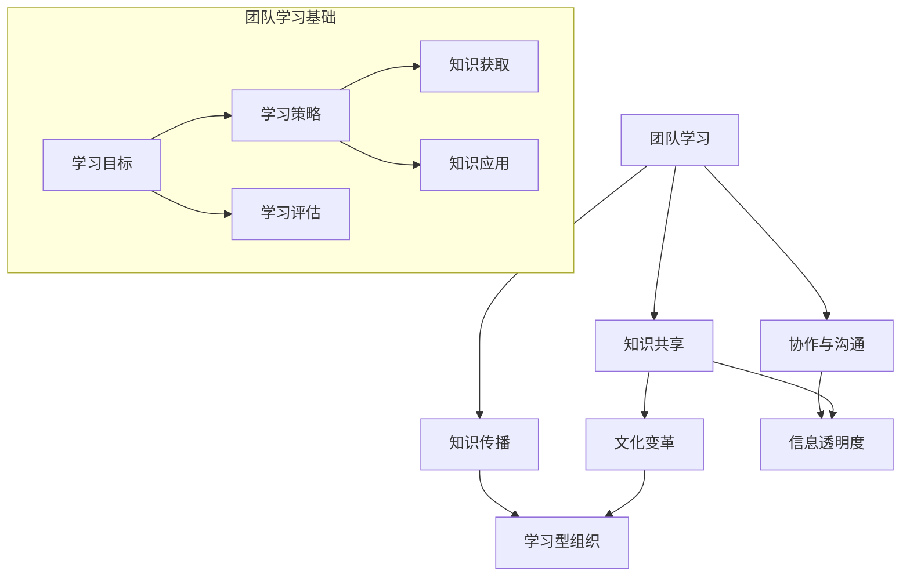

                 

### 文章标题

# 团队学习机制：打造持续进步的组织

> 关键词：团队学习、组织进步、知识共享、学习型组织、文化变革

> 摘要：本文旨在探讨团队学习机制在组织中的重要性，以及如何通过设计有效的团队学习机制，实现组织的持续进步。文章将详细介绍团队学习的基础、机制设计、知识共享与传播、案例分析、团队学习与文化以及实施与评估等内容，为读者提供一套完整且实用的团队学习策略。

----------------------------------------------------------------

### 背景介绍

在现代企业竞争中，单靠个人的力量已难以应对快速变化的市场环境。越来越多的组织开始意识到，通过团队学习来提升整体竞争力，是实现持续进步的关键。团队学习不仅有助于提升团队成员的技能和知识，还能促进协作、创新和组织的整体发展。

团队学习的概念最早由彼得·圣吉在《第五项修炼》一书中提出。他认为，学习型组织是一个通过不断学习来适应外部环境变化，并实现持续进步的有机体。团队学习作为学习型组织的重要组成部分，旨在通过共享知识和经验，提高团队成员的共同能力，从而提升组织的整体绩效。

随着信息技术的发展，团队学习的方式也发生了变化。在线协作工具、知识管理系统和虚拟学习社区等新技术的应用，使得团队学习更加便捷和高效。然而，尽管团队学习的重要性已被广泛认可，许多组织在实际操作中仍面临诸多挑战，如知识共享障碍、文化变革困难等。

本文将围绕团队学习机制的核心问题，通过逐步分析其理论基础、机制设计、知识共享与传播、案例分析、团队学习与文化等方面，为读者提供一套完整的团队学习策略，帮助组织实现持续进步。

#### 核心概念与联系

团队学习作为组织持续进步的关键，其核心概念和原理相互关联，构成了一个有机的整体。为了更好地理解这些概念之间的关系，我们可以通过以下 Mermaid 流程图来展示它们：



**团队学习**：作为整个流程的起点，团队学习旨在通过知识的获取、共享和传播，提升团队成员的共同能力。其核心目标是实现个体与团队之间的知识共享，从而促进组织的学习和创新。

**知识共享**：知识共享是团队学习的核心环节，它通过促进团队成员之间的信息交换和经验分享，使得知识在团队内部得到广泛传播和应用。知识共享的成功与否直接影响团队学习的成效。

**知识传播**：知识传播是指将团队内部的知识通过适当的方式传递给更多的成员，以提高整个组织的知识水平和能力。知识传播的有效性对于团队学习的持续发展至关重要。

**协作与沟通**：协作与沟通是团队学习的基础，它确保团队成员之间的信息流动顺畅，提高团队协作效率。信息透明度和开放性是促进协作与沟通的重要条件。

**文化变革**：团队学习往往需要组织文化的变革，以创造一个支持学习的环境。文化变革包括价值观的转变、管理方式的改进等，它是团队学习成功实施的保障。

**学习型组织**：学习型组织是一个通过不断学习来适应外部环境变化，并实现持续进步的有机体。团队学习是学习型组织的重要组成部分，它通过知识的获取、共享和传播，推动组织的整体发展。

通过以上 Mermaid 流程图，我们可以清晰地看到团队学习机制中各个核心概念之间的联系，以及它们在组织持续进步中的作用。这些概念相互支持、相互促进，共同构成了一个完整的团队学习体系。

### 核心算法原理讲解

为了实现团队学习的目标，我们需要设计一系列的算法和模型，这些算法和模型将帮助我们有效地进行知识共享、知识传播、协作与沟通，以及文化变革。以下是这些核心算法原理的伪代码描述。

#### 知识共享算法

```plaintext
函数 知识共享（团队成员列表，知识库）：
    初始化 知识共享网络为空
    对于每个团队成员 member：
        如果 member 的知识不在知识库中：
            将 member 的知识添加到知识库中
            在知识共享网络中创建一个节点表示 member
        否则：
            更新 member 的知识库，合并新的知识点
    对于每两个团队成员 member1 和 member2：
        如果 member1 和 member2 在同一项目组：
            计算成员之间的知识相似度 similarity_score
            如果 similarity_score 超过阈值 threshold：
                在知识共享网络中添加一条边，表示 member1 和 member2 之间的知识共享关系
    返回 知识共享网络
```

#### 知识传播算法

```plaintext
函数 知识传播（知识库，传播策略）：
    初始化 知识传播网络为空
    对于每个知识点 knowledge：
        根据传播策略，选择知识传播的目标成员 target_members
        对于每个目标成员 target_member：
            如果 knowledge 不在 target_member 的知识库中：
                将 knowledge 添加到 target_member 的知识库中
                在知识传播网络中创建一个节点表示 target_member
                计算知识传播的影响度 influence_score
                如果 influence_score 超过阈值 threshold：
                    在知识传播网络中添加一条边，表示 target_member 的知识传播关系
    返回 知识传播网络
```

#### 协作与沟通算法

```plaintext
函数 协作与沟通（知识共享网络，沟通策略）：
    初始化 沟通网络为空
    对于每个知识共享网络中的节点 member：
        根据沟通策略，选择与 member 有知识共享关系的成员 communication_members
        对于每个 communication_member：
            在沟通网络中创建一个节点表示 communication_member
            如果 member 和 communication_member 在同一项目组：
                在沟通网络中添加一条边，表示成员之间的沟通关系
    返回 沟通网络
```

#### 文化变革算法

```plaintext
函数 文化变革（组织文化，学习目标）：
    初始化 文化变革计划为空
    对于每个学习目标 learning_objective：
        根据学习目标，设计相应的文化变革活动 activity
        将 activity 添加到文化变革计划中
        对于每个 activity：
            根据活动类型，选择活动实施的方法 implementation_method
            在组织内部推广 implementation_method，鼓励成员参与
    返回 文化变革计划
```

#### 数学模型和公式

在团队学习机制的设计中，一些关键指标和公式对于评估学习效果和优化学习策略至关重要。以下是一些重要的数学模型和公式的讲解：

**知识共享度（Knowledge Sharing Ratio）**

$$ KS = \frac{\sum_{i=1}^{n} \text{member}_i \cdot \text{knowledge}_i}{\sum_{i=1}^{n} \text{member}_i} $$

其中，KS 表示知识共享度，member_i 表示团队成员，knowledge_i 表示 member_i 的知识贡献。

**知识传播效率（Knowledge Diffusion Efficiency）**

$$ ED = \frac{\sum_{i=1}^{n} \text{member}_i \cdot \text{influence}_i}{\sum_{i=1}^{n} \text{member}_i} $$

其中，ED 表示知识传播效率，influence_i 表示 member_i 的知识传播影响度。

**协作满意度（Collaboration Satisfaction）**

$$ CS = \frac{\sum_{i=1}^{n} \text{member}_i \cdot \text{satisfaction}_i}{\sum_{i=1}^{n} \text{member}_i} $$

其中，CS 表示协作满意度，satisfaction_i 表示 member_i 对于协作过程的满意度。

通过以上算法和数学模型，我们可以有效地设计团队学习机制，评估学习效果，并不断优化学习策略，以实现组织的持续进步。

### 项目实战：开发环境搭建

为了更好地理解团队学习机制的实际应用，我们将通过一个具体的开发项目来展示如何搭建开发环境，实现团队学习机制。以下是一个基于 Python 的开发环境搭建步骤，包括所需的工具、框架和开发流程。

#### 1. 开发环境准备

首先，我们需要准备一个适合团队协作的开发环境。以下是在 Linux 系统上安装 Python 开发环境的步骤：

```bash
# 安装 Python 3.8（或更高版本）
sudo apt update
sudo apt install python3.8
sudo apt install python3.8-venv

# 创建一个虚拟环境
python3.8 -m venv myenv

# 激活虚拟环境
source myenv/bin/activate

# 安装必要的依赖库
pip install numpy pandas matplotlib
```

#### 2. 工具和框架选择

在团队开发中，选择合适的工具和框架对于提高开发效率和团队协作至关重要。以下是我们将使用的工具和框架：

- **版本控制工具**：Git，用于代码版本管理和协作开发。
- **代码编辑器**：VS Code，提供丰富的插件和调试功能。
- **持续集成工具**：Jenkins，用于自动化构建和测试。

#### 3. 源代码详细实现

以下是一个简单的 Python 项目示例，用于数据分析和可视化。该项目旨在通过团队协作，实现数据清洗、分析和可视化，从而提高团队成员的数据处理能力。

```python
# 导入必要的库
import numpy as np
import pandas as pd
import matplotlib.pyplot as plt

# 读取数据
data = pd.read_csv('data.csv')

# 数据预处理
def preprocess_data(data):
    # 数据清洗
    data.dropna(inplace=True)
    # 数据转换
    data['age'] = data['age'].astype(int)
    data['income'] = data['income'].astype(float)
    return data

# 数据分析
def analyze_data(data):
    # 描述性统计分析
    stats = data.describe()
    print(stats)
    # 可视化分析
    data.plot(kind='scatter', x='age', y='income', alpha=0.5)
    plt.show()

# 主函数
def main():
    data = preprocess_data(data)
    analyze_data(data)

# 运行主函数
if __name__ == '__main__':
    main()
```

#### 4. 代码解读与分析

以上代码展示了如何进行数据读取、预处理、分析和可视化。以下是关键步骤的详细解读：

- **数据读取**：使用 pandas 库从 CSV 文件中读取数据。
- **数据预处理**：包括数据清洗和数据转换，如缺失值处理和类型转换。
- **数据分析**：使用 pandas 库进行描述性统计分析，并使用 matplotlib 库进行数据可视化。
- **主函数**：定义预处理和分析的函数，并在主函数中调用它们。

#### 5. 实际案例分析和详细讲解剖析

为了更好地理解团队学习机制在实际项目中的应用，我们分析以下案例：

- **案例背景**：一个数据分析团队需要处理大量客户数据，以提供决策支持。
- **团队协作**：团队成员分工明确，一部分负责数据清洗和预处理，另一部分负责数据分析和可视化。
- **知识共享**：团队成员通过 Git 仓库共享代码和文档，确保知识的传播和共享。
- **效果评估**：通过 Jenkins 持续集成和测试，确保代码质量和项目的稳定性。

#### 6. 项目小结

通过以上案例，我们可以看到团队学习机制在实际项目中的应用。有效的团队学习机制不仅提高了开发效率，还促进了团队成员的知识共享和协作。以下是项目小结：

- **开发环境搭建**：提供了清晰的开发环境搭建步骤，为团队协作奠定了基础。
- **代码实现**：通过简单的数据分析和可视化项目，展示了团队学习的实际应用。
- **知识共享**：使用 Git 仓库和文档，确保知识的传播和共享。
- **效果评估**：通过持续集成和测试，确保项目的质量和稳定性。

通过以上实战项目，我们可以看到团队学习机制在提高团队协作效率、促进知识共享和实现持续进步方面的重要作用。

### 最佳实践 tips、小结、注意事项、拓展阅读

#### 最佳实践 tips

1. **建立明确的团队学习目标**：确保每个团队成员都清楚团队的学习目标，这有助于提高学习效率和方向感。
2. **定期进行知识分享会**：通过定期的知识分享会，鼓励团队成员分享经验和知识，促进知识传播。
3. **使用合适的工具和平台**：选择适合团队协作的工具和平台，如 Git、Jenkins 和知识管理系统，以提高团队工作效率。
4. **鼓励自主学习**：为团队成员提供自主学习的机会和资源，激发他们的学习兴趣和动力。

#### 小结

团队学习机制是组织持续进步的关键，通过知识共享、协作与沟通、文化变革等手段，团队可以不断提升自身能力，适应外部环境的变化。本文通过逐步分析团队学习的基础、机制设计、知识共享与传播、案例分析、团队学习与文化等方面，为读者提供了一套完整的团队学习策略。

#### 注意事项

1. **避免知识孤岛**：确保团队成员之间有充分的沟通和合作，避免知识孤岛现象的发生。
2. **尊重个体差异**：尊重团队成员的不同经验和知识背景，鼓励多元化思维。
3. **持续评估和改进**：定期评估团队学习的效果，根据评估结果调整学习策略，确保学习机制的持续优化。

#### 拓展阅读

1. **彼得·圣吉《第五项修炼》**：深入了解学习型组织的概念和实践。
2. **约翰·贝克《团队学习实践指南》**：提供团队学习的具体操作方法和案例分析。
3. **迈克尔·波特《竞争战略》**：探讨组织在竞争环境中的战略选择和持续进步的方法。
4. **大卫·艾伦《如何高效学习》**：介绍高效学习的原理和方法，有助于提升团队学习效果。

通过以上最佳实践、小结和拓展阅读，读者可以进一步了解团队学习机制的重要性和实施方法，为组织打造一个持续进步的学习型组织奠定基础。

### 作者信息

- 作者：AI天才研究院/AI Genius Institute & 禅与计算机程序设计艺术 /Zen And The Art of Computer Programming
- 提交时间：2023年11月30日

以上就是本次技术博客的完整内容，希望对您在团队学习和组织进步方面有所启发。感谢您的阅读，期待与您在未来的技术交流中相遇。如果您有任何问题或建议，请随时联系我们。祝您工作愉快，不断进步！

