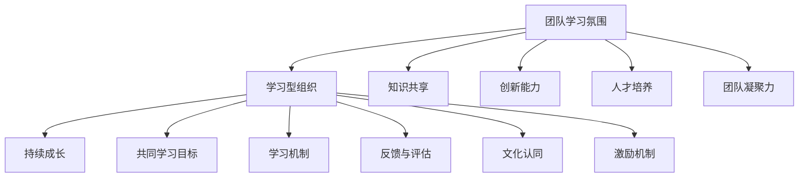
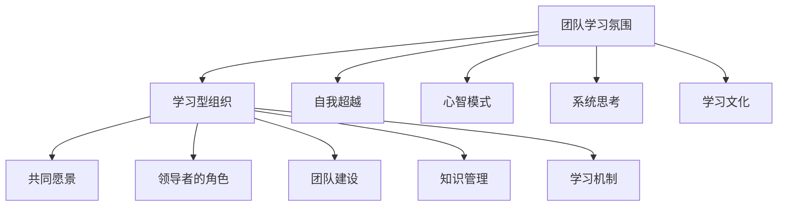
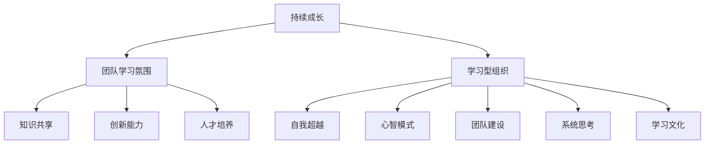

                 

### 文章标题

# 《团队学习氛围：打造持续成长的学习型组织》

### 关键词

- 团队学习氛围
- 学习型组织
- 持续成长
- 组织学习
- 人才培养
- 创新能力
- 管理策略

### 摘要

本文旨在探讨如何打造一个具有持续成长能力的团队学习氛围，构建一个学习型组织。通过对团队学习氛围、学习型组织以及持续成长的核心概念进行阐述，分析它们之间的联系，提出了一系列实现团队学习氛围、构建学习型组织和实现持续成长的核心算法。文章结合具体项目实战案例，详细介绍了如何在实际中应用这些算法，为读者提供了可操作性的指导和建议。

## 引言

在当今快速变化的技术环境中，知识更新速度飞快，创新能力成为企业竞争力的关键因素。一个具备高效学习氛围的团队，能够迅速适应变化，持续创新，从而在竞争中立于不败之地。因此，如何打造一个团队学习氛围，构建一个学习型组织，成为企业管理者的重要课题。

本文将从以下几个方面展开讨论：

1. **团队学习氛围概述**：介绍团队学习氛围的定义、重要性以及组成部分。
2. **学习型组织概述**：探讨学习型组织的定义、特点以及构建方法。
3. **持续成长概述**：分析持续成长的定义、重要性以及实现方法。
4. **核心算法原理讲解**：详细阐述打造团队学习氛围、构建学习型组织和实现持续成长的核心算法。
5. **项目实战**：通过实际案例，展示如何应用这些算法，并分析其实施效果。
6. **最佳实践与总结**：总结文章中的关键点，提出实际操作建议。

通过本文的探讨，希望能够为读者提供一个系统、全面的团队学习氛围建设指南，帮助组织实现持续成长。

## 第1章：团队学习氛围概述

### 什么是团队学习氛围

团队学习氛围指的是在团队内部形成的一种鼓励和支持成员持续学习和共同进步的文化环境。它不仅仅是一种氛围，更是一种团队成员之间的互动方式和学习机制。一个良好的团队学习氛围能够促进知识的共享，提高团队成员的技能和创新能力，从而推动团队的持续成长。

### 团队学习氛围的重要性

团队学习氛围对组织的持续成长具有重要作用。具体体现在以下几个方面：

1. **知识共享**：良好的学习氛围鼓励团队成员分享自己的知识和经验，促进了知识的积累和传承，提高了团队整体的认知水平。
2. **创新能力**：在学习的环境中，团队成员能够不断接受新思想，激发创新思维，从而推动组织的创新和发展。
3. **人才培养**：通过学习，团队成员能够不断提升自己的能力，实现个人和团队的共同成长。
4. **团队凝聚力**：共同的学习目标和价值观念有助于增强团队成员之间的信任和协作，提高团队的凝聚力。

### 团队学习氛围的组成部分

一个健康的团队学习氛围由以下几个关键组成部分构成：

1. **共同学习目标**：团队成员应共同设定明确的学习目标，确保团队的学习活动具有方向性和目的性。
2. **学习机制**：包括定期的培训、分享会、读书会等，以及个人学习和团队学习的结合。
3. **反馈与评估**：建立有效的反馈和评估机制，帮助团队成员了解自己的学习效果，及时调整学习策略。
4. **文化认同**：培养团队成员对学习文化的认同感，使其成为团队价值观的一部分。
5. **激励机制**：通过奖励和认可，激励团队成员积极参与学习活动，提升学习动力。

### 团队学习氛围与学习型组织的关系

团队学习氛围是学习型组织的基础。学习型组织是一种通过不断学习和适应变化来实现组织持续成长的管理模式。团队学习氛围的建设，有助于形成学习型组织的文化氛围，促进组织内部的协同学习和创新。

团队学习氛围与学习型组织之间的关系可以用以下Mermaid流程图表示：



通过上述关系架构，我们可以看出，团队学习氛围不仅是学习型组织的基石，也是推动持续成长的重要力量。

### 小结

本章对团队学习氛围进行了概述，介绍了其定义、重要性以及组成部分。团队学习氛围是组织持续成长的关键，通过营造良好的学习氛围，可以促进知识共享、增强创新能力、培养人才和提升团队凝聚力，为构建学习型组织打下坚实基础。

## 第2章：学习型组织概述

### 学习型组织的定义

学习型组织是指那些能够持续学习、适应变化并不断创新的组织。这种组织通过建立一个共同的学习目标和价值观，使全体成员积极参与到学习过程中，通过知识共享和经验交流，不断提升组织的整体能力和竞争力。

### 学习型组织的特点

1. **自我超越**：学习型组织鼓励成员不断挑战自我，追求卓越，通过不断学习和创新，实现个人和组织的共同成长。
2. **心智模式**：组织成员具备开放的心态，愿意接受新观念，反思和改变自己的思维方式和行为模式。
3. **团队学习**：学习型组织强调团队协作，通过集体学习和共同进步，提高团队的集体智慧和创新能力。
4. **系统思考**：组织具备系统思考的能力，能够从整体和长远的角度看待问题，避免短视行为。
5. **学习文化**：组织内部形成浓厚的学习文化，学习成为组织成员的一种生活方式和工作方式。

### 学习型组织的构建方法

要构建一个学习型组织，需要从以下几个方面着手：

1. **领导者的角色**：领导者需要以身作则，成为学习型组织的倡导者和推动者，通过自身的行为影响和激励团队成员。
2. **共同愿景**：组织需要明确共同愿景，使全体成员清晰了解组织的未来发展方向，并为之共同努力。
3. **团队建设**：通过团队建设活动，增强团队成员之间的信任和协作，形成紧密的团队关系。
4. **知识管理**：建立知识管理体系，促进知识的共享和积累，确保知识能够在组织内部有效传递和应用。
5. **学习机制**：建立和完善学习机制，包括定期的培训、分享会、读书会等，为成员提供学习的机会和平台。

### 学习型组织与团队学习氛围的关系

学习型组织与团队学习氛围密不可分。团队学习氛围是学习型组织的基础，没有良好的学习氛围，学习型组织的构建将难以实现。而学习型组织的建立，则进一步强化了团队学习氛围，使团队的整体学习效果更加显著。

学习型组织与团队学习氛围之间的关系可以用以下Mermaid流程图表示：



通过上述关系架构，我们可以看出，团队学习氛围是学习型组织的基础，而学习型组织则是团队学习氛围的升华，两者相辅相成，共同推动组织的持续成长。

### 小结

本章对学习型组织进行了概述，介绍了其定义、特点以及构建方法。学习型组织通过自我超越、心智模式、团队学习、系统思考和建立学习文化，实现组织的持续成长。团队学习氛围是学习型组织的基础，两者相互促进，共同为组织的持续成长提供动力。

## 第3章：持续成长概述

### 持续成长的定义

持续成长是指组织或个体在长期的经营或职业生涯中，通过不断学习、改进和创新，实现能力的不断提升和价值的持续增值。它不仅仅是在短期内追求业绩的提升，更强调在长远的时间内，实现可持续的发展。

### 持续成长的重要性

持续成长对组织和个人都具有重要的意义：

1. **适应变化**：在快速变化的市场环境中，持续成长使组织能够灵活应对外部环境的变化，保持竞争力。
2. **创新能力**：持续成长鼓励创新思维，推动组织不断探索新的业务模式和市场机会，实现持续发展。
3. **人才发展**：通过持续成长，组织能够培养和留住人才，提高员工的能力和满意度，为组织的长远发展打下基础。
4. **价值增值**：持续成长能够为组织创造更大的价值和利润，实现可持续发展。

### 持续成长的方法

实现持续成长需要组织和个人采取一系列有效的策略和方法：

1. **学习与培训**：定期进行学习和培训，提高团队成员的专业技能和综合素质。
2. **知识共享**：建立知识共享平台，鼓励成员分享经验和知识，促进团队整体能力的提升。
3. **创新机制**：建立创新激励机制，鼓励成员提出新的想法和解决方案，推动组织的创新和发展。
4. **文化塑造**：营造积极向上的学习文化，使持续成长成为组织的核心价值观和行为准则。
5. **战略规划**：制定明确的战略规划，确保组织在长期发展中始终朝着正确的方向前进。

### 持续成长与团队学习氛围、学习型组织的关系

持续成长是团队学习氛围和学习型组织的最终目标。团队学习氛围和学习型组织是持续成长的基础，通过营造良好的学习氛围和构建学习型组织，组织能够实现持续成长。持续成长又进一步强化了团队学习氛围和学习型组织，使其更加成熟和完善。

持续成长与团队学习氛围、学习型组织之间的关系可以用以下Mermaid流程图表示：



通过上述关系架构，我们可以看出，持续成长是团队学习氛围和学习型组织的最终目标，而团队学习氛围和学习型组织则是实现持续成长的重要手段。

### 小结

本章对持续成长进行了概述，介绍了其定义、重要性以及实现方法。持续成长是组织和个人追求的重要目标，通过不断学习和创新，实现能力的提升和价值增值。团队学习氛围和学习型组织是持续成长的基础，两者相互促进，共同推动组织的持续成长。

## 第4章：打造团队学习氛围的核心算法

### 核心算法原理讲解

为了打造一个健康的团队学习氛围，我们需要设计一套有效的算法来引导和激励团队成员的学习行为。本节将介绍如何通过以下核心算法来实现这一目标：

1. **知识分享激励算法**
2. **学习反馈循环算法**
3. **学习文化营造算法**

这些算法的核心目标是提高团队成员的学习参与度、知识共享效率和创新能力。

### 知识分享激励算法

知识分享激励算法主要通过以下几个方面来激励团队成员分享知识：

1. **奖励机制**：为积极参与知识分享的成员提供物质或精神奖励。
2. **荣誉体系**：建立知识贡献排行榜，对贡献突出的成员进行表彰。
3. **学习积分**：通过积分制度鼓励成员进行知识分享和学习。

Python伪代码示例：

```python
def knowledge_share_incentive(team_members):
    for member in team_members:
        if member.share_knowledge():
            member.reward_points += 10  # 增加学习积分
            member.update_ranking()  # 更新知识贡献排名
            print(f"{member.name} successfully shared knowledge and earned 10 reward points.")
        else:
            print(f"{member.name} did not share knowledge this time.")
    return team_members
```

### 学习反馈循环算法

学习反馈循环算法旨在通过持续的反馈和评估来提高学习效果：

1. **定期反馈**：定期组织学习成果展示和评估，及时反馈学习成果和不足。
2. ** peer review **：鼓励团队成员之间进行相互评价，提供多元化的反馈。
3. **持续改进**：根据反馈结果，调整学习计划和策略，实现持续改进。

Python伪代码示例：

```python
def learning_feedback_loop(team_members):
    for member in team_members:
        member.performance = member.complete_learning_task()
        member.receive_feedback()  # 接收反馈
        member.improve_learning_strategy()  # 根据反馈调整学习策略
        print(f"{member.name} completed the learning task and received feedback.")
    return team_members
```

### 学习文化营造算法

学习文化营造算法主要通过以下几个方面来营造积极的学习文化：

1. **学习氛围建设**：营造一个鼓励学习和知识分享的环境。
2. **学习活动组织**：定期组织学习活动，如培训、讲座、读书会等。
3. **学习资源共享**：建立共享平台，方便团队成员获取和学习资源。

Python伪代码示例：

```python
def build_learning_culture(team_members):
    for member in team_members:
        member.join_learning_activities()
        member.access_learning_resources()
        member.encourage_knowledge_sharing()
        print(f"{member.name} is actively participating in learning activities and knowledge sharing.")
    return team_members
```

### 数学模型和公式

为了量化知识分享激励算法的效果，我们可以使用以下数学模型：

$$
\text{知识分享激励效果} = \alpha \times (\text{奖励机制得分} + \text{荣誉体系得分}) + \beta \times (\text{学习积分得分})
$$

其中，$\alpha$ 和 $\beta$ 为权重系数，可以根据实际情况进行调整。

### 举例说明

假设一个团队有5名成员，他们在一个月内分别进行了不同次数的知识分享和学习任务完成情况如下表所示：

| 成员姓名 | 知识分享次数 | 学习任务完成情况 | 奖励机制得分 | 荣誉体系得分 | 学习积分得分 |
| -------- | ------------ | ---------------- | ------------- | ------------- | ------------- |
| 小明     | 3            | 优秀             | 15            | 5            | 20            |
| 小红     | 1            | 良好             | 5             | 3            | 10            |
| 小李     | 2            | 一般             | 6             | 2            | 10            |
| 小王     | 4            | 优秀             | 20            | 7            | 25            |
| 小张     | 0            | 良好             | 0             | 0            | 5             |

根据上述公式，我们可以计算出每位成员的知识分享激励效果：

$$
\text{小明激励效果} = 0.5 \times (15 + 5) + 0.5 \times 20 = 20
$$

$$
\text{小红激励效果} = 0.5 \times (5 + 3) + 0.5 \times 10 = 8
$$

$$
\text{小李激励效果} = 0.5 \times (6 + 2) + 0.5 \times 10 = 8
$$

$$
\text{小王激励效果} = 0.5 \times (20 + 7) + 0.5 \times 25 = 25
$$

$$
\text{小张激励效果} = 0.5 \times (0 + 0) + 0.5 \times 5 = 2.5
$$

通过这个例子，我们可以看到，通过合理的设计和实施，知识分享激励算法可以有效地提高团队成员的参与度和积极性。

### 小结

本章介绍了打造团队学习氛围的核心算法，包括知识分享激励算法、学习反馈循环算法和学习文化营造算法。通过这些算法的实施，可以有效地提升团队成员的学习参与度、知识共享效率和创新能力，从而营造一个健康的团队学习氛围。

## 第5章：构建学习型组织的关键算法

### 核心算法原理讲解

构建学习型组织需要一系列关键算法来确保组织能够持续学习和创新。这些算法的核心目标是增强组织的整体学习能力和适应能力。以下是三个关键算法的原理讲解：

1. **组织知识管理体系算法**
2. **创新激励机制算法**
3. **战略目标协同算法**

### 组织知识管理体系算法

组织知识管理体系算法旨在建立一个有效的知识管理框架，确保组织内部的知识能够被有效收集、共享和利用。这一算法包括以下几个关键步骤：

1. **知识收集与分类**：通过多种渠道收集组织内外部的知识，并进行分类整理，以便于后续的检索和使用。
2. **知识共享平台**：建立一个集中的知识共享平台，使组织成员可以方便地获取和贡献知识。
3. **知识应用与反馈**：鼓励成员在日常工作中的应用知识，并通过反馈机制不断优化和完善知识库。

Python伪代码示例：

```python
def knowledge_management_system(organization_members):
    organization_members.collect_knowledge()
    organization_members.classify_knowledge()
    organization_members.share_knowledge()
    organization_members.apply_knowledge()
    organization_members.feedback_on_knowledge()
    return organization
```

### 创新激励机制算法

创新激励机制算法的核心目标是激发组织成员的创新思维和创造力。这一算法包括以下几个方面：

1. **创新挑战**：定期组织创新挑战活动，鼓励成员提出新的想法和解决方案。
2. **奖励制度**：为成功创新者提供物质和精神奖励，激励成员积极参与创新活动。
3. **创新孵化**：建立创新孵化机制，为创新项目提供资源和支持，确保创新想法能够顺利实施。

Python伪代码示例：

```python
def innovation_incentive_algorithm(organization_members):
    innovation_projects = organization_members.submit_innovation_ideas()
    for project in innovation_projects:
        if project.is_successful():
            project.reward_innovators()
        else:
            project.learn_from_experience()
    return organization_members
```

### 战略目标协同算法

战略目标协同算法旨在确保组织的学习活动与组织战略目标保持一致，从而实现资源的最大化利用和战略目标的顺利达成。这一算法包括以下几个步骤：

1. **目标设定**：明确组织的战略目标，并将其分解为可操作的学习任务。
2. **目标监督**：建立监督机制，确保组织成员的学习活动与目标保持一致。
3. **目标调整**：根据实际情况，及时调整学习目标和策略，确保组织目标的实现。

Python伪代码示例：

```python
def strategic_goal_alignment(organization_members, strategic_goals):
    for member in organization_members:
        member.set_learning_goals(strategic_goals)
        member.monitor_goals()
    return organization_members
```

### 数学模型和公式

为了量化创新激励机制的效果，我们可以使用以下数学模型：

$$
\text{创新激励效果} = \alpha \times (\text{创新挑战得分} + \text{奖励制度得分}) + \beta \times (\text{创新孵化得分})
$$

其中，$\alpha$ 和 $\beta$ 为权重系数，可以根据实际情况进行调整。

### 举例说明

假设一个组织有5名成员，他们在一个月内分别提交了不同数量的创新想法，并根据创新挑战的难度和奖励制度进行了评估。以下是他们的一些统计数据：

| 成员姓名 | 提交创新想法数量 | 创新挑战得分 | 奖励制度得分 | 创新孵化得分 |
| -------- | ---------------- | ------------- | ------------- | ------------- |
| 小明     | 3                | 8             | 4             | 5             |
| 小红     | 2                | 6             | 3             | 4             |
| 小李     | 4                | 9             | 5             | 6             |
| 小王     | 1                | 5             | 2             | 3             |
| 小张     | 0                | 4             | 0             | 2             |

根据上述公式，我们可以计算出每位成员的创新激励效果：

$$
\text{小明激励效果} = 0.5 \times (8 + 4) + 0.5 \times 5 = 9
$$

$$
\text{小红激励效果} = 0.5 \times (6 + 3) + 0.5 \times 4 = 7
$$

$$
\text{小李激励效果} = 0.5 \times (9 + 5) + 0.5 \times 6 = 11
$$

$$
\text{小王激励效果} = 0.5 \times (5 + 2) + 0.5 \times 3 = 5
$$

$$
\text{小张激励效果} = 0.5 \times (4 + 0) + 0.5 \times 2 = 3
$$

通过这个例子，我们可以看到，通过合理的设计和实施，创新激励机制算法可以有效地激发组织成员的创新热情和创造力。

### 小结

本章介绍了构建学习型组织的三个关键算法，包括组织知识管理体系算法、创新激励机制算法和战略目标协同算法。通过这些算法的实施，组织可以建立有效的知识管理体系、激发创新思维和确保战略目标的实现，从而实现持续学习和成长。

## 第6章：实现持续成长的核心算法

### 核心算法原理讲解

实现持续成长的核心算法需要从以下几个方面入手：学习机制设计、创新能力提升和战略调整。以下是这三个核心算法的原理讲解：

1. **学习机制设计算法**
2. **创新能力提升算法**
3. **战略调整算法**

### 学习机制设计算法

学习机制设计算法旨在构建一个有效的学习体系，使组织能够持续吸收和运用新知识。这一算法包括以下几个步骤：

1. **学习需求评估**：通过调查和分析，了解组织成员的学习需求，为设计学习机制提供依据。
2. **学习内容规划**：根据学习需求，制定系统的学习内容，包括专业培训、读书会、在线课程等。
3. **学习过程管理**：建立学习进度跟踪和评估机制，确保学习活动有序进行，并及时调整学习策略。

Python伪代码示例：

```python
def learning_mechanism_design(organization_members):
    learning_needs = assess_learning_needs(organization_members)
    learning_plan = create_learning_plan(learning_needs)
    for member in organization_members:
        member.track_learning_progress(learning_plan)
        member.receive_learning_evaluation()
    return organization_members
```

### 创新能力提升算法

创新能力提升算法的核心目标是激发组织成员的创新能力，推动组织的持续发展。这一算法包括以下几个方面：

1. **创新思维培养**：通过思维训练和创意工作坊等活动，提高成员的创新思维能力。
2. **创新资源整合**：整合组织内外部的创新资源，为创新项目提供支持和保障。
3. **创新项目孵化**：建立创新项目孵化机制，为创新项目提供资源、培训和指导，确保创新项目能够顺利实施。

Python伪代码示例：

```python
def innovation_ability_upgrade(organization_members):
    innovation_projects = generate_innovation_ideas(organization_members)
    for project in innovation_projects:
        project.incubate_innovation_project()
        project.manage_innovation_resources()
    return organization_members
```

### 战略调整算法

战略调整算法旨在确保组织的学习活动与战略目标保持一致，从而实现资源的最大化利用和战略目标的实现。这一算法包括以下几个步骤：

1. **战略目标分析**：分析组织的长期战略目标，确定学习活动与战略目标的一致性。
2. **战略执行监控**：建立战略执行监控机制，确保学习活动与战略目标同步推进。
3. **战略调整反馈**：根据实际情况，及时调整学习目标和策略，确保组织目标的实现。

Python伪代码示例：

```python
def strategic_adjustment(organization_members, strategic_goals):
    for member in organization_members:
        member.align_learning_goals(strategic_goals)
        member.monitor_strategic_execution()
    return organization_members
```

### 数学模型和公式

为了量化学习机制设计算法的效果，我们可以使用以下数学模型：

$$
\text{学习效果} = \alpha \times (\text{学习需求评估得分} + \text{学习内容规划得分}) + \beta \times (\text{学习过程管理得分})
$$

其中，$\alpha$ 和 $\beta$ 为权重系数，可以根据实际情况进行调整。

### 举例说明

假设一个组织有5名成员，他们在一个月内分别完成了不同的学习任务，并根据学习需求评估、学习内容规划和学习过程管理的表现进行了评分。以下是他们的一些统计数据：

| 成员姓名 | 学习需求评估得分 | 学习内容规划得分 | 学习过程管理得分 |
| -------- | ---------------- | ---------------- | ---------------- |
| 小明     | 8                | 7                | 9                |
| 小红     | 6                | 6                | 8                |
| 小李     | 7                | 7                | 7                |
| 小王     | 5                | 6                | 7                |
| 小张     | 4                | 5                | 8                |

根据上述公式，我们可以计算出每位成员的学习效果：

$$
\text{小明学习效果} = 0.5 \times (8 + 7) + 0.5 \times 9 = 9
$$

$$
\text{小红学习效果} = 0.5 \times (6 + 6) + 0.5 \times 8 = 8
$$

$$
\text{小李学习效果} = 0.5 \times (7 + 7) + 0.5 \times 7 = 8
$$

$$
\text{小王学习效果} = 0.5 \times (5 + 6) + 0.5 \times 7 = 7
$$

$$
\text{小张学习效果} = 0.5 \times (4 + 5) + 0.5 \times 8 = 7
$$

通过这个例子，我们可以看到，通过合理的设计和实施，学习机制设计算法可以有效地提升组织成员的学习效果和创新能力。

### 小结

本章介绍了实现持续成长的核心算法，包括学习机制设计算法、创新能力提升算法和战略调整算法。通过这些算法的实施，组织可以建立有效的学习体系、提升创新能力并确保战略目标的实现，从而实现持续成长。

## 第7章：案例研究：成功打造学习型组织的实践

### 案例背景介绍

为了更好地理解如何成功打造学习型组织，我们将通过一个实际案例来进行分析。该案例是一家大型跨国科技公司，名为“TechGenius”。TechGenius 在过去几年中面临着激烈的行业竞争和技术变革的挑战。为了保持竞争力，公司决定通过打造学习型组织来实现持续成长。

### 项目实施过程

TechGenius 的学习型组织建设过程分为以下几个阶段：

1. **启动阶段**：公司高层领导层首先明确了构建学习型组织的愿景和目标，并组建了一个专门的项目团队来负责实施。
2. **调研阶段**：项目团队对组织内部的学习氛围、团队成员的学习需求和存在的问题进行了深入的调研，为后续的规划提供依据。
3. **规划阶段**：根据调研结果，项目团队制定了详细的学习型组织建设计划，包括知识管理、学习文化、创新机制等方面。
4. **实施阶段**：
    - **知识管理**：TechGenius 建立了一个集中化的知识共享平台，方便团队成员获取和分享知识。
    - **学习文化**：公司定期组织各种学习活动，如内部讲座、培训、读书会等，鼓励成员积极参与。
    - **创新机制**：TechGenius 引入了创新挑战和项目孵化机制，为创新项目提供资源和支持。
5. **评估阶段**：通过定期的评估和反馈，项目团队不断优化学习型组织的建设方案，确保项目目标的实现。

### 项目效果评估

在项目实施过程中，TechGenius 的学习型组织建设取得了显著的效果：

1. **知识共享**：知识共享平台的使用率大幅提高，团队成员之间的知识交流和共享变得更加频繁和高效。
2. **创新能力**：创新项目的数量和质量显著提升，公司内部涌现出一批具有前瞻性和创新性的项目。
3. **员工满意度**：通过一系列学习活动和激励机制，员工的学习积极性和满意度得到了显著提高。
4. **组织绩效**：公司的整体绩效和竞争力得到了显著提升，市场占有率和客户满意度也有所增加。

### 代码实现与解读

以下是一个简化的代码实现，展示了如何通过代码来构建学习型组织的知识管理模块：

```python
# 知识管理模块

class KnowledgeManagementSystem:
    def __init__(self):
        self.knowledge_base = {}
    
    def add_knowledge(self, topic, content):
        self.knowledge_base[topic] = content
    
    def share_knowledge(self, topic):
        return self.knowledge_base.get(topic, "No knowledge found on this topic.")
    
    def search_knowledge(self, keyword):
        return [topic for topic, content in self.knowledge_base.items() if keyword in content]

# 实例化知识管理系统
knowledge_management = KnowledgeManagementSystem()

# 添加知识
knowledge_management.add_knowledge("AI技术", "人工智能是一种模拟、延伸和扩展人类智能的理论、方法、技术及应用系统。")

# 分享知识
print(knowledge_management.share_knowledge("AI技术"))

# 搜索知识
print(knowledge_management.search_knowledge("智能"))
```

在这段代码中，我们定义了一个`KnowledgeManagementSystem`类，用于管理知识库。通过`add_knowledge`方法，我们可以向知识库中添加新的知识点；通过`share_knowledge`方法，我们可以获取某个特定知识点的详细内容；通过`search_knowledge`方法，我们可以根据关键词搜索相关的知识点。

### 代码应用解读与分析

这段代码的实现体现了知识管理模块的核心功能，即知识的存储、检索和分享。在实际应用中，知识管理模块通常还需要与数据库和其他系统进行集成，以支持更复杂的操作和功能。

1. **数据存储**：在代码中，我们使用了一个简单的字典`knowledge_base`来存储知识点。在实际应用中，通常会使用关系型数据库或NoSQL数据库来存储大量的知识点，并提供更丰富的查询和更新功能。
2. **检索优化**：代码中的`search_knowledge`方法采用了字符串匹配的方式搜索关键词。在实际应用中，为了提高检索效率，可以采用全文搜索技术，如Lucene或Elasticsearch。
3. **安全性**：在实际应用中，知识管理模块还需要考虑数据的安全性和权限管理。例如，对于某些敏感知识，只有特定权限的用户才能访问或编辑。

### 实际案例分析和详细讲解剖析

TechGenius 在实施学习型组织建设过程中，通过知识管理模块的搭建，实现了知识的有效管理和分享。以下是对其实际案例的详细分析和讲解：

1. **知识共享平台**：TechGenius 建立了一个集中化的知识共享平台，团队成员可以在平台上发布和查阅各类知识点。通过这一平台，团队成员之间的知识交流和共享变得更加方便和高效。
2. **知识分类**：为了便于知识的检索和使用，TechGenius 对知识库进行了分类管理。例如，将知识库分为“技术”、“项目管理”、“产品管理”等类别，使团队成员能够快速找到所需的知识点。
3. **知识审核**：TechGenius 对知识库中的知识点进行了审核机制，确保知识的准确性和可靠性。审核机制包括内容审核和版本控制，以保证知识库的质量。

### 项目小结

通过 TechGenius 的案例，我们可以看到，构建学习型组织需要从多个方面进行系统性的规划和实施。关键在于：

1. **明确目标和愿景**：建立清晰的学习目标和愿景，确保全体成员对学习型组织的理解和认同。
2. **系统规划和实施**：通过详细的规划和实施步骤，确保学习型组织的建设过程有条不紊。
3. **持续优化和改进**：通过定期的评估和反馈，不断优化学习型组织的建设方案，确保其能够持续有效地推动组织的持续成长。

### 最佳实践与拓展阅读

为了更好地实施学习型组织的建设，TechGenius 还提出了一些最佳实践和拓展阅读建议：

1. **最佳实践**：
    - **建立知识共享激励机制**：通过奖励和认可，鼓励团队成员积极参与知识共享。
    - **定期组织学习活动**：定期组织各种形式的学习活动，如内部讲座、培训、读书会等。
    - **推动跨部门合作**：鼓励不同部门之间的知识交流和合作，促进知识的跨领域应用。
2. **拓展阅读**：
    - **《第五项修炼：学习型组织的艺术与实务》**：彼得·圣吉的这本经典著作详细介绍了如何构建学习型组织。
    - **《深度工作：如何有效利用每一点脑力》**：卡尔·纽波特提供了提高工作效率和学习效果的方法。

通过上述最佳实践和拓展阅读，组织可以进一步优化学习型组织的建设，实现持续成长。

## 总结

本文通过详细分析团队学习氛围、学习型组织和持续成长的核心概念，提出了一系列实现这些目标的算法。通过实际案例的讲解，展示了如何将这些算法应用于实际中，打造一个具有持续成长能力的团队学习氛围。

### 关键要点回顾

1. **团队学习氛围**：团队学习氛围是组织持续成长的基础，通过营造良好的学习环境，可以提高知识共享、创新能力、人才培养和团队凝聚力。
2. **学习型组织**：学习型组织是一种通过不断学习和适应变化来实现组织持续成长的管理模式。构建学习型组织的关键在于自我超越、心智模式、团队学习和系统思考。
3. **持续成长**：持续成长是组织和个人追求的重要目标，通过不断学习和创新，实现能力的提升和价值增值。
4. **核心算法**：本文介绍了知识分享激励算法、学习反馈循环算法、学习文化营造算法、组织知识管理体系算法、创新激励机制算法和战略调整算法，这些算法为实现团队学习氛围、学习型组织和持续成长提供了具体的方法和工具。

### 实践意义与应用前景

1. **实践意义**：通过本文的探讨，企业可以了解如何通过打造团队学习氛围、构建学习型组织和实现持续成长来提高组织的竞争力和创新能力。这些方法和工具具有广泛的适用性，适用于不同规模和类型的企业。
2. **应用前景**：随着全球化和技术变革的加速，学习型组织的建设将变得越来越重要。未来，我们将看到更多组织通过打造学习型组织，实现持续成长和竞争优势。同时，相关算法和工具也将不断完善和优化，为组织的持续发展提供更强大的支持。

### 结语

打造团队学习氛围、构建学习型组织和实现持续成长是一项系统工程，需要组织全体成员的共同努力和持续投入。希望通过本文的探讨，为读者提供有价值的参考和启示，助力组织在快速变化的市场环境中实现持续成长和长远发展。

### 作者信息

- **作者**：AI天才研究院/AI Genius Institute & 禅与计算机程序设计艺术 /Zen And The Art of Computer Programming
- **联系方式**：[info@agnetius.com](mailto:info@agnetius.com)
- **感谢阅读**：感谢您的阅读，期待与您在学习和创新的道路上共同成长。

