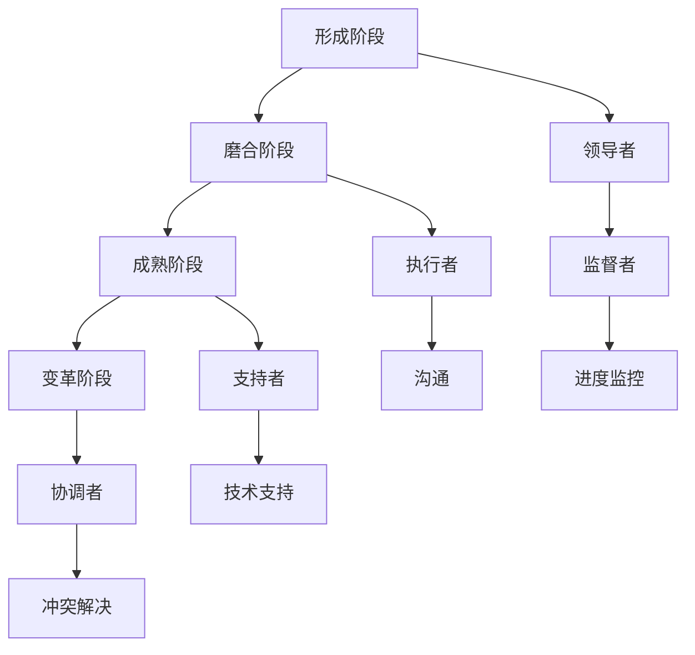

                 

### 第1章 引言

#### 1.1 团队建设的重要性

团队建设是现代企业成功的关键因素之一。在一个高度竞争的环境中，团队协作与凝聚力能够显著提升组织的效率和创新能力。以下是团队建设的重要性：

**对企业发展的影响：**

- **提高工作效率：** 团队成员之间的协作有助于提高工作效率，减少重复劳动和资源浪费。
- **增强创新能力：** 团队成员通过互相启发和知识共享，可以产生新的想法和创新解决方案。
- **降低员工流失率：** 强烈的团队凝聚力可以提升员工的满意度和忠诚度，从而降低员工流失率。

**对员工个体的影响：**

- **个人成长：** 团队建设提供了学习和成长的机会，帮助员工提高技能和增强自信心。
- **增强职业满意感：** 在一个充满合作和支持的环境中，员工更容易找到自己的价值和成就感。

**团队建设的重要性体现在以下几个方面：**

1. **提升沟通效果：** 通过团队建设活动，团队成员之间的沟通障碍得到有效解决，促进了信息的流通和协作。
2. **增强团队凝聚力：** 团队建设活动有助于建立团队成员之间的信任和互助，增强了团队的凝聚力。
3. **激发创新思维：** 团队建设活动激发了团队成员的创新思维，有助于企业应对复杂多变的市场环境。

**案例分析：**

以阿里巴巴为例，该公司通过定期的团队拓展训练和内部交流活动，有效地提升了团队凝聚力，并在激烈的市场竞争中保持了领先地位。

#### 1.2 团队建设的常见挑战

尽管团队建设的重要性显而易见，但在实际操作中，企业往往会面临以下挑战：

**团队内部沟通问题：**

- **沟通障碍：** 成员之间的文化差异、语言障碍、心理障碍等可能导致沟通不畅。
- **信息不对称：** 部分成员可能无法获取到完整的团队信息，导致决策滞后。

**团队成员差异与冲突：**

- **个性差异：** 团队成员的个性和工作风格不同，可能导致冲突和误解。
- **职责分工不清：** 职责分工不明确，可能导致成员之间的责任推卸和工作效率低下。

**解决方案：**

- **加强沟通：** 通过定期会议、工作汇报等方式，加强团队内部的沟通。
- **建立明确的职责分工：** 明确团队成员的职责和任务，避免责任推卸。
- **促进团队合作：** 通过团队建设活动，增强团队成员之间的信任和协作。

#### 1.3 团队建设的目标和原则

团队建设的目标是提升团队的协作效率和创新能力，具体包括：

- **提升团队工作效率：** 通过优化团队结构和流程，提高团队的整体工作效率。
- **增强团队凝聚力：** 通过团队建设活动，增强团队成员之间的信任和协作。
- **激发创新能力：** 通过知识共享和团队合作，激发创新思维，推动企业创新发展。

团队建设应遵循以下原则：

- **参与性原则：** 鼓励所有成员参与团队活动，确保每个人的意见和想法都能被充分听取。
- **沟通性原则：** 加强团队成员之间的沟通，确保信息畅通，避免误解和冲突。
- **发展性原则：** 注重团队成员的个人成长，提供培训和晋升机会，激发团队成员的潜力。

#### 1.4 团队建设的理论基础

团队建设的理论基础主要包括以下两个方面：

**团队生命周期理论：**

- **形成阶段：** 团队刚刚组建时，成员之间相互认识，共同目标尚未明确。
- **磨合阶段：** 成员开始合作，共同解决问题，逐渐形成团队默契。
- **成熟阶段：** 团队协作顺畅，工作效率达到最高点。
- **变革阶段：** 团队面临新的挑战或目标，需要调整和变革。

**团队角色理论：**

- **领导角色：** 指导团队的方向和目标，协调成员之间的工作。
- **执行角色：** 完成具体任务，确保团队目标的实现。
- **支持角色：** 提供技术和资源支持，帮助团队克服困难。

通过理解团队生命周期和角色理论，可以更好地设计和管理团队建设活动，提升团队的整体绩效。

---

## 1.4 团队建设的理论基础

团队建设不仅仅是组织一次活动那么简单，它需要基于科学的理论基础，以确保活动的有效性和持续性。以下将详细介绍团队建设的两个重要理论基础：团队生命周期理论和团队角色理论。

### 1.4.1 团队生命周期理论

团队生命周期理论是团队建设的重要理论基础之一，它描述了团队从成立到解散的过程，并指出了每个阶段的特点和挑战。团队生命周期通常分为以下几个阶段：

1. **形成阶段**：
   - **特点**：团队刚刚成立，成员相互之间还不太熟悉，对团队的期望和目标也较模糊。
   - **挑战**：成员之间需要建立信任，明确团队的共同目标。
   - **措施**：可以通过欢迎会、团队成员的自我介绍等方式帮助成员相互认识。

2. **磨合阶段**：
   - **特点**：成员开始协作，共同解决问题，团队开始形成一定的默契。
   - **挑战**：团队成员之间的沟通可能存在问题，任务分配可能不够明确。
   - **措施**：定期进行团队会议，鼓励团队成员分享经验，明确任务分工。

3. **成熟阶段**：
   - **特点**：团队协作顺畅，工作效率达到最高点，团队成员之间的信任和协作达到顶峰。
   - **挑战**：保持团队活力和创造力，防止出现惯性思维和停滞。
   - **措施**：通过培训、知识分享和团队建设活动，持续提升团队能力和凝聚力。

4. **变革阶段**：
   - **特点**：团队面临新的挑战或目标，需要调整和变革。
   - **挑战**：团队成员可能对新目标感到迷茫或抵触。
   - **措施**：通过明确新的目标、进行有效的沟通和激励，帮助团队成员适应变革。

### 1.4.2 团队角色理论

团队角色理论则关注团队成员的不同角色和他们在团队中的职责。根据团队角色理论，团队成员可以被划分为以下几种角色：

1. **领导者**：
   - **职责**：指导团队的方向和目标，协调成员之间的工作。
   - **作用**：确保团队目标的实现，提供领导力和决策支持。

2. **执行者**：
   - **职责**：完成具体任务，确保团队目标的实现。
   - **作用**：确保团队成员的任务得到高效执行，提高工作效率。

3. **支持者**：
   - **职责**：提供技术和资源支持，帮助团队克服困难。
   - **作用**：确保团队有足够的资源和技能来完成任务。

4. **协调者**：
   - **职责**：协调不同团队之间的关系，确保项目顺利进行。
   - **作用**：解决团队间的冲突，促进团队间的协作。

5. **监督者**：
   - **职责**：监督团队成员的工作进展，确保任务按时完成。
   - **作用**：提高团队的责任感和执行力。

### 1.4.3 团队生命周期理论与团队角色理论之间的关系架构 Mermaid 流程图

为了更好地理解团队生命周期理论与团队角色理论之间的关系，我们可以使用Mermaid流程图进行描述：

在这个流程图中，我们可以看到团队生命周期的不同阶段如何影响团队成员的角色和职责。每个阶段都有特定的角色和职责，这些角色和职责共同构成了一个高效的团队。

### 1.4.4 团队建设活动的设计与实施

基于团队生命周期理论和团队角色理论，团队建设活动的设计与实施需要考虑到不同阶段的特点和需求。以下是几个关键点：

1. **形成阶段**：
   - **活动设计**：举办团队成员相互介绍的欢迎会，组织团队建设活动，如破冰游戏，以帮助成员建立初步的信任和了解。
   - **实施策略**：鼓励团队成员表达自己的意见，培养开放和包容的团队文化。

2. **磨合阶段**：
   - **活动设计**：组织团队协作任务，如团队拓展训练或团队项目，以增强团队成员之间的沟通和合作。
   - **实施策略**：定期进行团队会议，让成员分享经验和反馈，解决沟通中的问题。

3. **成熟阶段**：
   - **活动设计**：举办专业培训、知识分享会，鼓励成员相互学习和成长。
   - **实施策略**：通过团队绩效评估，激励团队成员不断提高自身能力和团队效率。

4. **变革阶段**：
   - **活动设计**：制定新的目标和计划，组织团队讨论和规划，以适应变化。
   - **实施策略**：通过有效的沟通和激励机制，帮助团队成员适应变革，确保团队的稳定性和发展。

### 1.4.5 团队角色在团队建设中的具体应用

在实际的团队建设中，每个角色都有其特定的作用，以下是一些具体的应用场景：

1. **领导者**：
   - **场景**：在团队面临重要决策时，领导者需要提供明确的指导，确保团队成员明确目标，并协调各方资源。
   - **措施**：定期召开团队会议，确保团队目标的明确性和一致性。

2. **执行者**：
   - **场景**：在执行具体任务时，执行者需要严格按照任务要求，确保任务按时完成。
   - **措施**：制定详细的任务计划，明确每个成员的任务和责任。

3. **支持者**：
   - **场景**：在团队成员遇到技术或资源问题时，支持者需要提供及时的帮助。
   - **措施**：建立技术支持团队，定期进行技术分享和培训。

4. **协调者**：
   - **场景**：在团队与其他部门或团队协作时，协调者需要确保信息的流通和任务的协调。
   - **措施**：定期召开跨部门会议，确保协作顺畅。

5. **监督者**：
   - **场景**：在项目执行过程中，监督者需要监控进度，确保任务按时完成。
   - **措施**：制定进度表，定期进行进度汇报和评估。

通过合理设计团队建设活动并充分利用团队角色，企业可以显著提升团队的协作效率和创新能力，从而在激烈的市场竞争中脱颖而出。

---

## 1.5 团队建设的方法论

团队建设是一个复杂而多层次的过程，需要结合多种方法来确保其效果。以下是几种常用的团队建设方法论：

### 1.5.1 螺旋模型

螺旋模型是一种迭代式的团队建设方法，它将项目开发过程分为多个循环，每个循环都包括计划、执行、评估和调整四个阶段。这种方法适用于需要快速适应变化和不断改进的团队。

**具体步骤：**

1. **计划**：确定团队建设的目标和计划，包括团队成员、活动内容和时间安排。
2. **执行**：根据计划实施团队建设活动，确保团队成员积极参与。
3. **评估**：收集团队成员的反馈，评估团队建设的成效和问题。
4. **调整**：根据评估结果调整团队建设计划，优化活动内容和方法。

### 1.5.2 阿尔文模型

阿尔文模型是一种基于心理学的团队建设方法，它通过分析团队成员的个性、价值观和行为模式，来提升团队的协作和凝聚力。

**具体步骤：**

1. **个性分析**：通过心理测试和问卷调查，分析团队成员的个性特点。
2. **价值观分析**：了解团队成员的价值观和行为准则，促进团队成员之间的相互理解和尊重。
3. **行为调整**：根据团队成员的个性特点和价值观，提供相应的培训和支持，帮助团队成员调整行为，以适应团队环境。
4. **持续反馈**：通过定期的反馈和评估，确保团队建设的效果持续提升。

### 1.5.3 动态系统模型

动态系统模型是一种基于系统论的团队建设方法，它强调团队作为一个动态系统，需要不断适应外部环境和内部变化。

**具体步骤：**

1. **环境分析**：分析团队所处的外部环境，包括市场趋势、竞争态势等。
2. **内部分析**：了解团队的内部结构、沟通方式和工作流程。
3. **系统优化**：通过调整团队结构、流程和沟通方式，优化团队的整体效能。
4. **持续改进**：通过定期的评估和反馈，不断优化团队建设，以适应变化。

### 1.5.4 组织学习模型

组织学习模型是一种基于学习理论的团队建设方法，它通过促进团队成员的学习和知识共享，提升团队的整体能力和创新能力。

**具体步骤：**

1. **学习目标设定**：确定团队的学习目标，包括知识领域、技能提升等。
2. **学习资源提供**：为团队成员提供必要的学习资源和机会，如培训课程、研讨会等。
3. **知识共享机制**：建立有效的知识共享机制，鼓励团队成员分享经验和知识。
4. **学习评估**：定期评估团队成员的学习效果，并根据评估结果调整学习计划。

### 1.5.5 模型比较与选择

每种团队建设方法论都有其独特的优势和适用场景，企业在选择团队建设方法时需要根据实际情况进行权衡。

- **螺旋模型**：适用于需要快速响应变化的团队，但可能需要较长的前期规划和准备时间。
- **阿尔文模型**：适用于注重心理分析和个性调整的团队，但可能需要较长时间来产生效果。
- **动态系统模型**：适用于需要适应外部环境变化的团队，但可能需要较高的系统分析和优化能力。
- **组织学习模型**：适用于注重知识共享和创新能力提升的团队，但可能需要持续的学习和知识管理。

在实际应用中，企业可以根据团队的实际情况和建设目标，选择适合的方法论，并灵活调整和优化，以实现最佳的团队建设效果。

---

## 第2章 团队建设活动的类型

团队建设活动的类型多种多样，每种活动都有其独特的目的和作用，能够帮助团队在不同层面上提升协作能力和凝聚力。以下是几种常见的团队建设活动类型：

### 2.1 社交活动

社交活动是团队建设的重要组成部分，通过这些活动，团队成员可以增进了解，建立友谊，从而提高团队的整体凝聚力。

#### 2.1.1 社交活动的目的和作用

**目的：**

- **促进团队成员之间的相互了解：** 通过社交活动，团队成员可以更深入地了解彼此的性格、兴趣和价值观，从而减少误解和冲突。
- **增强团队凝聚力：** 社交活动能够建立团队成员之间的信任和友谊，提高团队的归属感和凝聚力。
- **提升团队士气：** 通过参与有趣和富有挑战性的社交活动，团队成员能够放松身心，增强士气，提高工作效率。

**作用：**

- **沟通与交流：** 社交活动提供了一个轻松的交流平台，使团队成员能够自由地分享想法和感受。
- **建立团队文化：** 通过共同的社交活动，团队可以形成独特的文化和价值观，促进团队精神的培养。
- **增强团队协作能力：** 社交活动中的团队合作元素，有助于提高团队成员的协作能力和团队执行力。

#### 2.1.2 社交活动的设计与实施

**设计与实施步骤：**

1. **确定活动目标**：明确社交活动的目的和预期效果，如增进了解、提高团队凝聚力等。
2. **选择活动形式**：根据团队特点和活动目标，选择合适的社交活动形式，如团队聚餐、运动会、主题派对等。
3. **活动安排**：制定详细的活动计划，包括时间、地点、活动流程和预算等。
4. **邀请参与**：通知团队成员活动安排，确保全员参与，并提前了解可能的饮食和健康需求。
5. **活动实施**：按照计划执行活动，确保活动顺利进行，并注意收集团队成员的反馈。
6. **活动总结**：活动结束后，进行总结和反馈，分析活动的效果和不足，为未来的社交活动提供改进建议。

### 2.2 团队拓展训练

团队拓展训练是一种通过户外活动和挑战项目来增强团队协作和沟通能力的方法。这种活动通常在专业拓展训练机构的支持下进行。

#### 2.2.1 拓展训练的基本概念

**概念：**

- **拓展训练**：是一种通过团队协作完成一系列挑战性任务，以提升团队凝聚力和协作能力的方法。
- **拓展项目**：包括高空断桥、攀岩、信任背摔、穿越电网等，这些项目需要团队成员共同协作，才能成功完成。

#### 2.2.2 拓展训练的常见项目

**项目类型：**

1. **高空断桥**：
   - **目的**：增强团队成员的自信心和勇气，提升团队协作能力。
   - **操作**：团队成员需在高空中跨越一个断桥，桥的长度和高度通常在3-5米之间。

2. **攀岩**：
   - **目的**：提升团队协作能力，培养团队面对挑战的勇气和决心。
   - **操作**：团队成员需在专业教练的指导下，一起攀爬垂直的岩壁。

3. **信任背摔**：
   - **目的**：增强团队成员之间的信任，提升团队凝聚力。
   - **操作**：团队成员站在一个高度较高的平台上，背对地面，在队友的支撑下向后倒下。

4. **穿越电网**：
   - **目的**：锻炼团队策略规划和协调能力，提高团队执行力。
   - **操作**：团队成员需在电网中找到一条安全路径，通过相互协作和策略规划，顺利穿越。

#### 2.2.3 拓展训练的实施流程

**实施流程：**

1. **需求分析**：了解团队的目标和需求，确定拓展训练的内容和形式。
2. **场地选择**：选择合适的拓展训练场地，确保安全和设施完善。
3. **活动设计**：根据需求分析，设计具体的拓展训练项目和活动流程。
4. **专业培训**：组织团队成员参加专业拓展训练培训，确保活动安全有效。
5. **活动实施**：按照设计好的活动流程，组织团队成员参与拓展训练项目。
6. **活动总结**：活动结束后，进行总结和反馈，分析活动的效果和不足，为未来的拓展训练提供改进建议。

### 2.3 团队建设研讨会

团队建设研讨会是一种通过集中讨论和培训来提升团队协作和沟通能力的方法。这种方法通常在企业内部进行，需要专业的主持人和培训师。

#### 2.3.1 研讨会的目的和内容

**目的：**

- **提升团队协作能力：** 通过讨论和互动，团队成员可以更好地理解彼此的需求和期望，提高协作效率。
- **改善团队沟通：** 通过研讨会，团队成员可以学习有效的沟通技巧，提高沟通质量。
- **解决团队问题：** 研讨会提供了一个平台，让团队成员可以共同探讨和解决团队面临的问题和挑战。

**内容：**

1. **团队目标设定**：明确团队的目标和愿景，确保团队成员对团队目标有清晰的认识。
2. **团队角色分析**：分析团队成员的角色和职责，确保每个成员都能充分发挥自己的优势。
3. **沟通技巧培训**：通过案例分析、模拟练习等方式，提高团队成员的沟通技巧和表达能力。
4. **团队问题讨论**：探讨团队当前面临的问题和挑战，分析原因，并提出解决方案。
5. **团队建设策略**：讨论如何通过团队建设活动，提高团队的整体绩效和协作能力。

#### 2.3.2 研讨会的组织和实施

**组织和实施步骤：**

1. **确定研讨会目标**：明确研讨会的目的和预期成果，制定研讨会议程。
2. **选择主持人和培训师**：选择有经验的主持人和培训师，确保研讨会的顺利进行。
3. **通知参与人员**：提前通知团队成员研讨会的时间和地点，并提供相关的准备材料。
4. **准备研讨材料**：准备研讨会所需的PPT、案例、模拟练习等材料。
5. **研讨会实施**：按照议程进行研讨，确保每个环节都有充分的讨论和互动。
6. **研讨会总结**：研讨会结束后，进行总结和反馈，整理研讨成果，制定行动方案。
7. **后续跟踪**：跟踪研讨会后的行动落实情况，确保研讨成果得到有效应用。

通过不同类型的团队建设活动，企业可以全面提升团队的协作能力和凝聚力，从而在竞争激烈的市场环境中保持优势。无论是社交活动、拓展训练还是研讨会，这些活动都为团队成员提供了一个相互了解、学习和成长的机会，有助于构建一个高效、和谐的团队。

---

## 第3章 设计团队建设活动

### 3.1 活动目标设定

团队建设活动的成功与否，很大程度上取决于活动目标的设定。明确的活动目标不仅能够为团队成员提供清晰的方向，还能确保团队建设的有效性。

#### 3.1.1 明确团队建设活动的目标

**目标设定的重要性：**

- **指导活动设计**：明确的目标为活动设计提供了基础，确保活动内容与目标一致。
- **评估活动成效**：通过明确的目标，可以在活动结束后对成效进行评估，了解活动的实际效果。

**目标设定的具体步骤：**

1. **了解团队现状**：分析团队的现状，包括团队成员的技能水平、团队文化、团队目标等。
2. **确定建设目标**：根据团队现状和业务需求，设定具体、可行的团队建设目标。例如，提高团队沟通效率、增强团队凝聚力、提升团队成员的技能水平等。
3. **目标细化**：将大目标细化为可操作的小目标，例如，通过几次研讨会提高团队成员的沟通技巧，通过一系列拓展训练增强团队的协作能力。

#### 3.1.2 制定可衡量的指标

**指标制定的重要性：**

- **量化成效**：通过可衡量的指标，可以更客观地评估团队建设的成效。
- **持续改进**：指标可以作为后续团队建设活动改进的依据。

**指标制定的具体步骤：**

1. **确定指标类型**：根据团队建设目标，选择合适的指标类型。例如，沟通效率可以采用会议反馈评分、团队任务完成时间等指标。
2. **设定指标值**：为每个指标设定一个明确的数值目标。例如，团队任务完成时间从原来的平均5天缩短到3天。
3. **定期评估**：制定定期评估计划，通过定期的评估来跟踪指标的进展和效果。

### 3.2 活动内容策划

活动内容的策划是团队建设活动设计的关键环节，直接影响活动的吸引力和实际效果。

#### 3.2.1 活动内容的选取

**内容选取的考虑因素：**

- **团队需求**：根据团队的具体需求和问题，选择能够解决这些问题或提升这些能力的活动内容。
- **团队文化**：选择与团队文化相符的活动内容，以增强活动的参与感和认同感。
- **多样性**：活动内容应尽量多样化，以满足不同成员的需求和兴趣。

**常见活动内容：**

- **团队拓展训练**：如高空断桥、攀岩、信任背摔等，这些活动能增强团队协作和信任。
- **团队研讨会**：通过主题讨论、案例分析和角色扮演等活动，提升团队沟通和解决问题能力。
- **团队游戏**：如团队合作游戏、解谜游戏等，这些活动能增强团队互动和团队精神。

#### 3.2.2 活动内容的组织与安排

**组织与安排的步骤：**

1. **确定活动主题**：根据团队建设目标和内容选取，确定活动的主题。
2. **设计活动流程**：设计详细的活动流程，包括活动前的准备工作、活动中的具体环节和活动后的总结反馈。
3. **时间与地点安排**：选择合适的时间和地点，确保活动的顺利进行。活动时间应考虑团队成员的日程安排，地点应方便团队成员参与。
4. **准备活动材料**：提前准备活动所需的道具、设备和其他材料，确保活动所需的物资充足。

### 3.3 活动时间与地点安排

**时间安排的考虑因素：**

- **参与度**：选择大多数成员都能参与的时间，以提高活动参与度。
- **连续性**：团队建设活动应具有一定的连续性，避免一次性活动难以达到长期效果。

**地点安排的考虑因素：**

- **便利性**：地点应方便团队成员前往，减少交通和时间成本。
- **环境**：地点的环境应适合活动的性质，如拓展训练应选择户外场地，研讨会应选择会议室。

**具体安排步骤：**

1. **初步计划**：根据团队建设目标和活动内容，初步确定活动时间和地点。
2. **征求意见**：征求团队成员对时间和地点的意见，确保活动的安排能够得到大多数成员的支持。
3. **最终确定**：根据反馈意见，最终确定活动的时间和地点，并提前通知所有团队成员。

通过科学的目标设定、合理的活动内容策划和细致的时间与地点安排，企业可以设计出一场富有成效的团队建设活动，从而提升团队的凝聚力和协作能力。

---

## 第4章 实施团队建设活动

### 4.1 活动前的准备工作

团队建设活动的成功实施离不开充分的准备工作。以下是一些关键步骤和注意事项，以确保活动的顺利进行。

#### 4.1.1 物料准备

**准备工作清单：**

- **活动所需物资**：根据活动内容准备相应的物资，如拓展训练所需的绳索、安全装备，研讨会所需的文具、投影仪等。
- **场地布置**：确保活动场地整洁、舒适，根据活动需求进行布置，如设置座位、准备音响设备等。
- **技术支持**：确保活动期间的技术设备（如投影仪、音响、网络等）正常运行，必要时准备备用设备。

**注意事项：**

- **提前测试**：在活动前对设备进行测试，确保所有物资和设备齐全且功能正常。
- **应急预案**：准备应急预案，以应对可能出现的设备故障、人员迟到等突发情况。

#### 4.1.2 活动参与人员的通知与邀请

**通知与邀请的步骤：**

1. **制定通知方案**：明确通知对象、通知内容和通知方式。通知内容应包括活动时间、地点、活动流程和注意事项。
2. **发送邀请函**：通过电子邮件、短信、微信等方式发送邀请函，确保每位成员都能收到通知。
3. **跟进确认**：在活动前一周进行跟进确认，了解每位成员的出席情况，确保无人缺席。

**注意事项：**

- **明确时间**：确保通知中的时间表述清晰明确，避免因时间冲突导致成员无法参加。
- **多渠道通知**：通过多种渠道进行通知，确保每位成员都能收到通知。
- **预留充足时间**：为成员预留充足的时间准备和到达活动地点，避免因时间紧迫导致的焦虑和不安。

### 4.2 活动过程中的监督与引导

活动过程中的监督与引导对于确保活动顺利进行和达到预期目标至关重要。以下是一些关键步骤和角色职责。

#### 4.2.1 活动过程的监控

**监控内容：**

- **活动进展**：监控活动按照计划进行，及时发现并解决问题。
- **参与情况**：观察团队成员的参与度和积极性，确保每个人都投入其中。
- **安全措施**：在活动过程中，尤其是户外拓展训练等高风险活动中，确保安全措施得到执行。

**监控方法：**

- **现场巡视**：活动负责人应定期现场巡视，确保活动按计划进行。
- **反馈机制**：建立反馈机制，鼓励团队成员在活动中提出问题和建议，及时进行调整。
- **记录与总结**：详细记录活动过程，包括成功经验和问题，为后续活动提供参考。

#### 4.2.2 活动引导者的角色和职责

**引导者的角色：**

- **活动主持人**：负责活动的总体协调和流程控制，确保活动有序进行。
- **活动教练**：在拓展训练等活动中，负责安全指导和任务执行，确保活动的安全性。

**职责内容：**

- **引导活动**：根据活动流程，引导团队成员参与活动，确保每个人都能充分参与。
- **提供支持**：在团队成员遇到困难时，提供帮助和指导，确保任务顺利完成。
- **解决问题**：及时发现并解决问题，确保活动顺利进行。

**注意事项：**

- **灵活应对**：活动过程中，引导者应具备灵活应对变化的能力，根据实际情况进行调整。
- **沟通协调**：引导者需与团队成员保持良好沟通，确保信息畅通，避免误解和冲突。

### 4.3 活动后的总结与反馈

活动结束后，及时进行总结和反馈是团队建设活动的重要组成部分，有助于评估活动成效，发现问题和改进活动。

#### 4.3.1 活动效果的评估

**评估内容：**

- **活动目标达成度**：评估活动是否达到预定的目标，如团队沟通效率、凝聚力提升等。
- **参与度与满意度**：评估团队成员的参与度和对活动的满意度，了解活动的吸引力。
- **问题与挑战**：总结活动过程中遇到的问题和挑战，分析原因和影响。

**评估方法：**

- **问卷调查**：通过问卷调查，收集团队成员对活动的反馈和建议。
- **访谈**：与部分团队成员进行访谈，深入了解他们的体验和感受。
- **数据分析**：分析活动前后的数据和指标变化，评估活动的实际效果。

#### 4.3.2 活动反馈的收集与分析

**反馈收集方法：**

- **现场反馈**：在活动过程中和结束后，及时收集团队成员的现场反馈和意见。
- **书面反馈**：通过电子邮件或问卷调查，收集团队成员的书面反馈。

**分析步骤：**

1. **整理反馈数据**：将收集到的反馈进行整理和分类，确保数据的准确性和完整性。
2. **分析反馈内容**：对反馈内容进行分析，找出普遍存在的问题和优点，为改进活动提供依据。
3. **制定改进措施**：根据分析结果，制定具体的改进措施，并在后续的团队建设活动中实施。

通过充分的准备工作、有效的活动过程监督与引导以及及时的总结与反馈，企业可以确保团队建设活动的成功实施，从而提升团队的凝聚力和协作能力。

---

## 第5章 团队建设活动的核心原则

团队建设活动的成功不仅依赖于精心设计和实施的活动内容，更需要遵循一系列核心原则。这些原则确保团队建设活动能够达到预期效果，并在长期内提升团队的整体绩效。

### 5.1 参与性原则

参与性原则是团队建设活动的基石，它强调每个成员的参与度和主动性。以下是参与性原则的具体内容：

#### 5.1.1 提高团队成员的参与度

**措施：**

- **全员参与**：确保所有团队成员都参与活动，避免个别成员被边缘化。
- **互动环节**：设计互动性强的活动环节，如小组讨论、团队竞赛等，激发成员的参与热情。
- **角色多样化**：在活动中为每位成员分配不同的角色和任务，让他们有机会展示自己的才能。

**效果：**

- **增强责任感**：成员在参与活动时，会感受到自己的责任和重要性，从而提高工作积极性。
- **提升团队凝聚力**：通过共同参与活动，团队成员之间的联系更加紧密，团队凝聚力得到增强。

#### 5.1.2 活动设计注重参与性

**设计要点：**

- **目标明确**：活动目标应清晰明确，确保成员知道自己的参与意义和目标。
- **形式多样**：活动形式应多样化，结合游戏、竞赛、讨论等多种方式，提高成员的参与兴趣。
- **反馈机制**：建立有效的反馈机制，鼓励成员在活动中提出建议和反馈，使活动更加符合他们的需求和期望。

**效果：**

- **增强互动性**：多样化的活动形式能够促进成员之间的交流和互动，增强团队协作。
- **提高活动效果**：注重参与性的活动设计能够提高成员的积极性和投入度，从而提升活动的实际效果。

### 5.2 沟通性原则

沟通性原则强调团队建设活动应注重团队成员之间的沟通，通过有效沟通建立信任和协作关系。以下是沟通性原则的具体内容：

#### 5.2.1 促进团队成员之间的沟通

**措施：**

- **沟通培训**：定期组织沟通技巧培训，帮助团队成员提高沟通能力。
- **透明沟通**：在活动中鼓励透明沟通，确保信息畅通无阻。
- **设立沟通渠道**：建立多种沟通渠道，如团队会议、邮件、即时通讯工具等，方便成员之间的沟通。

**效果：**

- **减少误解**：通过有效沟通，可以减少团队成员之间的误解和猜疑，提高协作效率。
- **增强团队协作**：良好的沟通有助于团队成员更好地理解彼此的需求和目标，从而实现更高效的协作。

#### 5.2.2 活动内容鼓励沟通与合作

**设计要点：**

- **任务合作**：设计需要团队合作完成任务的活动，如团队拓展训练、团队项目等，鼓励成员合作解决问题。
- **角色互动**：在活动中设置不同的角色和互动环节，使成员有更多机会交流和互动。
- **情境模拟**：通过模拟实际工作中的情境，让成员在活动中模拟沟通和协作，提高实际工作中的应用能力。

**效果：**

- **增强协作能力**：通过合作完成任务，团队成员能够更好地理解团队合作的重要性，提高协作能力。
- **提升沟通技巧**：在互动和合作过程中，成员能够练习和提升沟通技巧，为实际工作打下坚实基础。

### 5.3 发展性原则

发展性原则强调团队建设活动应注重团队成员的个人成长和职业发展，通过活动激发成员的潜力和动力。以下是发展性原则的具体内容：

#### 5.3.1 关注团队成员的个人成长

**措施：**

- **提供培训**：为团队成员提供各种培训机会，包括专业技能培训和软技能培训。
- **职业规划**：帮助团队成员制定职业规划，明确职业目标和成长路径。
- **反馈与指导**：定期对团队成员的工作进行反馈和指导，帮助他们识别优势和改进方向。

**效果：**

- **提高技能水平**：通过培训和个人成长机会，团队成员能够不断提升自己的技能和知识水平。
- **增强自信心**：个人成长带来的成就感和认可，能够增强团队成员的自信心和职业满意度。

#### 5.3.2 活动设计注重未来发展

**设计要点：**

- **长远规划**：在活动设计中考虑团队成员的未来发展和职业目标，设计能够长期提升团队绩效的活动。
- **创新元素**：引入创新元素，如新技术、新方法等，激发团队成员的创新思维和解决问题的能力。
- **持续改进**：通过定期的评估和反馈，不断改进团队建设活动，确保其能够持续满足团队的发展需求。

**效果：**

- **推动团队发展**：注重未来发展原则能够帮助团队在不断变化的市场环境中保持竞争力，推动团队的持续发展。
- **增强团队活力**：通过关注个人成长和未来发展，团队能够保持活力和创新能力，从而在激烈的市场竞争中立于不败之地。

通过遵循参与性、沟通性和发展性原则，企业可以设计出更具实效性的团队建设活动，从而提升团队的协作效率、凝聚力和整体绩效。

---

## 第6章 团队建设活动的实践案例

为了更好地理解团队建设活动的实际应用和效果，以下将介绍一个具体的实践案例，并详细分析其活动设计、实施过程以及取得的成果。

### 6.1 案例一：XX公司的团队拓展训练

#### 6.1.1 案例背景

XX公司是一家快速发展的科技公司，随着公司的不断壮大，团队成员之间的协作和沟通逐渐成为公司面临的重要问题。公司管理层决定通过一次团队拓展训练来提升团队的凝聚力和协作能力。

#### 6.1.2 活动设计与实施

**活动设计：**

- **目标**：增强团队协作能力、提升团队凝聚力、促进团队成员之间的沟通。
- **形式**：户外拓展训练，包括高空断桥、攀岩、信任背摔和穿越电网等项目。
- **时间与地点**：选择周末，在公司附近的户外拓展基地进行。

**实施过程：**

1. **前期准备**：
   - **通知与邀请**：通过公司内部邮件和微信通知所有员工，明确活动的时间、地点和注意事项。
   - **物资准备**：准备拓展训练所需的设备、安全装备和活动道具。

2. **活动过程**：
   - **破冰游戏**：活动开始时，通过破冰游戏帮助团队成员相互认识，打破陌生感。
   - **项目执行**：按照预定的流程，依次进行高空断桥、攀岩、信任背摔和穿越电网等项目。每个项目都由专业教练进行指导和监督。
   - **团队讨论**：在每个项目完成后，组织团队成员进行讨论，分享体验和感受，总结项目中的协作经验。

3. **活动总结**：
   - **反馈收集**：通过问卷调查和现场访谈，收集团队成员的反馈和建议。
   - **总结会议**：在活动结束后召开总结会议，分析活动效果，讨论改进措施。

#### 6.1.3 活动效果与反馈

**效果分析：**

- **增强团队凝聚力**：通过共同参与挑战性项目，团队成员之间的信任和默契得到了显著提升。
- **提升协作能力**：活动中的团队合作任务使团队成员更加了解如何协同工作，提高了团队协作效率。
- **改善沟通**：在活动过程中，团队成员有更多机会进行沟通和交流，沟通障碍得到了有效解决。
- **激发创新思维**：通过解决实际问题，团队成员的创新思维得到了激发，为公司的发展带来了新的思路。

**反馈与建议：**

- **参与度**：大多数团队成员对活动表示满意，认为活动形式有趣，有助于提升团队协作。
- **改进建议**：部分成员建议在下次活动中增加互动环节，如团队竞赛，以进一步提高参与度和活跃度。

#### 6.1.4 活动总结与启示

**总结与启示：**

- **活动设计**：团队拓展训练是一种有效的团队建设活动，通过实际操作和互动，能够显著提升团队的协作和沟通能力。
- **实施关键**：活动的成功实施需要充分的准备、专业的指导和有效的反馈机制。
- **持续改进**：团队建设活动不是一次性的，需要根据反馈和实际情况进行持续改进，以不断提升团队绩效。

通过这个实践案例，我们可以看到团队建设活动的实际效果和重要性。企业可以通过有效的团队建设活动，提升团队的协作和创新能力，从而在激烈的市场竞争中取得优势。

---

## 第7章 团队建设活动中的问题与解决策略

### 7.1 问题识别

在团队建设活动的实施过程中，企业可能会遇到各种问题，这些问题不仅会影响活动的效果，还可能对团队的稳定性和发展产生负面影响。以下是团队建设活动中常见的问题及其成因：

#### 7.1.1 成员参与度不高

**成因分析：**

- **活动内容缺乏吸引力**：活动内容过于枯燥或与团队成员兴趣不符，导致成员缺乏参与动力。
- **工作与生活冲突**：活动时间安排不合理，与员工的工作和生活安排冲突，影响成员的参与意愿。
- **缺乏激励机制**：缺乏有效的激励机制，成员对参与活动缺乏内在动力。

#### 7.1.2 团队沟通不畅

**成因分析：**

- **沟通渠道不畅通**：团队成员之间的沟通渠道不畅，导致信息传递不及时、不准确。
- **文化差异**：团队成员来自不同的文化背景，沟通方式和语言习惯不同，导致沟通障碍。
- **缺乏沟通技巧**：团队成员缺乏有效的沟通技巧，导致沟通效率低下。

#### 7.1.3 活动效果不明显

**成因分析：**

- **目标设定不明确**：团队建设活动的目标不明确，缺乏具体的衡量标准，导致活动效果难以评估。
- **活动设计不合理**：活动设计不合理，无法满足团队成员的需求，导致活动效果不明显。
- **缺乏持续跟进**：活动结束后缺乏有效的后续跟进和反馈，导致活动效果未能持续。

### 7.2 解决策略

针对上述问题，企业可以采取以下解决策略：

#### 7.2.1 提高成员参与度

**措施：**

- **活动内容设计**：结合团队成员的兴趣和需求，设计有趣、富有挑战性的活动内容。
- **时间安排**：合理安排活动时间，避免与员工的工作和生活安排冲突。
- **激励机制**：设置参与奖励，如荣誉证书、团队礼品等，激发成员的参与积极性。

#### 7.2.2 促进团队沟通

**措施：**

- **建立畅通的沟通渠道**：建立多种沟通渠道，如内部邮件、即时通讯工具、团队会议等，确保信息畅通。
- **加强沟通培训**：定期组织沟通技巧培训，提升团队成员的沟通能力。
- **建立团队文化**：通过团队文化活动，培养团队成员的共同价值观和沟通习惯。

#### 7.2.3 提升活动效果

**措施：**

- **明确目标设定**：在活动设计之初，明确团队建设的目标，并制定可衡量的指标，确保活动有明确的方向和评估标准。
- **活动设计优化**：根据团队成员的需求和实际情况，不断优化活动设计，确保活动能够满足团队成员的需求。
- **持续跟进与反馈**：活动结束后，通过定期的反馈和总结，了解活动的实际效果，并根据反馈进行改进。

### 7.3 预防措施

为了确保团队建设活动的顺利进行，企业可以采取以下预防措施：

- **前期调研**：在活动设计之前，进行详细的调研，了解团队成员的需求和期望，确保活动设计符合实际需求。
- **风险评估**：在活动设计阶段，进行风险评估，识别潜在的风险和问题，并制定相应的应对措施。
- **充分准备**：确保活动所需物资和设备齐全，提前进行测试和检查，以避免活动过程中出现突发问题。

通过采取以上措施，企业可以更好地预防和解决团队建设活动中的问题，确保团队建设活动的成功实施，从而提升团队的凝聚力和协作能力。

---

## 结论

通过本章的讨论，我们可以得出以下结论：

1. **团队建设的重要性**：团队建设是提升企业效率和创新能力的关键因素，对企业发展和员工个人成长都具有重要意义。
2. **团队建设的方法论**：多种团队建设方法论，如螺旋模型、阿尔文模型、动态系统模型和组织学习模型，为企业提供了丰富的选择，可以根据实际情况灵活应用。
3. **团队建设活动的类型**：社交活动、团队拓展训练和团队建设研讨会等不同类型的团队建设活动，各有其独特的目的和作用，能够从不同层面提升团队的凝聚力和协作能力。
4. **团队建设活动的核心原则**：参与性原则、沟通性原则和发展性原则是确保团队建设活动成功实施的关键，通过遵循这些原则，企业可以设计出更具实效性的团队建设活动。

展望未来，随着组织环境和团队结构的不断变化，团队建设的方法和策略也需要不断更新和优化。企业应密切关注团队动态，灵活调整团队建设活动的内容和形式，确保团队始终保持高效的协作和创新能力。同时，通过持续的反馈和改进，不断提升团队建设的质量和效果，为企业在激烈的市场竞争中提供坚实支持。

---

### 作者信息

作者：AI天才研究院/AI Genius Institute & 禅与计算机程序设计艺术 /Zen And The Art of Computer Programming

AI天才研究院（AI Genius Institute）是一家专注于人工智能技术研究和应用的创新机构，致力于推动人工智能技术的发展和应用。研究院的研究成果在计算机科学、机器学习、自然语言处理等领域取得了重要突破。

《禅与计算机程序设计艺术》（Zen And The Art of Computer Programming）是由AI天才研究院的资深专家编写的一本技术畅销书，深入探讨了计算机程序设计的哲学和艺术，为读者提供了独特的编程思维和方法。

这两部作品共同体现了作者在计算机科学和人工智能领域深厚的专业知识和独特的见解，旨在为读者提供有深度、有价值的知识和启示。

