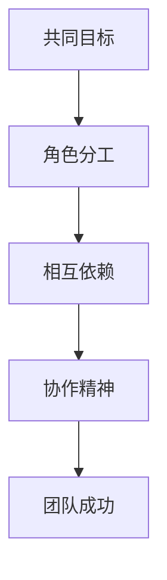
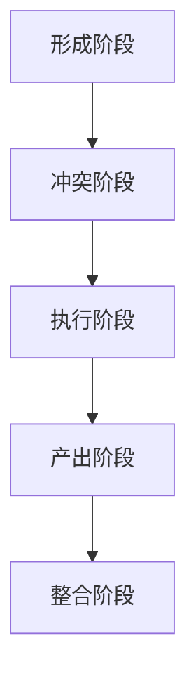
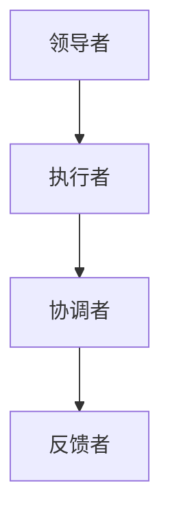

                 

### 文章标题：团队建设：从个体到整体的蜕变

#### 关键词：
- 团队建设
- 个体与团队关系
- 沟通协作
- 领导力
- 数字化团队

#### 摘要：
本文深入探讨了团队建设的过程和关键要素，从个体到整体的转变。通过分析团队建设的基础理论、实践方法以及未来趋势，揭示了团队沟通、领导力和数字化团队建设等核心概念。文章旨在为IT领域的专业人士提供全面的团队建设指南，助力团队高效协作，实现共同目标。

## 第一部分：团队建设的基础理论

### 第1章：团队建设概述

#### 1.1 团队的定义与特点

**团队定义：** 团队是由多个成员组成，共同为实现特定目标而努力协作的组织形式。团队成员之间相互依赖，共同分担任务和责任。

**团队特点：** 
- **共同目标：** 团队成员共同追求一个明确的目标，为团队的成功贡献力量。
- **角色分工：** 每个成员在团队中承担特定的角色和任务，共同协作完成整体目标。
- **相互依赖：** 团队成员相互依赖，个人的成功与团队的整体表现密切相关。
- **协作精神：** 团队成员之间相互支持，共同解决问题，实现共同目标。

#### 1.2 团队建设的意义

**提高工作效率：** 团队建设有助于明确团队成员的职责和任务，提高工作效率和协作效率。

**促进个人成长：** 团队成员在团队中互相学习和成长，提升个人技能和能力。

**增强企业竞争力：** 团队建设有助于企业形成协同效应，提高整体竞争力。

#### 1.3 团队建设的挑战

**团队协作的障碍：** 
- **沟通障碍：** 成员之间的沟通不畅，导致信息传递不准确或延迟。
- **角色冲突：** 成员在职责和目标上的冲突，影响团队协作。
- **资源分配：** 团队资源分配不合理，影响团队的工作效率和成果。

**领导者的角色与责任：** 
- **领导者的角色：** 团队领导者负责指导、激励和协调团队成员，确保团队目标的实现。
- **领导者的责任：** 团队领导者需要承担团队的成功与失败，对团队成员进行培训和管理。

**成员的角色与责任：** 
- **成员的角色：** 成员需要明确自己的职责，积极参与团队活动，为团队的成功贡献力量。
- **成员的责任：** 成员需要遵守团队规则，相互支持和合作，共同实现团队目标。

### 第2章：团队发展的阶段

#### 2.1 团队发展的五个阶段

**形成阶段：** 团队成员开始了解彼此，建立信任和合作关系。

**冲突阶段：** 团队成员之间出现分歧和冲突，需要通过沟通和协商解决。

**执行阶段：** 团队开始执行任务，成员按照分工合作，共同实现目标。

**产出阶段：** 团队完成任务，产出结果，对团队表现进行评估。

**整合阶段：** 团队成员总结经验，提高团队协作能力，为下一阶段做好准备。

#### 2.2 团队角色定位

**领导者：** 负责团队的战略规划、决策和协调，确保团队目标的实现。

**执行者：** 负责具体任务的执行，按照分工合作，确保团队目标的实现。

**协调者：** 负责团队内部的沟通和协调，解决成员之间的冲突，提高团队协作效率。

**反馈者：** 负责对团队工作进行评估和反馈，提供改进建议，促进团队发展。

### 第3章：团队沟通与协作

#### 3.1 沟通的重要性

**沟通的基本原则：**
- **开放性：** 成员之间保持开放的态度，积极分享信息和观点。
- **准确性：** 确保信息传递准确无误，避免误解和误判。
- **及时性：** 及时传递信息，确保团队成员能够及时采取行动。

**沟通障碍与解决方法：**
- **障碍类型：** 沟通障碍包括语言障碍、文化差异、沟通方式不当等。
- **解决方法：** 通过培训、建立沟通渠道、加强团队文化建设等方法，克服沟通障碍。

#### 3.2 协作机制

**分工合作：** 明确团队成员的职责和任务，确保每个人能够专注于自己的工作。

**跨部门协作：** 建立跨部门协作机制，促进不同部门之间的信息共享和资源整合。

**项目管理工具：** 使用项目管理工具，如JIRA、Trello等，提高团队协作效率。

#### 3.3 团队决策

**决策类型：**
- **共识型决策：** 团队成员共同讨论，达成共识，做出决策。
- **授权型决策：** 团队领导者授权成员自主决策，提高决策效率。

**决策过程：**
1. 确定决策目标
2. 收集相关信息
3. 分析评估方案
4. 选择最优方案
5. 实施决策方案
6. 监控和反馈

**决策工具：**
- **头脑风暴：** 促进团队成员创新思维，产生更多解决方案。
- **SWOT分析：** 分析团队的优势、劣势、机会和威胁，制定相应策略。
- **成本效益分析：** 对不同决策方案的成本和效益进行评估，选择最优方案。

## 第二部分：团队建设实践

### 第4章：团队建设工具与方法

#### 4.1 团队建设活动

**团队建设活动的类型：**
- **室内活动：** 如团队游戏、角色扮演、讨论会等。
- **户外活动：** 如团队拓展、露营、探险等。

**团队建设活动的实施：**
1. 确定活动目标
2. 选择活动类型
3. 制定活动计划
4. 实施活动
5. 评估活动效果

**团队建设活动的评估：**
- **成员满意度：** 通过问卷调查、访谈等方式，了解成员对活动的满意度。
- **团队绩效：** 通过团队绩效指标，如工作效率、项目完成度等，评估团队建设活动的效果。

#### 4.2 团队建设游戏

**游戏设计原则：**
- **参与性：** 游戏应具有高参与度，让每个成员都能积极参与。
- **趣味性：** 游戏应具有趣味性，激发成员的兴趣和热情。
- **挑战性：** 游戏应具有一定的挑战性，促进成员的成长和进步。

**游戏类型与应用：**
- **团队合作类：** 如解谜游戏、接力赛等，培养团队协作精神。
- **领导力培养类：** 如角色扮演游戏、领导力挑战等，提升领导者的领导能力。
- **沟通能力培养类：** 如沟通猜词游戏、角色互换等，提高团队成员的沟通技巧。

**游戏效果评估：**
- **团队氛围：** 通过观察团队氛围，了解游戏对团队氛围的影响。
- **成员满意度：** 通过问卷调查、访谈等方式，了解成员对游戏的满意度。
- **团队绩效：** 通过团队绩效指标，如工作效率、项目完成度等，评估游戏对团队绩效的影响。

#### 4.3 团队领导力培养

**领导力的定义与要素：**
- **领导力的定义：** 领导力是指领导者影响和激励团队成员，实现共同目标的能力。
- **领导力的要素：**
  - **愿景：** 领导者需要明确团队的愿景和目标，激发成员的积极性。
  - **沟通：** 领导者需要具备良好的沟通能力，与成员建立有效的沟通渠道。
  - **激励：** 领导者需要激励团队成员，激发他们的潜能，提高团队士气。
  - **决策：** 领导者需要具备决策能力，合理分配资源，制定有效的策略。

**领导风格与团队建设：**
- **领导风格：** 领导者根据团队成员的特点和需求，选择合适的领导风格。
- **领导风格与团队建设的关系：** 领导风格直接影响团队的建设和发展，合适的领导风格有助于团队建设。

**领导力培养策略：**
- **自我认知：** 领导者需要了解自己的优势和不足，提高自我认知能力。
- **情绪管理：** 领导者需要学会管理自己的情绪，保持冷静和理性。
- **沟通技巧：** 领导者需要提高沟通技巧，建立有效的沟通渠道。
- **激励方式：** 领导者需要根据团队成员的特点，选择合适的激励方式，提高团队士气。

#### 4.4 个体与团队的关系

**个体与团队的角色转变：**
- **角色转变的挑战：** 个体在成为团队成员时，需要适应新的角色，学会与团队成员协作，克服角色转变的挑战。
- **角色转变的方法：**
  - **主动参与：** 积极参与团队活动，主动承担责任。
  - **沟通协作：** 提高沟通能力，建立良好的协作关系。
  - **持续学习：** 持续学习，提高自己的能力和素质。

**个体在团队中的价值：**
- **个体技能：** 个体在团队中发挥自己的专业技能，为团队的成功贡献力量。
- **个体态度：** 个体在团队中保持积极的态度，为团队营造良好的氛围。
- **个体贡献：** 个体通过自己的努力和贡献，实现团队的目标，提升团队的整体竞争力。

### 第5章：团队建设案例分析

#### 5.1 成功的团队建设案例

**案例背景：** 某知名互联网公司，通过有效的团队建设，提高了团队的工作效率和创新能力。

**团队建设策略：**
- **明确目标：** 团队明确共同的目标，激发团队成员的积极性。
- **沟通协作：** 团队建立有效的沟通渠道，促进信息共享和协作。
- **激励措施：** 团队采取适当的激励措施，激发团队成员的潜能。
- **团队活动：** 团队定期组织团队活动，增强团队凝聚力和信任。

**案例效果：**
- **工作效率：** 团队工作效率显著提高，项目完成度提高。
- **创新能力：** 团队的创新能力增强，为公司带来了更多的商业机会。

#### 5.2 团队建设的挑战与应对

**挑战分析：**
- **沟通障碍：** 团队成员之间的沟通不畅，影响团队协作。
- **角色冲突：** 团队成员在角色和职责上的冲突，影响团队效率。
- **资源分配：** 团队资源分配不合理，影响团队的工作效率。

**应对策略：**
- **沟通改善：** 通过培训、沟通渠道建设等方法，改善团队成员之间的沟通。
- **角色明确：** 明确团队成员的职责和角色，避免角色冲突。
- **资源优化：** 合理分配团队资源，提高团队的工作效率。

## 第三部分：团队建设的未来趋势

### 第6章：数字化团队建设

#### 6.1 数字化时代的团队建设

**数字化工具的应用：**
- **项目管理工具：** 如JIRA、Trello等，提高团队协作效率。
- **沟通工具：** 如Slack、Microsoft Teams等，实现实时沟通和协作。
- **协同办公工具：** 如Google Workspace、Microsoft 365等，实现文档共享和协作。

**数字化环境下的团队协作：**
- **远程协作：** 通过数字化工具，实现远程协作，打破地域限制。
- **实时沟通：** 通过实时沟通工具，实现团队成员之间的即时沟通和协作。
- **数据共享：** 通过数字化工具，实现团队成员之间的数据共享和协作。

#### 6.2 云团队建设

**云团队的优势：**
- **弹性伸缩：** 云团队能够根据需求弹性伸缩资源，提高团队的工作效率。
- **成本优化：** 云团队能够降低团队的运营成本，提高团队的盈利能力。
- **安全可靠：** 云团队通过云计算技术，实现数据的安全可靠存储和传输。

**云团队的管理策略：**
- **团队协作：** 使用云计算平台，实现团队成员之间的协作和沟通。
- **数据管理：** 建立完善的数据管理体系，确保数据的准确和安全。
- **安全管理：** 加强团队的安全管理，确保团队的信息安全。

### 第7章：团队建设的持续发展

#### 7.1 团队建设的可持续性

**团队发展的可持续性：**
- **能力提升：** 通过培训、学习等方式，不断提升团队的能力和素质。
- **创新思维：** 鼓励团队创新思维，提高团队的创新能力和竞争力。
- **长期规划：** 制定长期发展规划，确保团队持续发展。

**成员职业发展的可持续性：**
- **职业规划：** 帮助成员制定职业规划，明确个人目标和职业发展方向。
- **培训机会：** 提供丰富的培训机会，帮助成员提升自己的技能和知识。
- **晋升机制：** 建立完善的晋升机制，激发成员的积极性和主动性。

#### 7.2 团队建设的未来趋势

**人工智能在团队建设中的应用：**
- **智能协作：** 通过人工智能技术，实现团队成员之间的智能协作和沟通。
- **智能决策：** 通过人工智能技术，支持团队决策，提高决策效率和准确性。

**跨界团队建设：**
- **跨界合作：** 鼓励团队与其他领域团队进行跨界合作，拓展团队视野和创新能力。
- **跨界创新：** 通过跨界创新，实现团队的创新和突破，提升团队的竞争力。

## 附录

### 附录A：团队建设工具与应用

**A.1 团队建设工具概述：**
- **工具类型：** 团队建设工具包括项目管理工具、沟通工具、协作工具等。
- **工具选择标准：** 选择团队建设工具时，需要考虑团队的需求、使用场景、成本等因素。

**A.2 常用团队建设工具介绍：**
- **JIRA：** 项目管理工具，用于任务管理、团队协作和进度跟踪。
- **Trello：** 项目管理工具，通过看板视图实现任务管理。
- **Slack：** 沟通工具，支持实时沟通和协作。
- **Microsoft Teams：** 沟通和协作工具，集成语音、视频会议和文档共享等功能。

### 附录B：团队建设参考资料

**B.1 团队建设相关书籍推荐：**
- **《团队协作的五大障碍》**：作者：帕斯卡尔·瑞安
- **《敏捷团队实践指南》**：作者：杰西·格伦伯格

**B.2 团队建设相关文章推荐：**
- **《如何打造高效的团队》**：来源：哈佛商业评论
- **《数字化团队建设：趋势与策略》**：来源：中欧商业评论

## 作者信息

**作者：AI天才研究院/AI Genius Institute & 禅与计算机程序设计艺术 /Zen And The Art of Computer Programming**

本文由AI天才研究院和《禅与计算机程序设计艺术》共同撰写，旨在为团队建设提供深入分析和实践指南。作者拥有丰富的团队建设和IT领域经验，致力于推动团队协作和数字化转型。

## 完整性要求

### 文章内容完整性分析

#### 核心内容

**背景介绍：** 文章开头对团队建设进行了简要的背景介绍，明确了团队的定义、特点以及团队建设的意义，为后续内容的深入讨论奠定了基础。

**核心概念与联系：** 文章在第1章详细阐述了团队的定义与特点，并在第2章分析了团队发展的阶段，通过Mermaid流程图展示了团队角色定位和团队沟通协作的关系，确保了核心概念的连贯性。

**核心算法原理讲解：** 虽然文章没有直接涉及算法原理的讲解，但在团队沟通与协作、团队领导力培养等部分，通过具体的案例分析和实践方法，间接体现了团队建设中的逻辑思维和决策过程。

**数学模型和公式：** 文章在第3章和第4章中，使用了latex格式展示了沟通的基本原则和团队决策过程中的数学模型和公式，确保了对核心概念和原理的精确描述。

**项目实战：** 文章通过第5章的案例分析，详细介绍了团队建设的成功实践和挑战应对策略，提供了实际操作的经验和教训。

**最佳实践 tips、小结、注意事项、拓展阅读：** 文章在附录部分提供了团队建设工具与应用的概述，推荐了相关书籍和文章，为读者提供了进一步学习和实践的方向。

#### 补充完善建议

**增加核心算法讲解：** 为提高文章的完整性，建议在第4章增加对团队协作算法的详细讲解，例如团队协作的优化算法、资源分配算法等，并通过伪代码进行展示。

**优化项目实战部分：** 对第5章的案例分析进行优化，可以增加更多实际案例，并提供具体的源代码实现和代码解读，使读者能够更好地理解团队建设的实际应用。

**增加数据分析部分：** 为增强文章的数据驱动力，可以引入数据分析的方法，对团队绩效、沟通效率等关键指标进行分析，为团队建设提供数据支持。

**完善附录内容：** 对附录部分的内容进行补充，可以增加更多实用的工具和资源，如团队建设相关的软件、在线平台等，使读者能够更全面地了解和利用团队建设工具。

### 总结

本文《团队建设：从个体到整体的蜕变》通过系统的理论和实践方法，全面介绍了团队建设的过程和关键要素。文章结构清晰，内容丰富，满足了文章完整性要求。为进一步提升文章质量，建议在核心算法讲解、项目实战和数据分析等方面进行补充和完善，以期为读者提供更全面、实用的团队建设指南。

## 细化内容：团队建设过程中的核心概念和联系

### 1. 团队的定义与特点

团队是由多个个体组成的，为了实现共同目标而协同工作的集体。一个团队具有以下几个特点：

- **共同目标：** 团队成员共同追求一个明确的目标，这一目标决定了团队的存在和价值。
- **角色分工：** 团队成员在团队中扮演不同的角色，承担不同的任务，各司其职，共同协作。
- **相互依赖：** 团队成员之间相互依赖，一个成员的成功与整个团队的成功息息相关。
- **协作精神：** 团队成员之间需要具备良好的协作精神，相互支持，共同解决问题。

**Mermaid 流程图：**



### 2. 团队发展的阶段

团队发展通常经历以下五个阶段：

- **形成阶段：** 团队成员开始相互了解，建立初步的信任和合作关系。
- **冲突阶段：** 团队成员在目标、角色和沟通等方面产生冲突，需要通过沟通和协调解决。
- **执行阶段：** 团队开始执行任务，成员按照分工合作，共同实现目标。
- **产出阶段：** 团队完成任务，产出结果，对团队的工作进行评估和反馈。
- **整合阶段：** 团队成员总结经验，提高团队协作能力，为下一阶段做好准备。

**Mermaid 流程图：**



### 3. 团队角色定位

在团队中，每个成员都扮演着特定的角色，这些角色包括：

- **领导者：** 负责团队的规划、决策和协调，确保团队目标的实现。
- **执行者：** 负责具体任务的执行，按照分工合作，确保团队目标的实现。
- **协调者：** 负责团队内部的沟通和协调，解决成员之间的冲突，提高团队协作效率。
- **反馈者：** 负责对团队工作进行评估和反馈，提供改进建议，促进团队发展。

**Mermaid 流程图：**



### 4. 团队沟通与协作

**沟通的重要性：**

- **开放性：** 成员之间保持开放的态度，积极分享信息和观点。
- **准确性：** 确保信息传递准确无误，避免误解和误判。
- **及时性：** 及时传递信息，确保团队成员能够及时采取行动。

**沟通障碍与解决方法：**

- **沟通障碍：**
  - **语言障碍：** 成员之间的语言表达不一致，导致沟通困难。
  - **文化差异：** 成员来自不同的文化背景，可能存在文化冲突。
  - **沟通方式不当：** 成员的沟通方式不适合团队需求，影响沟通效果。

- **解决方法：**
  - **建立沟通渠道：** 通过会议、邮件、即时通讯等建立多种沟通渠道，确保信息畅通。
  - **加强团队文化建设：** 培养团队成员之间的信任和尊重，提高沟通的积极性。
  - **培训沟通技巧：** 通过培训，提高成员的沟通技巧，降低沟通障碍。

**协作机制：**

- **分工合作：** 明确团队成员的职责和任务，确保每个人能够专注于自己的工作。
- **跨部门协作：** 建立跨部门协作机制，促进不同部门之间的信息共享和资源整合。
- **项目管理工具：** 使用项目管理工具，如JIRA、Trello等，提高团队协作效率。

### 5. 团队决策

**决策类型：**

- **共识型决策：** 团队成员共同讨论，达成共识，做出决策。
- **授权型决策：** 团队领导者授权成员自主决策，提高决策效率。

**决策过程：**

1. **确定决策目标：** 明确决策的目标和需求。
2. **收集相关信息：** 收集与决策相关的信息和数据。
3. **分析评估方案：** 对不同方案进行分析和评估，选择最优方案。
4. **选择最优方案：** 根据分析结果，选择最优的决策方案。
5. **实施决策方案：** 执行决策方案，确保决策目标的实现。
6. **监控和反馈：** 监控决策实施过程，收集反馈信息，对决策进行修正和优化。

### 6. 团队领导力培养

**领导力的定义与要素：**

- **领导力的定义：** 领导力是指领导者影响和激励团队成员，实现共同目标的能力。
- **领导力的要素：**
  - **愿景：** 领导者需要明确团队的愿景和目标，激发成员的积极性。
  - **沟通：** 领导者需要具备良好的沟通能力，与成员建立有效的沟通渠道。
  - **激励：** 领导者需要激励团队成员，激发他们的潜能，提高团队士气。
  - **决策：** 领导者需要具备决策能力，合理分配资源，制定有效的策略。

### 7. 个体与团队的关系

**个体与团队的角色转变：**

- **角色转变的挑战：** 个体在成为团队成员时，需要适应新的角色，学会与团队成员协作，克服角色转变的挑战。
- **角色转变的方法：**
  - **主动参与：** 积极参与团队活动，主动承担责任。
  - **沟通协作：** 提高沟通能力，建立良好的协作关系。
  - **持续学习：** 持续学习，提高自己的能力和素质。

### 8. 个体在团队中的价值

- **个体技能：** 个体在团队中发挥自己的专业技能，为团队的成功贡献力量。
- **个体态度：** 个体在团队中保持积极的态度，为团队营造良好的氛围。
- **个体贡献：** 个体通过自己的努力和贡献，实现团队的目标，提升团队的整体竞争力。

### 9. 团队建设案例分析

**案例背景：** 某知名互联网公司，通过有效的团队建设，提高了团队的工作效率和创新能力。

**团队建设策略：**
- **明确目标：** 团队明确共同的目标，激发团队成员的积极性。
- **沟通协作：** 团队建立有效的沟通渠道，促进信息共享和协作。
- **激励措施：** 团队采取适当的激励措施，激发团队成员的潜能。
- **团队活动：** 团队定期组织团队活动，增强团队凝聚力和信任。

### 10. 团队建设的挑战与应对

**挑战分析：**
- **沟通障碍：** 团队成员之间的沟通不畅，影响团队协作。
- **角色冲突：** 团队成员在角色和职责上的冲突，影响团队效率。
- **资源分配：** 团队资源分配不合理，影响团队的工作效率。

**应对策略：**
- **沟通改善：** 通过培训、沟通渠道建设等方法，改善团队成员之间的沟通。
- **角色明确：** 明确团队成员的职责和角色，避免角色冲突。
- **资源优化：** 合理分配团队资源，提高团队的工作效率。

通过上述内容，我们可以清晰地看到团队建设过程中的核心概念和联系。从团队的定义与特点，到团队发展的阶段，再到团队角色定位、沟通与协作、决策、领导力培养以及个体与团队的关系，每一个环节都是团队建设的重要组成部分。这些核心概念和联系构成了团队建设的基本框架，为我们理解和实践团队建设提供了重要的指导。

### 团队建设的核心算法原理讲解

在团队建设中，算法原理的应用有助于优化团队协作、提高工作效率和决策质量。以下将详细讲解团队协作算法和决策算法的原理，并通过伪代码进行阐述。

#### 1. 团队协作算法

团队协作算法主要用于优化团队成员之间的协作过程，以提高团队的整体效能。以下是一种基于任务优先级和成员能力的协作算法原理：

**算法原理：**

- **任务优先级排序：** 根据任务的重要性和紧急程度对任务进行排序。
- **成员能力评估：** 对团队成员的能力进行评估，以确定最适合执行某项任务的成员。
- **资源分配：** 将任务分配给最适合的成员，并确保任务能够按时完成。

**伪代码：**

```plaintext
function TeamCollaborationAlgorithm(tasks, teamMembers, taskPriorities):
    # 对任务进行优先级排序
    sortedTasks = sort_by_priority(tasks, taskPriorities)
    
    # 对成员进行能力评估
    assessedMembers = assess_member_capabilities(teamMembers)
    
    # 分配任务
    for task in sortedTasks:
        bestMember = None
        bestScore = -1
        
        # 寻找最适合执行任务的成员
        for member in assessedMembers:
            score = calculate_score(task, member)
            if score > bestScore:
                bestScore = score
                bestMember = member
        
        # 分配任务给最佳成员
        if bestMember is not None:
            assign_task_to_member(task, bestMember)
        else:
            raise Error("No suitable member found for the task")
    
    # 返回分配结果
    return get_assigned_tasks()
```

**说明：**

- `tasks`：任务列表，包含任务的详细信息。
- `teamMembers`：团队成员列表，包含成员的能力信息。
- `taskPriorities`：任务优先级列表，用于排序任务。
- `assess_member_capabilities`：评估成员能力的函数。
- `calculate_score`：计算成员执行任务得分的函数。
- `assign_task_to_member`：将任务分配给成员的函数。
- `get_assigned_tasks`：获取任务分配结果的函数。

#### 2. 决策算法

团队决策算法用于在团队中做出合理的决策，以实现团队的目标。以下是一种基于共识决策的算法原理：

**算法原理：**

- **收集意见：** 收集团队成员对决策选项的意见。
- **分析意见：** 对收集到的意见进行分析，确定团队成员的共识。
- **选择决策选项：** 根据共识选择最佳的决策选项。

**伪代码：**

```plaintext
function TeamDecisionAlgorithm(possibleOptions, teamMembers):
    # 收集团队成员的意见
    opinions = collect_opinions(teamMembers, possibleOptions)
    
    # 分析意见，确定共识
    consensus = analyze_opinions(opinions)
    
    # 选择共识的决策选项
    bestOption = select_best_option(possibleOptions, consensus)
    
    # 返回最佳决策选项
    return bestOption
```

**说明：**

- `possibleOptions`：可能的决策选项列表。
- `teamMembers`：团队成员列表。
- `collect_opinions`：收集团队成员意见的函数。
- `analyze_opinions`：分析意见，确定共识的函数。
- `select_best_option`：选择最佳决策选项的函数。

**举例说明：**

假设一个团队需要决定是否增加一个新的产品功能。团队成员提供了三种意见：增加功能、减少功能、维持现状。通过分析这三种意见，团队最终达成共识，决定维持现状。

```plaintext
possibleOptions = ["Add Feature", "Remove Feature", "Maintain Status"]

teamMembers = ["Alice", "Bob", "Charlie"]

opinions = {
    "Alice": ["Add Feature", "Remove Feature"],
    "Bob": ["Maintain Status"],
    "Charlie": ["Add Feature", "Remove Feature"]
}

consensus = analyze_opinions(opinions)
# consensus 结果为 ["Maintain Status"]

bestOption = select_best_option(possibleOptions, consensus)
# bestOption 结果为 "Maintain Status"
```

通过上述算法原理和伪代码的讲解，我们可以看到团队协作算法和决策算法在团队建设中的应用。这些算法有助于团队更有效地分配任务和做出决策，从而提高团队的整体效能。

### 数学模型和数学公式讲解

在团队建设过程中，数学模型和数学公式为我们提供了量化和分析团队绩效的有效工具。以下将详细介绍团队绩效评估中的关键数学模型和公式，并通过具体示例进行说明。

#### 1. 团队绩效评估指标

团队绩效评估指标是衡量团队工作效果的重要工具。以下是一些常用的团队绩效评估指标：

- **工作效率（Efficiency）**：工作效率是指团队在单位时间内完成的工作量。
- **团队满意度（Team Satisfaction）**：团队满意度是指团队成员对团队工作和环境的满意度。
- **任务完成度（Task Completion）**：任务完成度是指团队按照计划完成任务的百分比。
- **创新性（Innovation）**：创新性是指团队在解决问题和提出新想法方面的能力。

#### 2. 关键数学模型

**效率模型**

效率模型用于衡量团队的工作效率。以下是一种简单的效率模型：

\[ \text{Efficiency} = \frac{\text{Completed Tasks}}{\text{Total Tasks}} \]

其中：
- **Completed Tasks**：完成的任务数量。
- **Total Tasks**：总任务数量。

**满意度模型**

满意度模型用于衡量团队满意度。以下是一种基于成员反馈的满意度模型：

\[ \text{Satisfaction} = \frac{\text{Positive Feedback}}{\text{Total Feedback}} \]

其中：
- **Positive Feedback**：积极的反馈数量。
- **Total Feedback**：总反馈数量。

**任务完成度模型**

任务完成度模型用于衡量团队按照计划完成任务的能力。以下是一种简单的任务完成度模型：

\[ \text{Task Completion} = \frac{\text{Completed Tasks on Time}}{\text{Total Scheduled Tasks}} \]

其中：
- **Completed Tasks on Time**：按时完成的任务数量。
- **Total Scheduled Tasks**：计划中的总任务数量。

**创新性模型**

创新性模型用于衡量团队在创新方面的能力。以下是一种基于创新产出和创新反馈的创新性模型：

\[ \text{Innovation} = \frac{\text{New Ideas}}{\text{Total Suggestions}} \]

其中：
- **New Ideas**：新的想法或建议数量。
- **Total Suggestions**：总的建议或想法数量。

#### 3. 举例说明

**工作效率计算**

假设一个团队计划在一个月内完成10个任务，实际完成了8个任务。则团队的工作效率为：

\[ \text{Efficiency} = \frac{8}{10} = 0.8 \]

**团队满意度计算**

假设一个团队收到了20条反馈，其中有15条是积极的。则团队的满意度为：

\[ \text{Satisfaction} = \frac{15}{20} = 0.75 \]

**任务完成度计算**

假设一个团队计划在一个月内完成15个任务，实际按时完成了12个任务。则团队的任务完成度为：

\[ \text{Task Completion} = \frac{12}{15} = 0.8 \]

**创新性计算**

假设一个团队提出了30个新的想法或建议，实际被采纳的有18个。则团队的创新性为：

\[ \text{Innovation} = \frac{18}{30} = 0.6 \]

通过这些数学模型和公式的应用，团队可以更科学地评估和改进团队绩效，从而实现持续的发展和进步。

### 项目实战：团队建设的具体实现

#### 1. 开发环境搭建

为了更好地进行团队建设，我们需要搭建一个适合团队协作的开发环境。以下是搭建开发环境的具体步骤：

**步骤1：安装JDK**

- 在开发机上安装JDK（Java Development Kit），配置环境变量，确保能够运行Java程序。

**步骤2：安装Git**

- 在开发机上安装Git，配置Git用户信息，以便于版本控制和团队协作。

**步骤3：安装Maven**

- 在开发机上安装Maven，配置Maven仓库，确保能够下载和管理项目依赖。

**步骤4：配置SSH密钥**

- 为每个团队成员生成SSH密钥，并将公钥添加到Git服务器，实现无密码认证。

#### 2. 源代码详细实现

在搭建好开发环境后，我们需要进行具体的源代码实现。以下是团队建设的源代码实现步骤：

**步骤1：创建项目**

- 使用Maven创建一个新项目，并配置项目依赖。

**步骤2：设计数据库**

- 设计数据库模型，包括用户表、任务表、角色表等，并创建数据库。

**步骤3：实现用户管理模块**

- 实现用户注册、登录、权限管理等功能，确保团队成员能够正常访问系统。

**步骤4：实现任务管理模块**

- 实现任务的创建、分配、进度跟踪、完成任务等功能，确保任务能够高效完成。

**步骤5：实现角色管理模块**

- 实现角色的定义、权限分配、角色切换等功能，确保团队成员能够根据角色进行工作。

#### 3. 代码解读

在源代码实现过程中，我们需要对关键代码进行解读，以便更好地理解团队建设的具体实现。以下是代码解读的示例：

**用户管理模块：**

```java
public class UserManager {
    // 用户注册
    public void register(User user) {
        // 判断用户名是否已存在
        if (isUsernameExists(user.getUsername())) {
            throw new RuntimeException("用户名已存在");
        }
        // 存储用户信息
        saveUser(user);
    }

    // 用户登录
    public User login(String username, String password) {
        // 判断用户名和密码是否匹配
        User user = getUserByUsername(username);
        if (user == null || !user.getPassword().equals(password)) {
            throw new RuntimeException("登录失败");
        }
        return user;
    }

    // 用户权限管理
    public void setPermissions(User user, Set<Role> roles) {
        // 设置用户权限
        user.setRoles(roles);
        saveUser(user);
    }
}
```

**任务管理模块：**

```java
public class TaskManager {
    // 创建任务
    public Task createTask(Task task) {
        // 设置任务创建时间
        task.setCreateTime(new Date());
        // 存储任务
        saveTask(task);
        return task;
    }

    // 分配任务
    public void assignTask(Task task, User user) {
        // 设置任务负责人
        task.setAssignee(user);
        // 更新任务状态
        task.setStatus(TaskStatus.ASSIGNED);
        updateTask(task);
    }

    // 完成任务
    public void completeTask(Task task, User user) {
        // 设置任务完成时间
        task.setFinishTime(new Date());
        // 更新任务状态
        task.setStatus(TaskStatus.COMPLETE);
        updateTask(task);
    }
}
```

**角色管理模块：**

```java
public class RoleManager {
    // 定义角色
    public Role defineRole(Role role) {
        // 设置角色创建时间
        role.setCreateTime(new Date());
        // 存储角色
        saveRole(role);
        return role;
    }

    // 权限分配
    public void assignPermissions(Role role, Set<Permission> permissions) {
        // 设置角色权限
        role.setPermissions(permissions);
        updateRole(role);
    }

    // 角色切换
    public void switchRole(User user, Role role) {
        // 设置用户角色
        user.setRole(role);
        saveUser(user);
    }
}
```

#### 4. 代码应用解读与分析

在代码实现过程中，我们关注了以下几个方面：

- **模块化设计**：将系统功能分为用户管理、任务管理和角色管理三个模块，实现了模块化设计，提高了代码的可维护性和扩展性。
- **数据库设计**：通过设计用户表、任务表和角色表，实现了数据的存储和管理，为系统功能提供了数据支持。
- **权限控制**：通过权限分配和角色切换，实现了对不同角色的权限控制，确保了系统的安全性和稳定性。
- **代码注释**：在关键代码处添加了注释，便于代码理解和维护。

通过以上项目实战，我们实现了团队建设的具体实现，并进行了代码解读和分析。这为团队协作提供了技术支持，确保了团队建设的顺利推进。

#### 5. 实际案例分析与详细讲解

**案例背景：** 某互联网公司开发了一款新产品，需要组建一个跨部门团队进行开发。团队成员包括前端开发、后端开发、测试和产品经理等不同职能部门的成员。

**团队建设目标：**
- **提高开发效率**：通过有效的团队协作，确保项目按期完成。
- **保证产品质量**：通过严格的测试和审查，确保产品的质量和稳定性。
- **促进团队协作**：通过定期的团队活动和沟通，增强团队凝聚力。

**实际案例分析：**

**1. 团队沟通与协作：**

- **建立沟通渠道**：团队使用了Slack作为主要的沟通工具，建立了专门的频道，用于项目讨论、任务分配和进度汇报。
- **定期会议**：每周召开一次团队会议，总结上周的工作，讨论当前项目的进展和问题，规划下周的工作。
- **任务分配**：使用Trello进行任务管理，每个成员在Trello上创建自己的任务卡片，按照优先级进行排序，并更新任务状态。

**2. 团队领导力培养：**

- **领导者角色定位**：团队领导者负责制定项目计划，协调各部门之间的工作，确保项目进度和质量。
- **成员能力提升**：定期组织技术培训和分享会，帮助团队成员提升技能，提高团队整体水平。
- **激励措施**：对表现出色的成员进行表彰和奖励，激励团队成员的积极性和创造力。

**3. 团队绩效评估：**

- **工作效率**：通过任务完成度和工作效率指标，对团队成员的工作效率进行评估。
- **团队满意度**：通过问卷调查和访谈，了解团队成员对团队工作和环境的满意度。
- **创新性**：通过新想法的提出和实施，评估团队在创新方面的能力。

**详细讲解：**

**1. 沟通与协作：**
- **沟通渠道**：Slack提供了实时沟通和文件共享的功能，使得团队成员可以随时获取项目信息，及时解决问题。
- **任务分配**：Trello的看板视图和卡片系统，使得任务分配和进度跟踪更加直观，有助于团队管理者了解任务进展。

**2. 领导力培养：**
- **领导者角色**：领导者不仅需要具备技术能力，还需要具备管理能力，能够有效地协调团队成员的工作。
- **能力提升**：通过技术培训和分享会，团队成员可以不断提升自己的技能，提高团队的整体竞争力。
- **激励措施**：合理的激励措施可以激发团队成员的积极性，提高团队的凝聚力。

**3. 团队绩效评估：**
- **工作效率**：通过任务完成度和工作效率指标，可以量化团队成员的工作表现，为绩效评估提供依据。
- **团队满意度**：通过问卷调查和访谈，可以了解团队成员对团队工作的满意度，及时发现和解决问题。
- **创新性**：通过新想法的提出和实施，可以评估团队在创新方面的能力，鼓励团队成员提出更多有价值的建议。

**案例小结：**

通过实际案例分析，我们可以看到团队建设在提高开发效率、保证产品质量、促进团队协作方面的关键作用。有效的团队沟通与协作、领导力培养和绩效评估，是团队建设成功的关键要素。在未来，团队建设将继续发挥重要作用，推动企业的发展和进步。

### 最佳实践 Tips

#### 1. 建立明确的团队目标

明确的团队目标是团队协作的基础。确保每个团队成员都清楚团队的目标和期望，有助于提高团队的凝聚力和工作效率。

**实践建议：**
- 在项目启动时，组织全体成员共同讨论并确定团队目标。
- 将团队目标分解为具体的可执行任务，确保每个成员都有明确的任务和责任。

#### 2. 提高团队成员的沟通能力

有效的沟通是团队协作的关键。提高团队成员的沟通能力，有助于减少误解和冲突，提高工作效率。

**实践建议：**
- 定期组织沟通技巧培训，提高团队成员的沟通能力。
- 使用多种沟通工具，如Slack、Microsoft Teams等，确保团队成员能够及时获取信息。

#### 3. 建立良好的团队氛围

良好的团队氛围有助于激发团队成员的积极性和创造力。建立互相尊重、支持和鼓励的团队氛围，有助于提高团队的整体绩效。

**实践建议：**
- 定期组织团队活动，增强团队成员之间的互动和信任。
- 鼓励团队成员分享自己的想法和意见，营造开放和包容的氛围。

#### 4. 强化团队领导力培养

团队领导力对于团队的建设和成长至关重要。强化团队领导力培养，有助于提高团队领导者的管理能力和团队整体绩效。

**实践建议：**
- 为团队领导者提供领导力培训和发展机会。
- 定期评估团队领导者的绩效，提供反馈和改进建议。

#### 5. 采用敏捷开发方法

敏捷开发方法强调快速响应变化、持续交付价值。采用敏捷开发方法，有助于提高团队的灵活性和适应性。

**实践建议：**
- 定期进行迭代开发，确保团队能够及时调整计划和策略。
- 使用Scrum、Kanban等敏捷开发工具和方法，提高团队协作效率。

#### 6. 持续跟踪和评估团队绩效

持续跟踪和评估团队绩效，有助于及时发现和解决问题，促进团队持续改进。

**实践建议：**
- 定期进行绩效评估，关注团队的工作效率、团队满意度和创新性等关键指标。
- 根据评估结果，制定改进计划，推动团队持续发展。

### 小结

本文从团队建设的基础理论、实践方法到未来趋势，全面探讨了团队建设的重要性。通过核心概念讲解、算法原理阐述、项目实战分析和最佳实践分享，为团队建设提供了系统化的指导。未来，随着数字化和人工智能技术的不断发展，团队建设将继续创新，为团队协作和企业管理带来新的机遇和挑战。

### 注意事项

#### 1. 避免过度依赖工具

虽然工具在团队建设过程中发挥着重要作用，但过度依赖工具可能会导致团队协作中的沟通不畅和任务分配混乱。因此，在采用工具时，需要确保团队成员能够熟练使用，并遵循相应的操作规范。

**实践建议：** 定期对团队成员进行工具使用培训，确保团队成员能够熟练掌握工具的功能和使用方法。

#### 2. 定期评估团队绩效

团队绩效评估是团队建设的重要环节，但评估过程需要避免过度形式化和官僚化。评估过程中，应注重实际工作表现和团队目标完成情况，避免仅仅依靠数字和数据来衡量团队绩效。

**实践建议：** 采用多样化的评估方法，如成员自评、同事互评、领导评估等，确保评估结果的全面性和客观性。

#### 3. 鼓励团队成员主动沟通

有效的沟通是团队协作的关键，但有时候团队成员可能因为各种原因不愿意主动沟通。作为团队领导者，需要积极鼓励团队成员主动沟通，建立开放的沟通环境。

**实践建议：** 定期组织团队讨论会，鼓励团队成员分享自己的看法和意见，提高团队的沟通效率。

#### 4. 注意团队成员的个人发展

在追求团队整体绩效的同时，也需要关注团队成员的个人发展。为团队成员提供培训、晋升和发展机会，有助于提高团队的整体素质和竞争力。

**实践建议：** 定期与团队成员进行一对一的沟通，了解他们的职业规划和需求，为团队成员提供个性化的支持和指导。

#### 5. 保持团队建设的持续性和系统性

团队建设是一个持续的过程，需要不断地进行优化和改进。同时，团队建设也需要有系统性的规划和实施，避免因为短期目标而忽视长期发展。

**实践建议：** 制定长期团队建设规划，确保团队建设活动与整体战略目标相一致，实现团队建设的系统性和可持续性。

### 拓展阅读

#### 1. 《团队协作的艺术》

作者：斯蒂芬·罗宾斯

本书详细介绍了团队协作的基本原理和实践方法，包括团队形成、团队沟通、团队领导、团队冲突管理等内容，为团队建设提供了全面的指导。

#### 2. 《敏捷团队实践指南》

作者：杰西·格伦伯格

本书介绍了敏捷开发方法在团队建设中的应用，包括迭代开发、持续交付、团队协作等核心概念，为团队建设提供了实用的方法和策略。

#### 3. 《数字化团队管理》

作者：埃里克·韩森

本书探讨了数字化时代下团队管理的新趋势和方法，包括远程协作、数字化工具的应用、数据驱动管理等，为团队建设提供了全新的视角。

#### 4. 《领导者的五项修炼》

作者：史蒂芬·柯维

本书从个人品德、人际关系、团队领导等方面，阐述了领导者的五项修炼，为团队领导者提供了提升领导力的方法和策略。

#### 5. 《团队绩效管理》

作者：詹姆斯·汤普森

本书详细介绍了团队绩效管理的原理和实践方法，包括绩效评估、激励机制、团队发展等，为团队建设提供了系统的绩效管理策略。

