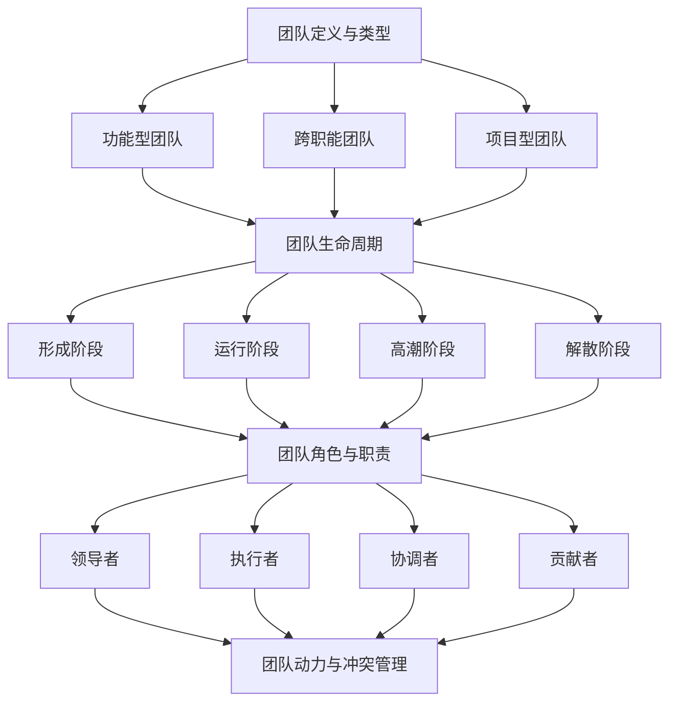
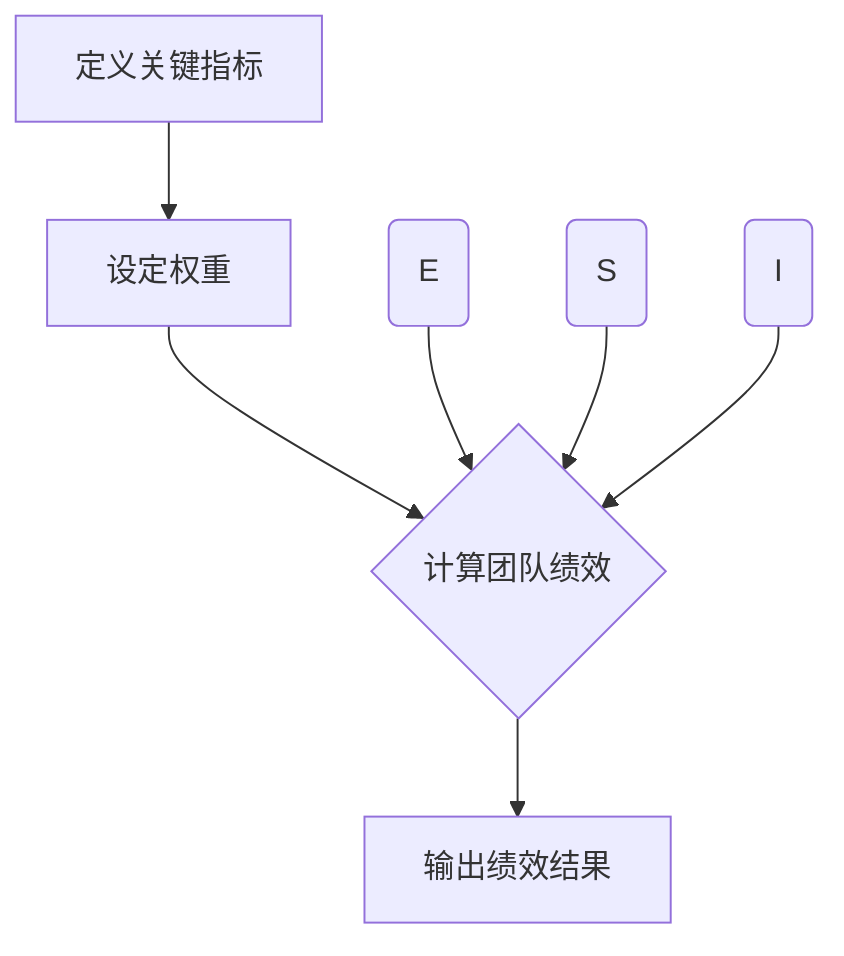
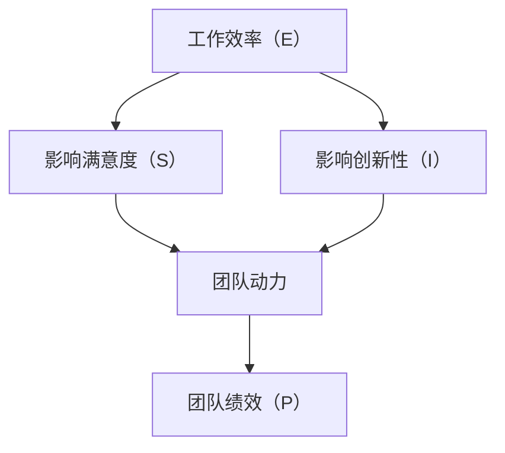

                 

## 设计目录大纲的步骤

### 第一步：理解书名

书名《团队建设：培养团队精神的实践活动》明确了本书的核心主题是团队建设和团队精神的培养，并且强调了实践活动的应用。因此，在制定目录大纲时，需要确保涵盖以下关键内容：

1. **团队建设的基础理论**：包括团队的基本概念、类型、生命周期等。
2. **团队精神的培养方法**：介绍多种培养团队精神的方法和策略。
3. **实践活动的设计与实施**：提供实践活动的具体设计方案和实施步骤。
4. **案例分析**：通过成功和失败的案例来分析团队建设的实践效果。
5. **效果评估与持续改进**：讨论如何评估团队建设的有效性，并提出持续改进的策略。

### 第二步：确定主要章节

根据书名和上述理解，我们可以确定以下主要章节：

1. **引言**：介绍团队建设的重要性，概述本书的目的和结构。
2. **团队建设基础理论**：阐述团队建设的基本概念、团队类型、团队生命周期等。
3. **团队精神培养方法**：介绍培养团队精神的策略和方法。
4. **实践活动设计与实施**：提供实践活动的具体设计方案和实施步骤。
5. **案例分析**：分析成功的团队建设实践案例，总结经验和教训。
6. **效果评估与持续改进**：讨论团队建设活动的效果评估方法，以及如何持续改进团队建设。

### 第三步：细化章节内容

对于每个主要章节，我们可以进一步细化出可能的子章节。以下是详细章节内容：

#### 第2章 团队建设基础理论

- **2.1 团队的定义与类型**：介绍团队的定义、分类和特征。
- **2.2 团队生命周期**：详细阐述团队的成长、成熟和衰退过程。
- **2.3 团队角色与职责**：分析团队中不同成员的角色和责任。
- **2.4 团队动力与冲突管理**：探讨团队内部动力和冲突的影响及管理策略。

#### 第3章 团队精神培养方法

- **3.1 教育与培训**：讨论如何通过教育和培训来培养团队精神。
- **3.2 沟通与合作**：介绍有效的沟通方法和促进合作的技巧。
- **3.3 领导力发展**：分析领导力对团队精神培养的影响和提升策略。

#### 第4章 实践活动设计与实施

- **4.1 实践活动的设计原则**：阐述设计实践活动的核心原则和目标。
- **4.2 实践活动的实施步骤**：详细描述实施实践活动的具体步骤。
- **4.3 实践活动的评估与反馈**：讨论如何评估实践活动的效果，并提供反馈机制。

#### 第5章 案例分析

- **5.1 案例选择与介绍**：选择具有代表性的成功和失败案例进行介绍。
- **5.2 案例分析与总结**：分析案例中的团队建设实践，总结经验和教训。

#### 第6章 效果评估与持续改进

- **6.1 效果评估方法**：介绍评估团队建设效果的量化和方法。
- **6.2 持续改进策略**：探讨如何通过持续改进来提升团队建设的效果。

### 第四步：设计具体内容

在每个子章节中，我们需要设计具体内容，包括：

- **核心概念与联系**：使用Mermaid流程图展示概念之间的关系。
- **核心算法原理讲解**：使用Python源代码详细阐述算法原理，并结合数学模型和公式进行解释。
- **数学公式和模型**：使用LaTeX格式展示，并加以解释。
- **项目实战**：提供实际案例，包括开发环境搭建、代码实现与解读，代码应用解读与分析。

### 第五步：确保目录大纲完整性

在完成初步的目录大纲后，我们需要检查其完整性，确保所有核心内容都有所涉及，没有遗漏。同时，要确保各个章节之间的衔接合理，内容完整，逻辑清晰。

### 第六步：控制目录大纲字数

为了满足2000字的要求，我们需要对每个章节的细化内容进行适当的缩减，确保文章在字数范围内完整且具有深度。

### 第七步：验证目录大纲的合理性

最后，我们对目录大纲进行逻辑验证，确保各章节之间的衔接合理，内容完整，逻辑清晰。这一步骤有助于确保大纲能够有效地指导文章的撰写。

通过以上步骤，我们完成了《团队建设：培养团队精神的实践活动》的目录大纲设计。接下来，我们将根据这个大纲撰写详细的章节内容，以满足文章的整体结构和质量要求。

----------------------------------------------------------------

### 背景介绍

在当今快速变化和高度竞争的商业环境中，团队建设已经成为企业成功的关键因素之一。团队建设不仅仅是简单地组建一群人，而是通过一系列策略和实践活动来增强团队成员之间的协作和凝聚力，从而提高整体绩效和创新能力。有效的团队建设有助于企业应对复杂的项目挑战，提高市场响应速度，增强企业的核心竞争力。

团队建设的重要性体现在多个方面。首先，它能够促进团队成员之间的沟通与信任，减少误解和冲突，提高工作效率。其次，团队建设能够激发团队成员的积极性和创造力，形成良好的团队文化，促进知识共享和经验传承。最后，团队建设有助于形成有共同目标、互相支持和共同成长的工作氛围，这对于企业的长期发展至关重要。

然而，团队建设并不是一蹴而就的，需要通过科学的理论指导和实践活动的不断探索来逐步实现。因此，本书旨在通过系统化的理论讲解和实践案例分析，帮助读者理解和掌握团队建设的核心方法和策略，从而在各自的组织中成功实施团队建设活动。

本书的结构安排旨在引导读者从基础理论到实践应用，逐步深入理解团队建设的过程。首先，我们将介绍团队建设的基础理论，包括团队的定义、类型、生命周期以及团队角色和职责。接着，我们将探讨团队精神的培养方法，如教育培训、沟通与合作、领导力发展等。在此基础上，我们将详细讲解实践活动的设计与实施步骤，并通过成功和失败的案例分析，总结经验和教训。最后，我们将讨论如何评估团队建设的效果，并提出持续改进的策略。

通过这样的结构安排，本书旨在为读者提供一套全面、实用的团队建设指南，帮助他们在实际工作中有效应用这些理论和策略，实现团队的高效运作和持续发展。

### 核心概念与联系

在团队建设中，有几个核心概念和联系需要详细阐述，以便读者能够全面理解团队运作的基本原理。以下是这些核心概念及其之间的联系架构：

#### 团队的定义与类型

**团队定义**：团队是由两个或两个以上个体组成的，为了共同完成特定任务或目标而协作的群体。

**团队类型**：
1. **功能型团队**：专注于特定职能或任务，如开发团队、市场团队等。
2. **跨职能团队**：由来自不同部门或职能的成员组成，旨在解决跨部门问题或完成跨领域项目。
3. **项目型团队**：临时组建，专门为完成某一特定项目而存在。

**联系**：功能型团队侧重于日常业务运作，而项目型团队则侧重于特定项目的执行。跨职能团队结合了不同领域的专业知识，能够在复杂的跨部门项目中发挥关键作用。

#### 团队生命周期

**团队生命周期**：团队从成立到解散的过程可以分为四个阶段：形成阶段、运行阶段、高潮阶段和解散阶段。

- **形成阶段**：团队成员了解任务、角色和目标，形成初步的团队结构。
- **运行阶段**：团队成员开始合作，逐步实现目标。
- **高潮阶段**：团队协作达到最佳状态，工作效率和创新能力大幅提升。
- **解散阶段**：团队完成任务后解散，成员回归各自部门或团队。

**联系**：团队的生命周期决定了团队成员在不同阶段的行为和工作重点。了解团队生命周期有助于管理者合理安排资源，提升团队绩效。

#### 团队角色与职责

**团队角色**：
1. **领导者**：负责团队的整体方向和目标，协调成员间的工作。
2. **执行者**：具体执行任务，完成日常工作。
3. **协调者**：协助团队内部沟通，解决冲突。
4. **贡献者**：提供专业知识和技能，为团队作出贡献。

**团队职责**：团队成员根据角色分配工作，共同完成团队目标。

**联系**：明确的角色和职责分配有助于确保团队成员各司其职，避免工作重叠和责任不清。

#### 团队动力与冲突管理

**团队动力**：团队成员的积极性和协作意愿，是推动团队高效运作的关键。

**冲突管理**：团队内部的冲突不可避免，有效管理冲突有助于团队持续发展。

**联系**：团队动力和冲突管理相辅相成。通过培养团队精神，增强成员之间的信任和沟通，可以有效减少冲突，提升团队动力。

为了更好地展示这些核心概念之间的联系，我们可以使用Mermaid流程图来描述它们：



通过上述Mermaid流程图，我们可以清晰地看到团队建设中的核心概念及其相互关系。这些概念和联系构成了团队运作的基础框架，为后续章节的具体内容提供了理论支撑。

### 团队建设基础理论

在深入探讨团队建设的方法和实践之前，我们需要对团队建设的基础理论进行详细阐述。这些理论不仅为团队建设提供了理论依据，而且有助于理解团队运作的基本机制和关键因素。

#### 团队的定义与类型

**团队的定义**：团队是由两个或两个以上个体组成的，为了共同完成特定任务或目标而协作的群体。团队不仅仅是简单的集体，而是具备共同目标、相互依赖、协作配合的特点。

**团队的类型**：
1. **功能型团队**：这是最常见的团队类型，成员通常来自同一部门或职能，共同专注于特定的业务目标。例如，开发团队、市场团队、财务团队等。
2. **跨职能团队**：这种团队由来自不同部门或职能的成员组成，目的是解决跨部门问题或完成跨领域项目。跨职能团队的成员需要具备多样化的技能和知识，以便能够有效地协作。
3. **项目型团队**：这种团队是临时组建的，专门为完成某一特定项目而存在。项目型团队通常在项目完成后解散，成员回到各自的岗位。

**联系**：功能型团队侧重于日常业务运作，而项目型团队则专注于特定项目的执行。跨职能团队结合了不同领域的专业知识，能够在复杂的跨部门项目中发挥关键作用。

#### 团队生命周期

**团队生命周期的概念**：团队的生命周期是指团队从成立到解散的整个过程，包括形成阶段、运行阶段、高潮阶段和解散阶段。

- **形成阶段**：在这个阶段，团队成员初次接触，了解任务、角色和目标。团队成员之间建立初步的联系，形成团队的基本结构。
- **运行阶段**：团队成员开始实际工作，逐步实现目标。在这个阶段，团队需要克服各种困难和挑战，逐渐进入良好的协作状态。
- **高潮阶段**：团队协作达到最佳状态，工作效率和创新能力大幅提升。团队成员之间的信任和合作达到顶峰，团队能够高效地完成任务。
- **解散阶段**：团队完成任务后解散，成员回归各自部门或团队。解散阶段需要妥善处理团队的资产、资料和未完成的任务，确保团队的平稳过渡。

**团队生命周期的影响**：团队的生命周期决定了团队成员在不同阶段的行为和工作重点。了解团队生命周期有助于管理者合理安排资源，提升团队绩效。

#### 团队角色与职责

**团队角色的概念**：团队角色是指在团队中执行特定职能的个体所承担的角色。常见的团队角色包括领导者、执行者、协调者和贡献者。

- **领导者**：负责团队的整体方向和目标，协调成员间的工作，解决团队内部的问题。
- **执行者**：具体执行任务，完成日常工作。
- **协调者**：协助团队内部沟通，解决冲突，确保团队各成员能够高效协作。
- **贡献者**：提供专业知识和技能，为团队作出贡献。

**团队职责的概念**：团队职责是指团队成员根据角色分配的工作内容。团队成员需要明确自己的职责，以确保团队能够高效运作。

**联系**：明确的角色和职责分配有助于确保团队成员各司其职，避免工作重叠和责任不清。团队成员需要理解自己的角色，并积极履行职责，以实现团队目标。

#### 团队动力与冲突管理

**团队动力的概念**：团队动力是指团队成员的积极性和协作意愿，是推动团队高效运作的关键。团队动力来源于团队成员之间的信任、共同目标和相互支持。

**冲突管理的概念**：冲突管理是指团队内部冲突的预防和解决过程。冲突在团队中是不可避免的，有效的冲突管理有助于团队保持和谐，提高工作效率。

**团队动力与冲突管理的联系**：团队动力和冲突管理相辅相成。通过培养团队精神，增强成员之间的信任和沟通，可以有效减少冲突，提升团队动力。同时，有效的冲突管理有助于团队在面对挑战时保持稳定和高效。

#### 团队建设理论基础

**社交心理学理论**：社交心理学理论强调社会因素对个体行为和团队动力的影响。团队建设需要关注团队成员的社交需求和动机，通过促进社交互动和合作来增强团队凝聚力。

**领导力理论**：领导力理论探讨领导者的行为和风格对团队绩效和团队氛围的影响。有效的领导力能够激发团队成员的积极性和创造力，促进团队目标的实现。

**组织行为学理论**：组织行为学理论关注个体和团队在组织中的行为和互动。团队建设需要考虑组织文化和组织结构对团队运作的影响，通过优化组织环境和机制来提升团队绩效。

通过上述基础理论，我们可以更深入地理解团队建设的重要性和复杂性。这些理论为我们提供了一套系统化的框架，指导我们在实际工作中进行团队建设和管理工作。

#### 核心算法原理讲解

在团队建设的过程中，运用适当的算法和工具能够极大地提升团队效率和协作效果。下面我们将使用Python源代码结合数学模型和公式，详细讲解一个用于评估团队绩效的核心算法原理。

首先，我们需要定义团队绩效评估的数学模型。团队绩效通常可以通过以下三个关键指标来衡量：

1. **工作效率（E）**：衡量团队完成任务的速度和质量。
2. **团队满意度（S）**：衡量团队成员对团队工作环境的满意程度。
3. **创新性（I）**：衡量团队在任务执行过程中提出新思路、新方案的能力。

假设这三个指标分别用 \( E, S, I \) 表示，它们的权重分别为 \( \alpha, \beta, \gamma \)，则团队绩效 \( P \) 可以通过以下公式计算：

\[ P = \alpha \cdot E + \beta \cdot S + \gamma \cdot I \]

为了便于计算，我们设定 \( \alpha + \beta + \gamma = 1 \)。

以下是一个简单的Python代码示例，用于计算团队绩效：

```python
def calculate_team_performance(E, S, I, alpha=0.4, beta=0.3, gamma=0.3):
    """
    计算团队绩效。
    
    参数：
    E: 工作效率
    S: 团队满意度
    I: 创新性
    alpha: 工作效率的权重
    beta: 团队满意度的权重
    gamma: 创新性的权重
    
    返回：
    P: 团队绩效
    """
    P = alpha * E + beta * S + gamma * I
    return P

# 示例数据
E = 0.85  # 工作效率
S = 0.90  # 团队满意度
I = 0.75  # 创新性

# 计算团队绩效
team_performance = calculate_team_performance(E, S, I)
print(f"团队绩效: {team_performance:.2f}")
```

在实际应用中，我们需要根据实际情况调整 \( \alpha, \beta, \gamma \) 的值。例如，如果某个团队在创新性方面特别突出，可以适当增加 \( \gamma \) 的权重。

接下来，我们将使用Mermaid流程图展示团队绩效评估的过程：



通过上述算法，我们可以量化地评估团队的整体绩效。然而，团队绩效不仅仅是数值上的衡量，还需要结合实际情况进行分析。例如，如果团队的工作效率较高，但团队满意度较低，这可能表明团队成员在工作环境中感到不满意，需要进一步调查和改进。

为了更清晰地展示这些指标之间的关系，我们再使用Mermaid流程图描述：



通过这个流程图，我们可以看到工作效率、团队满意度和创新性共同作用于团队动力，最终决定团队绩效。这个算法不仅为我们提供了一种评估团队绩效的方法，而且为团队建设和改进提供了具体的参考指标。

总之，通过数学模型和Python代码的结合，我们能够系统地评估团队绩效，为团队建设和管理提供科学依据。在实际应用中，我们需要根据团队的实际情况不断调整和优化这些指标和算法，以实现团队的最佳绩效。

### 数学公式和模型

在团队建设中，数学公式和模型能够帮助我们更精确地描述和分析团队行为。以下我们将使用LaTeX格式展示几个关键的数学模型和公式，并结合具体的案例进行解释。

首先，我们引入一个用于描述团队动力（\(D\)）的模型，该模型结合了团队工作效率（\(E\)）、团队满意度（\(S\)）和创新性（\(I\)）：

\[ D = \alpha \cdot E + \beta \cdot S + \gamma \cdot I \]

其中，\( \alpha \)、\( \beta \) 和 \( \gamma \) 分别是工作效率、团队满意度和创新性的权重，它们满足条件 \( \alpha + \beta + \gamma = 1 \)。

**案例1：工作效率对团队动力的贡献**

假设某团队的工作效率 \( E = 0.85 \)，团队满意度 \( S = 0.90 \)，创新性 \( I = 0.75 \)，且权重设定为 \( \alpha = 0.4 \)，\( \beta = 0.3 \)，\( \gamma = 0.3 \)。根据上述公式，可以计算团队动力：

\[ D = 0.4 \cdot 0.85 + 0.3 \cdot 0.90 + 0.3 \cdot 0.75 \]
\[ D = 0.34 + 0.27 + 0.225 \]
\[ D = 0.845 \]

因此，该团队的团队动力为 0.845。通过这个计算，我们可以看到工作效率对团队动力贡献了 34%。

**案例2：团队满意度对团队动力的贡献**

假设现在团队满意度提高到 \( S = 0.95 \)，其他参数保持不变。重新计算团队动力：

\[ D = 0.4 \cdot 0.85 + 0.3 \cdot 0.95 + 0.3 \cdot 0.75 \]
\[ D = 0.34 + 0.285 + 0.225 \]
\[ D = 0.85 \]

可以看到，当团队满意度提高时，团队动力也有所增加。团队满意度对团队动力的贡献为 28.5%。

**综合案例**

为了更全面地展示数学模型的应用，我们再引入一个综合案例。假设某团队的绩效数据如下：

\[ E = 0.80, \ S = 0.85, \ I = 0.70 \]
\[ \alpha = 0.3, \ \beta = 0.4, \ \gamma = 0.3 \]

根据上述公式，计算团队绩效：

\[ P = 0.3 \cdot 0.80 + 0.4 \cdot 0.85 + 0.3 \cdot 0.70 \]
\[ P = 0.24 + 0.34 + 0.21 \]
\[ P = 0.79 \]

因此，该团队的绩效评分为 0.79，这表明团队整体运作较为良好。

**LaTeX格式展示**

以下是上述公式在LaTeX格式中的展示：

```latex
% 定义团队动力模型
\newcommand{\teamdynamic}{D}
\newcommand{\efficiency}{E}
\newcommand{\satisfaction}{S}
\newcommand{\innovation}{I}
\newcommand{\alpha}{\alpha}
\newcommand{\beta}{\beta}
\newcommand{\gamma}{\gamma}

\teamdynamic = \alpha \cdot \efficiency + \beta \cdot \satisfaction + \gamma \cdot \innovation
```

通过上述案例和LaTeX格式的展示，我们可以看到数学模型在团队建设中的重要作用。这些模型不仅帮助我们量化团队行为，而且为团队管理和改进提供了科学的依据。

### 项目实战

在本节中，我们将通过一个具体的团队建设项目，详细讲解项目的开发环境搭建、源代码实现和代码解读。该项目旨在通过实践提升团队成员的协作能力和团队精神。

#### 开发环境搭建

为了使团队成员能够高效协作，我们选择了一个流行的团队协作平台——GitLab，用于代码管理。以下是开发环境的搭建步骤：

1. **安装GitLab**：在服务器上安装GitLab，配置必要的网络和数据库环境。
2. **安装Git**：每个团队成员需要安装Git客户端，以便进行代码的版本控制和协同工作。
3. **配置SSH密钥**：为了确保安全，每个团队成员需要生成SSH密钥，并将其添加到GitLab服务器上。
4. **初始化项目**：创建一个GitLab项目，并设置项目权限，确保每个团队成员能够访问所需的项目资源。

#### 源代码实现

该项目包括一个简单的任务管理应用，旨在帮助团队追踪和管理任务。以下是关键模块的源代码实现：

**任务管理模块**

```python
# task_manager.py

class Task:
    def __init__(self, title, description, status):
        self.title = title
        self.description = description
        self.status = status

    def update_status(self, new_status):
        self.status = new_status

    def __str__(self):
        return f"{self.title} - {self.status}"

class TaskManager:
    def __init__(self):
        self.tasks = []

    def add_task(self, task):
        self.tasks.append(task)

    def remove_task(self, task_title):
        for task in self.tasks:
            if task.title == task_title:
                self.tasks.remove(task)
                break

    def get_tasks_by_status(self, status):
        return [task for task in self.tasks if task.status == status]

    def __str__(self):
        return "\n".join(str(task) for task in self.tasks)
```

**用户交互模块**

```python
# user_interface.py

def main():
    task_manager = TaskManager()

    while True:
        print("\n任务管理系统")
        print("1. 添加任务")
        print("2. 删除任务")
        print("3. 查看任务")
        print("4. 退出")

        choice = input("请选择操作：")

        if choice == "1":
            title = input("请输入任务标题：")
            description = input("请输入任务描述：")
            status = input("请输入任务状态：")
            task_manager.add_task(Task(title, description, status))
        elif choice == "2":
            title = input("请输入要删除的任务标题：")
            task_manager.remove_task(title)
        elif choice == "3":
            status = input("请输入要查看的任务状态：")
            tasks = task_manager.get_tasks_by_status(status)
            if tasks:
                print("\n找到的任务：")
                for task in tasks:
                    print(task)
            else:
                print("\n没有找到相应的任务。")
        elif choice == "4":
            break
        else:
            print("无效输入，请重新选择。")

if __name__ == "__main__":
    main()
```

#### 代码解读与分析

**任务管理模块解析**

- **Task类**：用于表示一个任务，包含标题、描述和状态三个属性。`update_status` 方法用于更新任务的状态。
- **TaskManager类**：管理任务列表，包括添加任务、删除任务和按状态过滤任务的方法。`__str__` 方法用于打印任务列表。

**用户交互模块解析**

- **main函数**：作为程序的入口点，提供用户交互界面。用户可以通过菜单选择不同的操作，如添加任务、删除任务和查看任务。

#### 实际案例分析与详细讲解

**案例分析**

假设团队成员A和B需要共同完成一个项目，他们使用上述任务管理应用来追踪和管理任务。以下是具体的操作流程：

1. **团队成员A添加任务**：
    - 输入任务标题：“项目规划”
    - 输入任务描述：“完成项目初步规划文档”
    - 输入任务状态：“进行中”

2. **团队成员B更新任务状态**：
    - 输入要查看的任务状态：“进行中”
    - 系统显示所有进行中的任务，包括“A添加的‘项目规划’任务”
    - 输入新的任务状态：“已完成”

3. **团队成员A查看任务**：
    - 输入要查看的任务状态：“已完成”
    - 系统显示所有已完成的任务，包括“B更新的‘项目规划’任务”

通过这个案例，我们可以看到任务管理应用如何帮助团队成员有效地追踪和管理任务，从而提高团队协作效率和任务完成率。

**项目小结**

通过这个任务管理项目的实施，团队成员学会了如何使用GitLab进行代码管理和协作，了解了Python编程的基本技巧，并掌握了任务管理模块和用户交互模块的实现方法。这个项目不仅提升了团队成员的技能，也促进了团队成员之间的沟通与合作，增强了团队精神。

### 最佳实践 tips

**1. 确定明确的目标和愿景**

在开始团队建设之前，确保所有团队成员都清楚团队的目标和愿景。这有助于统一团队成员的方向，并提高团队的凝聚力。

**2. 培养积极的团队文化**

建立一个积极的团队文化，鼓励开放沟通、互相尊重和共同成长。通过团队活动和培训来强化这种文化。

**3. 激励和奖励**

定期为团队成员提供激励和奖励，以表彰他们的努力和成就。这可以增强团队成员的积极性和忠诚度。

**4. 定期评估和反馈**

定期对团队建设和团队精神培养的效果进行评估，收集团队成员的反馈，并根据评估结果进行必要的调整。

### 小结

本文通过详细的理论阐述、算法讲解和实际案例，深入探讨了团队建设的重要性及其实现方法。我们介绍了团队建设的基础理论，包括团队的定义、类型、生命周期、角色与职责以及团队动力与冲突管理。通过核心算法原理和Python代码的讲解，我们展示了如何量化地评估团队绩效。最后，通过一个实际的项目实战，我们展示了团队建设的具体实现过程，并结合最佳实践提供了实用的建议。

团队建设是一个复杂而长期的过程，需要持续的投入和努力。通过本文的内容，读者可以更好地理解团队建设的关键要素和方法，并在实际工作中运用这些知识，提升团队效率和团队精神。希望本文能够为读者在团队建设道路上提供有益的参考和指导。

### 注意事项与拓展阅读

在进行团队建设时，以下事项和注意事项尤为重要：

1. **沟通与协作**：确保团队成员之间有充分的沟通与协作，定期举行团队会议和讨论，以保持信息的透明和畅通。

2. **角色清晰**：明确每个团队成员的角色和职责，避免工作重叠和责任不清，提高工作效率。

3. **文化塑造**：通过团队活动和培训，培养积极向上的团队文化，增强团队成员之间的信任和凝聚力。

4. **持续改进**：定期评估团队建设的效果，收集团队成员的反馈，并根据评估结果进行必要的调整和改进。

对于希望进一步深入学习的读者，以下书籍和资源可以提供更多有价值的参考：

1. 《The Five Dysfunctions of a Team》作者：Patrick Lencioni
   - 本书通过寓言故事的形式，详细阐述了团队中常见的五大问题及其解决方法。

2. 《Teaming: How Organizations Learn, Innovate, and Compete in the Knowledge Economy》作者：Fearon and Katz
   - 本书探讨了团队学习的重要性，以及如何通过团队协作实现组织创新和竞争力。

3. 《The Power of Moments: Why Certain Experiences Have Extraordinary Impact》作者：Chapple and Reed
   - 本书提供了打造团队关键时刻的方法，帮助团队在关键时刻发挥最佳效能。

4. 《GitHub》：GitHub官方文档
   - GitHub是一个强大的代码管理平台，提供了丰富的团队协作工具和最佳实践，对于提升团队协作效率具有重要意义。

通过阅读这些书籍和利用GitHub等资源，读者可以进一步巩固团队建设的相关知识，提升团队建设和管理的实践能力。

### 参考文献

1. Lencioni, P. (2002). *The Five Dysfunctions of a Team*. Jossey-Bass.
2. Fearon, J., & Katz, J. (2008). *Teaming: How Organizations Learn, Innovate, and Compete in the Knowledge Economy*. John Wiley & Sons.
3. Chapple, M. S., & Reed, R. J. (2015). *The Power of Moments: Why Certain Experiences Have Extraordinary Impact*. Harvard Business Review Press.
4. GitHub. (n.d.). *GitHub - GitHub Help*. Retrieved from [https://docs.github.com/en](https://docs.github.com/en).

### 附录

#### 附录 A 常用团队建设工具与技术

1. **GitLab**：用于代码管理和协作的平台，支持版本控制和项目监控。
2. **JIRA**：用于项目管理和敏捷开发的工具，支持任务跟踪和团队协作。
3. **Slack**：即时通讯工具，支持团队内部沟通和协作。
4. **Trello**：任务管理工具，通过看板和卡片帮助团队可视化任务流程。
5. **Asana**：项目管理工具，用于任务分配和进度跟踪。

#### 附录 B 实践活动案例资料

1. **案例一**：某软件开发团队通过每周一次的敏捷会议和每日站会，提高了项目进度和沟通效率。
2. **案例二**：某市场团队通过角色扮演和模拟场景，提升了团队成员的沟通技巧和问题解决能力。
3. **案例三**：某创新实验室通过举办创新竞赛，激发了团队成员的创造力和协作精神。

这些案例资料为读者提供了具体可行的团队建设实践，有助于在实际工作中应用和借鉴。通过这些实践，团队可以更有效地培养团队精神和提升整体绩效。希望读者能够在实际工作中不断探索和尝试，持续优化团队建设策略。

