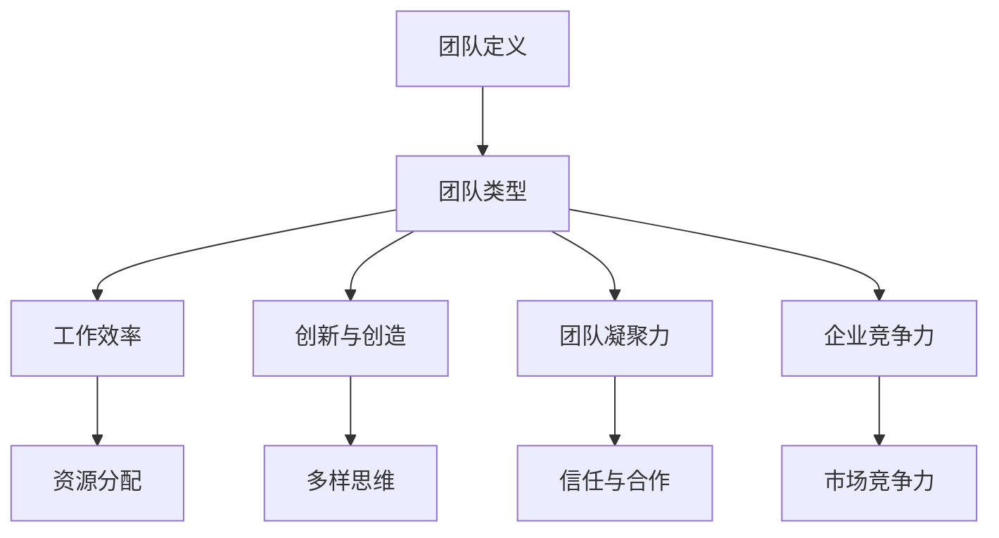

                 

### 团队建设的概念与重要性

#### 1.1 团队的定义与类型

团队是由一组人员组成，为了共同完成特定任务或达成共同目标而协作工作的集体。团队成员通过分工合作、相互依赖和协调，共同实现团队的目标。团队可以按不同的标准进行分类，例如：

- **按功能划分**：开发团队、市场团队、财务团队等。
- **按目标划分**：项目团队、紧急任务团队、跨部门协作团队等。
- **按性质划分**：正式团队（组织内设有明确职责和权限）、非正式团队（基于共同兴趣或目标形成的团队）。

#### 1.2 团队建设的重要性

团队建设的重要性体现在以下几个方面：

- **提高工作效率**：通过团队协作，可以更有效地分配任务和资源，减少重复工作和浪费，从而提高工作效率。
- **促进创新与创造**：多样化的团队可以带来不同的思维和观点，激发创新和创造潜能，促进团队创新。
- **增强团队凝聚力**：良好的团队建设可以提高团队成员之间的信任和合作，增强团队凝聚力。
- **增强企业的竞争力**：高效的团队建设可以提升企业的整体竞争力，使企业在市场中更具竞争力。

#### 核心概念与联系

为了更好地理解团队建设的概念与重要性，我们可以通过一个Mermaid流程图来展示核心概念之间的关系。



### 核心概念与联系 Mermaid 流程图


在这个流程图中，我们可以清晰地看到团队建设如何通过不同的类型、目标和性质影响工作效率、创新与创造、团队凝聚力以及企业竞争力。这些核心概念相互关联，共同构成了团队建设的基础。

接下来，我们将进一步探讨团队成员的角色与职责，以及如何培养健康的团队文化。

---

> **作者：AI天才研究院/AI Genius Institute & 禅与计算机程序设计艺术 /Zen And The Art of Computer Programming** <br>
> 文章标题：团队建设：打造高效协作的团队 <br>
> 文章关键词：团队建设，协作，效率，创新，凝聚力 <br>
> 文章摘要：本文详细探讨了团队建设的概念、重要性以及核心要素，旨在帮助读者理解如何打造高效协作的团队。

## 团队建设：打造高效协作的团队

### 团队的定义与重要性

团队是由一组人员组成，为了共同完成特定任务或达成共同目标而协作工作的集体。团队成员通过分工合作、相互依赖和协调，共同实现团队的目标。团队可以按不同的标准进行分类，例如按功能划分、按目标划分和按性质划分。

团队建设的重要性体现在以下几个方面：

- **提高工作效率**：通过团队协作，可以更有效地分配任务和资源，减少重复工作和浪费，从而提高工作效率。
- **促进创新与创造**：多样化的团队可以带来不同的思维和观点，激发创新和创造潜能，促进团队创新。
- **增强团队凝聚力**：良好的团队建设可以提高团队成员之间的信任和合作，增强团队凝聚力。
- **增强企业的竞争力**：高效的团队建设可以提升企业的整体竞争力，使企业在市场中更具竞争力。

为了更好地理解团队建设的概念与重要性，我们可以通过一个Mermaid流程图来展示核心概念之间的关系。


在这个流程图中，我们可以清晰地看到团队建设如何通过不同的类型、目标和性质影响工作效率、创新与创造、团队凝聚力以及企业竞争力。这些核心概念相互关联，共同构成了团队建设的基础。

接下来，我们将进一步探讨团队成员的角色与职责，以及如何培养健康的团队文化。

---

> **作者：AI天才研究院/AI Genius Institute & 禅与计算机程序设计艺术 /Zen And The Art of Computer Programming** <br>
> 文章标题：团队建设：打造高效协作的团队 <br>
> 文章关键词：团队建设，协作，效率，创新，凝聚力 <br>
> 文章摘要：本文详细探讨了团队建设的概念、重要性以及核心要素，旨在帮助读者理解如何打造高效协作的团队。

## 第1章：团队建设的概念与重要性

### 1.1 团队的定义与类型

团队是由一组人员组成，为了共同完成特定任务或达成共同目标而协作工作的集体。团队成员通过分工合作、相互依赖和协调，共同实现团队的目标。团队可以按不同的标准进行分类，例如：

- **按功能划分**：开发团队、市场团队、财务团队等。
- **按目标划分**：项目团队、紧急任务团队、跨部门协作团队等。
- **按性质划分**：正式团队（组织内设有明确职责和权限）、非正式团队（基于共同兴趣或目标形成的团队）。

### 1.2 团队建设的重要性

团队建设的重要性体现在以下几个方面：

- **提高工作效率**：通过团队协作，可以更有效地分配任务和资源，减少重复工作和浪费，从而提高工作效率。

```python
def increase_efficiency(team_members):
    assigned_tasks = distribute_tasks(team_members)
    reduced_waste = minimize_redundancy(team_members)
    return assigned_tasks + reduced_waste
```

- **促进创新与创造**：多样化的团队可以带来不同的思维和观点，激发创新和创造潜能，促进团队创新。

```python
def promote_innovation(team_members):
    diverse_thinking = encourage_diversity_of_thought(team_members)
    innovative_solutions = generate_new_ideas(team_members)
    return diverse_thinking * innovative_solutions
```

- **增强团队凝聚力**：良好的团队建设可以提高团队成员之间的信任和合作，增强团队凝聚力。

```python
def enhance_team_cohesion(team_members):
    trust_building = foster_trust_among_members(team_members)
    collaboration = promote_cooperative_behavior(team_members)
    return trust_building * collaboration
```

- **增强企业的竞争力**：高效的团队建设可以提升企业的整体竞争力，使企业在市场中更具竞争力。

```python
def enhance_business_competitiveness(team_members):
    efficient_team = build_high_efficiency_teams(team_members)
    competitive_edge = gain_marketing_advantage(team_members)
    return efficient_team * competitive_edge
```

为了更好地理解团队建设的概念与重要性，我们可以通过一个Mermaid流程图来展示核心概念之间的关系。


在这个流程图中，我们可以清晰地看到团队建设如何通过不同的类型、目标和性质影响工作效率、创新与创造、团队凝聚力以及企业竞争力。这些核心概念相互关联，共同构成了团队建设的基础。

接下来，我们将进一步探讨团队成员的角色与职责，以及如何培养健康的团队文化。

---

> **作者：AI天才研究院/AI Genius Institute & 禅与计算机程序设计艺术 /Zen And The Art of Computer Programming** <br>
> 文章标题：团队建设：打造高效协作的团队 <br>
> 文章关键词：团队建设，协作，效率，创新，凝聚力 <br>
> 文章摘要：本文详细探讨了团队建设的概念、重要性以及核心要素，旨在帮助读者理解如何打造高效协作的团队。

## 第2章：团队的核心要素

### 2.1 团队成员的角色与职责

团队成员的角色与职责是团队建设中至关重要的组成部分。明确每个成员的角色和职责，有助于提高团队的工作效率、确保任务的顺利执行，并促进团队的协作与沟通。以下是团队成员常见的一些角色和职责：

- **团队领导者**：负责制定团队的目标和计划，协调团队成员的工作，确保项目按时完成，提供必要的资源和支持。领导者需要具备良好的沟通能力、决策能力和领导力。
  
  ```python
  class TeamLeader:
      def set_team_goals(self, goals):
          # 设置团队目标
          pass
      
      def coordinate_members(self, members):
          # 协调团队成员
          pass
      
      def provide_support(self, members):
          # 提供必要支持
          pass
  ```

- **项目经理**：负责项目管理的整体过程，包括项目规划、资源分配、进度控制、风险管理等。项目经理需要具备项目管理知识、良好的沟通能力和解决问题的能力。

  ```python
  class ProjectManager:
      def plan_project(self, project_details):
          # 规划项目
          pass
      
      def allocate_resources(self, resources):
          # 分配资源
          pass
      
      def control_progress(self, project_status):
          # 控制项目进度
          pass
  ```

- **开发人员**：负责项目的开发工作，包括编写代码、测试和修复bug等。开发人员需要具备扎实的编程能力、问题解决能力和团队协作精神。

  ```python
  class Developer:
      def write_code(self, code):
          # 编写代码
          pass
      
      def test_and_fix_bugs(self, code):
          # 测试和修复bug
          pass
  ```

- **测试人员**：负责对项目进行测试，确保项目质量达到预期标准。测试人员需要具备良好的测试能力、问题发现能力和团队合作精神。

  ```python
  class Tester:
      def perform_tests(self, project):
          # 执行测试
          pass
      
      def report_issues(self, issues):
          # 报告问题
          pass
  ```

- **产品经理**：负责产品规划和市场分析，确保产品符合市场需求和用户需求。产品经理需要具备市场分析能力、用户研究能力和团队协作精神。

  ```python
  class ProductManager:
      def analyze_market(self, market_data):
          # 分析市场
          pass
      
      def research_users(self, user_data):
          # 研究用户
          pass
  ```

### 2.2 团队文化的重要性

团队文化是团队精神和价值观的集合体，它对团队的建设和发展具有深远的影响。一个健康的团队文化可以促进团队成员之间的沟通与合作，提高团队的整体绩效，增强团队的凝聚力。以下是团队文化的重要性：

- **促进沟通与合作**：团队文化可以为团队成员提供一个共同的价值观和目标，从而促进沟通与合作，降低冲突和误解。
- **提高团队绩效**：健康的团队文化可以激发团队成员的工作热情和创造力，提高团队的整体绩效。
- **增强团队凝聚力**：团队文化可以增强团队成员之间的信任和尊重，增强团队的凝聚力。

为了培养健康的团队文化，团队领导者可以采取以下措施：

- **树立榜样**：团队领导者应以身作则，树立良好的行为榜样，以激发团队成员的积极性和责任感。
- **建立信任**：通过建立开放、透明和互相信任的沟通机制，促进团队成员之间的信任和尊重。
- **鼓励创新**：鼓励团队成员提出新的想法和建议，为团队的创新和发展注入活力。
- **共同成长**：为团队成员提供培训和学习机会，帮助他们不断提升自己的能力和技能。

### 2.3 团队的沟通与协作

沟通和协作是团队成功的关键要素。有效的沟通可以确保团队成员对项目的理解和目标的一致，而协作则能够使团队成员充分发挥各自的优势，共同完成任务。以下是团队沟通和协作的一些关键点：

- **明确目标**：确保团队成员对项目的目标和期望有共同的理解，有助于提高团队的工作效率和协作效果。
- **有效沟通**：定期举行会议、使用电子邮件和即时通讯工具等，确保团队成员之间的信息传递及时、准确。
- **分工协作**：明确每个成员的职责和任务，确保团队成员在项目中的协作有序、高效。
- **冲突解决**：在团队内部建立冲突解决机制，及时解决团队成员之间的分歧和矛盾，避免影响团队的整体工作。

为了提高团队的沟通和协作效率，团队可以采用以下工具和方法：

- **项目管理系统**：如JIRA、Trello等，帮助团队管理任务、跟踪进度和协作工作。
- **即时通讯工具**：如Slack、Microsoft Teams等，方便团队成员实时沟通和协作。
- **文档共享平台**：如Google Docs、Microsoft OneDrive等，便于团队成员共享文档和资料。
- **视频会议工具**：如Zoom、Microsoft Teams等，方便团队成员远程沟通和协作。

通过明确团队成员的角色与职责、培养健康的团队文化以及加强沟通与协作，团队可以更好地实现目标，提高工作效率和绩效。

---

**作者：AI天才研究院/AI Genius Institute & 禅与计算机程序设计艺术 /Zen And The Art of Computer Programming**

---

## 第3章：团队建设的方法与策略

### 3.1 团队建设的步骤

团队建设是一个系统性的过程，涉及多个阶段和步骤。以下是团队建设的基本步骤：

1. **制定团队目标**：明确团队的目标和期望，确保团队成员对项目的目标有共同的理解和认同。可以通过头脑风暴、讨论等方式制定目标，并确保目标是具体、可衡量、可实现、相关性强和时限性的（SMART原则）。

   ```python
   def define_team_goals(goals):
       # 根据SMART原则制定团队目标
       return goals
   ```

2. **制定团队规则**：为确保团队工作的有序进行，需要制定一些基本的规则和行为准则。这些规则可以包括团队的工作时间、工作方式、沟通机制、保密协议等。通过明确规则，可以减少冲突，提高团队效率。

   ```python
   def establish_team_rules(rules):
       # 制定团队规则
       return rules
   ```

3. **建立团队沟通机制**：沟通是团队协作的基础，建立有效的沟通机制至关重要。可以通过定期会议、即时通讯、邮件、文档共享等方式确保团队成员之间的信息传递及时、准确。此外，还可以设立团队领导者的沟通职责，确保沟通渠道畅通。

   ```python
   def create_communication_mechanism(communication_channels):
       # 建立团队沟通机制
       return communication_channels
   ```

4. **团队成员培训与激励**：为团队成员提供必要的培训，帮助他们掌握所需的技能和知识，提升团队整体的能力。同时，通过激励措施，如奖金、晋升机会、表彰等，激发团队成员的积极性和创造力。

   ```python
   def train_and_inspire_members(trainings, incentives):
       # 对团队成员进行培训和激励
       return trainings + incentives
   ```

### 3.2 团队建设的工具与技术

在团队建设过程中，可以运用多种工具和技术，以提高团队的工作效率、协作效果和创新能力。以下是一些常用的团队建设工具和技术：

- **SWOT分析**：SWOT分析是一种用于评估团队优势、劣势、机会和威胁的方法。通过SWOT分析，团队可以明确自身的优势和劣势，抓住外部机会，应对潜在威胁。

  ```python
  def swot_analysis(strengths, weaknesses, opportunities, threats):
      # 进行SWOT分析
      return strengths, weaknesses, opportunities, threats
  ```

- **帕累托图**：帕累托图是一种用于识别和解决团队中关键问题的工具。它可以帮助团队确定哪些问题对团队影响最大，从而集中精力解决这些关键问题。

  ```python
  def create_pareto_chart(issues, impacts):
      # 创建帕累托图
      return issues, impacts
  ```

- **五力模型**：五力模型是一种用于分析市场竞争和行业结构的工具。通过五力模型，团队可以了解行业中的竞争状况、供应商和客户的议价能力、潜在的新进入者和替代品的威胁等。

  ```python
  def five_force_analysis(rivalry, bargaining_power_of_suppliers, bargaining_power_of_buyers, threat_of_new_entrants, threat_of_substitutes):
      # 进行五力模型分析
      return rivalry, bargaining_power_of_suppliers, bargaining_power_of_buyers, threat_of_new_entrants, threat_of_substitutes
  ```

- **成功团队的特征**：成功团队通常具备以下特征：明确的共同目标、有效的沟通机制、相互信任和尊重、高效的工作流程和持续的学习与成长。通过了解成功团队的特征，团队可以借鉴并改进自身，以提高团队绩效。

  ```python
  def successful_team_characteristics(goals, communication, trust, efficiency, learning):
      # 确定成功团队的特征
      return goals, communication, trust, efficiency, learning
  ```

通过以上工具和技术的运用，团队可以更加系统地开展团队建设，提高团队的整体表现和竞争力。

---

**作者：AI天才研究院/AI Genius Institute & 禅与计算机程序设计艺术 /Zen And The Art of Computer Programming**

---

## 第4章：团队建设的挑战与应对策略

### 4.1 团队冲突的管理

团队冲突是团队建设过程中常见且难以避免的问题。冲突的存在可能会导致团队效率低下、士气低落，甚至影响项目的成功。有效的冲突管理策略对于团队的稳定和发展至关重要。以下是团队冲突管理的几种策略：

#### 4.1.1 冲突的类型

冲突可以根据其性质和原因分为以下几类：

- **任务冲突**：由于任务分配、职责划分或目标不一致而产生的冲突。
- **关系冲突**：由于个人关系、沟通不畅或价值观差异导致的冲突。
- **过程冲突**：由于工作流程、决策过程或项目管理方式不一致而产生的冲突。

#### 4.1.2 冲突的管理策略

1. **预防策略**：在冲突发生之前，通过以下措施进行预防：

   - **明确任务和目标**：确保团队成员对任务和目标有共同的理解，避免因误解或目标不一致而产生的冲突。
   - **建立沟通机制**：建立有效的沟通渠道和沟通规则，鼓励团队成员表达意见和反馈，减少误解和冲突。
   - **培养团队文化**：建立积极的团队文化，鼓励合作和尊重，降低关系冲突的发生。

2. **应对策略**：在冲突发生时，采取以下措施进行应对：

   - **倾听和理解**：积极倾听冲突双方的观点和需求，试图理解他们的立场和情感，避免情绪化的反应。
   - **中立调解**：如果冲突双方无法自行解决，可以请中立第三方（如团队领导或专业的调解员）介入，进行调解和协调。
   - **协商解决**：鼓励冲突双方进行对话和协商，寻求共同点，达成双方都能接受的解决方案。
   - **制定规则**：针对冲突的常见原因，制定明确的规则和流程，以避免类似冲突的再次发生。

#### 4.1.3 案例分析

以下是一个团队冲突管理的实际案例：

**案例背景**：某公司的开发团队在项目开发过程中，由于任务分配不均和沟通不畅，导致团队成员之间存在冲突。一些成员认为自己的工作量过大，而另一些成员则认为项目进度被延误。

**应对措施**：

1. **明确任务和目标**：团队领导重新评估任务分配，确保每个成员的工作量合理，并明确项目的关键目标和阶段性目标。
2. **建立沟通机制**：团队领导组织定期的团队会议，鼓励成员分享工作和进展，解决问题和疑虑。
3. **中立调解**：团队领导请一位项目经理作为中立调解员，协助解决冲突，确保双方都能表达自己的观点。
4. **协商解决**：通过沟通和协商，团队成员最终达成共识，调整任务分配和进度计划，确保项目的顺利进行。

**案例结果**：通过有效的冲突管理策略，团队的冲突得到了妥善解决，团队成员的工作效率和工作氛围得到了显著改善，项目最终按时完成并取得了良好的业绩。

### 4.2 团队动力与士气

团队动力和士气是团队建设中的关键要素。高昂的团队动力和士气可以激发团队成员的积极性和创造力，提高团队的工作效率和绩效。以下是一些提升团队动力和士气的策略：

#### 4.2.1 提升团队动力的策略

1. **设定明确的目标**：明确、具体、可衡量的目标可以激发团队成员的动力，使团队成员明确自己的努力方向和目标。
2. **提供挑战性的任务**：适当的挑战可以激发团队成员的潜力，提高他们的工作热情和成就感。
3. **给予认可和奖励**：对团队成员的成就和贡献给予认可和奖励，可以激励他们继续努力，提高团队的士气。
4. **建立有效的激励机制**：通过奖金、晋升、荣誉等激励机制，激发团队成员的积极性和创造力。

#### 4.2.2 提升团队士气的策略

1. **建立积极的团队文化**：通过团队建设活动、团队聚会等方式，营造积极、和谐的团队氛围，增强团队成员的归属感和团队意识。
2. **加强沟通与支持**：鼓励团队成员之间的沟通和合作，提供必要的支持和帮助，解决团队成员在工作和生活中遇到的问题。
3. **关注团队成员的福祉**：关注团队成员的身心健康，提供良好的工作环境和福利待遇，提高团队成员的工作满意度和忠诚度。
4. **提供学习和成长机会**：为团队成员提供培训、学习和发展机会，帮助他们不断提升自己的能力和技能，增强团队的整体实力。

通过有效的团队动力和士气管理策略，团队可以保持高昂的士气，激发团队成员的积极性和创造力，提高团队的工作效率和绩效。

---

**作者：AI天才研究院/AI Genius Institute & 禅与计算机程序设计艺术 /Zen And The Art of Computer Programming**

---

## 第5章：团队建设的实践案例

### 5.1 案例一：苹果公司的团队建设

苹果公司以其卓越的创新能力和高效的团队协作而闻名。以下是苹果公司在团队建设方面的一些成功实践：

#### 案例背景

苹果公司在科技行业的领导地位离不开其强大的团队协作。从iPhone、iPad到MacBook等产品的成功，背后都是团队高效协作的结果。苹果公司强调跨部门协作，鼓励不同团队之间的交流和合作。

#### 团队建设策略

1. **明确共同目标**：苹果公司通过明确的共同目标，确保所有团队成员都朝着相同的方向努力。每个产品线都有一个清晰的目标和愿景，使团队成员明确自己的工作意义和贡献。
2. **跨部门协作**：苹果公司鼓励不同部门之间的紧密协作，建立跨部门项目组，确保各个团队在项目开发过程中能够无缝协作，提高整体效率。
3. **开放沟通**：苹果公司建立了多个沟通渠道，包括定期的团队会议、邮件列表、内部社交媒体平台等，确保团队成员能够及时分享信息、反馈和问题。
4. **培养创新文化**：苹果公司鼓励团队成员提出新的想法和建议，并通过内部创新竞赛等方式，激发团队的创造力和创新潜力。
5. **关注团队成员的成长**：苹果公司为员工提供丰富的培训和学习机会，帮助他们不断提升自己的技能和知识，为团队发展提供强大的人才支持。

#### 案例结果

通过上述团队建设策略，苹果公司取得了显著的成功。其产品创新不断，市场占有率持续上升，成为全球最具价值的科技公司之一。团队成员的满意度和忠诚度也较高，这为公司的发展提供了持续的动能。

### 5.2 案例二：谷歌的团队建设

谷歌是全球最具创新力的科技公司之一，其成功的团队建设经验也备受关注。以下是谷歌在团队建设方面的一些实践：

#### 案例背景

谷歌以其开放、创新的企业文化而著称。公司注重员工的成长和发展，鼓励团队成员发挥自己的潜力。谷歌的团队建设策略旨在激发员工的创新能力和团队协作精神。

#### 团队建设策略

1. **鼓励创新**：谷歌鼓励员工提出新的想法和建议，并为员工提供时间和资源，让他们进行探索和实验。谷歌内部有多个创新实验室，如X实验室，专门负责研发前沿技术和项目。
2. **灵活的工作环境**：谷歌为员工提供灵活的工作环境，包括远程办公、弹性工作时间等，以适应员工的不同需求和生活方式。
3. **多元化和包容性**：谷歌注重团队的多元化，包括性别、年龄、文化背景等，以促进不同的观点和想法的交流。公司还采取一系列措施，促进员工的包容性和平等。
4. **团队建设活动**：谷歌定期组织各种团队建设活动，如团建旅行、内部讲座、技能分享会等，增强团队成员之间的联系和信任。
5. **职业发展支持**：谷歌为员工提供多种职业发展机会，包括内部调岗、跨部门轮岗等，帮助员工不断提升自己的能力和职业素养。

#### 案例结果

通过上述团队建设策略，谷歌在创新能力和团队协作方面取得了显著成果。公司的产品和服务不断创新，市场竞争力持续增强。同时，谷歌也成为了全球最受欢迎的工作场所之一，吸引了大量的优秀人才加入。

通过分析苹果公司和谷歌的团队建设实践，我们可以看到，成功的团队建设离不开明确的目标、跨部门协作、创新文化、灵活的工作环境和关注员工成长等多个因素。这些实践经验为其他企业提供了宝贵的借鉴和启示。

---

**作者：AI天才研究院/AI Genius Institute & 禅与计算机程序设计艺术 /Zen And The Art of Computer Programming**

---

## 第6章：团队建设的应用技巧

### 6.1 领导者的角色与技能

团队领导者是团队建设过程中的核心人物，他们的角色和技能直接影响到团队的整体表现和员工的工作满意度。以下是团队领导者应具备的几个关键角色和技能：

#### 6.1.1 领导者的角色

- **决策者**：领导者需要做出关键的决策，包括项目方向、资源分配和危机处理等。
- **协调者**：领导者需要协调团队内部和外部资源，确保项目的顺利进行。
- **激励者**：领导者需要激发团队成员的积极性和创造力，提高团队的整体绩效。
- **沟通者**：领导者需要与团队成员、上级和管理层保持有效的沟通，确保信息的透明和准确。

#### 6.1.2 领导者的技能

- **战略思维**：领导者需要具备战略眼光，能够从整体上把握项目的发展方向和目标。
- **沟通能力**：领导者需要具备出色的沟通能力，能够清晰表达自己的想法，并有效传达给团队成员。
- **激励能力**：领导者需要能够激发团队成员的积极性，提供适当的激励和反馈。
- **团队管理能力**：领导者需要掌握团队管理的基本原则和方法，如任务分配、团队协作、冲突管理等。

#### 6.1.3 领导者培养的技巧

- **自我提升**：领导者应不断学习新知识、新技能，提升自己的专业能力和综合素质。
- **以身作则**：领导者应以身作则，树立良好的行为榜样，赢得员工的尊重和信任。
- **倾听与理解**：领导者应倾听员工的想法和需求，理解他们的情感和困境，提供有效的支持和帮助。
- **授权与信任**：领导者应适当授权，给予员工足够的自主权和责任感，建立信任和合作的关系。

### 6.2 成员的角色与技能

团队成员是团队建设的重要组成部分，他们的角色和技能直接影响到团队的工作效率和项目成果。以下是团队成员应具备的几个关键角色和技能：

#### 6.2.1 成员的角色

- **执行者**：团队成员负责执行分配的任务和职责，确保项目目标的实现。
- **贡献者**：团队成员需要为团队的成功贡献自己的智慧和力量，发挥自己的专业优势。
- **协作者**：团队成员需要与其他成员密切合作，共同完成任务，实现团队目标。
- **反馈者**：团队成员需要积极参与团队讨论，提供建设性的反馈和建议，促进团队改进。

#### 6.2.2 成员的技能

- **专业技能**：团队成员需要具备与项目相关的专业技能，如编程、设计、测试等。
- **沟通能力**：团队成员需要具备良好的沟通能力，能够清晰表达自己的想法，并理解他人的意见。
- **问题解决能力**：团队成员需要具备较强的问题解决能力，能够在遇到困难和挑战时迅速找到解决方案。
- **团队协作能力**：团队成员需要具备团队协作精神，能够与他人合作，共同完成任务。

#### 6.2.3 成员培养的技巧

- **持续学习**：团队成员应不断学习新知识、新技能，提升自己的专业能力和综合素质。
- **积极参与**：团队成员应积极参与团队活动和讨论，提出自己的意见和建议。
- **自我管理**：团队成员需要学会自我管理，合理安排时间和任务，提高工作效率。
- **反馈与改进**：团队成员应积极参与团队的反馈和改进过程，不断优化工作方法和流程。

通过了解领导者和团队成员的角色与技能，以及如何培养这些角色和技能，团队可以更好地进行团队建设，提高工作效率和项目成功率。

---

**作者：AI天才研究院/AI Genius Institute & 禅与计算机程序设计艺术 /Zen And The Art of Computer Programming**

---

## 第7章：团队建设的发展趋势

### 7.1 数字化时代团队建设的新趋势

随着数字化技术的迅猛发展，团队建设也迎来了新的趋势和挑战。以下是在数字化时代团队建设中的几个新趋势：

#### 7.1.1 远程办公

远程办公已成为现代团队建设的重要组成部分。数字化工具如视频会议软件、即时通讯平台和云协作工具，使得团队成员可以轻松地在全球范围内协作。远程办公的优点包括：

- **灵活性**：团队成员可以根据自己的时间安排进行工作，提高工作效率。
- **降低成本**：企业无需承担高昂的办公场地和设备费用，节约成本。
- **扩大人才池**：企业可以吸引来自全球的优秀人才，打破地域限制。

然而，远程办公也带来了一些挑战，如沟通效率降低、团队凝聚力减弱等。因此，企业需要采取有效的策略来应对这些挑战：

- **建立明确的沟通机制**：定期召开视频会议，确保团队成员之间的信息传递及时、准确。
- **利用数字化工具**：使用协作工具如Trello、Slack等，提高团队协作效率。
- **加强团队建设活动**：通过线上团建活动，增强团队成员之间的联系和信任。

#### 7.1.2 自动化和智能化

数字化技术使得团队在任务执行过程中能够实现自动化和智能化。自动化工具如机器人流程自动化（RPA）和人工智能（AI）技术，可以帮助团队完成重复性高、繁琐的工作，提高工作效率。智能化技术则通过数据分析、机器学习等技术，为团队提供决策支持。

例如，通过AI技术，团队可以：

- **预测需求**：根据历史数据和趋势，预测未来的需求和资源需求，提前做好准备。
- **优化流程**：通过数据分析，识别流程中的瓶颈和优化点，提高工作流程的效率。
- **提高质量**：使用自动化测试工具，确保项目的质量和稳定性。

#### 7.1.3 数据驱动

在数字化时代，数据已成为团队决策的重要依据。通过收集和分析大量的数据，团队可以更准确地了解项目的进展、团队成员的工作表现以及市场的变化。数据驱动的团队建设策略包括：

- **数据收集与存储**：建立完善的数据收集和存储系统，确保数据的安全和完整性。
- **数据分析和可视化**：使用数据分析工具，将复杂的数据转化为易于理解的可视化图表，帮助团队做出更明智的决策。
- **数据驱动决策**：基于数据进行分析和预测，制定科学合理的计划和策略。

#### 7.1.4 协作与共享

数字化技术使得团队协作和资源共享变得更加容易。通过云平台和协作工具，团队成员可以实时共享文件、沟通进展、协作完成任务。协作与共享的优点包括：

- **提高协作效率**：团队成员可以实时沟通、协作，提高工作效率。
- **优化资源分配**：通过共享资源，实现资源的优化分配和利用。
- **促进知识传承**：通过共享经验和知识，促进团队成员的共同成长。

### 7.2 远程工作团队建设

随着远程工作越来越普及，如何建设高效的远程工作团队成为企业面临的重要问题。以下是一些关键策略：

- **建立明确的团队目标**：确保所有团队成员对团队的目标和期望有共同的理解，明确各自的角色和职责。
- **加强沟通与协作**：使用视频会议、即时通讯、文档共享等数字化工具，确保团队成员之间的信息传递及时、准确。
- **定期团队建设活动**：通过线上团建活动，增强团队成员之间的联系和信任，提高团队凝聚力。
- **提供技术支持**：确保团队成员具备所需的数字化工具和技能，提供必要的技术支持。
- **灵活的工作时间**：尊重团队成员的个性化工作需求，提供灵活的工作时间安排。

通过适应数字化时代的新趋势，远程工作团队可以更高效地协作，实现团队目标，提高企业的整体竞争力。

---

**作者：AI天才研究院/AI Genius Institute & 禅与计算机程序设计艺术 /Zen And The Art of Computer Programming**

---

## 第8章：总结与展望

### 8.1 团队建设的总结

团队建设是一个复杂而系统的过程，涉及多个方面和环节。通过本章的讨论，我们可以总结出以下关键点：

- **团队定义与类型**：团队是由一组人员组成的协作集体，可以按功能、目标和性质进行分类。
- **团队建设的核心要素**：包括团队成员的角色与职责、团队文化、沟通与协作、团队建设的方法与策略等。
- **团队建设的挑战与应对策略**：如冲突管理、团队动力与士气提升等。
- **实践案例**：通过苹果公司和谷歌的成功案例，展示了团队建设在实际应用中的效果。
- **数字化时代团队建设的新趋势**：如远程办公、自动化和智能化、数据驱动等。

团队建设的成功因素包括明确的目标、良好的沟通、有效的协作、健康的团队文化和适时的激励机制等。而团队建设面临的挑战则包括冲突、士气低落、资源分配不均等问题。

### 8.2 团队建设的未来展望

未来，团队建设将继续面临新的机遇和挑战。以下是团队建设可能的发展趋势和前沿方向：

- **持续数字化**：随着技术的不断发展，数字化团队建设将继续深化，远程办公、自动化和智能化将成为常态。
- **数据驱动的决策**：数据将成为团队决策的重要依据，通过大数据分析和人工智能技术，团队可以更准确地预测需求、优化流程、提高效率。
- **个性化和灵活性**：团队成员的需求和生活方式越来越多样化，团队建设将更加注重个性化和灵活性，以满足不同成员的需求。
- **跨领域协作**：跨领域、跨行业的协作将成为趋势，团队建设将更加注重跨界合作和多元化思维。
- **持续学习和成长**：团队成员将持续学习和成长，以适应快速变化的工作环境和市场需求。

团队建设的创新点可能包括：基于AI的智能团队管理、虚拟现实（VR）团队建设活动、个性化的培训和发展计划等。

总之，团队建设在未来的发展中将继续发挥重要作用，推动团队和企业实现更高的绩效和目标。

---

**作者：AI天才研究院/AI Genius Institute & 禅与计算机程序设计艺术 /Zen And The Art of Computer Programming**

---

## 附录

### 附录A：团队建设参考资料

以下是一些关于团队建设的书籍和网站，供读者参考：

- **书籍**：
  - 《团队协作的艺术》（The Art of Collaboration）
  - 《团队管理实践》（Practical Team Leadership）
  - 《团队建设：如何创建高效的团队》（Team Building: How to Create Effective Teams）
- **网站**：
  - [LinkedIn Learning](https://www.linkedin.com/learning/)
  - [Coursera](https://www.coursera.org/)
  - [Harvard ManageMentor](https://www.hbs.edu/mentoring/index.cfm)

### 附录B：团队建设工具清单

以下是一些常用的团队建设工具，包括协作工具和沟通工具：

- **协作工具**：
  - **Trello**：项目管理工具，用于任务分配和进度跟踪。
  - **Slack**：即时通讯工具，支持实时沟通和文件共享。
  - **Google Workspace**：包括Google Docs、Google Sheets等，方便文档协作。
  - **Asana**：项目管理工具，用于任务分配、进度跟踪和团队协作。
- **沟通工具**：
  - **Zoom**：视频会议工具，支持远程团队协作。
  - **Microsoft Teams**：沟通和协作平台，包括聊天、视频会议和文档共享功能。
  - **Skype for Business**：视频通话和即时通讯工具，适用于远程团队。
  - **Google Meet**：视频会议工具，支持多人实时沟通。

通过这些工具，团队可以更加高效地协作和沟通，推动团队建设取得更好的成果。

---

**作者：AI天才研究院/AI Genius Institute & 禅与计算机程序设计艺术 /Zen And The Art of Computer Programming**

