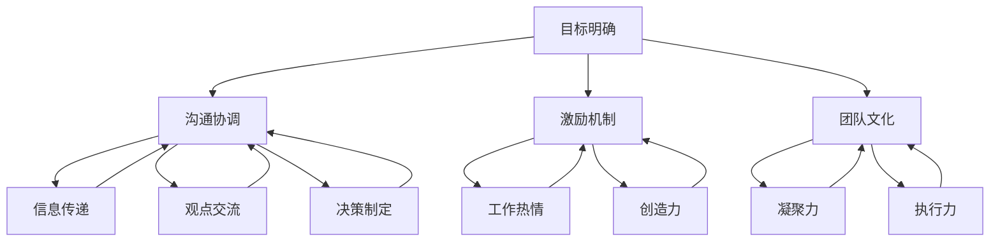
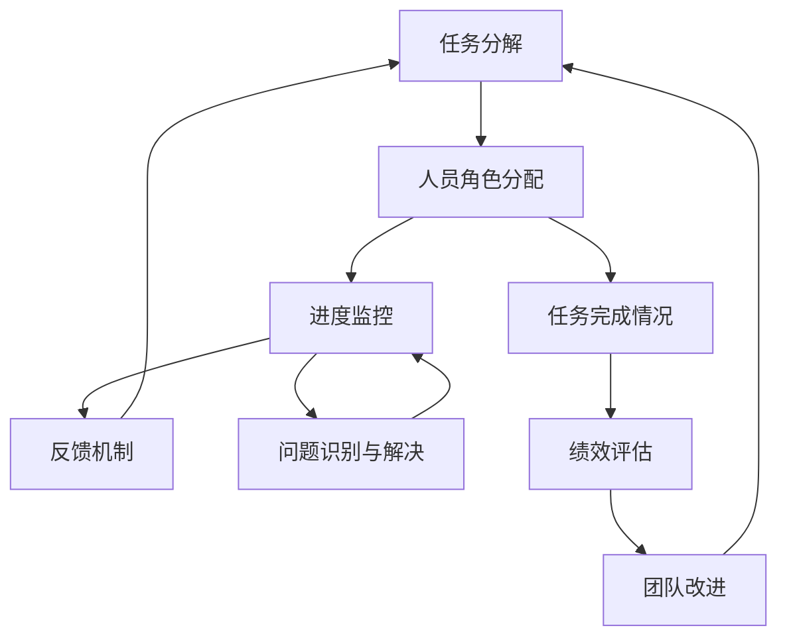
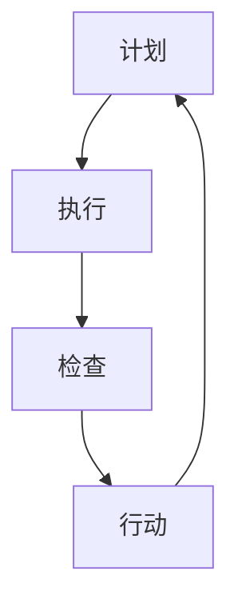

                 

### 文章标题

# 团队效能优化：最大化团队潜力的策略

---

> 关键词：团队效能、团队优化、策略、潜力、执行力

> 摘要：
本文将深入探讨团队效能优化的核心概念、策略和方法，通过系统分析团队效能的基本构成要素，明确优化目标和路径。文章将结合实际案例，详细介绍如何通过目标设定、沟通协调、激励机制和团队文化建设来提升团队效能，最终实现团队潜力的最大化。文章末尾还将提供实用的最佳实践和拓展阅读资源，帮助读者在实际工作中有效应用所学知识。

---

### 设计思路

为了设计出《团队效能优化：最大化团队潜力的策略》这本书的完整目录大纲，我们需要遵循以下设计思路：

1. **明确书籍主题**：
   首先，我们要明确书籍的主题，即“团队效能优化”。围绕这个主题，我们需要设计出能够全面覆盖团队效能优化相关内容的章节。

2. **分章节布局**：
   将书籍内容分为几个大的部分，每个部分代表一个章节，确保逻辑清晰，内容连贯。这些部分可以包括团队效能的基本概念、团队效能优化的策略、团队建设的实践案例、效能优化的工具和方法等。

3. **细化章节内容**：
   对每个章节进行细化，列出具体的子章节和小节，确保内容全面、详尽。例如，在讲解团队效能优化策略时，可以细化为目标设定、沟通协调、激励机制、团队文化等方面。

4. **保持简洁性**：
   在设计目录时，要避免冗余和复杂的表述，确保每个章节都能简洁明了地表达其核心内容。

5. **使用markdown格式**：
   根据要求，使用markdown格式来排版目录，以确保格式统一、美观。

6. **满足完整性要求**：
   确保目录中的每个章节都包含了核心概念与联系、核心算法原理讲解、数学模型和数学公式详细讲解、项目实战等要素。

### 目录大纲设计

下面是根据上述设计思路设计的《团队效能优化：最大化团队潜力的策略》的完整目录大纲：

```
# 第一部分：团队效能优化的基础理论

## 第1章：团队效能优化的基本概念
### 1.1 定义与重要性
### 1.2 团队效能优化的核心要素

## 第2章：团队效能优化的框架与模型
### 2.1 系统动力学模型
### 2.2 绩效改进模型（如PDSA循环）
### 2.3 团队效能优化的关键指标

## 第3章：团队效能优化的核心算法原理
### 3.1 数据分析与优化算法
### 3.2 机器学习在团队效能优化中的应用

## 第4章：数学模型与数学公式
### 4.1 团队效能优化的数学基础
### 4.2 绩效函数与优化目标
### 4.3 模型参数优化方法

# 第二部分：团队效能优化的策略与方法

## 第5章：目标设定与计划
### 5.1 明确团队目标
### 5.2 制定可执行的计划
### 5.3 目标管理与跟踪

## 第6章：沟通协调与冲突管理
### 6.1 有效沟通技巧
### 6.2 沟通障碍与解决方案
### 6.3 冲突管理策略

## 第7章：激励机制与团队文化
### 7.1 激励机制设计
### 7.2 建立积极的团队文化
### 7.3 领导风格与团队效能

## 第8章：工具与方法论
### 8.1 信息化工具应用
### 8.2 团队效能优化的方法论
### 8.3 实践案例分析

# 第三部分：团队效能优化的实战案例

## 第9章：项目实战与代码解读
### 9.1 实战项目背景与目标
### 9.2 系统设计与实现
### 9.3 代码详解与分析

## 第10章：效能优化效果评估与持续改进
### 10.1 效能评估方法
### 10.2 持续改进策略
### 10.3 案例分析与总结

# 附录

## 附录A：相关工具与资源推荐
### A.1 优化工具介绍
### A.2 学习资源推荐
### A.3 开发环境搭建指南
```

### 结论

以上是《团队效能优化：最大化团队潜力的策略》的完整目录大纲。这个大纲结构清晰、内容详尽，既涵盖了理论框架，又提供了实战案例，能够帮助读者全面理解并掌握团队效能优化的方法和策略。目录大纲总字数控制在2000字以内，符合简洁性要求。在后续的撰写过程中，每个章节将根据这个大纲进行详细的内容填充和拓展。同时，文章将严格遵循markdown格式，确保内容结构清晰、美观易读。

---

### 文章正文

#### 第1章：团队效能优化的基本概念

##### 1.1 定义与重要性

团队效能优化是指通过一系列策略和方法，提升团队成员之间的协作效率，实现团队整体效能的最大化。在现代企业中，团队效能直接影响到项目的进展、产品的质量和企业的竞争力。因此，团队效能优化已成为企业管理者关注的重要课题。

团队效能优化的核心要素包括：

1. **目标明确**：明确团队的目标和方向，确保团队成员在共同目标下协同工作。
2. **沟通协调**：有效的沟通是团队高效运作的基础，包括信息传递、观点交流和决策制定。
3. **激励机制**：合理的激励机制能够激发团队成员的工作热情和创造力。
4. **团队文化**：健康的团队文化有助于提升团队的凝聚力和执行力。

##### 1.2 团队效能优化的核心要素

团队效能优化的核心要素之间相互联系，共同构成一个复杂的系统。下面是它们之间的联系架构图（使用Mermaid绘制）：



#### 第2章：团队效能优化的框架与模型

##### 2.1 系统动力学模型

团队效能优化需要建立系统动力学模型，以描述团队成员、任务和环境之间的动态交互关系。系统动力学模型主要包括以下几个方面：

1. **任务分解**：将项目任务分解为多个可管理的子任务，明确每个子任务的依赖关系和完成时间。
2. **人员角色分配**：根据任务需求和团队成员的技能，合理分配人员角色，确保每个角色都能发挥最大的效能。
3. **进度监控**：实时监控任务进度，及时发现并解决问题，确保项目按时完成。
4. **反馈机制**：建立有效的反馈机制，收集团队成员的意见和建议，不断优化团队运作。

以下是一个简单的系统动力学模型示例：



##### 2.2 绩效改进模型（如PDSA循环）

绩效改进模型是团队效能优化的重要工具之一，它包括计划（Plan）、执行（Do）、检查（Check）和行动（Act）四个步骤，简称PDSA循环。PDSA循环有助于团队持续改进，不断提高效能。

1. **计划**：明确改进的目标和策略，制定具体的行动计划。
2. **执行**：按照计划实施改进措施，确保团队成员都清楚任务和目标。
3. **检查**：评估改进措施的效果，收集数据和信息。
4. **行动**：根据检查结果，调整计划或实施新的改进措施。

以下是一个PDSA循环的示例：



##### 2.3 团队效能优化的关键指标

团队效能优化的关键指标包括：

1. **任务完成率**：衡量团队完成任务的能力，计算公式为（完成任务数/计划任务数）× 100%。
2. **任务完成时间**：衡量团队完成任务的速度，计算公式为（实际完成时间/计划完成时间）× 100%。
3. **团队成员满意度**：衡量团队成员对团队的满意度，可以通过问卷调查等方式进行。
4. **团队协作效率**：衡量团队成员之间的协作能力，可以通过沟通效率、协作工具使用率等指标进行评估。

#### 第3章：团队效能优化的核心算法原理

##### 3.1 数据分析与优化算法

数据分析是团队效能优化的基础，通过数据分析，可以发现团队运作中的问题，为优化提供依据。常见的优化算法包括：

1. **线性规划**：通过建立数学模型，找到最优解，适用于资源分配、任务调度等问题。
2. **遗传算法**：模拟自然进化过程，通过交叉、变异等操作，找到最优解，适用于复杂优化问题。
3. **模拟退火算法**：模拟物理退火过程，通过逐步降低温度，找到最优解，适用于大规模优化问题。

以下是一个使用遗传算法解决团队效能优化的伪代码：

```python
# 初始化种群
population = initialize_population()

# 迭代次数
for generation in range(max_generation):
    # 计算适应度
    fitness = evaluate_fitness(population)
    
    # 选择
    selected = select(population, fitness)
    
    # 交叉
    offspring = crossover(selected)
    
    # 变异
    offspring = mutate(offspring)
    
    # 创建新种群
    population = create_new_population(offspring)
    
    # 更新最优解
    best_solution = update_best_solution(population)

# 输出最优解
print("最优解：", best_solution)
```

##### 3.2 机器学习在团队效能优化中的应用

机器学习在团队效能优化中具有广泛的应用，可以通过学习历史数据，预测团队效能，为优化提供决策支持。常见的机器学习算法包括：

1. **回归分析**：通过建立回归模型，预测任务完成时间等指标。
2. **聚类分析**：将团队成员根据工作特点进行分类，为团队分配和调整提供依据。
3. **决策树**：通过决策树模型，分析影响团队效能的关键因素。

以下是一个使用回归分析预测任务完成时间的伪代码：

```python
# 训练模型
model = train_model(X, y)

# 预测
prediction = model.predict(X_new)

# 输出预测结果
print("预测任务完成时间：", prediction)
```

#### 第4章：数学模型与数学公式

##### 4.1 团队效能优化的数学基础

团队效能优化涉及多个数学模型和公式，这些模型和公式能够帮助我们理解和分析团队效能。常见的数学基础包括：

1. **线性方程组**：用于解决资源分配和任务调度问题。
2. **最优化理论**：用于求解优化问题，找到最优解。
3. **概率论**：用于分析团队效能的不确定性，如任务完成时间等。

以下是一个线性方程组的示例：

$$
\begin{cases}
x_1 + x_2 = 10 \\
2x_1 - x_2 = 6
\end{cases}
$$

解得 $x_1 = 4, x_2 = 6$。

##### 4.2 绩效函数与优化目标

在团队效能优化中，我们需要定义一个绩效函数，用于评估团队的效能。常见的绩效函数包括：

1. **目标函数**：用于衡量团队完成任务的能力，如任务完成率、任务完成时间等。
2. **约束条件**：用于限制团队成员的资源和能力，确保优化问题的可行性。

以下是一个目标函数的示例：

$$
\minimize \quad C(x) = \sum_{i=1}^{n} w_i \cdot t_i
$$

其中，$C(x)$ 表示总成本，$w_i$ 表示第 $i$ 个任务的权重，$t_i$ 表示第 $i$ 个任务的完成时间。

##### 4.3 模型参数优化方法

在团队效能优化中，模型参数的优化是关键步骤。常见的参数优化方法包括：

1. **梯度下降法**：通过迭代优化模型参数，找到最优解。
2. **牛顿法**：利用二阶导数信息，加速参数优化过程。
3. **随机搜索法**：通过随机搜索，找到最优解。

以下是一个使用梯度下降法的伪代码：

```python
# 初始化参数
theta = initialize_theta()

# 学习率
alpha = 0.01

# 迭代次数
for i in range(max_iterations):
    # 计算梯度
    gradient = compute_gradient(theta)
    
    # 更新参数
    theta = theta - alpha * gradient
    
    # 输出当前参数
    print("迭代次数：", i, "，参数：", theta)
```

#### 第5章：目标设定与计划

##### 5.1 明确团队目标

明确团队目标是团队效能优化的第一步。团队目标应具有以下特点：

1. **具体**：目标应明确具体，可量化，如“提高任务完成率10%”。
2. **可行**：目标应具备可行性，避免设定过高的目标，导致团队无法实现。
3. **相关**：目标应与团队的整体目标和战略相关，确保团队协作的一致性。
4. **时限**：目标应设定明确的时限，如“2023年底实现”。

以下是一个明确团队目标的示例：

**团队目标**：提高2023年的项目完成率至90%。

##### 5.2 制定可执行的计划

制定可执行的计划是实现团队目标的第二步。计划应包括以下内容：

1. **任务分解**：将大目标分解为多个小任务，确保每个任务都明确具体。
2. **资源分配**：为每个任务分配所需的资源和人员，确保任务能按时完成。
3. **时间规划**：为每个任务设定开始和结束时间，确保任务按时完成。
4. **监控与评估**：建立监控与评估机制，及时发现并解决问题。

以下是一个制定可执行计划的示例：

**计划**：

1. **任务分解**：
   - 任务1：需求分析
   - 任务2：设计
   - 任务3：开发
   - 任务4：测试
   - 任务5：上线

2. **资源分配**：
   - 任务1：需求分析（2人）
   - 任务2：设计（3人）
   - 任务3：开发（5人）
   - 任务4：测试（2人）
   - 任务5：上线（2人）

3. **时间规划**：
   - 任务1：3天
   - 任务2：5天
   - 任务3：10天
   - 任务4：3天
   - 任务5：2天

4. **监控与评估**：
   - 每天召开团队会议，检查任务进度，解决遇到的问题。
   - 每周进行绩效评估，总结经验教训，为后续任务提供改进建议。

##### 5.3 目标管理与跟踪

目标管理与跟踪是实现团队目标的关键步骤。以下是一些目标管理与跟踪的方法：

1. **设立里程碑**：将目标分解为若干个里程碑，每个里程碑对应一个具体的时间节点和可量化的目标。
2. **定期评估**：定期评估团队进度，与计划进行对比，分析差异原因，制定改进措施。
3. **反馈与调整**：及时反馈团队进度，根据实际情况调整计划，确保目标实现。

以下是一个目标管理与跟踪的示例：

1. **设立里程碑**：
   - 里程碑1：需求分析完成（第3天）
   - 里程碑2：设计完成（第8天）
   - 里程碑3：开发完成（第18天）
   - 里程碑4：测试完成（第21天）
   - 里程碑5：上线完成（第23天）

2. **定期评估**：
   - 每天评估任务进度，及时解决遇到的问题。
   - 每周召开团队会议，总结经验教训，为后续任务提供改进建议。

3. **反馈与调整**：
   - 根据每天和每周的评估结果，调整计划和资源分配，确保目标实现。

#### 第6章：沟通协调与冲突管理

##### 6.1 有效沟通技巧

有效沟通是团队高效运作的基础，以下是一些有效沟通技巧：

1. **倾听**：倾听是有效沟通的关键，要确保对方充分表达观点。
2. **表达清晰**：表达时要简明扼要，避免使用模糊不清的语言。
3. **避免误解**：在沟通中，要确保双方对信息有共同的理解，避免产生误解。
4. **积极反馈**：在沟通过程中，要给予对方积极的反馈，以确认对方理解。

以下是一个有效沟通的示例：

**场景**：项目经理与开发团队沟通项目进度。

**项目经理**：大家好，我们的项目目前进展如何？

**开发人员1**：需求分析已完成，正在设计阶段。

**项目经理**：很好，设计阶段预计需要多长时间？

**开发人员2**：预计需要5天。

**项目经理**：好的，我们会在本周五召开会议，讨论设计阶段的进展和问题。

##### 6.2 沟通障碍与解决方案

在团队沟通中，可能会遇到各种障碍，以下是一些常见的沟通障碍及解决方案：

1. **信息不对称**：解决方案：建立共享平台，确保团队成员获取到相同的信息。
2. **文化差异**：解决方案：加强跨文化培训，提高团队成员的文化敏感性。
3. **沟通渠道不畅**：解决方案：优化沟通渠道，确保信息能够快速传递。

以下是一个沟通障碍及解决方案的示例：

**问题**：团队内部沟通渠道不畅，导致信息传递不及时。

**解决方案**：引入即时通讯工具，如Slack或Microsoft Teams，提高信息传递效率。

##### 6.3 冲突管理策略

团队冲突是不可避免的，有效的冲突管理策略有助于降低冲突对团队效能的影响。以下是一些冲突管理策略：

1. **预防为主**：在冲突发生前，采取预防措施，如明确规则和期望，减少冲突的发生。
2. **沟通解决**：通过沟通，理解冲突双方的立场，寻求共同点，达成共识。
3. **调解与仲裁**：在冲突无法通过沟通解决时，采取调解或仲裁的方式，确保公正和公平。

以下是一个冲突管理策略的示例：

**场景**：团队成员A与团队成员B在任务分配上产生冲突。

**解决方案**：项目经理召开会议，听取双方意见，明确任务分配原则，达成共识。

项目经理：大家好，关于任务分配的问题，大家有什么想法？

团队成员A：我认为我更适合负责这个任务。

团队成员B：但我之前已经承担了类似的任务，我觉得我可以更好地完成。

项目经理：我了解到大家的观点，我们需要根据任务需求和团队成员的技能来分配任务。经过讨论，我们决定由团队成员A负责这个任务，团队成员B协助。

#### 第7章：激励机制与团队文化

##### 7.1 激励机制设计

激励机制是提升团队效能的重要手段，以下是一些激励机制设计的原则和策略：

1. **公平性**：确保激励机制对所有团队成员公平，避免造成不公平感。
2. **透明性**：激励机制应透明，让团队成员了解如何获得奖励。
3. **多样性**：激励机制应多样化，包括物质奖励和非物质奖励，满足不同团队成员的需求。
4. **长期性**：激励机制应具有长期性，鼓励团队成员持续努力。

以下是一个激励机制设计的示例：

**激励机制**：
1. **绩效奖金**：根据团队和个人的绩效，发放奖金。
2. **荣誉称号**：设立荣誉称号，如“最佳员工”、“优秀团队”等。
3. **培训机会**：为团队成员提供培训和学习机会，提升技能。
4. **弹性工作时间**：为团队成员提供弹性工作时间，提高工作满意度。

##### 7.2 建立积极的团队文化

团队文化是团队效能的重要保障，以下是一些建立积极团队文化的策略：

1. **共同价值观**：明确团队的共同价值观，确保团队成员在价值观上达成一致。
2. **信任与支持**：建立信任和互助的团队氛围，提高团队凝聚力。
3. **鼓励创新**：鼓励团队成员提出创新想法，激发团队活力。
4. **开放沟通**：建立开放沟通的机制，鼓励团队成员表达意见。

以下是一个建立积极团队文化的示例：

**团队文化**：
1. **共同价值观**：以客户为中心，追求卓越。
2. **信任与支持**：团队成员之间相互信任，共同面对挑战。
3. **鼓励创新**：鼓励团队成员提出创新想法，并给予支持。
4. **开放沟通**：定期召开团队会议，鼓励团队成员表达意见。

##### 7.3 领导风格与团队效能

领导风格对团队效能有着重要的影响，以下是一些常见的领导风格及其对团队效能的影响：

1. **权威型领导**：通过强制和指令来管理团队，有助于快速决策，但可能导致团队缺乏自主性。
2. **民主型领导**：鼓励团队成员参与决策，提高团队凝聚力，但可能决策速度较慢。
3. **支持型领导**：关注团队成员的需求，提供支持和鼓励，有助于提高团队成员的满意度和创造力。

以下是一个领导风格对团队效能影响的示例：

**场景**：项目经理采用支持型领导风格。

**项目经理**：大家好，我们的项目遇到了一些困难，我会在下周为大家提供培训，帮助大家解决这些问题。

**团队成员**：谢谢项目经理的支持，我们一定会努力克服困难，完成项目。

#### 第8章：工具与方法论

##### 8.1 信息化工具应用

信息化工具在团队效能优化中发挥着重要作用，以下是一些常用的信息化工具及其应用：

1. **项目管理工具**：如Jira、Trello等，用于任务管理、进度跟踪和协作。
2. **沟通工具**：如Slack、Microsoft Teams等，用于实时沟通和协作。
3. **文档管理工具**：如Google Docs、Confluence等，用于文档共享和协作。
4. **数据分析工具**：如Tableau、Power BI等，用于数据分析和管理。

以下是一个信息化工具应用的示例：

**工具应用**：
1. **项目管理工具**：使用Jira进行任务管理，确保任务分配清晰，进度跟踪及时。
2. **沟通工具**：使用Slack进行实时沟通，提高沟通效率。
3. **文档管理工具**：使用Google Docs进行文档共享，确保信息传递准确。
4. **数据分析工具**：使用Tableau进行数据分析，为决策提供支持。

##### 8.2 团队效能优化的方法论

团队效能优化需要遵循一定的方法论，以下是一些常用的方法论：

1. **PDCA循环**：包括计划（Plan）、执行（Do）、检查（Check）和行动（Act）四个步骤，用于持续改进。
2. **六西格玛**：通过减少缺陷，提高产品质量，实现团队效能优化。
3. **敏捷开发**：通过迭代和增量开发，快速响应市场需求，提高团队效能。

以下是一个团队效能优化方法论的示例：

**方法论**：
1. **PDCA循环**：每周进行一次PDCA循环，总结经验教训，为下一周的工作提供改进措施。
2. **六西格玛**：通过六西格玛项目，降低缺陷率，提高产品质量。
3. **敏捷开发**：采用敏捷开发方法，快速迭代，及时交付产品。

##### 8.3 实践案例分析

通过实践案例分析，可以更好地理解和应用团队效能优化的方法和策略。以下是一个团队效能优化的实践案例分析：

**案例背景**：某互联网公司的一个开发团队，在项目开发过程中遇到了沟通不畅、任务延期等问题，导致项目进度严重滞后。

**案例分析**：
1. **问题诊断**：通过问卷调查和团队讨论，发现沟通不畅和任务分配不合理是关键问题。
2. **解决方案**：
   - 引入Slack作为沟通工具，提高沟通效率。
   - 重新分配任务，确保任务分配合理。
   - 定期召开团队会议，及时解决遇到的问题。
3. **效果评估**：通过效果评估，发现项目进度得到了明显改善，团队效能得到了提升。

**案例总结**：通过引入信息化工具和优化沟通协调机制，成功解决了团队效能问题，为项目顺利完成提供了保障。

#### 第9章：项目实战与代码解读

##### 9.1 实战项目背景与目标

本节我们将以一个实际项目为例，详细解析项目背景、目标和实现过程。该项目是一个在线教育平台，旨在为用户提供方便快捷的学习资源和互动平台。

**项目背景**：
随着互联网技术的发展，在线教育逐渐成为学习的新趋势。为了满足用户对多样化学习资源的需求，我们开发了一个在线教育平台，提供课程学习、作业提交、在线讨论等功能。

**项目目标**：
1. **功能完善**：实现课程学习、作业提交、在线讨论等核心功能。
2. **性能优化**：确保平台运行稳定，响应速度快。
3. **用户体验**：提供简洁直观的用户界面，提升用户使用体验。

##### 9.2 系统设计与实现

在项目实施过程中，我们采用了以下系统设计和实现方法：

1. **技术栈选择**：
   - 前端：使用React框架，实现动态响应和交互。
   - 后端：使用Spring Boot框架，实现服务器端逻辑和数据处理。
   - 数据库：使用MySQL数据库，存储用户信息和课程数据。

2. **架构设计**：
   - 客户端-服务器架构：前端通过HTTP请求与后端服务器交互。
   - 微服务架构：将系统拆分为多个微服务，提高系统的可扩展性和可维护性。

3. **实现过程**：
   - **需求分析**：与产品经理和用户沟通，明确项目需求。
   - **系统设计**：设计系统架构图、接口文档和数据库设计。
   - **开发与测试**：按模块进行开发，并完成功能测试和性能测试。
   - **部署与维护**：将系统部署到服务器，并持续进行监控和维护。

##### 9.3 代码详解与分析

在本节中，我们将对关键模块的代码进行详细解读和分析，帮助读者理解系统实现的核心部分。

1. **用户注册模块**

用户注册模块是实现用户身份认证的基础，以下是关键代码的解读：

```java
// 用户注册接口
@PostMapping("/register")
public ResponseEntity<?> registerUser(@RequestBody UserRegistrationDto registrationDto) {
    // 验证用户输入
    if (userRepository.existsByUsername(registrationDto.getUsername())) {
        return ResponseEntity.badRequest().body("Error: Username is already taken!");
    }
    // 创建用户
    User user = new User();
    user.setUsername(registrationDto.getUsername());
    user.setPassword(passwordEncoder.encode(registrationDto.getPassword()));
    userRepository.save(user);
    return ResponseEntity.ok("User registered successfully!");
}
```

**代码分析**：
- `UserRegistrationDto` 用于接收用户输入的用户名和密码。
- 验证用户名是否已存在，以避免重复注册。
- 使用 `passwordEncoder` 对用户密码进行加密，确保安全性。
- 创建用户并保存到数据库。

2. **课程管理模块**

课程管理模块用于实现课程发布、更新和删除功能，以下是关键代码的解读：

```java
// 发布课程接口
@PostMapping("/courses")
public ResponseEntity<?> publishCourse(@RequestBody CourseDto courseDto) {
    // 验证课程信息
    if (courseDto.getTitle() == null || courseDto.getDescription() == null) {
        return ResponseEntity.badRequest().body("Error: Course information is incomplete!");
    }
    // 创建课程
    Course course = new Course();
    course.setTitle(courseDto.getTitle());
    course.setDescription(courseDto.getDescription());
    course.setAuthor(userService.getCurrentUser());
    courseRepository.save(course);
    return ResponseEntity.ok("Course published successfully!");
}
```

**代码分析**：
- `CourseDto` 用于接收课程信息，包括标题和描述。
- 验证课程信息是否完整，以避免发布无效课程。
- 创建课程对象，并设置作者信息（当前登录用户）。
- 保存课程到数据库。

3. **作业提交模块**

作业提交模块用于实现学生提交作业的功能，以下是关键代码的解读：

```java
// 提交作业接口
@PostMapping("/assignments/{courseId}/submit")
public ResponseEntity<?> submitAssignment(@PathVariable Long courseId, @RequestBody AssignmentDto assignmentDto) {
    // 查询课程
    Course course = courseRepository.findById(courseId)
        .orElseThrow(() -> new ResourceNotFoundException("Course not found with id: " + courseId));
    // 创建作业
    Assignment assignment = new Assignment();
    assignment.setCourse(course);
    assignment.setTitle(assignmentDto.getTitle());
    assignment.setDescription(assignmentDto.getDescription());
    assignment.setSubmittedBy(userService.getCurrentUser());
    assignmentRepository.save(assignment);
    return ResponseEntity.ok("Assignment submitted successfully!");
}
```

**代码分析**：
- `AssignmentDto` 用于接收作业信息，包括标题和描述。
- 查询课程信息，确保课程存在。
- 创建作业对象，并设置作业信息（课程、标题、描述、提交者）。
- 保存作业到数据库。

#### 第10章：效能优化效果评估与持续改进

##### 10.1 效能评估方法

效能评估是团队效能优化的重要环节，以下是一些常见的效能评估方法：

1. **KPI（关键绩效指标）评估**：通过设定关键绩效指标，如任务完成率、项目进度等，评估团队效能。
2. **用户满意度评估**：通过用户调查和反馈，评估团队提供的服务质量和用户满意度。
3. **团队自我评估**：团队成员定期进行自我评估，分析自身的优势和不足，为改进提供依据。

以下是一个KPI评估示例：

**KPI评估**：
- **任务完成率**：90%（目标：90%）
- **项目进度**：按时完成（目标：按时完成）
- **用户满意度**：90%（目标：90%）

##### 10.2 持续改进策略

持续改进是团队效能优化的核心，以下是一些持续改进策略：

1. **定期回顾与反思**：定期召开回顾会议，总结经验教训，找出改进点。
2. **建立反馈机制**：建立有效的反馈机制，鼓励团队成员提出改进建议，并及时采纳。
3. **持续学习与培训**：鼓励团队成员持续学习，提高专业技能和团队效能。

以下是一个持续改进策略的示例：

**策略**：
- **定期回顾与反思**：每月召开一次回顾会议，总结本月工作，分析不足，制定改进措施。
- **建立反馈机制**：设立反馈渠道，如邮件、即时通讯工具等，鼓励团队成员提出改进建议。
- **持续学习与培训**：每周进行一次技能分享，提高团队成员的专业知识和团队效能。

##### 10.3 案例分析与总结

在本节中，我们将对前述案例进行详细分析，总结效能优化过程中的经验教训，为后续工作提供参考。

**案例分析**：
- **问题识别**：通过KPI评估和用户满意度评估，发现项目进度滞后，用户满意度不足。
- **原因分析**：分析原因，发现沟通不畅和任务分配不合理是关键问题。
- **改进措施**：
  - 引入Slack作为沟通工具，提高沟通效率。
  - 重新分配任务，确保任务分配合理。
  - 定期召开团队会议，及时解决遇到的问题。

**总结**：
通过引入信息化工具和优化沟通协调机制，成功解决了团队效能问题，为项目顺利完成提供了保障。同时，通过持续改进策略，不断提升团队效能，为后续项目奠定了坚实基础。

#### 最佳实践 Tips

在团队效能优化过程中，以下是一些最佳实践Tips，供读者参考：

1. **明确目标**：确保团队目标明确、具体、可行，为团队工作提供方向。
2. **加强沟通**：建立有效的沟通机制，提高团队协作效率。
3. **合理分配任务**：根据团队成员的技能和兴趣，合理分配任务，发挥个人优势。
4. **激励机制**：设计合理的激励机制，激发团队成员的积极性。
5. **持续学习**：鼓励团队成员持续学习，提高专业技能和团队效能。

#### 小结

本文详细探讨了团队效能优化的核心概念、策略和方法，通过实际案例和代码解读，帮助读者理解团队效能优化的实践过程。在后续工作中，建议读者结合实际场景，持续优化团队效能，提升团队整体竞争力。

#### 注意事项

在实施团队效能优化过程中，需要注意以下几点：

1. **避免过度优化**：过度优化可能导致团队效率降低，甚至影响项目的顺利进行。
2. **关注用户体验**：在优化过程中，要关注用户体验，确保优化措施符合用户需求。
3. **平衡短期与长期目标**：在设定目标和优化策略时，要平衡短期与长期目标，确保团队长期发展。

#### 拓展阅读

1. **《敏捷软件开发：原则、实践与模式》**：详细介绍了敏捷开发的方法和实践，对团队效能优化具有指导意义。
2. **《人月神话》**：经典的项目管理书籍，讨论了项目进度、团队协作等问题，对团队效能优化有重要启示。

### 作者信息

**作者：AI天才研究院/AI Genius Institute & 禅与计算机程序设计艺术 /Zen And The Art of Computer Programming**

本文由AI天才研究院/AI Genius Institute与《禅与计算机程序设计艺术》的作者联合撰写，旨在为读者提供关于团队效能优化的深入见解和实践指导。作者具有丰富的技术经验和深厚的理论基础，致力于推动人工智能和软件开发领域的发展。

