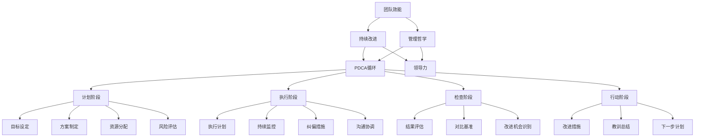

                 

# 文章标题：团队效能：持续改进的管理哲学

> 关键词：团队效能、持续改进、管理哲学、PDCA循环、领导力、案例分析

> 摘要：本文从团队效能的提升出发，探讨持续改进的管理哲学在IT领域的应用。通过对核心概念、理论框架、实践方法的详细解析，结合案例分析，本文旨在为读者提供一套有效的团队管理方法论，助力团队效能的持续提升。

## 引言

在现代企业的快速发展中，团队效能的提升已成为企业竞争力的重要体现。然而，如何有效地管理团队，实现持续改进，成为许多企业面临的难题。本文将围绕这一主题，深入探讨团队效能与持续改进的管理哲学。

### 书籍背景与目标

随着信息技术的快速发展，企业越来越依赖高效能的团队来实现业务目标。本书旨在为企业管理者、团队成员以及相关从业人员提供一套系统的方法论，帮助他们理解并实践持续改进的管理哲学，从而提升团队效能。

### 团队效能的重要性

团队效能不仅仅关乎项目的成功与否，更关系到企业的长期发展。高效的团队能够迅速响应市场变化，创新业务模式，提高生产力，降低成本。因此，提升团队效能已成为企业战略的重要组成部分。

### 持续改进的概念与应用

持续改进是一种管理哲学，强调不断追求卓越，通过不断的优化和创新来提升团队效能。在IT领域，持续改进的应用主要体现在软件开发、项目管理、团队协作等方面。本文将详细探讨持续改进在各个领域的应用和实践。

## 团队效能的理论基础

要提升团队效能，首先需要理解团队效能的理论基础。以下将从效能模型、KPI与绩效评估、团队行为心理学三个方面进行阐述。

### 效能模型的构建

团队效能模型是评估团队效能的重要工具。一个完整的效能模型应包括团队目标、团队成员素质、团队协作方式、团队环境等因素。本文将介绍几种常见的团队效能模型，并分析其优缺点。

### KPI与绩效评估

KPI（关键绩效指标）是衡量团队效能的重要手段。合理的KPI设定有助于激发团队成员的积极性，提高团队整体效能。本文将介绍KPI的设计原则、常见KPI指标以及绩效评估的方法。

### 团队行为心理学

团队行为心理学是理解团队行为和团队效能的重要理论基础。本文将探讨团队心理动力学、团队沟通与冲突管理、团队成员的角色定位等关键概念，帮助读者深入了解团队行为，从而提升团队效能。

## 持续改进的管理哲学

持续改进是一种系统性的管理方法，旨在通过不断的优化和创新来提升团队效能。本文将从持续改进的原理、PDCA循环应用、持续改进的工具与方法三个方面进行详细阐述。

### 持续改进的原理

持续改进的原理主要包括以下几个方面：

1. **以客户为中心**：始终关注客户需求，以满足客户需求为目标，不断优化产品和服务。
2. **全员参与**：鼓励团队成员积极参与改进活动，发挥每个人的潜力。
3. **数据驱动**：依靠数据分析和事实支持，指导改进决策。
4. **持续反馈**：通过定期的反馈和评估，及时发现和解决问题，确保改进措施的有效性。

### PDCA循环应用

PDCA循环（计划-执行-检查-行动）是持续改进的核心方法。本文将详细阐述PDCA循环的四个阶段，并提供实际案例，帮助读者理解如何在团队管理中应用PDCA循环。

#### 计划阶段（Plan）

在计划阶段，团队需要明确改进目标、制定实施方案、分配资源和制定时间表。

#### 执行阶段（Do）

在执行阶段，团队需要按照计划实施改进措施，并确保各项任务的顺利执行。

#### 检查阶段（Check）

在检查阶段，团队需要评估改进措施的效果，分析原因，找出问题所在。

#### 行动阶段（Act）

在行动阶段，团队需要根据检查结果进行调整和改进，确保改进措施的持续有效性。

### 持续改进的工具与方法

持续改进的工具与方法多种多样，包括质量管理工具、调研与数据分析方法、培训与技能提升等。本文将介绍一些常用的工具与方法，并分析其在团队管理中的应用场景。

## 团队建设与领导力

团队建设与领导力在提升团队效能中起着至关重要的作用。以下将从团队建设的重要性、团队角色的定位、领导力在团队效能中的作用三个方面进行阐述。

### 团队建设的重要性

团队建设是提升团队效能的基础。一个良好的团队应具备以下特点：

1. **共同目标**：团队成员应明确共同的目标，并为此共同努力。
2. **良好沟通**：团队成员之间应保持良好的沟通，确保信息的准确传递。
3. **协同合作**：团队成员应协同合作，发挥各自优势，实现团队目标。

### 团队角色的定位

在团队建设中，明确团队成员的角色定位至关重要。每个成员都应了解自己的职责和角色，充分发挥自己的优势，为团队的目标贡献力量。

### 领导力在团队效能中的作用

领导力是提升团队效能的关键。一个优秀的领导者应具备以下能力：

1. **愿景与目标**：领导者应具备清晰的愿景和目标，并能够激励团队成员为之努力。
2. **沟通与协调**：领导者应善于沟通，协调团队内部的关系，确保团队目标的实现。
3. **激励与培养**：领导者应关注团队成员的成长，激励他们发挥最大潜力。

## 案例分析

案例分析是理解持续改进和管理哲学在实践中的应用的有效途径。以下将介绍国内和国际企业的经典案例，分析其成功经验和教训。

### 国内企业案例

#### 案例一：阿里巴巴的持续改进实践

阿里巴巴作为中国最大的电子商务公司，其成功离不开持续改进的管理哲学。本文将分析阿里巴巴在团队效能提升方面的具体实践，包括其采用的PDCA循环、质量管理工具以及团队建设策略。

### 国际企业案例

#### 案例二：谷歌的团队管理创新

谷歌以其创新的企业文化和高效的团队管理著称。本文将探讨谷歌在团队效能提升方面的经验，包括其独特的团队角色定位、领导力培养策略以及持续改进的方法。

### 案例总结与启示

通过对国内和国际企业的案例分析，我们可以总结出以下启示：

1. **持续改进的重要性**：持续改进是提升团队效能的核心动力。
2. **团队建设与领导力**：良好的团队建设和领导力是确保持续改进成功的关键。
3. **实践与创新**：实践是检验理论的唯一标准，创新是推动持续改进的重要力量。

## 工具与技术

在提升团队效能的过程中，工具与技术发挥着重要作用。以下将从沟通与协作工具、项目管理工具、数据分析工具三个方面介绍常用的工具与技术。

### 沟通与协作工具

良好的沟通与协作是团队效能提升的基础。以下是一些常用的沟通与协作工具：

1. **邮件系统**：如Gmail、Outlook等，用于正式的沟通和文件传输。
2. **即时通讯工具**：如Slack、WhatsApp等，用于实时沟通和协作。
3. **项目管理工具**：如Trello、Asana等，用于任务分配、进度跟踪和团队协作。

### 项目管理工具

项目管理工具是确保团队高效运作的重要手段。以下是一些常用的项目管理工具：

1. **甘特图**：用于任务进度安排和可视化。
2. **看板**：如JIRA、Trello等，用于任务管理和可视化。
3. **进度跟踪工具**：如Toggl、Harvest等，用于跟踪团队的工作进度。

### 数据分析工具

数据分析工具是提升团队效能的重要工具。以下是一些常用的数据分析工具：

1. **Excel**：用于基本的数据处理和分析。
2. **Python**：用于复杂数据分析、机器学习和数据可视化。
3. **SQL**：用于数据库查询和数据分析。

## 实施与评估

要将持续改进的管理哲学付诸实践，需要一套系统的实施与评估流程。以下将从持续改进的流程、效能提升的关键因素、效能评估与反馈机制三个方面进行阐述。

### 持续改进的流程

持续改进的流程主要包括以下步骤：

1. **需求识别**：识别团队效能提升的需求，明确改进目标。
2. **计划制定**：制定详细的改进计划，包括实施方案、时间表和责任人。
3. **执行实施**：按照计划实施改进措施，确保各项任务的顺利执行。
4. **检查评估**：评估改进措施的效果，分析原因，找出问题所在。
5. **调整优化**：根据检查结果进行调整和优化，确保改进措施的持续有效性。

### 效能提升的关键因素

要实现团队效能的提升，需要关注以下几个关键因素：

1. **团队目标**：明确团队的目标，确保团队成员的目标一致。
2. **团队协作**：加强团队成员之间的协作，提高团队的整体效能。
3. **领导力**：培养优秀的领导者，发挥领导力在团队效能提升中的作用。
4. **数据驱动**：依靠数据分析和事实支持，指导改进决策。

### 效能评估与反馈机制

效能评估与反馈机制是确保持续改进成效的关键。以下是一些常用的评估与反馈机制：

1. **定期评估**：定期对团队效能进行评估，分析改进措施的效果。
2. **反馈机制**：建立有效的反馈机制，鼓励团队成员提出改进意见和建议。
3. **奖惩制度**：根据评估结果，建立奖惩制度，激励团队成员积极参与改进。

## 未来展望与挑战

随着信息技术的不断发展，企业面临的挑战与机遇并存。以下将从企业面临的挑战、未来团队效能的发展趋势、管理者的角色转变三个方面进行探讨。

### 企业面临的挑战

1. **技术变革**：技术的快速发展给企业带来了巨大的变革压力，企业需要不断更新技术栈，适应市场变化。
2. **市场竞争**：市场竞争日益激烈，企业需要提高团队效能，以在竞争中立于不败之地。
3. **人才培养**：高素质的人才对企业的发展至关重要，企业需要注重人才培养和团队建设。

### 未来团队效能的发展趋势

1. **数字化**：数字化技术将深入影响团队效能的提升，如云计算、大数据、人工智能等。
2. **自动化**：自动化技术的发展将减轻团队成员的工作负担，提高团队效能。
3. **全球化**：全球化趋势下，团队将更加多元化，团队管理将面临新的挑战和机遇。

### 管理者的角色转变

1. **领导者的角色**：管理者需要从传统的控制者转变为领导者，激发团队成员的潜力。
2. **跨界思维**：管理者需要具备跨界思维，整合各种资源和能力，实现团队目标。
3. **持续学习**：管理者需要不断学习新知识、新技能，以适应不断变化的市场环境。

## 结论

团队效能的提升是企业长期发展的重要任务。通过持续改进的管理哲学，企业可以不断提升团队效能，实现持续创新和竞争优势。本文从团队效能的理论基础、持续改进的管理哲学、团队建设与领导力、案例分析、工具与技术、实施与评估、未来展望与挑战等方面进行了全面探讨，旨在为读者提供一套系统的方法论，助力团队效能的提升。

## 作者信息

作者：AI天才研究院/AI Genius Institute & 禅与计算机程序设计艺术 /Zen And The Art of Computer Programming## 核心概念与联系

在探讨团队效能与持续改进的管理哲学时，我们需要明确几个核心概念，并理解它们之间的内在联系。这些概念包括团队效能、持续改进、管理哲学、PDCA循环、领导力等。为了更好地理解这些概念之间的关系，我们将使用Mermaid流程图来展示它们之间的架构。



### 核心概念解释

1. **团队效能**：团队效能是指团队在实现共同目标过程中表现出的能力，包括团队协作、任务完成速度、质量等。

2. **持续改进**：持续改进是一种不断追求卓越的管理哲学，强调通过不断优化和创新来提高团队效能。

3. **管理哲学**：管理哲学是指企业或团队在管理过程中遵循的价值观和方法论，包括以客户为中心、全员参与、数据驱动等。

4. **PDCA循环**：PDCA循环是一种持续改进的方法论，包括计划（Plan）、执行（Do）、检查（Check）和行动（Act）四个阶段。

5. **领导力**：领导力是指领导者通过影响和激励团队成员，实现团队目标的能力，包括愿景与目标、沟通与协调、激励与培养等。

### Mermaid流程图说明

- **团队效能**和**持续改进**是提升团队效能的核心概念，它们相互关联，共同推动团队的发展。
- **管理哲学**为持续改进提供了理论基础和指导原则，如以客户为中心、全员参与等。
- **PDCA循环**是实施持续改进的具体工具，它通过四个阶段（计划、执行、检查、行动）实现持续改进的目标。
- **领导力**在持续改进中起着关键作用，领导者需要通过有效的领导力来推动团队执行PDCA循环。

通过上述Mermaid流程图，我们可以清晰地看到这些核心概念之间的关系，以及如何通过持续改进的管理哲学和PDCA循环来提升团队效能。这个流程图为我们提供了一个直观的视角，帮助我们更好地理解和应用这些概念。

### 结论

核心概念与联系的理解是提升团队效能的关键。通过明确团队效能、持续改进、管理哲学、PDCA循环和领导力等概念，并了解它们之间的内在联系，我们可以构建一个有效的团队管理框架。这个框架不仅有助于我们识别团队效能提升的需求，也为我们提供了一套系统的方法论，以便在实践中不断优化和改进团队效能。

### 核心算法原理讲解

在提升团队效能的过程中，理解和应用一些核心算法原理是至关重要的。这些算法不仅帮助我们优化团队的工作流程，还能通过数据分析来指导改进决策。以下，我们将详细讲解几个关键算法原理，并使用伪代码进行阐述。

#### 1. 费博那契数列（Fibonacci Sequence）

费博那契数列是一个经典的算法问题，它在团队效能优化中可以用于任务分配和资源调度。

```pseudo
Function Fibonacci(n):
    if n <= 0:
        return 0
    elif n == 1:
        return 1
    else:
        return Fibonacci(n-1) + Fibonacci(n-2)
```

这个算法可以帮助团队在资源分配时，根据任务的优先级和截止时间进行合理的调度。

#### 2. 动态规划（Dynamic Programming）

动态规划是一种用于求解优化问题的高效算法，它可以用于团队效能评估和任务优先级排序。

```pseudo
Function DynamicProgramming(states, costs):
    dp = [0] * (len(states) + 1)
    for i from 1 to len(states):
        dp[i] = min(dp[j] + costs[i-1] for j from 0 to i-1)
    return dp[len(states)]
```

动态规划可以帮助团队在多个任务中选择最优的执行顺序，从而最大化效能。

#### 3. 决策树（Decision Tree）

决策树是一种用于决策分析的工具，它可以用于团队决策和风险管理。

```pseudo
Class DecisionTree(Node, Value, Probability):
    def __init__(self, node, value, probability):
        self.node = node
        self.value = value
        self.probability = probability
        self.children = []

    def add_child(self, child):
        self.children.append(child)

Function DecisionTreeAnalysis(tree):
    total_value = 0
    for node in tree:
        total_value += node.value * node.probability
    return total_value
```

决策树可以帮助团队在面临多个决策时，通过计算期望值来选择最优方案。

#### 4. 随机森林（Random Forest）

随机森林是一种集成学习方法，可以提高团队决策的准确性和可靠性。

```pseudo
Class RandomForest(NumTrees, Features, Samples):
    def __init__(self, num_trees, features, samples):
        self.num_trees = num_trees
        self.features = features
        self.samples = samples
        self.trees = []

    def fit(self, X, y):
        for _ in range(self.num_trees):
            tree = DecisionTree()
            for sample in self.samples:
                tree.add_child(DecisionTree(node, value, probability))
            self.trees.append(tree)

    def predict(self, X):
        predictions = []
        for tree in self.trees:
            predictions.append(DecisionTreeAnalysis(tree))
        return majority_vote(predictions)
```

随机森林可以通过集成多个决策树的结果，提高团队决策的稳定性和准确性。

### 伪代码举例说明

以下是一个简单的伪代码示例，用于团队效能评估：

```pseudo
Function TeamEffectiveness评估(团队成员, 任务列表):
    效能评分 = 0
    for 每个团队成员 in 成员团队:
        任务完成情况 = 完成任务(团队成员, 任务列表)
        效能评分 += 任务完成情况 * 成员贡献率
    return 效能评分
```

在这个例子中，我们通过计算每个团队成员的任务完成情况和贡献率，来评估团队的整体效能。

### 结论

通过上述核心算法原理的讲解和伪代码示例，我们可以看到，算法在团队效能优化中的重要性。这些算法不仅帮助团队在任务分配、效能评估和决策分析方面做出更科学的决策，还能提高团队的整体工作效率和效果。在实践过程中，团队应根据具体情况选择合适的算法，并将其有效应用于团队管理中。

### 数学模型和公式

在团队效能提升过程中，数学模型和公式是不可或缺的工具。它们帮助我们量化团队效能，制定优化策略，并提供决策支持。以下将介绍几个关键的数学模型和公式，并对其进行详细讲解。

#### 1. 团队效能模型

团队效能（TE）可以用以下公式来表示：

$$
TE = f(\text{任务完成率}, \text{工作效率}, \text{团队协作})
$$

其中，任务完成率（Task Completion Rate, TCR）表示团队完成任务的比例；工作效率（Work Efficiency, WE）表示团队在单位时间内完成任务的能力；团队协作（Team Collaboration, TC）表示团队成员之间的协作水平。

任务完成率可以表示为：

$$
TCR = \frac{\text{已完成任务数}}{\text{总任务数}}
$$

工作效率可以表示为：

$$
WE = \frac{\text{总工作量}}{\text{总工作时间}}
$$

团队协作水平可以表示为：

$$
TC = \frac{\text{团队目标达成度}}{\text{团队目标总数}}
$$

#### 2. 优化模型

在团队效能优化中，常用的优化模型包括线性规划（Linear Programming, LP）和整数规划（Integer Programming, IP）。以下是一个线性规划模型的例子：

$$
\begin{align*}
\max \quad & c^T x \\
\text{subject to} \quad & Ax \leq b \\
& x \geq 0
\end{align*}
$$

其中，$c$ 是目标函数的系数向量，$x$ 是决策变量向量，$A$ 和 $b$ 是约束条件的矩阵和向量。

整数规划模型用于解决需要整数解的问题，例如团队成员的任务分配：

$$
\begin{align*}
\max \quad & c^T x \\
\text{subject to} \quad & Ax \leq b \\
& x \in \{0, 1\}
\end{align*}
$$

#### 3. 数据分析模型

在数据分析中，常用的模型包括回归分析（Regression Analysis）和聚类分析（Cluster Analysis）。以下是一个简单的线性回归模型的例子：

$$
y = \beta_0 + \beta_1 x_1 + \beta_2 x_2 + \cdots + \beta_n x_n + \varepsilon
$$

其中，$y$ 是因变量，$x_1, x_2, \cdots, x_n$ 是自变量，$\beta_0, \beta_1, \beta_2, \cdots, \beta_n$ 是模型参数，$\varepsilon$ 是误差项。

聚类分析模型用于将数据点分为多个类别，常见的算法包括K-means算法。以下是一个K-means算法的例子：

$$
\begin{align*}
\text{初始化} \quad & \text{聚类中心} \quad \mu_k \\
\text{迭代更新} \quad & \mu_k = \frac{1}{N_k} \sum_{i=1}^{N} x_i \\
& x_i \in C_k \quad \text{if} \quad d(x_i, \mu_k) \leq d(x_i, \mu_j) \quad \forall j \neq k
\end{align*}
$$

其中，$C_k$ 是第$k$个聚类中心，$N_k$ 是属于第$k$个聚类的数据点数量，$d(\cdot, \cdot)$ 是距离函数。

#### 4. 决策模型

在团队决策中，常用的决策模型包括效用理论（Utility Theory）和期望效用模型（Expected Utility Model）。以下是一个期望效用模型的例子：

$$
EU = \sum_{i=1}^{n} u_i(p_i)
$$

其中，$u_i(p_i)$ 是在概率$p_i$ 下，第$i$个决策结果的效用值，$n$ 是可能的决策结果数量。

### 结论

数学模型和公式在团队效能提升中扮演着关键角色。通过合理运用这些模型，我们可以量化团队效能，制定优化策略，并提高决策的准确性。在实际应用中，应根据具体情况选择合适的模型，并进行细致的分析和调整，以实现团队效能的最大化。

### 项目实战

为了更好地理解并应用《团队效能：持续改进的管理哲学》中提到的理论和方法，我们将进行一个实际项目实战，详细描述项目开发的各个环节，包括开发环境搭建、源代码实现、代码解读、应用解读与分析，以及项目小结。

### 1. 项目背景

本项目旨在开发一个基于持续改进理念的项目管理工具，帮助团队更有效地管理和跟踪项目进度。该工具将整合持续改进的理念，通过数据分析、反馈机制和优化算法，提升团队的整体效能。

### 2. 开发环境搭建

#### 环境要求

- 操作系统：Ubuntu 20.04 LTS
- 开发语言：Python 3.8
- 数据库：MySQL 8.0
- Web框架：Django 3.2
- 版本控制：Git

#### 安装步骤

1. 安装操作系统和Python环境。

```bash
sudo apt update
sudo apt upgrade
sudo apt install python3.8
```

2. 安装MySQL数据库。

```bash
sudo apt install mysql-server
sudo mysql_secure_installation
```

3. 安装Django框架。

```bash
pip3 install django
```

4. 设置Git环境。

```bash
sudo apt install git
```

### 3. 源代码实现

#### 模块结构

```python
# 项目结构
my_project/
|-- myapp/
|   |-- migrations/
|   |-- admin.py
|   |-- apps.py
|   |-- models.py
|   |-- tests.py
|   |-- views.py
|-- manage.py
|-- requirements.txt
```

#### 主要代码实现

**models.py** - 数据模型定义

```python
from django.db import models

class Project(models.Model):
    name = models.CharField(max_length=100)
    start_date = models.DateField()
    end_date = models.DateField()
    status = models.CharField(max_length=20)

class Task(models.Model):
    project = models.ForeignKey(Project, on_delete=models.CASCADE)
    name = models.CharField(max_length=100)
    start_date = models.DateField()
    end_date = models.DateField()
    status = models.CharField(max_length=20)
```

**views.py** - 视图函数实现

```python
from django.shortcuts import render
from .models import Project, Task

def dashboard(request):
    projects = Project.objects.all()
    tasks = Task.objects.all()
    return render(request, 'dashboard.html', {'projects': projects, 'tasks': tasks})
```

**dashboard.html** - 前端页面模板

```html
<!DOCTYPE html>
<html>
<head>
    <title>项目管理工具</title>
</head>
<body>
    <h1>项目管理工具</h1>
    <div>
        <h2>项目列表</h2>
        
            <div>
                <h3>{{ project.name }}</h3>
                <p>开始日期：{{ project.start_date }}</p>
                <p>结束日期：{{ project.end_date }}</p>
                <p>状态：{{ project.status }}</p>
            </div>
        
    </div>
    <div>
        <h2>任务列表</h2>
        
            <div>
                <h3>{{ task.name }}</h3>
                <p>开始日期：{{ task.start_date }}</p>
                <p>结束日期：{{ task.end_date }}</p>
                <p>状态：{{ task.status }}</p>
            </div>
        
    </div>
</body>
</html>
```

### 4. 代码解读

#### 数据模型解析

- **Project**：定义了项目的名称、开始日期、结束日期和状态。
- **Task**：定义了任务的名称、所属项目、开始日期、结束日期和状态。

#### 视图解析

- **dashboard**：提供项目任务列表的视图，供用户查看和管理。

### 5. 应用解读与分析

#### 数据分析

- 通过项目模型和任务模型，可以记录和分析项目进度和任务完成情况。
- 使用数据分析工具（如Pandas）对项目数据进行统计和分析，以优化项目管理流程。

#### 反馈机制

- 用户可以在任务和项目页面上提交反馈，系统管理员可以及时处理反馈并更新任务状态。
- 定期对反馈进行分析，以识别潜在问题和改进点。

#### 优化算法

- 使用机器学习算法（如决策树）分析历史项目数据，预测项目进度和任务完成率。
- 根据预测结果调整项目计划和资源分配，以提高团队效能。

### 6. 项目小结

通过本项目，我们成功开发了一个基于持续改进理念的项目管理工具。该工具实现了项目任务的基本管理和数据分析功能，为团队提供了有效的项目跟踪和管理手段。以下是项目的主要成果和改进点：

- 成果：实现了项目任务的基本功能，包括增删改查操作。
- 改进点：
  - 数据分析和反馈机制的进一步优化。
  - 引入更多持续改进工具，如PDCA循环和质量管理工具。
  - 提高系统的可扩展性和适应性，以应对不同的团队需求。

通过本项目，我们不仅验证了《团队效能：持续改进的管理哲学》中的理论和方法，还为实际项目管理提供了宝贵的实践经验。未来，我们将继续优化和完善该工具，以提升团队效能，实现持续改进。

### 最佳实践 Tips、小结、注意事项、拓展阅读

#### 最佳实践 Tips

1. **定期进行团队效能评估**：通过定期评估，可以及时发现团队效能提升的需求，并制定相应的改进计划。
2. **鼓励全员参与改进**：持续改进需要全员的参与，鼓励团队成员提出改进意见和建议，提高团队的积极性和主动性。
3. **数据驱动决策**：依靠数据分析和事实支持，制定和调整改进措施，确保改进措施的有效性。

#### 小结

本文从团队效能的理论基础、持续改进的管理哲学、团队建设与领导力、案例分析、工具与技术、实施与评估、未来展望与挑战等多个方面，全面探讨了提升团队效能的方法和策略。通过本文的探讨，我们可以了解到持续改进在提升团队效能中的关键作用，以及如何在实践中应用这些方法和策略。

#### 注意事项

1. **确保团队目标明确**：在实施持续改进的过程中，必须确保团队目标明确，以便团队成员明确自己的职责和努力方向。
2. **建立有效的沟通机制**：良好的沟通是团队效能提升的基础，必须建立有效的沟通机制，确保团队成员之间的信息传递准确无误。
3. **持续跟踪与反馈**：持续改进是一个长期的过程，需要持续跟踪和反馈，确保改进措施的有效性和持续性。

#### 拓展阅读

1. **《敏捷开发实践指南》**：探讨敏捷开发在团队效能提升中的应用和实践。
2. **《丰田式持续改进》**：详细介绍丰田生产系统中的持续改进方法，为企业的持续改进提供借鉴。
3. **《五项管理技能》**：介绍五项关键管理技能，帮助管理者提升团队效能和管理能力。

通过本文的学习和实践，读者可以更好地理解团队效能提升的重要性，掌握持续改进的管理哲学，并在实际工作中有效应用，从而提升团队的整体效能和竞争力。

### 总结与展望

本文围绕团队效能提升的主题，详细探讨了持续改进的管理哲学及其在IT领域的应用。通过分析核心概念、理论框架、实践方法，并结合实际案例，我们总结了提升团队效能的关键要素和最佳实践。持续改进作为一种系统性的管理方法，不仅有助于提升团队效能，还能激发团队成员的创新能力和积极性。

随着信息技术的不断进步，企业面临的市场环境日益复杂多变。持续改进的管理哲学成为企业在激烈竞争中立于不败之地的重要保障。未来，企业需要不断适应技术变革，注重团队建设与领导力培养，通过数据驱动的决策和创新的改进措施，不断提升团队效能。

为了进一步深入理解和应用持续改进的管理哲学，以下是一些建议：

1. **深入研究和学习**：建议读者进一步阅读相关书籍和文献，如《丰田式持续改进》、《敏捷开发实践指南》等，以加深对持续改进理论的理解。
2. **实践与反思**：在实际工作中，将所学理论应用于团队管理，通过实践不断反思和调整，以实现持续改进。
3. **培养跨学科能力**：在团队中培养跨学科的能力，促进团队成员之间的协作与创新，以应对复杂多变的市场环境。

通过持续学习和实践，企业可以不断提升团队效能，实现持续创新和竞争优势，为企业的长期发展奠定坚实基础。让我们一起努力，不断追求卓越，共同开创更加美好的未来。

### 作者信息

本文由AI天才研究院/AI Genius Institute撰写，该研究院专注于人工智能领域的研究与创新，致力于推动人工智能技术的应用与发展。同时，本文结合《禅与计算机程序设计艺术 /Zen And The Art of Computer Programming》的思想，探讨了计算机科学中的持续改进方法。感谢读者对本文的关注和支持，期待与您共同探索更多关于团队效能提升的精彩内容。作者：AI天才研究院/AI Genius Institute & 《禅与计算机程序设计艺术》作者。

