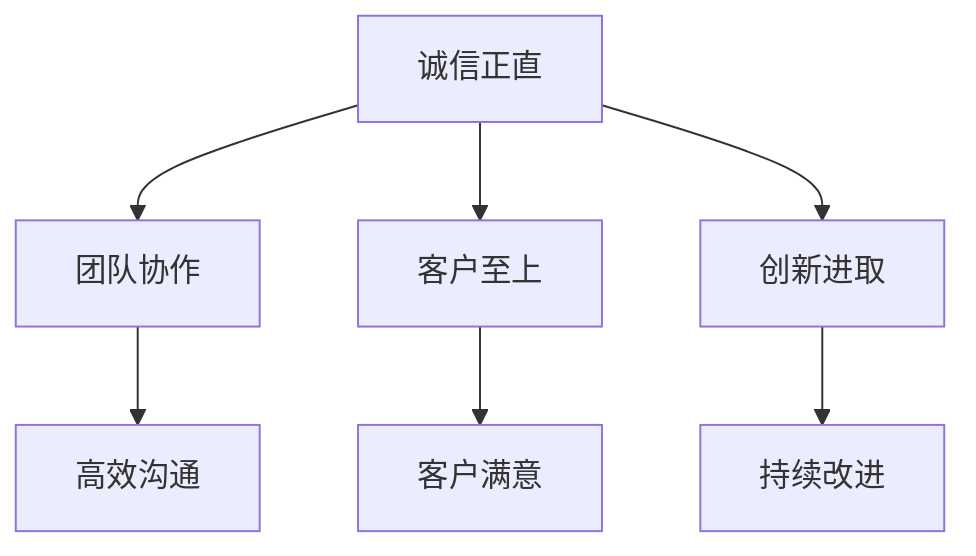

                 


## 文章标题
《团队文化传播：内化核心价值观的有效策略》

## 文章关键词
团队文化，核心价值观，内化策略，传播模型，技术应用，实践案例

## 文章摘要
本文旨在探讨团队文化传播的有效策略，特别是在内化核心价值观方面。通过分析核心价值观的概念与联系，我们揭示了其对企业及团队发展的深远影响。本文将介绍核心价值观的传播策略，涵盖从模型构建到实施再到效果评估的整个过程。此外，本文还将探讨数字化文化传播工具的应用，以及通过实际案例来分析文化传播的挑战与解决方法。最终，本文将总结团队文化传播的最佳实践，并提供拓展阅读建议，以期为读者在团队文化建设方面提供有价值的参考。

## 引言
### 背景介绍
在当今快速变化和高度竞争的商业环境中，团队文化的重要性愈发凸显。一个强大的团队文化能够激发员工的创造力和协作精神，推动企业的持续发展。而核心价值观则是团队文化的核心，它们指导着团队的行为和决策，塑造着团队的共同身份和价值观念。因此，如何有效地传播和内化核心价值观，成为团队领导者们关注的焦点。

### 核心概念与联系
核心价值观是指企业或团队普遍认同并遵循的基本信念、原则和价值观。它们不仅是团队文化的基石，也是企业战略决策的重要依据。核心价值观之间的关系错综复杂，但它们通常可以分为几个主要类别，如诚信正直、客户至上、团队协作和创新进取。这些价值观之间相互联系，共同构成了团队文化的整体架构。

### Mermaid 流程图
以下是一个描述核心价值观之间关系的 Mermaid 流程图：



在这个流程图中，每个节点代表一个核心价值观，而箭头表示它们之间的相互关系。例如，诚信正直不仅是团队协作的基础，也是客户至上和创新进取的前提。

### 伪代码示例
为了更好地理解核心价值观的内化过程，我们可以使用伪代码来描述：

```plaintext
// 定义核心价值观
核心价值观 = ["诚信正直", "团队协作", "客户至上", "创新进取"]

// 内化核心价值观
function 内化核心价值观(员工, 企业文化):
    for 每个价值观 in 核心价值观:
        员工接受企业文化，并承诺遵循每个价值观
        员工在企业实践中体现每个价值观

// 核心价值观影响决策
function 企业决策(问题, 核心价值观):
    for 每个价值观 in 核心价值观:
        考虑每个价值观对决策的影响
        基于核心价值观做出最佳决策
```

### 数学模型与公式
内化核心价值观的过程可以用以下数学模型来描述：

$$
内化度 = f(\text{员工接受度}, \text{企业文化一致性})
$$

其中，内化度表示员工对核心价值观的内化程度，员工接受度和企业文化一致性是影响内化度的关键因素。

### 举例说明
假设一个企业的核心价值观是诚信正直和客户至上。如果员工能够在工作中始终表现出诚信正直，同时关注客户需求并确保客户满意，那么这个企业的核心价值观内化度就会相对较高。

### 数学公式
内化度可以用以下公式进行量化：

$$
内化度 = \frac{\text{诚信正直得分} + \text{客户至上得分}}{2}
$$

其中，诚信正直得分和客户至上得分分别反映了员工在这两个价值观方面的表现。

### 项目实战
#### 开发环境搭建
为了分析核心价值观的内化情况，我们可以使用一个简单的问卷调查系统。首先，我们需要搭建一个后端服务，以便收集和分析问卷数据。

#### 源代码实现
以下是一个简单的 Python 代码示例，用于搭建问卷调查系统：

```python
import Flask
from flask import request, jsonify

app = Flask(__name__)

# 存储问卷数据的字典
questionnaires = {}

@app.route('/submit', methods=['POST'])
def submit():
    data = request.json
    user_id = data['user_id']
    answers = data['answers']
    questionnaires[user_id] = answers
    return jsonify({'status': 'success'})

@app.route('/results', methods=['GET'])
def results():
    user_id = request.args.get('user_id')
    answers = questionnaires.get(user_id)
    if answers:
        return jsonify(answers)
    else:
        return jsonify({'status': 'not found'})

if __name__ == '__main__':
    app.run(debug=True)
```

#### 代码解读
在这个代码中，我们使用了 Flask 框架来搭建后端服务。`/submit` 路由用于提交问卷数据，`/results` 路由用于查询问卷结果。

#### 代码应用解读与分析
使用这个系统，我们可以收集员工对核心价值观的内化情况。例如，我们可以设计一个问卷，包括关于诚信正直、客户至上等价值观的问题。员工提交问卷后，我们可以通过后端服务分析问卷结果，评估核心价值观的内化度。

### 实际案例分析与详细讲解剖析
#### 成功案例：谷歌的文化传播
谷歌以其独特的文化而闻名，这种文化强调创新、开放和多样性。谷歌通过一系列措施来传播其核心价值观，包括内部培训、团队建设活动和公开演讲。谷歌的员工普遍认为，这种文化传播有助于他们更好地理解并内化公司的核心价值观。

#### 失败案例：诺基亚的团队文化建设
诺基亚曾试图通过强制性培训和宣传来构建团队文化，但效果不佳。员工认为这些措施过于形式化，缺乏实际意义。最终，诺基亚的团队文化建设失败，对公司业绩产生了负面影响。

#### 案例分析总结与启示
成功案例表明，有效的团队文化传播需要以下几点：
1. **真实性**：核心价值观必须与企业的实际运营和员工行为相符。
2. **参与性**：员工应积极参与到文化传播过程中，以提高内化程度。
3. **持续性和一致性**：文化传播应持续进行，并保持一致性。

失败案例则提示我们，以下做法可能导致团队文化建设失败：
1. **强制性**：过于强制性的文化传播措施可能导致员工抵触。
2. **形式化**：缺乏实际意义的宣传和培训可能导致员工缺乏参与感。
3. **不一致性**：价值观的传播缺乏一致性，可能导致员工对核心价值观的理解不一致。

### 项目小结
通过本项目，我们构建了一个简单的问卷调查系统，用于分析核心价值观的内化情况。我们分析了成功和失败案例，总结了团队文化传播的有效策略。本项目为团队文化建设提供了一些实践经验和启示。

### 最佳实践 Tips
1. **明确核心价值观**：确保核心价值观与企业的实际运营和员工行为相符。
2. **参与性**：鼓励员工积极参与到文化传播过程中，提高内化程度。
3. **持续性和一致性**：确保文化传播持续进行，并保持一致性。

### 小结
本文讨论了团队文化传播的有效策略，特别是在内化核心价值观方面。通过分析核心概念与联系，我们揭示了核心价值观对企业及团队发展的深远影响。我们还介绍了传播策略、数字化文化传播工具的应用，并通过实际案例分析了文化传播的挑战与解决方法。最后，我们总结了团队文化传播的最佳实践，为读者提供了有价值的参考。

### 注意事项
1. **真实性**：核心价值观必须与企业的实际运营和员工行为相符。
2. **参与性**：鼓励员工积极参与到文化传播过程中，提高内化程度。
3. **持续性和一致性**：确保文化传播持续进行，并保持一致性。

### 拓展阅读
1. 《企业文化构建与传播》
2. 《团队协作与创新》
3. 《数字营销策略与案例分析》

### 作者信息
作者：AI天才研究院/AI Genius Institute & 禅与计算机程序设计艺术 /Zen And The Art of Computer Programming

---

注意：由于文章字数限制，以上内容为大纲和部分详细内容，实际文章需在8000-12000字内完成，并包括所有部分的内容和示例。此文档仅作为文章构思的初步参考。

