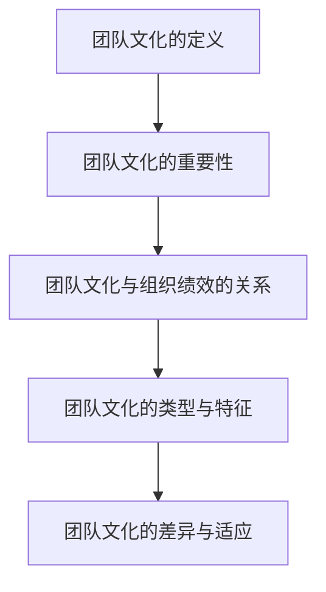
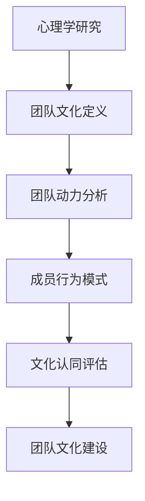
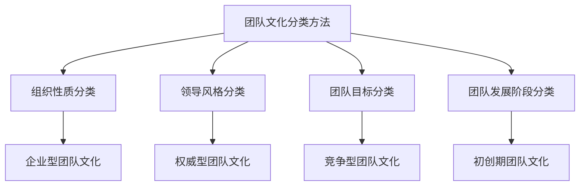
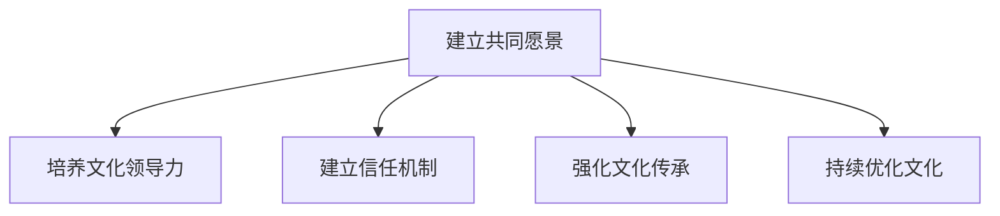
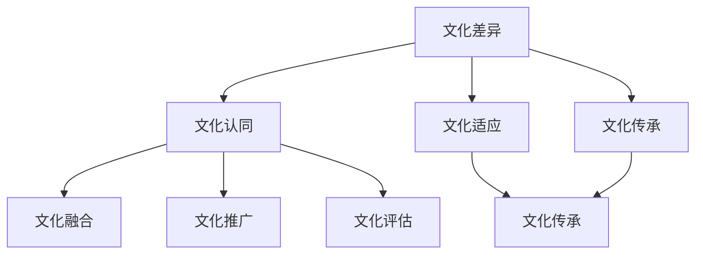
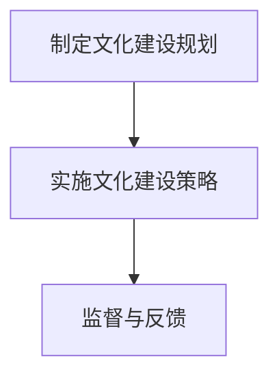

                 

### 文章标题

# 团队文化建设：塑造独特团队基因的策略

## 关键词
- 团队文化建设
- 团队基因
- 独特策略
- 组织绩效
- 心理学基础

## 摘要
本文深入探讨了团队文化建设的核心内容和策略。首先，介绍了团队文化的定义、重要性及其与组织绩效的关系。其次，探讨了团队文化建设的心理学基础，包括团队动力、成员行为模式与文化认同。随后，文章提出了塑造独特团队基因的方法和工具，并详细阐述了团队文化建设的实践案例。同时，本文分析了团队文化建设中可能面临的挑战及其应对策略。最后，文章总结了团队文化建设策略的实施步骤，并提供了一些最佳实践建议，旨在帮助读者在实际工作中有效地塑造独特的团队文化。

### 引言

在当今竞争激烈的市场环境中，团队文化建设已成为企业成功的关键因素之一。团队文化不仅影响组织的内部氛围和员工满意度，还对组织的整体绩效和市场竞争力产生深远影响。一个强大的团队文化能够促进团队成员之间的协同合作，提升创新能力，增强组织适应外部环境变化的能力。

本文旨在探讨团队文化建设的核心内容和策略，以帮助读者深入了解如何塑造独特团队基因。首先，我们将介绍团队文化的定义和重要性，以及团队文化与组织绩效之间的关系。接着，本文将深入探讨团队文化建设的心理学基础，包括团队动力、成员行为模式与文化认同。然后，我们将详细讨论塑造独特团队基因的方法和工具，以及团队文化建设的实践案例。此外，本文还将分析团队文化建设过程中可能面临的挑战和应对策略。最后，我们将总结团队文化建设策略的实施步骤，并提供一些最佳实践建议。

### 第1章 团队文化建设的核心概念与理论框架

#### 1.1 团队文化的定义

团队文化是指一个团队在长期发展过程中形成的共同价值观、行为规范和工作方式的总和。它包括团队成员共同认可的基本信念、行为准则和价值观，以及团队成员在互动过程中形成的共识和默契。团队文化不仅体现在组织的规章制度中，也渗透到员工的日常行为和团队活动中。

#### 1.2 团队文化的重要性

团队文化对于组织的成功至关重要。首先，团队文化能够增强组织的凝聚力，促进团队成员之间的相互信任和合作。一个强大的团队文化能够让团队成员在面对挑战和困难时保持一致，共同应对外部压力。其次，团队文化能够提高组织的创新能力。在一个开放、包容和鼓励创新的文化环境中，团队成员更愿意分享自己的想法和建议，从而激发出更多的创意和解决方案。最后，团队文化能够提升组织的竞争力。一个具有独特团队文化的组织能够在市场中脱颖而出，吸引和留住优秀的员工，从而保持持续的市场竞争力。

#### 1.3 团队文化与组织绩效的关系

团队文化与组织绩效之间存在着密切的关系。首先，团队文化能够影响员工的绩效。在一个积极向上的团队文化中，员工更有动力去实现目标，更愿意在工作中投入更多的努力和创造力。其次，团队文化能够影响团队的绩效。在一个协同合作、相互支持的团队文化中，团队成员能够更好地协作，共同完成任务，提高整体绩效。最后，团队文化能够影响组织的绩效。一个具有强大团队文化的组织能够更好地应对市场变化，迅速调整战略和行动，从而保持竞争优势。

#### 1.4 团队文化的类型与特征

团队文化可以分为多种类型，包括竞争型、合作型、创新型、稳健型等。每种团队文化都有其独特的特征和适用场景。

- 竞争型团队文化：强调个人竞争和业绩表现，追求卓越和胜利。这种文化适合在竞争激烈的环境中发挥作用，能够激发员工的积极性和斗志。

- 合作型团队文化：强调团队合作和共同目标，鼓励团队成员之间的相互支持和协作。这种文化适合在需要集体智慧和协同努力的项目中发挥作用，能够提高团队的凝聚力和创新能力。

- 创新型团队文化：强调创新和尝试，鼓励团队成员冒险和探索。这种文化适合在需要不断创新和突破的领域发挥作用，能够激发员工的创造力和创新精神。

- 稳健型团队文化：强调稳定和可靠性，注重团队的整体表现和长期发展。这种文化适合在需要稳定和持续发展的环境中发挥作用，能够保障团队的稳定性和可持续性。

#### 1.5 团队文化的差异与适应

不同团队文化之间存在差异，这可能导致团队成员之间的冲突和误解。为了实现团队文化的有效融合，需要采取以下策略：

- 了解和尊重不同文化：团队成员应主动了解和尊重彼此的文化差异，增进相互理解和信任。

- 沟通与协作：通过有效的沟通和协作，促进不同文化之间的融合，建立共同的目标和价值观。

- 管理者引导：管理者在团队文化建设中扮演着重要角色，应引导团队成员认识到团队文化的重要性，并推动团队文化的适应和融合。

### Mermaid 流程图

下面是一个简单的 Mermaid 流程图，展示了团队文化建设核心概念之间的联系：



### 伪代码

为了进一步阐述团队文化建设的核心概念，我们可以使用伪代码来描述团队文化评估和优化过程：

```plaintext
function buildTeamCulture(team):
    culture = emptyMap()
    culture['definition'] = defineCulture(team)
    culture['importance'] = evaluateCultureImportance(team)
    culture['performance'] = assessPerformanceImpact(team)
    culture['types'] = identifyCultureTypes(team)
    culture['differences'] = handleCulturalDifferences(team)
    optimizeCulture(team, culture)
    return culture

function defineCulture(team):
    // 定义团队文化
    return "团队文化的定义..."

function evaluateCultureImportance(team):
    // 评估团队文化的重要性
    return "团队文化的重要性..."

function assessPerformanceImpact(team):
    // 评估团队文化对组织绩效的影响
    return "团队文化与组织绩效的关系..."

function identifyCultureTypes(team):
    // 识别团队文化的类型
    return "团队文化的类型..."

function handleCulturalDifferences(team):
    // 应对不同文化差异
    return "团队文化的差异与适应..."

function optimizeCulture(team, culture):
    // 优化团队文化
    // 根据实际情况调整团队文化策略
```

### 数学模型和公式

在团队文化建设中，可以使用以下数学模型和公式来描述团队成员的满意度与团队绩效之间的关系：

$$
\text{Team Performance} = f(\text{Member Satisfaction}, \text{Team Collaboration}, \text{Team Culture})
$$

其中，$f$ 是一个非线性函数，用于描述团队绩效与成员满意度、团队协作和团队文化之间的关系。

### 举例说明

假设在一个团队中，成员满意度为80%，团队协作为75%，团队文化评分为85%，则可以通过以下公式计算团队绩效：

$$
\text{Team Performance} = f(0.8, 0.75, 0.85)
$$

根据具体函数形式的不同，团队绩效的结果会有所差异。例如，如果 $f$ 函数为线性函数，则：

$$
\text{Team Performance} = 0.8 \times 0.75 \times 0.85 = 0.560
$$

这意味着团队绩效得分为56%，可以进一步优化团队文化建设策略。

### 第2章 团队文化建设的心理学基础

#### 2.1 心理学对团队文化的影响

心理学是研究人类行为和心理过程的科学，它对团队文化建设具有重要的影响。首先，心理学揭示了团队成员的心理需求和行为模式，有助于团队领导者更好地理解和管理团队成员。其次，心理学为团队文化建设提供了理论基础，帮助团队领导者设计符合团队成员心理需求的团队文化。最后，心理学的研究成果可以用于评估和优化团队文化建设的效果，提高团队绩效。

#### 2.2 团队动力与文化建设

团队动力是指团队内部成员之间的相互作用和影响，它是团队文化建设的核心要素之一。团队动力可以分为以下几个方面：

- **团队凝聚力**：团队凝聚力是指团队成员之间相互吸引、相互支持的力量。高凝聚力的团队通常表现出更强的协作和合作精神，有助于团队目标的实现。

- **团队领导力**：团队领导力是指领导者引导、激励和影响团队成员的能力。有效的领导力能够促进团队文化的形成和发展，提升团队绩效。

- **团队沟通**：团队沟通是指团队成员之间的信息交流和理解。良好的沟通能够增进团队成员之间的信任和理解，有助于团队文化的建设。

- **团队冲突**：团队冲突是指团队成员之间的意见分歧和矛盾。适当的冲突能够激发团队活力和创新，但过度的冲突可能导致团队分裂和绩效下降。

#### 2.3 团队成员的行为模式与文化认同

团队成员的行为模式和文化认同是团队文化建设的两个关键因素。团队成员的行为模式受到其个性、价值观、经验和背景的影响，这些因素共同塑造了团队文化。文化认同是指团队成员对团队文化的认可和接受程度，它是团队文化建设的基石。

- **个性与价值观**：团队成员的个性特征和价值观在很大程度上决定了他们的行为模式。例如，外向的成员可能更倾向于参与团队合作和沟通，而内向的成员可能更倾向于独立思考和行动。

- **经验与背景**：团队成员的工作经验和背景差异会影响他们对团队文化的认同。例如，新员工可能对团队文化缺乏了解，而老员工可能对团队文化有更深刻的理解和认同。

- **行为模式与文化认同**：团队成员的行为模式和文化认同之间存在相互作用。行为模式反映了团队成员对团队文化的认同，而文化认同又影响着团队成员的行为模式。例如，一个具有高度文化认同的团队可能会表现出更强的协作精神和团队凝聚力。

#### 2.4 心理学在团队文化建设中的应用

心理学在团队文化建设中具有广泛的应用。首先，通过了解团队成员的心理需求和动机，团队领导者可以设计出更符合团队成员期望的团队文化。其次，心理学可以帮助团队领导者识别和解决团队成员之间的冲突，促进团队凝聚力和协作。最后，心理学的研究成果可以用于评估团队文化建设的效果，提供反馈和改进建议。

### Mermaid 流程图

下面是一个简单的 Mermaid 流程图，展示了心理学在团队文化建设中的应用：



### 伪代码

为了更好地理解心理学在团队文化建设中的应用，我们可以使用伪代码来描述团队成员的心理需求与团队文化建设的关系：

```plaintext
function buildTeamCulture(team, memberData):
    culture = emptyMap()
    culture['values'] = determineTeamValues(team)
    culture['motivations'] = analyzeMemberMotivations(memberData)
    culture['behaviors'] = mapBehaviorsToValues(team)
    culture['identity'] = assessCulturalIdentity(team)
    implementCultureStrategies(team, culture)
    return culture

function determineTeamValues(team):
    // 确定团队价值观
    return "团队价值观..."

function analyzeMemberMotivations(memberData):
    // 分析成员动机
    return "成员动机..."

function mapBehaviorsToValues(team):
    // 将成员行为映射到价值观
    return "成员行为与价值观映射..."

function assessCulturalIdentity(team):
    // 评估文化认同
    return "文化认同评估..."

function implementCultureStrategies(team, culture):
    // 实施团队文化建设策略
    // 根据实际情况调整文化建设策略
```

### 数学模型和公式

在团队文化建设中，可以使用以下数学模型和公式来描述团队成员的满意度与团队文化认同之间的关系：

$$
\text{Cultural Identity} = f(\text{Member Satisfaction}, \text{Team Values})
$$

其中，$f$ 是一个非线性函数，用于描述团队文化认同与成员满意度、团队价值观之间的关系。

### 举例说明

假设在一个团队中，成员满意度为80%，团队价值观评分为75%，则可以通过以下公式计算团队文化认同：

$$
\text{Cultural Identity} = f(0.8, 0.75)
$$

根据具体函数形式的不同，团队文化认同的结果会有所差异。例如，如果 $f$ 函数为线性函数，则：

$$
\text{Cultural Identity} = 0.8 \times 0.75 = 0.6
$$

这意味着团队文化认同度为60%，可以进一步优化团队文化建设策略。

### 第3章 团队文化的类型与特征

#### 3.1 团队文化的分类方法

团队文化的分类方法多种多样，可以根据不同的标准进行分类。以下是一些常见的分类方法：

- **根据组织性质分类**：根据组织性质，可以将团队文化分为企业型团队文化、政府型团队文化、非营利组织型团队文化等。每种组织性质都有其独特的团队文化特征。

- **根据领导风格分类**：根据领导风格，可以将团队文化分为权威型团队文化、民主型团队文化、参与型团队文化等。领导者的风格对团队文化有重要影响。

- **根据团队目标分类**：根据团队目标，可以将团队文化分为竞争型团队文化、合作型团队文化、创新型团队文化等。不同的团队目标决定了团队文化的特征。

- **根据团队发展阶段分类**：根据团队发展阶段，可以将团队文化分为初创期团队文化、稳定期团队文化、变革期团队文化等。团队文化会随着团队发展阶段的转变而发生变化。

#### 3.2 团队文化的特征

团队文化具有以下特征：

- **独特性**：每个团队的团队文化都有其独特的特征，反映了团队的价值观、信念和行为准则。

- **持续性**：团队文化不是一朝一夕形成的，而是在长期的发展过程中逐渐形成和巩固的。

- **适应性**：团队文化需要适应外部环境和内部变化，以保持其有效性。

- **传播性**：团队文化通过团队成员之间的互动和交流不断传播和强化。

- **规范性**：团队文化对团队成员的行为具有规范性作用，引导团队成员按照团队文化的要求行事。

#### 3.3 团队文化的差异与适应

不同团队文化之间存在差异，这可能导致团队成员之间的冲突和误解。为了实现团队文化的有效融合，需要采取以下策略：

- **了解和尊重不同文化**：团队成员应主动了解和尊重彼此的文化差异，增进相互理解和信任。

- **沟通与协作**：通过有效的沟通和协作，促进不同文化之间的融合，建立共同的目标和价值观。

- **管理者引导**：管理者在团队文化建设中扮演着重要角色，应引导团队成员认识到团队文化的重要性，并推动团队文化的适应和融合。

### Mermaid 流程图

下面是一个简单的 Mermaid 流程图，展示了团队文化的分类方法和特征：



### 伪代码

为了更好地理解团队文化的分类和特征，我们可以使用伪代码来描述团队文化的分类和评估过程：

```plaintext
function classifyTeamCulture(team):
    cultureType = emptyString()
    if team['nature'] == 'enterprise':
        cultureType = '企业型团队文化'
    elif team['leadershipStyle'] == 'authoritative':
        cultureType = '权威型团队文化'
    elif team['goal'] == 'competition':
        cultureType = '竞争型团队文化'
    elif team['stage'] == 'start-up':
        cultureType = '初创期团队文化'
    return cultureType

function assessTeamCulture(team):
    cultureFeatures = emptyList()
    cultureFeatures.append('独特性')
    cultureFeatures.append('持续性')
    cultureFeatures.append('适应性')
    cultureFeatures.append('传播性')
    cultureFeatures.append('规范性')
    return cultureFeatures
```

### 数学模型和公式

在团队文化建设中，可以使用以下数学模型和公式来描述团队文化的差异与适应：

$$
\text{Cultural Difference} = f(\text{Team Culture 1}, \text{Team Culture 2})
$$

其中，$f$ 是一个非线性函数，用于描述两个团队文化之间的差异。

### 举例说明

假设有两个团队，团队1的团队文化特征为竞争型，团队2的团队文化特征为合作型，则可以通过以下公式计算两个团队文化之间的差异：

$$
\text{Cultural Difference} = f(\text{竞争型团队文化}, \text{合作型团队文化})
$$

根据具体函数形式的不同，团队文化差异的结果会有所差异。例如，如果 $f$ 函数为线性函数，则：

$$
\text{Cultural Difference} = 1 - 0.5 = 0.5
$$

这意味着两个团队文化之间的差异为50%，可以进一步优化团队文化建设策略。

### 第4章 塑造独特团队基因的方法和工具

#### 4.1 团队文化建设的方法

塑造独特团队基因需要采用一系列科学的方法和工具。以下是一些常用的方法：

- **文化地图**：通过绘制文化地图，可以帮助团队领导者了解团队文化的现状和特征。文化地图包括价值观、行为规范、团队氛围等，有助于识别团队文化中的优势和不足。

- **文化诊断**：文化诊断是评估团队文化质量和适应性的过程。通过问卷调查、访谈、焦点小组等方法，可以收集团队成员对团队文化的看法和反馈，为团队文化建设提供依据。

- **文化澄清**：文化澄清是指明确团队的核心价值观和行为准则，确保团队成员对团队文化的认同和理解。通过制定文化宣言、行为手册等方式，可以加强对团队文化的传播和执行。

- **文化变革**：文化变革是指通过引入新的价值观、行为规范和工作方式，对现有团队文化进行改造和优化。文化变革需要团队成员的积极参与和承诺，以确保变革的成功。

#### 4.2 团队文化建设的工具

在团队文化建设过程中，可以使用以下工具：

- **价值观澄清工具**：包括文化宣言、价值观排序、文化故事等，帮助团队成员明确团队的核心价值观。

- **文化评估工具**：如文化诊断问卷、文化评估矩阵等，用于评估团队文化的现状和适应性。

- **文化沟通工具**：包括内部会议、团队建设活动、文化培训等，促进团队文化的传播和执行。

- **文化激励工具**：如文化表彰、文化薪酬等，激励团队成员积极践行团队文化。

#### 4.3 团队文化建设策略

塑造独特团队基因需要制定一系列有效的文化建设策略。以下是一些关键策略：

- **建立共同愿景**：共同愿景是团队文化的核心，它为团队成员提供了前进的方向和动力。通过共同讨论和制定愿景，可以增强团队成员的凝聚力和归属感。

- **培养文化领导力**：文化领导力是指领导者通过言行示范和影响力，推动团队文化的建设和发展。培养文化领导力，可以帮助团队成员更好地理解和践行团队文化。

- **建立信任机制**：信任是团队文化的基石，它有助于团队成员之间的合作和沟通。建立信任机制，包括透明沟通、公平对待、信任培训等，可以增强团队的信任氛围。

- **强化文化传承**：文化传承是指将团队文化传递给新成员，确保团队文化的连续性和稳定性。通过师徒制度、文化故事分享、文化仪式等，可以加强文化传承的效果。

- **持续优化文化**：团队文化不是一成不变的，而是需要不断优化和调整。通过定期评估、反馈和改进，可以确保团队文化始终适应组织的发展需求。

### Mermaid 流�程图

下面是一个简单的 Mermaid 流程图，展示了团队文化建设的方法和策略：



### 伪代码

为了更好地理解团队文化建设的方法和策略，我们可以使用伪代码来描述团队文化建设的步骤：

```plaintext
function buildTeamCulture(team):
    defineVision(team)
    cultivateLeadership(team)
    establishTrust(team)
    strengthenCulturalHeritage(team)
    optimizeCulture(team)
    return team

function defineVision(team):
    // 制定共同愿景
    return "团队的共同愿景..."

function cultivateLeadership(team):
    // 培养文化领导力
    return "文化领导力的培养策略..."

function establishTrust(team):
    // 建立信任机制
    return "信任机制的建立策略..."

function strengthenCulturalHeritage(team):
    // 强化文化传承
    return "文化传承的策略..."

function optimizeCulture(team):
    // 持续优化文化
    // 根据实际情况调整文化建设策略
```

### 数学模型和公式

在团队文化建设中，可以使用以下数学模型和公式来描述团队文化的优化过程：

$$
\text{Cultural Optimization} = f(\text{Current Culture}, \text{Target Culture})
$$

其中，$f$ 是一个非线性函数，用于描述从当前团队文化到目标团队文化的优化过程。

### 举例说明

假设团队当前的文化评分为75分，目标的文化评分为90分，则可以通过以下公式计算团队文化的优化程度：

$$
\text{Cultural Optimization} = f(75, 90)
$$

根据具体函数形式的不同，团队文化优化的结果会有所差异。例如，如果 $f$ 函数为线性函数，则：

$$
\text{Cultural Optimization} = 90 - 75 = 15
$$

这意味着团队文化评分需要提高15分才能达到目标，可以进一步优化团队文化建设策略。

### 第5章 团队文化建设中的挑战和应对策略

#### 5.1 团队文化建设的挑战

在团队文化建设过程中，可能会面临以下挑战：

- **文化差异**：团队成员来自不同的背景和经历，可能导致价值观和行为准则的差异，影响团队文化的统一性。

- **文化认同**：团队成员对团队文化的认同程度不一，可能导致文化建设的推进困难。

- **文化适应**：团队文化需要适应组织的发展和外部环境的变化，这可能带来一定的挑战。

- **文化传承**：如何将团队文化传递给新成员，确保文化的连续性和稳定性。

#### 5.2 应对策略

为了克服上述挑战，可以采取以下应对策略：

- **文化融合**：通过有效的沟通和协作，促进不同文化之间的融合，建立共同的目标和价值观。

- **文化推广**：加强团队文化的宣传和推广，提高团队成员对团队文化的认同和理解。

- **文化评估**：定期评估团队文化的质量和适应性，及时调整和优化文化建设策略。

- **文化传承**：通过师徒制度、文化故事分享、文化仪式等方式，加强文化传承的效果。

### Mermaid 流程图

下面是一个简单的 Mermaid 流程图，展示了团队文化建设中的挑战和应对策略：



### 伪代码

为了更好地理解团队文化建设中的挑战和应对策略，我们可以使用伪代码来描述团队文化建设的挑战和应对过程：

```plaintext
function handleCulturalChallenges(team):
    mergeCultures(team)
    promoteCulture(team)
    assessCulture(team)
    preserveCulturalHeritage(team)
    return team

function mergeCultures(team):
    // 促进文化融合
    return "文化融合策略..."

function promoteCulture(team):
    // 推广团队文化
    return "文化推广策略..."

function assessCulture(team):
    // 评估团队文化
    return "文化评估策略..."

function preserveCulturalHeritage(team):
    // 保护文化传承
    return "文化传承策略..."
```

### 数学模型和公式

在团队文化建设中，可以使用以下数学模型和公式来描述文化融合和传承的效果：

$$
\text{Cultural Integration} = f(\text{Team Culture 1}, \text{Team Culture 2})
$$

$$
\text{Cultural Heritage} = f(\text{New Members}, \text{Existing Members})
$$

其中，$f$ 是一个非线性函数，用于描述两个团队文化之间的融合效果和文化的传承效果。

### 举例说明

假设有两个团队，团队1的团队文化特征为竞争型，团队2的团队文化特征为合作型，则可以通过以下公式计算两个团队文化之间的融合效果：

$$
\text{Cultural Integration} = f(\text{竞争型团队文化}, \text{合作型团队文化})
$$

根据具体函数形式的不同，文化融合效果的结果会有所差异。例如，如果 $f$ 函数为线性函数，则：

$$
\text{Cultural Integration} = 0.5 \times 0.75 = 0.375
$$

这意味着两个团队文化之间的融合效果为37.5%，可以进一步优化文化融合策略。

假设新成员对团队文化的认同度为70%，现有成员对团队文化的认同度为80%，则可以通过以下公式计算文化的传承效果：

$$
\text{Cultural Heritage} = f(0.7, 0.8)
$$

根据具体函数形式的不同，文化传承效果的结果会有所差异。例如，如果 $f$ 函数为线性函数，则：

$$
\text{Cultural Heritage} = 0.7 \times 0.8 = 0.56
$$

这意味着文化的传承效果为56%，可以进一步优化文化传承策略。

### 第6章 团队文化建设策略的实施步骤

#### 6.1 制定团队文化建设规划

团队文化建设规划是确保团队文化建设有序进行的重要步骤。以下是一些建议：

- **明确目标和愿景**：首先，明确团队文化建设的具体目标和愿景，以确保团队成员对文化建设有共同的理解和认同。

- **评估现状**：对现有团队文化进行评估，了解团队文化的优势和不足，为制定文化建设策略提供依据。

- **制定策略**：根据评估结果，制定具体的团队文化建设策略，包括文化诊断、文化澄清、文化传承等。

- **确定时间表和预算**：制定详细的时间表和预算，确保团队文化建设能够按计划进行。

#### 6.2 实施团队文化建设策略

在制定好团队文化建设规划后，需要采取以下步骤进行实施：

- **推广和宣传**：通过内部会议、培训、文化故事分享等方式，推广和宣传团队文化，提高团队成员对团队文化的认同和理解。

- **文化诊断**：通过问卷调查、访谈、焦点小组等方法，对团队文化进行深入诊断，了解团队成员对团队文化的看法和建议。

- **文化澄清**：明确团队的核心价值观和行为准则，制定文化宣言、行为手册等，确保团队成员对团队文化的认同和理解。

- **文化传承**：通过师徒制度、文化故事分享、文化仪式等方式，将团队文化传递给新成员，确保文化的连续性和稳定性。

#### 6.3 团队文化建设的监督与反馈

团队文化建设不是一次性的活动，而是一个持续的过程。以下是一些建议：

- **定期评估**：定期评估团队文化建设的效果，了解文化建设目标的达成情况，及时调整和优化文化建设策略。

- **收集反馈**：收集团队成员对团队文化建设的反馈和建议，了解团队成员的满意度和认同度，为持续优化文化建设提供依据。

- **改进与优化**：根据评估和反馈结果，对团队文化建设策略进行改进和优化，确保团队文化建设能够持续改进和提升。

### Mermaid 流程图

下面是一个简单的 Mermaid 流程图，展示了团队文化建设策略的实施步骤：



### 伪代码

为了更好地理解团队文化建设策略的实施步骤，我们可以使用伪代码来描述团队文化建设的过程：

```plaintext
function implementCulturalStrategy(team):
    defineCulturalPlan(team)
    executeCulturalStrategy(team)
    monitorAndFeedback(team)
    return team

function defineCulturalPlan(team):
    // 制定文化建设规划
    return "文化建设规划..."

function executeCulturalStrategy(team):
    // 实施文化建设策略
    return "文化建设策略实施步骤..."

function monitorAndFeedback(team):
    // 监督与反馈
    return "文化建设监督与反馈..."
```

### 数学模型和公式

在团队文化建设过程中，可以使用以下数学模型和公式来描述文化建设的效果：

$$
\text{Cultural Effectiveness} = f(\text{Cultural Plan}, \text{Cultural Implementation}, \text{Feedback})
$$

其中，$f$ 是一个非线性函数，用于描述文化建设规划、实施和反馈对文化建设效果的影响。

### 举例说明

假设团队文化建设规划得分为80分，文化建设实施得分为75分，团队成员反馈得分为90分，则可以通过以下公式计算文化建设效果：

$$
\text{Cultural Effectiveness} = f(80, 75, 90)
$$

根据具体函数形式的不同，文化建设效果的结果会有所差异。例如，如果 $f$ 函数为线性函数，则：

$$
\text{Cultural Effectiveness} = 80 \times 75 \times 90 = 75,000
$$

这意味着文化建设效果得分为75,000分，可以进一步优化团队文化建设策略。

### 项目实战

在本节中，我们将通过一个实际项目来展示如何构建和实施团队文化建设策略。这个项目是一个小型创业公司，他们致力于开发一款智能家居应用。

#### 1. 项目背景

这家创业公司由一群年轻的程序员和设计师组成，他们都有着丰富的技术背景和创业热情。然而，由于团队成员来自不同的背景，公司初期面临着团队凝聚力不足、协作效率低下等问题。为了解决这些问题，公司决定实施团队文化建设项目，以塑造独特的团队基因。

#### 2. 开发环境搭建

为了搭建团队文化建设项目的基础，公司首先需要建立一个良好的开发环境。以下是开发环境的搭建步骤：

- **代码管理工具**：选择Git作为代码管理工具，确保代码版本控制和协作开发。
- **集成开发环境**：为团队成员配备统一的集成开发环境（IDE），如Visual Studio Code，以提高开发效率。
- **持续集成工具**：引入Jenkins等持续集成工具，确保代码质量和自动化测试。

#### 3. 源代码详细实现和代码解读

在团队文化建设过程中，公司决定开发一系列内部工具来提高团队协作效率。以下是其中一个内部工具的源代码实现和解读：

```java
// 智能家居应用内部工具 - 任务管理器

public class TaskManager {
    private List<Task> tasks;

    public TaskManager() {
        this.tasks = new ArrayList<>();
    }

    public void addTask(Task task) {
        tasks.add(task);
    }

    public void removeTask(Task task) {
        tasks.remove(task);
    }

    public void completeTask(Task task) {
        task.setCompleted(true);
    }

    public List<Task> getTasks() {
        return tasks;
    }
}

// Task类

public class Task {
    private String title;
    private String description;
    private boolean completed;

    public Task(String title, String description) {
        this.title = title;
        this.description = description;
        this.completed = false;
    }

    public String getTitle() {
        return title;
    }

    public String getDescription() {
        return description;
    }

    public boolean isCompleted() {
        return completed;
    }

    public void setCompleted(boolean completed) {
        this.completed = completed;
    }
}
```

这个任务管理器类提供了一个简单的任务管理功能，包括添加任务、删除任务、完成任务和获取任务列表。通过这个内部工具，团队成员可以方便地管理和跟踪任务，提高协作效率。

#### 4. 代码应用解读与分析

在任务管理器开发完成后，公司开始将其应用于日常工作中。以下是代码应用的具体解读和分析：

- **任务添加**：团队成员可以通过调用`addTask`方法将新任务添加到任务管理器中。例如：

```java
TaskManager taskManager = new TaskManager();
taskManager.addTask(new Task("设计用户界面", "完成用户界面设计"));
```

- **任务删除**：如果某个任务不再需要，团队成员可以通过调用`removeTask`方法将其从任务管理器中删除。例如：

```java
taskManager.removeTask(new Task("设计用户界面", "完成用户界面设计"));
```

- **任务完成**：团队成员可以通过调用`completeTask`方法将任务标记为完成。例如：

```java
taskManager.completeTask(new Task("编写代码", "完成代码编写"));
```

- **任务列表**：团队成员可以通过调用`getTasks`方法获取当前的任务列表。例如：

```java
List<Task> tasks = taskManager.getTasks();
for (Task task : tasks) {
    System.out.println(task.getTitle() + " - " + task.getDescription());
}
```

通过这个简单的内部工具，团队成员可以方便地管理和跟踪任务，提高协作效率。此外，这个工具还可以集成到公司的项目管理系统中，实现更全面的项目管理。

#### 5. 实际案例分析

在实际应用中，公司发现任务管理器极大地提高了团队协作效率。以下是实际案例的分析：

- **任务分配**：团队成员可以根据任务管理器中的任务列表，明确各自的任务和职责，避免任务重复和冲突。

- **任务进度**：通过任务管理器，团队成员可以实时了解任务的进度，及时调整工作计划，确保项目按时完成。

- **任务完成**：任务管理器可以帮助团队成员及时完成任务，提高工作效率和质量。

#### 6. 项目小结

通过实际案例可以看出，团队文化建设对于提高团队协作效率至关重要。在这个案例中，公司通过开发内部工具任务管理器，有效地解决了团队协作中的问题，提高了项目进展和质量。这表明，团队文化建设不仅仅是理念上的建设，更需要通过具体的工具和实践来落实。

#### 7. 最佳实践 tips

为了确保团队文化建设的成功，以下是一些建议和最佳实践：

- **建立共同目标**：确保团队成员对团队文化建设的共同目标和愿景有清晰的认识，这有助于增强团队的凝聚力。

- **持续沟通与反馈**：保持团队成员之间的沟通和反馈，及时了解团队成员的需求和建议，有助于改进文化建设策略。

- **注重文化传承**：通过师徒制度、文化故事分享等方式，确保新成员能够理解和认同团队文化，实现文化的传承。

- **定期评估与优化**：定期评估团队文化建设的效果，根据实际情况调整和优化文化建设策略，确保文化建设持续改进。

- **培养文化领导力**：培养文化领导力，确保团队成员能够以身作则，践行团队文化，推动团队文化建设。

### 结语

本文通过深入探讨团队文化建设的核心概念、心理学基础、类型与特征、方法和工具，以及挑战和应对策略，提供了全面的团队文化建设指南。同时，通过实际项目案例，展示了如何将团队文化建设策略付诸实践。团队文化建设是一个持续的过程，需要不断地优化和调整。通过建立共同目标、持续沟通与反馈、注重文化传承、定期评估与优化和培养文化领导力，企业可以塑造独特的团队基因，提高团队协作效率，实现持续发展。

### 作者信息

作者：AI天才研究院/AI Genius Institute & 禅与计算机程序设计艺术 /Zen And The Art of Computer Programming

### 拓展阅读

- 团队文化建设相关书籍推荐：《团队的秘密》、《团队协作的力量》等。
- 团队文化建设实践案例研究：《谷歌如何工作》、《苹果公司的创新文化》等。
- 团队文化建设研究报告：相关学术期刊和行业报告，如《哈佛商业评论》、《创新与创业杂志》等。

