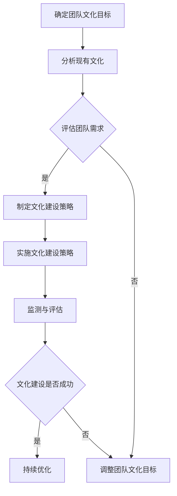

                 

### 团队文化建设：塑造独特团队特色的策略

#### 关键词：
- 团队文化
- 文化建设
- 团队绩效
- 领导理论
- 激励机制

#### 摘要：
本文旨在深入探讨团队文化建设的重要性以及如何通过科学的方法和策略来塑造独特的团队特色。我们将从理论基础、建设方法与实践、案例分析等多个角度进行分析，帮助团队领导者理解团队文化的核心概念，掌握团队文化建设的理论基础，并学会通过有效的策略和实践来提升团队绩效。通过本文，读者将能够了解如何通过团队价值观的塑造、沟通与协调、领导者的角色以及激励机制等手段，成功构建和维护一个具有独特特色的团队文化。

### 第一部分：团队文化建设的理论基础

#### 第1章：团队文化的核心概念

##### 1.1 团队文化的定义与特征

团队文化是指团队成员共同遵循的价值观、信仰、行为规范和习惯，它通过一系列的文化元素如愿景、使命、价值观、行为准则等表现出来。团队文化不仅反映了团队内部成员的共同认知和行为模式，还深刻影响着团队的整体运作效率。

**团队文化的特征：**

- **共同价值观：** 团队成员共享的核心信念和价值观。
- **行为规范：** 团队成员在行为上的共同规范和准则。
- **凝聚力：** 团队成员之间的紧密联系和相互支持。
- **适应性：** 团队文化能够适应外部环境的变化。
- **独特性：** 每个团队的文化都有其独特的特征。

##### 1.2 团队文化与个人行为的关系

团队文化对个人行为有着深远的影响。首先，团队文化通过共同的价值观和行为规范引导和规范团队成员的行为。其次，团队文化能够增强团队成员的归属感和认同感，促进团队成员之间的协作和沟通。此外，团队文化还能够激励团队成员为实现团队目标而努力。

##### 1.3 团队文化对团队绩效的影响

团队文化对团队绩效有着重要的影响。一个健康的团队文化能够促进团队成员之间的协作和沟通，提高团队的工作效率和创新能力。同时，团队文化还能够增强团队的凝聚力和归属感，提高团队的整体绩效。

**团队文化对团队绩效的影响：**

- **工作效率：** 健康的团队文化能够提高团队成员的工作效率。
- **创新能力：** 团队文化能够激发团队成员的创新能力。
- **团队绩效：** 健康的团队文化能够提升团队的整体绩效。

#### 第2章：团队文化建设的理论基础

##### 2.1 组织行为学的相关理论

组织行为学为团队文化建设提供了重要的理论基础。以下是一些关键的理论：

- **梅奥的人际关系理论：** 强调团队内部的人际关系对团队绩效的影响。
- **巴纳德的系统理论：** 认为团队是一个社会系统，强调沟通和信息传递的重要性。
- **费德勒的领导风格理论：** 提出领导风格对团队绩效的影响。

##### 2.2 领导理论对团队文化的影响

领导理论对团队文化建设有着重要的影响。以下是一些关键的领导理论：

- **布坎南的团队领导理论：** 强调领导者对团队文化建设的引导作用。
- **格森的团队发展模型：** 描述团队文化建设的阶段和过程。
- **赫塞和布兰查德的情境领导理论：** 强调领导者应根据团队的不同阶段和情境采取不同的领导策略。

##### 2.3 团队文化建设的影响因素

团队文化建设受到多种因素的影响，包括内部因素和外部因素。以下是一些关键的影响因素：

- **组织结构：** 组织结构对团队文化建设有着重要的影响。
- **领导者：** 领导者的行为和风格对团队文化建设有着深远的影响。
- **团队规模：** 团队规模对团队文化建设有着重要的影响。
- **外部环境：** 外部环境的变化对团队文化建设也有着重要的影响。

#### 第3章：团队文化建设的Mermaid流程图

为了更好地理解团队文化建设的步骤和关键因素，我们可以使用Mermaid流程图来描述。以下是一个简化的团队文化建设流程图：

通过这个流程图，我们可以清晰地看到团队文化建设的核心步骤和关键因素。

### 第二部分：团队文化建设的方法与实践

#### 第4章：团队文化建设的策略

##### 4.1 团队价值观的塑造与传播

团队价值观是团队文化的核心。要塑造和传播团队价值观，首先需要明确团队的共同价值观，并将其融入到团队的工作流程和日常行为中。以下是一些关键步骤：

1. **确定团队价值观：** 通过团队讨论和调查，明确团队的共同价值观。
2. **传播团队价值观：** 通过培训、会议、内部沟通等方式，将团队价值观传播给每个团队成员。
3. **实践团队价值观：** 通过具体的行为和决策，将团队价值观付诸实践。

##### 4.2 团队愿景与使命的制定

团队愿景和使命是团队文化的核心要素。它们能够为团队成员提供方向和动力，激发团队成员的积极性和创造力。以下是一些关键步骤：

1. **确定团队愿景：** 明确团队在未来的愿景和目标。
2. **确定团队使命：** 明确团队存在的目的和意义。
3. **沟通愿景与使命：** 通过内部沟通，确保每个团队成员都了解团队的愿景和使命。
4. **实践愿景与使命：** 通过具体的工作和行为，将团队愿景和使命付诸实践。

##### 4.3 团队制度建设

团队制度建设是团队文化建设的重要环节。通过建立合理的制度，可以规范团队成员的行为，促进团队的稳定和发展。以下是一些关键步骤：

1. **制定团队制度：** 根据团队的需求和特点，制定合理的团队制度。
2. **宣传和解释制度：** 通过培训和内部沟通，确保每个团队成员都了解并遵守团队制度。
3. **执行和监督制度：** 通过执行和监督，确保团队制度的落实和效果。
4. **优化和改进制度：** 根据实际情况，不断优化和改进团队制度。

#### 第5章：团队文化建设中的沟通与协调

##### 5.1 团队内部沟通的有效性

有效的沟通是团队文化建设的基石。通过有效的沟通，可以确保团队成员之间的信息传递准确、及时，促进团队的协作和合作。以下是一些关键步骤：

1. **建立沟通机制：** 制定明确的沟通流程和机制，确保团队成员之间的信息传递畅通。
2. **提高沟通技巧：** 通过培训和练习，提高团队成员的沟通技巧，包括倾听、表达和反馈。
3. **促进跨部门沟通：** 通过跨部门的沟通和合作，促进团队之间的协作和互动。
4. **鼓励开放和坦诚的沟通：** 创建一个开放和坦诚的沟通环境，鼓励团队成员自由表达意见和建议。

##### 5.2 团队成员间的协调与配合

团队成员间的协调与配合是团队文化建设的重要方面。通过有效的协调与配合，可以确保团队工作的高效和顺利。以下是一些关键步骤：

1. **明确分工和责任：** 通过明确团队成员的分工和责任，确保每个团队成员都清楚自己的角色和任务。
2. **建立协作机制：** 通过建立协作机制，确保团队成员之间的工作协同和配合。
3. **鼓励合作和互助：** 鼓励团队成员之间的合作和互助，共同解决问题和完成任务。
4. **定期评估和反馈：** 通过定期评估和反馈，及时了解团队成员的工作情况和问题，促进团队的改进和发展。

##### 5.3 团队文化建设中的冲突管理

冲突是团队建设中不可避免的一部分。有效的冲突管理可以帮助团队化解冲突，促进团队的和谐和稳定。以下是一些关键步骤：

1. **识别和诊断冲突：** 及时识别和诊断团队中的冲突，了解冲突的根源和影响。
2. **建立冲突解决机制：** 建立明确的冲突解决机制，包括冲突解决的流程和方式。
3. **进行沟通和协商：** 通过沟通和协商，找到解决冲突的方法和途径。
4. **提供培训和指导：** 通过提供培训和指导，帮助团队成员学会有效解决冲突的方法和技巧。

#### 第6章：团队文化建设中的领导角色

##### 6.1 领导者对团队文化建设的影响

领导者对团队文化建设有着重要的影响。领导者的行为、态度和风格直接影响着团队文化的形成和发展。以下是一些关键步骤：

1. **明确领导责任：** 领导者需要明确自己在团队文化建设中的责任和角色。
2. **树立榜样作用：** 领导者需要通过自己的行为和态度树立榜样，影响和引导团队成员。
3. **提供支持和资源：** 领导者需要为团队文化建设提供必要的人力、物力和财力支持。
4. **进行持续指导：** 领导者需要通过持续的指导和反馈，帮助团队成员理解和实践团队文化。

##### 6.2 领导者的行为与团队文化

领导者的行为对团队文化有着深远的影响。领导者的决策、行为和态度直接影响着团队文化的形成和发展。以下是一些关键步骤：

1. **制定明确的团队目标：** 领导者需要制定明确的团队目标，并将其融入到团队文化中。
2. **建立信任和尊重：** 领导者需要建立信任和尊重的团队氛围，促进团队成员之间的协作和合作。
3. **提供反馈和激励：** 领导者需要及时提供反馈和激励，帮助团队成员不断提高和进步。
4. **关注团队成长和发展：** 领导者需要关注团队的成长和发展，为团队提供良好的发展环境和机会。

##### 6.3 领导者如何推动团队文化建设

领导者可以通过以下方法推动团队文化建设：

1. **建立共同愿景：** 领导者需要与团队成员共同建立团队的愿景和目标，激发团队成员的积极性和创造力。
2. **塑造团队价值观：** 领导者需要通过树立榜样和明确团队价值观，引导团队成员的行为和决策。
3. **加强沟通与协作：** 领导者需要加强团队内部的沟通与协作，促进团队的整体运作效率。
4. **提供持续培训：** 领导者需要为团队成员提供持续的培训和指导，帮助团队成员不断提高和进步。

#### 第7章：团队文化建设中的激励机制

##### 7.1 激励理论在团队文化建设中的应用

激励理论在团队文化建设中具有重要的应用。以下是一些关键的激励理论：

1. **马斯洛的需求层次理论：** 根据马斯洛的需求层次理论，领导者需要满足团队成员的不同层次需求，激发团队成员的积极性和创造力。
2. **赫茨伯格的双因素理论：** 根据赫茨伯格的双因素理论，领导者需要同时关注工作环境和员工个人成长，提高员工的工作满意度和绩效。
3. **目标设定理论：** 根据目标设定理论，领导者需要为团队成员设定明确的、具有挑战性的目标，激发团队成员的积极性和动力。

##### 7.2 奖励与惩罚机制的设计

奖励与惩罚机制是团队文化建设中的重要手段。以下是一些关键步骤：

1. **制定明确的奖励与惩罚标准：** 领导者需要制定明确的奖励与惩罚标准，确保奖励与惩罚的公平性和合理性。
2. **提供多样化的奖励方式：** 领导者需要提供多样化的奖励方式，包括物质奖励和精神奖励，满足不同团队成员的需求。
3. **注重奖励与惩罚的及时性：** 领导者需要及时进行奖励与惩罚，确保团队成员能够及时了解自己的行为后果。
4. **注重奖励与惩罚的合理性：** 领导者需要确保奖励与惩罚的合理性，避免过度惩罚或过度奖励，影响团队的稳定和发展。

##### 7.3 激励机制的持续优化

激励机制的持续优化是团队文化建设的重要方面。以下是一些关键步骤：

1. **定期评估激励机制：** 领导者需要定期评估激励机制的有效性，发现问题和不足，及时进行调整和优化。
2. **收集员工反馈：** 领导者需要积极收集员工的反馈意见，了解员工的需求和期望，为激励机制的优化提供依据。
3. **提供培训与发展机会：** 领导者需要为员工提供培训与发展机会，帮助员工提升能力和素质，提高工作满意度和绩效。
4. **鼓励自主学习和创新：** 领导者需要鼓励员工自主学习和创新，为员工提供创新和发展的机会，激发员工的积极性和创造力。

### 第三部分：团队文化建设的实际案例分析

#### 第8章：企业团队文化建设的成功案例分析

##### 8.1 案例一：华为的团队文化建设

华为是全球领先的电信解决方案提供商，其团队文化建设独具特色，为企业的快速发展提供了强大的支持。

**华为团队文化的核心要素：**

1. **客户至上：** 华为始终坚持以客户为中心，为客户提供高质量的产品和服务。
2. **创新精神：** 华为鼓励员工创新，推动企业不断发展和进步。
3. **团队合作：** 华为强调团队合作，通过团队协作实现企业的共同目标。
4. **拼搏精神：** 华为鼓励员工拼搏，不断超越自我，追求卓越。

**华为团队文化建设的实践：**

1. **共同价值观的塑造：** 华为通过一系列的培训和内部沟通，将共同价值观深入人心，形成强大的文化凝聚力。
2. **领导者的示范作用：** 华为领导者的行为和态度树立了榜样，影响了整个团队。
3. **激励机制的设计：** 华为设计了多样化的激励机制，包括薪酬、晋升、荣誉等，激发了员工的积极性和创造力。
4. **团队协作的平台：** 华为建立了开放的团队协作平台，促进团队成员之间的沟通和协作。

**华为团队文化建设的成果：**

1. **企业绩效提升：** 华为的团队文化建设推动了企业的快速发展，提升了企业的绩效。
2. **创新能力增强：** 华为的团队文化建设激发了员工的创新精神，推动了企业的技术创新。
3. **团队凝聚力增强：** 华为的团队文化建设增强了团队的凝聚力，提高了团队的协作效率。

##### 8.2 案例二：谷歌的团队文化建设

谷歌是全球领先的科技公司，其团队文化建设为公司的创新和发展提供了强大的支持。

**谷歌团队文化的核心要素：**

1. **创新自由：** 谷歌鼓励员工创新，为员工提供自由创新的环境和资源。
2. **员工关怀：** 谷歌关注员工的成长和发展，为员工提供良好的工作环境和发展机会。
3. **团队合作：** 谷歌强调团队合作，通过团队协作实现公司的共同目标。
4. **开放透明：** 谷歌倡导开放透明的企业文化，鼓励员工自由表达意见和建议。

**谷歌团队文化建设的实践：**

1. **创新文化的塑造：** 谷歌通过一系列的培训和活动，将创新文化深入人心，形成了独特的团队文化。
2. **领导者的引导作用：** 谷歌领导者的行为和态度树立了榜样，影响了整个团队。
3. **激励机制的设计：** 谷歌设计了多样化的激励机制，包括薪酬、晋升、荣誉等，激发了员工的积极性和创造力。
4. **员工关怀的平台：** 谷歌建立了开放的员工关怀平台，为员工提供成长和发展机会。

**谷歌团队文化建设的成果：**

1. **企业创新力提升：** 谷歌的团队文化建设推动了企业的创新发展，提升了企业的竞争力。
2. **员工满意度提高：** 谷歌的团队文化建设增强了员工的满意度和归属感，提高了员工的工作积极性。
3. **团队合作效率提升：** 谷歌的团队文化建设促进了团队成员之间的协作和合作，提升了团队的工作效率。

### 第四部分：团队文化建设的挑战与持续策略

#### 第9章：团队文化建设中的挑战与应对策略

##### 9.1 团队文化建设的常见问题

在团队文化建设过程中，可能会遇到以下常见问题：

1. **文化冲突：** 由于团队成员来自不同的背景和文化，可能会产生文化冲突。
2. **执行力不足：** 团队成员对文化建设的理解和执行力不足，导致文化建设效果不佳。
3. **缺乏创新：** 团队文化建设过程中缺乏创新，导致文化建设停滞不前。
4. **领导力不足：** 领导者在团队文化建设中缺乏有效的领导力和影响力。

##### 9.2 团队文化建设的应对策略

针对以上问题，可以采取以下应对策略：

1. **加强文化融合：** 通过加强文化融合，促进团队成员之间的相互理解和尊重，减少文化冲突。
2. **提高执行力：** 通过制定明确的行动计划和责任分工，提高团队成员的执行力和文化建设效果。
3. **鼓励创新：** 通过鼓励创新，为团队成员提供创新的机会和资源，激发团队成员的创新活力。
4. **提升领导力：** 通过提升领导力，增强领导者在团队文化建设中的影响力和领导力。

##### 9.3 团队文化建设的长期持续策略

为了确保团队文化建设能够长期持续，可以采取以下策略：

1. **持续培训：** 通过持续培训，提高团队成员的文化建设意识和能力。
2. **定期评估：** 通过定期评估，及时发现和解决文化建设中的问题和挑战。
3. **激励机制：** 通过激励机制，激发团队成员参与文化建设的积极性和主动性。
4. **领导者的持续投入：** 通过领导者的持续投入，确保团队文化建设能够得到持续的关注和支持。

### 附录

#### 附录A：团队文化建设工具与资源推荐

**A.1 团队文化评估工具**

- **文化诊断工具：** 用于评估团队当前的文化状态。
- **文化问卷：** 用于收集团队成员对团队文化的看法和反馈。

**A.2 团队文化建设的方法与技巧**

- **团队建设活动：** 用于增强团队成员之间的协作和沟通。
- **文化故事分享：** 通过分享团队的故事和经验，加深团队成员对团队文化的理解。

**A.3 团队文化建设的相关书籍与文献推荐**

- 《团队协作的力量》
- 《团队文化：塑造高效团队的秘诀》
- 《团队建设：从零开始打造高效团队》

### 总结

团队文化建设是团队成功的关键因素之一。通过科学的方法和策略，领导者可以塑造独特的团队特色，提高团队绩效和竞争力。本文从团队文化的核心概念、理论基础、建设方法、实践案例分析等多个角度，系统地探讨了团队文化建设的策略和实践。希望读者能够通过本文，深入了解团队文化建设的重要性，掌握有效的建设方法和技巧，成功构建和维护一个具有独特特色的团队文化。

### 作者信息

- **作者：** AI天才研究院/AI Genius Institute & 禅与计算机程序设计艺术 /Zen And The Art of Computer Programming

