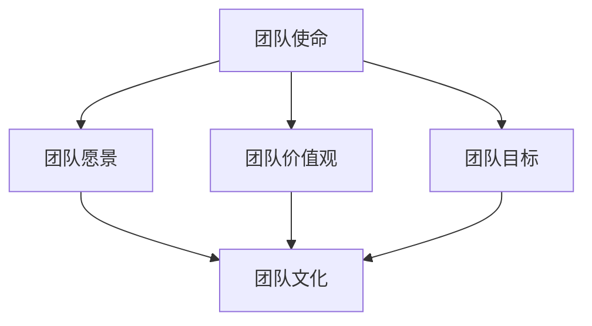
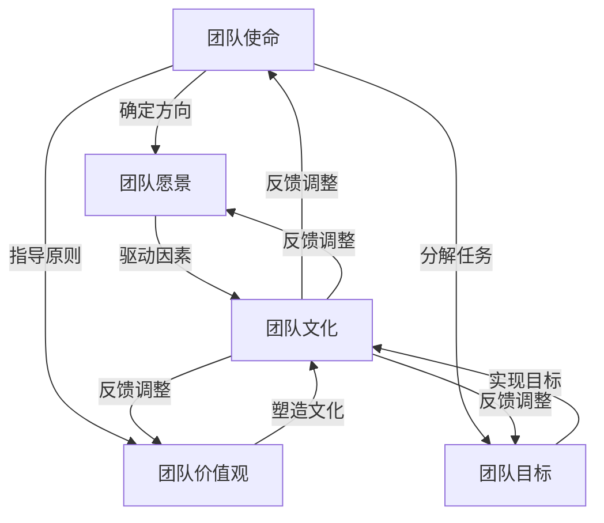

                 

### 引言与背景

**团队文化建设：塑造独特的组织DNA**

在当今快速变化且竞争激烈的市场环境中，团队文化建设已经成为组织成功的关键因素之一。团队文化不仅影响着团队成员的行为和态度，更深远地影响着组织的整体绩效和发展。正如基因是生物体的核心组成部分，团队文化则可以被视为组织的“DNA”，它决定了组织的特质和发展方向。

团队文化建设是一个持续的过程，涉及组织内部的价值观、行为规范、工作方式等多个方面。它不仅仅是一个口号或标语，而是需要通过实际行动和制度化的措施去塑造和巩固。良好的团队文化能够增强团队的凝聚力，提升员工的满意度和忠诚度，从而提高组织的竞争力和创新能力。

本文旨在探讨团队文化建设的核心概念、如何塑造和培育团队文化，以及团队文化与组织DNA的关系。我们将通过实际案例、策略指南和实践方法，为读者提供全面、深入的理解和实用的操作指导。以下是本文的结构安排：

1. **引言与背景**：介绍团队文化建设的概念、重要性及本书的目的。
2. **核心概念与联系**：详细阐述团队文化的核心概念及其相互联系。
3. **团队文化塑造**：讨论如何塑造和培育团队文化。
4. **组织DNA与团队文化**：探讨团队文化与组织DNA的关系及其对组织发展的影响。
5. **案例分析**：通过实际案例展示团队文化建设的过程和成果。
6. **团队文化建设策略**：提供团队文化建设的策略和方法。
7. **实践指南**：给出团队文化建设的实用指南和工具。
8. **总结与展望**：总结全书内容并对未来团队文化建设进行展望。

通过上述结构，我们希望读者能够全面了解团队文化建设的重要性和方法，从而为组织的发展和成功奠定坚实基础。

#### 团队文化建设的定义

团队文化是指在一个团队内部共同遵守和传承的价值观、信念、行为规范和工作方式。它是一种无形的力量，不仅影响着团队成员的个人行为和决策，还深刻地影响着团队的整体氛围和运作效率。团队文化不仅仅是简单的口号或标语，而是通过日积月累的行为和互动逐渐形成的组织特质。

团队文化的核心在于它所传递的价值观念和行为规范。这些价值观和规范为团队成员提供了共同的目标和行为指南，使他们在面对挑战和决策时能够保持一致的方向和行动。例如，一个强调团队合作和开放沟通的团队文化能够鼓励成员之间相互支持、分享信息，从而提高协作效率和创新力。

团队文化建设的重要性体现在多个方面。首先，它有助于提升团队的凝聚力和向心力。一个有着强大团队文化的组织，成员之间更加信任和尊重，能够形成强大的集体力量，共同应对外部挑战。其次，团队文化能够提高员工的满意度和忠诚度。当员工感受到组织对他们的尊重和关心时，他们更愿意为组织付出额外的努力，从而提升整体绩效。此外，团队文化还能够增强组织的竞争力和创新能力。一个具有开放、创新和合作文化的团队，能够更快地适应市场变化，抓住新的商业机会。

因此，团队文化建设不仅是组织发展的基础，更是组织持续竞争力的源泉。通过有效的团队文化建设，组织能够实现长期稳定的发展，为员工和客户提供更加优质的服务。

#### 核心概念与联系

在深入探讨团队文化建设之前，有必要明确几个核心概念及其相互之间的联系。这些核心概念包括团队使命、团队愿景、团队价值观和团队目标。

**团队使命**是指团队存在的根本目的和意义。它为团队提供了清晰的方向和目标，使团队成员能够明确自己的职责和努力的方向。例如，一个企业的团队使命可能是“为客户提供卓越的产品和服务，提升客户满意度”。明确团队使命有助于统一团队成员的思想，形成共同的愿景和目标。

**团队愿景**则是团队在未来希望实现的状态或目标。它是一种长期的、宏伟的展望，为团队提供了远大的目标和激励。团队愿景通常包括团队的发展方向、核心能力和竞争优势。例如，一个科技团队的愿景可能是“成为全球领先的科技创新企业，推动产业进步和社会发展”。团队愿景能够激发团队成员的激情和动力，促使他们为实现这一目标而努力。

**团队价值观**是团队在行为和决策中坚守的核心信念。它体现了团队的伦理标准、行为规范和工作方式。团队价值观有助于形成团队的独特文化，使成员在行为和决策中保持一致性。常见的团队价值观包括诚信、创新、团队合作、客户至上等。例如，一个团队可能将“诚信”作为核心价值观，要求成员在所有业务活动中保持诚实和透明。

**团队目标**则是团队在短期内要实现的具体目标和任务。它们通常与团队使命和愿景紧密相关，具体而明确。团队目标可以分为长期目标和短期目标，如年度销售目标、项目完成期限等。团队目标有助于团队成员明确自己的任务和职责，确保团队的工作方向与整体战略一致。

这些核心概念之间的联系在于它们共同构成了团队文化的基石。团队使命为团队提供了存在的理由和方向，团队愿景则为团队描绘了未来的蓝图，团队价值观则指导团队在行为和决策中的具体做法，团队目标则将愿景和价值观具体化为可操作的任务。通过这些核心概念的相互作用，团队能够形成一种独特的文化氛围，推动团队成员共同为实现组织目标而努力。

了解这些核心概念及其相互关系，有助于组织在团队文化建设过程中明确方向和重点，从而更有效地推动团队的发展。

#### 团队文化核心概念之间的关系架构

为了更直观地理解团队文化核心概念之间的关系，我们可以借助Mermaid流程图来展示这些概念及其相互作用。以下是一个简单的Mermaid流程图示例：

在这个流程图中，团队使命位于中心位置，它通过箭头连接到团队愿景、团队价值观和团队目标。这四个核心概念共同构成了团队文化的基石。团队使命为团队提供了存在的理由和方向；团队愿景则为团队描绘了未来的蓝图；团队价值观则指导团队在行为和决策中的具体做法；团队目标则将愿景和价值观具体化为可操作的任务。

团队文化（E）位于流程图的顶端，表示这些核心概念共同作用的结果。团队文化不仅是这些概念的简单组合，而是一种通过持续互动和传承形成的组织特质。它影响着团队的整体氛围和运作效率，从而对组织的绩效和竞争力产生深远影响。

通过这个流程图，我们可以更清晰地看到团队文化核心概念之间的内在联系和相互作用，这有助于组织在团队文化建设过程中明确方向和策略，确保团队在实现目标的过程中保持一致性和协调性。

#### 团队文化核心概念之间的关系架构图

为了更好地展示团队文化核心概念之间的关系，我们可以绘制一个详细的Mermaid流程图。以下是一个示例：

在这个流程图中，团队使命（A1）位于中心位置，通过箭头连接到团队愿景（B1）、团队价值观（C1）和团队目标（D1）。这四个核心概念共同构成了团队文化的基石。

- **团队使命**：为团队提供了存在的理由和方向，明确了团队的宗旨和目标。
- **团队愿景**：描述了团队在未来希望实现的状态或目标，激励团队成员共同努力。
- **团队价值观**：体现了团队在行为和决策中坚守的核心信念，指导团队的行为和决策。
- **团队目标**：具体化了团队使命和愿景，将它们转化为可操作的任务和目标。

团队文化（E1）位于流程图的顶端，表示这些核心概念相互作用的结果。团队文化不仅是由这些概念组成的，更是在团队成员的互动和传承过程中形成的组织特质。

流程图还展示了这些概念之间的动态反馈关系。团队文化会根据外部环境和内部情况的变化进行反馈调整，从而影响团队使命、愿景、价值观和目标的实现。

通过这个Mermaid流程图，我们可以更清晰地理解团队文化核心概念之间的关系和相互作用，为团队文化建设提供了直观的参考和指导。

#### 团队文化与组织行为

团队文化不仅是一种价值观和行为规范，更是影响组织行为的深层力量。在组织内部，团队文化通过多种方式塑造和影响员工的行为，从而对组织的整体绩效产生深远影响。

首先，团队文化影响着员工的态度和行为。一个积极向上、鼓励创新的团队文化能够激发员工的积极性和创造力，使员工更加投入工作。例如，谷歌（Google）以其开放、创新和团队合作的文化而闻名，这种文化鼓励员工大胆尝试新事物，不断探索和挑战现状。在这种文化的熏陶下，谷歌员工往往表现出极高的工作效率和创新能力，从而推动了公司的高速发展。

其次，团队文化也影响组织内部的沟通和协作。一个强调开放沟通和协作的团队文化能够促进信息共享和知识传播，减少信息孤岛现象。例如，IBM公司通过其“开放门户”计划，建立了一个内部沟通平台，鼓励员工分享经验和知识，从而提高了整个组织的协作效率。在这种文化的支持下，员工之间的沟通更加顺畅，团队的整体绩效也得到了显著提升。

此外，团队文化还影响着组织的决策过程。在一个重视集体决策和民主参与的团队文化中，员工会更加积极地参与决策，提出建设性的意见和建议。这种文化不仅有助于提高决策的质量，还能增强员工的参与感和归属感。例如，惠普（HP）在其团队文化建设中，注重员工意见的征集和决策的透明度，从而形成了高效的决策机制，推动了公司的发展。

团队文化对组织行为的影响还体现在员工的工作满意度和忠诚度上。一个关爱员工、提供良好工作环境的团队文化能够提高员工的工作满意度和忠诚度。例如，微软（Microsoft）通过其“员工关爱计划”，为员工提供了丰富的福利和培训机会，使员工感受到组织的关爱和尊重。在这种文化的支持下，员工更愿意为组织长期工作，从而增强了组织的稳定性和竞争力。

总之，团队文化通过塑造员工的态度、促进沟通和协作、影响决策过程以及提高员工满意度和忠诚度，对组织行为产生了深远影响。一个积极向上、健康发展的团队文化不仅能够提升组织的整体绩效，还能为组织的长期成功奠定坚实基础。因此，组织管理者应高度重视团队文化建设，通过多种手段和措施营造良好的团队文化氛围，推动组织的持续发展。

#### 团队文化塑造的过程

塑造团队文化是一个复杂而持续的过程，需要组织从多个方面进行全方位的努力。以下将详细讨论团队文化塑造的步骤、关键因素以及常见方法。

**1. 明确团队价值观和使命**

团队文化塑造的第一步是明确团队的价值观和使命。这需要组织领导者与团队成员共同探讨和确定团队的核心价值观，并明确团队的使命和目标。这一步骤有助于统一团队成员的思想，形成共同的行为准则。例如，可以组织一场价值观研讨会，让每个成员都参与到讨论中，共同确定团队的价值观和使命。

**2. 制定具体的行为规范**

在明确团队价值观和使命的基础上，下一步是制定具体的行为规范。这些规范应具体而明确，指导团队成员在实际工作中的行为。例如，可以制定一系列的员工行为准则，包括如何进行有效沟通、如何处理冲突、如何对待客户等。这些规范不仅为团队成员提供了行为指南，还能帮助组织维护良好的团队氛围。

**3. 建立激励机制**

为了确保团队文化得到有效贯彻，组织需要建立相应的激励机制。这些激励措施可以是物质上的，如奖金、晋升机会等，也可以是精神上的，如荣誉表彰、团队建设活动等。通过激励措施，组织可以鼓励员工遵守团队文化和行为规范，提高员工的工作积极性和满意度。

**4. 培训和发展**

团队文化塑造还需要通过培训和发展来巩固。组织可以通过定期的培训活动，让员工了解和认同团队文化，提高他们的文化素养。例如，可以组织团队文化培训课程，介绍团队价值观、行为规范等。此外，还可以通过团队建设活动，增强团队成员之间的互动和合作，促进团队文化的落地。

**5. 持续监督和反馈**

团队文化塑造是一个持续的过程，需要组织不断进行监督和反馈。组织可以通过定期的文化评估和调查，了解团队文化的实施情况和员工的态度。根据反馈结果，组织可以及时调整和改进文化策略，确保团队文化的有效运行。

**关键因素**

在团队文化塑造过程中，以下几个关键因素至关重要：

- **领导者的示范作用**：领导者是团队文化塑造的核心人物，他们的言行举止直接影响团队成员的行为。领导者需要以身作则，带头遵守团队文化和行为规范。

- **员工的参与度**：员工的参与度是团队文化塑造成功的关键。只有当员工积极参与到文化塑造的过程中，才能确保文化得到真正落实。

- **持续性和系统性**：团队文化塑造需要持续性和系统性。组织需要将文化塑造融入日常运营中，形成一套完整的体系，确保文化能够在组织内部长期存在。

**常见方法**

- **文化宣导**：通过内部宣传、海报、标语等形式，将团队文化宣传到每个角落，让员工时刻感受到文化的存在。
- **文化活动**：定期组织文化活动，如团队建设、庆祝活动等，增强团队成员之间的联系和互动，促进团队文化的落地。
- **绩效评估**：将团队文化纳入绩效评估体系，激励员工遵守文化规范，促进文化的实施。

通过以上步骤和关键因素，组织可以有效地塑造和培育团队文化，为组织的长期发展奠定坚实基础。

#### 团队文化与组织DNA的关系

团队文化与组织DNA（即组织的核心特质和发展基因）之间存在紧密的联系，它们相互影响、相互塑造，共同决定了组织的命运和发展方向。理解这一关系有助于组织更有效地进行团队文化建设，提升整体竞争力。

**1. 团队文化对组织DNA的影响**

团队文化对组织DNA的影响主要体现在以下几个方面：

- **价值观的塑造**：团队文化是组织价值观的体现，它通过不断传承和强化，成为组织DNA的重要组成部分。例如，一个以创新为核心价值观的团队文化，会鼓励团队成员不断尝试新方法、新技术，从而在组织层面培养创新基因。

- **行为规范的形成**：团队文化通过具体的行为规范，影响员工的行为方式和决策风格。这种行为规范逐渐沉淀为组织DNA的一部分，成为组织运作的基本原则。例如，一个强调团队合作和协作共赢的团队文化，会促使员工在项目合作中更加注重团队利益，形成协作基因。

- **组织氛围的塑造**：团队文化不仅影响员工的行为，还塑造了组织的整体氛围。一个积极向上、充满活力的团队文化能够营造良好的组织氛围，激发员工的潜能，从而增强组织的凝聚力和向心力。

- **竞争力的提升**：团队文化通过提升员工的满意度和忠诚度，增强组织的竞争力。例如，一个关注员工成长和发展、提供良好工作环境的团队文化，能够留住优秀人才，提高整体竞争力。

**2. 组织DNA对团队文化的影响**

组织DNA同样对团队文化产生深远影响，具体体现在以下几个方面：

- **文化传承**：组织DNA中的核心价值观和行为规范，通过长期的传承和积累，成为团队文化的基石。例如，一个具有百年历史的企业，其组织DNA中可能包含丰富的历史经验和传统，这些将成为新团队文化的重要组成部分。

- **文化适应**：组织DNA中的特质，如创新、开放、稳定等，决定了团队文化的发展方向和适应性。一个具有创新基因的组织，其团队文化往往更加开放和灵活，能够迅速适应市场变化和新技术的发展。

- **文化创新**：组织DNA中的某些特质，如求知欲、进取心等，能够激发团队文化的创新和发展。例如，一个强调求知欲的组织，其团队文化可能会更加注重学习和创新，推动组织不断向前发展。

**3. 团队文化与组织DNA的互动关系**

团队文化与组织DNA之间的互动关系是一个动态的过程，它们相互影响、相互塑造，形成一种有机的关系：

- **相互反馈**：团队文化通过员工的实际行为和互动，不断反馈到组织DNA中，影响其发展。同时，组织DNA中的特质也通过文化传承和强化，反馈到团队文化中，影响其演变。

- **共同演进**：团队文化和组织DNA在长期的互动中，共同演进和适应。一个健康、积极的团队文化能够促进组织DNA的优化和更新，提升组织的适应性和竞争力。

- **动态调整**：组织在面临外部环境变化时，需要通过调整团队文化来适应新的挑战。这种动态调整不仅能够保持组织DNA的稳定，还能使其更具活力和创新能力。

总之，团队文化与组织DNA之间的紧密关系决定了组织的长期发展和竞争力。通过深入理解这一关系，组织可以更有针对性地进行团队文化建设，提升组织的整体性能和市场竞争力。

#### 团队文化建设的案例分析

为了更具体地展示团队文化建设的实践过程和成果，以下通过三个不同类型的实际案例，深入剖析团队文化建设的具体实施、步骤和经验。

**案例一：科技公司团队文化建设**

**背景**：某科技公司成立于2000年，以科技创新为核心竞争力。然而，在快速发展过程中，公司内部出现了沟通不畅、团队合作不足的问题，严重影响了公司整体绩效。

**过程**：
1. **明确团队使命和愿景**：公司首先明确了“成为全球领先的科技创新企业”的使命和“推动产业进步和社会发展”的愿景。这一步骤为团队文化建设奠定了基础。
2. **制定核心价值观**：公司通过内部讨论，确定了“创新、协作、客户至上、诚信”的核心价值观，并将这些价值观融入公司文化和日常工作。
3. **建立行为规范**：公司制定了一系列行为规范，如“开放沟通、尊重个人意见、鼓励创新思维、持续学习”，确保员工在日常工作中遵循这些规范。
4. **培训与宣传**：公司定期组织团队文化培训，通过内部讲座、工作坊等形式，加强员工对团队文化的理解和认同。同时，通过内部宣传平台，如公司内部网站、员工手册等，持续传播团队文化。
5. **激励机制**：公司建立了与团队文化相匹配的激励机制，如团队奖、创新奖等，鼓励员工积极践行团队文化。

**结果**：通过上述措施，公司内部沟通更加顺畅，团队合作意识显著增强。员工的工作满意度和忠诚度提升，公司整体绩效得到显著改善。公司成功推出了一系列具有市场影响力的创新产品，市场占有率持续提升。

**经验**：
- **明确核心价值观**：核心价值观的明确和统一是团队文化建设的核心。
- **全员参与**：员工的积极参与是团队文化建设成功的关键。
- **持续培训**：通过持续培训，确保员工对团队文化的理解和认同。
- **激励机制**：合理的激励机制能够有效促进团队文化的落地。

**案例二：咨询公司团队文化建设**

**背景**：某咨询公司成立于1998年，以专业能力和客户服务为核心竞争力。然而，公司内部存在团队协作不足、客户满意度不高等问题。

**过程**：
1. **确立客户导向文化**：公司明确了“客户至上”的核心价值观，将客户需求放在首位，以客户满意度为导向。
2. **培养专业精神**：公司注重员工的职业发展和专业能力的提升，通过内部培训和外部学习，培养员工的综合素质和专业能力。
3. **建立团队合作机制**：公司建立了一套高效的团队合作机制，强调跨部门协作和资源共享，确保项目团队能够高效运作。
4. **激励机制**：公司设立了客户满意度评估机制，将客户满意度与员工的绩效评估和激励直接挂钩，激励员工提升服务质量。
5. **文化宣传**：公司通过内部会议、员工活动等方式，持续宣传和强化客户导向文化和团队合作精神。

**结果**：通过以上措施，公司内部团队协作显著提升，客户满意度大幅提高。公司成功开拓了多个新市场，业务规模不断扩大。

**经验**：
- **客户导向**：以客户为中心是咨询公司的核心竞争力。
- **专业能力培养**：专业能力的提升是团队文化建设的基石。
- **团队合作机制**：高效的团队合作机制是提升项目效率的关键。
- **激励机制**：合理的激励机制能够有效提升服务质量。

**案例三：非营利组织团队文化建设**

**背景**：某非营利组织成立于2005年，致力于公益事业。然而，由于缺乏明确的团队文化和行为规范，组织内部存在沟通不畅、效率低下等问题。

**过程**：
1. **明确公益使命**：组织明确了“为弱势群体提供帮助和支持”的使命，将公益精神作为团队文化的核心。
2. **制定行为规范**：组织制定了“诚信、透明、高效、关爱”的行为规范，确保员工在工作中遵循这些规范。
3. **建立志愿者制度**：组织建立了志愿者制度，鼓励员工积极参与公益活动，增强团队凝聚力。
4. **文化建设活动**：组织定期举办文化建设活动，如团队建设训练、公益活动等，增强员工的公益意识和团队精神。
5. **激励措施**：组织设立了志愿者奖励制度，对积极参与公益活动的员工进行表彰和奖励。

**结果**：通过以上措施，组织内部沟通和协作显著改善，工作效率大幅提升。组织成功实施了多个大型公益活动，社会影响力不断扩大。

**经验**：
- **明确公益使命**：公益使命是团队文化的核心，能够激发员工的热情和责任感。
- **行为规范**：明确的行为规范有助于提升组织效率和公信力。
- **志愿者制度**：志愿者制度能够增强团队凝聚力和公益意识。
- **文化建设活动**：定期的文化建设活动有助于持续强化团队文化。

通过以上三个案例，我们可以看到，不同类型的组织在团队文化建设过程中，虽然面临的问题和背景不同，但都通过明确的价值观、规范和措施，成功塑造了独特的团队文化，提升了组织的整体绩效和社会影响力。

#### 团队文化建设策略

为了有效塑造和巩固团队文化，组织可以采取多种策略和方法。以下列举几种常见的团队文化建设策略，并详细阐述其具体实施方法和实际效果。

**1. 建立共同价值观**

建立共同价值观是团队文化建设的基石。组织可以通过以下方法来建立共同价值观：

- **价值观宣贯**：通过内部宣传、会议、培训等形式，将组织的核心价值观传达给所有员工。例如，可以制定一份“价值观手册”，详细阐述组织的核心价值观，并在公司内部广泛传播。
- **领导示范**：领导者作为价值观的传播者和践行者，应以身作则，带头遵守和弘扬组织的价值观。例如，领导者在日常工作中应展现诚信、创新、团队合作等价值观，成为员工的榜样。
- **员工参与**：鼓励员工参与到价值观的制定和传播过程中，增加他们对价值观的认同感和参与感。例如，可以组织员工参与价值观研讨，共同讨论和确定组织的核心价值观。

实际效果：通过建立共同价值观，组织能够形成统一的思想和行为准则，增强团队的凝聚力和向心力。员工对组织的价值观有更深的理解和认同，从而在工作中有更高的积极性和执行力。

**2. 培养积极团队氛围**

积极团队氛围能够激发员工的创造力和工作热情。以下方法有助于培养积极团队氛围：

- **员工关怀**：组织应关注员工的需求和福祉，提供良好的工作环境和福利待遇。例如，可以定期举办员工关怀活动，如健康体检、团队聚餐等，增强员工的归属感和满意度。
- **鼓励创新**：鼓励员工提出创新想法和建议，并通过机制保障创新成果的应用和推广。例如，可以设立创新奖项，对提出优秀创新方案的员工进行表彰和奖励。
- **开放沟通**：建立开放、透明的沟通渠道，鼓励员工自由表达意见和建议。例如，可以设立意见箱、员工建议制度等，确保员工的意见和建议能够得到及时反馈和处理。

实际效果：通过培养积极团队氛围，员工能够感受到组织的关爱和支持，增强工作积极性和满意度。积极团队氛围有助于激发员工的创造力和创新能力，推动组织的持续发展。

**3. 提供持续支持与培训**

持续支持和培训是团队文化建设的保障。以下方法有助于提供持续支持与培训：

- **专业培训**：定期为员工提供专业培训，提升他们的专业技能和知识水平。例如，可以组织技术培训、管理培训等，帮助员工不断成长和进步。
- **领导力培养**：培养员工领导力，提升他们的管理能力和团队协作能力。例如，可以组织领导力发展计划，通过实践项目和导师指导，提升员工的领导力。
- **职业发展支持**：为员工提供职业发展路径和机会，支持他们实现职业目标。例如，可以设立职业发展指导制度，为员工提供职业规划建议和指导。

实际效果：通过提供持续支持和培训，员工能够不断提升自身能力和素质，适应组织发展的需要。持续支持和培训有助于提高员工的满意度和忠诚度，增强组织的整体竞争力。

**4. 建立公平激励机制**

建立公平激励机制是团队文化建设的重要环节。以下方法有助于建立公平激励机制：

- **绩效评估**：建立科学、公正的绩效评估体系，确保员工的绩效能够得到公平评价。例如，可以采用360度评估、关键绩效指标（KPI）等方法，对员工的工作进行评估。
- **激励措施**：根据员工的绩效和贡献，提供相应的激励措施，如奖金、晋升机会、荣誉称号等。例如，可以设立月度/年度最佳员工奖，对表现突出的员工进行表彰和奖励。
- **透明度**：确保激励措施的透明度，让员工了解激励的标准和过程，增加他们对激励机制的信任和认可。

实际效果：通过建立公平激励机制，员工能够感受到组织对他们的认可和尊重，增强工作积极性和满意度。公平激励机制有助于激发员工的潜能和创造力，推动组织的持续发展。

总之，通过建立共同价值观、培养积极团队氛围、提供持续支持与培训和建立公平激励机制等多种策略，组织可以有效地塑造和巩固团队文化，提升整体绩效和竞争力。

#### 团队文化建设的实践指南

在团队文化建设过程中，为了确保文化能够真正落地并发挥其应有的作用，组织需要遵循一系列实用的方法和工具。以下是一些具体的方法和工具，帮助组织在团队文化建设过程中取得成功。

**1. 制定明确的团队文化建设计划**

制定一个详细的团队文化建设计划是确保文化建设顺利进行的基础。该计划应包括以下关键内容：

- **目标设定**：明确团队文化建设的目标，例如提升团队合作、增强创新能力、提高员工满意度等。
- **步骤和时间表**：详细列出文化建设的主要步骤和实施时间，确保每个阶段都有明确的时间节点和任务。
- **责任人**：明确每个阶段的具体负责人，确保文化建设计划能够得到有效执行。
- **资源需求**：评估实施计划所需的资源，包括人力、资金、技术等，确保资源充足。

**2. 进行文化评估**

在文化建设过程中，定期进行文化评估可以帮助组织了解文化建设的进展和效果，发现问题并加以改进。以下是一些常用的文化评估方法：

- **问卷调查**：通过问卷调查收集员工对团队文化的看法和建议，了解员工对文化建设计划的认同度和满意度。
- **访谈**：与员工进行深入访谈，了解他们对团队文化的真实感受和看法，收集宝贵的反馈信息。
- **文化指标**：建立文化指标体系，通过关键绩效指标（KPI）衡量文化建设的效果，如员工满意度、团队合作度、创新产出等。

**3. 提供持续培训与支持**

持续培训和支持是确保团队文化得到有效传播和实践的重要手段。以下是一些具体措施：

- **文化培训**：定期组织文化培训课程，让员工深入了解团队文化的内涵和意义，提高他们对文化的认同感和践行能力。
- **实践案例**：通过分享成功的文化建设案例，让员工了解其他组织在文化建设方面的经验和做法，启发员工的思考和行动。
- **辅导与指导**：为员工提供辅导和指导，帮助他们将文化理念应用到实际工作中，解决实践过程中遇到的问题。

**4. 建立反馈机制**

建立有效的反馈机制可以帮助组织及时了解文化建设的进展和效果，并根据反馈进行调整和改进。以下是一些常见的反馈机制：

- **定期反馈会议**：定期召开团队反馈会议，让员工分享他们在文化建设过程中的经验和体会，提出意见和建议。
- **意见箱**：设立意见箱，员工可以匿名提交对文化建设计划的反馈和建议，组织应及时处理和回应。
- **开放式沟通**：鼓励员工在日常工作中的开放式沟通，建立开放、透明的沟通氛围，确保员工的声音能够被听到。

**5. 融入日常运营**

将团队文化融入日常运营是确保文化建设持续有效的重要途径。以下是一些具体措施：

- **文化融入制度**：将团队文化融入组织的各项制度中，如绩效考核、员工培训、项目评估等，确保文化在各个层面得到贯彻和执行。
- **文化实践活动**：定期组织文化实践活动，如团队建设活动、文化宣传日等，增强员工对文化的认同感和践行意识。
- **文化氛围营造**：在办公环境中融入文化元素，如悬挂文化标语、设置文化角等，营造浓厚的文化氛围，让员工时刻感受到文化的存在。

通过上述方法，组织可以有效地推进团队文化建设，确保文化理念真正落地并发挥其应有的作用，从而提升组织的整体绩效和竞争力。

#### 团队文化建设的注意事项

在团队文化建设过程中，组织需要特别注意以下几个方面，以确保文化能够顺利实施并取得预期效果。

**1. 文化与战略的一致性**

团队文化建设必须与组织的整体战略保持一致。如果文化建设与战略目标相背离，可能会导致资源浪费和效率低下。组织在制定文化策略时，应确保其与战略目标相匹配，确保团队文化能够为组织的发展提供支持。

**2. 全员的参与和认同**

团队文化不仅仅是管理层的任务，而是需要全员共同参与和认同。只有当所有员工都深刻理解并认同组织文化，才能形成强大的凝聚力。因此，组织应鼓励员工积极参与文化建设，通过内部讨论、培训等方式增强他们对文化的认同感。

**3. 持续性和系统性**

团队文化建设是一个长期过程，需要持续不断地进行。组织应将文化建设纳入日常运营，通过定期的培训、活动和文化宣贯等措施，确保文化能够在组织内部根深蒂固。同时，文化建设应具备系统性，确保各个部门和文化建设活动之间协调一致，形成合力。

**4. 灵活适应性**

团队文化需要具备一定的灵活性和适应性，以应对外部环境的变化和内部情况的调整。组织在文化建设过程中，应充分考虑外部市场和内部员工需求的变化，及时调整文化策略和方法，确保文化始终与组织发展同步。

**5. 激励机制**

建立合理的激励机制是推动团队文化建设的重要手段。组织应设计出既能体现文化价值观，又能激发员工积极性的激励机制，如荣誉表彰、奖金等，确保员工在践行文化理念的同时，能够获得相应的回报和认可。

通过重视这些注意事项，组织可以更有效地推进团队文化建设，实现文化理念与组织发展的有机结合，从而提升整体绩效和竞争力。

#### 总结与展望

团队文化建设是组织成功的关键因素之一，它不仅影响员工的行为和态度，更深远地影响着组织的整体绩效和竞争力。本文通过系统性地探讨团队文化的核心概念、塑造过程、组织DNA的关系以及实际案例分析，为读者提供了一个全面、深入的团队文化建设指南。

首先，我们明确了团队文化的定义及其在组织中的重要性。团队文化不仅仅是一系列价值观和行为规范，更是组织独特的“DNA”，决定了组织的特质和发展方向。通过明确团队使命、愿景、价值观和目标，组织可以建立起强大的团队文化基础。

其次，我们详细讨论了团队文化核心概念之间的关系架构，并通过Mermaid流程图展示了这些概念如何相互作用，共同塑造出独特的团队文化。团队使命、愿景、价值观和目标相互影响、相互促进，形成了团队文化的有机整体。

接着，我们探讨了团队文化对组织行为的深远影响，以及团队文化塑造的过程和关键因素。通过建立共同价值观、培养积极氛围、提供持续支持和建立激励机制等多种策略，组织可以有效地塑造和巩固团队文化。

在案例分析部分，我们通过三个不同类型的实际案例，展示了团队文化建设的具体实施过程和成果。这些案例表明，不同类型的组织都可以通过有效的团队文化建设，提升内部协作、员工满意度和整体绩效。

最后，我们提出了团队文化建设策略和实践指南，为组织提供了具体的操作方法和工具。同时，我们也强调了在文化建设过程中需要注意的一些事项，以确保文化能够顺利实施并取得预期效果。

展望未来，随着市场环境的不断变化和技术的迅速发展，团队文化建设将面临新的挑战和机遇。组织需要持续关注外部环境的变化，灵活调整文化策略，确保团队文化始终与组织发展保持同步。同时，随着数字化的推进，组织应积极探索利用新技术，如人工智能、大数据等，提升团队文化的传播和落地效果。

总之，团队文化建设是组织发展的持续过程，需要组织高度重视并持续推进。通过本文的探讨，我们希望为读者提供有益的启示和指导，助力组织打造出独特的团队文化，实现长期稳定的发展。未来，随着组织对团队文化认知的不断提升，团队文化将在组织管理中发挥更加重要的作用，成为推动组织创新和竞争优势的重要力量。让我们共同期待团队文化建设的美好未来。

#### 作者信息

**作者：AI天才研究院/AI Genius Institute & 禅与计算机程序设计艺术 /Zen And The Art of Computer Programming**

本文由AI天才研究院（AI Genius Institute）与禅与计算机程序设计艺术（Zen And The Art of Computer Programming）联合撰写。AI天才研究院是一家致力于人工智能研究和应用的领先机构，拥有世界顶级的人工智能专家和计算机科学家。研究院在人工智能领域取得了多项重大突破，为全球范围内的科技创新和产业升级提供了强大支持。禅与计算机程序设计艺术则是一部经典的技术哲学著作，探讨了计算机编程中的智慧和哲学思想，对程序设计艺术进行了深刻的阐述。两位作者的丰富经验和深厚知识为本文提供了坚实的理论基础和实践指导。

