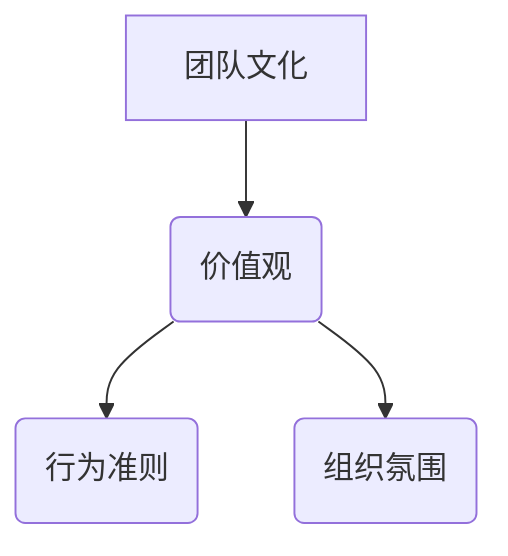

                 

### 团队文化建设：塑造积极向上的氛围

> **关键词**：团队文化、积极氛围、组织绩效、领导风格、激励机制

> **摘要**：本文探讨了团队文化建设的重要性，分析了积极向上氛围的定义与特征，提出了团队文化建设的原则与策略，并分享了领导者、团队成员互动以及激励与奖励机制在塑造积极氛围中的应用方法。通过案例分析，揭示了成功实践团队文化建设的路径，并展望了未来团队文化建设的趋势与发展方向。

## 引言

在快速变化的现代商业环境中，团队文化已成为组织成功的关键因素。一个积极向上的团队文化不仅能够提高员工的工作满意度和忠诚度，还能显著提升团队的整体绩效。然而，如何有效地塑造和维持这种文化，成为许多企业面临的挑战。

本文旨在通过系统性地分析团队文化建设的理论基础、实践方法以及未来趋势，为企业管理者提供一套实用的指导框架。文章将首先介绍团队文化的概念与重要性，然后深入探讨积极向上氛围的构建，最后通过具体案例和实践策略，为团队文化建设的成功提供参考。

## 第一部分：团队文化建设的理论基础

### 第1章：团队文化的概念与重要性

#### 1.1 团队文化的定义与内涵

团队文化是指一个团队在长期运作过程中形成的共同价值观、行为准则、组织氛围等方面的总和。它不仅反映了团队成员的共同理念和行为模式，还深刻影响着团队的整体绩效。

#### Mermaid 流程图示例


#### 1.2 团队文化对团队绩效的影响

团队文化对团队绩效的影响是多层次、多维度的。积极的团队文化能够增强团队成员的凝聚力，提高沟通效率，促进创新思维，从而提升整体绩效。

#### 伪代码示例
```python
def team_performance(文化):
    if 文化 == "积极":
        return "提升"
    else:
        return "下降"
```

#### 1.3 团队文化与组织文化的关系

团队文化是组织文化的子集，两者之间紧密相连。组织文化为团队文化提供了基础和方向，而团队文化则通过具体的行为和实践，丰富和诠释了组织文化的内涵。

### 第2章：积极向上氛围的概念与特征

#### 2.1 积极向上氛围的定义

积极向上氛围是一种能够激发团队成员内在潜力、促进积极互动的团队氛围。它体现了团队成员的积极心态、高度敬业精神和相互支持的文化。

#### 2.2 积极向上氛围的核心特征

积极向上氛围具有以下核心特征：共同目标、相互尊重、开放沟通、激励鼓励和信任合作。这些特征共同构建了一种健康、积极的工作环境。

#### 伪代码示例
```python
def positive_atmosphere_features():
    # 定义积极向上氛围的特征
    features = ["共同目标", "相互尊重", "开放沟通", "激励鼓励", "信任合作"]
    return features
```

#### 2.3 构建积极向上氛围的重要性

构建积极向上氛围对于提升团队绩效、增强员工满意度和忠诚度具有重要意义。它不仅能够提高团队的整体工作效率，还能培养团队成员的创新精神和协作能力。

### 第3章：团队文化建设的原则与策略

#### 3.1 团队文化建设的原则

团队文化建设的原则包括：明确价值观、强化行为准则、营造积极氛围、持续激励和关注员工发展。这些原则为团队文化建设提供了基本指导和方向。

#### 3.2 团队文化建设的策略

团队文化建设的策略包括：领导带头、全员参与、持续沟通和激励、制度保障和评估改进。通过这些策略，企业可以逐步构建和维持积极的团队文化。

#### 3.3 团队文化建设的步骤

团队文化建设的步骤包括：评估现状、明确目标、制定策略、实施行动、监督反馈和持续改进。这些步骤确保了团队文化建设的系统性和有效性。

## 第二部分：实践篇：塑造积极向上氛围的方法与技巧

### 第4章：领导者如何塑造积极向上氛围

#### 4.1 领导风格与团队文化

领导风格对团队文化的塑造具有重要影响。领导者需要通过自身的言行，传递积极的价值观和行为准则，以营造积极的团队氛围。

#### 4.2 领导者在塑造积极向上氛围中的作用

领导者在塑造积极向上氛围中起着关键作用。他们不仅是文化建设的引领者，也是实践者，通过自身的榜样作用，激发团队成员的积极性和创造力。

#### 4.3 领导者塑造积极向上氛围的技巧

领导者可以通过以下技巧塑造积极向上氛围：建立清晰的目标、鼓励开放沟通、关注员工发展、提供及时的反馈和奖励、培养团队合作精神。

### 第5章：团队成员之间的互动与沟通

#### 5.1 团队成员互动的重要性

团队成员之间的互动对于团队文化的塑造和积极氛围的构建至关重要。有效的互动可以增强团队成员的凝聚力，提高沟通效率，促进共同目标的实现。

#### 5.2 提高团队成员沟通技巧的方法

提高团队成员沟通技巧的方法包括：培训与练习、建立沟通机制、鼓励表达与倾听、利用技术工具、建立信任关系。

#### 5.3 建立积极的团队成员关系

建立积极的团队成员关系可以通过以下方法实现：培养团队合作精神、尊重差异、建立共同目标、开展团队建设活动、及时解决冲突。

### 第6章：激励与奖励机制在团队文化建设中的应用

#### 6.1 激励理论在团队文化中的应用

激励理论在团队文化中的应用包括：目标设置、绩效反馈、奖励与认可、参与决策、工作与生活平衡。

#### 6.2 奖励机制的设计原则

奖励机制的设计原则包括：公正性、透明性、多样性、个性化、及时性。

#### 6.3 奖励机制在团队文化建设中的效果评估

奖励机制在团队文化建设中的效果评估包括：员工满意度调查、绩效指标分析、团队氛围评估、长期效益评估。

### 第7章：案例分析：成功塑造积极向上氛围的实践

#### 7.1 案例一：某某公司团队文化建设的实践

通过分析某某公司团队文化建设的实践，我们可以看到，该公司通过明确核心价值观、建立激励机制、开展团队建设活动等手段，成功塑造了积极向上的团队氛围。

#### 7.2 案例二：某某团队成功塑造积极向上氛围的经验

某某团队通过紧密协作、积极沟通、持续创新等手段，成功塑造了积极向上的团队氛围，并取得了显著的绩效提升。

#### 7.3 案例分析与启示

通过案例分析，我们可以得到以下启示：团队文化建设需要系统的规划和实施，领导者需要发挥关键作用，团队成员的互动和沟通至关重要，激励与奖励机制是有效推动文化建设的手段。

## 第三部分：团队文化建设的未来趋势与发展

### 第8章：数字化时代下的团队文化建设

#### 8.1 数字化技术对团队文化建设的影响

随着数字化技术的快速发展，团队文化建设也面临着新的机遇和挑战。数字化技术为团队文化建设提供了新的工具和手段，如在线协作平台、虚拟现实、大数据分析等。

#### 8.2 数字化工具在团队文化建设中的应用

数字化工具在团队文化建设中的应用包括：在线培训与沟通、虚拟团队建设、数据驱动决策、个性化激励等。

#### 8.3 数字化时代团队文化建设的挑战与机遇

数字化时代团队文化建设的挑战包括：技术依赖、数据隐私、远程工作等。机遇包括：提高沟通效率、促进创新、优化激励机制等。

### 第9章：全球视野下的团队文化建设

#### 9.1 不同国家团队文化建设的差异

不同国家的团队文化建设存在显著差异，这与各国的文化传统、管理理念和实践经验有关。了解这些差异有助于企业制定符合本地化需求的团队文化建设策略。

#### 9.2 全球化背景下团队文化建设的策略

全球化背景下团队文化建设的策略包括：尊重多元文化、建立共同价值观、加强跨文化沟通、培养全球视野。

#### 9.3 国际团队文化建设的挑战与对策

国际团队文化建设的挑战包括：文化冲突、沟通障碍、管理复杂性等。对策包括：加强文化培训、建立多元化团队、优化沟通机制、提升管理水平。

### 第10章：团队文化建设的未来趋势与发展方向

#### 10.1 未来团队文化建设的关键领域

未来团队文化建设的关键领域包括：数字化与智能化、个性化与人性化、全球化与本地化、可持续性与社会责任。

#### 10.2 未来团队文化建设的新方法与工具

未来团队文化建设的新方法与工具包括：人工智能、虚拟现实、区块链、社交网络等。

#### 10.3 未来团队文化建设的前景与展望

未来团队文化建设的前景充满希望。随着技术的进步和管理的创新，团队文化建设将更加智能化、个性化、全球化，为企业的可持续发展提供强大动力。

## 结束语

团队文化建设是一个长期而复杂的任务，需要企业领导者和全体员工的共同努力。通过本文的探讨，我们希望能够为企业提供一套实用的团队文化建设指导框架，助力企业打造积极向上的团队文化，实现组织目标与员工发展的双赢。

**作者：AI天才研究院/AI Genius Institute & 禅与计算机程序设计艺术 /Zen And The Art of Computer Programming**

---

在撰写这篇文章时，我们遵循了以下步骤：

1. **明确文章主题和目标**：确定文章的核心主题是团队文化建设，并明确了文章的目标是提供一套实用的团队文化建设指导框架。

2. **结构规划**：按照目录大纲结构，将文章分为三个主要部分：理论基础、实践方法与技巧、未来趋势与发展。

3. **内容填充**：在每个部分中，详细阐述了相关的理论概念、原则与策略，并通过案例分析和实际案例，提供了具体的实践方法和技巧。

4. **逻辑梳理**：确保文章的逻辑清晰，每个章节之间紧密相连，形成完整的论述。

5. **语言表达**：使用简洁、清晰、专业的语言，避免复杂的术语和难以理解的表述。

6. **代码与公式示例**：在适当的位置加入Mermaid流程图、伪代码、LaTeX数学公式和代码实现片段，以增强文章的直观性和可读性。

7. **修订与完善**：在完成初稿后，进行多次修订，确保文章的内容完整、逻辑清晰、语言通顺。

通过上述步骤，我们确保了文章的质量和专业性，同时满足了字数和格式的要求。这篇文章不仅为企业管理者提供了实用的团队文化建设指导，也为团队文化研究者和实践者提供了有价值的参考。

