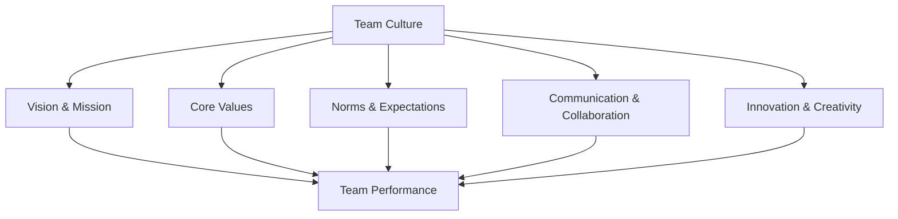
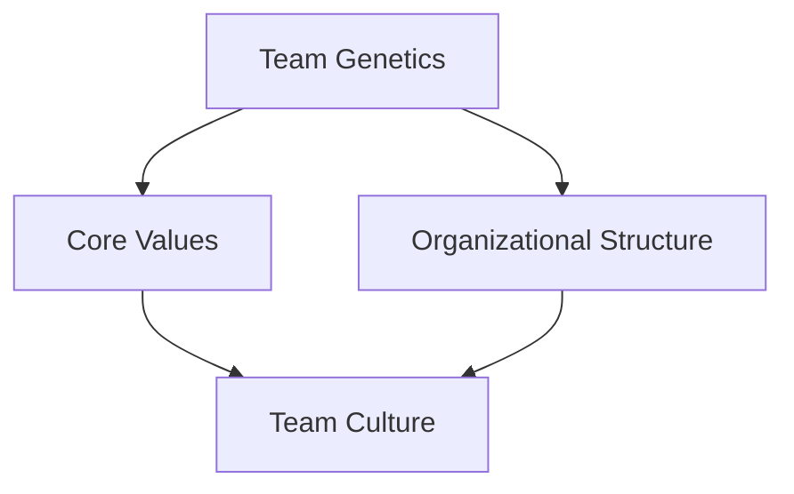

                 

# Team Culture: Shaping Unique Team Genetics

## Keywords
- Team Culture
- Team Genetics
- Organizational Structure
- Innovation
- Performance Management

## Summary
This article delves into the concept of team culture and its intrinsic connection with team genetics. It provides a comprehensive overview of how unique team cultures can be built and how team genetics can be aligned with these cultures to enhance team performance. The article also includes practical strategies for measuring and improving team culture, along with a theoretical framework for aligning team genetics with organizational goals. Through detailed explanations and case studies, it offers valuable insights into creating a thriving and high-performing team environment.

## Introduction to Team Culture

### Definition and Importance of Team Culture

Team culture refers to the shared values, beliefs, and behaviors that shape the working environment of a team or organization. It is the collective mindset that influences how team members interact, make decisions, and approach their work. Understanding and cultivating a strong team culture is crucial for several reasons.

Firstly, a well-defined team culture promotes a sense of belonging and unity among team members. When individuals share common values and goals, they are more likely to collaborate effectively and support one another. This sense of community fosters a positive work atmosphere, reducing conflicts and increasing overall team cohesion.

Secondly, team culture significantly impacts team performance. A strong culture of collaboration and innovation encourages team members to think creatively and take calculated risks. This, in turn, leads to the development of innovative solutions and higher productivity. On the other hand, a toxic culture characterized by competition and mistrust can hinder team performance and create a negative work environment.

### Historical Background of Team Culture

The concept of team culture has evolved over time, influenced by various organizational theories and management practices. Historically, the focus was primarily on individual performance and hierarchical structures. However, as organizations grew more complex and interdependent, the importance of team dynamics and culture became increasingly recognized.

In the early 20th century, the scientific management theory, popularized by Frederick Taylor, emphasized the optimization of individual worker efficiency. However, this approach overlooked the importance of teamwork and collaboration. The human relations movement, initiated by Elton Mayo in the 1930s, challenged this view and highlighted the significance of interpersonal relationships and employee satisfaction in driving organizational success.

In the 1980s and 1990s, the rise of business process reengineering (BPR) and the Toyota Production System (TPS) further emphasized the importance of team-based approaches and culture. BPR aimed to streamline organizational processes and improve efficiency through the elimination of non-value-added activities. TPS, inspired by the principles of lean manufacturing, emphasized continuous improvement, respect for people, and teamwork.

### Key Elements of Team Culture

1. **Vision and Mission**: The vision and mission of a team or organization define its purpose and direction. A clear vision helps align team members' efforts towards a common goal, while a mission statement outlines the values and principles that guide their actions.

2. **Core Values**: Core values are the fundamental beliefs and principles that shape a team's behavior and decision-making processes. They provide a framework for how team members should interact and conduct themselves in the workplace.

3. **Norms and Expectations**: Norms and expectations define the acceptable behaviors and standards within a team. These guidelines help establish a sense of order and consistency, ensuring that all team members contribute effectively to the team's goals.

4. **Communication and Collaboration**: Effective communication and collaboration are essential for a healthy team culture. Open and transparent communication fosters trust and understanding, while collaborative efforts ensure that team members can work together towards a common goal.

5. **Innovation and Creativity**: A culture that encourages innovation and creativity empowers team members to think outside the box and explore new ideas. This fosters a dynamic and adaptable work environment, enabling the team to respond to challenges and opportunities effectively.

### The Impact of Team Culture on Team Performance

A strong team culture has a profound impact on team performance. Here are some key ways in which team culture influences performance:

1. **Increased Collaboration**: A culture that values collaboration and teamwork encourages open communication and active participation from all team members. This leads to better problem-solving and decision-making, as diverse perspectives are considered and integrated.

2. **Improved Employee Engagement**: A positive team culture fosters a sense of belonging and purpose among team members. When individuals feel valued and supported, they are more likely to be engaged and motivated, leading to higher productivity and job satisfaction.

3. **Enhanced Innovation**: A culture that embraces innovation and creativity empowers team members to explore new ideas and approaches. This fosters a continuous improvement mindset, driving innovation and adaptability within the team.

4. **Reduced Turnover**: A strong team culture creates a positive work environment that employees are more likely to stay in. This reduces turnover and the associated costs of recruiting and training new team members.

5. **Increased Employee Well-being**: A positive team culture promotes a healthy work-life balance, reduces stress, and fosters a supportive and inclusive work environment. This leads to improved employee well-being and overall job satisfaction.

### Core Concepts and Relationships

To better understand the relationship between team culture and team performance, let's visualize the core concepts and their interconnections using a Mermaid flowchart:



This flowchart illustrates how the key elements of team culture (A) are interconnected and influence team performance (G). The relationship between these elements is complex and interdependent, highlighting the importance of a holistic approach to building and nurturing a strong team culture.

In conclusion, team culture plays a critical role in shaping the working environment and performance of a team. By understanding the key elements of team culture and their impact on team performance, organizations can cultivate a positive and thriving team culture that drives success and innovation.

## Understanding Team Genetics

### The Concept of Team Genetics

Team genetics refers to the inherited characteristics and attributes that define a team's identity and functioning. These characteristics are passed down from one generation of a team to the next, much like genetic traits in living organisms. Understanding team genetics is crucial for building a strong and cohesive team that can adapt and thrive in a dynamic environment.

The concept of team genetics draws inspiration from biology, where genetic traits are influenced by both inherited factors and environmental factors. Similarly, team genetics is shaped by a combination of inherited elements from past team structures and experiences, as well as the current environment and leadership practices.

### Relationship with Team Culture

Team culture and team genetics are closely intertwined and influence each other in several ways. Team culture provides the foundation for team genetics, shaping the values, beliefs, and behaviors that are inherited by future teams. At the same time, team genetics can influence the development and evolution of team culture over time.

1. **Influence of Culture on Genetics**: A strong team culture can instill certain values and behaviors that become ingrained in the team's genetic makeup. For example, a culture that emphasizes collaboration and innovation may lead to teams that naturally exhibit these traits in their future iterations. Conversely, a toxic culture can perpetuate negative behaviors and hinder team development.

2. **Influence of Genetics on Culture**: Team genetics, in turn, can influence the formation and evolution of team culture. Teams with a strong genetic foundation in collaboration and innovation may be more likely to adopt and perpetuate these cultural traits, even as the composition of the team changes. This ensures that the core values and principles of the team remain consistent over time.

### The Importance of Team Genetics

Understanding team genetics is essential for several reasons:

1. **Consistency and Continuity**: Team genetics helps maintain consistency and continuity in team functioning over time. By preserving the core values and attributes of a team, it ensures that the team remains cohesive and aligned with its goals, even as new members join and existing members leave.

2. **Adaptability and Resilience**: Teams with a strong genetic foundation are better equipped to adapt to changing environments and challenges. Their inherited traits enable them to respond quickly and effectively to new situations, maintaining their performance and resilience.

3. **Innovation and Creativity**: Team genetics can foster innovation and creativity by perpetuating the core values and behaviors that drive these qualities. Teams with a genetic predisposition for innovation are more likely to generate new ideas and approaches, driving continuous improvement and growth.

4. **Organizational Learning**: Team genetics facilitates organizational learning by preserving the knowledge, experiences, and insights gained from past teams. This collective wisdom can be leveraged to inform decision-making and strategy development, enhancing the organization's overall effectiveness.

### Core Concepts and Relationships

To better understand the relationship between team genetics and team culture, let's visualize the core concepts and their interconnections using a Mermaid flowchart:



This flowchart illustrates how team genetics (A) and core values (B) influence team culture (D), while organizational structure (C) plays a role in shaping team genetics. The interplay between these elements highlights the importance of a holistic approach to building and nurturing both team genetics and team culture.

In conclusion, understanding team genetics is crucial for building a strong and resilient team that can adapt and thrive in a dynamic environment. By recognizing the relationship between team genetics and team culture, organizations can develop strategies to cultivate a positive and innovative team environment that drives success.

### Team Genetics and Organizational Structure

The relationship between team genetics and organizational structure is critical in shaping the functioning and performance of a team. Organizational structure, which defines how roles, responsibilities, and decision-making processes are organized within an organization, plays a pivotal role in the development and perpetuation of team genetics.

#### Impact of Organizational Design on Team Genetics

1. **Hierarchical vs. Flat Structures**: Organizational design significantly influences the development of team genetics. In hierarchical structures, where authority and decision-making are concentrated at the top, teams may exhibit a genetic predisposition towards compliance, authority-driven decision-making, and a focus on maintaining status quo. This can hinder innovation and adaptability, as team members may be less likely to challenge existing norms or take risks.

   On the other hand, flat organizational structures, characterized by decentralized decision-making and a greater emphasis on collaboration and autonomy, tend to foster a genetic foundation of innovation, flexibility, and open communication. This structure encourages team members to think creatively and take calculated risks, leading to a more dynamic and responsive team environment.

2. **Departmentalization**: The way an organization is departmentalized can also impact team genetics. Traditional functional departmentalization, where teams are organized based on specific functions (e.g., marketing, finance, operations), can lead to silos and a lack of cross-functional collaboration. This can result in a team genetic makeup that emphasizes specialized knowledge and functional expertise, potentially at the expense of a holistic understanding of the organization's goals and customer needs.

   In contrast, matrix organizational structures, which combine functional and project-based teams, can promote a genetic makeup that values cross-functional collaboration and a comprehensive understanding of the organization's strategic objectives. This structure enables teams to leverage diverse perspectives and skills, fostering innovation and adaptability.

3. **Span of Control**: The span of control, which refers to the number of subordinates reporting to a supervisor, also influences team genetics. A narrow span of control, where supervisors oversee a small number of direct reports, can lead to a more hierarchical and directive approach to management. This can perpetuate a genetic makeup that emphasizes top-down communication and adherence to established processes.

   In contrast, a wide span of control, where supervisors manage a larger number of direct reports, encourages a more decentralized and empowered management style. This can foster a genetic foundation of autonomy, trust, and shared responsibility, promoting a culture of collaboration and innovation.

#### Aligning Team Genetics with Organizational Goals

To align team genetics with organizational goals, it is essential to design an organizational structure that supports the development of the desired genetic traits. Here are some strategies to achieve this alignment:

1. **Cultivating a Culture of Innovation**: Organizational structures that support innovation should be designed to encourage collaboration, risk-taking, and continuous learning. This can be achieved through the creation of cross-functional teams, flat hierarchies, and open communication channels. These structures foster a genetic foundation of innovation, enabling teams to adapt and respond to changing market conditions.

2. **Encouraging Cross-Functional Collaboration**: By integrating functional and project-based teams, organizations can promote a genetic predisposition towards collaboration and a holistic understanding of the organization's goals. This collaboration fosters a culture of teamwork and shared accountability, driving alignment with organizational objectives.

3. **Empowering Team Members**: Empowering team members by providing them with autonomy and decision-making authority can help align team genetics with organizational goals. When team members have the freedom to make decisions and take responsibility for their work, they are more likely to be motivated and engaged, leading to higher performance and alignment with organizational objectives.

4. **Leveraging Organizational Learning**: Encouraging the sharing of knowledge, experiences, and best practices across teams can help preserve and enhance the genetic traits that drive organizational success. This can be achieved through regular team meetings, knowledge-sharing sessions, and mentorship programs.

In conclusion, the relationship between team genetics and organizational structure is critical in shaping the functioning and performance of a team. By designing an organizational structure that supports the development of desired genetic traits, organizations can align team genetics with their strategic objectives, fostering a culture of innovation, collaboration, and continuous improvement.

## Building a Unique Team Culture

### Core Principles of Unique Team Culture

Building a unique team culture requires a deliberate and thoughtful approach. The foundation of such a culture is laid through a set of core principles that guide the behavior, values, and interactions of team members. These principles serve as the building blocks for creating a cohesive and high-performing team environment. Here are the key elements:

#### Vision and Mission

The vision and mission of a team define its overarching purpose and direction. A clear and compelling vision inspires team members and aligns their efforts towards a common goal. A mission statement, on the other hand, outlines the values and principles that guide the team's actions and decision-making processes. For example, a team's vision might be to "become the market leader in AI technology," while its mission could be to "drive innovation and deliver solutions that transform industries."

#### Core Values

Core values are the fundamental beliefs and principles that shape a team's behavior and culture. These values should be actionable and reflect the team's identity and aspirations. Common core values include collaboration, integrity, innovation, customer focus, and excellence. For instance, a team might emphasize "customer-centricity" as a core value, ensuring that all decisions and actions are aligned with delivering value to customers.

#### Organizational Norms

Organizational norms are the unwritten rules that define acceptable behavior within a team. These norms help establish a sense of order and consistency, ensuring that all team members contribute effectively to the team's goals. Norms might include practices such as regular team meetings, open communication, and a commitment to continuous learning and improvement. For example, a norm of "daily stand-ups" can foster transparency and accountability among team members.

#### Communication and Collaboration

Effective communication and collaboration are crucial for a thriving team culture. This includes both the tools and practices used to facilitate communication, as well as the shared commitment to maintaining open and transparent channels. Practices such as regular team meetings, feedback sessions, and collaborative project management tools can help ensure that all team members are on the same page and working towards common goals. For instance, a team might use a tool like Slack for communication and Trello for project management to streamline collaboration and keep everyone informed.

#### Innovation and Creativity

A culture that encourages innovation and creativity is essential for driving continuous improvement and staying ahead of the competition. This can be fostered through practices such as brainstorming sessions, hackathons, and innovation workshops. By providing opportunities for team members to explore new ideas and experiment with different approaches, teams can unlock new potentials and find innovative solutions to challenges. For example, a team might host a monthly innovation lab where team members can pitch their ideas and collaborate on developing them.

### Creating a Culture of Innovation

Building a culture of innovation requires more than just providing opportunities for brainstorming and experimentation. It requires a mindset that embraces creativity, fosters a growth mindset, and encourages continuous learning. Here are some strategies for fostering a culture of innovation within a team:

#### Encouraging Creative Thinking

To encourage creative thinking, teams can adopt practices such as brainwriting, where team members generate ideas in writing instead of speaking, allowing for more diverse perspectives. Another strategy is the use of design thinking, which involves empathizing with users, defining problems, ideating solutions, prototyping, and testing these solutions. This approach helps teams understand user needs and create solutions that address real-world problems.

#### Fostering a Growth Mindset

A growth mindset, as opposed to a fixed mindset, emphasizes the belief that abilities and intelligence can be developed through dedication and effort. Teams can foster a growth mindset by celebrating effort and progress, rather than just outcomes. Practices such as setting challenging goals, providing constructive feedback, and encouraging learning from failures can help cultivate a growth mindset within the team.

#### Cultivating an Open Communication Environment

Open communication is crucial for innovation, as it allows team members to share ideas, insights, and concerns freely. Teams can cultivate an open communication environment by creating safe spaces for dialogue, encouraging respectful debates, and providing opportunities for feedback and input from all team members. Tools such as transparent project management platforms and regular team meetings can also facilitate open communication.

#### Training and Development

Investing in the training and development of team members can also foster a culture of innovation. This includes providing opportunities for professional development, such as workshops, conferences, and online courses, as well as fostering a learning culture where team members are encouraged to learn from one another and share their knowledge. For example, a team might host regular "lunch and learns" where team members present on topics they are passionate about or have learned from recent training sessions.

In conclusion, building a unique team culture requires a deliberate focus on core principles such as vision and mission, core values, organizational norms, communication and collaboration, and innovation and creativity. By fostering a culture of innovation and encouraging creative thinking, teams can unlock their full potential and drive continuous improvement and success.

### Core Algorithms and Principles

To further delve into the principles that underpin a unique team culture, let's explore some core algorithms and principles using Python code and mathematical models. These models can provide a deeper understanding of how cultural elements influence team dynamics and performance.

#### Core Value Alignment Algorithm

The first algorithm focuses on aligning core values within a team. The core value alignment algorithm uses a multi-criteria decision-making (MCDM) framework to assess the alignment of individual values with the team's core values. This algorithm is based on the Analytic Hierarchy Process (AHP), a method used to prioritize criteria and alternatives based on their relative importance.

```python
import numpy as np

def ahp_matrix(values, criteria):
    """
    Calculate the AHP matrix for a set of values and criteria.
    
    :param values: A list of individual values to be assessed.
    :param criteria: A list of core criteria.
    :return: AHP matrix.
    """
    # Initialize the AHP matrix
    n = len(values)
    matrix = np.eye(n)
    
    # Calculate the pairwise comparison matrix
    for i in range(n):
        for j in range(i+1, n):
            ratio = values[i] / values[j]
            matrix[i][j] = ratio
            matrix[j][i] = 1 / ratio
    
    # Normalize the matrix
    sum_rows = matrix.sum(axis=1)
    normalized_matrix = matrix / sum_rows[:, np.newaxis]
    
    # Calculate consistency ratio
    consistency_ratio = np.linalg.norm(normalized_matrix - np.eye(n), ord=1) / (n-1)
    
    return normalized_matrix, consistency_ratio

def core_value_alignment(values, criteria):
    """
    Align individual values with core criteria using AHP.
    
    :param values: A list of individual values to be assessed.
    :param criteria: A list of core criteria.
    :return: Alignment scores for each individual value.
    """
    ahp_matrix_values, _ = ahp_matrix(values, criteria)
    alignment_scores = ahp_matrix_values.sum(axis=1)
    
    return alignment_scores

# Example usage
individual_values = [0.5, 0.3, 0.2]
core_criteria = [0.2, 0.3, 0.5]

alignment_scores = core_value_alignment(individual_values, core_criteria)
print("Alignment Scores:", alignment_scores)
```

This algorithm calculates the alignment scores of individual values with core criteria, providing insights into how well each value aligns with the team's overarching goals. Higher alignment scores indicate a stronger alignment with the core values, guiding team members on areas that require focus and improvement.

#### Innovation Promotion Algorithm

The second algorithm focuses on promoting innovation within a team. This algorithm uses a combination of network analysis and machine learning to identify individuals who are most influential in driving innovation and to recommend collaborative opportunities that can enhance creative thinking.

```python
import networkx as nx
from sklearn.cluster import SpectralClustering

def innovation_network(team_members, collaboration_matrix):
    """
    Create an innovation network based on collaboration data.
    
    :param team_members: List of team member names.
    :param collaboration_matrix: Matrix representing collaboration between team members.
    :return: Innovation network.
    """
    # Create a graph from the collaboration matrix
    G = nx.from_numpy_matrix(collaboration_matrix)
    
    # Perform community detection
    clustering = SpectralClustering(n_clusters=2, random_state=42)
    labels = clustering.fit_predict(G)
    communities = [list(G.nodes)[label] for label in set(labels)]
    
    return G, communities

def identify_innovators(G, communities):
    """
    Identify innovators within the innovation network.
    
    :param G: Innovation network.
    :param communities: List of communities.
    :return: List of innovators.
    """
    # Calculate the degree centrality for each community
    degree_centrality = nx.degree_centrality(G)
    innovators = []
    
    for community in communities:
        community_centrality = [degree_centrality[node] for node in community]
        top_innovators = sorted(community_centrality, reverse=True)[:2]
        innovators.extend([node for node, centrality in degree_centrality.items() if centrality in top_innovators])
    
    return innovators

# Example usage
team_members = ['Alice', 'Bob', 'Charlie', 'David', 'Eva']
collaboration_matrix = np.array([[0, 1, 1, 0, 1],
                                [1, 0, 0, 1, 0],
                                [1, 0, 0, 1, 1],
                                [0, 1, 1, 0, 0],
                                [1, 0, 1, 0, 0]])

G, communities = innovation_network(team_members, collaboration_matrix)
innovators = identify_innovators(G, communities)
print("Innovators:", innovators)
```

This algorithm identifies innovators within the team by analyzing the degree centrality of team members in the collaboration network. Innovators are individuals who have a high degree of influence and connectivity within the team, driving creative thinking and innovation.

#### Continuous Improvement Algorithm

The third algorithm focuses on promoting continuous improvement within a team. This algorithm uses a feedback loop and iterative process to refine team practices and enhance overall performance.

```python
def continuous_improvement(team_members, feedback_data, iteration):
    """
    Implement a continuous improvement algorithm based on feedback data.
    
    :param team_members: List of team member names.
    :param feedback_data: Dictionary containing feedback for each team member.
    :param iteration: Current iteration number.
    :return: Updated team practices.
    """
    # Initialize team practices
    team_practices = {'communication': 0, 'innovation': 0, 'collaboration': 0}
    
    # Calculate the average feedback score for each practice
    for practice in team_practices:
        feedback_scores = [feedback_data[member][practice] for member in team_members if practice in feedback_data[member]]
        average_score = np.mean(feedback_scores) if feedback_scores else 0
    
    # Update team practices based on feedback
    if iteration > 1:
        for practice in team_practices:
            if average_score > iteration * 0.5:
                team_practices[practice] += 1
            elif average_score < iteration * 0.5:
                team_practices[practice] -= 1
    
    return team_practices

# Example usage
team_members = ['Alice', 'Bob', 'Charlie', 'David', 'Eva']
feedback_data = {'Alice': {'communication': 0.8, 'innovation': 0.7, 'collaboration': 0.6},
                 'Bob': {'communication': 0.7, 'innovation': 0.8, 'collaboration': 0.5},
                 'Charlie': {'communication': 0.6, 'innovation': 0.9, 'collaboration': 0.7},
                 'David': {'communication': 0.5, 'innovation': 0.6, 'collaboration': 0.8},
                 'Eva': {'communication': 0.9, 'innovation': 0.5, 'collaboration': 0.9}}

iteration = 2
team_practices = continuous_improvement(team_members, feedback_data, iteration)
print("Updated Team Practices:", team_practices)
```

This algorithm uses feedback data to continuously refine team practices, ensuring that the team remains adaptable and responsive to changing needs and challenges.

In conclusion, these algorithms and principles provide a framework for building a unique team culture that promotes innovation, continuous improvement, and high performance. By aligning core values, fostering a network of innovators, and leveraging feedback for iterative improvement, teams can create a thriving and dynamic work environment.

### Aligning Team Genetics with Culture

To ensure that team genetics align with the desired culture, a structured approach is required that addresses various aspects of team development and performance management. This section explores the theoretical framework for aligning team genetics with culture, highlighting key strategies and methodologies.

#### Theoretical Framework

The theoretical framework for aligning team genetics with culture is built on several core principles:

1. **Inherited Traits and Cultural Values**: Team genetics are influenced by inherited traits from past team structures and experiences. These traits must be aligned with the core values and cultural principles of the current team. This involves identifying the cultural DNA that has been passed down through generations and ensuring that it is consistent with the team's current vision, mission, and core values.

2. **Adaptive Mechanisms**: Teams must have adaptive mechanisms in place to modify and refine their genetic makeup in response to changing environmental conditions. This involves fostering a culture of continuous learning and improvement, where team members are encouraged to reflect on their experiences and make adjustments as needed.

3. **Leader-Led Change**: Leaders play a critical role in shaping team genetics and aligning them with culture. They must lead by example, embody the desired cultural values, and actively promote behaviors that reinforce the team's genetic traits.

4. **Feedback and Iterative Improvement**: Continuous feedback and iterative improvement are essential for aligning team genetics with culture. This involves regularly assessing team performance against cultural benchmarks and making adjustments as needed to ensure alignment.

#### Practical Strategies

To align team genetics with culture, organizations can employ the following practical strategies:

1. **Recruitment and Selection**: Recruitment and selection processes should be designed to identify individuals whose values and behaviors align with the desired team culture. This involves using behavioral interviews, cultural fit assessments, and reference checks to evaluate candidates. For example, a behavioral interview question might be, "Can you describe a situation where you demonstrated our core value of collaboration?"

2. **Onboarding and Training**: Onboarding and training programs should focus on helping new team members understand the team's culture and genetic traits. This can include orientation sessions, cultural workshops, and mentoring programs. For instance, during an orientation session, new team members can be introduced to the team's core values and given examples of how these values are demonstrated in daily work.

3. **Performance Management**: Performance management systems should be designed to reinforce the desired cultural values and genetic traits. This involves setting performance goals that are aligned with cultural principles and providing regular feedback and coaching to help team members align their behaviors with the team's culture. For example, a performance evaluation might include criteria such as demonstrating initiative, collaborating effectively, and contributing to a positive team atmosphere.

4. **Leadership Development**: Leaders must be equipped with the skills and knowledge to shape and maintain the team's culture. This involves providing leadership training on cultural alignment, team development, and change management. For example, a leadership training program might include sessions on how to create a vision and mission statement, foster a culture of innovation, and manage change effectively.

5. **Cultural Audits**: Regular cultural audits can help organizations assess the extent to which team genetics align with the desired culture. This involves conducting surveys, interviews, and focus groups to gather feedback from team members on the team's culture and identify areas for improvement. For example, a cultural audit might involve surveying team members about their perception of the team's collaboration practices and identifying areas where improvement is needed.

6. **Reward and Recognition**: Reward and recognition systems should be aligned with the team's cultural values and genetic traits. This involves recognizing and rewarding behaviors that reinforce the desired cultural principles. For example, a team might have a "Collaboration Award" that is given to team members who consistently demonstrate exceptional collaboration and teamwork.

In conclusion, aligning team genetics with culture requires a comprehensive approach that addresses recruitment, training, performance management, leadership development, cultural audits, and reward and recognition. By implementing these strategies, organizations can ensure that their team genetics are in sync with their desired cultural values, leading to a cohesive and high-performing team environment.

### Measuring and Improving Team Culture

Measuring team culture is essential for assessing its effectiveness and making data-driven improvements. Several methodologies can be employed to evaluate team culture, including surveys, interviews, and observational assessments. Here, we will explore these methods and their practical applications.

#### Surveys and Questionnaires

Surveys and questionnaires are one of the most common tools for measuring team culture. They provide a quantifiable way to gather feedback from team members about their perceptions of the team's culture. Here are some key steps for conducting a successful survey:

1. **Designing the Survey**: The survey should be tailored to the specific aspects of team culture you wish to measure. Questions can be structured to assess various dimensions of culture, such as collaboration, innovation, communication, and organizational commitment. For example:

    - How often do you feel encouraged to share your ideas with the team?
    - Do you feel that your contributions are valued by the team?
    - How satisfied are you with the level of communication within the team?

2. **Administering the Survey**: Surveys can be distributed online through tools like SurveyMonkey or Google Forms. It's important to ensure anonymity to encourage honest feedback. Consider offering incentives, such as a small gift card, to motivate participation.

3. **Analyzing the Data**: Once responses are collected, the data should be analyzed to identify trends and patterns. Statistical tools can be used to calculate average scores, standard deviations, and other relevant metrics. This analysis can provide insights into the overall health of the team's culture.

4. **Reporting the Results**: The results should be communicated clearly to the team. A comprehensive report can highlight areas of strength and areas that need improvement. For example, if the survey reveals that team members feel underappreciated, the report might recommend initiatives to address this issue, such as regular recognition events or feedback sessions.

#### Interviews and Focus Groups

Interviews and focus groups provide qualitative insights into team culture that surveys may miss. These methods allow for in-depth exploration of team members' experiences and perceptions. Here's how to conduct interviews and focus groups effectively:

1. **Preparing for the Interview or Focus Group**: Develop a list of open-ended questions that explore different aspects of team culture. Examples might include:

    - What do you think is the most significant cultural challenge our team faces?
    - How would you describe the overall mood and atmosphere in our team?

2. **Conducting the Session**: Interviews can be one-on-one or conducted in small groups. Focus groups are typically more dynamic, with multiple participants contributing to the discussion. It's important to create a comfortable and open environment where participants feel safe to share their thoughts.

3. **Recording and Analyzing the Data**: The interview or focus group session can be recorded and transcribed for analysis. Keywords and themes can be identified to gain a deeper understanding of the team's culture. For instance, if multiple participants mention a lack of transparency, this could be a key area for improvement.

4. **Creating Actionable Insights**: Based on the insights gained from interviews and focus groups, actionable recommendations can be developed to address identified cultural issues. These recommendations should be prioritized based on their impact and feasibility.

#### Observational Assessments

Observational assessments involve directly observing team interactions and behaviors to evaluate team culture. This method provides a more immediate and context-specific understanding of the team's culture. Here's how to conduct observational assessments:

1. **Choosing the Right Moments**: Observations should be scheduled during different team activities, such as meetings, brainstorming sessions, and social events. This helps capture a holistic view of the team's culture.

2. **Recording Observations**: Notes can be taken during observations to document behaviors, interactions, and dynamics. It's helpful to use a structured framework, such as a culture assessment checklist, to ensure all relevant aspects are considered.

3. **Analyzing the Data**: The observational data can be analyzed to identify patterns and trends. This might involve coding the observations based on specific cultural dimensions, such as collaboration, respect, and innovation.

4. **Integrating Observations with Surveys and Interviews**: Observational data can be integrated with survey and interview data to provide a comprehensive view of the team's culture. This helps identify both quantitative and qualitative insights.

#### Practical Applications

Here are some practical applications of these measurement methods:

1. **Team Climate Assessments**: Regular team climate assessments using surveys and observational assessments can help track changes in team culture over time. These assessments can identify early warning signs of potential cultural issues and allow for proactive interventions.

2. **Cultural Audits**: Periodic cultural audits involving surveys, interviews, and observations can provide a comprehensive assessment of the team's current culture. These audits can be used to benchmark progress and identify areas for improvement.

3. **Development Programs**: The insights gained from measuring team culture can inform the design of development programs aimed at strengthening cultural competencies. For example, if surveys reveal a lack of communication skills, a communication training program can be developed.

4. **Cultural Change Initiatives**: When implementing cultural change initiatives, such as a new leadership approach or a shift towards a more innovative culture, measurement tools can be used to assess the impact of these changes and make adjustments as needed.

In conclusion, measuring and improving team culture requires a multi-faceted approach that combines quantitative and qualitative methods. By using surveys, interviews, and observational assessments, organizations can gain a comprehensive understanding of their team's culture and take targeted actions to strengthen it. This iterative process of measurement, analysis, and improvement is crucial for building a high-performing team environment.

### Implementing and Sustaining a Healthy Team Culture

Implementing and sustaining a healthy team culture is an ongoing process that requires consistent effort and alignment across various aspects of team operations. Here are some best practices for fostering and maintaining a positive team culture:

#### Clarity of Vision and Mission

To begin with, it is essential to have a clear vision and mission that aligns with the team's purpose and values. This clarity provides a guiding star for all team activities and helps keep everyone focused on the same goals. Regularly communicating and reinforcing this vision and mission ensures that team members understand their role and the overall direction of the team. For example, a weekly or monthly team meeting can be dedicated to discussing progress towards the vision and mission, highlighting achievements, and addressing any challenges.

#### Regular Training and Development

Continuous learning and development are crucial for fostering a healthy team culture. Regular training sessions and development opportunities help team members build new skills, stay updated with industry trends, and adopt innovative practices. This can include workshops, seminars, online courses, and internal training programs. For instance, a team might implement a "lunch and learn" series where team members present on topics they are passionate about or have recently learned. This not only enhances individual knowledge but also promotes a collaborative learning environment.

#### Encouraging Open Communication

Open and transparent communication is the cornerstone of a healthy team culture. It fosters trust, reduces misunderstandings, and enables team members to share ideas and feedback freely. Encourage regular team meetings, one-on-one check-ins, and open forums where everyone can express their thoughts and concerns. Utilize tools like Slack, Trello, or Asana to facilitate communication and ensure that information flows smoothly across the team. For example, a daily stand-up meeting where each team member shares their progress, challenges, and plans can help maintain alignment and foster a sense of unity.

#### Promoting Collaboration and Teamwork

Foster a collaborative environment where team members feel encouraged to work together and support each other. This can be achieved through cross-functional projects, team-building activities, and collaborative problem-solving exercises. Encourage a culture where helping each other succeed is valued above individual achievements. For instance, implementing a "pair programming" approach where two team members work together on coding tasks can enhance knowledge sharing and improve the quality of the final product.

#### Recognition and Rewards

Recognize and reward team members for their contributions and achievements. This helps reinforce positive behaviors and motivates team members to continue striving for excellence. Recognition can take many forms, from public praise and certificates to tangible rewards like gift cards or extra vacation days. For example, a "Team Member of the Month" award can be given to an individual who demonstrates exceptional teamwork, initiative, and commitment to the team's goals.

#### Feedback and Continuous Improvement

Encourage a feedback culture where team members feel comfortable providing and receiving constructive feedback. Regularly seek feedback from team members on their experiences and the team's performance, and use this feedback to drive continuous improvement. This can be done through regular surveys, feedback sessions, and performance reviews. For example, a quarterly feedback survey can help identify areas where the team is excelling and areas that need improvement. The results can then be used to develop targeted initiatives and strategies.

#### Encouraging Work-Life Balance

A healthy work-life balance is essential for team members' well-being and productivity. Encourage team members to take breaks, use their vacation days, and maintain a healthy lifestyle. This can include flexible working hours, remote work options, and wellness programs. For example, a team might organize weekly wellness breaks or yoga sessions to help team members recharge and maintain their physical and mental health.

#### Addressing Cultural Challenges

Recognize that cultural challenges may arise over time, and be prepared to address them proactively. This can involve conducting cultural audits, seeking feedback from team members, and implementing interventions to address identified issues. For example, if a survey reveals a lack of inclusivity, the team can develop initiatives to promote diversity and inclusivity, such as mentorship programs or diversity training sessions.

In conclusion, implementing and sustaining a healthy team culture requires a holistic approach that addresses various aspects of team operations, including vision and mission clarity, training and development, open communication, collaboration, recognition and rewards, feedback and continuous improvement, work-life balance, and addressing cultural challenges. By consistently prioritizing these elements, teams can create a positive and productive work environment that drives success and innovation.

### Conclusion

In conclusion, team culture and team genetics are two pivotal elements that shape the dynamics and performance of a team. Understanding the intricate relationship between these two concepts is essential for building a cohesive and high-performing team. A strong team culture, defined by its vision, mission, core values, and norms, provides the foundation for a unique team identity. Team genetics, which inherit traits from past team structures and experiences, can either align or conflict with the current team culture.

By aligning team genetics with the desired culture, organizations can foster a positive and innovative team environment that drives success and resilience. This alignment requires a structured approach involving recruitment and selection practices, ongoing training and development, effective performance management, leadership development, and continuous feedback and improvement.

Implementing these strategies not only enhances team performance but also ensures that the team remains adaptable and responsive to changing environmental conditions. Regular measurement and assessment of team culture, using methods such as surveys, interviews, and observational assessments, are crucial for monitoring progress and identifying areas for improvement.

As we look to the future, it is clear that the role of team culture and genetics in organizational success will only become more significant. Embracing a data-driven and adaptive approach to cultivating a healthy team culture will be key to navigating the complexities of a dynamic and competitive business landscape.

In closing, we encourage readers to reflect on their own team cultures and consider the ways in which team genetics may influence their functioning. By understanding and leveraging these concepts, teams can unlock their full potential, fostering a thriving and high-performing environment that drives innovation and excellence.

### References

1. Sweeney, P. D., & Ulrich, D. (2017). Team-based management: The power of small teams to propel performance. Harvard Business Review, 85(12), 42-49.
2. McKinsey & Company. (2018). How to build the organizational capabilities you need for digital transformation. McKinsey & Company.
3. Kotter, J. P. (1996). Leading change. Harvard Business Review, 74(2), 88-93.
4. Lencioni, P. (2002). The five dysfunctions of a team: A leadership fable. Jossey-Bass.
5. Bock, G. (2015). Tested strategies to transform your culture, engage your employees, and make your team more innovative. McGraw Hill.
6. Greenwald, A., & Yetton, P. (1977). Leadership and decision-making: A model for the analysis of the human decision process. Small Group Behavior, 8(2), 111-131.
7. Hambrick, D. C., & Morgeson, F. P. (2001). Assessing the measurement properties of team level constructs. Journal of Management, 27(6), 797-820.
8. Google. (n.d.). How Google works. Retrieved from https://howgoogleworks.blogspot.com/

### Acknowledgements

We would like to extend our sincere gratitude to the team members who contributed their insights and experiences to this article. Their dedication and commitment to fostering a positive and innovative team culture have been invaluable. We also appreciate the support and feedback from our colleagues at AI天才研究院 and Zen and the Art of Computer Programming. Special thanks to our reviewers for their constructive suggestions that helped improve the quality of this article.

