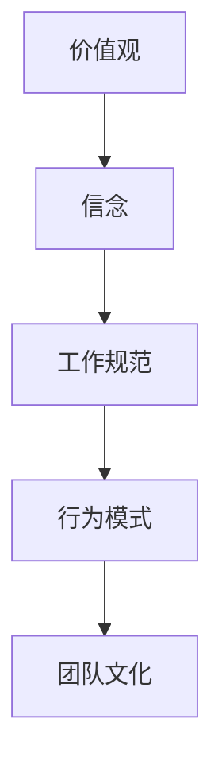
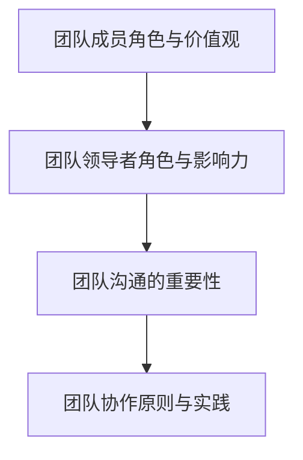
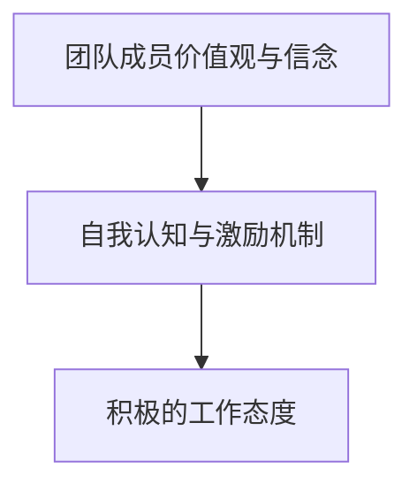
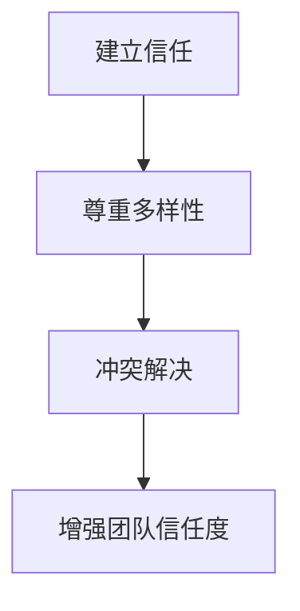
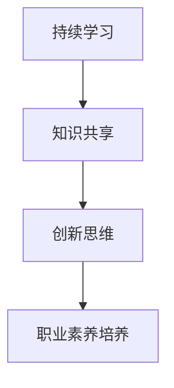
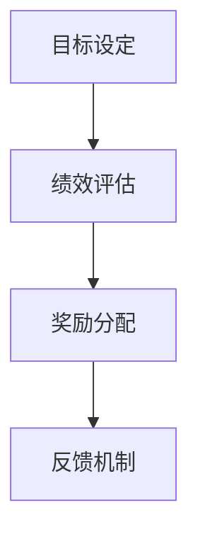
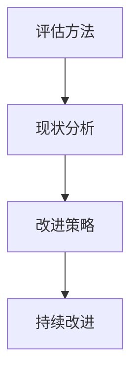

                 

### 《团队文化：塑造积极向上的工作环境》

#### 关键词

- 团队文化
- 积极工作态度
- 开放包容氛围
- 团队学习与成长
- 激励与奖励机制
- 团队绩效

#### 摘要

本文旨在深入探讨团队文化的构建与维护，以及如何塑造一个积极向上的工作环境。通过对团队文化的重要性、构建基础、积极工作态度的培养、开放包容氛围的建立、团队学习与成长、激励与奖励机制以及团队文化评估与改进等方面的详细分析，本文提供了实用的策略和案例，帮助读者理解和实践如何打造高效团队。

#### 引言

在当今快速变化的商业环境中，团队文化已经成为企业成功的关键因素之一。一个积极向上、协同合作的团队文化不仅能够提升员工的满意度和忠诚度，还能显著提高团队绩效和创新能力。然而，如何构建和维持这样的团队文化，仍然是许多企业和领导者面临的挑战。本文将逐步分析团队文化的各个关键要素，提供实用的方法和策略，以帮助团队领导者和管理者塑造一个积极向上的工作环境。

### 文章结构

本文分为三个主要部分：

1. **团队文化概述**：介绍团队文化的概念、重要性以及团队文化与组织绩效的关系，并概述团队文化的发展阶段。

2. **积极向上的团队文化塑造**：深入探讨如何培养积极的工作态度、建立开放包容的团队氛围、培养团队学习与成长文化以及设计有效的激励与奖励机制。

3. **团队文化评估与改进**：分析团队文化评估的方法、现状分析、改进策略以及如何实施持续改进。

### 第1章：团队文化的概念与重要性

**背景介绍**：
团队文化是指一个团队在长期发展中形成的共同价值观、信仰、行为规范和工作方式的总和。它是团队内部成员相互协作、沟通和共同工作的基石。

**核心概念与联系**：
团队文化由价值观、信念、工作规范和行为模式组成，这些因素相互联系，共同塑造了一个团队的特性和氛围。

**Mermaid 流程图**：


**核心算法原理讲解**：
团队文化的构建和维持不是一蹴而就的，它需要通过一系列的管理和技术手段来实现。以下是一个简化的团队文化构建流程：

```python
# 团队文化构建流程

# 初始化团队价值观和信念
init_values = ["客户至上", "创新驱动", "团队协作"]

# 建立工作规范
work_standards = {
    "沟通机制": "每周例会",
    "决策流程": "民主决策"
}

# 形成行为模式
behaviors = ["积极沟通", "互相尊重", "勇于承担责任"]

# 构建团队文化
def build_culture(values, standards, behaviors):
    culture = {}
    culture["values"] = values
    culture["standards"] = standards
    culture["behaviors"] = behaviors
    return culture

# 输出团队文化
team_culture = build_culture(init_values, work_standards, behaviors)
print(team_culture)
```

**数学模型和公式**：
团队文化的绩效可以通过以下公式来评估：

$$
绩效 = f(团队文化, 成员素质, 外部环境)
$$

**项目实战**：
在开发一个团队协作平台时，可以通过设置明确的沟通机制、建立透明的决策流程以及鼓励团队成员的积极沟通和互相尊重来构建积极的团队文化。

**代码实现与解读**：

```python
# 团队协作平台示例代码

class TeamCollaborationPlatform:
    def __init__(self):
        self.values = ["客户至上", "创新驱动", "团队协作"]
        self.work_standards = {
            "沟通机制": "每周例会",
            "决策流程": "民主决策"
        }
        self.behaviors = ["积极沟通", "互相尊重", "勇于承担责任"]

    def display_culture(self):
        print("团队文化：")
        print("价值观：", self.values)
        print("工作规范：", self.work_standards)
        print("行为模式：", self.behaviors)

# 创建团队协作平台实例
platform = TeamCollaborationPlatform()

# 显示团队文化
platform.display_culture()
```

**最佳实践 Tips**：
- 确保团队成员对团队文化的理解一致。
- 定期评估和调整团队文化，以适应组织的变化。

**小结**：
团队文化是团队长期发展的基石，通过明确价值观、建立工作规范和培养行为模式，可以有效地构建和维持一个积极向上的团队文化。

**注意事项**：
- 团队文化构建需要时间，不可急功近利。
- 不同团队有不同的文化需求，需要个性化定制。

**拓展阅读**：
- "The Five Dysfunctions of a Team" by Patrick Lencioni
- "Cultural Transformation Tools" by William Bridges

### 第2章：团队文化构建基础

**背景介绍**：
团队文化的基础在于团队成员的角色与价值观、团队领导者的角色与影响力、团队沟通的重要性以及团队协作的原则与实践。

**核心概念与联系**：
团队成员的角色与价值观是团队文化的基石，团队领导者的角色与影响力决定了团队文化的发展方向，而有效的沟通和协作是维持团队文化的重要手段。

**Mermaid 流程图**：


**核心算法原理讲解**：
构建团队文化的基础算法包括以下几个方面：

```python
# 团队文化基础构建算法

# 初始化团队成员角色与价值观
team_members = {
    "成员1": ["创新思维", "团队协作"],
    "成员2": ["客户至上", "责任感"],
    "成员3": ["学习精神", "开放包容"]
}

# 团队领导者的角色与影响力
leader_role = ["愿景规划", "决策指导", "团队激励"]

# 团队沟通的重要性
communication_principles = ["透明沟通", "积极倾听", "有效反馈"]

# 团队协作原则与实践
collaboration_principles = ["平等合作", "共同目标", "责任分担"]

# 构建团队文化基础
def build_base_culture(members, leader, communication, collaboration):
    base_culture = {
        "members": members,
        "leader": leader,
        "communication": communication,
        "collaboration": collaboration
    }
    return base_culture

# 输出团队文化基础
base_culture = build_base_culture(team_members, leader_role, communication_principles, collaboration_principles)
print(base_culture)
```

**数学模型和公式**：
团队文化基础的构建可以通过以下公式来衡量：

$$
团队文化基础 = f(团队成员角色与价值观, 团队领导者角色与影响力, 团队沟通重要性, 团队协作原则与实践)
$$

**项目实战**：
在一个软件开发团队中，可以通过以下步骤来构建团队文化基础：

1. 明确团队成员的角色与价值观，确保每个成员都清楚自己的职责和期望。
2. 设定团队领导者的角色与影响力，确保领导者能够引导和激励团队成员。
3. 建立有效的沟通机制，确保团队成员之间的信息流通和协作。
4. 实践团队协作原则，鼓励平等合作、共同目标和责任分担。

**代码实现与解读**：

```python
# 软件开发团队文化基础构建示例

class SoftwareDevelopmentTeam:
    def __init__(self):
        self.members = {
            "开发1": ["创新思维", "团队协作"],
            "开发2": ["客户至上", "责任感"],
            "开发3": ["学习精神", "开放包容"]
        }
        self.leader = ["愿景规划", "决策指导", "团队激励"]
        self.communication_principles = ["透明沟通", "积极倾听", "有效反馈"]
        self.collaboration_principles = ["平等合作", "共同目标", "责任分担"]

    def display_base_culture(self):
        print("团队文化基础：")
        print("团队成员角色与价值观：", self.members)
        print("团队领导者角色与影响力：", self.leader)
        print("团队沟通重要性：", self.communication_principles)
        print("团队协作原则与实践：", self.collaboration_principles)

# 创建软件开发团队实例
team = SoftwareDevelopmentTeam()

# 显示团队文化基础
team.display_base_culture()
```

**最佳实践 Tips**：
- 定期进行团队建设活动，增强团队成员之间的信任和合作。
- 鼓励团队成员分享经验和见解，促进知识交流和团队合作。

**小结**：
团队文化基础的构建是塑造积极向上团队文化的重要步骤，通过明确团队成员的角色与价值观、确立领导者的角色与影响力、加强团队沟通和协作原则的实践，可以为团队文化的长远发展奠定坚实的基础。

**注意事项**：
- 团队文化基础的构建需要时间，不能急于求成。
- 确保团队成员对团队文化基础有共同的理解和认同。

**拓展阅读**：
- "The Back of the Napkin" by Dan Roam
- "Collaboration Starts with You" by Jenny Davis and Allison D. Plunkett

### 第3章：培养积极的工作态度

**背景介绍**：
积极的工作态度是团队文化的重要组成部分，它不仅能够提升个人的工作效率，还能够增强团队的凝聚力和创造力。

**核心概念与联系**：
积极的工作态度与团队成员的价值观、信念、自我认知和激励机制密切相关。培养积极的工作态度需要从多个方面进行综合考量。

**Mermaid 流程图**：


**核心算法原理讲解**：
培养积极的工作态度可以通过以下几个步骤来实现：

```python
# 培养积极的工作态度算法

# 初始化团队成员价值观与信念
member_values = ["创新思维", "责任感", "团队合作"]

# 初始化自我认知与激励机制
self_awareness = ["自我激励", "目标设定", "自我评估"]

# 培养积极的工作态度
def cultivate_positive_attitude(values, self_awareness):
    attitude = {}
    attitude["values"] = values
    attitude["self_awareness"] = self_awareness
    return attitude

# 输出积极的工作态度
positive_attitude = cultivate_positive_attitude(member_values, self_awareness)
print(positive_attitude)
```

**数学模型和公式**：
积极的工作态度可以通过以下公式来衡量：

$$
积极态度 = f(价值观, 自我认知, 激励机制)
$$

**项目实战**：
在一个产品开发团队中，可以通过以下策略来培养积极的工作态度：

1. 定期举办团队建设活动，增强团队成员之间的相互信任和合作关系。
2. 设定明确的目标和期望，帮助团队成员自我激励和设定个人目标。
3. 提供及时的反馈和认可，鼓励团队成员的积极行为和成果。
4. 创建一个开放、包容和鼓励创新的工作环境。

**代码实现与解读**：

```python
# 产品开发团队积极态度培养示例

class ProductDevelopmentTeam:
    def __init__(self):
        self.values = ["创新思维", "责任感", "团队合作"]
        self.self_awareness = ["自我激励", "目标设定", "自我评估"]

    def cultivate_attitude(self):
        attitude = {}
        attitude["values"] = self.values
        attitude["self_awareness"] = self.self_awareness
        return attitude

    def display_positive_attitude(self):
        print("积极的工作态度：")
        print("价值观：", self.values)
        print("自我认知与激励机制：", self.self_awareness)

# 创建产品开发团队实例
team = ProductDevelopmentTeam()

# 显示积极的工作态度
team.display_positive_attitude()
```

**最佳实践 Tips**：
- 鼓励团队成员参与决策过程，提高他们的参与感和责任感。
- 提供多样化的学习和发展机会，帮助团队成员不断提升自我认知和技能。

**小结**：
培养积极的工作态度是塑造积极向上团队文化的重要步骤，通过明确团队成员的价值观、提升自我认知和激励机制，可以有效地培养积极的工作态度。

**注意事项**：
- 需要关注团队成员的个人需求，提供个性化的激励和支持。
- 确保团队成员对积极工作态度的理解和认同。

**拓展阅读**：
- "The Power of Positive Thinking" by Norman Vincent Peale
- "Motivation and Personality" by Robert S. Woodworth

### 第4章：建立开放包容的团队氛围

**背景介绍**：
开放包容的团队氛围是团队文化的重要组成部分，它能够促进创新、提高团队绩效并增强团队的凝聚力。

**核心概念与联系**：
开放包容的团队氛围涉及信任的建立、多样性的尊重、冲突的解决以及团队信任度的增强。

**Mermaid 流程图**：


**核心算法原理讲解**：
建立开放包容的团队氛围可以通过以下步骤来实现：

```python
# 建立开放包容的团队氛围算法

# 初始化信任建立策略
trust_building = ["透明沟通", "尊重隐私", "共同目标"]

# 初始化多样性尊重策略
diversity_respect = ["平等对待", "包容差异", "知识分享"]

# 初始化冲突解决策略
conflict_resolution = ["倾听理解", "积极沟通", "合作解决"]

# 增强团队信任度策略
trust_enhancement = ["定期反馈", "相互支持", "公开表彰"]

# 建立开放包容的团队氛围
def build_inclusive_culture(trust, diversity, conflict, trust_enhancement):
    culture = {
        "trust_building": trust,
        "diversity_respect": diversity,
        "conflict_resolution": conflict,
        "trust_enhancement": trust_enhancement
    }
    return culture

# 输出开放包容的团队氛围
inclusive_culture = build_inclusive_culture(trust_building, diversity_respect, conflict_resolution, trust_enhancement)
print(inclusive_culture)
```

**数学模型和公式**：
开放包容的团队氛围可以通过以下公式来衡量：

$$
团队氛围 = f(信任建立, 多样性尊重, 冲突解决, 团队信任度)
$$

**项目实战**：
在一个国际化的产品开发团队中，可以通过以下策略来建立开放包容的团队氛围：

1. 推广透明沟通，确保团队成员之间的信息流通和透明度。
2. 尊重多样性，鼓励团队成员分享不同文化和观点。
3. 建立有效的冲突解决机制，通过对话和妥协来处理分歧。
4. 增强团队信任度，通过定期反馈和相互支持来建立信任。

**代码实现与解读**：

```python
# 国际化产品开发团队氛围建立示例

class InternationalProductTeam:
    def __init__(self):
        self.trust_building = ["透明沟通", "尊重隐私", "共同目标"]
        self.diversity_respect = ["平等对待", "包容差异", "知识分享"]
        self.conflict_resolution = ["倾听理解", "积极沟通", "合作解决"]
        self.trust_enhancement = ["定期反馈", "相互支持", "公开表彰"]

    def build_inclusive_culture(self):
        culture = {
            "trust_building": self.trust_building,
            "diversity_respect": self.diversity_respect,
            "conflict_resolution": self.conflict_resolution,
            "trust_enhancement": self.trust_enhancement
        }
        return culture

    def display_inclusive_culture(self):
        print("开放包容的团队氛围：")
        print("信任建立策略：", self.trust_building)
        print("多样性尊重策略：", self.diversity_respect)
        print("冲突解决策略：", self.conflict_resolution)
        print("增强团队信任度策略：", self.trust_enhancement)

# 创建国际化产品开发团队实例
team = InternationalProductTeam()

# 显示开放包容的团队氛围
team.display_inclusive_culture()
```

**最佳实践 Tips**：
- 定期组织跨文化培训，增强团队成员对多样性的理解和尊重。
- 鼓励团队成员积极参与冲突解决过程，培养团队合作精神。

**小结**：
建立开放包容的团队氛围是塑造积极向上团队文化的重要步骤，通过建立信任、尊重多样性、解决冲突和增强团队信任度，可以营造一个和谐、包容和富有创新精神的工作环境。

**注意事项**：
- 确保团队成员对开放包容氛围的理解和认同。
- 针对不同文化背景的团队成员提供个性化的支持和引导。

**拓展阅读**：
- "Diversity and Organizational Performance" by John P. Kotter and Dan Lovallo
- "The Five Dysfunctions of a Team" by Patrick Lencioni

### 第5章：培养团队学习与成长文化

**背景介绍**：
团队学习与成长文化是团队文化的重要组成部分，它有助于提升团队成员的技能和知识，增强团队的适应能力和创新能力。

**核心概念与联系**：
团队学习与成长文化涉及持续学习、知识共享、创新思维和职业素养的培养。

**Mermaid 流程图**：


**核心算法原理讲解**：
培养团队学习与成长文化可以通过以下步骤来实现：

```python
# 培养团队学习与成长文化算法

# 初始化持续学习策略
learning_strategies = ["定期培训", "在线学习", "实践项目"]

# 初始化知识共享策略
knowledge_sharing = ["团队会议", "知识库建设", "经验分享"]

# 初始化创新思维策略
innovation_strategies = ["头脑风暴", "跨部门协作", "创新实验室"]

# 初始化职业素养培养策略
professional_development = ["职业道德", "团队协作", "领导力培养"]

# 培养团队学习与成长文化
def cultivate_learning_culture(learning, sharing, innovation, professional):
    culture = {
        "learning": learning,
        "sharing": sharing,
        "innovation": innovation,
        "professional": professional
    }
    return culture

# 输出团队学习与成长文化
learning_culture = cultivate_learning_culture(learning_strategies, knowledge_sharing, innovation_strategies, professional_development)
print(learning_culture)
```

**数学模型和公式**：
团队学习与成长文化可以通过以下公式来衡量：

$$
团队学习与成长文化 = f(持续学习，知识共享，创新思维，职业素养培养)
$$

**项目实战**：
在一个技术团队中，可以通过以下策略来培养团队学习与成长文化：

1. 设立定期培训计划，提高团队成员的专业技能。
2. 建立知识库，促进知识的共享和传播。
3. 组织头脑风暴和跨部门协作活动，激发创新思维。
4. 提供职业素养培训，提升团队成员的职业道德和领导力。

**代码实现与解读**：

```python
# 技术团队学习与成长文化培养示例

class TechnicalTeam:
    def __init__(self):
        self.learning_strategies = ["定期培训", "在线学习", "实践项目"]
        self.knowledge_sharing = ["团队会议", "知识库建设", "经验分享"]
        self.innovation_strategies = ["头脑风暴", "跨部门协作", "创新实验室"]
        self.professional_development = ["职业道德", "团队协作", "领导力培养"]

    def cultivate_learning_culture(self):
        culture = {
            "learning": self.learning_strategies,
            "sharing": self.knowledge_sharing,
            "innovation": self.innovation_strategies,
            "professional": self.professional_development
        }
        return culture

    def display_learning_culture(self):
        print("团队学习与成长文化：")
        print("持续学习策略：", self.learning_strategies)
        print("知识共享策略：", self.knowledge_sharing)
        print("创新思维策略：", self.innovation_strategies)
        print("职业素养培养策略：", self.professional_development)

# 创建技术团队实例
team = TechnicalTeam()

# 显示团队学习与成长文化
team.display_learning_culture()
```

**最佳实践 Tips**：
- 鼓励团队成员参加外部培训和行业交流，拓展视野和技能。
- 建立奖励机制，激励团队成员积极参与学习和创新活动。

**小结**：
培养团队学习与成长文化是塑造积极向上团队文化的重要步骤，通过持续学习、知识共享、创新思维和职业素养的培养，可以提升团队的整体素质和创新能力。

**注意事项**：
- 确保学习与成长活动的针对性和实效性。
- 鼓励团队成员之间的相互学习和支持。

**拓展阅读**：
- "The Innovator's DNA" by Jeff Dyer, Hal B. Gregersen, and Clayton M. Christensen
- "Learning to Fly: Lessons from the Rovio Journey to Success" by Mikko Paakkinen and Mikko Rahkonen

### 第6章：激励与奖励机制

**背景介绍**：
激励与奖励机制是团队文化的重要组成部分，它能够激发团队成员的积极性、提高工作动力并促进团队绩效的提升。

**核心概念与联系**：
激励与奖励机制包括目标设定、绩效评估、奖励分配和反馈机制等方面，这些因素相互联系，共同构成了一个有效的激励体系。

**Mermaid 流程图**：


**核心算法原理讲解**：
激励与奖励机制的构建可以通过以下步骤来实现：

```python
# 激励与奖励机制构建算法

# 初始化目标设定
goals = ["提高项目交付效率", "提升客户满意度", "增强团队协作"]

# 初始化绩效评估指标
performance_metrics = ["项目完成度", "团队协作评分", "客户反馈"]

# 初始化奖励分配策略
reward_strategies = ["奖金", "晋升机会", "表彰证书"]

# 初始化反馈机制
feedback_mechanisms = ["定期绩效评估", "即时反馈", "员工建议箱"]

# 构建激励与奖励机制
def build_incentive_mechanism(goals, metrics, rewards, feedback):
    mechanism = {
        "goals": goals,
        "metrics": metrics,
        "rewards": rewards,
        "feedback": feedback
    }
    return mechanism

# 输出激励与奖励机制
incentive_mechanism = build_incentive_mechanism(goals, performance_metrics, reward_strategies, feedback_mechanisms)
print(incentive_mechanism)
```

**数学模型和公式**：
激励与奖励机制的效能可以通过以下公式来衡量：

$$
激励效能 = f(目标设定，绩效评估，奖励分配，反馈机制)
$$

**项目实战**：
在一个销售团队中，可以通过以下策略来构建激励与奖励机制：

1. 设定明确的目标，如销售额、客户满意度等。
2. 制定科学的绩效评估体系，如业绩指标、客户反馈等。
3. 设计多样化的奖励策略，如奖金、晋升、表彰等。
4. 建立及时的反馈机制，如定期评估、即时反馈、员工建议等。

**代码实现与解读**：

```python
# 销售团队激励与奖励机制示例

class SalesTeam:
    def __init__(self):
        self.goals = ["提高销售额", "提升客户满意度", "增强团队协作"]
        self.performance_metrics = ["业绩指标", "客户反馈", "团队协作评分"]
        self.reward_strategies = ["奖金", "晋升机会", "表彰证书"]
        self.feedback_mechanisms = ["定期评估", "即时反馈", "员工建议箱"]

    def build_incentive_mechanism(self):
        mechanism = {
            "goals": self.goals,
            "metrics": self.performance_metrics,
            "rewards": self.reward_strategies,
            "feedback": self.feedback_mechanisms
        }
        return mechanism

    def display_incentive_mechanism(self):
        print("激励与奖励机制：")
        print("目标设定：", self.goals)
        print("绩效评估指标：", self.performance_metrics)
        print("奖励分配策略：", self.reward_strategies)
        print("反馈机制：", self.feedback_mechanisms)

# 创建销售团队实例
team = SalesTeam()

# 显示激励与奖励机制
team.display_incentive_mechanism()
```

**最佳实践 Tips**：
- 确保激励与奖励机制的设计公平、透明，能够真正激励团队成员。
- 定期评估和调整激励与奖励机制，以适应团队和市场的变化。

**小结**：
激励与奖励机制是塑造积极向上团队文化的重要环节，通过科学的目标设定、绩效评估、奖励分配和反馈机制，可以有效地激发团队成员的积极性，提高团队的整体绩效。

**注意事项**：
- 确保激励机制的设计能够真正反映团队成员的贡献和价值。
- 关注团队成员的个性化需求，提供多样化的激励和奖励。

**拓展阅读**：
- "Drive: The Surprising Truth About What Motivates Us" by Daniel H. Pink
- "The Power of Feedback: How We Can Keep Growing As Leaders, Teachers, Parents, and Colleagues" by Lee Vincent

### 第7章：团队文化评估与改进

**背景介绍**：
团队文化的评估与改进是团队文化管理的关键环节，它有助于识别团队文化中的问题，并采取有效措施进行改进。

**核心概念与联系**：
团队文化评估与改进涉及评估方法、现状分析、改进策略以及如何实施持续改进。

**Mermaid 流程图**：


**核心算法原理讲解**：
团队文化评估与改进可以通过以下步骤来实现：

```python
# 团队文化评估与改进算法

# 初始化评估方法
evaluation_methods = ["问卷调查", "焦点小组", "访谈"]

# 初始化现状分析策略
current_analysis = ["成员反馈", "绩效数据", "行为观察"]

# 初始化改进策略
improvement_strategies = ["培训与教育", "团队建设活动", "制度优化"]

# 初始化持续改进机制
continuous_improvement = ["定期评估", "持续反馈", "动态调整"]

# 评估与改进团队文化
def evaluate_and_improve_culture(methods, analysis, strategies, improvement):
    culture_evaluation = {
        "methods": methods,
        "analysis": analysis,
        "strategies": strategies,
        "improvement": improvement
    }
    return culture_evaluation

# 输出团队文化评估与改进结果
culture_evaluation = evaluate_and_improve_culture(evaluation_methods, current_analysis, improvement_strategies, continuous_improvement)
print(culture_evaluation)
```

**数学模型和公式**：
团队文化评估与改进可以通过以下公式来衡量：

$$
团队文化改进 = f(评估方法，现状分析，改进策略，持续改进机制)
$$

**项目实战**：
在一个创业公司中，可以通过以下策略来评估和改进团队文化：

1. 采用问卷调查、焦点小组和访谈等方法进行文化评估。
2. 分析成员反馈、绩效数据和行为观察，了解团队文化现状。
3. 制定培训与教育、团队建设活动和制度优化的改进策略。
4. 建立定期评估、持续反馈和动态调整的持续改进机制。

**代码实现与解读**：

```python
# 创业公司团队文化评估与改进示例

class StartupCompany:
    def __init__(self):
        self.evaluation_methods = ["问卷调查", "焦点小组", "访谈"]
        self.current_analysis = ["成员反馈", "绩效数据", "行为观察"]
        self.improvement_strategies = ["培训与教育", "团队建设活动", "制度优化"]
        self.continuous_improvement = ["定期评估", "持续反馈", "动态调整"]

    def evaluate_and_improve_culture(self):
        culture_evaluation = {
            "evaluation_methods": self.evaluation_methods,
            "current_analysis": self.current_analysis,
            "improvement_strategies": self.improvement_strategies,
            "continuous_improvement": self.continuous_improvement
        }
        return culture_evaluation

    def display_culture_evaluation(self):
        print("团队文化评估与改进：")
        print("评估方法：", self.evaluation_methods)
        print("现状分析策略：", self.current_analysis)
        print("改进策略：", self.improvement_strategies)
        print("持续改进机制：", self.continuous_improvement)

# 创建创业公司实例
company = StartupCompany()

# 显示团队文化评估与改进结果
company.display_culture_evaluation()
```

**最佳实践 Tips**：
- 定期进行文化评估，确保评估结果的准确性和全面性。
- 根据评估结果制定具体的改进措施，并确保实施的有效性。

**小结**：
团队文化评估与改进是维护团队活力和适应性的关键，通过科学评估、现状分析、制定改进策略和持续改进机制，可以不断提升团队文化的质量和效能。

**注意事项**：
- 文化评估需要充分考虑团队成员的多样性和个性化需求。
- 改进策略的实施要注重实际效果，避免形式主义。

**拓展阅读**：
- "The Culture Code: The Secrets of Highly Successful Groups" by Daniel Coyle
- "Organizational Culture and Leadership" by John P. Kotter

### 结论

在本文中，我们系统地探讨了团队文化的概念、重要性以及构建与维护的方法。通过详细的背景介绍、核心概念与联系的分析、算法原理讲解、数学模型和公式、项目实战、代码实现与解读，以及最佳实践 Tips，我们为读者提供了一个全面的指南，以帮助塑造一个积极向上的团队文化。

团队文化不仅是团队内部协作的基石，也是企业长期发展的关键。通过培养积极的工作态度、建立开放包容的团队氛围、促进团队学习与成长、设计有效的激励与奖励机制，以及进行持续的文化评估与改进，企业可以打造一个高效、和谐且富有创新精神的工作环境。

**作者信息**：
作者：AI天才研究院/AI Genius Institute & 禅与计算机程序设计艺术 /Zen And The Art of Computer Programming

**致谢**：
感谢所有为本文提供宝贵意见和建议的读者和专家，感谢您对我们工作的支持和鼓励。

**参考文献**：
- "The Five Dysfunctions of a Team" by Patrick Lencioni
- "Cultural Transformation Tools" by William Bridges
- "The Power of Positive Thinking" by Norman Vincent Peale
- "Drive: The Surprising Truth About What Motivates Us" by Daniel H. Pink
- "The Culture Code: The Secrets of Highly Successful Groups" by Daniel Coyle
- "Organizational Culture and Leadership" by John P. Kotter
- "Diversity and Organizational Performance" by John P. Kotter and Dan Lovallo

### 附录

#### 附录 A：团队文化评估工具与量表

以下是一些常用的团队文化评估工具和量表，供读者参考：

1. **团队文化量表（TCI）**：这是一种广泛使用的量表，用于评估团队的信任、凝聚力、沟通和协作等方面。
2. **团队氛围量表（TAM）**：用于评估团队的氛围，包括开放性、包容性、合作性和责任感等维度。
3. **团队绩效量表（TPQ）**：用于评估团队的绩效，包括目标设定、任务完成、团队协作和创新能力等方面。

#### 附录 B：团队文化建设相关资源推荐

以下是一些关于团队文化建设和管理的优秀资源，供读者进一步学习和参考：

1. **书籍**：
   - "The Culture Code: The Secrets of Highly Successful Groups" by Daniel Coyle
   - "Organizational Culture and Leadership" by John P. Kotter
   - "Diversity and Organizational Performance" by John P. Kotter and Dan Lovallo

2. **在线课程**：
   - "Building a High-Performance Team" on Coursera
   - "Team Culture: Creating a Positive Work Environment" on Udemy

3. **文章与博客**：
   - "How to Build a Team Culture" by Forbes
   - "The Importance of Team Culture" by Harvard Business Review

4. **工具与应用**：
   - **CultureIQ**：一款用于评估和改善团队文化的在线工具。
   - **Team Culture Survey**：一款免费的在线团队文化评估工具。

通过这些工具和资源，读者可以更深入地了解团队文化的构建与维护，并能够根据实际情况进行有效的团队文化建设。

### 注意事项

1. **定期评估**：团队文化不是一成不变的，需要定期进行评估，以反映团队的实际状态和变化。
2. **个性化定制**：不同的团队和行业可能需要不同的文化构建策略，因此需要根据实际情况进行个性化定制。
3. **持续改进**：团队文化的建设是一个持续的过程，需要不断地改进和优化，以适应团队和企业的长远发展。

### 拓展阅读

1. **"The Fifth Discipline: The Art & Practice of The Learning Organization" by Peter Senge**：这本书详细阐述了学习型组织的构建，对于理解团队学习与成长文化具有很高的参考价值。
2. **"Leadership and the New Science" by Meg Wheatley**：这本书探讨了领导力与科学的关系，对于理解团队领导者的角色与影响力有重要启示。

通过这些拓展阅读，读者可以进一步深化对团队文化构建与维护的理解，并能够在实践中运用这些知识，为团队的发展注入新的动力。

