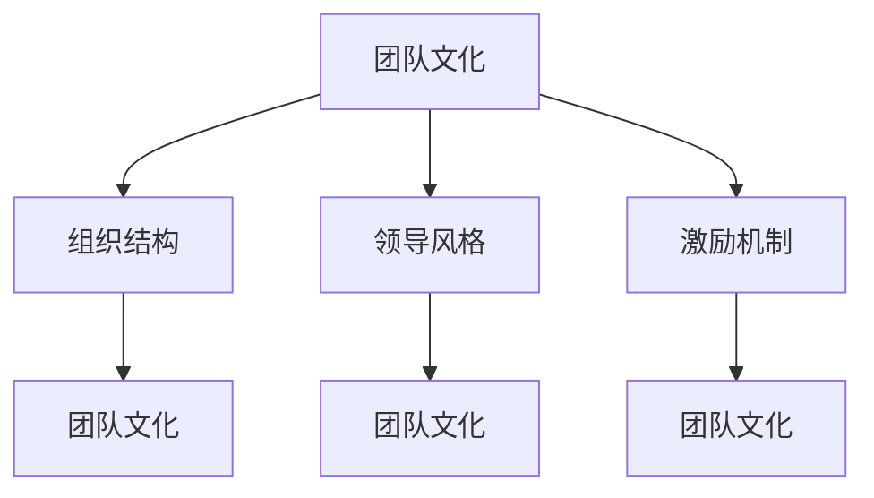
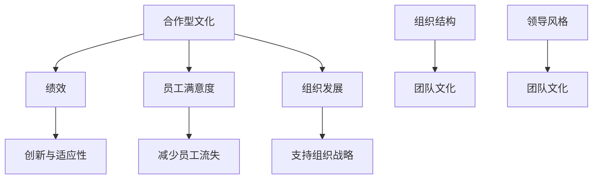

                 

### 文章标题：团队文化：塑造积极氛围的策略

在当今快速变化和高压力的职场环境中，团队文化已经成为企业成功的关键因素之一。本文旨在深入探讨团队文化的核心概念与联系，以及如何通过一系列策略与方法来塑造积极的团队氛围。通过系统的分析推理，我们将为读者提供从理论到实践的全方位指导。

> 关键词：团队文化、积极氛围、领导力、沟通、激励机制、团队活动

> 摘要：本文首先定义了团队文化的内涵和重要性，探讨了积极氛围的概念及其特征。随后，文章详细介绍了构建积极氛围的策略和方法，包括领导力、沟通、激励机制以及团队活动。通过案例分析，我们展示了这些策略在实际中的应用效果。最后，文章探讨了团队文化评估与改进的方法，并提出了应对文化建设挑战的解决方案。

## 第一部分：团队文化与积极氛围的关系

### 第1章：团队文化的核心概念与联系

#### 1.1 团队文化的定义与内涵

团队文化是一种无形的力量，它体现在团队成员的共同价值观、行为准则和工作方式中。具体来说，团队文化是指团队成员在长期合作中形成的共同信仰、价值观和行为模式。团队文化不仅决定了团队内部的关系和互动方式，也影响着团队的整体绩效和创新能力。

团队文化包括以下几个方面：

1. **价值观与信仰**：团队文化是建立在共同的价值观和信仰基础之上的，这些价值观和信仰决定了团队的核心信念和行为准则。
2. **行为规范**：团队文化规定了团队成员应该如何行事，这些行为规范影响了团队内部的关系和沟通方式。
3. **工作方式**：团队文化也体现在团队的工作方式上，包括决策过程、工作流程和创新机制等。

#### 1.2 团队文化的重要性

团队文化在团队运作中起着至关重要的作用：

1. **凝聚力和归属感**：强大的团队文化能够增强团队成员的凝聚力和归属感，使团队成员更加团结一致，共同追求团队目标。
2. **协作与沟通**：团队文化提供了协作和沟通的框架，使团队成员能够更有效地协作，减少冲突和误解。
3. **创新和适应力**：团队文化鼓励创新和适应性，使团队能够在面对外部变化时迅速做出调整和应对。

#### 1.3 团队文化与其他组织因素的联系

团队文化与其他组织因素密切相关：

1. **组织结构**：团队文化受到组织结构的影响，组织结构的不同会影响团队文化的形成和演变。
2. **领导风格**：领导者的风格和行为对团队文化有重要影响，领导者的决策和行为会塑造团队的文化氛围。
3. **激励机制**：激励机制与团队文化相互作用，有效的激励机制可以强化团队文化的核心价值观和行为规范。

### Mermaid 流程图：团队文化与其他组织因素的关系

## 核心概念与联系：团队文化定义、类型、影响

为了更好地理解团队文化，我们需要进一步探讨团队文化的类型及其对团队的影响。

#### 2.1 团队文化的类型

团队文化可以根据其特征和表现形式分为以下几种类型：

1. **合作型文化**：强调团队合作和共同目标，团队成员之间相互信任和支持，共同解决问题。
2. **竞争型文化**：鼓励竞争和创新，团队成员独立工作，以个人成就为目标。
3. **学习型文化**：重视知识和经验的分享，团队成员不断学习和成长，以提高团队的整体能力。
4. **权力型文化**：领导者的权力集中，团队成员按照领导的指令行事，决策权集中在少数人手中。

#### 2.2 团队文化的影响

团队文化对团队绩效和组织发展具有深远的影响：

1. **绩效**：积极的团队文化可以提高团队的绩效，促进团队成员的积极性和创造力。
2. **员工满意度**：良好的团队文化可以提升员工的满意度和忠诚度，减少员工流失率。
3. **组织发展**：团队文化对组织的长远发展有着重要的影响，优秀的团队文化可以促进组织的创新和适应力。

#### 2.3 团队文化与其他组织因素的联系

团队文化与其他组织因素相互作用，共同影响团队的表现：

1. **组织战略**：团队文化需要与组织的战略目标相一致，才能有效支持组织的发展。
2. **组织结构**：团队文化受到组织结构的影响，组织结构的变化会带来团队文化的调整。
3. **领导风格**：领导者的风格和行为对团队文化有直接影响，领导者的决策和行为会塑造团队的文化氛围。

### Mermaid 流程图：团队文化类型与影响

## 第二部分：构建积极氛围的策略与方法

### 第3章：领导力在团队文化建设中的作用

#### 3.1 领导者的角色与责任

领导者在团队文化建设中扮演着至关重要的角色。他们是团队文化的倡导者和塑造者，通过自己的言行和决策来影响团队的文化氛围。领导者的角色和责任包括：

1. **设定愿景和目标**：领导者需要明确团队的愿景和目标，并将其融入到团队文化中，激发团队成员的积极性和创造力。
2. **树立榜样**：领导者通过自己的行为和态度来树立榜样，影响团队成员的行为和价值观。
3. **沟通和反馈**：领导者需要与团队成员保持有效的沟通，及时给予反馈，帮助团队成员理解和践行团队文化。

#### 3.2 领导者的言行对团队文化的影响

领导者的言行对团队文化有着深远的影响：

1. **激励作用**：领导者的鼓励和支持可以激发团队成员的积极性和创造力，塑造积极的团队氛围。
2. **行为规范**：领导者的行为规范可以成为团队成员的行为榜样，引导团队成员形成良好的行为习惯。
3. **决策风格**：领导者的决策风格会影响团队的文化氛围，决策的透明度和公正性可以增强团队的文化信任度。

#### 3.3 领导者塑造积极氛围的策略

为了塑造积极的团队氛围，领导者可以采取以下策略：

1. **建立共同价值观**：领导者需要与团队成员共同制定团队的价值观和行为准则，使其成为团队文化的核心。
2. **鼓励开放沟通**：领导者需要鼓励团队成员之间的开放沟通，建立信任和协作的基础。
3. **提供反馈和认可**：领导者需要及时给予团队成员反馈和认可，增强团队成员的自信心和动力。

### 第4章：团队沟通在积极氛围构建中的作用

#### 4.1 有效沟通的概念与原则

团队沟通是构建积极氛围的基础。有效沟通是指信息在团队内部传递和交换的效率和效果。有效沟通的原则包括：

1. **清晰明确**：沟通的内容需要清晰明确，避免产生误解和混淆。
2. **及时反馈**：沟通应该是双向的，及时给予反馈，确保信息的准确传递。
3. **尊重差异**：团队成员之间可能存在差异，有效沟通需要尊重这些差异，建立包容和开放的沟通环境。

#### 4.2 团队沟通障碍与解决方法

团队沟通中可能存在各种障碍，包括：

1. **信息过载**：过多的信息可能导致沟通效率降低，解决方法是筛选和重点突出重要信息。
2. **沟通方式不当**：使用不适当的沟通方式可能引发误解和冲突，解决方法是采用合适的沟通渠道和方式。
3. **文化差异**：团队成员来自不同文化背景可能影响沟通效果，解决方法是提高跨文化沟通的能力和意识。

#### 4.3 沟通技巧在塑造积极氛围中的应用

有效的沟通技巧可以帮助塑造积极的团队氛围：

1. **积极倾听**：积极倾听是理解对方观点和需求的关键，有助于建立信任和协作。
2. **明确表达**：清晰、简洁的表达可以减少误解，提高沟通效率。
3. **非言语沟通**：使用适当的肢体语言和面部表情可以增强沟通效果，传达积极的情绪和态度。

### 第5章：激励机制与积极氛围的塑造

#### 5.1 激励理论概述

激励机制是塑造积极氛围的重要手段。激励理论包括：

1. **马斯洛需求层次理论**：根据马斯洛的需求层次理论，人们有五种层次的需求，从基本的生理需求到最高级的自我实现需求。激励机制需要满足不同层次的需求。
2. **赫兹伯格双因素理论**：赫兹伯格的双因素理论认为，激励因素（如成就、认可等）和保健因素（如工资、工作条件等）共同影响员工的工作满意度。
3. **目标设置理论**：目标设置理论强调明确、具有挑战性的目标可以激励员工努力工作，提高绩效。

#### 5.2 设计有效激励机制

为了设计有效的激励机制，需要考虑以下几个方面：

1. **个人化激励**：根据员工的不同需求和特点设计个性化的激励机制，提高激励效果。
2. **长期与短期激励结合**：短期激励可以迅速激发员工的工作热情，长期激励可以培养员工的忠诚度和职业发展。
3. **公平与透明**：激励机制需要公平透明，确保每位员工都能感受到公平对待，增强激励的公正性。

#### 5.3 激励机制对团队文化的塑造作用

激励机制对团队文化的塑造作用体现在：

1. **增强团队凝聚力**：有效的激励机制可以增强团队成员的凝聚力，使团队成员更加团结一致。
2. **培养积极态度**：激励机制可以激发员工的积极态度，提高工作满意度和工作热情。
3. **促进创新和适应力**：激励机制鼓励员工创新和适应变化，推动团队文化的不断进步。

### 第6章：团队活动与积极氛围的营造

#### 6.1 团队活动的类型与目的

团队活动是塑造积极氛围的重要手段。团队活动的类型包括：

1. **团队建设活动**：如团队拓展训练、团队游戏等，旨在增强团队成员之间的信任和合作。
2. **知识分享活动**：如技术沙龙、案例分享会等，旨在促进团队成员的知识共享和技能提升。
3. **庆祝活动**：如团队生日会、团队庆典等，旨在增强团队凝聚力和归属感。

团队活动的目的包括：

1. **增强团队凝聚力**：通过团队活动，团队成员之间可以建立更紧密的联系，增强团队凝聚力。
2. **促进知识共享**：团队活动提供了知识交流和分享的平台，有助于提升团队成员的技能和知识水平。
3. **提升团队士气**：庆祝活动可以提升团队成员的士气和工作热情，营造积极的团队氛围。

#### 6.2 团队活动的设计与组织

团队活动的设计与组织需要考虑以下几个方面：

1. **活动目标**：明确团队活动的目标，确保活动能够达到预期的效果。
2. **参与人数**：根据团队规模和活动类型，合理安排参与人数，确保活动效果。
3. **活动形式**：选择合适的活动形式，如室内活动、户外活动等，以满足团队成员的多样化需求。

#### 6.3 团队活动对积极氛围的影响

团队活动对积极氛围的影响体现在：

1. **增强团队凝聚力**：团队活动为团队成员提供了交流和互动的机会，增强了团队凝聚力。
2. **促进知识共享**：团队活动提供了知识交流和分享的平台，促进了团队成员的知识共享和技能提升。
3. **提升团队士气**：团队活动可以提升团队成员的士气和工作热情，营造积极的团队氛围。

## 第三部分：团队文化评估与改进

### 第7章：团队文化评估方法

#### 7.1 文化评估工具与指标

团队文化评估是了解团队文化现状和改进方向的重要步骤。常用的文化评估工具和指标包括：

1. **问卷调查**：通过问卷调查收集团队成员对团队文化的看法和评价，常用的问卷工具包括盖洛普Q12、文化氛围量表等。
2. **访谈**：通过访谈深入了解团队成员对团队文化的感受和看法，可以获取更深入的信息。
3. **关键绩效指标（KPI）**：通过关键绩效指标评估团队文化对团队绩效和组织发展的影响，如员工满意度、团队协作效率、创新成果等。

#### 7.2 文化评估的实施过程

文化评估的实施过程包括以下几个步骤：

1. **确定评估目标**：明确文化评估的目标和目的，确保评估工作有明确的方向。
2. **选择评估工具**：根据评估目标选择合适的评估工具，确保评估结果的准确性和有效性。
3. **收集数据**：通过问卷调查、访谈等方式收集团队成员的数据，确保数据的广泛性和代表性。
4. **分析数据**：对收集到的数据进行整理和分析，识别团队文化的优势和不足。
5. **制定改进计划**：根据评估结果制定改进计划，明确改进目标和实施步骤。

#### 7.3 文化评估结果的分析与应用

文化评估结果的分析和应用包括以下几个方面：

1. **识别文化优势**：通过分析评估结果，识别团队文化的优势，巩固和发扬这些优势。
2. **发现文化不足**：通过分析评估结果，发现团队文化的不足，制定改进措施。
3. **制定改进计划**：根据评估结果制定具体的改进计划，明确改进目标和实施步骤。
4. **跟踪改进效果**：对改进计划进行跟踪和评估，确保改进措施的落实和效果。

### 第8章：团队文化改进策略

#### 8.1 存在问题的识别与分析

在团队文化评估过程中，可能会发现以下问题：

1. **沟通障碍**：团队成员之间的沟通不畅，导致误解和冲突。
2. **激励不足**：激励机制不完善，无法激发员工的积极性和创造力。
3. **文化差异**：团队成员来自不同文化背景，导致文化冲突和沟通障碍。
4. **领导力不足**：领导者能力不足，无法有效塑造和引导团队文化。

#### 8.2 改进策略的制定与实施

针对识别出的问题，可以采取以下改进策略：

1. **改善沟通**：通过加强沟通培训、建立沟通机制等方式改善团队沟通，减少误解和冲突。
2. **完善激励机制**：设计合理的激励机制，满足员工的多元化需求，激发员工的积极性和创造力。
3. **融合文化**：通过文化交流、团队活动等方式促进不同文化背景的融合，减少文化冲突。
4. **提升领导力**：加强领导力培训，提高领导者的沟通能力、决策能力和文化塑造能力。

#### 8.3 改进效果的评估与持续改进

改进效果的评估和持续改进是团队文化建设的核心。具体措施包括：

1. **定期评估**：定期对团队文化进行评估，了解改进措施的实施效果。
2. **反馈机制**：建立有效的反馈机制，收集团队成员对改进措施的意见和建议。
3. **持续改进**：根据评估结果和反馈机制，持续优化团队文化建设策略，确保团队文化的持续进步。

### 第9章：团队文化建设中的挑战与解决方案

#### 9.1 团队成员的多样性与文化差异

团队成员的多样性和文化差异是团队文化建设中的重要挑战。具体体现在：

1. **价值观差异**：团队成员来自不同文化背景，可能持有不同的价值观和信仰，导致文化冲突。
2. **沟通障碍**：团队成员之间的语言和文化差异可能导致沟通不畅，影响团队协作。
3. **创新能力**：文化差异可能会影响团队成员的创新思维和创新能力。

#### 9.2 资源限制与时间压力

团队文化建设过程中可能面临以下资源限制和时间压力：

1. **预算限制**：团队文化建设的预算有限，可能影响文化建设项目的实施。
2. **时间压力**：团队工作繁忙，可能无法安排足够的时间进行文化建设和活动。
3. **执行力**：团队成员可能对文化建设的重要性认识不足，导致执行力不够。

#### 9.3 领导者与团队成员的参与度不足

领导者与团队成员的参与度不足是团队文化建设的另一个挑战。具体体现在：

1. **领导者参与度**：领导者可能认为文化建设是次要工作，参与度不高。
2. **团队成员参与度**：团队成员可能对文化建设缺乏兴趣，参与度不高。
3. **沟通不畅**：领导者与团队成员之间的沟通不畅，导致文化建设策略无法有效实施。

#### 9.4 解决方案与实践案例

为了应对这些挑战，可以采取以下解决方案：

1. **增强领导力**：通过培训和实践，提高领导者的文化建设和沟通能力，确保领导者的积极参与。
2. **制定明确目标**：明确团队文化建设的具体目标和计划，确保团队成员对文化建设的重要性有清晰的认识。
3. **提供资源支持**：确保团队文化建设的资源支持，包括预算、时间和人力。
4. **加强沟通**：建立有效的沟通机制，确保领导者与团队成员之间的信息传递和反馈。
5. **实践案例分享**：通过分享成功的实践案例，激发团队成员的兴趣和参与度。

### 第10章：解决方案与实践案例

#### 10.1 增强团队成员的认同感与归属感

为了增强团队成员的认同感与归属感，可以采取以下措施：

1. **团队建设活动**：定期组织团队建设活动，如户外拓展、团建游戏等，增强团队成员之间的互动和信任。
2. **共同目标**：明确团队的共同目标，确保团队成员认识到自己在团队中的价值和作用。
3. **认可与奖励**：对团队成员的贡献和成就给予认可和奖励，增强他们的归属感和认同感。

#### 10.2 制定明确的团队文化建设目标

为了制定明确的团队文化建设目标，可以遵循以下步骤：

1. **评估当前文化状况**：通过问卷调查、访谈等方式了解团队当前的文化状况和团队成员的需求。
2. **明确建设目标**：根据评估结果，明确团队文化建设的具体目标，如提高沟通效率、增强团队凝聚力等。
3. **制定行动计划**：制定详细的行动计划，包括具体措施、实施时间和责任人。

#### 10.3 融合传统与现代管理理念

为了融合传统与现代管理理念，可以采取以下策略：

1. **传承传统**：保留和传承团队中优秀的传统价值观和行为规范。
2. **引入现代管理理念**：引入现代管理方法和技术，如敏捷管理、精益管理等，提高团队的管理水平和效率。
3. **文化融合**：通过团队活动和文化交流，促进传统与现代管理理念的融合。

#### 10.4 实践案例分享与经验总结

通过实践案例的分享和经验总结，可以进一步提升团队文化建设的有效性。具体包括：

1. **成功案例分享**：分享团队文化建设的成功案例，展示文化建设的实际效果。
2. **失败案例分析**：分析团队文化建设的失败案例，总结失败原因和教训。
3. **经验总结**：总结团队文化建设的成功经验和最佳实践，为后续文化建设提供参考。

### 总结与展望

本文从多个角度探讨了团队文化的核心概念、类型、影响以及构建积极氛围的策略与方法。通过领导力、沟通、激励机制和团队活动等手段，团队文化得以塑造和巩固。此外，团队文化的评估与改进、挑战应对以及实践案例的分享为团队文化建设的实际操作提供了有力支持。

展望未来，团队文化将继续在企业中发挥重要作用。随着全球化进程的加快和信息技术的发展，团队文化的内涵和表现形式也将不断演变。企业和团队需要不断适应新的环境，创新团队文化建设的策略和方法，以实现团队的高效运作和持续发展。

在此，感谢读者对本文的关注，希望本文能为团队文化建设和积极氛围的塑造提供有益的启示。作者：AI天才研究院/AI Genius Institute & 禅与计算机程序设计艺术/Zen And The Art of Computer Programming

### 附录：最佳实践 Tips、注意事项与拓展阅读

#### 最佳实践 Tips

1. **领导者的示范作用**：领导者应以身作则，通过自己的言行来塑造团队文化。
2. **定期沟通**：定期组织团队会议和沟通活动，确保团队成员之间的信息流通。
3. **个性化激励**：根据员工的个性和需求，设计个性化的激励机制。
4. **持续评估与改进**：定期评估团队文化现状，持续改进文化建设策略。

#### 注意事项

1. **尊重多样性**：在团队文化建设中，要尊重团队成员的多样性和差异。
2. **平衡短期与长期目标**：在激励机制中，要平衡短期激励和长期激励，确保员工的长期发展。
3. **避免文化冲突**：在团队活动中，要引导团队成员避免文化冲突，促进文化融合。

#### 拓展阅读

1. **《团队文化：如何打造高效的团队》** - 作者：斯蒂芬·罗宾斯
2. **《激励心理学》** - 作者：丹尼尔·戈尔茨坦
3. **《变革之舞：领导力、团队和变革管理》** - 作者：约翰·P·科特
4. **《五项管理技能：领导力、沟通、团队协作、决策和创新》** - 作者：史蒂芬·R·柯维

通过以上拓展阅读，读者可以进一步深入了解团队文化的相关理论和实践，为团队文化建设提供更加丰富的知识储备和操作指南。作者：AI天才研究院/AI Genius Institute & 禅与计算机程序设计艺术/Zen And The Art of Computer Programming

