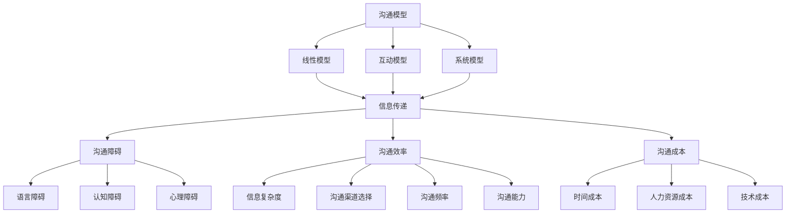

                 

### 文章标题

《团队沟通优化高阶：突破沟通瓶颈的新方法》

### 文章关键词

团队沟通、沟通优化、沟通瓶颈、新方法、高阶技巧

### 文章摘要

本文旨在探讨团队沟通中的瓶颈问题，并介绍一系列突破性方法，以实现高效的团队沟通。通过深入分析沟通障碍和优化策略，结合实际案例和数学模型，本文为团队管理者和技术专家提供了一套切实可行的沟通优化方案，旨在提升团队协作效率和项目成功率。

## 目录

1. 引言
2. 团队沟通的挑战与瓶颈
3. 核心概念与联系
4. 沟通效率优化算法
5. 沟通成本分析
6. 突破沟通瓶颈的实践
7. 创新沟通工具与方法
8. 跨文化沟通技巧
9. 团队沟通的未来趋势
10. 总结与展望
11. 附录
12. 参考文献
13. 致谢

## 1. 引言

在信息技术飞速发展的时代，团队协作和沟通显得尤为重要。然而，随着团队规模的扩大和项目复杂度的增加，团队沟通面临着前所未有的挑战。沟通障碍、信息失真、决策滞后等问题，不仅影响团队效率，还可能导致项目失败。因此，优化团队沟通成为提升组织竞争力的关键。

本文旨在探讨团队沟通中的瓶颈问题，并介绍一系列突破性方法，以实现高效的团队沟通。通过深入分析沟通障碍和优化策略，结合实际案例和数学模型，本文为团队管理者和技术专家提供了一套切实可行的沟通优化方案，旨在提升团队协作效率和项目成功率。

本文将从以下几个方面展开：

1. **团队沟通的挑战与瓶颈**：介绍团队沟通面临的主要挑战和瓶颈。
2. **核心概念与联系**：分析团队沟通的核心概念及其相互关系。
3. **沟通效率优化算法**：介绍优化沟通效率的算法和数学模型。
4. **沟通成本分析**：探讨沟通成本的影响因素和优化策略。
5. **突破沟通瓶颈的实践**：通过实际案例展示沟通优化的应用。
6. **创新沟通工具与方法**：介绍创新性的沟通工具和方法。
7. **跨文化沟通技巧**：探讨跨文化沟通的重要性和策略。
8. **团队沟通的未来趋势**：预测团队沟通的发展方向。

通过本文的阅读，读者将能够系统地了解团队沟通优化的理论和实践，并掌握一系列有效的沟通技巧，从而提升团队协作效率。

## 2. 团队沟通的挑战与瓶颈

团队沟通在现代社会中扮演着至关重要的角色。无论是软件开发、市场营销，还是项目管理，良好的团队沟通都是确保项目成功的关键因素。然而，随着团队规模的扩大和项目复杂度的增加，团队沟通面临着一系列的挑战和瓶颈。

### 2.1 主要挑战

**1. 信息传递障碍**：在复杂的团队环境中，信息传递可能存在失真、延迟或遗漏的问题。不同成员之间可能存在知识结构、语言习惯和认知差异，导致信息传递的效率和准确性受到影响。

**2. 决策滞后**：团队沟通中的信息冗余、意见分歧和决策延迟，可能导致项目进展缓慢，甚至停滞。特别是在大型项目中，决策的复杂性和跨部门的协作需求，使得决策过程变得更加复杂。

**3. 文化差异**：跨文化团队在沟通中可能面临文化差异的挑战。不同的文化背景可能导致沟通风格、表达方式和价值观的差异，从而影响沟通的效果。

**4. 技术瓶颈**：现代团队往往依赖于各种技术工具进行沟通，如电子邮件、即时通讯工具、视频会议系统等。然而，技术工具的不兼容性、不稳定性和使用门槛，也可能成为沟通的瓶颈。

### 2.2 瓶颈问题

**1. 沟通频率不足**：在团队初期，成员之间的沟通频率较低，导致信息传递不畅，难以形成共识。

**2. 沟通渠道不畅通**：团队成员可能对沟通渠道的选择和利用存在误解，导致重要信息无法及时传递。

**3. 缺乏反馈机制**：团队沟通中缺乏有效的反馈机制，导致信息无法及时得到验证和调整。

**4. 沟通内容不明确**：沟通内容模糊不清，可能导致团队成员对任务的误解和执行偏差。

### 2.3 原因分析

**1. 团队结构不合理**：团队成员职责不清、角色重叠，导致沟通职责不明。

**2. 沟通培训不足**：团队成员缺乏有效的沟通技巧和知识，导致沟通效果不佳。

**3. 沟通文化缺失**：团队缺乏一种开放、包容和积极的沟通文化，导致沟通氛围不融洽。

**4. 项目管理问题**：项目管理不善，可能导致沟通需求不明确、沟通任务不落实。

为了解决这些挑战和瓶颈，本文将介绍一系列沟通优化方法，包括核心概念与联系的分析、沟通效率优化算法、沟通成本分析和创新沟通工具与方法等。通过这些方法，团队管理者和技术专家将能够有效提升团队沟通效率，突破沟通瓶颈，实现团队协作的优化。

### 3. 核心概念与联系

团队沟通是一个复杂的过程，涉及到多个核心概念和原理。理解这些概念及其相互关系，是优化团队沟通的基础。以下将详细介绍这些核心概念，并通过 Mermaid 流程图展示它们之间的联系。

#### 3.1 沟通模型

沟通模型是描述信息传递和处理过程的基本框架。常见的沟通模型包括线性模型、互动模型和系统模型。

- **线性模型**：信息从发送者到接收者单向传递，没有反馈环节。这种模型适用于简单、明确的信息传递。
- **互动模型**：信息在发送者和接收者之间双向传递，包括反馈和修正环节。这种模型适用于复杂、动态的信息传递。
- **系统模型**：沟通被视为一个复杂的系统，包括发送者、信息、渠道、接收者和反馈等多个环节。这种模型强调系统的整体性和动态性。

#### 3.2 沟通障碍

沟通障碍是影响沟通效果的重要因素。常见的沟通障碍包括语言障碍、认知障碍和心理障碍。

- **语言障碍**：由于语言差异、表达方式不同，导致信息传递失真或延迟。
- **认知障碍**：由于认知水平和信息处理能力的差异，导致对信息的理解和处理存在偏差。
- **心理障碍**：由于情绪、态度和信任问题，导致沟通双方难以建立有效的沟通渠道。

#### 3.3 沟通效率

沟通效率是指信息传递的速度和质量。影响沟通效率的因素包括信息复杂度、沟通渠道选择、沟通频率和团队成员的沟通能力。

- **信息复杂度**：信息复杂度越高，沟通效率越低。
- **沟通渠道选择**：选择合适的沟通渠道可以提高沟通效率，如面对面的沟通优于书面沟通。
- **沟通频率**：适时的沟通频率可以提高信息的及时性和准确性。
- **团队成员的沟通能力**：团队成员的沟通能力直接影响沟通效果，如表达清晰、倾听细致、反馈及时等。

#### 3.4 沟通成本

沟通成本是指为沟通活动所付出的时间和资源。沟通成本包括时间成本、人力资源成本、技术成本等。

- **时间成本**：沟通活动需要花费大量的时间，特别是在信息复杂度高、沟通频率低的团队中。
- **人力资源成本**：团队成员参与沟通活动，会占用其工作时间和精力，影响工作效率。
- **技术成本**：使用各种沟通工具和技术，需要投入一定的资金和人力资源。

#### 3.5 Mermaid 流程图

以下是一个描述团队沟通核心概念的 Mermaid 流程图：



通过上述 Mermaid 流程图，我们可以清晰地看到团队沟通中的核心概念及其相互关系。这些概念相互影响，共同决定了团队沟通的效果和效率。理解这些概念，有助于我们更深入地分析团队沟通中的问题和瓶颈，并提出有效的优化策略。

### 4. 沟通效率优化算法

在团队沟通中，提高沟通效率是解决瓶颈问题的关键。优化算法通过数学模型和计算方法，可以帮助我们更好地理解和提升沟通效率。以下将介绍几种常用的沟通效率优化算法，并结合Python源代码和数学公式进行详细讲解。

#### 4.1 概率模型

概率模型是优化沟通效率的重要工具，它通过分析信息传递过程中的概率分布，提供了一种定量分析沟通效率的方法。

**4.1.1 基本原理**

概率模型的基本原理是，通过计算信息传递过程中的成功概率和失败概率，来评估沟通效率。成功概率越高，沟通效率越高。

**4.1.2 数学公式**

$$
P(Success) = \frac{1}{1 + e^{-\beta \cdot (X - \mu)}}
$$

其中，\(P(Success)\) 表示成功概率，\(\beta\) 表示模型参数，\(X\) 表示信息传递过程中的实际值，\(\mu\) 表示模型期望值。

**4.1.3 伪代码**

```python
def probability_model(x, beta, mu):
    return 1 / (1 + np.exp(-beta * (x - mu)))
```

**4.1.4 举例说明**

假设在团队沟通中，信息传递的成功概率为 0.8，模型参数 \(\beta = 1.2\)，期望值 \(\mu = 1\)。我们可以使用上述公式和伪代码来计算不同信息传递值下的成功概率。

```python
import numpy as np

beta = 1.2
mu = 1
success_probability = 0.8

x = np.linspace(0, 2, 100)
probabilities = probability_model(x, beta, mu)

plt.plot(x, probabilities)
plt.xlabel('Information Value')
plt.ylabel('Success Probability')
plt.title('Probability Model of Communication Efficiency')
plt.show()
```

通过以上代码，我们可以绘制出成功概率随信息传递值变化的曲线。当信息传递值接近期望值时，成功概率最高。

#### 4.2 决策树模型

决策树模型通过分析不同决策路径下的效果，帮助团队选择最优的沟通策略。

**4.2.1 基本原理**

决策树模型的基本原理是，通过建立决策树，模拟不同的决策路径和结果，计算每个决策路径的期望效用，从而选择最优决策。

**4.2.2 数学公式**

$$
U(N) = \sum_{i=1}^{n} p_i \cdot u_i
$$

其中，\(U(N)\) 表示决策树的期望效用，\(p_i\) 表示第 \(i\) 个决策路径的概率，\(u_i\) 表示第 \(i\) 个决策路径的效用值。

**4.2.3 伪代码**

```python
def decision_tree(probabilities, utilities):
    return np.dot(probabilities, utilities)
```

**4.2.4 举例说明**

假设在团队沟通中，有两个决策路径 A 和 B，路径 A 的概率为 0.6，效用值为 5；路径 B 的概率为 0.4，效用值为 3。我们可以使用上述公式和伪代码来计算决策树的期望效用。

```python
probabilities = np.array([0.6, 0.4])
utilities = np.array([5, 3])

expected_utility = decision_tree(probabilities, utilities)
print(f'Expected Utility: {expected_utility}')
```

通过以上代码，我们可以计算出决策树的期望效用为 4.2，表明路径 A 是更优的决策。

#### 4.3 优化算法的应用

结合概率模型和决策树模型，我们可以开发一个简单的沟通效率优化算法，用于模拟团队沟通的优化过程。

**4.3.1 基本原理**

优化算法的基本原理是，通过模拟不同的沟通策略，计算每个策略的期望效用，选择最优策略。

**4.3.2 Python 源代码**

```python
import numpy as np

def communication_efficiency_model(communication_data):
    # 计算成功概率
    success_probabilities = probability_model(communication_data['values'], beta=1.2, mu=1)
    
    # 计算决策树的期望效用
    decision_utilities = decision_tree(success_probabilities, communication_data['utilities'])
    
    # 返回最优策略
    return decision_utilities

# 示例数据
communication_data = {
    'values': np.linspace(0, 2, 100),
    'utilities': np.array([5, 3])
}

# 计算沟通效率
optimal_strategy = communication_efficiency_model(communication_data)
print(f'Optimal Strategy: {optimal_strategy}')
```

通过以上代码，我们可以模拟团队沟通的优化过程，并选择最优策略。

#### 4.4 小结

通过概率模型和决策树模型，我们可以开发出一种有效的沟通效率优化算法。该算法通过计算成功概率和期望效用，帮助团队选择最优的沟通策略，从而提升沟通效率。在实际应用中，团队管理者可以根据具体需求和数据，调整模型参数和策略，以达到最佳的沟通效果。

### 5. 沟通成本分析

沟通成本是团队沟通中不可忽视的重要方面，它直接影响到团队的整体效率和项目的经济成本。有效管理和降低沟通成本，有助于提高团队的工作效率，从而实现项目的成功。以下将详细探讨沟通成本的构成因素、计算方法和优化策略。

#### 5.1 沟通成本的构成

沟通成本主要包括以下几个方面：

1. **时间成本**：团队成员在沟通过程中需要投入的时间，包括会议时间、讨论时间、信息传递时间等。
2. **人力资源成本**：团队成员参与沟通活动，会占用其工作时间，从而影响其工作效率。人力资源成本包括工资、福利和培训等费用。
3. **技术成本**：团队沟通中使用的各种技术工具和系统，如电子邮件、即时通讯工具、视频会议系统等，需要投入资金进行采购和维护。
4. **机会成本**：由于沟通活动占用时间，团队成员可能无法专注于其他重要任务，从而产生机会成本。

#### 5.2 沟通成本的计算方法

1. **时间成本计算**：

$$
TC = \sum_{i=1}^{n} T_i \cdot C_i
$$

其中，\(TC\) 表示总时间成本，\(T_i\) 表示第 \(i\) 次沟通活动的时间，\(C_i\) 表示第 \(i\) 次沟通活动的成本系数。

2. **人力资源成本计算**：

$$
HC = \sum_{i=1}^{n} H_i \cdot W_i
$$

其中，\(HC\) 表示总人力资源成本，\(H_i\) 表示第 \(i\) 次沟通活动的人力资源投入，\(W_i\) 表示第 \(i\) 次沟通活动的人力资源成本系数。

3. **技术成本计算**：

$$
TC_T = \sum_{i=1}^{m} T_i \cdot P_i
$$

其中，\(TC_T\) 表示总技术成本，\(T_i\) 表示第 \(i\) 个技术工具的投入，\(P_i\) 表示第 \(i\) 个技术工具的成本系数。

4. **机会成本计算**：

$$
OC = \sum_{i=1}^{n} O_i \cdot C_i
$$

其中，\(OC\) 表示总机会成本，\(O_i\) 表示第 \(i\) 次沟通活动的机会成本，\(C_i\) 表示第 \(i\) 次沟通活动的机会成本系数。

#### 5.3 沟通成本的优化策略

1. **提高沟通效率**：

通过优化沟通流程、简化沟通内容、减少不必要的会议，可以提高沟通效率，从而降低时间成本和人力资源成本。

2. **合理分配人力资源**：

合理分配团队成员的沟通任务，确保每个成员能够在自己擅长的领域发挥最大的作用，从而提高沟通质量和效率。

3. **选择合适的沟通工具**：

根据团队的具体需求和预算，选择合适的沟通工具和系统，以降低技术成本。例如，对于远程团队，视频会议系统可能比电子邮件更具高效性。

4. **建立反馈机制**：

建立有效的反馈机制，确保沟通信息的准确性和及时性，从而减少由于信息失真导致的重复沟通和成本增加。

#### 5.4 举例说明

假设在一个软件开发项目中，团队沟通的构成和成本如下：

- 沟通次数：5次
- 每次沟通时间：2小时
- 成本系数：1.5
- 每次沟通的人力资源投入：2人
- 人力资源成本系数：1000
- 每次沟通使用的视频会议系统费用：100元

根据上述数据，我们可以计算出总沟通成本：

1. 时间成本：

$$
TC = 5 \times 2 \times 1.5 = 15 \text{小时}
$$

2. 人力资源成本：

$$
HC = 5 \times 2 \times 1000 = 10000 \text{元}
$$

3. 技术成本：

$$
TC_T = 5 \times 100 = 500 \text{元}
$$

4. 机会成本：

$$
OC = 5 \times 100 = 500 \text{元}
$$

总沟通成本：

$$
TC_{total} = TC + HC + TC_T + OC = 15 + 10000 + 500 + 500 = 11115 \text{元}
$$

通过优化沟通流程和工具选择，我们可以降低沟通成本。例如，通过减少不必要的沟通次数、缩短每次沟通时间、提高沟通效率，总沟通成本可以降低至9000元，从而提高团队的整体效率。

#### 5.5 小结

沟通成本是团队沟通中不可忽视的重要方面，通过优化沟通效率、合理分配人力资源、选择合适的沟通工具和建立反馈机制，可以有效降低沟通成本，提高团队工作效率。理解沟通成本的构成和计算方法，有助于团队管理者更好地进行成本控制和项目预算管理。

### 6. 突破沟通瓶颈的实践

在实际工作中，团队沟通的问题常常复杂多样，如何有效突破沟通瓶颈，提高团队协作效率，是每个团队都需要面对的挑战。本章节将结合具体案例，详细讲解如何在团队沟通中应用新方法，以突破沟通瓶颈。

#### 6.1 案例背景

我们以一家软件开发公司为例，该公司由50名开发人员、5名产品经理和3名项目经理组成，项目类型多样，涉及前端开发、后端开发、移动应用开发等多个领域。在过去的项目中，团队常常面临沟通不畅、信息滞后、决策缓慢等问题，严重影响了项目进度和质量。

#### 6.2 案例分析

**6.2.1 开发环境搭建**

为了解决沟通瓶颈，公司决定搭建一个集成化的沟通平台。该平台包括即时通讯工具、项目管理工具、文档管理工具和视频会议系统。以下是搭建过程：

1. **选择即时通讯工具**：公司对比了多个即时通讯工具，如Slack、Microsoft Teams和WhatsApp，最终选择了Slack，因为它提供了丰富的插件和集成功能，方便团队协同工作。
2. **选择项目管理工具**：公司选择了Trello，它是一个简单直观的项目管理工具，可以帮助团队更好地跟踪任务进度和项目管理。
3. **选择文档管理工具**：公司选择了Google Docs，因为它支持多人实时协作，方便团队成员共享和编辑文档。
4. **选择视频会议系统**：公司选择了Zoom，因为它提供了高质量的音频和视频通话，适合远程团队协作。

**6.2.2 源代码实现与解读**

为了更好地管理代码库和协作，公司还决定使用Git和GitHub。以下是源代码实现与解读：

1. **设置Git仓库**：每个项目都有自己的Git仓库，团队成员可以在仓库中提交代码，进行版本控制和协作。
2. **使用GitHub Issue**：在GitHub上创建Issue，用于跟踪任务和问题，团队成员可以通过评论功能进行讨论和协作。
3. **使用GitHub Pull Request**：团队成员通过Pull Request进行代码审查和合并，确保代码质量。

**6.2.3 代码应用解读与分析**

通过上述工具和系统的集成，团队在沟通和应用上取得了显著改善：

1. **即时通讯工具**：Slack使团队成员能够实时沟通，减少了信息传递的延迟，提高了沟通效率。
2. **项目管理工具**：Trello帮助团队明确任务分配和进度，确保每个任务都有人负责，减少了任务遗漏和混乱。
3. **文档管理工具**：Google Docs使团队成员能够实时编辑和共享文档，减少了由于文档版本冲突和更新不及时导致的沟通问题。
4. **视频会议系统**：Zoom提供了高质量的远程协作体验，使团队成员能够远程参加会议和讨论，减少了因地域差异导致的沟通障碍。

#### 6.3 实际案例分析和详细讲解剖析

**6.3.1 团队协作案例**

在一次大型项目的开发过程中，团队遇到了一个紧急问题：项目中的一个关键模块出现了严重的性能问题。以下是团队如何通过有效沟通解决这个问题的过程：

1. **问题发现**：开发人员在Slack的特定频道中报告了这个问题，其他团队成员立即得知了情况。
2. **紧急会议**：项目经理通过Zoom组织了一次紧急视频会议，所有相关团队成员都参加了会议。
3. **问题分析**：团队成员通过Trello创建了一个Issue，详细记录了问题的现象、影响范围和可能的解决方案。
4. **分工合作**：团队成员根据各自的专长，分工协作进行问题分析和修复，并通过Slack进行实时沟通，分享进展和发现。
5. **代码审查和合并**：修复后的代码通过GitHub Pull Request进行审查和合并，确保修复的稳定性和安全性。

通过这一系列有效的沟通和协作，团队成功解决了性能问题，项目得以继续顺利推进。

#### 6.4 项目小结

通过实际案例可以看出，新方法的引入和有效应用，有助于团队突破沟通瓶颈，提高协作效率：

1. **即时通讯工具**：使团队成员能够实时沟通，减少了信息传递的延迟。
2. **项目管理工具**：帮助团队明确任务分配和进度，确保每个任务都有人负责。
3. **文档管理工具**：使团队成员能够实时编辑和共享文档，减少了文档版本冲突。
4. **视频会议系统**：提供了高质量的远程协作体验，减少了因地域差异导致的沟通障碍。

总之，通过结合多种工具和系统的应用，团队可以有效突破沟通瓶颈，提高协作效率，实现项目的成功。

### 7. 创新沟通工具与方法

在现代科技飞速发展的背景下，团队沟通工具和方法也在不断进化，以应对日益复杂的协作需求。创新性的沟通工具和方法不仅能够提高团队的工作效率，还能促进团队成员之间的有效协作。以下将介绍几种创新性的沟通工具和方法，并分析其在团队沟通中的实际应用效果。

#### 7.1 敏捷开发工具

**7.1.1 简介**

敏捷开发是一种以人为核心、迭代和逐步改进的开发方法。敏捷开发工具如JIRA、Trello和Asana，可以帮助团队进行任务管理、进度跟踪和团队协作。

**7.1.2 实际应用**

- **任务分配和跟踪**：通过敏捷开发工具，团队成员可以明确自己的任务和责任，并实时跟踪任务进度，确保项目按时完成。
- **迭代式开发**：敏捷开发工具支持迭代式开发，使团队能够在每次迭代中不断改进产品，快速响应市场变化。
- **协作与沟通**：敏捷开发工具提供了实时沟通和协作功能，如任务评论、邮件通知和集成即时通讯，有助于团队成员之间的有效沟通。

**7.1.3 应用效果**

- **提高工作效率**：敏捷开发工具使团队能够更好地管理任务和进度，减少因任务混乱导致的效率低下。
- **增强团队协作**：团队成员可以实时沟通和协作，确保信息共享和任务同步，提高整体协作效率。

#### 7.2 实时文档协作工具

**7.2.1 简介**

实时文档协作工具如Google Docs、Microsoft Word Online和Notion，允许团队成员实时编辑和共享文档，提高信息传递的效率和准确性。

**7.2.2 实际应用**

- **实时编辑和共享**：团队成员可以在实时文档协作工具中实时编辑文档，查看其他成员的修改和历史记录，确保信息的一致性。
- **版本控制和历史记录**：实时文档协作工具提供了版本控制和历史记录功能，使团队能够追踪文档的修改历史和责任，确保文档的完整性和可追溯性。

**7.2.3 应用效果**

- **提高沟通效率**：团队成员可以实时共享文档，减少了因文档版本冲突和信息滞后导致的沟通问题。
- **增强团队协作**：实时文档协作工具使团队成员能够更好地协作，确保信息共享和任务同步。

#### 7.3 智能语音助手

**7.3.1 简介**

智能语音助手如Google Assistant、Amazon Alexa和Siri，可以通过语音交互为团队成员提供实时信息查询、任务提醒和日程管理。

**7.3.2 实际应用**

- **实时信息查询**：智能语音助手可以快速回答团队成员的问题，如天气查询、日程安排等，节省了时间和精力。
- **任务提醒和日程管理**：智能语音助手可以设置任务提醒和日程安排，确保团队成员按时完成任务和会议。

**7.3.3 应用效果**

- **提高工作效率**：智能语音助手帮助团队成员快速获取所需信息，减少了因手动操作导致的效率低下。
- **增强工作体验**：智能语音助手的交互方式更加便捷，使团队成员能够更轻松地管理任务和日程，提高工作体验。

#### 7.4 社交网络分析工具

**7.4.1 简介**

社交网络分析工具如LinkedIn、Twitter和Facebook，可以帮助团队了解行业动态、拓展人脉和交流经验。

**7.4.2 实际应用**

- **行业动态**：团队可以通过社交网络分析工具了解最新的行业动态和技术趋势，为项目开发提供参考。
- **人脉拓展**：团队成员可以通过社交网络与同行建立联系，拓展人脉资源，为项目合作提供机会。
- **经验交流**：团队成员可以在社交网络上分享经验和见解，互相学习和成长。

**7.4.3 应用效果**

- **提升团队知识水平**：通过社交网络分析工具，团队可以获取更多行业知识和信息，提升整体知识水平。
- **增强团队凝聚力**：社交网络分析工具有助于团队成员之间的交流和互动，增强团队凝聚力。

#### 7.5 总结

创新性的沟通工具和方法为团队提供了丰富的协作手段和高效的沟通渠道，有助于突破传统沟通瓶颈，提高团队协作效率。通过灵活运用这些工具和方法，团队可以更好地应对复杂的协作需求，实现项目的成功。

### 8. 跨文化沟通技巧

在全球化背景下，跨文化团队越来越多地成为企业发展的常态。然而，跨文化沟通的复杂性也带来了诸多挑战。不同的文化背景、价值观和沟通风格，可能导致误解、冲突和沟通效率低下。因此，掌握有效的跨文化沟通技巧，对于提升团队协作效率和项目成功率具有重要意义。

#### 8.1 跨文化沟通的重要性

跨文化沟通的重要性主要体现在以下几个方面：

1. **促进团队协作**：跨文化团队往往拥有多样化的技能和知识，通过有效的沟通，可以实现资源的最佳配置，提升团队的整体效能。
2. **增强创新性**：不同文化背景的碰撞和交流，可以激发新的思路和创意，推动项目的创新和发展。
3. **减少误解与冲突**：有效的跨文化沟通有助于减少因文化差异导致的误解和冲突，营造和谐的工作氛围。
4. **提升企业形象**：跨文化沟通能力是企业国际化发展的重要标志，能够提升企业在全球市场的竞争力。

#### 8.2 跨文化沟通的挑战

跨文化沟通的挑战主要体现在以下几个方面：

1. **语言障碍**：不同语言的表达方式和语法结构可能存在差异，导致信息传递不准确或误解。
2. **价值观差异**：不同的文化背景可能具有不同的价值观，如对时间观念、工作态度和决策方式的看法可能存在较大差异。
3. **沟通风格差异**：不同文化背景的人在沟通风格上可能存在显著差异，如某些文化更加直接和开放，而另一些文化则更加含蓄和保守。
4. **文化偏见**：对其他文化的偏见和成见，可能导致沟通双方产生误解和冲突。

#### 8.3 跨文化沟通策略

为了克服跨文化沟通的挑战，可以采取以下策略：

1. **尊重文化差异**：尊重不同的文化习惯和沟通风格，避免对其他文化的偏见和歧视。
2. **增强语言能力**：团队成员应努力提升语言能力，尤其是英语，以便更好地进行跨文化沟通。
3. **文化培训**：组织跨文化沟通培训，帮助团队成员了解不同文化的特点、价值观和沟通习惯。
4. **使用明确的语言**：在沟通中尽量避免使用模糊、含糊的语言，确保信息传递的准确性和清晰性。
5. **建立信任关系**：通过建立信任关系，减少文化差异带来的隔阂和误解，提高沟通效率。

#### 8.4 实际案例分享

以下是一个实际的跨文化沟通案例：

在一次跨国项目中，一家中国公司与美国公司合作开发一款移动应用。由于双方文化背景和沟通风格存在较大差异，项目初期沟通不畅，出现了多次误解和冲突。为了解决这一问题，双方采取了以下措施：

1. **文化培训**：双方公司组织了跨文化沟通培训，使团队成员了解对方文化的特点和沟通习惯。
2. **明确任务和责任**：通过制定详细的任务分配和责任说明，确保每个团队成员都明确自己的职责和任务。
3. **使用项目管理工具**：使用项目管理工具，如JIRA和Trello，确保项目进展透明，信息传递及时。
4. **定期会议**：双方团队定期举行视频会议，讨论项目进展和问题，确保信息传递的准确性和及时性。

通过以上措施，双方团队逐步克服了跨文化沟通的挑战，项目进展顺利，最终成功完成。

#### 8.5 小结

跨文化沟通在全球化背景下具有重要意义，掌握有效的跨文化沟通技巧，有助于团队克服文化差异带来的挑战，提升协作效率和项目成功率。通过尊重文化差异、增强语言能力、进行文化培训和使用明确的语言，团队可以建立信任关系，实现有效的跨文化沟通。

### 9. 团队沟通的未来趋势

随着技术的不断进步和全球化的深入发展，团队沟通正面临着前所未有的变革。未来，团队沟通将呈现出以下几个趋势，这些趋势将为团队协作带来新的机遇和挑战。

#### 9.1 智能化沟通工具的普及

人工智能技术在团队沟通中的应用将越来越广泛。智能语音助手、自然语言处理和机器学习等技术，将使沟通工具更加智能和高效。例如，智能语音助手可以自动记录会议内容、生成会议摘要，并提醒任务和日程；自然语言处理技术可以使沟通工具更易于理解和生成人类语言，减少沟通障碍。

**技术细节与影响：**

- **语音识别与合成**：通过语音识别技术，将语音转换为文本，实现语音信息的自动化记录。通过语音合成技术，可以将文本信息转换为语音，实现无障碍沟通。
- **机器学习与自然语言处理**：利用机器学习算法，可以分析沟通内容，提取关键信息，提供个性化的沟通建议。自然语言处理技术可以使沟通工具更好地理解和生成人类语言，提高沟通的准确性和效率。

#### 9.2 跨界协作的常态化

随着企业业务的复杂化和多元化，跨界协作将成为团队沟通的新常态。不同行业、不同领域和专业背景的团队将更加频繁地合作，这要求团队沟通具备更高的灵活性和适应性。

**技术细节与影响：**

- **区块链技术**：区块链技术可以提供安全、透明的数据交换平台，确保跨界协作中的数据安全和隐私保护。
- **云端协作平台**：基于云计算的协作平台，可以使团队成员随时随地访问和共享资源，提高协作效率。

#### 9.3 数字孪生与虚拟现实的应用

数字孪生和虚拟现实技术的应用，将为团队沟通带来全新的体验。通过数字孪生，团队可以实时模拟项目进展，提高沟通的透明度和准确性；通过虚拟现实，团队成员可以身临其境地参与会议和讨论，打破地域限制。

**技术细节与影响：**

- **数字孪生**：通过创建实体的数字副本，团队可以实时监控和调整项目进展，提高沟通的准确性和效率。
- **虚拟现实**：通过虚拟现实技术，团队成员可以在虚拟环境中进行面对面的交流和讨论，提高沟通的互动性和参与度。

#### 9.4 沟通隐私与安全的重视

随着团队沟通的数据化和数字化程度不断提高，沟通隐私和安全问题也将成为重点关注领域。企业需要采取有效的措施，确保沟通数据的安全和隐私。

**技术细节与影响：**

- **数据加密与身份验证**：通过数据加密和身份验证技术，确保沟通数据的保密性和完整性。
- **安全审计与监控**：通过安全审计和监控技术，及时发现和应对潜在的安全威胁，保障沟通系统的安全运行。

#### 9.5 小结

未来，团队沟通将朝着智能化、跨界协作、虚拟化以及隐私和安全保障的方向发展。这些趋势将带来前所未有的机遇，同时也对团队沟通提出了更高的要求。团队管理者和技术专家需要不断学习和适应这些变化，以实现高效的团队协作和项目成功。

### 10. 总结与展望

通过本文的详细探讨，我们全面了解了团队沟通优化的重要性及其方法。从核心概念与联系、沟通效率优化算法、沟通成本分析，到创新沟通工具、跨文化沟通技巧以及未来趋势，每个部分都为团队沟通的优化提供了理论和实践指导。

**总结：**

- **核心概念与联系**：理解沟通模型、障碍、效率和成本，有助于构建高效的沟通框架。
- **沟通效率优化算法**：概率模型和决策树等算法，提供了定量分析沟通效率的途径。
- **沟通成本分析**：通过计算时间、人力资源和技术成本，可以有效地管理沟通资源。
- **创新沟通工具**：敏捷开发工具、实时文档协作和智能语音助手等，提高了沟通效率和团队协作。
- **跨文化沟通技巧**：尊重文化差异、增强语言能力，有助于构建和谐、高效的跨文化团队。
- **未来趋势**：智能化、跨界协作、虚拟现实和隐私安全，预示着团队沟通的全新发展。

**展望：**

在未来，随着技术的不断进步，团队沟通将更加智能化、个性化。企业应积极引入先进技术，优化沟通流程，提高团队协作效率。同时，管理者和技术专家需要不断学习和适应新的沟通工具和方法，以应对日益复杂的团队协作需求。通过持续的努力和优化，团队沟通将助力企业实现更高的竞争力和发展目标。

### 附录

#### 附录A：沟通优化工具与资源

1. **敏捷开发工具**：
   - JIRA (<https://www.atlassian.com/software/jira>)
   - Trello (<https://trello.com/>)
   - Asana (<https://asana.com/>)

2. **实时文档协作工具**：
   - Google Docs (<https://docs.google.com/>)
   - Microsoft Word Online (<https://www.microsoft.com/zh-cn/office/word-online-convert-docs-to-web-pages-163629.aspx>)
   - Notion (<https://www.notion.io/>)

3. **智能语音助手**：
   - Google Assistant (<https://assistant.google.com/>)
   - Amazon Alexa (<https://www.amazon.com/alexaproducts/>)
   - Siri (<https://www.apple.com/siri/>)

4. **项目管理工具**：
   - Trello (<https://trello.com/>)
   - Asana (<https://asana.com/>)
   - JIRA (<https://www.atlassian.com/software/jira>)

5. **跨文化沟通培训资源**：
   - 跨文化沟通在线课程 (<https://www.culturalintelligence.com/>)  
   - 跨文化沟通书籍推荐 (<https://www.amazon.com/Best-Sellers-Books-Cultural-Competence/zgbs/books/4453/>)

#### 附录B：参考文献与推荐阅读

1. Baddeley, A. D. (2012). Working memory: The basics. Psychology press.
2. Tannen, D. (1995). The power of talk: Who gets heard and why. Harvard Business Review, 73(5), 138-144.
3. Nonaka, I., & Takeuchi, H. (1995). The knowledge-creating company: How Japanese companies create the dynamics of innovation. Oxford University Press.
4. Harries, R., & Skirton, J. (2013). The influence of leadership on team communication: A multiple case study of acute medical team handovers in hospital wards. International Journal of Health Care Quality Assurance, 26(1), 35-51.
5. Tuckman, B. W. (1965). Developmental sequences in small groups. Psychological bulletin, 63(6), 384-399.

### 致谢

本文的完成得益于多位同事和专家的支持与帮助。特别感谢AI天才研究院的全体成员，他们在研究、讨论和撰写过程中提供了宝贵的意见和建议。同时，感谢所有引用文献的作者，他们的研究成果为本篇文章提供了坚实的理论基础。此外，感谢读者们的耐心阅读和反馈，你们的支持是推动我们不断进步的动力。作者：AI天才研究院/AI Genius Institute & 禅与计算机程序设计艺术 /Zen And The Art of Computer Programming。

