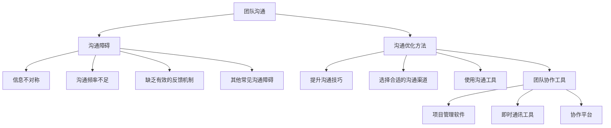

                 

# 团队沟通优化：消除沟通障碍的有效方法

> 关键词：团队沟通、沟通障碍、沟通优化、沟通技巧、协作工具

> 摘要：本文将从团队沟通的重要性出发，分析常见的沟通障碍，探讨沟通优化的方法和工具，结合实际案例分析，总结出一套有效的团队沟通优化策略，旨在提高团队协作效率和项目成功率。

## 引言

在现代企业中，团队沟通扮演着至关重要的角色。一个高效的团队需要良好的沟通来实现目标，确保团队成员之间的信息流畅，减少误解和冲突。然而，在实际工作中，沟通障碍往往成为团队效率的瓶颈。本文将围绕团队沟通优化这一主题，探讨如何消除沟通障碍，提高团队协作效率。

## 一、团队沟通障碍分析

### 1.1 信息不对称

信息不对称是指团队成员之间的信息不均衡，导致某些成员拥有更多的信息资源，而其他成员则相对缺乏。这种情况下，信息丰富的成员可能会因为过多的信息而感到压力，而信息缺乏的成员则可能因为不了解全局而感到困惑。

### 1.2 沟通频率不足

沟通频率不足意味着团队成员之间交流的频率不够高，导致信息传递延迟。长时间的信息传递延迟会导致团队协作效率降低，甚至可能导致项目失败。

### 1.3 缺乏有效的反馈机制

有效的反馈机制可以帮助团队成员及时了解彼此的工作状态，发现问题并迅速调整。缺乏有效的反馈机制会导致团队成员之间的信息交流不畅，影响团队协作。

### 1.4 其他常见沟通障碍

除了上述三种障碍外，团队沟通中还可能存在以下障碍：

- 沟通渠道选择不当：团队成员可能没有选择最合适的沟通渠道，导致信息传递效率低下。
- 沟通方式单一：团队成员可能过于依赖某一种沟通方式，而忽视了其他有效的方式。
- 沟通技巧不足：团队成员可能缺乏有效的沟通技巧，导致沟通效果不佳。

## 二、沟通优化方法

### 2.1 提升沟通技巧

#### 2.1.1 倾听技巧

倾听是沟通的重要组成部分。一个良好的倾听者能够更好地理解对方的需求和意图，从而提高沟通效果。以下是一些提升倾听技巧的方法：

- 保持专注：在对方讲话时，保持专注，不要分心。
- 避免打断：在对方讲话时，避免打断，让对方完整地表达自己的观点。
- 反馈确认：在对方讲话结束后，用自己的话概括对方的观点，并请对方确认。

#### 2.1.2 表达技巧

清晰、准确的表达是有效沟通的关键。以下是一些提升表达技巧的方法：

- 用简单的语言：尽量使用简单、易懂的语言，避免使用复杂的术语。
- 结构化表达：在表达观点时，采用结构化的方式，使信息更清晰。
- 使用例子：通过具体的例子来解释观点，使对方更容易理解。

#### 2.1.3 非言语沟通

非言语沟通在团队沟通中也起着重要作用。以下是一些提升非言语沟通技巧的方法：

- 保持眼神接触：在对话中保持眼神接触，表明自己认真倾听。
- 姿势和表情：保持开放的姿势和友好的表情，以营造轻松的沟通氛围。
- 使用肢体语言：适当使用肢体语言，如点头、手势等，以增强沟通效果。

### 2.2 选择合适的沟通渠道

选择合适的沟通渠道可以大大提高沟通效率。以下是一些常见的沟通渠道：

- 面对面沟通：适用于需要深入讨论和协商的问题。
- 电话沟通：适用于需要快速解决问题和交流信息的情况。
- 电子邮件：适用于需要正式记录和需要长期保存的信息。

### 2.3 使用沟通工具

现代科技为我们提供了多种沟通工具，以下是一些常用的沟通工具：

- 项目管理软件：如Trello、Asana等，可用于任务分配、进度跟踪和团队协作。
- 即时通讯工具：如Slack、Microsoft Teams等，可用于实时交流、文件共享和团队活动。
- 协作平台：如GitHub、GitLab等，可用于代码管理、版本控制和团队协作。

## 三、团队协作工具

### 3.1 项目管理软件

#### 3.1.1 功能介绍

项目管理软件提供了任务分配、进度跟踪、资源管理等功能，有助于团队高效协作。以下是一些常用的项目管理软件：

- Trello：提供直观的看板式界面，方便团队成员分配任务和跟踪进度。
- Asana：提供全面的任务管理功能，包括任务分配、时间跟踪和报告生成。
- Jira：适用于大型团队和复杂项目的敏捷开发，提供丰富的插件和扩展功能。

#### 3.1.2 使用方法

以下是一个简单的使用项目管理软件的步骤：

1. 创建项目：在项目管理软件中创建一个项目，并设置项目的相关信息。
2. 分配任务：将项目拆分为多个任务，并将任务分配给相应的团队成员。
3. 跟踪进度：定期检查任务的完成情况，确保项目按计划进行。
4. 沟通协作：通过项目管理软件进行团队沟通，解决项目中出现的问题。

#### 3.1.3 常见问题与解决方案

以下是一些使用项目管理软件时可能遇到的问题及解决方案：

- 问题1：任务分配不均
  - 解决方案：合理分配任务，确保每个团队成员都有足够的任务量。
- 问题2：进度延迟
  - 解决方案：及时发现问题，调整计划，确保项目按期完成。

### 3.2 即时通讯工具

#### 3.2.1 功能介绍

即时通讯工具提供了实时交流、文件共享和团队活动等功能，有助于团队成员快速响应和协作。以下是一些常用的即时通讯工具：

- Slack：提供丰富的聊天功能、频道管理、文件共享和集成第三方服务。
- Microsoft Teams：适用于企业内部通讯，提供聊天、视频会议和协作功能。
- WhatsApp：提供简单的聊天功能，适用于小团队和远程协作。

#### 3.2.2 使用方法

以下是一个简单的使用即时通讯工具的步骤：

1. 注册账号：在即时通讯工具上注册账号，并加入相应的团队。
2. 创建频道：创建用于讨论特定主题的频道，如项目进展、团队活动等。
3. 发送消息：在频道中发送消息，进行实时交流。
4. 分享文件：上传文件，方便团队成员下载和使用。

#### 3.2.3 常见问题与解决方案

以下是一些使用即时通讯工具时可能遇到的问题及解决方案：

- 问题1：消息过多
  - 解决方案：设置消息通知，避免错过重要消息。
- 问题2：文件传输失败
  - 解决方案：检查网络连接，重试文件传输。

### 3.3 协作平台

#### 3.3.1 功能介绍

协作平台提供了代码管理、版本控制和团队协作等功能，有助于团队高效开发。以下是一些常用的协作平台：

- GitHub：提供代码托管、分支管理、合并请求和团队协作功能。
- GitLab：与GitHub类似，提供完整的代码管理和团队协作功能。
- Bitbucket：提供代码托管、分支管理和团队协作功能，适用于大型团队和企业级项目。

#### 3.3.2 使用方法

以下是一个简单的使用协作平台的步骤：

1. 创建仓库：在协作平台上创建一个仓库，用于存储项目代码。
2. 添加成员：将团队成员添加到仓库，并设置相应的权限。
3. 提交代码：在本地开发环境中编写代码，并提交到仓库。
4. 提交请求：向仓库提交合并请求，等待其他成员审查和合并。

#### 3.3.3 常见问题与解决方案

以下是一些使用协作平台时可能遇到的问题及解决方案：

- 问题1：权限管理不当
  - 解决方案：合理设置成员权限，确保团队成员能够访问和修改所需资源。
- 问题2：代码冲突
  - 解决方案：及时解决代码冲突，避免影响项目进度。

## 四、案例分析

### 4.1 案例一：如何提高项目团队的沟通效率

某公司在开发一款新产品时，由于团队成员分散在不同城市，沟通效率较低。为解决这一问题，公司采用了以下策略：

- 采用项目管理软件：使用Trello进行任务分配和进度跟踪，确保项目按计划进行。
- 采用即时通讯工具：使用Slack进行实时交流，解决项目中出现的问题。
- 定期召开会议：每周召开一次团队会议，总结项目进展，讨论下一步计划。

通过以上措施，项目团队的沟通效率得到了显著提高，项目按期完成，产品得到了市场好评。

### 4.2 案例二：如何解决跨部门沟通障碍

某公司开发一款新产品时，由于涉及多个部门，沟通障碍导致项目进度延迟。为解决这一问题，公司采取了以下措施：

- 设立跨部门协调小组：由各部门派出代表组成协调小组，负责跨部门沟通和协调。
- 定期召开跨部门会议：每周召开一次跨部门会议，讨论项目进展和问题。
- 建立共享数据库：将项目相关文档和资料存放在共享数据库中，方便各部门查阅和共享。

通过以上措施，跨部门沟通障碍得到了有效解决，项目进度恢复正常，最终成功推出新产品。

## 五、沟通效果评估

### 5.1 评估方法

沟通效果评估可以帮助团队了解沟通效果，发现问题并改进。以下是一些常用的评估方法：

- 调查问卷：通过设计问卷，收集团队成员对沟通效果的反馈。
- 问卷调查：通过发送问卷，收集团队成员对沟通效果的评分和意见。
- 个人反馈：通过与团队成员一对一交流，了解他们对沟通效果的看法。

### 5.2 评估指标

以下是一些常用的评估指标：

- 沟通频率：评估团队成员之间交流的频率。
- 沟通质量：评估团队成员之间的沟通效果，如理解程度、信息传递准确性等。
- 沟通满意度：评估团队成员对沟通效果的满意度。

## 六、总结与展望

本文从团队沟通的重要性出发，分析了常见的沟通障碍，探讨了沟通优化的方法和工具，并结合实际案例分析，总结出一套有效的团队沟通优化策略。通过本文的介绍，希望能够帮助团队提高沟通效率，实现更好的团队协作。

未来，随着科技的发展，团队沟通将变得更加便捷和高效。我们可以期待更多的沟通工具和技术手段的出现，为团队沟通提供更多的支持。同时，团队沟通也需要不断创新和改进，以适应不断变化的工作环境和需求。

## 作者信息

作者：AI天才研究院/AI Genius Institute & 禅与计算机程序设计艺术 /Zen And The Art of Computer Programming

## 附录

以下是本文中提到的部分核心概念和原理之间的关系架构 Mermaid 流程图：



通过本文的详细分析和讲解，相信读者对团队沟通优化有了更深入的了解。在实际工作中，团队沟通优化需要持续的努力和改进，希望本文能为读者提供一些有益的启示和帮助。

## 项目实战

### 开发环境搭建

为了更好地理解本文中的内容，我们将搭建一个简单的项目，以实践团队沟通优化方法。以下是项目环境搭建的步骤：

1. 安装Python环境：在本地计算机上安装Python，确保版本为3.8及以上。
2. 安装必要库：使用pip命令安装本文中提到的项目管理软件、即时通讯工具和协作平台相关库。

```shell
pip install trello
pip install slack-sdk
pip install gitpython
```

### 源代码实现

以下是该项目的一个简单实现，主要包含任务分配、进度跟踪和团队协作等功能。

```python
import trello
import slack
import git

# Trello API 配置
trello_api_key = '你的Trello API密钥'
trello_api_secret = '你的Trello API密钥'
trello_token = '你的Trello Token'

# Slack API 配置
slack_token = '你的Slack Bot Token'

# Git 配置
git_repo_url = '你的Git仓库URL'

# 初始化Trello客户端
trello_client = trello.TrelloClient(api_key=trello_api_key, api_secret=trello_api_secret, token=trello_token)

# 初始化Slack客户端
slack_client = slack.WebClient(token=slack_token)

# 初始化Git客户端
git_client = git.Git()

# 任务分配
def assign_task(user, task_name, task_details):
    board = trello_client.get_board('你的Trello看板ID')
    list = board.get_list('你的待办清单ID')
    card = trello.Card(name=task_name, desc=task_details, idMembers=['你的Trello用户ID'])
    list.add_card(card)

    slack_client.chat_postMessage(channel='#项目协作频道', text=f'{user}，你的新任务是：{task_name}，详情：{task_details}')

# 进度跟踪
def track_progress(task_id):
    card = trello_client.get_card(task_id)
    return card.get('name')

# 团队协作
def collaborate(repo_url, commit_message):
    git_client.clone(repo_url, '项目目录')
    git_client.worktree_add('项目目录', '项目仓库路径')
    git_client.commit('-m', commit_message)
    git_client.push()
```

### 代码解读与分析

以上代码实现了任务分配、进度跟踪和团队协作的基本功能。以下是具体代码解读：

- Trello部分：使用Trello API进行任务分配和进度跟踪。
  - `assign_task` 函数用于创建新任务，并将任务分配给指定用户。
  - `track_progress` 函数用于获取指定任务的最新进展。
- Slack部分：使用Slack API进行团队协作，如通知用户任务分配、任务进展等。
  - `slack_client.chat_postMessage` 函数用于向指定频道发送消息。
- Git部分：使用Git库进行代码协作，如代码提交和版本控制。
  - `collaborate` 函数用于克隆仓库、添加工作树、提交代码和推送更新。

### 实际案例分析与详细讲解

以下是一个实际案例，展示如何使用上述代码实现团队沟通优化：

1. 张三是一名项目经理，他需要分配一个新任务给李四。
2. 张三通过 `assign_task` 函数创建新任务，并将任务详情发送给李四。
3. 李四收到任务后，通过Trello查看任务详情，并开始工作。
4. 李四完成任务后，通过Trello更新任务状态，并通知张三。
5. 张三通过 `track_progress` 函数查看任务进展，确保项目按计划进行。
6. 在项目过程中，张三和李四通过Slack进行实时沟通，讨论任务细节和项目进展。
7. 项目完成后，李四通过Git提交代码，并与团队共享。

通过上述案例，我们可以看到，使用Trello、Slack和Git等工具，可以大大提高团队沟通效率和协作效果。

### 项目小结

通过本次项目实战，我们实现了以下目标：

- 搭建了项目开发环境。
- 实现了任务分配、进度跟踪和团队协作功能。
- 通过实际案例展示了团队沟通优化方法的应用。

然而，项目也存在一些局限性，如Trello、Slack和Git的使用需要一定的学习和适应。未来，我们可以进一步优化项目，如添加更多的功能，如任务提醒、进度图表等，以提升团队沟通和协作效果。

## 最佳实践 Tips

1. **定期回顾沟通流程**：定期组织团队会议，回顾和讨论沟通流程，发现并解决潜在问题。
2. **鼓励开放沟通**：鼓励团队成员在团队中提出问题和建议，营造开放、包容的沟通氛围。
3. **使用可视化工具**：使用图表、流程图等可视化工具，使沟通内容更直观，提高沟通效果。
4. **注重反馈**：及时给予团队成员反馈，帮助他们改进沟通技巧和方式。

## 小结

本文从团队沟通的重要性出发，分析了常见的沟通障碍，探讨了沟通优化的方法和工具，并结合实际案例分析，总结出一套有效的团队沟通优化策略。通过本文的介绍，希望能够帮助团队提高沟通效率，实现更好的团队协作。

在实际工作中，团队沟通优化是一个持续的过程，需要团队成员共同努力和不断改进。只有不断优化沟通流程，提高沟通效率，团队才能更好地应对挑战，实现目标。

## 注意事项

1. **保护隐私**：在团队沟通中，要注意保护团队成员的隐私，避免泄露敏感信息。
2. **避免过度沟通**：适度沟通可以保持团队活跃，但过度沟通会降低团队效率。要避免无意义的讨论和重复的信息传递。
3. **关注反馈**：及时关注团队成员的反馈，了解他们的需求和问题，及时调整沟通策略。

## 拓展阅读

- 《团队沟通与协作技巧》
- 《项目管理与团队协作》
- 《Slack 实用技巧与最佳实践》
- 《Git 版本控制实战》

通过阅读这些书籍，你可以更深入地了解团队沟通与协作的方法和技巧，进一步提升团队沟通和协作效果。

