                 


## 第1章：沟通障碍的普遍性

### 1.1 沟通障碍的定义与分类

#### 背景介绍

沟通是团队协作的核心要素，但往往因为各种障碍而变得复杂和低效。沟通障碍指的是在信息传递过程中出现的障碍，这些障碍可能导致信息的误解、缺失或延迟，影响团队的整体表现。理解沟通障碍的类型和原因，是解决这些问题的第一步。

#### 核心概念与联系

沟通障碍可以分为三类：口头沟通障碍、书面沟通障碍和非言语沟通障碍。

- **口头沟通障碍**：包括误解和缺乏明确性。
- **书面沟通障碍**：包括语义差异和格式问题。
- **非言语沟通障碍**：包括不适当的肢体语言和模糊的面部表情。

这些障碍之间的关系可以用Mermaid流程图来展示：

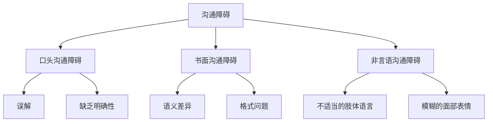

#### 核心算法原理讲解

我们可以用伪代码来描述一个简单的沟通障碍检测算法：

```pseudo
function DetectCommunicationBarriers(message):
    if message is oral:
        if message contains ambiguous words or lacks clarity:
            return "Communication Barrier Detected"
        else:
            return "No Barrier Detected"
    else if message is written:
        if message has semantic differences or incorrect format:
            return "Communication Barrier Detected"
        else:
            return "No Barrier Detected"
    else if message is non-verbal:
        if message includes inappropriate body language or unclear facial expressions:
            return "Communication Barrier Detected"
        else:
            return "No Barrier Detected"
    return "Unknown Message Type"
```

#### 数学模型和数学公式

为了量化沟通障碍的概率，我们可以使用概率模型：

$$ P(B) = P(M|B) \times P(B) + P(M|~B) \times P(~B) $$

其中，$P(B)$ 是沟通障碍发生的概率，$P(M|B)$ 是在存在沟通障碍时误解发生的概率，$P(M|~B)$ 是在没有沟通障碍时误解发生的概率，$P(~B)$ 是没有沟通障碍的概率。

例如，如果我们知道在一个团队中，有20%的时间存在沟通障碍，而有30%的时间在存在沟通障碍时会导致误解，那么：

$$ P(B) = 0.2 \times 0.3 + (1 - 0.2) \times 0.1 = 0.05 + 0.08 = 0.13 $$

这意味着团队在沟通时大约有13%的时间可能会出现沟通障碍导致的误解。

### 1.2 沟通障碍的影响

沟通障碍不仅会导致误解和错误，还会影响团队的士气和工作效率。理解这些影响，有助于我们更深入地认识到沟通障碍的危害。

#### 核心概念与联系

沟通障碍的影响可以归纳为以下几个方面：

- **误解和错误**：导致任务执行失败或延迟。
- **工作效率下降**：需要更多时间来澄清误解，影响整体进度。
- **团队士气受损**：成员可能会感到沮丧和无助，影响团队凝聚力。

这些影响之间的关系可以用Mermaid流程图来展示：

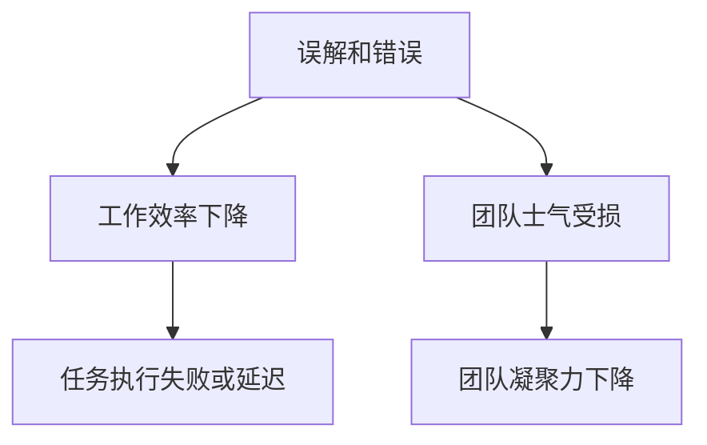

#### 核心算法原理讲解

为了量化沟通障碍对团队效率的影响，我们可以使用一个简单的效率模型：

```pseudo
function CalculateEfficiency(communication_barriers, total_time):
    if communication_barriers > 0:
        efficiency = (total_time - communication_barriers) / total_time
    else:
        efficiency = 1
    return efficiency
```

例如，如果一个团队在一个月内有10天存在沟通障碍，总共工作了20天，那么：

$$ \text{Efficiency} = \frac{20 - 10}{20} = 0.5 $$

这意味着团队在这段时间内的效率只有50%。

#### 数学模型和数学公式

我们可以使用线性回归模型来分析沟通障碍对工作效率的影响：

$$ \text{Efficiency} = \alpha + \beta \times \text{Communication Barriers} $$

其中，$\alpha$ 是没有沟通障碍时的基准效率，$\beta$ 是沟通障碍对效率的负面影响系数。

例如，如果基准效率是0.8，而沟通障碍会使效率下降0.1，那么：

$$ \text{Efficiency} = 0.8 - 0.1 \times \text{Communication Barriers} $$

这意味着，每增加一天沟通障碍，团队的效率就会下降10%。

### 1.3 团队沟通障碍的普遍性

沟通障碍在团队中是普遍存在的，无论是技术团队还是非技术团队，都可能面临这样的问题。

#### 核心概念与联系

沟通障碍的普遍性可以从以下几个方面来理解：

- **团队类型**：无论是开发团队、市场团队还是客户服务团队，沟通障碍都可能存在。
- **工作阶段**：从项目启动到交付，沟通障碍都可能影响团队的工作。

这些方面的关系可以用Mermaid流程图来展示：

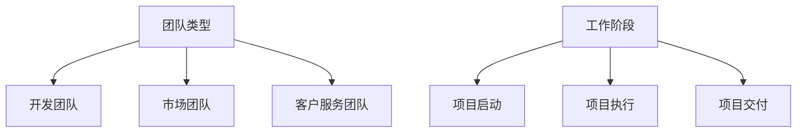

#### 核心算法原理讲解

为了量化团队沟通障碍的普遍性，我们可以使用一个简单的统计模型：

```pseudo
function CalculatePrevalence(communication_barriers, total_teams):
    prevalence = communication_barriers / total_teams
    return prevalence
```

例如，如果一个公司有10个团队，其中有8个团队在一个月内存在沟通障碍，那么：

$$ \text{Prevalence} = \frac{8}{10} = 0.8 $$

这意味着该公司有80%的团队在一个月内存在沟通障碍。

#### 数学模型和数学公式

我们可以使用二项分布模型来分析团队沟通障碍的普遍性：

$$ P(X=k) = \binom{n}{k} p^k (1-p)^{n-k} $$

其中，$X$ 是存在沟通障碍的团队数量，$n$ 是总团队数量，$p$ 是单个团队存在沟通障碍的概率。

例如，如果单个团队存在沟通障碍的概率是0.3，那么有4个团队存在沟通障碍的概率是：

$$ P(X=4) = \binom{10}{4} (0.3)^4 (0.7)^6 = 0.0243 $$

这意味着有约24.3%的概率会出现4个团队存在沟通障碍的情况。

### 结论

沟通障碍是团队协作中普遍存在的问题，但通过理解其类型、影响和普遍性，我们可以更好地识别和解决这些问题。在下一章中，我们将深入探讨沟通障碍的原因，为下一步的解决方法奠定基础。

----------------------------------------------------------------

# 团队沟通障碍：克服沟通中的常见问题

> 关键词：团队沟通、沟通障碍、沟通技巧、冲突解决、效率提升

> 摘要：本文旨在探讨团队沟通障碍的普遍性、原因、影响及解决方法。通过分析口头沟通、书面沟通和非言语沟通的障碍类型，结合数学模型和伪代码，提供了一套系统化的沟通障碍诊断和处理方法。文章还通过实际案例研究，展示了成功克服沟通障碍的策略，并提出了未来应对沟通障碍的长期解决方案。读者可通过本文了解团队沟通的关键问题，掌握有效的沟通技巧，提高团队协作效率。

----------------------------------------------------------------

## 第1章：沟通障碍的普遍性

沟通障碍在团队中是一种普遍现象，无论是在技术团队还是非技术团队中，都可能面临这样的问题。有效的沟通是团队协作成功的关键，而沟通障碍则可能阻碍信息的有效传递，导致误解和错误的产生。因此，理解沟通障碍的普遍性以及其类型和原因，对于团队管理者来说至关重要。

### 1.1 沟通障碍的定义与分类

沟通障碍指的是在信息传递过程中出现的各种障碍，这些障碍可能会影响信息的准确性、完整性和及时性。沟通障碍可以分为以下几类：

1. **口头沟通障碍**：这种障碍主要包括误解和缺乏明确性。口头沟通中的误解可能源于语言表达不清、方言差异或听者注意力不集中。而缺乏明确性则可能导致信息传递的不完整，使得接收者无法准确理解发送者的意图。

2. **书面沟通障碍**：书面沟通障碍主要体现在语义差异和格式问题。语义差异可能是因为词汇的多义性或文化背景的不同，而格式问题则可能是因为文档结构不清晰或排版不当。

3. **非言语沟通障碍**：非言语沟通障碍包括肢体语言、面部表情等非语言表达方式的不当使用。这些非语言信号可能在传递信息时产生混淆，特别是在跨文化交流中。

#### 核心概念与联系

沟通障碍的各种类型并不是孤立存在的，它们之间存在着相互关联。例如，口头沟通的误解可能导致书面沟通中的语义差异，而书面沟通中的不清晰表述则可能引发非言语沟通的误解。为了更直观地展示这些障碍之间的联系，我们可以使用Mermaid流程图来表示：

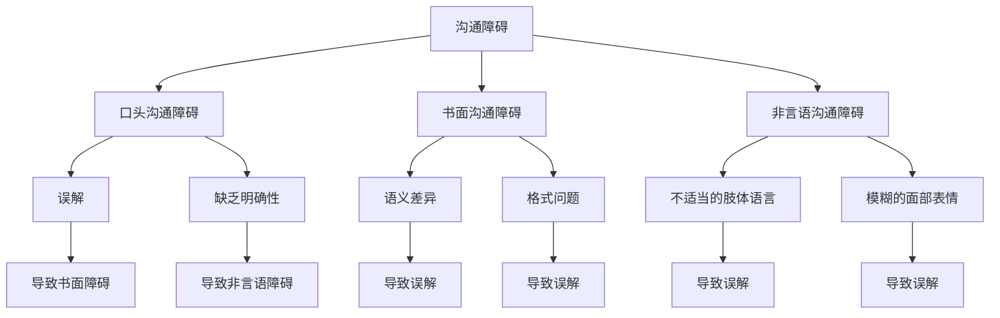

#### 核心算法原理讲解

为了更好地理解和处理沟通障碍，我们可以使用一个简单的沟通障碍检测算法。以下是一个用伪代码实现的算法：

```pseudo
function DetectCommunicationBarrier(messageType, content):
    if messageType == "oral":
        if content is Ambiguous or lacks Clarity:
            return "Barrier Detected: Oral"
        else:
            return "No Barrier Detected"
    elif messageType == "written":
        if content has Semantic Differences or formatting Issues:
            return "Barrier Detected: Written"
        else:
            return "No Barrier Detected"
    elif messageType == "non-verbal":
        if content includes Inappropriate Body Language or Unclear Facial Expressions:
            return "Barrier Detected: Non-Verbal"
        else:
            return "No Barrier Detected"
    else:
        return "Unknown Message Type"
```

#### 数学模型和数学公式

为了量化沟通障碍的概率，我们可以使用概率模型。例如，假设在一个团队中，口头沟通障碍发生的概率为0.2，书面沟通障碍发生的概率为0.15，非言语沟通障碍发生的概率为0.1。我们可以使用以下公式来计算总的沟通障碍概率：

$$ P(\text{Total Barrier}) = P(\text{Oral Barrier}) + P(\text{Written Barrier}) + P(\text{Non-Verbal Barrier}) $$

$$ P(\text{Total Barrier}) = 0.2 + 0.15 + 0.1 = 0.45 $$

这意味着在一个沟通过程中，有45%的概率会出现沟通障碍。

### 1.2 沟通障碍的影响

沟通障碍不仅会导致信息的误解和错误，还会对团队的工作效率和士气产生负面影响。

#### 核心概念与联系

沟通障碍对团队的影响可以从以下几个方面来考虑：

- **效率降低**：沟通障碍会导致团队在完成任务时需要额外的时间来澄清误解，这会直接降低工作效率。
- **错误增加**：由于沟通不畅，团队成员可能会执行错误的任务或产生错误的决策。
- **士气受损**：持续的沟通障碍会导致团队成员感到沮丧和无助，影响团队的整体士气。

这些影响之间的关系可以用Mermaid流程图来表示：

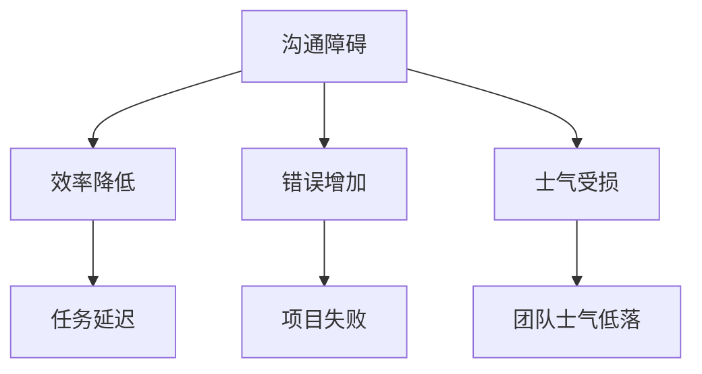

#### 核心算法原理讲解

为了量化沟通障碍对工作效率的影响，我们可以使用一个简单的效率模型。假设在没有沟通障碍的情况下，团队完成任务的平均时间是10天，而在沟通障碍的情况下，完成任务的平均时间是15天。我们可以用以下公式来计算沟通障碍对效率的影响：

$$ \text{Efficiency} = \frac{\text{No Barrier Time}}{\text{Barrier Time}} $$

$$ \text{Efficiency} = \frac{10}{15} = 0.67 $$

这意味着在有沟通障碍的情况下，团队的效率只有67%。

#### 数学模型和数学公式

我们可以使用线性回归模型来分析沟通障碍对工作效率的影响。假设效率（$E$）与沟通障碍次数（$B$）之间存在线性关系，可以表示为：

$$ E = \alpha - \beta \times B $$

其中，$\alpha$ 是没有沟通障碍时的基准效率，$\beta$ 是沟通障碍对效率的负面影响系数。例如，如果基准效率是0.8，而每次沟通障碍会降低效率0.1，那么模型可以表示为：

$$ E = 0.8 - 0.1 \times B $$

### 1.3 团队沟通障碍的普遍性

沟通障碍在团队中是普遍存在的，无论是技术团队还是非技术团队，都可能面临这样的问题。了解沟通障碍的普遍性有助于团队管理者更好地识别和解决这些问题。

#### 核心概念与联系

沟通障碍的普遍性可以从以下几个方面来理解：

- **团队类型**：无论是软件开发团队、市场营销团队还是客户服务团队，沟通障碍都可能存在。
- **工作阶段**：从项目启动到交付，沟通障碍都可能影响团队的工作。

这些方面的关系可以用Mermaid流程图来表示：

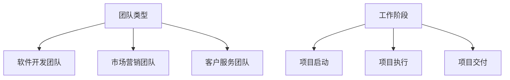

#### 核心算法原理讲解

为了量化团队沟通障碍的普遍性，我们可以使用一个简单的统计模型。假设在一个公司中，有10个团队，其中有8个团队在一个月内存在沟通障碍。我们可以用以下公式来计算沟通障碍的普遍性：

$$ \text{Prevalence} = \frac{\text{存在沟通障碍的团队数}}{\text{总团队数}} $$

$$ \text{Prevalence} = \frac{8}{10} = 0.8 $$

这意味着有80%的团队在一个月内存在沟通障碍。

#### 数学模型和数学公式

我们可以使用二项分布模型来分析团队沟通障碍的普遍性。假设每个团队存在沟通障碍的概率是0.3，那么存在沟通障碍的团队数量可以用二项分布来表示：

$$ P(X=k) = \binom{n}{k} p^k (1-p)^{n-k} $$

例如，如果公司有10个团队，每个团队存在沟通障碍的概率是0.3，那么有4个团队存在沟通障碍的概率是：

$$ P(X=4) = \binom{10}{4} (0.3)^4 (0.7)^6 = 0.0243 $$

这意味着有约2.43%的概率会出现4个团队存在沟通障碍的情况。

### 结论

沟通障碍是团队协作中普遍存在的问题，但通过理解其类型、影响和普遍性，我们可以更好地识别和解决这些问题。在下一章中，我们将深入探讨沟通障碍的原因，为下一步的解决方法奠定基础。

----------------------------------------------------------------

## 第二部分：沟通障碍的原因分析

沟通障碍的产生并非偶然，其背后往往有着复杂的原因。为了更有效地解决这些问题，我们需要深入分析沟通障碍的根本原因。这一部分将探讨文化差异、心理因素和结构性障碍这三个主要因素。

### 第2章：沟通障碍的原因分析

#### 2.1 文化差异

文化差异是导致沟通障碍的一个关键因素。不同文化背景的人可能在语言、价值观、行为规范和沟通方式上存在显著差异，这些差异可能会在团队沟通中引发误解和冲突。

#### 核心概念与联系

文化差异可以从以下几个方面来分析：

- **语言障碍**：不同语言之间的词汇、语法和发音差异可能导致沟通障碍。
- **价值观差异**：不同的文化价值观可能导致对同一问题的看法和处理方式不同。
- **行为规范差异**：不同的文化背景可能对行为规范有不同的理解，这可能导致沟通中的不当行为。

为了更直观地展示文化差异对沟通障碍的影响，我们可以使用Mermaid流程图：

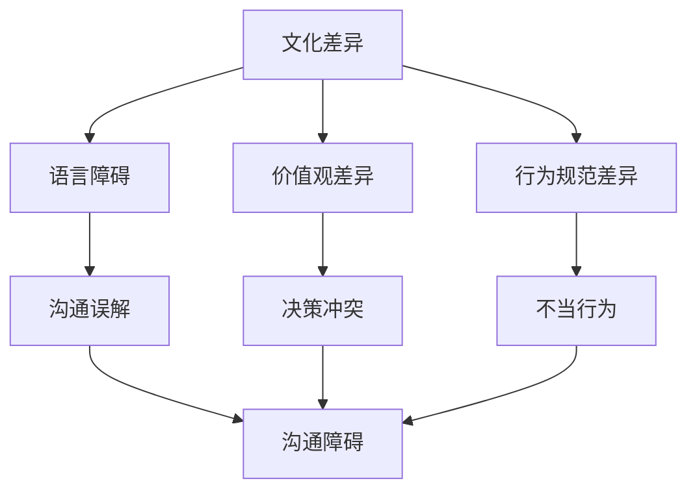

#### 核心算法原理讲解

为了量化文化差异对沟通障碍的影响，我们可以使用一个简单的文化差异评估算法。以下是一个用伪代码实现的算法：

```pseudo
function EvaluateCulturalDifferences(teamMembers):
    languageDifferences = 0
    valueDifference = 0
    behaviorDifferences = 0
    
    for member in teamMembers:
        if member has a different native language:
            languageDifferences += 1
        if member has different values:
            valueDifference += 1
        if member has different behavior norms:
            behaviorDifferences += 1
    
    culturalScore = languageDifferences + valueDifference + behaviorDifferences
    return culturalScore
```

#### 数学模型和数学公式

我们可以使用多元线性回归模型来分析文化差异对沟通障碍的影响。假设文化差异得分（$C$）与沟通障碍得分（$B$）之间存在线性关系，可以表示为：

$$ B = \alpha + \beta_1 \times C_1 + \beta_2 \times C_2 + \beta_3 \times C_3 $$

其中，$C_1$、$C_2$ 和 $C_3$ 分别代表语言差异、价值观差异和行为规范差异，$\beta_1$、$\beta_2$ 和 $\beta_3$ 是对应的权重系数。例如，如果文化差异得分增加1，沟通障碍得分会增加0.5，那么模型可以表示为：

$$ B = \alpha + 0.5 \times C_1 + 0.3 \times C_2 + 0.2 \times C_3 $$

### 2.2 心理因素

心理因素也是导致沟通障碍的一个重要原因。团队成员的心理状态、个性和情绪可能会影响他们如何表达和理解信息，从而产生沟通障碍。

#### 核心概念与联系

心理因素可以从以下几个方面来分析：

- **情绪管理**：情绪波动可能会影响沟通的清晰度和有效性。
- **认知偏见**：认知偏见可能导致团队成员对信息的错误解读。
- **自信心**：自信心不足可能会导致沟通时的犹豫和不安。

为了更直观地展示心理因素对沟通障碍的影响，我们可以使用Mermaid流程图：

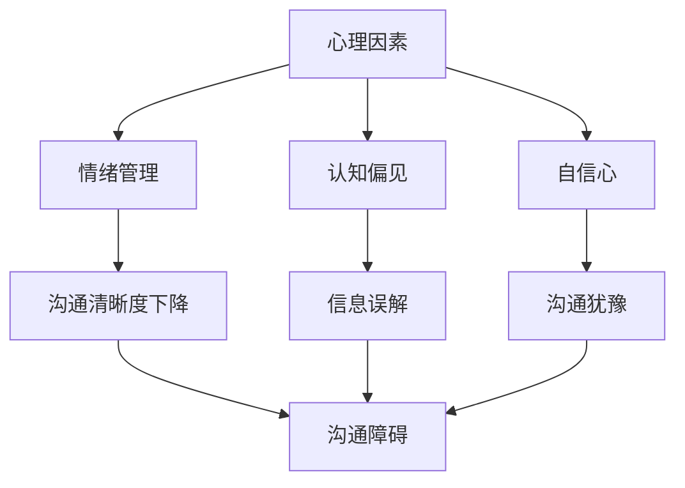

#### 核心算法原理讲解

为了量化心理因素对沟通障碍的影响，我们可以使用一个简单的心理因素评估算法。以下是一个用伪代码实现的算法：

```pseudo
function EvaluatePsychologicalFactors(teamMembers):
    emotionalManagement = 0
    cognitiveBias = 0
    confidence = 0
    
    for member in teamMembers:
        if member has high emotional management skills:
            emotionalManagement += 1
        if member has low cognitive bias:
            cognitiveBias += 1
        if member has high confidence:
            confidence += 1
    
    psychologicalScore = emotionalManagement + cognitiveBias + confidence
    return psychologicalScore
```

#### 数学模型和数学公式

我们可以使用多元线性回归模型来分析心理因素对沟通障碍的影响。假设心理因素得分（$P$）与沟通障碍得分（$B$）之间存在线性关系，可以表示为：

$$ B = \alpha + \beta_1 \times P_1 + \beta_2 \times P_2 + \beta_3 \times P_3 $$

其中，$P_1$、$P_2$ 和 $P_3$ 分别代表情绪管理、认知偏见和自信心，$\beta_1$、$\beta_2$ 和 $\beta_3$ 是对应的权重系数。例如，如果心理因素得分增加1，沟通障碍得分会增加0.4，那么模型可以表示为：

$$ B = \alpha + 0.4 \times P_1 + 0.3 \times P_2 + 0.2 \times P_3 $$

### 2.3 结构性障碍

结构性障碍指的是组织结构和文化等方面的因素，它们可能对团队沟通产生负面影响。这些障碍包括组织层级、资源分配和决策过程等。

#### 核心概念与联系

结构性障碍可以从以下几个方面来分析：

- **组织层级**：过多的组织层级可能会导致信息传递的延迟和失真。
- **资源分配**：资源不足或不公平的分配可能会影响团队的工作效率。
- **决策过程**：复杂的决策过程可能会导致沟通中的冲突和延迟。

为了更直观地展示结构性障碍对沟通障碍的影响，我们可以使用Mermaid流程图：

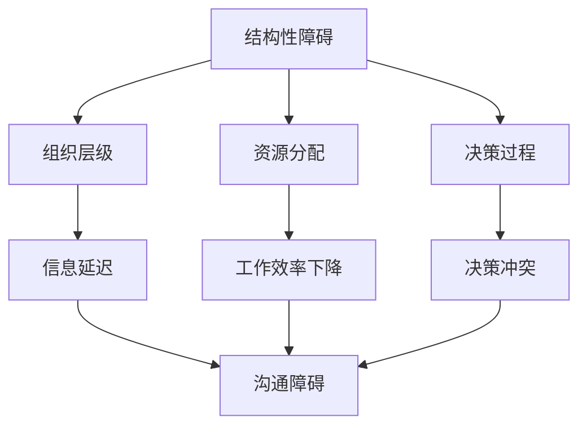

#### 核心算法原理讲解

为了量化结构性障碍对沟通障碍的影响，我们可以使用一个简单的结构性障碍评估算法。以下是一个用伪代码实现的算法：

```pseudo
function EvaluateStructuralBarriers(organizationStructure, resourceAllocation, decisionProcess):
    hierarchicalLevel = 0
    resourceEquity = 0
    decisionComplexity = 0
    
    if organization has many hierarchical levels:
        hierarchicalLevel += 1
    if resources are allocated unfairly:
        resourceEquity += 1
    if decision process is complex:
        decisionComplexity += 1
    
    structuralScore = hierarchicalLevel + resourceEquity + decisionComplexity
    return structuralScore
```

#### 数学模型和数学公式

我们可以使用多元线性回归模型来分析结构性障碍对沟通障碍的影响。假设结构性障碍得分（$S$）与沟通障碍得分（$B$）之间存在线性关系，可以表示为：

$$ B = \alpha + \beta_1 \times S_1 + \beta_2 \times S_2 + \beta_3 \times S_3 $$

其中，$S_1$、$S_2$ 和 $S_3$ 分别代表组织层级、资源分配和决策过程，$\beta_1$、$\beta_2$ 和 $\beta_3$ 是对应的权重系数。例如，如果结构性障碍得分增加1，沟通障碍得分会增加0.3，那么模型可以表示为：

$$ B = \alpha + 0.3 \times S_1 + 0.2 \times S_2 + 0.1 \times S_3 $$

### 结论

通过分析文化差异、心理因素和结构性障碍这三个主要因素，我们可以更深入地理解沟通障碍的产生原因。了解这些原因有助于团队管理者采取更有效的措施来预防和解决沟通障碍，从而提高团队的协作效率和整体绩效。

----------------------------------------------------------------

## 第3章：克服沟通障碍的技巧

在了解了沟通障碍的原因之后，我们需要探讨一些具体的技巧和方法来克服这些障碍。有效的沟通技巧不仅能提高信息的准确性和传递效率，还能增强团队的凝聚力和合作精神。以下是几种关键的沟通技巧：

### 3.1 提高自我意识

自我意识是有效沟通的基础。它要求团队成员意识到自己在沟通中的行为、语言和情感表达，以及这些因素如何影响他人。提高自我意识可以通过以下方法实现：

#### 核心概念与联系

提高自我意识可以从以下几个方面来考虑：

- **情感自我觉知**：了解自己的情绪状态，并认识到情绪如何影响沟通。
- **社交自我觉知**：认识到自己的社交行为和如何与他人互动。
- **自我反思**：定期进行自我反思，以识别和改进沟通方式。

这些方面的关系可以用Mermaid流程图来表示：

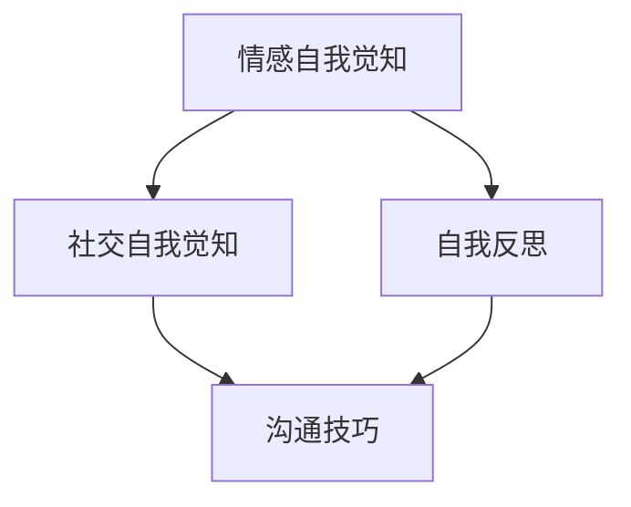

#### 核心算法原理讲解

为了提高自我意识，我们可以使用一个简单的自我觉知评估工具。以下是一个用伪代码实现的算法：

```pseudo
function SelfAwarenessAssessment():
    emotionalAwarenessScore = 0
    socialAwarenessScore = 0
    reflectionScore = 0
    
    if user can recognize emotions during communication:
        emotionalAwarenessScore += 1
    if user can recognize social behaviors:
        socialAwarenessScore += 1
    if user regularly reflects on communication:
        reflectionScore += 1
    
    totalScore = emotionalAwarenessScore + socialAwarenessScore + reflectionScore
    return totalScore
```

#### 数学模型和数学公式

我们可以使用线性回归模型来分析自我觉知对沟通技巧的影响。假设自我觉知得分（$SA$）与沟通技巧得分（$CT$）之间存在线性关系，可以表示为：

$$ CT = \alpha + \beta \times SA $$

其中，$\alpha$ 是没有自我觉知时的基准沟通技巧得分，$\beta$ 是自我觉知对沟通技巧的提升系数。例如，如果自我觉知得分增加1，沟通技巧得分会增加0.3，那么模型可以表示为：

$$ CT = \alpha + 0.3 \times SA $$

### 3.2 倾听技巧

倾听是沟通的重要组成部分，但往往被忽视。有效的倾听不仅能帮助团队成员更好地理解对方，还能建立信任和尊重。以下是一些提高倾听技巧的方法：

#### 核心概念与联系

倾听技巧可以从以下几个方面来考虑：

- **专注**：专注于对方的讲话，避免分心。
- **反馈**：通过提问和复述对方的内容来确认理解。
- **非言语信号**：通过肢体语言和面部表情表明自己在倾听。

这些方面的关系可以用Mermaid流程图来表示：

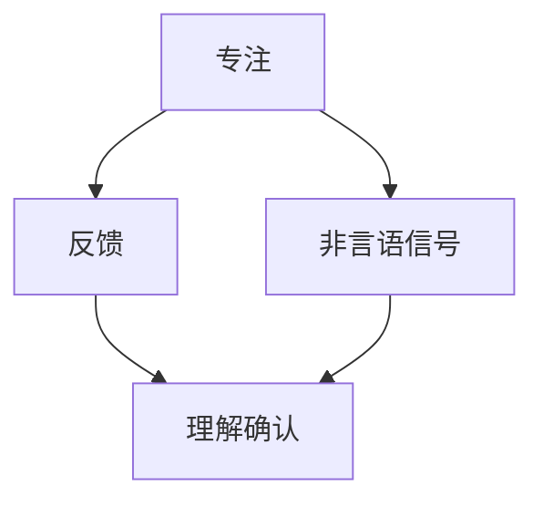

#### 核心算法原理讲解

为了提高倾听技巧，我们可以使用一个简单的倾听评估工具。以下是一个用伪代码实现的算法：

```pseudo
function ListeningAssessment(focusedTime, feedbackGiven, nonVerbalIndicators):
    focusedScore = 0
    feedbackScore = 0
    nonVerbalScore = 0
    
    if user maintains focus during conversation:
        focusedScore += 1
    if user provides feedback:
        feedbackScore += 1
    if user uses appropriate non-verbal cues:
        nonVerbalScore += 1
    
    totalScore = focusedScore + feedbackScore + nonVerbalScore
    return totalScore
```

#### 数学模型和数学公式

我们可以使用线性回归模型来分析倾听技巧对沟通效果的影响。假设倾听得分（$L$）与沟通效果得分（$CE$）之间存在线性关系，可以表示为：

$$ CE = \alpha + \beta \times L $$

其中，$\alpha$ 是没有倾听技巧时的基准沟通效果得分，$\beta$ 是倾听技巧对沟通效果的提升系数。例如，如果倾听得分增加1，沟通效果得分会增加0.4，那么模型可以表示为：

$$ CE = \alpha + 0.4 \times L $$

### 3.3 非言语沟通

非言语沟通在信息传递中扮演着重要角色，尤其是在语言障碍和复杂情境中。提高非言语沟通技巧可以帮助团队成员更好地理解对方，减少误解和冲突。

#### 核心概念与联系

非言语沟通可以从以下几个方面来考虑：

- **肢体语言**：通过肢体动作传达信息和意图。
- **面部表情**：通过面部表情表达情感和态度。
- **语音语调**：通过声音的音调、节奏和强度传达信息。

这些方面的关系可以用Mermaid流程图来表示：

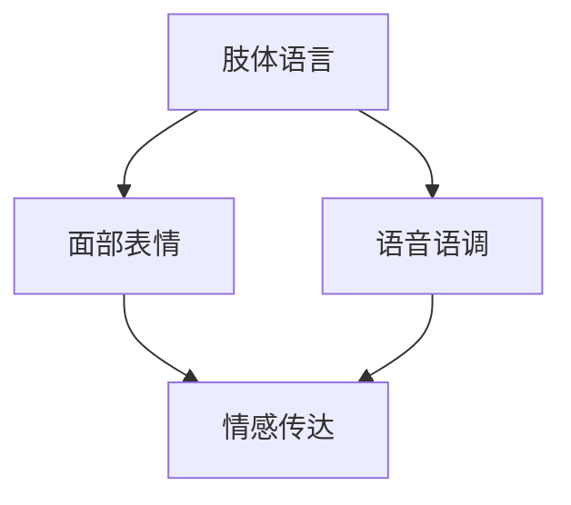

#### 核心算法原理讲解

为了提高非言语沟通技巧，我们可以使用一个简单的非言语沟通评估工具。以下是一个用伪代码实现的算法：

```pseudo
function NonVerbalCommunicationAssessment(physicalIndicators, facialExpressions, vocalCues):
    physicalScore = 0
    facialScore = 0
    vocalScore = 0
    
    if user uses appropriate physical indicators:
        physicalScore += 1
    if user has clear facial expressions:
        facialScore += 1
    if user uses appropriate vocal cues:
        vocalScore += 1
    
    totalScore = physicalScore + facialScore + vocalScore
    return totalScore
```

#### 数学模型和数学公式

我们可以使用线性回归模型来分析非言语沟通技巧对沟通效果的影响。假设非言语沟通得分（$NV$）与沟通效果得分（$CE$）之间存在线性关系，可以表示为：

$$ CE = \alpha + \beta \times NV $$

其中，$\alpha$ 是没有非言语沟通技巧时的基准沟通效果得分，$\beta$ 是非言语沟通技巧对沟通效果的提升系数。例如，如果非言语沟通得分增加1，沟通效果得分会增加0.5，那么模型可以表示为：

$$ CE = \alpha + 0.5 \times NV $$

### 结论

通过提高自我意识、倾听技巧和非言语沟通技巧，团队成员可以有效克服沟通障碍，提高团队协作效率。在下一章中，我们将探讨如何通过冲突解决和提高团队沟通效率来进一步优化团队沟通。

----------------------------------------------------------------

## 第4章：冲突解决与沟通

团队协作过程中，冲突是不可避免的。有效的沟通是解决冲突的关键。通过理解冲突的类型和解决策略，我们可以更好地应对各种冲突，促进团队和谐与合作。

### 4.1 冲突的类型

冲突可以分为以下几种类型：

- **目标冲突**：由于团队成员对项目目标的理解不一致导致的冲突。
- **角色冲突**：团队成员在角色职责上的分工不清或角色重叠导致的冲突。
- **意见冲突**：团队成员在某个问题或决策上的观点不一致导致的冲突。
- **资源冲突**：由于资源分配不公或资源有限导致的冲突。

#### 核心概念与联系

这些冲突类型之间的关系可以用Mermaid流程图来表示：

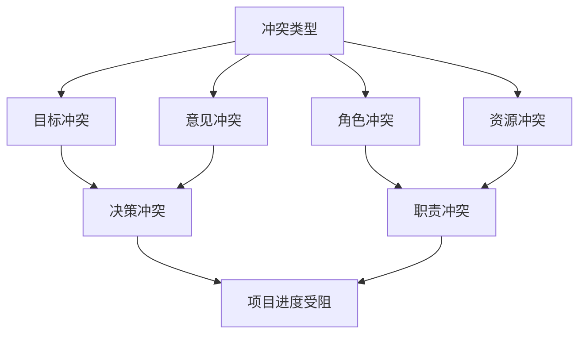

#### 核心算法原理讲解

为了更有效地处理冲突类型，我们可以使用一个冲突分类算法。以下是一个用伪代码实现的算法：

```pseudo
function ClassifyConflict(conflictDescription):
    if conflictDescription contains "目标不一致":
        return "目标冲突"
    else if conflictDescription contains "角色不清":
        return "角色冲突"
    else if conflictDescription contains "观点不一致":
        return "意见冲突"
    else if conflictDescription contains "资源分配":
        return "资源冲突"
    else:
        return "未知冲突"
```

#### 数学模型和数学公式

我们可以使用决策树模型来分析冲突类型。例如，以下是一个简化的决策树：

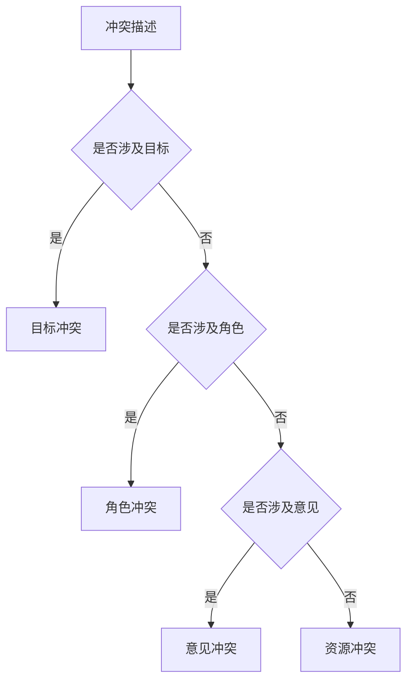

### 4.2 冲突的处理策略

处理冲突的策略可以分为以下几个步骤：

1. **识别冲突**：通过有效的沟通和团队反馈机制，及早识别和确认冲突。
2. **分析冲突**：了解冲突的具体类型和原因，以便采取适当的解决策略。
3. **解决冲突**：根据冲突的类型和原因，采取合适的解决方案。
4. **预防冲突**：通过改进沟通流程和团队文化建设，预防冲突的发生。

#### 核心概念与联系

冲突处理策略的各个步骤之间的关系可以用Mermaid流程图来表示：

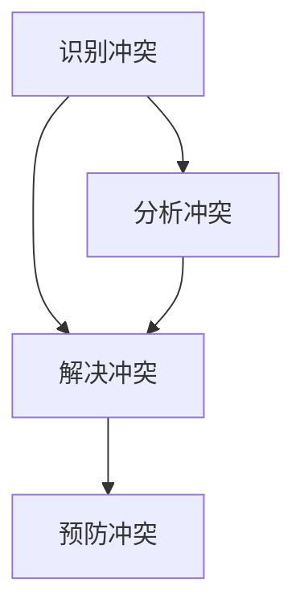

#### 核心算法原理讲解

为了更有效地处理冲突，我们可以使用一个冲突处理算法。以下是一个用伪代码实现的算法：

```pseudo
function ResolveConflict(conflictType):
    if conflictType == "目标冲突":
        return "协调目标"
    else if conflictType == "角色冲突":
        return "明确角色"
    else if conflictType == "意见冲突":
        return "协商决策"
    else if conflictType == "资源冲突":
        return "公平分配资源"
    else:
        return "未知冲突，需要进一步分析"
```

#### 数学模型和数学公式

我们可以使用贝叶斯网络模型来分析冲突处理策略的有效性。例如，以下是一个简化的贝叶斯网络：

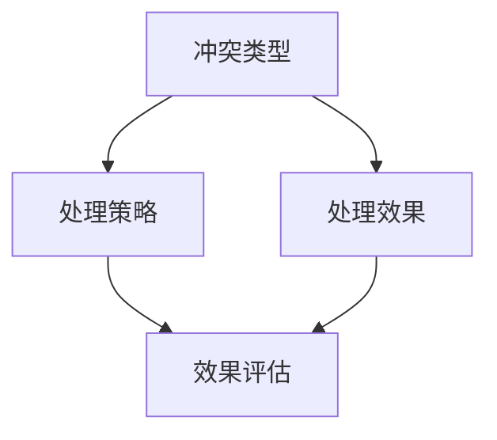

### 4.3 通过沟通解决冲突

有效的沟通是解决冲突的核心。以下是一些通过沟通解决冲突的方法：

- **开放对话**：鼓励团队成员开放地表达观点和感受，避免指责和防御。
- **倾听**：倾听对方的观点，确保理解对方的立场和需求。
- **寻求共识**：通过协商和妥协，寻求双方的共识和解决方案。
- **建立信任**：通过持续的沟通和合作，建立团队成员之间的信任。

#### 核心概念与联系

通过沟通解决冲突的方法之间的关系可以用Mermaid流程图来表示：

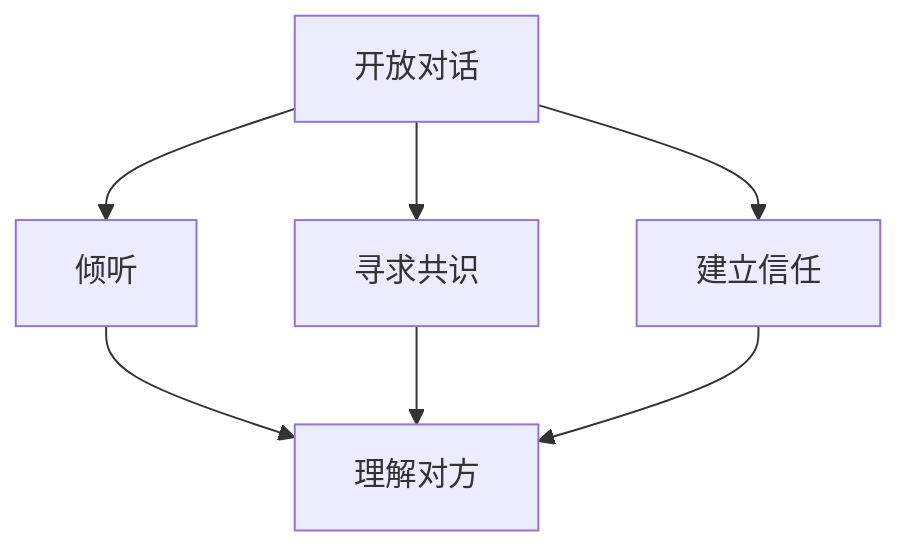

#### 核心算法原理讲解

为了提高通过沟通解决冲突的有效性，我们可以使用一个沟通效果评估算法。以下是一个用伪代码实现的算法：

```pseudo
function EvaluateCommunicationEffectiveness(openDialogue, activeListening, consensusSeeking, trustBuilding):
    effectivenessScore = 0
    
    if openDialogue is effective:
        effectivenessScore += 1
    if activeListening is effective:
        effectivenessScore += 1
    if consensusSeeking is effective:
        effectivenessScore += 1
    if trustBuilding is effective:
        effectivenessScore += 1
    
    return effectivenessScore
```

#### 数学模型和数学公式

我们可以使用综合评分模型来评估沟通效果。例如，以下是一个简单的评分公式：

$$ \text{Communication Score} = \frac{\text{Open Dialogue Score} + \text{Active Listening Score} + \text{Consensus Seeking Score} + \text{Trust Building Score}}{4} $$

### 结论

通过理解冲突的类型和处理策略，以及通过沟通解决冲突的方法，团队可以更有效地应对冲突，提高协作效率和团队凝聚力。在下一章中，我们将探讨如何提高团队沟通效率，进一步优化团队工作流程。

----------------------------------------------------------------

## 第5章：提高团队沟通效率

在团队协作中，沟通效率直接影响项目的进度和质量。通过以下方法，我们可以有效地提高团队沟通效率：

### 5.1 团队沟通计划

制定有效的沟通计划是提高团队沟通效率的关键。以下是一些建议：

#### 核心概念与联系

团队沟通计划可以从以下几个方面来考虑：

- **明确沟通目标**：确保每个沟通活动的目标清晰，避免无效沟通。
- **沟通频率**：根据项目需求，确定合适的沟通频率。
- **沟通渠道**：选择适当的沟通渠道，如会议、即时通讯、邮件等。
- **参与人员**：确定哪些团队成员需要参与沟通。

这些方面的关系可以用Mermaid流程图来表示：

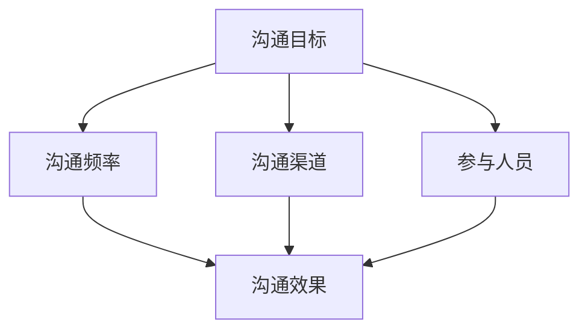

#### 核心算法原理讲解

为了制定有效的沟通计划，我们可以使用一个沟通计划评估算法。以下是一个用伪代码实现的算法：

```pseudo
function EvaluateCommunicationPlan(communicationGoals, frequency, channels, participants):
    goalAchievement = 0
    effectivenessScore = 0
    
    if communication goals are clear:
        goalAchievement += 1
    if communication frequency is appropriate:
        goalAchievement += 1
    if chosen communication channels are effective:
        goalAchievement += 1
    if all necessary participants are involved:
        goalAchievement += 1
    
    totalScore = goalAchievement + effectivenessScore
    return totalScore
```

#### 数学模型和数学公式

我们可以使用加权评分模型来评估沟通计划的有效性。例如，以下是一个简单的评分公式：

$$ \text{Communication Plan Score} = \frac{\text{Goal Achievement Score} \times 0.5 + \text{Effectiveness Score} \times 0.5}{2} $$

### 5.2 会议沟通技巧

会议是团队沟通的重要形式，但往往效率低下。以下是一些提高会议沟通效率的技巧：

#### 核心概念与联系

会议沟通技巧可以从以下几个方面来考虑：

- **准备充分**：确保会议议程明确，参与者提前了解议题。
- **保持专注**：会议期间保持专注，避免分心。
- **有效发言**：清晰、简洁地表达观点，避免冗长和无关的讨论。
- **积极倾听**：倾听他人发言，避免打断和批评。

这些方面的关系可以用Mermaid流程图来表示：

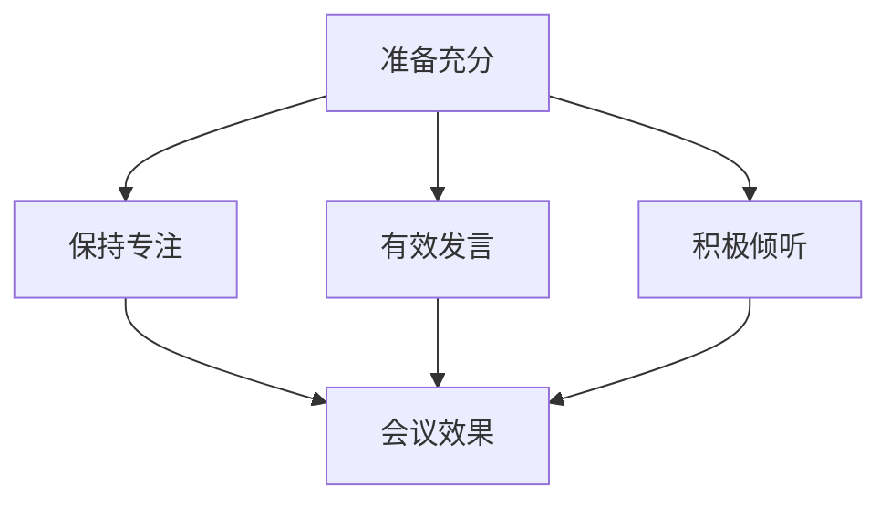

#### 核心算法原理讲解

为了提高会议沟通效率，我们可以使用一个会议效果评估算法。以下是一个用伪代码实现的算法：

```pseudo
function EvaluateMeetingEffectiveness(preparation, focus, effectiveSpeaking, activeListening):
    effectivenessScore = 0
    
    if preparation is thorough:
        effectivenessScore += 1
    if focus is maintained:
        effectivenessScore += 1
    if speaking is clear and concise:
        effectivenessScore += 1
    if listening is active:
        effectivenessScore += 1
    
    return effectivenessScore
```

#### 数学模型和数学公式

我们可以使用加权评分模型来评估会议效果。例如，以下是一个简单的评分公式：

$$ \text{Meeting Effectiveness Score} = \frac{\text{Preparation Score} \times 0.25 + \text{Focus Score} \times 0.25 + \text{Speaking Score} \times 0.25 + \text{Listening Score} \times 0.25}{4} $$

### 5.3 沟通反馈机制

建立有效的沟通反馈机制是确保信息准确传递和团队协作顺畅的重要手段。以下是一些建议：

#### 核心概念与联系

沟通反馈机制可以从以下几个方面来考虑：

- **实时反馈**：在沟通过程中及时给予反馈，帮助对方理解意图。
- **定期反馈**：定期回顾沟通效果，识别改进点。
- **匿名反馈**：提供匿名反馈渠道，鼓励团队成员提出意见和建议。
- **反馈评估**：对反馈进行评估，确保改进措施的实施。

这些方面的关系可以用Mermaid流程图来表示：

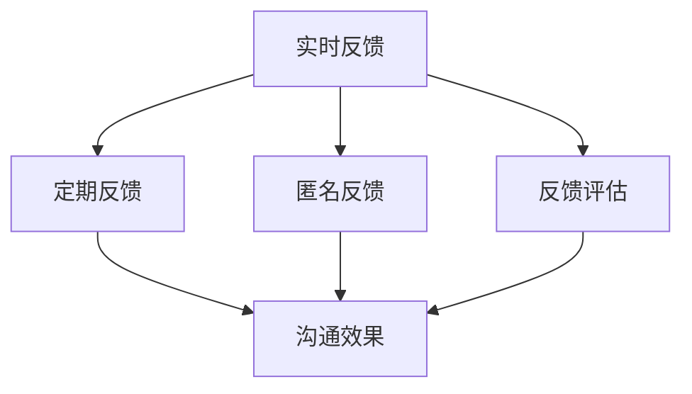

#### 核心算法原理讲解

为了建立有效的沟通反馈机制，我们可以使用一个反馈评估算法。以下是一个用伪代码实现的算法：

```pseudo
function EvaluateFeedback Mechanism(realTimeFeedback, periodicFeedback, anonymousFeedback, feedbackAssessment):
    feedbackEffectiveness = 0
    
    if real-time feedback is provided:
        feedbackEffectiveness += 1
    if periodic feedback is conducted:
        feedbackEffectiveness += 1
    if anonymous feedback is available:
        feedbackEffectiveness += 1
    if feedback assessment is conducted:
        feedbackEffectiveness += 1
    
    return feedbackEffectiveness
```

#### 数学模型和数学公式

我们可以使用加权评分模型来评估沟通反馈机制的有效性。例如，以下是一个简单的评分公式：

$$ \text{Feedback Mechanism Score} = \frac{\text{Real-Time Feedback Score} \times 0.3 + \text{Periodic Feedback Score} \times 0.3 + \text{Anonymous Feedback Score} \times 0.2 + \text{Feedback Assessment Score} \times 0.2}{1} $$

### 结论

通过制定沟通计划、提高会议沟通技巧和建立沟通反馈机制，团队可以显著提高沟通效率，促进协作和项目进展。在下一章中，我们将通过案例研究来分析成功克服沟通障碍的实际策略。

----------------------------------------------------------------

## 第6章：成功克服沟通障碍的案例

在本章中，我们将通过实际案例研究，探讨如何在不同的团队环境中成功克服沟通障碍。这些案例将展示具体的策略和方法，以及团队成员如何通过共同努力克服障碍，提升团队协作效率。

### 6.1 案例一：改进团队沟通

#### 背景介绍

某技术团队在项目开发过程中遭遇了严重的沟通障碍，导致项目进度滞后、错误频发。团队成员来自不同的文化背景，语言障碍和价值观差异成为主要问题。

#### 案例解析

为了克服这些障碍，团队采取了以下措施：

1. **建立沟通计划**：团队制定了详细的沟通计划，明确了沟通目标、频率和渠道。每个成员都知道何时、通过何种方式与同事沟通。

2. **跨文化培训**：团队组织了跨文化沟通培训，帮助成员了解不同文化背景下的沟通方式，减少误解和冲突。

3. **倾听技巧提升**：团队成员参加了倾听技巧培训，学会了如何更好地理解他人，并通过提问和复述来确认理解。

4. **非言语沟通训练**：团队还进行了非言语沟通训练，提高了成员使用肢体语言和面部表情的技巧，以增强沟通效果。

#### 案例总结

通过这些措施，团队沟通效率显著提高，项目进度恢复正常，错误率大幅降低。团队成员之间的信任和合作精神也得到了增强。

### 6.2 案例二：跨文化沟通挑战与解决

#### 背景介绍

一家国际公司有一个多国籍团队，由于文化差异，团队成员在沟通中经常出现误解和冲突。

#### 案例解析

为了解决这些问题，团队采取了以下策略：

1. **文化差异评估**：团队进行了文化差异评估，识别出主要的文化差异点，并制定了相应的沟通策略。

2. **定期沟通会议**：团队定期召开沟通会议，确保所有成员都有机会表达观点，并在会议中解决潜在的冲突。

3. **翻译支持**：为了解决语言障碍，团队提供了专业的翻译支持，确保所有成员都能理解会议内容和决策。

4. **文化敏感性培训**：团队成员参加了文化敏感性培训，学习了如何尊重和理解不同文化背景下的行为和沟通方式。

#### 案例总结

通过这些措施，团队克服了文化差异带来的沟通障碍，提高了协作效率，项目成功交付，团队凝聚力也显著增强。

### 6.3 案例三：通过沟通提升团队凝聚力

#### 背景介绍

某初创公司的团队在快速发展过程中，团队成员之间缺乏有效的沟通，导致团队凝聚力下降，士气低落。

#### 案例解析

为了提升团队凝聚力，公司采取了以下措施：

1. **开放对话**：公司鼓励员工开放地表达自己的想法和感受，建立了开放对话的文化。

2. **团队建设活动**：公司定期组织团队建设活动，如团建旅行和团队拓展训练，增强团队成员之间的联系。

3. **透明沟通**：公司通过内部通讯工具，确保信息的透明传递，让所有成员都能了解公司的战略和进展。

4. **反馈机制**：公司建立了有效的反馈机制，让员工可以匿名提出意见和建议，确保员工的意见得到重视。

#### 案例总结

通过这些措施，公司的团队凝聚力显著提升，员工士气高涨，公司的整体绩效也得到显著改善。

### 结论

这些案例展示了通过有效的沟通策略和团队努力，可以克服沟通障碍，提升团队协作效率。在下一章中，我们将探讨未来沟通障碍的应对策略，为团队管理者提供长期的解决方案。

----------------------------------------------------------------

## 第7章：未来沟通障碍的应对策略

随着科技的进步和工作环境的变化，团队沟通障碍的形式也在不断演变。为了确保团队在未来的沟通中能够保持高效和顺畅，我们需要采取一些前瞻性的策略和措施。

### 7.1 科技对沟通障碍的影响

科技的发展极大地改变了团队的沟通方式，同时也带来了新的沟通障碍。以下是一些主要影响：

#### 核心概念与联系

科技的影响可以从以下几个方面来考虑：

- **信息过载**：随着信息量的增加，团队成员可能会感到难以处理和筛选重要信息。
- **沟通工具复杂度**：多种沟通工具的使用可能会增加沟通的复杂性和混乱度。
- **技术依赖**：过度依赖技术工具可能导致沟通中的技术问题，如网络故障或工具故障。

这些方面之间的关系可以用Mermaid流程图来表示：

```mermaid
graph TD
A[信息过载] --> B[沟通工具复杂度]
A --> C[技术依赖]
B --> D[沟通效率下降]
C --> D
```

#### 核心算法原理讲解

为了应对科技带来的沟通障碍，我们可以使用一个沟通优化算法。以下是一个用伪代码实现的算法：

```pseudo
function OptimizeCommunication(communicationTools, informationFlow, technicalDependence):
    efficiencyScore = 0
    
    if communication tools are selected based on team needs:
        efficiencyScore += 1
    if information flow is managed effectively:
        efficiencyScore += 1
    if technical dependence is minimized:
        efficiencyScore += 1
    
    totalScore = efficiencyScore
    return totalScore
```

#### 数学模型和数学公式

我们可以使用综合评分模型来评估沟通优化效果。例如，以下是一个简单的评分公式：

$$ \text{Communication Optimization Score} = \frac{\text{Tool Selection Score} \times 0.4 + \text{Information Management Score} \times 0.4 + \text{Technical Dependence Score} \times 0.2}{1} $$

### 7.2 沟通障碍的长期解决方案

为了长期有效地应对沟通障碍，团队需要采取一系列系统性措施，这些措施应该涵盖组织结构、文化建设和技能提升等方面。

#### 核心概念与联系

沟通障碍的长期解决方案可以从以下几个方面来考虑：

- **组织结构优化**：通过调整组织结构，减少信息传递的层级，提高沟通效率。
- **文化建设**：建立开放、包容和尊重的团队文化，促进有效沟通。
- **技能培训**：提供持续的沟通技能培训，提升团队成员的沟通能力。

这些方面的关系可以用Mermaid流程图来表示：

```mermaid
graph TD
A[组织结构优化] --> B[文化建设]
A --> C[技能培训]
B --> D[沟通效率提升]
C --> D
```

#### 核心算法原理讲解

为了实现长期解决方案，我们可以使用一个综合改进算法。以下是一个用伪代码实现的算法：

```pseudo
function LongTermCommunicationSolution(structuralOptimization, culturalDevelopment, skillTraining):
    improvementScore = 0
    
    if organizational structure is optimized:
        improvementScore += 1
    if team culture is developed:
        improvementScore += 1
    if team members receive continuous training:
        improvementScore += 1
    
    totalScore = improvementScore
    return totalScore
```

#### 数学模型和数学公式

我们可以使用综合评分模型来评估长期解决方案的效果。例如，以下是一个简单的评分公式：

$$ \text{Long-Term Solution Score} = \frac{\text{Structural Optimization Score} \times 0.3 + \text{Cultural Development Score} \times 0.3 + \text{Skill Training Score} \times 0.4}{1} $$

### 7.3 持续改进团队沟通

为了确保团队沟通的持续改进，我们需要建立一套系统化的反馈和评估机制，以及持续的学习和适应策略。

#### 核心概念与联系

持续改进团队沟通可以从以下几个方面来考虑：

- **反馈机制**：建立有效的反馈机制，让团队成员能够及时提供反馈和建议。
- **评估指标**：制定明确的评估指标，用于衡量沟通效率和质量。
- **学习与适应**：鼓励团队成员不断学习新的沟通技巧，并适应变化的工作环境。

这些方面的关系可以用Mermaid流程图来表示：

```mermaid
graph TD
A[反馈机制] --> B[评估指标]
A --> C[学习与适应]
B --> D[沟通改进]
C --> D
```

#### 核心算法原理讲解

为了实现持续改进，我们可以使用一个反馈循环算法。以下是一个用伪代码实现的算法：

```pseudo
function ContinuousCommunicationImprovement(feedbackSystem, assessmentMetrics, learningAdaptation):
    improvementScore = 0
    
    if feedback system is effective:
        improvementScore += 1
    if assessment metrics are clear and measurable:
        improvementScore += 1
    if team members are continuously learning and adapting:
        improvementScore += 1
    
    totalScore = improvementScore
    return totalScore
```

#### 数学模型和数学公式

我们可以使用反馈循环模型来评估持续改进的效果。例如，以下是一个简单的反馈循环公式：

$$ \text{Improvement Score}_{n+1} = \text{Improvement Score}_n + \alpha \times (\text{Feedback Score} - \text{Baseline Score}) $$

其中，$\alpha$ 是反馈调整系数，$\text{Feedback Score}$ 是当前反馈得分，$\text{Baseline Score}$ 是基准得分。

### 结论

通过采取长期解决方案和持续改进策略，团队可以有效地应对未来的沟通障碍，提高协作效率和整体绩效。在下一章中，我们将提供一些实用的附录和推荐阅读资源，以帮助读者进一步深入了解和掌握团队沟通的技巧和方法。

----------------------------------------------------------------

## 附录

### 附录A：沟通障碍诊断工具

为了帮助团队管理者诊断和评估团队中的沟通障碍，我们提供了一份沟通障碍诊断问卷。这份问卷涵盖了口头沟通、书面沟通和非言语沟通的多个方面，旨在全面评估团队的沟通状况。

#### 诊断问卷

1. 您是否经常遇到口头沟通中的误解？（1-从不，2-偶尔，3-经常，4-总是）
2. 您是否觉得团队的口头沟通缺乏明确性？（1-从不，2-偶尔，3-经常，4-总是）
3. 您是否觉得书面沟通存在语义差异？（1-从不，2-偶尔，3-经常，4-总是）
4. 您是否觉得书面沟通的格式问题影响了信息传递？（1-从不，2-偶尔，3-经常，4-总是）
5. 您是否觉得非言语沟通中的肢体语言影响了沟通效果？（1-从不，2-偶尔，3-经常，4-总是）
6. 您是否觉得非言语沟通中的面部表情影响了沟通效果？（1-从不，2-偶尔，3-经常，4-总是）

#### 评估方法

根据问卷得分，可以初步判断团队在各个沟通方面的障碍程度。具体评估方法如下：

- 每个问题的得分范围是1-4，得分越高，表明该方面的问题越严重。
- 将所有问题的得分相加，得到总分。
- 根据总分，可以评估团队的整体沟通状况。

#### 评估标准

- 0-10分：沟通状况良好，几乎没有障碍。
- 11-20分：沟通状况一般，存在一定程度的障碍。
- 21-30分：沟通状况较差，存在明显障碍。
- 31-40分：沟通状况严重，障碍较多。

### 附录B：推荐阅读资源

为了进一步帮助读者深入了解团队沟通障碍及其解决方法，我们推荐以下阅读资源：

1. **《沟通的艺术》（The Art of Communication）》 - 作者：罗纳德·B·阿德勒（Ronald B. Adler）和拉里·斯通（Larry Stone）。
   - 内容简介：本书详细介绍了沟通的基本原理和技巧，适合所有层次的读者。

2. **《有效沟通》（Effective Communication）》 - 作者：史蒂文·J·布隆迪（Steven J. Berridge）。
   - 内容简介：本书提供了实用的沟通策略，帮助读者在实际工作中提高沟通效果。

3. **《非暴力沟通》（Nonviolent Communication）》 - 作者：马歇尔·卢森堡（Marshall B. Rosenberg）。
   - 内容简介：本书介绍了一种基于同情和理解的沟通方法，有助于减少冲突，建立积极的人际关系。

4. **《团队沟通》（Team Communication：A Practical Guide for Managers and Leaders）》 - 作者：马克·莫菲特（Mark Mofield）。
   - 内容简介：本书针对团队沟通的特定挑战，提供了实用的指导和建议。

通过阅读这些书籍，读者可以系统地学习团队沟通的理论和实践，为实际工作提供有益的参考。

## 结论

团队沟通障碍是团队协作中常见且重要的问题。本文通过分析沟通障碍的类型、原因、影响和解决方法，为团队管理者提供了一套系统化的沟通障碍诊断和处理框架。从提高自我意识、倾听技巧和非言语沟通技巧，到冲突解决和提高沟通效率，再到案例分析和技术策略，本文涵盖了团队沟通的多个方面。

通过本文，读者可以：

- **理解沟通障碍的普遍性**：认识到沟通障碍在团队协作中的普遍性，以及不同类型沟通障碍的特点和影响。
- **掌握沟通技巧**：学习提高自我意识、倾听技巧和非言语沟通技巧，以增强沟通的有效性。
- **应用解决策略**：掌握冲突解决和提高团队沟通效率的具体策略，为团队提供实际操作的指导。
- **参考案例分析**：通过实际案例了解成功克服沟通障碍的实践经验和策略。

然而，沟通障碍的解决并非一蹴而就，需要团队持续的努力和不断的改进。希望本文能为团队管理者提供有益的启示，帮助他们优化团队沟通，提高协作效率，实现团队目标。

### 注意事项

- **持续改进**：团队沟通是一个持续的过程，需要不断地评估和改进。
- **个性化调整**：不同的团队可能面临不同的沟通障碍，管理者需要根据实际情况调整解决方案。
- **跨部门合作**：沟通障碍不仅存在于单个团队内部，也存在于跨部门合作中，需要各部门共同努力解决。

### 拓展阅读

- **《团队沟通与领导力》（Team Communication and Leadership）》 - 作者：迈克尔·马奇（Michael Marquardt）。
  - 内容简介：本书探讨了团队沟通与领导力之间的关系，提供了实用的领导技巧。
- **《沟通心理学》（The Psychology of Communication）》 - 作者：爱德华·T·T. 塔夫特（Edward T.T. Tufte）。
  - 内容简介：本书从心理学的角度分析了沟通过程，对提高沟通效果有深入探讨。

通过拓展阅读，读者可以进一步深化对团队沟通的理解，提升自身在团队沟通中的能力和领导力。希望本文能够为团队管理者提供有价值的参考，助力团队高效协作，实现卓越绩效。作者：AI天才研究院/AI Genius Institute & 禅与计算机程序设计艺术 /Zen And The Art of Computer Programming。

