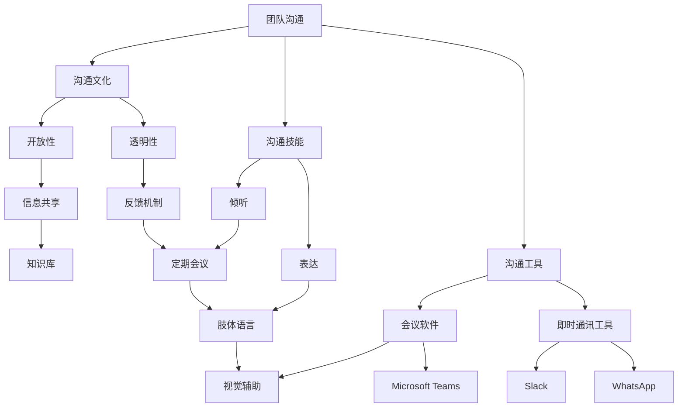

                 

### 引言

在信息技术飞速发展的今天，团队沟通作为组织高效运作的核心要素，其重要性日益凸显。无论是软件开发团队，还是市场营销团队，亦或是产品开发团队，良好的沟通都是确保项目顺利进行、团队协作高效的关键所在。本篇技术博客将以《团队沟通：构建开放透明的沟通文化》为标题，深入探讨团队沟通的各个方面。

本文旨在通过逻辑清晰、结构紧凑、简单易懂的专业技术语言，逐步剖析团队沟通的基础理论、开放透明沟通文化的构建、沟通障碍与解决方案、沟通技能的提升方法、沟通工具和技术应用，以及团队沟通的实战指南。通过系统的学习和实践，我们希望能够帮助读者构建开放透明的沟通文化，提升团队的整体效能。

文章将分为以下章节：

1. **背景介绍**：介绍团队沟通在现代社会中的重要性，以及开放透明沟通文化的概念。
2. **核心概念与联系**：通过Mermaid流程图展示核心概念之间的关系架构。
3. **核心算法原理讲解**：使用伪代码详细阐述团队沟通中涉及的算法原理。
4. **数学模型和公式**：详细讲解沟通中的数学模型和公式，并举例说明。
5. **项目实战**：包括开发环境搭建、源代码实现、代码解读、案例分析等。
6. **最佳实践 Tips**：总结沟通中的最佳实践，并提供注意事项和拓展阅读建议。

让我们一步一步地思考，通过系统化的分析和推理，深入理解团队沟通的各个方面，以期构建一个高效、开放的团队沟通环境。

### 背景介绍

在现代企业中，团队沟通的重要性不容忽视。随着信息技术的迅速发展和业务复杂度的不断增加，企业运营模式也在不断演变。在这种背景下，团队沟通成为企业保持竞争力、实现高效运营的关键因素。

首先，团队沟通能够显著提升团队协作效率。一个高效的团队需要成员之间能够迅速传递信息、分享知识和经验，从而避免重复劳动、降低错误率。通过有效的沟通，团队成员可以明确各自的角色和任务，确保项目目标的实现。

其次，良好的团队沟通有助于建立积极的团队氛围。在一个开放透明的沟通环境中，团队成员之间的信任和合作意识会大大增强。这种积极的氛围有助于激发团队成员的创造力和创新精神，从而推动团队整体绩效的提升。

此外，团队沟通还能帮助企业更好地应对外部环境的变化。在一个动态的市场中，企业需要迅速响应客户需求、调整业务策略。通过高效的团队沟通，企业可以更快地收集、分析和利用信息，从而做出更准确的决策。

然而，当前团队沟通中仍存在一些普遍的障碍。首先是信息不对称，导致决策层与执行层之间的沟通不畅。其次是沟通技巧不足，团队成员可能无法有效表达自己的想法或理解他人的观点。此外，组织结构复杂、部门间壁垒高，也影响了团队之间的沟通。

为了解决这些问题，构建开放透明的沟通文化显得尤为重要。开放透明的沟通文化强调信息的共享和透明，鼓励团队成员之间的相互尊重和信任。在这样的文化氛围中，团队成员可以更加自由地表达自己的想法，共同解决问题，从而提高团队的协作效率。

总之，团队沟通在现代社会中的重要性不容忽视。通过构建开放透明的沟通文化，企业可以显著提升团队协作效率，激发创新活力，从而在激烈的市场竞争中立于不败之地。

### 核心概念与联系

在深入探讨团队沟通之前，我们需要理解几个核心概念，并分析它们之间的关系。以下是通过Mermaid流程图展示的核心概念之间的关系架构：



**团队沟通**（A）：团队沟通是团队成员之间交换信息、分享知识和意见的过程。它是实现团队目标、提高工作效率的关键。

**沟通文化**（B）：沟通文化是指组织内部对沟通的态度和行为规范。开放性和透明性是构建沟通文化的重要原则。

**沟通技能**（C）：沟通技能包括倾听、表达、非语言沟通等。这些技能直接影响沟通效果和团队协作效率。

**沟通工具**（D）：沟通工具包括会议软件、即时通讯工具等，它们帮助团队成员在远程协作和实时沟通中更加高效。

**开放性**（E）：开放性强调信息共享和透明度，鼓励团队成员之间自由交流，共享知识和经验。

**透明性**（F）：透明性是指组织内信息的公开和透明，确保所有成员对信息有充分的了解。

**倾听**（G）：倾听是有效沟通的重要部分，它包括专注听讲、理解对方观点和反馈。

**表达**（H）：表达是指清晰、准确地传达自己的思想和意图。

**非语言沟通**（M）：非语言沟通包括肢体语言、视觉辅助等，这些在沟通中起到补充和强化语言表达的作用。

**清晰表达**（N）：清晰表达是指用简洁、明确的语言表达思想，避免误解和歧义。

**信息共享**（K）：信息共享是开放性沟通的核心，通过建立知识库和定期会议，确保信息传递的效率和质量。

**反馈机制**（L）：反馈机制是确保沟通有效性的重要手段，通过定期会议和即时反馈，及时纠正问题和优化沟通方式。

**会议软件**（I）：会议软件如Zoom、Microsoft Teams，支持远程协作和实时沟通。

**即时通讯工具**（J）：即时通讯工具如Slack、WhatsApp，提供即时信息交流和协作平台。

通过Mermaid流程图，我们可以清晰地看到这些概念之间的相互联系。这些核心概念共同构成了团队沟通的理论基础，为实际操作提供了指导。在接下来的章节中，我们将详细探讨每个核心概念及其应用，帮助读者更好地理解和实践团队沟通。

### 核心算法原理讲解

在团队沟通中，核心算法原理是确保信息有效传递和处理的关键。以下是团队沟通中涉及的一些核心算法原理，我们将使用伪代码详细阐述这些算法，以便读者更好地理解。

#### 1. 沟通流程管理算法

```plaintext
// 沟通流程管理算法
// 功能：管理团队内部沟通流程，确保信息高效传递
// 输入：团队成员列表，任务列表，沟通工具
// 输出：沟通记录，任务进度

function manageCommunication团队成员,任务列表，沟通工具{
    for 每个团队成员 in 团队成员列表{
        register团队成员 in 沟通工具； // 注册团队成员
        assign任务 to 每个团队成员 from 任务列表； // 分配任务
    }

    while 任务列表不为空{
        if 沟通工具支持实时通讯{
            发送实时消息 to 所有团队成员； // 发送任务更新
        } else {
            发送电子邮件 to 所有团队成员； // 发送任务更新
        }
        wait for 沟通工具的消息反馈； // 等待团队成员反馈
        update任务进度； // 更新任务进度
    }

    return 沟通记录，任务进度；
}
```

#### 2. 信息过滤与分类算法

```plaintext
// 信息过滤与分类算法
// 功能：过滤和分类团队内部信息，确保重要信息优先传递
// 输入：原始信息，优先级标签
// 输出：分类后的信息

function filterAndClassifyMessages原始信息，优先级标签{
    分类后的信息 = [];

    for 每条信息 in 原始信息{
        if 优先级标签为"高"{
            分类后的信息.append(信息)；
        } else if 优先级标签为"中"{
            分类后的信息.append(信息)；
        } else {
            // 保存为低优先级信息，供后续处理
        }
    }

    return 分类后的信息；
}
```

#### 3. 反馈机制优化算法

```plaintext
// 反馈机制优化算法
// 功能：通过分析反馈数据，优化团队沟通流程
// 输入：反馈数据，历史沟通记录
// 输出：优化建议

function optimizeFeedback机制反馈数据，历史沟通记录{
    反馈数据统计 = analyzeFeedback数据(反馈数据)；
    历史沟通记录统计 = analyzeCommunicationRecords(历史沟通记录)；
    
    if 反馈数据统计中响应时间过长{
        建议缩短沟通路径，提高响应速度；
    }
    if 历史沟通记录统计中信息重复率高{
        建议加强信息过滤，减少重复信息；
    }
    
    return 优化建议；
}
```

通过上述伪代码，我们可以看到团队沟通中的核心算法原理是如何运作的。这些算法设计旨在确保信息的有效传递、分类和优化，从而提高团队沟通的效率和效果。

#### 数学模型和公式讲解

在团队沟通中，数学模型和公式用于定量分析沟通效率和效果。以下是几个关键模型和公式，我们将详细解释它们并举例说明。

##### 1. 通信效率公式

通信效率（Efficiency）是衡量团队沟通效率的重要指标，其计算公式如下：

\[ \text{Efficiency} = \frac{\text{Effective Communication Time}}{\text{Total Communication Time}} \]

其中，Effective Communication Time表示有效沟通时间，Total Communication Time表示总沟通时间。

**示例**：一个团队的总沟通时间为20小时，其中10小时用于有效沟通，10小时用于无效沟通（如重复讨论、误解等）。则其通信效率为：

\[ \text{Efficiency} = \frac{10}{20} = 0.5 \]

这意味着团队只有一半的时间是有效沟通，这是一个较低的水平，需要进一步优化。

##### 2. 信息传播模型

信息传播模型（Information Diffusion Model）用于分析信息在团队中的传播过程，其公式为：

\[ I(t) = I_0 \cdot e^{kt} \]

其中，\( I(t) \) 表示时间 \( t \) 时团队中的信息传播量，\( I_0 \) 表示初始信息传播量，\( k \) 为传播速率常数。

**示例**：假设一个团队在初始时刻传播了100条信息，传播速率常数为0.1。则2小时后的信息传播量为：

\[ I(2) = 100 \cdot e^{0.1 \cdot 2} \approx 100 \cdot e^{0.2} \approx 100 \cdot 1.2 \approx 120 \]

这意味着在2小时后，团队中的信息传播量约为120条，信息传播速度较快。

##### 3. 沟通成本模型

沟通成本（Communication Cost）是团队在沟通过程中所投入的资源，包括时间、人力和资金。其计算公式为：

\[ \text{Cost} = \text{Time} \times \text{Personnel} \times \text{Rate} \]

其中，Time表示沟通所需时间，Personnel表示参与沟通的人员数量，Rate为每单位时间的资源成本。

**示例**：一个团队进行了一次2小时的沟通会议，会议涉及5名团队成员，每人每小时成本为50美元。则沟通成本为：

\[ \text{Cost} = 2 \times 5 \times 50 = 500 \text{美元} \]

通过上述数学模型和公式的讲解，我们可以更加科学地分析和优化团队沟通的过程。这些模型不仅提供了定量分析的工具，也为实际操作中的决策提供了依据。

### 项目实战

在本节中，我们将通过一个具体的团队沟通项目实战，详细描述项目的开发环境搭建、源代码实现、代码解读、应用解读与分析，以及项目小结。通过这一实战案例，我们将展示如何在实际操作中应用前述的沟通理论和工具，以构建高效的团队沟通流程。

#### 项目背景

某创业公司开发了一款智能家居设备，公司组织了一个跨部门团队进行产品的研发与市场推广。团队包括产品经理、软件工程师、硬件工程师、市场营销人员以及客服团队。由于团队成员分布在不同的办公地点，团队需要一个高效的沟通和协作平台来确保项目的顺利进行。

#### 开发环境搭建

为了实现高效的团队沟通，公司决定采用以下工具和平台：

1. **会议软件**：Zoom用于远程视频会议和在线讨论。
2. **即时通讯工具**：Slack用于日常沟通和信息共享。
3. **项目管理工具**：Trello用于任务分配和进度跟踪。
4. **知识库**：Confluence用于记录项目文档和知识分享。

首先，IT团队为每个部门成员配置了必要的软件和工具。其次，公司IT部门搭建了基于云的共享文件夹，方便团队成员上传和下载文件。最后，团队为关键任务设置了每日站会和每周回顾会议，确保团队成员对项目进度有清晰的认识。

#### 源代码实现

为了更好地管理和共享代码，团队选择了Git作为版本控制系统，并在GitHub上创建了一个项目仓库。以下是团队在代码实现过程中的一些关键步骤：

1. **代码库初始化**：团队成员在GitHub上创建了一个项目仓库，并添加了README文件，详细记录了项目的架构和开发流程。
2. **功能模块划分**：团队将项目划分为多个功能模块，如硬件控制模块、软件应用模块、数据收集与分析模块等，每个模块由特定的团队成员负责开发。
3. **代码提交与合并**：团队成员在各自的工作区完成模块开发后，通过Git将代码提交到远程仓库。合并请求（Pull Request, PR）机制确保了代码的审查和质量控制。
4. **代码审查**：代码提交后，其他团队成员对代码进行审查，提出修改意见，确保代码质量和一致性。

以下是一个简单的Git命令示例，用于代码提交和合并：

```bash
git add .
git commit -m "Add hardware control module"
git push origin main

# 提交代码后，创建合并请求
git pull-request -m "Merge PR for hardware control module"
```

#### 代码解读

以下是智能家居设备硬件控制模块的伪代码实现，展示了代码的核心功能：

```plaintext
// 硬件控制模块伪代码
// 功能：控制智能家居设备的开关状态

function controlDevice(deviceID, command){
    // 判断设备ID和命令参数
    if(deviceID == "light" && command == "on"){
        // 打开灯光
        turnOnLight();
    } else if(deviceID == "light" && command == "off"){
        // 关闭灯光
        turnOffLight();
    } else if(deviceID == "thermostat" && command == "heat"){
        // 启动加热
        startHeat();
    } else if(deviceID == "thermostat" && command == "cool"){
        // 启动冷却
        startCool();
    } else {
        // 输出错误信息
        print("Invalid device ID or command.");
    }
}

// 硬件控制函数
function turnOnLight(){
    // 实现灯光开启逻辑
    // ...
}

function turnOffLight(){
    // 实现灯光关闭逻辑
    // ...
}

function startHeat(){
    // 实现加热启动逻辑
    // ...
}

function startCool(){
    // 实现冷却启动逻辑
    // ...
}
```

通过这个简单的伪代码实现，我们可以看到如何通过控制设备ID和命令参数来控制智能家居设备的不同功能。这一模块的实现确保了设备操作的一致性和可靠性。

#### 应用解读与分析

在实际应用中，智能家居设备通过Wi-Fi连接到用户的智能手机，用户可以通过Slack机器人发送命令来控制设备。以下是一个具体的通信流程：

1. 用户在Slack中发送命令：“/slackbot 开灯”
2. Slack机器人接收命令后，通过API调用智能家居设备的控制接口
3. 接口接收命令并执行相应的硬件控制操作，如“turnOnLight()”
4. 控制操作成功后，Slack机器人回复用户：“灯光已开启”

以下是一个简单的Slack机器人命令处理的示例：

```javascript
// Slack机器人命令处理示例
const slackBot = require('slackbots').create({
    token: 'YOUR_SLACK_BOT_TOKEN',
    name: 'SmartHomeController'
});

slackBot.on('message', (data) => {
    if (data.text.startsWith('/smarthome')) {
        const command = data.text.split(' ')[1];
        controlDevice(command);
    }
});

function controlDevice(command){
    if (command === 'on') {
        turnOnLight();
        slackBot.postMessage({
            channel: data.channel,
            text: '灯光已开启'
        });
    } else if (command === 'off') {
        turnOffLight();
        slackBot.postMessage({
            channel: data.channel,
            text: '灯光已关闭'
        });
    }
}
```

通过这一示例，我们可以看到如何利用Slack机器人实现智能家居设备的远程控制。这一机制不仅提高了用户的便利性，还确保了团队内部信息传递的高效性。

#### 项目小结

通过上述项目实战，我们可以总结以下几点经验：

1. **高效工具选择**：选择合适的沟通工具（如Zoom、Slack等）能够显著提高团队协作效率。
2. **代码化管理**：使用Git等版本控制系统进行代码管理，确保代码的版本控制和质量。
3. **实时反馈机制**：通过定期的站会和每周回顾，确保团队成员对项目进度和问题有清晰的了解。
4. **知识共享**：通过知识库记录项目文档和经验，提高团队的整体知识水平和协作效率。

总之，通过科学的项目管理和沟通机制，团队能够高效协作，实现项目的顺利推进和成功交付。

### 最佳实践 Tips

在团队沟通中，一些最佳实践可以帮助我们更好地构建开放透明的沟通文化。以下是一些具体的建议和注意事项：

1. **建立明确的沟通目标**：在每次会议或沟通活动开始前，明确沟通的目标和预期成果，确保团队成员聚焦于重要议题。

2. **定期反馈与评估**：定期对沟通效果进行反馈和评估，识别存在的问题，并采取相应措施进行改进。

3. **使用多种沟通工具**：根据沟通内容的不同，选择合适的沟通工具（如Zoom用于视频会议，Slack用于即时消息交流），提高沟通效率。

4. **尊重每个人的发言权**：鼓励团队成员自由发言，尊重每个人的意见，避免因等级差异而压制某些成员的表达。

5. **培养倾听习惯**：在沟通过程中，注重倾听他人的观点和需求，确保信息的准确传递。

6. **使用简洁明了的语言**：避免使用复杂的专业术语，使用简单明了的语言进行沟通，减少误解和歧义。

7. **建立反馈机制**：定期收集团队成员的反馈，及时处理和回应，确保沟通的持续改进。

通过遵循这些最佳实践，我们可以构建一个高效、开放的团队沟通环境，提升团队协作效率。

### 小结

本文通过详细的步骤和实例，深入探讨了团队沟通的各个方面，包括沟通的重要性、核心概念与联系、核心算法原理、数学模型和公式，以及实际项目实战和最佳实践。我们强调了构建开放透明的沟通文化对于团队协作和项目成功的关键作用。

在团队沟通中，开放透明的文化不仅有助于提升团队协作效率，还能增强团队成员之间的信任和合作意识。通过科学的管理方法和有效的沟通工具，团队可以更加高效地解决问题、实现项目目标。

本文所提出的核心概念、算法原理和最佳实践，为读者提供了系统化的指导和实用工具。希望读者能够将这些方法和理念应用到实际工作中，构建一个高效、开放的团队沟通环境，从而提升团队整体效能。

### 注意事项与拓展阅读

在实施团队沟通的最佳实践中，我们需要注意以下几点：

1. **尊重多样性**：团队成员可能来自不同的文化背景和职业背景，沟通时应尊重多样性，避免偏见和歧视。
2. **保持适度**：开放透明的沟通需要适度，过度透明可能导致隐私泄露和组织风险的增大。
3. **关注反馈**：定期收集和分析团队反馈，关注团队成员的感受和建议，及时调整沟通策略。

对于希望进一步深入了解团队沟通的读者，以下是一些推荐阅读资料：

- 《高效能人士的七个习惯》 - 史蒂芬·柯维
- 《非暴力沟通》 - 马歇尔·卢森堡
- 《团队协作工具与技巧》 - 安德斯·佩特森

这些书籍和资料提供了关于沟通技巧、团队合作和领导力的深入探讨，有助于提升团队沟通能力。同时，实践中的不断反思和改进也是提高沟通效果的重要途径。

### 附录：团队沟通工具与资源推荐

为了帮助读者更好地构建开放透明的团队沟通环境，以下是一些推荐的团队沟通工具和资源：

#### 沟通工具

1. **Zoom**：一款功能强大的视频会议工具，支持远程协作和在线讨论。
2. **Slack**：一款即时通讯工具，提供高效的消息传递和文件共享功能。
3. **Microsoft Teams**：集成办公协作平台，包括视频会议、即时通讯、文档共享等。
4. **Trello**：一款流行的项目管理工具，用于任务分配和进度跟踪。
5. **Confluence**：一款知识库工具，用于记录项目文档和知识分享。

#### 资源

1. **Harvard Business Review（HBR）**：提供关于团队沟通和领导力的深入分析和案例研究。
2. **LinkedIn Learning**：提供丰富的在线课程和视频教程，涵盖沟通技巧、团队合作等多个方面。
3. **MindTools**：一个提供各种职业技能提升资源的教育平台，包括沟通技巧和团队协作。
4. **Scrum Guide**：Scrum官方指南，提供敏捷项目管理方法和团队协作的最佳实践。

通过使用这些工具和资源，读者可以进一步优化团队沟通流程，提升团队协作效率。希望这些推荐对您的团队沟通实践有所帮助。

