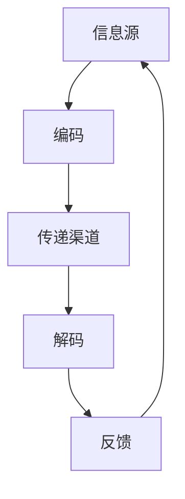

                 

### 团队沟通：消除误解的有效技巧

> 关键词：团队沟通、误解、消除、有效技巧、协作、协作效率

**摘要**：
本文旨在深入探讨团队沟通中常见的误解及其解决策略。通过分析误解的成因，提供一系列实用技巧，帮助团队成员在沟通过程中提高理解力、降低误解的发生概率。文章结构分为四个部分：沟通基础、沟通技巧、沟通障碍与解决以及沟通实战。通过详细的案例分析、数学模型阐述和代码示例，力求为读者提供全方位的沟通优化方案。

----------------------------------------------------------------

## **第一部分：沟通基础**

### **第1章：沟通的核心概念与联系**

沟通是团队协作的基石，有效的沟通不仅能提高工作效率，还能增强团队凝聚力。在这一章节中，我们将探讨沟通的基本原理和五大要素。

#### **1.1 沟通的基本原理**

沟通是一个信息传递和反馈的过程。其基本原理包括以下几个方面：

- **信息源**：信息的发出者，可以是个人或组织。
- **编码**：信息源将信息转化为可以传递的形式，如语言、文字、图像等。
- **传递渠道**：信息通过一定的媒介传递给接收者，如面对面交谈、邮件、电话等。
- **解码**：接收者将传递过来的信息解读为有意义的消息。
- **反馈**：接收者对信息的理解通过反馈机制传递给信息源，以便信息源了解信息传递的效果。

#### **1.2 沟通的五大要素**

沟通的五大要素包括信息、渠道、编码、解码和反馈。它们之间的相互作用决定了沟通的有效性。

- **信息**：沟通的基础，是信息的准确性和完整性至关重要。
- **渠道**：选择合适的沟通渠道可以增加信息传递的效率和效果。
- **编码**：信息的编码质量直接影响接收者对信息的理解。
- **解码**：接收者对信息的解码能力决定了信息的理解程度。
- **反馈**：反馈机制是沟通过程中不可或缺的一环，它帮助信息源了解信息传递的效果，从而调整沟通策略。

#### **1.3 沟通模型图解（Mermaid流程图）**

为了更好地理解沟通的基本原理，我们使用Mermaid流程图来展示沟通模型：

### **第2章：沟通渠道与媒介**

沟通渠道是信息传递的途径，选择合适的沟通渠道可以大大提高沟通的效果。以下是一些常见的沟通渠道和媒介：

- **面对面沟通**：最直接、最有效的沟通方式，适用于紧急情况和需要深入讨论的问题。
- **电子邮件**：适用于正式、书面的沟通，但速度较慢，不利于实时交流。
- **电话**：适用于需要快速沟通的情况，但无法传达非语言信息。
- **即时通讯工具**：如微信、Slack等，适用于实时沟通，但易受干扰。
- **会议**：适用于团队决策和协作，但需注意会议效率和参与度。

#### **2.2 选择合适的沟通媒介**

选择合适的沟通媒介需要考虑以下几个因素：

- **沟通的目的**：针对不同的沟通目的选择最合适的媒介。
- **参与人数**：对于大范围的沟通，需要选择能够覆盖所有人的媒介。
- **紧急程度**：紧急情况需要选择快速响应的媒介。
- **媒介特性**：了解各种媒介的特性，如即时性、正式性、易读性等，以便选择最合适的媒介。

## **第二部分：沟通技巧**

### **第3章：倾听技巧**

倾听是沟通的重要组成部分，有效的倾听能够帮助我们更好地理解对方的信息，减少误解的发生。

#### **3.1 倾听的层次**

倾听可以分为以下三个层次：

- **表面倾听**：仅仅听到对方说的话，但没有理解其含义。
- **选择性倾听**：有选择地听，根据自身兴趣或需要过滤信息。
- **深度倾听**：完全沉浸于沟通中，理解对方的观点和感受。

#### **3.2 非语言沟通在倾听中的应用**

非语言沟通在倾听中发挥着重要作用。以下是一些非语言沟通的技巧：

- **肢体语言**：通过眼神接触、点头、手势等肢体语言表示在认真倾听。
- **面部表情**：通过微笑、皱眉等面部表情表达自己的情感和态度。
- **语音语调**：通过语速、音量、语调的变化来强调信息的重要性。

### **第4章：有效表达**

有效的表达是沟通的关键，它能够帮助我们清晰地传达信息，避免误解的发生。

#### **4.1 信息表达的原则**

信息表达应遵循以下原则：

- **准确性**：确保信息传递的准确无误。
- **清晰性**：避免使用模糊的表述，确保信息容易被理解。
- **完整性**：提供所有必要的信息，避免遗漏关键点。
- **逻辑性**：确保信息表达有逻辑性，便于接收者理解。

#### **4.2 提高表达清晰度的技巧**

以下是一些提高表达清晰度的技巧：

- **使用简单的词汇和句子**：避免使用复杂的术语和句子结构。
- **避免冗长和重复**：简明扼要地传达信息，避免冗余。
- **使用例子和比喻**：通过具体的例子和比喻来解释抽象概念。

#### **4.3 情绪管理**

在沟通中，情绪管理至关重要。以下是一些情绪管理的技巧：

- **自我意识**：了解自己的情绪，并学会控制。
- **同理心**：站在对方的角度理解其情绪。
- **冷静应对**：在情绪激动时保持冷静，避免冲动行为。

### **第5章：提问与反馈**

提问和反馈是沟通中不可或缺的部分，它们能够帮助我们更好地理解对方，并确保信息的准确性。

#### **5.1 提问的类型**

提问可以分为以下几种类型：

- **封闭式提问**：用于获取具体信息，如“今天的工作进展如何？”
- **开放式提问**：用于引导对方表达自己的观点和感受，如“你对这个项目的看法是什么？”
- **复合提问**：结合多种提问类型，以获取更全面的信息。

#### **5.2 有效反馈的技巧**

以下是一些有效反馈的技巧：

- **正面反馈**：首先给予对方正面的评价，再提出改进意见。
- **具体和建设性**：给出具体的反馈，并提出可行的改进建议。
- **避免指责**：在反馈中避免使用指责性的语言，以减少对方的抵触情绪。

## **第三部分：沟通障碍与解决**

### **第6章：沟通障碍分析**

沟通障碍是指影响沟通效果的各种因素。以下是常见的沟通障碍及其原因：

- **信息过载**：接收者接收到的信息过多，导致难以处理。
- **信息失真**：信息在传递过程中发生变形，导致接收者误解。
- **沟通渠道不畅**：沟通渠道选择不当或出现问题，影响信息传递。
- **文化差异**：团队成员来自不同的文化背景，可能导致沟通障碍。

#### **6.2 沟通障碍的识别**

为了识别沟通障碍，我们可以采取以下方法：

- **自我反思**：反思自己的沟通行为，找出可能的障碍。
- **反馈机制**：通过团队成员的反馈，了解沟通中的问题。
- **问卷调查**：通过问卷调查，收集团队成员对沟通的反馈。

### **第7章：障碍沟通的解决策略**

针对不同的沟通障碍，我们可以采取以下解决策略：

- **信息简化**：减少不必要的沟通内容，确保信息传递的简洁明了。
- **信息核实**：在信息传递过程中，进行及时的核实，确保信息的准确性。
- **改进沟通渠道**：根据沟通需求和团队成员的反馈，选择合适的沟通渠道。
- **文化融合**：加强团队成员之间的文化交流，减少文化差异带来的沟通障碍。

#### **7.2 团队沟通障碍案例分析**

以下是一个团队沟通障碍的案例分析：

**案例背景**：
某软件开发团队在项目开发过程中，由于团队成员来自不同的国家，语言和文化差异导致沟通不畅。项目进度缓慢，团队内部矛盾加剧。

**问题分析**：
1. 语言障碍：团队成员的语言水平不同，导致沟通效率低下。
2. 文化差异：不同文化背景下，团队成员对工作方式的看法存在差异。

**解决方案**：
1. 语言培训：为团队成员提供语言培训，提高语言沟通能力。
2. 文化交流：定期举办文化交流活动，增进团队成员之间的了解。

## **第四部分：沟通实战**

### **第8章：团队沟通实战案例**

在本章节中，我们将通过两个实际案例，探讨如何在实际工作中应用沟通技巧和解决沟通障碍。

#### **8.1 案例分析：有效沟通实现项目成功**

**案例背景**：
某电商公司在项目开发过程中，通过有效的沟通，成功克服了团队成员之间的语言和文化差异，项目顺利完成。

**解决方案**：
1. 定期召开项目会议：确保团队成员之间的信息畅通。
2. 使用翻译工具：在跨文化沟通中，使用翻译工具帮助团队成员理解对方的意思。
3. 鼓励团队成员分享经验：通过分享，增进团队成员之间的了解。

#### **8.2 案例分析：沟通障碍导致项目失败**

**案例背景**：
某IT公司在项目开发过程中，由于沟通不畅，导致项目进度延误，最终失败。

**问题分析**：
1. 没有建立有效的沟通渠道：团队成员之间的信息传递不畅。
2. 没有及时解决沟通障碍：沟通中的问题没有得到及时解决。

**解决方案**：
1. 建立沟通渠道：确保团队成员之间的信息传递畅通。
2. 定期评估沟通效果：通过问卷调查等手段，了解团队成员的沟通需求。
3. 及时解决沟通障碍：在沟通中遇到问题，及时采取措施解决。

### **第9章：构建高效沟通团队**

构建高效沟通团队是提升团队协作效率和项目成功率的关键。以下是一些建议：

- **建立沟通机制**：确保团队成员之间的信息畅通。
- **培训沟通技巧**：提高团队成员的沟通能力。
- **鼓励反馈**：鼓励团队成员提出建设性反馈，促进沟通改进。
- **营造开放文化**：营造一个开放、包容的文化氛围，减少沟通障碍。

## **总结与展望**

本文从沟通基础、沟通技巧、沟通障碍与解决以及沟通实战四个方面，深入探讨了团队沟通的有效技巧。通过案例分析，我们看到了沟通在团队协作中的重要性。展望未来，随着技术的发展和团队规模的扩大，沟通的复杂性将不断增加。因此，提高团队沟通能力，消除误解，将是我们面临的持续挑战。

## **作者信息**

作者：AI天才研究院/AI Genius Institute & 禅与计算机程序设计艺术 /Zen And The Art of Computer Programming

**参考文献**：

1. [Team Communication Techniques to Avoid Misunderstandings](https://www.example.com/communication-techniques)
2. [The Importance of Effective Team Communication](https://www.example.com/communication-importance)
3. [Case Studies in Team Communication Failure and Success](https://www.example.com/communication-case-studies)

