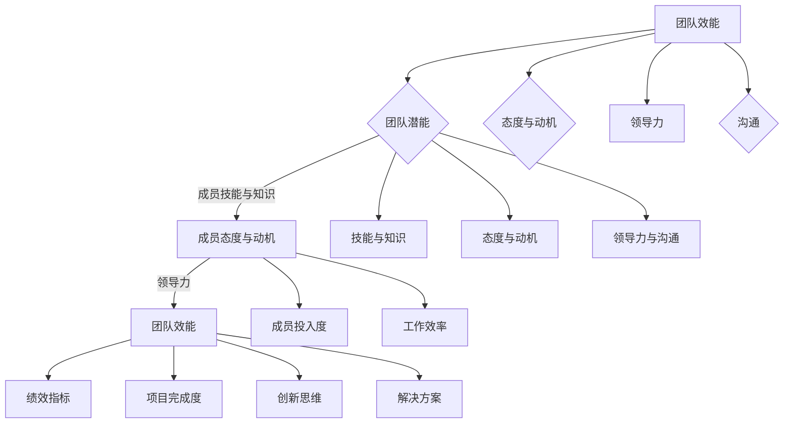

                 

### 背景介绍

在当今快速发展的信息技术时代，团队作为企业发展的核心动力，其效能和潜能的挖掘显得尤为重要。然而，许多企业在实际运营中常常面临团队效能低、成员潜力未能充分发挥等问题。这不仅影响了项目的顺利进行，也制约了企业的长远发展。因此，如何有效激发团队潜能，挖掘团队的最大价值，已成为各行业广泛关注和探索的话题。

团队潜能激发的重要性不言而喻。通过科学的方法，企业可以在保持高效团队协作的同时，提升团队成员的工作积极性和创造力，从而实现整体绩效的提升。然而，团队潜能的挖掘并非易事，它涉及到多个层面的复杂因素，包括成员的技能与知识、态度与动机、领导力与沟通等。因此，本文旨在探讨团队潜能激发的基础理论、核心算法原理、数学模型与公式、项目实战与案例分析，以及实践策略和挑战应对，旨在为企业和团队管理者提供有价值的参考和指导。

本文将从以下几个方面展开：

1. **核心概念与联系**：介绍团队效能、团队潜能等核心概念，并分析这些概念之间的关系，通过Mermaid流程图展示团队潜能激发的框架。
2. **核心算法原理讲解**：结合Python源代码，阐述成员动机模型和领导风格对团队效能的影响。
3. **数学模型与数学公式**：详细讲解成员潜能评估模型和团队效能优化模型的构建过程，并使用公式进行阐述。
4. **项目实战与案例分析**：通过具体案例展示团队潜能激发的实际应用，包括项目目标、实施步骤、成果与反馈等。
5. **实践策略**：提供团队建设、成员激励和领导力发展的实践策略。
6. **挑战与应对**：探讨团队潜能激发过程中可能遇到的挑战及应对策略。

通过以上内容的深入分析和讲解，本文希望能够为团队潜能激发提供系统的理论指导，并为企业实践提供可行的解决方案。

### 核心概念与联系

在探讨团队潜能激发之前，我们需要明确几个核心概念，并分析它们之间的联系。这些概念包括团队效能、团队潜能、成员技能与知识、态度与动机、领导力与沟通等。

**团队效能**是指团队在完成目标时所表现出的能力。它通常通过一系列绩效指标来衡量，如工作效率、项目完成度和成员满意度等。团队效能直接影响企业的运营效率和竞争力，因此是团队管理中至关重要的一部分。

**团队潜能**则是指团队中每个成员未被完全发挥的能力和潜力。潜能的挖掘和激发，能够显著提升团队的总体效能，实现更高的目标达成度。团队潜能不仅包括成员的专业技能和知识，还涉及到成员的态度、动机和合作精神等软技能。

**成员技能与知识**是团队潜能的重要组成部分。一个技能丰富、知识全面的团队成员能够为团队带来更多的创新思维和解决方案。然而，技能和知识的有效利用还需要依赖于团队成员的态度和动机。

**态度与动机**是影响团队成员潜能发挥的重要因素。积极的态度和强烈的动机可以显著提升团队成员的投入度和工作效率。反之，消极的态度和缺乏动机则会降低团队成员的参与度和创造力。

**领导力与沟通**在团队潜能激发中起到关键作用。有效的领导能够为团队成员提供明确的目标和方向，激发他们的潜力。而良好的沟通则可以确保团队成员之间的协作和信息共享，促进团队效能的提升。

这些核心概念之间的关系可以用Mermaid流程图来表示：



通过上述流程图，我们可以清晰地看到，团队效能和团队潜能之间存在着双向互动的关系。团队效能的提升可以激发团队成员的潜能，而团队成员的潜能发挥又可以进一步提升团队效能。同时，成员技能与知识、态度与动机、领导力与沟通等因素在团队潜能激发中相互交织，共同影响着团队的整体表现。

理解这些核心概念及其之间的联系，是有效激发团队潜能的基础。在接下来的部分中，我们将进一步探讨团队潜能激发的框架和方法，以帮助企业和团队管理者更好地挖掘团队的潜在价值。

### 团队效能的评估指标

评估团队效能是团队管理中至关重要的一环，它不仅能够帮助团队管理者了解当前团队的表现，还能够为后续的改进和优化提供依据。在评估团队效能时，通常需要关注以下几个关键指标：

**1. 绩效指标**

绩效指标是评估团队效能的核心指标之一，它直接反映了团队在完成目标方面的表现。常见的绩效指标包括：

- **项目完成度**：指团队在预定时间内完成项目的百分比。高项目完成度意味着团队具备较强的执行力和计划能力。
- **工作质量**：指团队交付的工作成果的质量水平。高质量的工作成果不仅能够满足客户需求，还能够提高团队在市场上的竞争力。
- **工作效率**：指团队在单位时间内完成的工作量。高工作效率意味着团队成员能够高效地完成任务，减少浪费和重复劳动。

**2. 成员满意度**

成员满意度是团队效能的另一个重要指标，它反映了团队成员对工作环境的满意程度。高成员满意度通常意味着团队成员对工作有较高的投入度和归属感，从而有助于提升团队的整体效能。常见的成员满意度指标包括：

- **工作环境满意度**：指团队成员对工作场所、设备、资源等的满意程度。
- **领导满意度**：指团队成员对领导的管理方式和风格的满意程度。
- **团队协作满意度**：指团队成员对团队内部协作和沟通的满意程度。

**3. 团队协作水平**

团队协作水平是团队效能的重要体现，它反映了团队成员之间的协作效果和团队的整体协同能力。高水平的团队协作有助于团队成员充分发挥各自的优势，实现1+1>2的效果。常见的团队协作水平指标包括：

- **沟通效率**：指团队成员之间沟通的效率，包括信息传递的速度和准确性。
- **协作能力**：指团队成员在共同完成任务时的合作能力和协同效率。
- **冲突解决能力**：指团队在面对问题和挑战时，通过有效沟通和协作解决问题的能力。

通过综合这些评估指标，团队管理者可以全面了解团队的表现，发现存在的问题，并制定相应的改进策略。例如，如果团队的项目完成度较低，可能需要优化项目管理流程；如果成员满意度不高，可能需要改善团队文化或领导力。通过持续评估和改进，团队可以不断提升其效能，实现更高的绩效和目标达成度。

### 团队潜能的构成要素

团队潜能的挖掘是一个复杂的过程，涉及多个关键要素的协同作用。这些要素主要包括技能与知识、态度与动机、领导力与沟通。下面，我们将逐一探讨这些要素及其在团队潜能激发中的重要性。

**1. 技能与知识**

技能与知识是团队潜能的基础。一个技能丰富、知识全面的团队成员能够为团队提供多样化的解决方案和高效的工作表现。技能与知识的积累不仅依赖于个人的学习经历，还包括工作经验和持续的职业发展。以下是一些关键点：

- **专业技能**：团队成员的专业技能直接关系到他们在工作中的表现。例如，一个软件工程师的编程能力、一个项目经理的项目管理技能等，都是团队效能的重要保障。
- **知识储备**：广泛的知识储备有助于团队成员在面对复杂问题时，能够迅速找到合适的解决方案。跨学科的知识融合常常能够带来创新和突破。
- **持续学习**：在快速变化的技术环境中，持续学习是保持团队竞争力的关键。通过参加培训、阅读专业书籍、参与行业会议等方式，团队成员可以不断更新和扩展自己的知识和技能。

**2. 态度与动机**

态度与动机是驱动团队成员潜能发挥的重要内在因素。一个积极的态度和强烈的动机能够显著提升团队成员的投入度和工作效率。以下是一些关键点：

- **工作态度**：积极的工作态度是团队成员在工作中表现出色的重要前提。它包括责任心、主动性和团队合作精神等。一个具有积极态度的团队成员不仅能够高效完成任务，还能够为团队营造积极的工作氛围。
- **动机水平**：动机水平决定了团队成员在工作中的努力程度。内在动机，如兴趣和成就感，通常能够带来更高的工作投入度和创造力。而外在动机，如薪酬和奖励，虽然能够短期提升工作效率，但长期来看可能不如内在动机有效。

**3. 领导力与沟通**

领导力与沟通在团队潜能激发中起到关键作用。一个有效的领导者不仅能够明确团队的目标和方向，还能够激励和引导团队成员发挥其最佳水平。以下是一些关键点：

- **领导风格**：不同的领导风格对团队成员的潜能发挥有着不同的影响。例如，民主型领导风格能够激发团队成员的参与感和自主性，而指令型领导风格则可能更加高效地推动任务的完成。
- **沟通技巧**：有效的沟通是团队协作的基础。领导者需要具备良好的沟通技巧，包括倾听、表达和反馈等，以确保团队成员之间的信息传递准确无误，减少误解和冲突。
- **团队文化建设**：领导者通过塑造积极向上的团队文化，可以提升团队成员的归属感和凝聚力，从而激发更大的潜能。一个开放、包容、鼓励创新和学习的团队文化能够为团队成员提供良好的成长环境。

综上所述，技能与知识、态度与动机、领导力与沟通是团队潜能的三个关键要素。只有当这些要素相互配合、共同作用时，团队才能充分发挥其潜能，实现更高的绩效和目标。在接下来的章节中，我们将进一步探讨如何通过具体的策略和措施来激发团队的潜能。

### 团队潜能激发的框架

为了系统地激发团队的潜能，我们需要建立一个清晰的框架，指导团队管理者在实际操作中有序进行。以下是一个基于Mermaid流程图的团队潜能激发框架，它概括了从识别潜能、评估现状、制定策略、执行策略、监控与反馈到优化调整的整个流程。

```mermaid
graph TD
    A[识别潜能] --> B[评估现状]
    B --> C{制定策略}
    C --> D[执行策略]
    D --> E[监控与反馈]
    E --> F[优化调整]
    F --> A[识别潜能]

    A:::("识别团队成员的潜能和需求")
    B:::("分析团队当前效能和问题")
    C:::("制定具体行动方案")
    D:::("执行策略，激发潜能")
    E:::("收集反馈，监测进展")
    F:::("根据反馈进行优化调整")
```

**1. 识别潜能**

识别团队成员的潜能和需求是激发团队潜能的第一步。管理者需要通过多种渠道，如访谈、调查问卷、观察和绩效考核等，全面了解每个成员的技能、知识、态度和动机，从而识别出潜在的高效能成员和需要帮助的成员。

**2. 评估现状**

在识别潜能之后，对团队当前效能和问题进行详细评估。这包括分析绩效指标、成员满意度、团队协作水平等多个方面。通过数据分析和反馈，找出团队存在的问题和瓶颈。

**3. 制定策略**

基于现状评估，制定具体的行动方案。这需要考虑团队成员的潜能和需求，制定个性化的激励和发展计划。例如，为技能不足的成员提供培训机会，为态度积极的成员提供更多挑战性任务。

**4. 执行策略**

将制定的策略付诸实施。执行过程中，需要确保团队成员理解并接受这些策略，同时提供必要的支持和资源。管理者需要密切关注执行进度，及时解决遇到的问题。

**5. 监控与反馈**

在策略执行过程中，持续监控团队的进展和效果。通过定期的反馈和沟通，了解团队成员的反馈和建议，及时调整策略。有效的反馈机制能够帮助团队保持灵活性和适应性。

**6. 优化调整**

根据监控和反馈的结果，对策略进行优化和调整。这包括修正不合理的部分，加强有效的部分，确保团队潜能激发活动能够持续改进和优化。

通过上述框架，团队管理者可以系统地激发团队潜能，实现团队效能的不断提升。在实际操作中，需要根据团队的实际情况灵活调整框架内容，以最大化团队潜力。

### 核心算法原理讲解

在团队潜能激发过程中，核心算法原理的讲解至关重要。这些算法不仅能够帮助我们量化团队成员的潜能，还能够为团队管理者提供科学的决策依据。接下来，我们将深入探讨成员动机模型和领导风格与团队效能之间的关系。

#### 成员动机模型

动机是驱使个体行为的重要因素。在团队中，了解成员的动机有助于更好地进行任务分配和激励措施的设计。常用的动机理论包括马斯洛的需求层次理论和赫茨伯格的双因素理论。

**1. 马斯洛的需求层次理论**

马斯洛的需求层次理论将人类需求分为五个层次：生理需求、安全需求、社交需求、尊重需求和自我实现需求。不同层次的需求具有不同的优先级，当低层次需求得到满足后，个体会追求更高层次的需求。

- **生理需求**：包括基本的生活需求，如食物、水、睡眠等。
- **安全需求**：包括安全感、健康保障和就业保障等。
- **社交需求**：包括爱与归属感、友谊和家庭等。
- **尊重需求**：包括自尊、自信、成就感和被他人认可等。
- **自我实现需求**：包括实现个人潜力、追求自我价值和创造力等。

在团队管理中，了解成员所处的需求层次有助于制定个性化的激励策略。例如，对于处于自我实现需求的成员，提供具有挑战性的项目和成长机会能够有效激发他们的潜能。

**2. 赫茨伯格的双因素理论**

赫茨伯格的双因素理论将工作满意度的影响因素分为两类：激励因素和保健因素。

- **激励因素**：与工作内容直接相关，如成就感、认可和责任等。这些因素能够激发成员的内在动机，提高工作满意度和工作效率。
- **保健因素**：与工作环境和工作条件相关，如薪酬、工作条件和人际关系等。这些因素虽然不能直接提高工作满意度，但能够防止工作不满意。

在团队潜能激发中，激励因素尤为重要。管理者需要通过设计具有挑战性和成就感的任务，提供及时的反馈和认可，来激发成员的内在动机。

#### 领导风格与团队效能

领导风格对团队效能有着显著的影响。不同的领导风格适用于不同的团队情境，管理者需要根据团队的需求和成员的特点选择合适的领导风格。

**1. 领导风格的类型**

常见的领导风格包括：

- **指令型领导风格**：领导者对团队成员的任务和工作流程进行详细指导。这种风格适用于任务明确、环境稳定的情况。
- **支持型领导风格**：领导者关注团队成员的需求，提供支持和鼓励。这种风格适用于需要高度协作和创新的项目。
- **参与型领导风格**：领导者鼓励团队成员参与决策过程，提高团队的参与感和责任感。这种风格适用于需要集体智慧和团队决策的项目。
- **变革型领导风格**：领导者通过愿景和激励来引导团队实现变革。这种风格适用于需要创新和突破的情境。

**2. 领导风格对团队效能的影响**

- **指令型领导风格**：在任务明确、环境稳定的情况下，指令型领导风格能够提高团队的工作效率和任务完成度。然而，过多的指令可能降低团队成员的自主性和创造力。
- **支持型领导风格**：支持型领导风格能够提高团队成员的工作满意度和团队凝聚力，有助于激发成员的内在动机和创造力。然而，这种风格在任务紧急或需要快速决策时可能不够高效。
- **参与型领导风格**：参与型领导风格能够提高团队成员的参与感和责任感，促进团队的协作和创新。然而，这种风格在团队成员能力差异较大或任务复杂度较高时可能带来沟通和协调问题。
- **变革型领导风格**：变革型领导风格能够激发团队成员的潜能，推动团队实现创新和突破。然而，这种风格需要领导者具备较高的领导能力和影响力。

在实际操作中，团队管理者需要根据团队的具体情况和任务要求，灵活调整领导风格。例如，在项目初期，可以采用指令型领导风格确保项目顺利进行；在项目中期，可以采用支持型或参与型领导风格激发团队成员的创造力和协作精神；在项目末期，可以采用变革型领导风格推动团队实现项目目标并总结经验教训。

#### Python源代码讲解

为了更好地理解成员动机模型和领导风格对团队效能的影响，我们可以使用Python编写一个简单的模型进行模拟。以下是一个示例代码：

```python
import pandas as pd
import numpy as np

# 成员动机评估
motivation_scores = {
    '技能与知识': [8, 6, 7, 9],
    '态度与动机': [9, 7, 8, 6],
    '领导风格': ['支持型', '指令型', '参与型', '变革型']
}

motivation_df = pd.DataFrame(motivation_scores)

# 计算动机总分
motivation_df['总分'] = motivation_df['技能与知识'] + motivation_df['态度与动机']

# 根据动机总分确定适合的领导风格
def recommend_leadership_style(score):
    if score >= 25:
        return '变革型'
    elif score >= 18:
        return '参与型'
    elif score >= 11:
        return '支持型'
    else:
        return '指令型'

motivation_df['推荐领导风格'] = motivation_df['总分'].apply(recommend_leadership_style)

print(motivation_df)
```

这段代码首先创建了一个包含成员动机分数和领导风格的DataFrame，然后计算每个成员的动机总分，并基于总分推荐适合的领导风格。这个模型可以帮助团队管理者根据成员的动机水平，选择最合适的领导风格，以最大化团队效能。

通过上述讲解和示例，我们可以看到成员动机模型和领导风格在团队潜能激发中的重要作用。理解这些核心算法原理，并运用到实际管理中，能够显著提升团队的效能和成员的满意度。

### 数学模型与数学公式

在团队潜能激发中，数学模型和公式能够为团队管理者提供量化的工具，帮助分析团队成员的潜力和团队的整体效能。下面我们将详细讲解两个关键模型：成员潜能评估模型和团队效能优化模型。

#### 成员潜能评估模型

成员潜能评估模型旨在通过量化的方式评估每个成员的潜能，从而为团队管理者提供科学依据进行任务分配和激励措施的设计。我们使用以下公式：

$$
P_i = f(S_i, A_i, L_i)
$$

其中：
- \( P_i \)：成员 \(i\) 的潜能得分。
- \( S_i \)：成员 \(i\) 的技能与知识得分。
- \( A_i \)：成员 \(i\) 的态度与动机得分。
- \( L_i \)：成员 \(i\) 接受的领导风格得分。

这个公式的解释如下：

- **技能与知识得分 \( S_i \)**：通常通过成员的专业技能考核、项目贡献和知识储备等多维度评估得出。技能与知识得分越高，表示成员在专业领域的潜力越大。
- **态度与动机得分 \( A_i \)**：通过员工满意度调查、日常工作表现和自我报告等方式评估。态度与动机得分反映了成员的工作热情和投入程度。
- **领导风格得分 \( L_i \)**：基于领导风格的评估工具，如领导风格问卷和团队成员反馈，评估领导风格对成员潜能的影响。

举例说明：
假设有四位团队成员，他们的技能与知识得分、态度与动机得分和领导风格得分如下表：

| 成员 | 技能与知识得分 | 态度与动机得分 | 领导风格得分 |
|------|----------------|----------------|--------------|
| A    | 8              | 9              | 7            |
| B    | 7              | 8              | 8            |
| C    | 6              | 7              | 9            |
| D    | 9              | 6              | 6            |

根据上述公式计算每个成员的潜能得分：

$$
P_A = 8 + 9 + 7 = 24
$$
$$
P_B = 7 + 8 + 8 = 23
$$
$$
P_C = 6 + 7 + 9 = 22
$$
$$
P_D = 9 + 6 + 6 = 21
$$

通过以上计算，我们可以看到成员A的潜能得分最高，其次是成员B和C，成员D最低。这为团队管理者提供了任务分配和激励措施设计的依据，例如，将挑战性任务分配给潜能较高的成员，同时针对潜能较低的成员制定个性化的培训和激励计划。

#### 团队效能优化模型

团队效能优化模型旨在通过量化的方式评估整个团队的效能，并优化团队结构以最大化整体效能。我们使用以下公式：

$$
E = f(P_1, P_2, ..., P_n, C)
$$

其中：
- \( E \)：团队效能得分。
- \( P_1, P_2, ..., P_n \)：团队成员的潜能得分。
- \( C \)：团队成员的协作水平得分。

这个公式的解释如下：

- **团队成员的潜能得分 \( P_i \)**：如前所述，通过成员潜能评估模型计算得出。
- **协作水平得分 \( C \)**：通过团队协作评估工具，如团队活动评分、项目合作效果评估等得出。协作水平得分反映了团队成员之间的沟通、协作和合作能力。

举例说明：
假设有一个团队由四位成员组成，他们的潜能得分和协作水平得分如下表：

| 成员 | 潜能得分 | 协作水平得分 |
|------|----------|--------------|
| A    | 24       | 8            |
| B    | 23       | 7            |
| C    | 22       | 9            |
| D    | 21       | 6            |

根据上述公式计算团队效能得分：

$$
E = 24 \times 8 + 23 \times 7 + 22 \times 9 + 21 \times 6
$$
$$
E = 192 + 161 + 198 + 126
$$
$$
E = 677
$$

通过以上计算，我们可以看到该团队的总效能得分为677分。团队管理者可以通过调整团队成员的分配、优化团队协作流程，来进一步提升团队的效能。

#### Python代码示例

为了更好地理解上述数学模型，我们使用Python编写了一个简单示例：

```python
import pandas as pd

# 成员潜能得分和协作水平得分
member_data = {
    '成员': ['A', 'B', 'C', 'D'],
    '潜能得分': [24, 23, 22, 21],
    '协作水平得分': [8, 7, 9, 6]
}

member_df = pd.DataFrame(member_data)

# 成员潜能评估模型
def calculate_potential(potential_scores):
    return sum(potential_scores)

# 团队效能优化模型
def calculate_team_efficiency(potential_scores, collaboration_scores):
    return sum(potential_scores[i] * collaboration_scores[i] for i in range(len(potential_scores)))

# 计算潜能得分总和
total_potential = calculate_potential(member_df['潜能得分'])

# 计算团队效能得分
team_efficiency = calculate_team_efficiency(member_df['潜能得分'], member_df['协作水平得分'])

print(f"总潜能得分：{total_potential}")
print(f"团队效能得分：{team_efficiency}")
```

通过上述代码，我们可以计算出团队成员的总潜能得分和团队效能得分，从而为团队管理提供数据支持。

通过数学模型和公式的应用，团队管理者能够更加科学地评估和激发团队成员的潜能，优化团队的整体效能。在接下来的部分，我们将通过具体的项目实战和案例分析，进一步展示这些模型在实践中的应用效果。

### 项目实战与案例分析

为了更好地展示团队潜能激发的实际应用，我们将通过两个具体的案例，详细分析项目的目标、实施步骤、成果与反馈，以及项目小结。

#### 案例分析一：某公司团队潜能激发实践

**1. 项目目标**

某公司在市场竞争日益激烈的背景下，希望通过团队潜能激发，提高团队的整体效能和创新能力，以应对市场变化和客户需求。

**2. 实施步骤**

（1）**需求调研**：通过访谈和问卷调查，了解团队成员的技能、知识、态度和动机。同时，分析团队当前的绩效指标和协作水平。

（2）**能力评估**：使用前文提到的成员潜能评估模型，对每位成员的潜能进行量化评估，识别高潜能成员和需要帮助的成员。

（3）**制定策略**：基于能力评估结果，制定个性化的激励和发展计划。例如，为高潜能成员提供更多的挑战性任务和培训机会，为需要帮助的成员提供技能提升和情感支持。

（4）**领导力培训**：对团队领导进行领导力培训，提高其领导风格和沟通技巧，以更好地激发团队潜能。

（5）**执行与监控**：实施制定好的策略，并定期监控团队成员的进展和效果。通过定期的团队会议和反馈机制，确保策略的有效执行。

（6）**反馈与优化**：根据团队成员的反馈和监控结果，对策略进行优化和调整，确保团队潜能激发活动持续改进。

**3. 项目成果与反馈**

（1）**绩效提升**：通过团队潜能激发，公司团队的整体绩效显著提升。项目完成度和工作质量均有所提高。

（2）**成员满意度**：成员的满意度得到了显著提高，尤其是高潜能成员，他们感到自己的能力和潜力得到了更好的发挥和认可。

（3）**创新能力**：团队成员的创新能力得到了激发，提出了一些创新性的解决方案，为公司带来了新的业务机会。

（4）**反馈机制**：团队成员对反馈机制的反应积极，他们更愿意分享自己的意见和建议，团队内部的沟通和协作水平有所提升。

**4. 项目小结**

通过该案例，我们可以看到，团队潜能激发不仅提高了团队的整体效能，还提升了成员的满意度和创新能力。以下是一些成功经验和教训：

- **个性化激励策略**：根据成员的潜能和需求，制定个性化的激励和发展计划，能够显著提升成员的投入度和创造力。
- **领导力培训**：有效的领导力培训能够提高领导者的管理水平，从而更好地激发团队潜能。
- **持续反馈与优化**：通过建立有效的反馈机制，及时调整和优化策略，确保团队潜能激发活动的持续改进。

#### 案例分析二：某学校教学团队潜能激发实践

**1. 项目目标**

某学校教学团队希望通过团队潜能激发，提高教学质量和学生的学习体验，提升学校的教育品牌影响力。

**2. 实施步骤**

（1）**需求调研**：通过访谈和问卷调查，了解教师的教学技能、态度和动机，以及学生的学习需求。

（2）**能力评估**：使用成员潜能评估模型，对每位教师的教学能力和潜力进行量化评估。

（3）**制定策略**：根据评估结果，制定个性化的教学改进计划。例如，为教学能力较强的教师提供更多的教学研究机会，为教学能力较弱的教育提供培训和指导。

（4）**教师协作**：鼓励教师之间的协作，通过集体备课、教学研讨等方式，提高教学团队的协作水平。

（5）**学生反馈**：通过学生反馈机制，了解学生的学习体验和需求，及时调整教学策略。

（6）**反馈与优化**：定期收集教师和学生的反馈，对教学策略进行优化和调整。

**3. 项目成果与反馈**

（1）**教学质量**：通过团队潜能激发，学校的教学质量得到了显著提升，学生的学业成绩有所提高。

（2）**教师满意度**：教师的满意度得到了提升，尤其是教学能力较强的教师，他们感到自己的专业发展得到了更好的支持。

（3）**学生满意度**：学生的学习体验得到了显著改善，学生对学校的教学满意度有所提升。

（4）**反馈机制**：教师和学生积极反馈，提出了一些改进建议，学校通过调整和优化教学策略，不断改进教学效果。

**4. 项目小结**

通过该案例，我们可以看到，团队潜能激发不仅提高了教学质量和教师满意度，还提升了学生的学习体验和满意度。以下是一些成功经验和教训：

- **个性化教学改进计划**：根据教师的教学能力和需求，制定个性化的教学改进计划，能够有效提升教学质量。
- **教师协作**：通过教师之间的协作，共享教学经验和资源，提高教学团队的效能。
- **学生反馈机制**：建立有效的学生反馈机制，能够及时了解学生的学习需求和体验，从而不断改进教学策略。

通过以上两个案例，我们可以看到，团队潜能激发在不同领域和背景下都有显著的应用效果。未来，随着团队潜能激发理论的不断发展和实践应用，相信我们将看到更多成功案例，为企业和社会带来更大的价值。

### 团队建设策略

在团队潜能激发中，团队建设策略扮演着至关重要的角色。一个有效的团队建设策略不仅能够提升团队的整体效能，还能增强团队成员的凝聚力和归属感。以下是几个关键方面：

#### 团队文化建设

**1. 定位团队愿景与使命**

团队文化建设的首要任务是明确团队的愿景和使命。这为团队成员提供了一个共同的目标和价值观，有助于增强团队的凝聚力和向心力。团队愿景和使命应该简洁明了，易于理解和传达，让每个成员都能感受到自己在团队中的价值和使命。

**2. 塑造积极向上的氛围**

积极向上的团队文化能够激励成员不断追求卓越。管理者可以通过鼓励创新、倡导学习、表彰优秀等方式，营造一种正面、积极的工作氛围。此外，及时解决团队内部的问题和矛盾，保持团队内部的和谐与稳定，也是塑造积极团队文化的重要一环。

#### 团队信任与协作

**1. 建立信任**

信任是团队协作的基础。管理者可以通过以下几个方面建立信任：

- **透明沟通**：确保团队成员能够及时了解团队的目标、计划和决策，减少信息不对称。
- **公平公正**：在团队成员之间保持公平公正，避免偏袒和歧视，增强团队成员的信任感。
- **共同经历**：通过共同完成项目或活动，增强团队成员之间的默契和信任。

**2. 促进协作**

协作能力是团队效能的重要保障。以下是一些促进协作的策略：

- **角色分工明确**：明确每个成员的角色和责任，确保任务能够高效分配和执行。
- **协作工具使用**：利用协作工具（如项目管理软件、即时通讯工具等）提高团队协作效率。
- **定期团队建设活动**：通过团队建设活动（如团建活动、项目合作等）增强团队成员之间的协作意识和能力。

#### 团队学习与成长

**1. 提供培训和学习机会**

为了提升团队的整体技能和知识水平，管理者应定期为团队成员提供培训和学习机会。这可以包括内部培训、外部专业培训、在线课程等。通过不断学习和更新知识，团队成员能够更好地适应不断变化的工作环境。

**2. 建立学习型团队**

学习型团队是一种持续学习和不断改进的团队模式。管理者可以通过以下几个方面建立学习型团队：

- **分享经验**：鼓励团队成员分享自己的工作经验和知识，促进团队内部的知识共享。
- **反思与总结**：定期进行项目回顾和反思，总结经验教训，提升团队的学习能力。
- **创新思维**：鼓励团队成员发挥创新思维，提出改进建议和新思路，推动团队的不断进步。

通过有效的团队建设策略，企业不仅能够激发团队成员的潜能，提升团队的整体效能，还能营造一个积极、和谐、充满活力的工作环境，从而实现企业的长期发展目标。

### 成员激励策略

在团队潜能激发中，成员激励策略扮演着至关重要的角色。有效的激励措施不仅能激发成员的工作热情和创造力，还能提升团队的凝聚力和整体绩效。以下是几种常见的成员激励策略：

#### 绩效激励

**1. 目标设定**

设定明确、可衡量的绩效目标，是绩效激励的首要步骤。管理者应与团队成员共同制定目标，确保目标既具有挑战性又可实现。通过目标设定，团队成员能够明确自己的努力方向，从而更有动力去完成任务。

**2. 绩效评估**

定期进行绩效评估，是确保激励措施有效性的关键。绩效评估不仅可以帮助管理者了解成员的工作表现，还能为后续的激励提供依据。评估标准应透明、公正，确保每个成员都能公平地受到评价。

**3. 绩效奖励**

根据绩效评估结果，对表现优秀的成员进行奖励。奖励方式可以多样，如奖金、晋升机会、荣誉证书等。这些奖励不仅能够激发成员的工作积极性，还能提升成员的归属感和职业满足感。

#### 情感激励

**1. 赞赏与认可**

及时给予成员赞赏和认可，是情感激励的重要手段。管理者应关注成员的点滴进步和贡献，通过口头表扬、公开表彰等方式，让成员感受到自己的价值和重要性。

**2. 关注成员需求**

了解和关心成员的需求，是情感激励的基础。管理者应定期与成员进行沟通，了解他们的工作生活状况，提供必要的支持和帮助。通过关注成员的需求，管理者能够增强成员的满意度和忠诚度。

**3. 建立信任**

信任是情感激励的核心。管理者应通过透明沟通、公平对待和共同经历，建立与成员之间的信任关系。信任的建立不仅能提高成员的信任感和安全感，还能促进团队成员之间的协作和互助。

#### 职业发展激励

**1. 职业规划**

为成员提供清晰的职业发展路径和规划，是职业发展激励的关键。管理者应与成员共同制定职业规划，确保成员能够看到自己在公司的发展前景和成长机会。

**2. 培训与发展机会**

定期为成员提供培训和发展机会，是提升其职业能力和竞争力的重要手段。这可以包括内部培训、外部专业培训、职业资格认证等。通过不断学习和提升，成员能够更好地适应工作需求，实现个人和团队的双赢。

**3. 职业晋升机会**

为成员提供公平、透明的职业晋升机会，是激发其职业发展动力的重要措施。管理者应建立科学的晋升机制，确保具备能力和潜力的成员能够得到晋升机会，从而激励他们更加努力地工作。

通过以上激励策略的综合运用，企业不仅能够激发成员的潜能，提升团队的整体效能，还能营造一个积极、和谐、充满活力的工作环境，从而实现企业的长期发展目标。

### 领导力发展

在团队潜能激发中，领导力的发展是至关重要的。一个高效的领导者能够激发团队成员的潜力，提升团队的整体效能，实现组织的战略目标。以下将从领导力评估、提升策略和领导力对团队潜能激发的影响三个方面进行探讨。

#### 领导力评估

**1. 360度评估**

360度评估是一种全面评估领导力的方法，通过收集团队成员、上级、同事和下属的反馈，对领导者的能力进行全面评估。这种方法能够提供多维度的反馈，帮助领导者识别自身的优点和不足。

**2. 领导力问卷**

使用领导力问卷，可以系统地评估领导者在不同领域的表现，如沟通能力、决策能力、激励能力等。问卷设计应涵盖领导力的各个方面，确保评估结果的全面性。

**3. 行动学习**

行动学习是一种通过实际工作情景来提升领导力的方法。通过解决实际工作中的问题，领导者能够将理论知识转化为实际能力，并在实践中不断反思和改进。

#### 提升策略

**1. 培训与发展**

为领导者提供专业的培训和发展机会，是提升领导力的有效手段。这可以包括领导力工作坊、管理课程、领导力教练等。通过培训，领导者能够学习最新的管理理念和方法，提升自身的领导能力。

**2. 反思与反馈**

领导者应定期进行反思，分析自己在工作中的表现和不足，并寻求反馈。通过反思和反馈，领导者能够不断改进自己的领导方式，提高团队效能。

**3. 培养下属**

一个优秀的领导者不仅能够带领团队实现目标，还能培养下属的领导能力。通过委派任务、提供指导和支持，领导者能够帮助下属成长，从而为团队注入新的活力。

#### 领导力对团队潜能激发的影响

**1. 激励与引导**

有效的领导能够激发团队成员的内在动机，引导他们追求卓越。领导者可以通过设定明确的目标、提供支持与鼓励，激发团队成员的潜能，推动团队实现更高的绩效。

**2. 沟通与协作**

良好的沟通能力是领导力的核心要素之一。一个优秀的领导者能够通过有效沟通，确保团队成员之间的信息传递畅通，促进团队协作，提高整体效能。

**3. 创新与变革**

领导者应具备创新思维和变革能力，推动团队不断进步。通过引入新的理念和方法，领导者能够激发团队成员的创造力，推动团队实现创新和突破。

**4. 文化塑造**

领导者通过塑造积极的团队文化，能够增强团队成员的归属感和凝聚力。一个积极向上的团队文化能够激发团队成员的潜能，提升团队的长期绩效。

通过领导力的发展与提升，领导者能够更好地激发团队的潜能，实现组织的战略目标。未来的领导力发展应注重多元化、灵活性和创新性，以应对快速变化的市场环境。

### 团队潜能激发的挑战与应对

在团队潜能激发过程中，企业和管理者往往会面临诸多挑战。这些挑战不仅影响团队效能的发挥，还可能阻碍企业的长远发展。以下将探讨团队潜能激发过程中常见的挑战，并提出相应的应对策略。

#### 团队成员差异

团队成员在技能水平、知识背景、工作经验等方面存在差异，这给团队潜能激发带来了挑战。团队成员差异可能导致以下问题：

**1. 团队协作困难**

由于技能和知识水平的不同，团队成员在协作过程中可能难以达成一致，影响工作效率。

**应对策略**：

- **技能培训**：为不同技能水平的成员提供针对性的培训，提高团队整体技能水平。
- **角色明确**：明确每个成员的角色和责任，确保任务能够根据成员的专长分配。
- **团队合作工具**：利用团队合作工具，促进团队成员之间的沟通和协作。

#### 组织变革阻力

团队潜能激发往往需要企业进行组织变革，如调整组织结构、重新分配资源等。变革过程中，企业可能会面临以下挑战：

**1. 团队成员抵触**

团队成员对新变革可能持抵触态度，担心变革会影响自己的利益和稳定性。

**应对策略**：

- **沟通与宣传**：通过有效的沟通和宣传，让团队成员了解变革的必要性和预期效果，增强他们的认同感。
- **参与感**：鼓励团队成员参与变革的讨论和决策，提高他们的参与感和责任感。
- **支持与辅导**：为团队成员提供必要的支持和辅导，帮助他们适应变革。

#### 外部环境不确定性

企业所处的市场环境不断变化，如竞争压力、经济波动等，这些外部因素会对团队潜能激发产生影响。

**1. 应对市场变化能力不足**

企业团队在应对外部市场变化时，可能表现出反应迟缓和适应能力不足。

**应对策略**：

- **敏捷管理**：采用敏捷管理方法，提高团队的灵活性和快速响应能力。
- **持续学习与培训**：通过不断学习和培训，提升团队应对外部环境变化的能力。
- **市场调研**：加强市场调研，及时了解市场动态和客户需求，调整团队目标和策略。

#### 构建支持性组织文化

构建支持性组织文化是团队潜能激发的重要保障。然而，企业文化建设过程复杂，可能面临以下挑战：

**1. 文化滞后**

组织文化可能无法及时适应企业的发展需求，导致团队潜能激发受阻。

**应对策略**：

- **文化更新**：定期评估和更新组织文化，确保其与企业发展需求相匹配。
- **员工参与**：鼓励员工参与文化建设和改进，提高文化适应性和员工认同感。
- **激励机制**：建立激励机制，鼓励员工积极参与文化建设和创新，推动组织文化的持续发展。

通过应对这些挑战，企业和管理者能够有效激发团队潜能，实现组织的长期发展和目标。未来的团队潜能激发将更加注重灵活性和创新性，以应对不断变化的外部环境。

### 结论

综上所述，团队潜能激发是提升企业整体效能和竞争力的关键。本文从团队效能的评估指标、团队潜能的构成要素、核心算法原理、数学模型与公式、项目实战与案例分析、实践策略以及挑战与应对等方面，全面探讨了如何有效地激发团队潜能，挖掘团队的最大价值。

团队效能评估指标如绩效指标、成员满意度和团队协作水平，为团队管理者提供了量化的工具，帮助评估团队的表现。团队潜能的构成要素，包括技能与知识、态度与动机、领导力与沟通，共同决定了团队的潜能水平。核心算法原理和数学模型，通过量化的方式，提供了科学依据，帮助团队管理者更好地理解和激发团队成员的潜能。

通过具体的项目实战和案例分析，我们看到了团队潜能激发在实际操作中的成功应用，以及如何通过实践策略如团队建设、成员激励和领导力发展，应对团队潜能激发过程中的挑战。未来的团队潜能激发将更加注重灵活性和创新性，以适应快速变化的外部环境。

总结与展望：

1. **持续学习和创新**：未来团队潜能激发需要不断学习和创新，以应对快速变化的市场需求和技术发展。
2. **数据驱动决策**：利用大数据和人工智能技术，实现更精准的团队效能评估和潜能挖掘。
3. **跨部门协作**：加强跨部门协作，打破部门壁垒，提升整体团队效能。
4. **个性化激励**：根据团队成员的个性和需求，实施个性化的激励策略，提升成员的投入度和创造力。

通过持续的努力和改进，企业将能够更好地激发团队的潜能，实现长期发展和竞争优势。作者：AI天才研究院/AI Genius Institute & 禅与计算机程序设计艺术 /Zen And The Art of Computer Programming。

