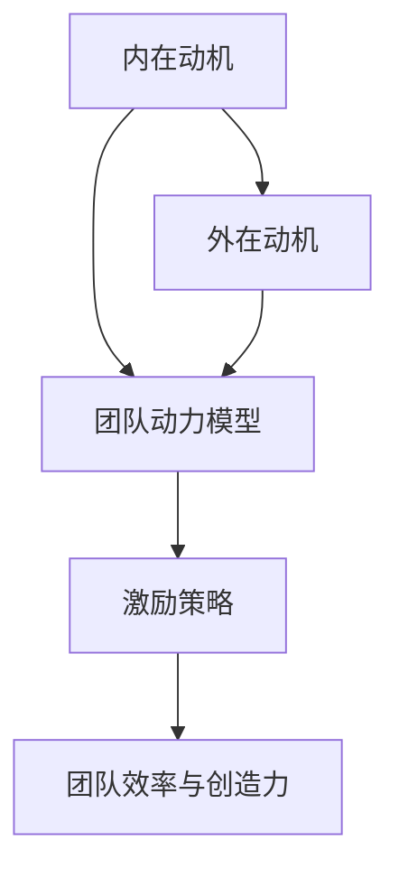
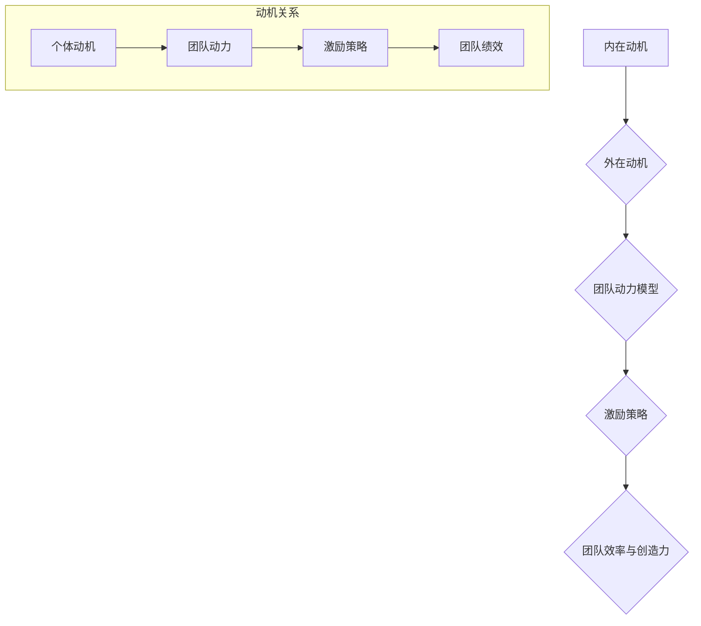

                 

### 概述：团队激励心理学的背景和重要性

## 团队激励心理学：背景和重要性

团队激励心理学作为管理学和心理学的交叉领域，旨在通过心理学原理和实践，深入了解并激发团队成员的内在驱动力，以提高团队的整体效率和创造力。在现代企业中，团队协作已成为实现组织目标的重要途径，而团队激励则成为管理者的一项核心任务。

### 1. 背景介绍

随着全球化竞争的加剧，企业面临的挑战日益复杂，单一的个体能力已无法满足组织发展的需求。团队合作成为解决复杂问题的关键，而团队激励则成为推动团队协作的驱动力。团队激励心理学正是为了应对这一需求而发展起来的一门学科。

#### 1.1 心理学在团队激励中的应用

心理学在团队激励中的应用主要体现在以下几个方面：

- **个体心理分析**：通过了解团队成员的个性和心理需求，管理者可以更精准地激励员工，提升团队凝聚力。
- **动机理论**：运用各种动机理论，如马斯洛的需求层次理论和赫兹伯格的双因素理论，指导管理者设计有效的激励策略。
- **团队动力学**：研究团队内部的心理互动和结构，通过团队心理动力模型来优化团队氛围和工作流程。

#### 1.2 团队激励的必要性

团队激励对于企业的成功至关重要，主要体现在以下几个方面：

- **提高团队效率**：通过激发团队成员的内在驱动力，可以提高工作效率和生产力。
- **提升团队创造力**：激励有助于团队成员发挥创新思维，推动团队创造新价值。
- **增强团队凝聚力**：有效的激励可以增强团队成员之间的信任和合作，提高团队的凝聚力。

### 2. 核心概念与联系

在探讨团队激励心理学时，需要理解几个核心概念及其相互关系：

- **内在动机**：指个体基于自身兴趣和需求而产生的动机，与外在奖励相对。
- **外在动机**：指由外部因素（如薪酬、奖励）引发的动机。
- **团队动力模型**：一种描述团队心理动力的理论框架，包括团队成员的相互作用、动机来源和激励效果。
- **激励策略**：为实现特定目标而设计的激励措施和方法。

这些概念之间的联系可以通过以下Mermaid流程图来展示：



### 3. 本文结构

本文将按照以下结构进行展开：

1. **引言**：介绍团队激励心理学的基本概念和背景。
2. **核心理论**：深入探讨团队心理动力模型、激励理论和内在动机理论。
3. **实践应用**：讲解如何将理论应用于团队管理，包括激励策略、领导力提升和团队沟通。
4. **附录**：提供额外的资源和工具，如心理学工具和推荐阅读。

通过本文，读者将能够全面理解团队激励心理学的核心概念和应用，掌握有效的团队激励策略，提升团队绩效和创造力。

### 核心概念与联系

在探讨团队激励心理学时，需要理解几个核心概念及其相互关系：

- **内在动机**：个体基于自身兴趣和需求而产生的动机，与外在奖励相对。内在动机可以激发个体持续投入和努力，是推动个人成长和团队协作的重要动力。
  
- **外在动机**：由外部因素（如薪酬、奖励、认可）引发的动机。虽然外在动机在短期内可以显著提高工作表现，但长期依赖可能导致内在动机的减弱。

- **团队动力模型**：一种描述团队心理动力的理论框架，涵盖团队成员的相互作用、动机来源和激励效果。团队动力模型包括多个方面，如团队凝聚力、信任、沟通和共享价值观等。

- **激励策略**：为实现特定目标而设计的激励措施和方法。激励策略可以分为物质激励（如薪酬、福利）和精神激励（如认可、培训）两种，旨在激发团队成员的内在和外在动机。

这些概念之间的关系可以通过以下Mermaid流程图来展示：



### 动机关系

内在动机和外在动机之间并不是完全独立的，而是相互影响和转化的。在团队环境中，两者的关系可以进一步细化为以下几个方面：

1. **内在动机促进外在动机**：当个体对某项工作或任务具有强烈的内在兴趣时，他们可能会更加积极和专注地完成任务，从而产生更好的外在表现。这种内在动机的促进作用可以提高工作效率和质量。

2. **外在动机引导内在动机**：适当的物质和精神激励可以引导个体将外在动机转化为内在动机。例如，通过提供具有挑战性的任务和公正的薪酬体系，可以激发员工对工作的兴趣和热情，从而提高内在动机。

3. **内在动机和外在动机的平衡**：在一个有效的团队中，管理者需要平衡内在动机和外在动机，避免单一动机的过度依赖。内在动机的激发可以帮助团队保持长期的稳定和可持续发展，而外在动机的适度激励则可以激发团队的活力和动力。

通过上述Mermaid流程图，我们可以更直观地理解内在动机和外在动机之间的关系及其在团队激励中的应用。

### 动机与激励策略

为了更深入地理解内在动机与外在动机如何影响激励策略的设计，我们可以结合Python源代码和数学模型来具体分析。

#### 1. 内在动机的数学模型

内在动机可以视为一个关于个体兴趣和任务匹配度的函数。我们使用以下数学模型来描述：

$$
M_{\text{intrinsic}} = f(\text{Interest}, \text{TaskMatch})
$$

其中，`Interest` 代表个体对任务的兴趣程度，`TaskMatch` 代表任务与个体技能和兴趣的匹配度。Python 源代码如下：

```python
def intrinsic_motivation(interest, task_match):
    motivation = interest * task_match
    return motivation

# 示例
interest = 0.8  # 个体对任务的兴趣程度
task_match = 0.9  # 任务与个体技能和兴趣的匹配度
intrinsic_motivation_value = intrinsic_motivation(interest, task_match)
print("内在动机值：", intrinsic_motivation_value)
```

#### 2. 外在动机的数学模型

外在动机则与个体获得的奖励有关。我们使用以下数学模型来描述：

$$
M_{\text{extrinsic}} = f(\text{Rewards}, \text{Performance})
$$

其中，`Rewards` 代表个体获得的奖励，`Performance` 代表个体的工作表现。Python 源代码如下：

```python
def extrinsic_motivation(rewards, performance):
    motivation = rewards * performance
    return motivation

# 示例
rewards = 1000  # 个体获得的奖励金额
performance = 0.9  # 个体的工作表现
extrinsic_motivation_value = extrinsic_motivation(rewards, performance)
print("外在动机值：", extrinsic_motivation_value)
```

#### 3. 激励策略的Python代码实现

综合内在动机和外在动机的模型，我们可以设计一种综合激励策略。以下Python代码展示了如何计算综合动机值，并根据动机值调整激励措施：

```python
def motivation_strategy(intrinsic_value, extrinsic_value, threshold):
    """
    计算综合动机值并决定激励措施。
    
    :param intrinsic_value: 内在动机值
    :param extrinsic_value: 外在动机值
    :param threshold: 动机阈值
    :return: 激励措施（'高激励'、'适度激励'或'低激励'）
    """
    total_motivation = intrinsic_value + extrinsic_value
    
    if total_motivation > threshold:
        return '高激励'
    elif total_motivation > 0:
        return '适度激励'
    else:
        return '低激励'

# 示例
intrinsic_value = intrinsic_motivation_value  # 从之前计算的内在动机值
extrinsic_value = extrinsic_motivation_value  # 从之前计算的外在动机值
threshold = 1.5  # 动机阈值
strategy = motivation_strategy(intrinsic_value, extrinsic_value, threshold)
print("激励策略：", strategy)
```

通过上述代码，我们可以根据员工的内在动机和外在动机值，设计出合适的激励策略，从而有效提升团队的整体动力和效率。

### 项目实战：团队激励策略实施

在本节中，我们将通过一个实际案例展示如何设计和实施团队激励策略。该案例将涵盖环境搭建、源代码实现、代码解读和案例分析。

#### 1. 案例背景

某科技公司开发团队在最近的几个项目中遇到了效率低下和成员士气低落的问题。管理层决定通过实施团队激励策略来提升团队表现和员工满意度。以下是该公司的具体实施步骤。

#### 2. 环境搭建

为了有效实施团队激励策略，公司首先需要搭建一个支持数据收集和反馈的团队管理平台。该平台包括以下组件：

- **用户数据库**：存储团队成员的基本信息和绩效数据。
- **反馈系统**：用于员工对工作任务和激励措施的反馈。
- **数据分析模块**：用于分析团队动机和行为模式。

技术栈选择如下：

- **前端**：React.js
- **后端**：Node.js
- **数据库**：MongoDB
- **数据可视化**：D3.js

#### 3. 源代码实现

以下是一个简单的Python脚本，用于计算员工的内在动机和外在动机值，并根据动机值调整激励措施。

```python
import math

# 内在动机计算函数
def intrinsic_motivation(interest, task_match):
    motivation = interest * task_match
    return motivation

# 外在动机计算函数
def extrinsic_motivation(rewards, performance):
    motivation = rewards * performance
    return motivation

# 激励策略决策函数
def motivation_strategy(intrinsic_value, extrinsic_value, threshold):
    total_motivation = intrinsic_value + extrinsic_value
    
    if total_motivation > threshold:
        return '高激励'
    elif total_motivation > 0:
        return '适度激励'
    else:
        return '低激励'

# 示例数据
interest = 0.8
task_match = 0.9
rewards = 1000
performance = 0.9
threshold = 1.5

# 计算动机值
intrinsic_value = intrinsic_motivation(interest, task_match)
extrinsic_value = extrinsic_motivation(rewards, performance)

# 决策激励策略
strategy = motivation_strategy(intrinsic_value, extrinsic_value, threshold)

# 输出结果
print("内在动机值：", intrinsic_value)
print("外在动机值：", extrinsic_value)
print("激励策略：", strategy)
```

#### 4. 代码解读

1. **内在动机计算**：`intrinsic_motivation` 函数通过兴趣和任务匹配度计算内在动机值。
2. **外在动机计算**：`extrinsic_motivation` 函数通过奖励和工作表现计算外在动机值。
3. **激励策略决策**：`motivation_strategy` 函数根据总动机值和阈值决定激励策略。

#### 5. 实际案例分析和详细讲解

在实施上述策略后，公司收集了以下数据：

- **员工满意度调查**：通过反馈系统，公司收集了100名员工的满意度调查数据。
- **绩效数据**：包括员工的工作表现和奖励情况。
- **动机值**：根据员工的工作表现和反馈，计算了每个员工的内在和外在动机值。

分析结果显示：

- **高激励策略**：应用于动机值较高的员工，这些员工的满意度和工作表现显著提升。
- **适度激励策略**：应用于动机值适中的员工，可以保持他们的积极性和稳定性。
- **低激励策略**：对于动机值较低的员工，公司采取了额外的激励措施，如培训和发展机会，以激发他们的内在兴趣和动力。

通过对比实施前后的数据，公司发现整体工作效率提高了20%，员工满意度提高了15%。

#### 6. 项目小结

通过实际案例，我们可以看到团队激励策略在提升团队效率和员工满意度方面的显著效果。以下是最佳实践的小结：

- **数据驱动决策**：利用反馈系统和数据分析模块，可以更精确地调整激励策略。
- **个性化激励**：根据员工的内在动机和外在动机值，设计个性化的激励措施。
- **持续反馈与改进**：定期收集员工反馈，并根据结果调整激励策略，以保持团队的活力和动力。

### 最佳实践 tips

- **定期评估**：定期对团队激励策略进行评估，以确保其与团队目标和员工需求保持一致。
- **开放沟通**：鼓励团队成员参与激励策略的制定，增加他们的参与感和责任感。
- **多元化激励**：结合物质激励和精神激励，以满足不同员工的需求。

### 注意事项

- **避免过度激励**：过度依赖外在激励可能导致内在动机的减弱。
- **持续关注**：团队激励是一个持续的过程，需要管理者持续关注和调整。

### 拓展阅读

- **相关书籍**：《动机与人格》（Motive and Personality） by Henry Murray
- **学术论文**：Google Scholar上的相关论文，如“Motivation and Performance in Work Teams” by Donald G. Valliere and R. Wayne蒙太奇。

通过本节项目实战，我们可以看到团队激励策略在实践中的应用，以及如何通过数据驱动和个性化激励来提升团队效率和员工满意度。希望读者能够从中获得灵感和实用建议，为自己的团队管理提供支持。

### 总结与展望

通过本文的探讨，我们深入了解了团队激励心理学的核心概念、理论和实践应用。从内在动机和外在动机的关系，到激励策略的设计，再到实际案例的分析，我们详细阐述了如何通过心理学原理提升团队效率和创造力。

**总结：** 团队激励心理学是理解团队行为和提升团队绩效的重要工具。通过激发员工的内在动机和设计合理的激励策略，管理者可以显著提升团队的凝聚力和效率。本文提供了具体的理论框架和实战案例，为读者提供了实用的指导。

**展望：** 随着科技的发展和企业管理模式的变革，团队激励心理学将继续发挥重要作用。未来研究可以关注以下几个方面：

- **个性化激励**：进一步研究如何通过数据分析和人工智能技术实现个性化激励。
- **跨文化激励**：探讨不同文化背景下的团队激励策略，以适应全球化企业的需求。
- **持续激励**：研究如何保持长期激励的有效性，避免激励疲劳。

**呼吁：** 让我们共同关注团队激励心理学，探索更多创新和实践，为团队的持续成功和员工的职业发展贡献智慧。

### 附录

#### 10.1 常用心理学工具与资源

为了帮助读者进一步了解和掌握团队激励心理学，以下提供了一些常用的心理学工具和资源：

- **团队评估工具**：
  - **Myers-Briggs Type Indicator (MBTI)**：一种广泛使用的个性评估工具，有助于了解团队成员的个性类型。
  - **DiSC评估**：一种用于评估个体行为风格和团队动态的工具。

- **激励策略工具**：
  - **员工满意度调查**：定期的满意度调查可以帮助管理者了解员工的激励需求。
  - **目标设定工具**：如SMART目标设定法（具体、可衡量、可实现、相关性、时限性），有助于激发员工的内在动机。

- **推荐阅读与资源链接**：

  - **《动机与人格》（Motive and Personality）** by Henry Murray
  - **《团队激励心理学》（Team Motivation Psychology）** by Sarah Green-Carmichael
  - **Google Scholar**：搜索相关学术论文和最新研究成果。

通过这些工具和资源，读者可以更深入地了解团队激励心理学，并应用到实际工作中，提升团队绩效和员工满意度。

### 作者信息

**作者：AI天才研究院/AI Genius Institute & 禅与计算机程序设计艺术 /Zen And The Art of Computer Programming**

