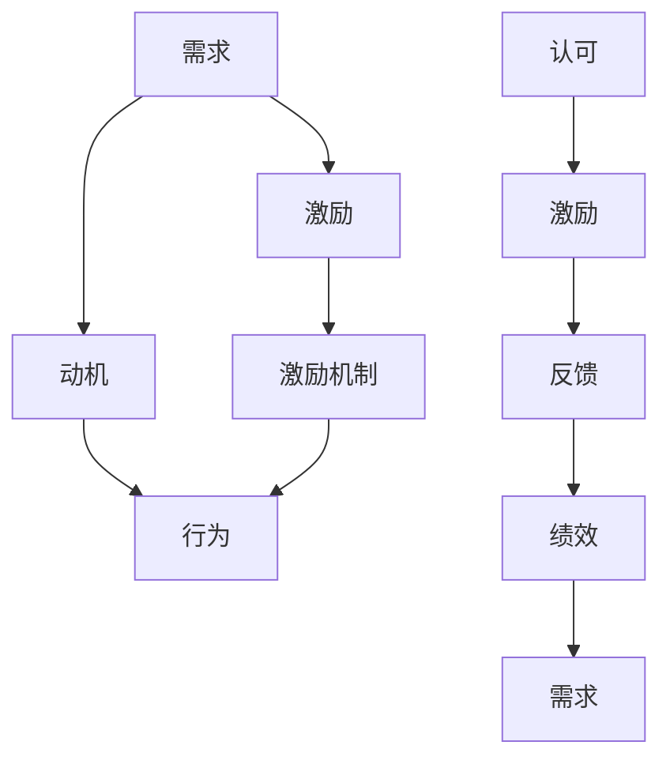

                 

### 文章标题

# 团队激励艺术精进：平衡认可与建设性反馈

### 关键词

- 团队激励
- 认可
- 建设性反馈
- 领导力
- 组织发展

### 摘要

本文旨在探讨团队激励的精粹——如何在管理实践中平衡认可与建设性反馈，以实现团队高效运作和成员个人成长。通过对相关理论基础的梳理，结合实际案例分析和实践指南，本文详细分析了团队激励的多种策略，并深入探讨了如何有效地提供和接受建设性反馈。文章旨在为IT领域及各类团队的管理者提供有价值的参考，帮助他们提升团队绩效，构建积极健康的团队文化。

## 引言

### 团队激励的背景和重要性

在信息技术迅速发展的今天，企业对人才的需求日益增加，而团队的效率和创新能力成为企业竞争的关键因素。有效的团队激励不仅能够提高团队成员的积极性和工作效率，还能促进团队的协作与创新，从而为企业带来更大的价值。团队激励的背景可以追溯到管理学和组织行为学的相关理论，特别是关于激励和反馈的研究。

首先，团队激励的定义是指通过一系列的措施和方法，激发团队成员的工作热情和创造力，以达到团队目标和个体发展的过程。激励机制可以是物质上的，如奖金和福利；也可以是精神上的，如认可和培训。激励的目的是提高团队成员的满意度和忠诚度，从而提高团队的整体绩效。

其次，团队激励的重要性体现在以下几个方面：

1. **提高工作效率**：适当的激励机制能够激发团队成员的积极性和主动性，使其更加专注于工作，从而提高工作效率。
2. **增强团队凝聚力**：通过共同的激励机制，团队成员能够形成共同的目标和价值观，增强团队凝聚力，提高团队协作效率。
3. **促进个人成长**：有效的激励不仅关注团队整体，也关注团队成员的个人成长和职业发展，有助于提升团队的整体素质。
4. **激发创新潜力**：在适当的激励下，团队成员敢于尝试新方法，提出新的想法，从而促进团队的创新和突破。

然而，在团队激励的实际操作中，管理者常常面临一个挑战，那就是如何平衡认可与建设性反馈。认可能够提升团队成员的自信心和满意度，但过度认可可能导致团队成员产生依赖性，缺乏自我驱动力。建设性反馈则有助于团队成员发现问题和改进，但不当的反馈可能会伤害团队成员的自尊心，影响团队氛围。

本文将通过对团队激励的基础理论、实践策略、建设性反馈的艺术以及实际案例的分析，帮助读者深入了解团队激励的艺术，并掌握如何在平衡认可与建设性反馈中实现团队的高效运作和个人成长。

### 文章目的

本文的目的是为IT领域及各类团队的管理者提供系统的团队激励知识和实用的操作指南，帮助他们：

1. **理解团队激励的核心理论**：通过梳理相关理论基础，帮助读者建立起团队激励的知识框架，理解激励机制的运作原理。
2. **掌握团队激励的策略与实践**：介绍多种激励策略，结合实际案例，让读者学会如何根据团队和成员的特点选择合适的激励方法。
3. **提升建设性反馈能力**：探讨如何提供和接受建设性反馈，帮助团队成员在反馈中成长，同时维护良好的团队氛围。
4. **提升团队绩效**：通过平衡认可与建设性反馈，实现团队的高效运作和持续改进。

本文的结构将分为以下几个部分：

1. **团队激励的基础理论**：介绍激励理论的发展历程、核心概念和理论基础，如赫茨伯格的双因素理论、马斯洛的需求层次理论等。
2. **团队激励的策略与实践**：详细讨论物质激励、精神激励、发展激励等策略，并给出具体案例和操作指南。
3. **建设性反馈的艺术**：探讨如何有效地提供和接受建设性反馈，以及建设性反馈在团队激励中的重要性。
4. **案例分析**：分析实际案例中的团队激励实践，总结成功的经验和教训。
5. **实践指南**：提供具体的团队激励方法和工具，帮助管理者在实际操作中取得更好的效果。
6. **总结与展望**：总结全文要点，并对团队激励的未来发展趋势进行展望。

通过本文的学习，读者将能够：

- **系统地理解团队激励的核心概念和理论**；
- **掌握多种团队激励策略和实际操作方法**；
- **提升建设性反馈能力，促进团队成长**；
- **提高团队绩效，实现个人和团队的共同发展**。

## 团队激励的基础理论

### 激励理论的发展历程

团队激励的理论基础可以追溯到20世纪初，当时管理学领域对人类行为的研究逐渐兴起。激励理论的发展历程可以分为几个主要阶段，包括早期激励理论、行为主义激励理论、认知激励理论和现代激励理论。

1. **早期激励理论**：
    - **科学管理理论**：由弗雷德里克·泰勒（Frederick Taylor）提出，强调通过科学的方法来研究和优化工作流程，以提高生产效率。
    - **人际关系理论**：由梅奥（Elton Mayo）等人提出，关注员工的情感和社交需求，认为良好的工作环境和工作关系对员工激励至关重要。

2. **行为主义激励理论**：
    - **B.F. 斯金纳的理论**：斯金纳（B.F. Skinner）提出的行为主义激励理论强调通过正面和负面强化来影响员工行为。具体包括：
        - **正面强化**：给予奖励以增加积极行为的发生概率。
        - **负面强化**：通过撤销惩罚来增加积极行为的发生概率。
        - **惩罚**：通过施加负面后果减少不良行为的发生概率。
        - **消弱**：减少或停止正强化，以减少行为的发生概率。

3. **认知激励理论**：
    - **期望理论**：维克托·弗鲁姆（Victor Vroom）提出的期望理论认为，个体的行为是由期望价值和期望概率共同决定的。公式为：
        $$\text{激励} = \text{期望价值} \times \text{期望概率}$$
    - **公平理论**：亚当斯（John Stacy Adams）提出的公平理论认为，个体会根据自我感知的公平性来评估其工作投入和回报，进而影响其工作动力和满意度。

4. **现代激励理论**：
    - **目标设置理论**：洛克（Edwin A. Locke）和莱瑟姆（Gary Latham）提出的目标设置理论认为，设定具体、有挑战性的目标能够显著提高工作绩效。
    - **自我决定理论**：德西（Deci）和瑞安（Ryan）提出的自我决定理论认为，个体的自主性、能力和归属感是激励的重要来源。

### 核心概念与联系

为了更好地理解团队激励的理论基础，我们引入几个核心概念，并探讨它们之间的联系。

1. **激励**：激励是指激发和引导个体行为的过程。激励可以是内在的，如兴趣和成就欲望；也可以是外在的，如奖励和惩罚。
2. **动机**：动机是推动个体采取特定行动的心理因素。动机可以由内部需求（如饥饿、干渴）或外部刺激（如奖励、惩罚）引起。
3. **需求**：需求是指个体对某种结果的渴望，可以来自生理、安全、社交、尊重和自我实现等多个层次。
4. **行为**：行为是指个体在动机和激励的作用下表现出的实际行动。

这些概念之间的关系可以简化为：需求激发动机，动机驱动行为，而激励则调节和引导行为。具体来说：

- **需求**：个体的基本需求（如生理需求、安全需求）驱动他们采取某些行动以满足这些需求。
- **动机**：当需求被意识到并需要满足时，个体会产生动机，这种动机激励他们采取具体行动。
- **激励**：激励是管理者通过奖励、认可、挑战等手段来调节和引导员工的行为，以实现团队目标。

### 团队激励的基本概念

在团队激励的实际应用中，管理者需要了解以下几个基本概念：

1. **X理论和Y理论**：
    - **X理论**：基于传统的管理观念，认为员工是懒惰的、缺乏自我驱动力，需要通过严格的监督和惩罚来激励。
    - **Y理论**：基于现代管理理念，认为员工是自我激励的，具有内在的成就欲望和自我实现的需求。

2. **双因素理论**：赫茨伯格（Frederick Herzberg）的双因素理论区分了激励因素和保健因素。
    - **激励因素**：与工作本身的内在满足感相关，如成就感、认可和责任感。
    - **保健因素**：与工作环境和工作条件相关，如工资、工作安全、人际关系等。

3. **公平理论**：亚当斯（John Stacy Adams）的公平理论认为，员工会将自己的工作和回报与同事进行比较，以评估自己的公平感。

### 核心概念原理之间的关系架构

为了更好地理解这些核心概念之间的联系，我们可以使用Mermaid流程图来表示：

- **需求**是激励的起点，也是动机的源头。
- **动机**驱动行为，而行为是激励的结果。
- **激励**通过激励机制（如认可、奖励）来调节行为，同时激励和反馈（如建设性反馈）共同影响绩效。

通过上述流程图，我们可以清晰地看到团队激励过程中各个概念之间的关系，从而为后续章节的具体讨论打下坚实的基础。

### 激励理论的应用

在实际管理中，不同的激励理论有着广泛的应用，以下是几种常见激励理论的实际应用案例：

1. **期望理论**：
    - **应用案例**：某IT公司新项目的开发团队在项目启动时，团队领导者制定了一个详细的任务分解表，并为每个任务设定了明确的目标和奖励机制。团队成员在完成任务后可以获得一定的奖金和额外的休假时间。通过这种方式，团队领导者利用期望理论提高了团队成员的工作积极性和项目完成度。

2. **公平理论**：
    - **应用案例**：在一个研发团队中，有成员反映他们的工作量和薪酬不如其他同事。团队领导者通过调查发现，确实存在不公平现象。为了解决这个问题，领导者重新评估了团队成员的薪酬结构，确保每个人根据其贡献获得合理的回报。这样，团队成员感受到了公平，工作积极性得到了提升。

3. **目标设置理论**：
    - **应用案例**：一家互联网公司在其年度目标制定过程中，采用了目标设置理论，为每个团队成员设定了具体、有挑战性的目标。公司通过定期的绩效评估和反馈会议，确保团队成员了解自己的目标进展，并提供必要的支持和资源。这种方法有效提高了团队的整体绩效和创新能力。

4. **自我决定理论**：
    - **应用案例**：某科技公司采用灵活的工作制度，允许员工自主选择工作时间、工作地点和项目。这种方式满足了员工的自主性和控制感，从而激发了他们的工作热情和创新精神。公司还提供了丰富的职业发展机会和培训资源，帮助员工实现个人成长和职业目标。

通过上述案例，我们可以看到，不同激励理论在实际应用中各有侧重，但目标都是提高团队效率和成员满意度。管理者需要根据团队和成员的具体情况，灵活运用这些理论，以达到最佳的激励效果。

### 团队激励的原则

在实施团队激励的过程中，管理者不仅需要了解各种激励理论，还需要掌握一系列原则，以确保激励措施的有效性和公平性。以下是团队激励中几个关键的原则：

1. **公平性原则**：
    - **定义**：公平性原则强调激励措施应当公平对待所有团队成员，不偏袒任何人。
    - **应用**：在设定激励方案时，管理者应确保每个人都有机会获得激励，避免因个人关系或其他非工作因素导致的不公平现象。

2. **可行性原则**：
    - **定义**：可行性原则要求激励措施必须在实际操作中可行，既不能过于简单，也不能过于复杂。
    - **应用**：在制定激励方案时，管理者需要评估方案的可行性，包括成本、资源和执行难度，以确保方案能够顺利实施。

3. **针对性原则**：
    - **定义**：针对性原则要求激励措施应针对团队成员的具体需求和特点进行设计。
    - **应用**：管理者应了解每个团队成员的个人背景、职业规划和兴趣爱好，从而设计出更符合个体需求的激励方案。

4. **及时性原则**：
    - **定义**：及时性原则强调激励措施应当及时给予，以便及时纠正偏差或奖励优秀表现。
    - **应用**：在团队管理中，管理者应建立及时反馈机制，对于成员的优异表现或需要改进的地方，应及时给予反馈和奖励。

这些原则在团队激励中至关重要，它们共同作用，确保激励措施的有效性和可持续性。下面通过一个示例来具体说明这些原则的应用：

假设一个软件开发团队在实施新项目时，管理者决定采用以下激励措施：

- **公平性原则**：确保所有团队成员都有机会参与项目，并在项目成功后获得奖金。为此，管理者将根据团队成员的贡献进行公平分配。
- **可行性原则**：为了确保激励措施的可行性，管理者在预算范围内设定了奖金总额，并明确了奖金的发放标准和流程。
- **针对性原则**：根据团队成员的兴趣和技能，管理者设计了不同的任务分配，确保每个人都能在项目中找到适合自己的角色，发挥最大的潜力。
- **及时性原则**：在项目完成后，管理者立即召开会议，对团队成员的表现进行评估，并及时发放奖金，以激励团队成员继续努力。

通过这样的实践，管理者不仅能够有效激励团队成员，还能增强团队的凝聚力和工作积极性，从而提高整体绩效。

### 团队激励的理论基础

在深入探讨团队激励的策略和实践之前，我们需要了解一些重要的理论基础。这些理论不仅为我们提供了理解激励机制的框架，也为实际应用提供了指导。以下是几个关键的理论基础：

#### 赫茨伯格的双因素理论

赫茨伯格（Frederick Herzberg）的双因素理论是激励理论中的一个重要里程碑。赫茨伯格区分了激励因素和保健因素，认为这两种因素对员工满意度有不同的影响。

- **激励因素**：与工作本身相关的内在因素，如成就感、认可、工作责任感等。这些因素能够激发员工的工作热情和创造力，是提升工作满意度的关键。
- **保健因素**：与工作环境和外部条件相关的因素，如工资、工作条件、公司政策等。这些因素虽然不能直接提高满意度，但缺乏它们会导致员工不满意。

双因素理论强调了内在激励的重要性，提示管理者在激励员工时，应更多地关注工作本身及其带来的内在满足感。

#### 马斯洛的需求层次理论

马斯洛（Abraham Maslow）的需求层次理论将人类需求分为五个层次：生理需求、安全需求、社交需求、尊重需求和自我实现需求。根据这一理论，员工的动机和激励来源于不同层次的需求。

- **生理需求**：包括基本的生活需求，如食物、水和住所。
- **安全需求**：包括安全感、健康保障和稳定的工作。
- **社交需求**：包括归属感、友情和亲密关系。
- **尊重需求**：包括自尊、信心和成就感。
- **自我实现需求**：包括实现个人潜能和自我价值。

管理者应根据员工所处的需求层次，设计相应的激励措施，以满足员工的多样化需求。

#### 弗鲁姆的期望理论

维克托·弗鲁姆（Victor Vroom）的期望理论认为，个体行为的动机取决于期望价值和期望概率。具体来说，公式为：

$$\text{激励} = \text{期望价值} \times \text{期望概率}$$

- **期望价值**：个体认为实现某种目标能够带来的价值。
- **期望概率**：个体认为实现某种目标的可能性。

管理者可以通过设定明确的目标和提供必要的资源，提高员工的期望价值和期望概率，从而激励员工。

#### 布莱克和穆顿的管理方格理论

布莱克（Robert Blake）和穆顿（Jane S. Mouton）的管理方格理论将管理行为分为五个维度：关注任务、关注人、领导者的支持、团队协作和冲突解决。

- **1.1型管理**：任务关注和人际关注都很低，属于不积极的管理方式。
- **9.9型管理**：任务关注和人际关注都很高，属于最佳的管理方式，强调任务完成和团队合作。
- **1.9型管理**：任务关注低，人际关注高，属于以人为中心的管理方式。
- **9.1型管理**：任务关注高，人际关注低，属于以任务为中心的管理方式。
- **5.5型管理**：任务关注和人际关注都适中，属于中等水平的管理方式。

管理者应根据团队的具体情况和目标，选择合适的管理方式，以提高团队效率和员工满意度。

#### 期望-价值模型

期望-价值模型进一步发展了弗鲁姆的期望理论，强调个体在决策过程中考虑的不仅仅是目标实现的可能性，还包括目标实现后的价值。公式为：

$$\text{激励} = \text{期望价值} \times \text{期望概率} \times \text{目标价值}$$

- **期望价值**：个体对实现目标的期望程度。
- **期望概率**：个体对实现目标的概率估计。
- **目标价值**：个体对目标实现后所带来的价值的估计。

这个模型帮助管理者更全面地理解员工的行为动机，从而设计更有效的激励方案。

#### 自我决定理论

德西（Deci）和瑞安（Ryan）的自我决定理论认为，个体的自主性、能力和归属感是激励的核心要素。自我决定理论提出了三个基本心理需求：

- **自主性需求**：个体需要感觉自己在行动中具有选择和控制的自由。
- **能力需求**：个体需要感觉自己在行动中能够胜任和成功。
- **归属感需求**：个体需要感觉自己在团队和社会中是被接受和尊重的。

管理者可以通过提供自主性、赋予责任和建立支持性团队文化，满足员工的自我决定需求，从而实现高效的团队激励。

通过了解这些理论基础，管理者可以更深刻地认识到团队激励的复杂性，并能够设计出更加科学和有效的激励方案，以促进团队的高效运作和成员的个人成长。

## 团队激励策略与实践

团队激励不仅仅是理论上的探讨，更需要具体的策略和实践来落地。在实际管理中，团队激励可以采用多种形式，每种形式都有其独特的适用场景和效果。以下是几种常见的团队激励策略及其具体实践：

### 物质激励

物质激励是最直接、最明显的一种激励方式，通过提供奖金、福利、晋升机会等物质回报来激励员工。以下是几种物质激励的具体策略：

1. **绩效奖金**：根据员工的工作表现和项目成果发放奖金，这种激励方式能够直接提高员工的工作动力。例如，某公司对完成项目的团队发放绩效奖金，奖金数额与项目完成的进度和质量挂钩。

2. **晋升机会**：通过晋升来提高员工的社会地位和收入水平，激励员工追求更高的职业目标。例如，某IT公司在年度评估中，对表现优异的员工提供晋升机会，不仅提高其薪酬，还赋予更大的责任和权力。

3. **福利制度**：提供健康保险、退休金计划、带薪休假等福利，提升员工的生活质量和满意度。例如，某互联网公司为员工提供全面的健康保险和灵活的工作时间，提高员工的工作满意度和忠诚度。

### 精神激励

精神激励侧重于满足员工的内在需求，通过提供成就感、认可、培训等非物质奖励来激发员工的积极性和创造力。以下是几种精神激励的具体策略：

1. **认可与表彰**：通过公开表彰、颁发荣誉证书等方式，对员工的工作成就和贡献进行认可。例如，某科技公司定期举办表彰大会，对年度表现突出的员工进行表彰，并邀请其家人参加，增强员工的荣誉感和归属感。

2. **培训与发展**：为员工提供职业培训和学习机会，帮助其提升技能和职业素养。例如，某金融机构为员工提供多样化的培训课程，包括专业技能培训和管理能力提升，帮助员工实现个人职业发展。

3. **工作环境优化**：创造一个积极、健康的工作环境，提升员工的工作体验。例如，某公司设置了开放式办公空间、休闲区、健身房等，提供舒适的工作环境和休闲设施，增强员工的工作满意度和归属感。

### 发展激励

发展激励旨在为员工提供职业发展的路径和机会，通过明确的职业规划、项目激励和团队合作等方式，激发员工的成长欲望和创新能力。以下是几种发展激励的具体策略：

1. **职业规划**：为员工制定详细的职业发展规划，明确其职业目标和成长路径。例如，某科技公司为每位新员工提供一对一的导师制度，导师根据员工的兴趣和能力帮助其制定职业规划，提供职业发展的指导和支持。

2. **项目激励**：鼓励员工参与有挑战性的项目，提供更多的创新机会和锻炼平台。例如，某创新型企业鼓励员工提出创新项目，并为每个项目提供资金支持和管理资源，激发员工的创新潜力和团队协作精神。

3. **团队合作**：通过团队协作，激发员工的协作精神和团队合作能力。例如，某互联网公司采用敏捷开发模式，鼓励团队内部成员进行跨职能协作，提高项目的执行效率和团队凝聚力。

### 激励策略的选择

在实际操作中，管理者需要根据团队的特点和目标选择合适的激励策略。以下是几个选择激励策略的要点：

1. **了解员工需求**：通过调查和沟通，了解员工的具体需求和期望，设计出符合员工需求的激励方案。

2. **目标一致性**：确保激励方案与团队目标和公司战略保持一致，避免激励措施的偏离。

3. **激励多样性**：结合物质激励和精神激励，提供多样化的激励方式，满足员工的多样化需求。

4. **灵活性**：根据团队和成员的实际情况，灵活调整激励方案，确保其持续有效。

通过以上策略和实践，管理者可以有效地激励团队成员，提升团队绩效，实现个人和团队的共同发展。

### 案例一：谷歌的团队激励实践

谷歌作为全球知名的科技公司，其团队激励实践被广泛赞誉，并成为许多企业的榜样。谷歌的团队激励不仅涵盖了物质激励和精神激励，还特别强调职业发展和创新文化的培育。以下是谷歌团队激励实践的几个关键点：

1. **物质激励**：
    - **丰厚的薪酬**：谷歌提供具有竞争力的薪酬待遇，包括基本工资、绩效奖金和股票期权。股票期权是谷歌独特的激励机制，旨在让员工分享公司的长期成功，从而增强员工的归属感和长期投入意愿。
    - **全面的福利**：谷歌为员工提供全面的福利，如健康保险、退休金计划、带薪休假、健身房会员等，确保员工的工作和生活质量。

2. **精神激励**：
    - **公开认可**：谷歌鼓励管理者公开认可员工的成就，通过员工表彰大会、月度最佳员工奖等方式，让员工感受到自己的工作被看见和重视。
    - **创新文化**：谷歌倡导开放、自由的工作环境，鼓励员工大胆尝试和实验。谷歌的“20%时间”项目允许员工将20%的工作时间用于自己感兴趣的项目，这一措施大大激发了员工的创造力和创新精神。

3. **职业发展**：
    - **个性化职业规划**：谷歌为员工提供个性化的职业发展机会，包括内部晋升、跨部门轮岗和专项培训等。谷歌的导师制度帮助新员工快速融入团队，并为他们提供职业发展的指导。
    - **持续学习**：谷歌提供丰富的学习资源，如在线课程、内部培训和工作坊，鼓励员工不断提升自己的技能和知识。

4. **团队协作**：
    - **跨职能团队**：谷歌鼓励跨职能团队的合作，通过项目协作和头脑风暴，提高团队的创新能力。谷歌的“快速迭代”开发模式，使团队能够快速响应市场需求，不断优化产品。

通过以上实践，谷歌成功地构建了一个积极、健康、高效的团队文化，不仅提升了员工的满意度和忠诚度，还推动了公司的高速成长和创新。谷歌的团队激励实践为其他企业提供了宝贵的经验和启示。

### 案例二：苹果的团队激励实践

苹果公司以其独特的企业文化和卓越的产品设计而闻名于世。苹果的团队激励实践不仅关注物质激励，更重视精神激励和员工个人成长，从而建立了强大的团队凝聚力和创新能力。以下是苹果团队激励实践的几个关键点：

1. **物质激励**：
    - **高薪酬和奖金**：苹果为员工提供具有竞争力的薪酬和奖金制度，包括基本工资、项目奖金和股票期权。股票期权使员工能够分享公司的成功，增强归属感和长期投入意愿。
    - **优厚的福利**：苹果为员工提供全面的福利，如健康保险、退休金计划、带薪休假、健身房会员等，确保员工的工作和生活质量。

2. **精神激励**：
    - **公开认可**：苹果强调公开认可员工的成就，通过员工表彰大会、年度最佳员工奖等方式，让员工感受到自己的工作被看见和重视。
    - **荣誉文化**：苹果鼓励员工追求卓越，通过颁发“设计卓越奖”等荣誉，表彰在产品设计、技术创新等方面有突出贡献的员工。
    - **创新文化**：苹果倡导自由探索和实验，鼓励员工大胆尝试新想法。乔布斯时期，苹果的“创新实验室”项目允许员工自由地开展研究项目，从而激发创新潜能。

3. **职业发展**：
    - **个性化职业规划**：苹果为员工提供个性化的职业发展机会，包括内部晋升、跨部门轮岗和专业培训等。苹果的导师制度帮助新员工快速融入团队，并提供职业发展的指导。
    - **持续学习**：苹果提供丰富的学习资源，如在线课程、内部培训和工作坊，鼓励员工不断提升自己的技能和知识。

4. **团队协作**：
    - **跨职能团队**：苹果强调跨职能团队的合作，通过项目协作和头脑风暴，提高团队的创新能力。苹果的“快速迭代”开发模式，使团队能够快速响应市场需求，不断优化产品。
    - **团队合作**：苹果鼓励团队成员之间的紧密合作和信任，通过团队建设活动和协作工具，增强团队凝聚力和工作效率。

通过以上实践，苹果成功地构建了一个积极、健康、高效的团队文化，不仅提升了员工的满意度和忠诚度，还推动了公司的高速成长和卓越表现。苹果的团队激励实践为其他企业提供了宝贵的经验和启示。

### 建设性反馈的概念与意义

建设性反馈是团队激励中不可或缺的一环，它不仅有助于提升团队成员的工作表现，还能促进团队整体的发展和进步。建设性反馈的概念可以简单定义为：通过提供具体的、积极的建议和指导，帮助团队成员改进工作，提高绩效的过程。

#### 建设性反馈的特点

1. **具体性**：建设性反馈应具体指出团队成员在哪些方面做得好，哪些方面需要改进。这种具体性有助于团队成员明确改进的方向，而不是笼统地提意见。
2. **积极性**：建设性反馈应采用积极的语言和态度，避免批评和指责，而是通过肯定和鼓励来激发团队成员的积极性。
3. **及时性**：建设性反馈应当及时给予，以便团队成员能够尽快采取行动，改进工作。延迟的反馈可能会削弱其效果，导致问题长期得不到解决。

#### 建设性反馈的意义

1. **促进个人成长**：通过建设性反馈，团队成员能够及时了解自己的不足，并采取相应的措施进行改进，从而提高个人能力和职业素养。
2. **提升团队绩效**：建设性反馈有助于发现团队中的潜在问题，并通过改进措施提升团队的整体绩效和协作效率。
3. **增强团队凝聚力**：及时、恰当的建设性反馈能够增进团队成员之间的信任和理解，从而增强团队的凝聚力和合作精神。

#### 建设性反馈与批评的区别

虽然建设性反馈和批评都涉及对团队成员工作的评价，但两者的目的和方式有显著区别：

1. **目的不同**：
    - **建设性反馈**：旨在帮助团队成员改进工作，提高绩效。
    - **批评**：通常是为了指出团队成员的错误或不足，可能带有指责或负面情绪。

2. **方式不同**：
    - **建设性反馈**：采用积极、具体的语言，强调改进的方向和方法。
    - **批评**：可能使用否定、指责的措辞，容易引起团队成员的防御心理。

通过区分建设性反馈与批评，管理者能够更有效地提供有建设性的反馈，促进团队成员的成长和团队的发展。

### 提供建设性反馈的技巧

提供建设性反馈是一门艺术，需要管理者具备一定的沟通技巧和人际交往能力。以下是一些有效的技巧，帮助管理者在提供建设性反馈时更加得体和有效。

#### 1. 选择合适的时机和环境

- **合适的时机**：选择一个团队成员情绪稳定、专注的时段进行反馈，避免在会议或公开场合中突然提出。
- **私密的环境**：在私下、安静的环境中与团队成员进行一对一的反馈，确保反馈内容的私密性和针对性。

#### 2. 使用积极语言

- **肯定优点**：在反馈中首先肯定团队成员做得好的方面，增强其自信心和积极性。
- **具体描述**：使用具体的语言描述问题，避免使用模糊、笼统的表述，如“做得不够好”应改为“这个部分的图表可以更清晰明了”。

#### 3. 提供具体建议

- **明确建议**：提供明确的改进建议，而不是抽象的建议，如“你可以做得更好”应改为“你可以尝试增加图表的对比度，使其更加直观易懂”。
- **可行方案**：确保建议是实际可行的，避免提出无法实现的建议，从而让团队成员感到无助和困惑。

#### 4. 避免指责和负面情绪

- **客观陈述**：避免使用带有指责或负面情绪的语言，如“你错了”应改为“这个方法可能不太合适，我们可以尝试另一种方式”。
- **关注问题而非人**：将反馈集中在具体的工作表现和改进建议上，而不是对个人进行评价。

#### 5. 开放式问题

- **引导思考**：使用开放式问题引导团队成员进行自我反思和深入思考，如“你认为我们可以如何改进这个部分？”而不是直接给出答案。

### 案例说明

以下是一个具体案例，说明如何有效地提供建设性反馈：

**情境**：一名软件开发人员在项目中期提交的代码质量不高，导致项目进度延误。

**步骤**：

1. **选择合适时机和环境**：在项目例会结束后，与该软件开发人员安排一个私密的一对一会议。
2. **使用积极语言**：“首先，我想肯定你在项目中的一些亮点，比如你在数据库设计方面做得很好，这为后续开发奠定了坚实的基础。”
3. **提供具体建议**：“然而，在代码质量方面，我们发现有些部分存在逻辑错误和代码冗余。你可以尝试使用更规范的编码风格，并使用单元测试来确保代码的可靠性。”
4. **避免指责和负面情绪**：“我们理解这是一个复杂的项目，有时出现问题是正常的。关键是我们要找到解决问题的方法，并避免类似问题的再次发生。”
5. **开放式问题**：“你觉得我们可以如何改进这个部分的代码？你有任何建议吗？”

通过以上步骤，管理者不仅提供了具体的改进建议，还保持了良好的沟通氛围，有助于团队成员接受反馈并积极改进。

### 接受建设性反馈的技巧

在团队中，接受建设性反馈是一项重要的能力，这不仅有助于个人成长，还能促进团队整体的发展。以下是几种有效的技巧，帮助团队成员更好地接受建设性反馈：

#### 1. 保持开放心态

- **接受反馈**：以积极的心态对待建设性反馈，将其视为成长和改进的机会，而不是批评或指责。
- **避免防御**：避免在收到反馈时立即进入防御状态，这可能会阻碍有效的沟通。相反，保持冷静，倾听对方的观点。

#### 2. 提问与澄清

- **提出疑问**：在理解反馈之前，不要急于做出回应。通过提问，可以帮助自己更深入地理解反馈内容，如“您提到我在代码质量方面存在问题，具体是指哪部分？是否有具体的例子可以参考？”
- **澄清意图**：确保自己准确理解反馈者的意图，如“您的反馈是为了帮助我改进工作，还是出于其他原因？”

#### 3. 采取行动

- **制定计划**：在理解反馈后，制定具体的改进计划，包括具体的目标、行动步骤和时间表。
- **执行计划**：按照制定的计划采取行动，确保反馈能够转化为实际改进。

#### 4. 表达感激

- **表示感谢**：对给予反馈的人表示感谢，如“感谢您对我的工作提出宝贵的反馈，我会认真考虑并努力改进。”
- **积极回应**：在后续工作中，及时反馈改进进展，展示自己对于反馈的重视和行动力。

#### 5. 反馈效果评估

- **定期评估**：在改进计划实施一段时间后，对反馈效果进行评估，确保改进措施的有效性。
- **调整策略**：如果反馈效果不佳，及时调整改进策略，重新制定计划。

### 案例说明

以下是一个具体案例，说明如何有效地接受建设性反馈：

**情境**：一名产品经理收到开发团队关于其产品设计的建设性反馈，指出部分设计流程存在效率问题。

**步骤**：

1. **保持开放心态**：产品经理在收到反馈后，立即调整心态，将其视为改进的机会。
2. **提问与澄清**：“您提到我们的设计流程存在效率问题，能否详细说明具体的问题点？是否有相关的数据支持？”
3. **制定计划**：在了解具体问题后，产品经理制定了改进计划，包括缩短设计会议时间、优化设计文档流程等。
4. **表达感激**：“非常感谢您的宝贵反馈，我会认真考虑并尽快实施改进措施。”
5. **采取行动**：根据改进计划，产品经理逐步实施各项措施，并在团队内通报进展。
6. **反馈效果评估**：在改进措施实施后，定期评估效果，并根据评估结果调整策略。

通过以上步骤，产品经理不仅有效地接受了建设性反馈，还推动了团队整体效率的提升。

### 案例分析一：谷歌的团队激励实践

谷歌作为全球知名的企业，以其独特的团队激励实践而闻名。以下是谷歌在团队激励方面的具体实践、效果及挑战。

#### 具体实践

1. **物质激励**：
    - **高薪酬和奖金**：谷歌提供具有竞争力的薪酬和奖金制度，包括基本工资、绩效奖金和股票期权。股票期权使得员工能够分享公司的长期成功，增强了员工的归属感和长期投入意愿。
    - **全面福利**：谷歌为员工提供全面的福利，如健康保险、退休金计划、带薪休假、健身房会员等，确保员工的生活质量。

2. **精神激励**：
    - **公开认可**：谷歌鼓励管理者公开认可员工的成就，通过员工表彰大会、月度最佳员工奖等方式，让员工感受到自己的工作被看见和重视。
    - **创新文化**：谷歌倡导开放、自由的工作环境，鼓励员工大胆尝试和实验。谷歌的“20%时间”项目允许员工将20%的工作时间用于自己感兴趣的项目，激发了员工的创造力和创新精神。

3. **职业发展**：
    - **个性化职业规划**：谷歌为员工提供个性化的职业发展机会，包括内部晋升、跨部门轮岗和专项培训等。谷歌的导师制度帮助新员工快速融入团队，并提供职业发展的指导。
    - **持续学习**：谷歌提供丰富的学习资源，如在线课程、内部培训和工作坊，鼓励员工不断提升自己的技能和知识。

4. **团队协作**：
    - **跨职能团队**：谷歌鼓励跨职能团队的合作，通过项目协作和头脑风暴，提高团队的创新能力。谷歌的“快速迭代”开发模式，使团队能够快速响应市场需求，不断优化产品。
    - **团队合作**：谷歌鼓励团队成员之间的紧密合作和信任，通过团队建设活动和协作工具，增强团队凝聚力和工作效率。

#### 效果

1. **员工满意度**：谷歌的团队激励实践显著提升了员工满意度。根据Glassdoor的调查，谷歌的员工满意度高达91%，远高于其他科技公司。
2. **创新能力**：通过“20%时间”项目和开放的创新文化，谷歌在多个领域取得了重大突破，如Google Maps、Gmail和Google News等。
3. **团队凝聚力**：谷歌的跨职能团队合作和团队合作活动，增强了团队成员之间的信任和协作精神，提高了团队的整体绩效。

#### 挑战

1. **管理复杂性**：随着团队规模的扩大，管理复杂性增加，如何确保每个团队成员都能得到公平的激励和认可成为挑战。
2. **员工流动率**：尽管谷歌提供了丰厚的薪酬和福利，但仍然存在一定程度的员工流动率，如何留住优秀人才成为挑战。
3. **文化冲突**：谷歌的开放和创新文化可能会与其他企业的传统文化产生冲突，如何平衡不同文化的差异也是挑战之一。

通过上述案例分析，我们可以看到，谷歌的团队激励实践在提升员工满意度、创新能力和团队凝聚力方面取得了显著效果，但也面临着一些挑战。这些经验和教训为其他企业提供了宝贵的参考和启示。

### 案例分析二：苹果的团队激励实践

苹果公司以其卓越的产品设计和强大的企业文化而闻名于世。以下是苹果在团队激励方面的具体实践、效果及挑战。

#### 具体实践

1. **物质激励**：
    - **高薪酬和奖金**：苹果为员工提供具有竞争力的薪酬和奖金制度，包括基本工资、项目奖金和股票期权。股票期权使员工能够分享公司的成功，增强了员工的归属感和长期投入意愿。
    - **优厚的福利**：苹果为员工提供全面的福利，如健康保险、退休金计划、带薪休假、健身房会员等，确保员工的工作和生活质量。

2. **精神激励**：
    - **公开认可**：苹果强调公开认可员工的成就，通过员工表彰大会、年度最佳员工奖等方式，让员工感受到自己的工作被看见和重视。
    - **荣誉文化**：苹果鼓励员工追求卓越，通过颁发“设计卓越奖”等荣誉，表彰在产品设计、技术创新等方面有突出贡献的员工。
    - **创新文化**：苹果倡导自由探索和实验，鼓励员工大胆尝试新想法。乔布斯时期，苹果的“创新实验室”项目允许员工自由地开展研究项目，从而激发创新潜能。

3. **职业发展**：
    - **个性化职业规划**：苹果为员工提供个性化的职业发展机会，包括内部晋升、跨部门轮岗和专业培训等。苹果的导师制度帮助新员工快速融入团队，并提供职业发展的指导。
    - **持续学习**：苹果提供丰富的学习资源，如在线课程、内部培训和工作坊，鼓励员工不断提升自己的技能和知识。

4. **团队协作**：
    - **跨职能团队**：苹果强调跨职能团队的合作，通过项目协作和头脑风暴，提高团队的创新能力。苹果的“快速迭代”开发模式，使团队能够快速响应市场需求，不断优化产品。
    - **团队合作**：苹果鼓励团队成员之间的紧密合作和信任，通过团队建设活动和协作工具，增强团队凝聚力和工作效率。

#### 效果

1. **员工满意度**：苹果的团队激励实践显著提升了员工满意度。根据Glassdoor的调查，苹果的员工满意度高达89%，在科技行业中名列前茅。
2. **产品创新**：通过鼓励创新和卓越设计，苹果推出了多款颠覆性产品，如iPhone、iPad和Apple Watch等，这些产品不仅赢得了消费者的喜爱，还提升了公司的市场份额和品牌价值。
3. **团队凝聚力**：苹果的跨职能团队合作和团队合作活动，增强了团队成员之间的信任和协作精神，提高了团队的整体绩效。

#### 挑战

1. **高度竞争**：作为科技行业的领军企业，苹果面临着激烈的竞争环境，如何在保持创新能力的同时，吸引和留住优秀人才成为挑战。
2. **创新压力**：苹果在创新方面有着极高的标准，任何失败的产品都可能对公司形象和业绩产生重大影响，如何平衡创新风险和市场需求也是挑战之一。
3. **文化冲突**：苹果的封闭创新文化和一些客户对透明度的期望之间可能存在冲突，如何在保持创新的同时，满足客户的需求和期望是苹果面临的挑战。

通过上述案例分析，我们可以看到，苹果的团队激励实践在提升员工满意度、产品创新和团队凝聚力方面取得了显著效果，但也面临着一些挑战。这些经验和教训为其他企业提供了宝贵的参考和启示。

### 实践指南一：制定团队激励计划

为了实现团队的高效运作和成员的个人成长，管理者需要制定一个全面的团队激励计划。以下是制定团队激励计划的具体步骤和方法：

#### 1. 确定团队目标

- **明确目标**：首先，明确团队的目标和期望成果。这些目标可以是具体的业务指标、项目进度、团队文化等。
- **目标分解**：将团队目标分解为具体的、可衡量的子目标，以便于后续的评估和激励。

#### 2. 分析团队成员需求

- **需求调查**：通过调查问卷、一对一访谈等方式，了解团队成员的需求和期望，包括物质需求（如薪酬、福利）和精神需求（如认可、培训）。
- **需求分类**：根据调查结果，将团队成员的需求分类，如基本需求、发展需求、成就需求等。

#### 3. 设计激励方案

- **激励策略**：根据团队成员的需求和团队目标，设计多种激励策略，包括物质激励（如奖金、股票期权、福利）和精神激励（如认可、培训、职业发展）。
- **方案组合**：结合不同的激励策略，设计一个综合的激励方案，以满足团队成员的多样化需求。

#### 4. 实施与监督

- **实施计划**：制定详细的实施计划，包括激励措施的执行时间表、责任人、具体执行步骤等。
- **监督机制**：建立监督机制，定期检查激励措施的实施情况和效果，及时调整和优化激励方案。

#### 案例说明

以某IT公司的团队激励计划为例：

1. **确定团队目标**：公司目标是在未来一年内，将软件产品的市场占有率提高10%。将此目标分解为具体的子目标，如项目完成率、客户满意度、开发效率等。

2. **分析团队成员需求**：通过调查问卷和访谈，发现团队成员的需求主要集中在以下几个方面：基本薪酬、项目奖金、职业发展机会、培训资源。

3. **设计激励方案**：

    - **物质激励**：
        - **项目奖金**：根据项目的完成进度和质量，为团队成员发放项目奖金。
        - **股票期权**：为关键岗位的员工提供股票期权，使其能够分享公司的长期成功。
        - **福利**：提供全面的福利，包括健康保险、退休金计划、带薪休假等。

    - **精神激励**：
        - **认可与表彰**：通过定期举办的表彰大会，对表现优秀的员工进行公开表彰。
        - **职业发展**：提供多样化的培训课程和职业发展机会，帮助员工提升技能和职业素养。
        - **创新激励**：鼓励员工提出创新项目，并为每个项目提供资金支持和管理资源。

4. **实施与监督**：

    - **实施计划**：制定详细的实施计划，包括每个激励措施的执行时间表和责任人。
    - **监督机制**：定期检查激励措施的实施情况和效果，如通过员工满意度调查和项目完成情况进行评估。

通过以上步骤，管理者能够制定出一个全面、有效的团队激励计划，提升团队绩效和成员满意度。

### 实践指南二：建设性反馈的实施

为了在团队中有效实施建设性反馈，管理者需要建立一套系统化的反馈机制，并确保反馈的及时性和有效性。以下是建设性反馈的实施步骤和方法：

#### 1. 设定反馈机制

- **明确反馈目的**：明确建设性反馈的目的，是帮助团队成员改进工作，提高绩效。
- **制定反馈计划**：根据团队目标和员工需求，制定详细的反馈计划，包括反馈的时间、频率、形式等。
- **明确反馈流程**：确定反馈的流程，包括反馈的发起、收集、分析和反馈的传达。

#### 2. 定期反馈会议

- **定期召开反馈会议**：定期组织反馈会议，为团队成员提供反馈的机会。反馈会议可以是每周或每月一次，根据团队的具体情况进行调整。
- **会议议程**：在反馈会议中，明确会议议程，包括反馈的接收、反馈的讨论、改进措施的制定等。
- **会议记录**：记录每次反馈会议的内容，包括反馈的具体意见、改进措施和时间表。

#### 3. 反馈记录与跟踪

- **建立反馈记录**：建立反馈记录系统，记录每次反馈的具体内容、反馈者和反馈对象的姓名、反馈的时间等。
- **跟踪改进措施**：跟踪团队成员根据反馈采取的改进措施，确保反馈能够转化为实际的改进效果。
- **定期评估**：定期对反馈效果进行评估，包括团队成员的工作表现、改进措施的执行情况等。

#### 4. 反馈效果评估

- **评估反馈效果**：通过定期的评估，了解建设性反馈的实际效果，如团队成员的工作满意度、绩效提升等。
- **优化反馈机制**：根据评估结果，对反馈机制进行调整和优化，以提高反馈的有效性和持续性。

#### 案例说明

以某软件开发团队的反馈实施为例：

1. **设定反馈机制**：

    - **明确反馈目的**：帮助团队成员发现和解决问题，提高代码质量和项目进度。
    - **制定反馈计划**：每周五下午举行一次反馈会议，每次会议持续一小时。
    - **明确反馈流程**：团队成员可以在会议前提交反馈意见，会议中讨论并制定改进措施。

2. **定期反馈会议**：

    - **定期召开反馈会议**：每周五下午举行反馈会议，每次会议由项目经理主持。
    - **会议议程**：会议议程包括团队成员的工作总结、存在的问题、改进措施的讨论等。
    - **会议记录**：记录每次会议的内容，包括反馈的具体意见和改进措施。

3. **反馈记录与跟踪**：

    - **建立反馈记录**：建立反馈记录文档，记录每次反馈的具体内容、反馈者和反馈对象的姓名。
    - **跟踪改进措施**：项目经理负责跟踪团队成员的改进措施，确保问题得到解决。
    - **定期评估**：每月底对反馈效果进行评估，包括团队成员的工作表现、改进措施的执行情况。

4. **反馈效果评估**：

    - **评估反馈效果**：通过月度评估，了解反馈的实际效果，如代码质量提升、项目进度加快等。
    - **优化反馈机制**：根据评估结果，优化反馈会议的时间和形式，以提高反馈的持续性和有效性。

通过以上步骤，软件开发团队有效地实施了建设性反馈，提升了团队的协作效率和项目质量。

### 总结与展望

在本文中，我们探讨了团队激励的核心概念、理论基础、策略与实践，以及建设性反馈的艺术。通过深入分析，我们可以得出以下主要结论：

1. **团队激励的重要性**：团队激励不仅是提升工作效率和团队凝聚力的关键，也是促进个人成长和实现团队目标的重要手段。
2. **平衡认可与建设性反馈**：在团队激励中，认可和建设性反馈是相辅相成的。认可能够提升团队成员的积极性和满意度，而建设性反馈则有助于团队成员发现问题和持续改进。
3. **多种激励策略**：物质激励、精神激励和发展激励在团队激励中各有其优势，管理者应根据团队和成员的具体需求，灵活运用不同的激励策略。
4. **建设性反馈的艺术**：提供和接受建设性反馈是团队发展的关键。有效的建设性反馈不仅有助于团队成员改进工作，还能增强团队凝聚力和协作精神。

### 未来发展趋势

随着信息技术和人工智能的发展，团队激励也在不断演进。以下是几个可能的发展趋势：

1. **个性化激励**：未来的团队激励将更加注重个性化，根据每个团队成员的个性、需求和职业目标，量身定制激励方案。
2. **数字化反馈**：利用大数据和人工智能技术，实现反馈的数字化和自动化，提高反馈的精准度和及时性。
3. **可持续激励**：随着环保和可持续发展理念的普及，未来的团队激励将更加注重社会责任和可持续发展，包括绿色激励、公益项目等。
4. **全球团队协作**：全球化进程加速，未来团队将更加多元化，管理者需要掌握跨文化的团队激励方法，提高全球团队的协作效率。

### 总结与展望

通过本文的探讨，我们不仅深化了对团队激励的理解，也为实际操作提供了具体的指导和案例。希望读者能够将这些理论和实践应用到实际工作中，提升团队绩效和成员满意度，实现个人和团队的共同成长。未来，随着技术和环境的变化，团队激励将不断演变，但核心原则和目标始终不变，那就是激发团队成员的潜能，共同推动团队和组织的持续发展。

## 作者信息

### 作者：AI天才研究院/AI Genius Institute & 禅与计算机程序设计艺术 /Zen And The Art of Computer Programming

作者简介：AI天才研究院（AI Genius Institute）是一家专注于人工智能与计算机科学研究的国际性学术机构，致力于推动人工智能领域的创新与发展。同时，作者也是《禅与计算机程序设计艺术》（Zen And The Art of Computer Programming）一书的作者，该书被誉为计算机编程领域的经典之作，对全球计算机科学产生了深远影响。作者拥有丰富的理论知识和实践经验，在人工智能、编程技术和组织管理等方面有着卓越的贡献。

