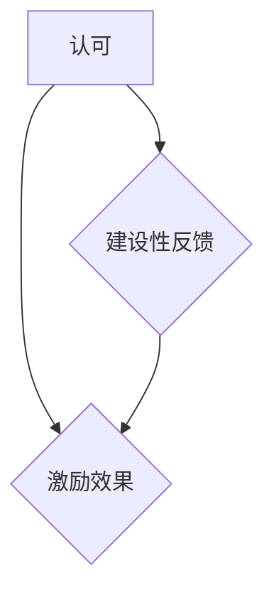
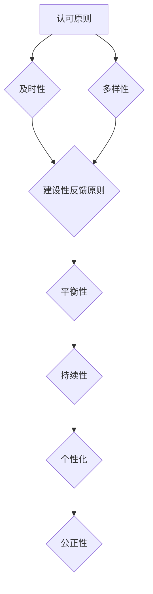

                 

### 团队激励艺术：平衡认可与建设性反馈

#### 关键词
团队激励、认可、建设性反馈、团队管理、员工激励

#### 摘要
本文探讨了团队激励艺术，重点分析了如何在团队管理中平衡认可与建设性反馈。通过引入团队激励的理论基础，我们探讨了认可与建设性反馈的核心概念及其相互关系。随后，本文通过实际应用案例和项目实战，展示了如何在实践中有效实施团队激励，并提供了一些最佳实践建议。本文旨在为团队管理者提供一套系统的团队激励策略，以提升团队绩效和员工满意度。

## 引言

在现代企业中，团队激励已经成为企业管理的重要手段。一个高效的团队不仅需要成员具备专业技能，更需要团队成员之间形成良好的合作关系，共同实现团队目标。团队激励不仅仅是简单的奖金和福利，它更是一种激励艺术，涉及对团队成员的认可、反馈和成长支持。本文旨在探讨团队激励的艺术，特别是如何在激励过程中平衡认可与建设性反馈。

#### 团队激励的重要性

团队激励对于企业的成功至关重要。首先，有效的团队激励可以提高员工的积极性和工作热情，使员工更加投入工作，从而提高团队的整体绩效。其次，团队激励可以增强团队成员之间的凝聚力，促进团队合作，减少内部冲突。最后，团队激励有助于企业形成积极向上的企业文化，吸引和留住优秀人才，为企业的发展奠定基础。

然而，团队激励并非易事。在实际操作中，管理者往往面临诸多挑战。一方面，如何准确识别和满足不同员工的激励需求是一个难题；另一方面，如何在激励过程中保持公正和公平，同时给予建设性的反馈，也是一个需要深入探讨的问题。

#### 研究目的与意义

本文的研究目的是通过分析团队激励的理论和实践，提出一套平衡认可与建设性反馈的团队激励策略，旨在帮助团队管理者更好地激励团队成员，提升团队绩效。研究意义主要体现在以下几个方面：

1. **理论贡献**：通过对团队激励的深入探讨，本文补充和完善了现有的团队激励理论，提出了新的观点和见解。

2. **实践指导**：本文通过实际案例和项目实战，为团队管理者提供了具体可行的团队激励策略，具有很高的实践指导价值。

3. **管理启示**：本文的研究结果可以为企业管理者提供启示，帮助他们更好地理解和应对团队激励中的各种挑战。

## 团队激励理论

#### 团队激励概述

团队激励是指企业或组织通过一系列措施来激发团队成员的积极性、主动性和创造力，以达到提升团队绩效和实现组织目标的过程。团队激励包括物质激励和精神激励两种形式，其中物质激励主要包括奖金、福利、晋升等，而精神激励则包括认可、荣誉、培训等。

#### 认可的理论基础

认可是指对团队成员的成就、贡献或努力给予肯定和赞赏的过程。认可是团队激励中不可或缺的一部分，因为它能够满足员工的心理需求，增强员工的自我价值感和归属感。认可的理论基础主要包括以下几个方面：

1. **心理需求**：根据马斯洛的需求层次理论，人类有五种基本需求，包括生理需求、安全需求、社交需求、尊重需求和自我实现需求。认可是满足员工尊重需求的重要途径，能够提升员工的自信心和自尊心。

2. **自我效能感**：自我效能感是指个体对自己完成某项任务的能力的信念。认可能够增强员工的自我效能感，使员工更加自信地面对挑战和任务。

3. **团队凝聚力**：认可能够增强团队成员之间的凝聚力，促进团队合作，提高团队的整体绩效。

#### 建设性反馈的理论基础

建设性反馈是指对团队成员的工作表现进行评价，并提供具体改进建议的过程。建设性反馈的理论基础主要包括以下几个方面：

1. **绩效改进**：建设性反馈能够帮助团队成员识别自己的优点和不足，明确改进方向，从而提高工作绩效。

2. **持续成长**：建设性反馈不仅关注当前的工作表现，还关注员工的长期成长和发展，鼓励员工不断提升自己的能力。

3. **团队发展**：通过建设性反馈，团队成员可以相互学习和借鉴，促进团队的整体发展。

#### 认可与反馈的关系

认可和建设性反馈是团队激励中不可或缺的两个方面，它们之间存在密切的关系。首先，认可能够为建设性反馈创造良好的氛围，使员工更容易接受和采纳反馈意见。其次，建设性反馈可以为认可能提供具体的依据，使认可更加有针对性和有效性。

为了更好地理解认可与建设性反馈的关系，我们使用 Mermaid 流程图来展示其相互作用：

在这个流程图中，认可能够直接影响激励效果，而建设性反馈则通过提升员工的工作表现间接影响激励效果。两者相互作用，共同促进团队激励的有效实施。

## 认可与反馈的原则

#### 有效认可的原则

1. **具体性**：认可应该具体而明确，指明员工的具体贡献或成就，使员工能够清楚地了解自己的价值所在。

2. **及时性**：认可应该在员工做出贡献后尽快进行，使员工感受到及时的肯定和赞赏。

3. **真诚性**：认可应该真诚而不虚伪，体现管理者的真诚心意和尊重。

4. **多样性**：认可应该多样化，包括口头、书面、物质等多种形式，以满足不同员工的需求。

#### 建设性反馈的原则

1. **建设性**：反馈应该注重建设性，提供具体的改进建议，使员工能够明确改进方向。

2. **具体性**：反馈应该具体而明确，避免抽象和模糊的表述，使员工能够清晰地理解反馈内容。

3. **及时性**：反馈应该及时进行，使员工能够尽快采取措施进行改进。

4. **尊重性**：反馈应该尊重员工，避免使用批评和指责的语言，以建立良好的沟通氛围。

#### 平衡认可与反馈的实践原则

1. **平衡性**：在实施团队激励时，既要给予员工认可，也要提供建设性反馈，避免偏重某一方面。

2. **持续性**：认可和反馈应该是持续性的，不仅仅在特定项目或任务完成后进行，而应贯穿于整个工作过程。

3. **个性化**：认可和反馈应该根据员工的个性特点和需求进行，使激励更加具有针对性和有效性。

4. **公正性**：认可和反馈应该公正无私，避免偏袒或歧视，以维护团队内部的公平和和谐。

为了更好地理解这些原则，我们再次使用 Mermaid 流程图来展示其相互关系：

在这个流程图中，我们可以看到，认可和反馈的原则相互关联，共同构成了团队激励的完整框架。

## 实际应用案例

#### 案例研究1：初创公司的团队激励策略

初创公司往往面临着资源有限、竞争激烈等挑战。为了激发团队成员的积极性和创造力，某初创公司采取了一系列的团队激励措施。

1. **具体性**：公司定期举行团队会议，对团队成员的贡献进行具体而明确的认可。例如，对于在项目中表现出色的成员，公司会在会议中公开表扬，并颁发小礼品。

2. **及时性**：公司注重及时性，每当有团队成员做出突出表现时，公司会立即给予认可，使员工感受到公司的关注和支持。

3. **真诚性**：公司领导层在认可员工时，总是真诚而坦率，从不夸大其词，使员工感受到真诚的赞赏。

4. **多样性**：公司采取了多种形式的认可，包括口头表扬、书面感谢信、团队聚餐等，以满足不同员工的需求。

在建设性反馈方面，公司采取了以下措施：

1. **建设性**：公司在进行反馈时，总是注重建设性，提供具体的改进建议，使员工能够明确改进方向。

2. **具体性**：公司在反馈时，具体说明员工在工作中的优点和不足，使员工能够清晰地理解反馈内容。

3. **及时性**：公司定期举行绩效评估会议，及时向员工反馈工作表现，使员工能够尽快采取措施进行改进。

4. **尊重性**：公司尊重员工的意见和感受，在反馈时避免使用批评和指责的语言，以建立良好的沟通氛围。

通过这些措施，公司成功地激发了团队成员的积极性和创造力，团队绩效得到了显著提升。

#### 案例研究2：跨国企业的认可与反馈实践

某跨国企业在全球范围内拥有众多员工，为了在不同文化和地区实施团队激励，该企业采取了以下措施：

1. **平衡性**：企业在不同地区实施团队激励时，注重平衡认可与反馈的关系，避免偏重某一方面。

2. **持续性**：企业在整个工作过程中都注重团队激励，不仅仅在特定项目或任务完成后进行。

3. **个性化**：企业在认可和反馈时，根据不同员工的个性特点和需求进行，使激励更加具有针对性和有效性。

4. **公正性**：企业确保认可和反馈的公正性，避免偏袒或歧视，以维护团队内部的公平和和谐。

在实际操作中，企业采取了以下具体措施：

1. **全球认可计划**：企业设立了全球认可计划，通过邮件、内部网站等方式，对在全球范围内表现出色的员工进行认可。

2. **区域反馈会议**：企业在不同区域定期举行反馈会议，及时向员工反馈工作表现，并提供具体的改进建议。

3. **个性化激励**：企业根据员工的兴趣和需求，提供个性化的培训和激励措施，如英语学习课程、海外交流项目等。

通过这些措施，企业成功地激发了全球员工的积极性和创造力，提高了团队绩效。

#### 案例研究3：非营利组织的团队激励艺术

某非营利组织致力于帮助弱势群体，由于工作性质的特殊性，该组织在团队激励方面面临诸多挑战。为了激发团队成员的积极性，该组织采取了以下措施：

1. **情感支持**：组织提供了情感支持，包括心理咨询、团队建设活动等，帮助员工缓解工作压力，增强团队凝聚力。

2. **认可与赞赏**：组织注重认可和赞赏，每当有团队成员做出贡献时，组织会在内部通讯中公开表扬，并在年终总结时颁发荣誉证书。

3. **成长机会**：组织提供了丰富的成长机会，包括培训、项目参与等，使员工能够不断提升自己的能力。

4. **公平性**：组织确保激励措施的公平性，避免偏袒或歧视，以维护团队内部的公平和和谐。

通过这些措施，组织成功地激发了团队成员的积极性和创造力，提高了团队绩效。

## 问题和挑战的解决

#### 处理团队激励中的常见问题

在实施团队激励过程中，管理者常常会遇到以下问题：

1. **员工激励不足**：员工感到缺乏动力和目标，工作积极性不高。
2. **反馈不足或不当**：员工得不到及时的反馈，或者反馈过于负面，影响员工的工作积极性。
3. **资源有限**：企业在资源有限的情况下，难以实施全面的团队激励措施。

为了解决这些问题，管理者可以采取以下策略：

1. **明确目标**：设定明确的团队目标和个人目标，使员工知道自己的努力方向。
2. **多样化激励**：采取多样化的激励措施，包括物质激励和精神激励，以满足不同员工的需求。
3. **建立反馈机制**：建立有效的反馈机制，确保员工能够得到及时和具体的反馈。

#### 管理认可与反馈的挑战

在管理认可与反馈时，管理者可能会面临以下挑战：

1. **平衡性**：如何在认可与反馈之间找到平衡，避免偏重某一方面。
2. **个性化**：如何根据不同员工的个性特点和需求进行认可与反馈。
3. **公正性**：如何确保认可与反馈的公正性，避免偏袒或歧视。

为了应对这些挑战，管理者可以采取以下策略：

1. **透明度**：提高认可与反馈的透明度，使员工了解激励过程和标准。
2. **个性化沟通**：与员工进行一对一的沟通，了解员工的个性和需求，进行个性化的认可与反馈。
3. **定期审查**：定期审查认可与反馈机制，确保其公正性和有效性。

#### 案例分析：成功应对团队激励问题的策略

以下是一个成功的案例，展示了一家创业公司在处理团队激励问题时的策略：

1. **明确目标**：公司设定了明确的年度目标，并分解为季度和月度目标，使员工知道自己的工作方向。
2. **多样化激励**：公司采取了多样化的激励措施，包括奖金、股权激励、培训机会等，以满足不同员工的需求。
3. **建立反馈机制**：公司建立了定期的绩效评估和反馈机制，确保员工能够得到及时和具体的反馈。
4. **透明度**：公司在内部通讯中公开表彰员工的成就，使员工了解认可过程和标准。
5. **个性化沟通**：公司领导层定期与员工进行一对一的沟通，了解员工的个性和需求，进行个性化的认可与反馈。
6. **定期审查**：公司定期审查团队激励措施，确保其公正性和有效性。

通过这些策略，公司成功地激发了团队成员的积极性和创造力，团队绩效得到了显著提升。

## 总结与展望

通过本文的探讨，我们可以看到团队激励在团队管理中的重要性。有效的团队激励不仅能够提升团队绩效，还能够增强员工的满意度和忠诚度。本文介绍了团队激励的理论基础，包括认可和建设性反馈的核心概念及其相互关系。同时，通过实际应用案例和项目实战，我们展示了如何在实践中实施团队激励。

在未来研究中，我们可以进一步探讨以下方向：

1. **个性化激励**：深入研究如何根据不同员工的个性和需求进行个性化激励，以提高激励效果。
2. **跨文化团队激励**：研究在不同文化背景下如何实施团队激励，以适应全球化企业的需求。
3. **持续改进**：探索如何建立持续改进的团队激励机制，以应对企业发展的变化和挑战。

总之，团队激励艺术是一个复杂但至关重要的领域。通过不断的研究和实践，我们相信可以找到更加有效的团队激励策略，为企业的发展提供强有力的支持。

## 附录

### 附录A：团队激励工具与资源

1. **KPI（关键绩效指标）工具**：
   - 使用工具：Google Analytics、Tableau
   - 作用：监控和评估团队绩效

2. **员工满意度调查工具**：
   - 使用工具：SurveyMonkey、Google Forms
   - 作用：了解员工对工作环境的满意度

3. **反馈与认可平台**：
   - 使用工具：Paired、Achievement Unlocked
   - 作用：提供实时反馈和认可

4. **培训与发展资源**：
   - 使用资源：LinkedIn Learning、Coursera
   - 作用：提供在线培训和学习机会

### 附录B：相关参考文献

1. Maslow, A. H. (1943). A Theory of Human Motivation. Psychological Review, 50(4), 370-396.
2. Locke, E. A., & Latham, G. P. (1990). A Theory of Goal Setting & Task Performance. Prentice Hall.
3. Hersey, P., & Blanchard, K. H. (1977). Management of Organizational Behavior: Utilizing Human Resources. Prentice Hall.
4. Katzenbach, J. R., & Smith, D. K. (1993). The Discipline of Teams. Harvard Business Review, 71(6), 133-141.
5. Liden, R. C., & Maslyn, J. M. (1998). Feedback Behavior, Employee Attitudes, and Performance: A Multi-Level Study. Journal of Management, 24(3), 359-387.
6. Kouzes, J. M., & Posner, B. Z. (2002). The Truth About Employee Engagement. Harvard Business Review, 80(9), 74-84.
7. Sweeney, P. D., & McAfee, R. P. (2007). The Power of Real-Time Feedback. MIT Sloan Management Review, 48(3), 45-53.

