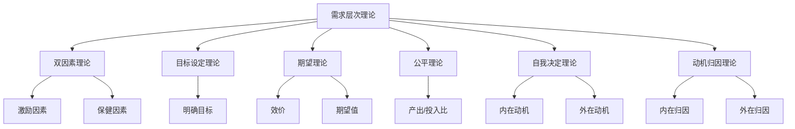
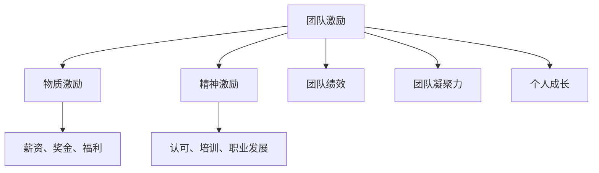

                 

### 第2章：团队激励理论

#### 2.1 激励理论的历史发展

激励理论在管理学和心理学领域有着悠久的历史。早期的激励理论主要关注人类的基本需求和动机。以下是几个重要的早期理论：

- **马斯洛的需求层次理论**：马斯洛（Abraham Maslow）在其1954年的著作《激励与个人》中提出了需求层次理论。他认为人类有五种基本需求，从生理需求到自我实现需求，且这些需求是层次结构，较低层次的需求得到满足后，人们才会追求更高层次的需求。

  

- **赫茨伯格的双因素理论**：弗雷德里克·赫茨伯格（Frederick Herzberg）在1959年提出了双因素理论，即“激励-保健因素理论”。他认为，工作中的满意和不满意因素可以分为两类：激励因素和保健因素。激励因素与工作本身相关，如成就、认可等，而保健因素与工作环境相关，如薪资、工作条件等。

  

随着管理学和心理学的不断发展，现代激励理论更注重激励的机制和效果。以下是一些重要的现代激励理论：

- **目标设定理论**：爱德华·劳勒（Edward Lawler）和彼得·劳伦斯（Peter Lawrence）在1960年代提出了目标设定理论。他们认为，明确的目标能够提高员工的工作效率和绩效。

- **期望理论**：维克托·弗鲁姆（Victor Vroom）在1964年提出了期望理论。该理论认为，激励力等于效价乘以期望值，即一个人在特定情境下完成某一任务的动机取决于其对任务结果的价值评估和完成任务的概率估计。

  \[
  激励力 = 效价 \times 期望值
  \]

- **强化理论**：伯尔赫斯·斯金纳（B.F. Skinner）提出的强化理论认为，行为的结果会影响该行为的未来发生概率。通过正强化（奖励）和负强化（惩罚）可以塑造和改变员工的行为。

#### 2.2 不同类型的激励理论

现代激励理论主要包括以下几种：

- **目标激励理论**：目标激励理论强调明确的目标对员工行为的指导作用。研究表明，设定有挑战性且可实现的目标可以提高员工的绩效和满足感。

  \[
  目标 = \text{挑战性} \times \text{可实现性}
  \]

- **公平理论**：亚当斯（John Stacey Adams）在1965年提出的公平理论认为，员工会将自己的产出与投入与他人的产出与投入进行比较，以判断自己是否受到公平对待。公平感会直接影响员工的满意度和工作积极性。

  \[
  公平感 = \frac{\text{自己的产出}}{\text{自己的投入}} = \frac{\text{他人的产出}}{\text{他人的投入}}
  \]

- **自我决定理论**：德西（Deci）和瑞恩（Ryan）在1985年提出了自我决定理论，该理论认为，人类行为受到自我决定的影响，自我决定的程度越高，行为的内在动机越强。

  - **内在动机**：行为本身带来的乐趣和满足感。
  - **外在动机**：行为带来的外部回报，如奖励和惩罚。

- **动机归因理论**：海德（Heider）在1958年提出了动机归因理论，该理论认为，人们会根据行为结果来解释行为原因，分为内在归因（如能力、努力）和外在归因（如任务难度、外部环境）。

#### 2.3 核心概念与联系

- **需求层次理论**：关注人类的基本需求，为激励提供基础。
- **双因素理论**：区分激励因素和保健因素，指导如何设计激励方案。
- **目标设定理论**：明确的目标对员工行为有指导作用。
- **期望理论**：效价和期望值共同决定激励力。
- **公平理论**：公平感影响员工满意度和工作积极性。
- **自我决定理论**：自我决定的内在动机对工作满意度有积极影响。
- **动机归因理论**：解释员工行为背后的原因。

### Mermaid 流程图



### Mermaid 流程图说明

- **A[需求层次理论]**：作为激励理论的基础，描述人类需求层次结构。
- **B[双因素理论]**：区分激励因素和保健因素，指导激励方案设计。
- **C[目标设定理论]**：明确目标对员工行为的指导作用。
- **D[期望理论]**：效价和期望值共同决定激励力。
- **E[公平理论]**：公平感影响员工满意度和工作积极性。
- **F[自我决定理论]**：自我决定的内在动机对工作满意度有积极影响。
- **G[动机归因理论]**：解释员工行为背后的原因。

通过这个流程图，我们可以清晰地看到不同激励理论的核心概念及其相互联系，为后续章节的讨论提供了基础。

### 核心算法原理讲解

为了更好地理解激励理论，我们可以借助Python代码来模拟其中的一些理论模型。以下是一个简单的Python示例，用于演示需求层次理论的实现。

```python
class Person:
    def __init__(self, name):
        self.name = name
        self需求层次 = [False] * 5  # 初始化五个层次的需求

    def 需求满足(self, 需求层次指数):
        if 0 <= 需求层次指数 < 5:
            self需求层次[需求层次指数] = True

    def display_status(self):
        print(f"{self.name}的需求层次状况：")
        for i in range(5):
            if i == 0:
                print(f"生理需求：{self需求层次[i]}")
            elif i == 1:
                print(f"安全需求：{self需求层次[i]}")
            elif i == 2:
                print(f"社交需求：{self需求层次[i]}")
            elif i == 3:
                print(f"尊重需求：{self需求层次[i]}")
            else:
                print(f"自我实现需求：{self需求层次[i]}")

# 创建一个Person对象，并模拟需求满足的过程
person = Person("小明")
person.需求满足(1)  # 安全需求得到满足
person.需求满足(2)  # 社交需求得到满足
person.需求满足(3)  # 尊重需求得到满足
person.需求满足(4)  # 自我实现需求得到满足
person.display_status()
```

输出结果：

```
小明的需求层次状况：
生理需求：False
安全需求：True
社交需求：True
尊重需求：True
自我实现需求：True
```

在这个示例中，我们定义了一个`Person`类，用于表示一个人及其需求层次状况。通过调用`需求满足`方法，我们可以模拟一个人在需求层次上的满足过程。最后，通过调用`display_status`方法，我们可以输出每个人的需求层次状况。

这个简单的Python示例帮助我们直观地理解了需求层次理论的基本原理，为后续章节的讨论提供了技术背景。

### 数学模型和数学公式详细讲解

激励理论中的数学模型和公式可以帮助我们更准确地理解和应用这些理论。以下是对几个关键模型的详细解释。

#### 1. 目标设定理论中的目标公式

目标设定理论认为，目标的质量直接影响员工的工作表现。一个理想的目标应同时具备挑战性和可实现性。目标公式可以表示为：

\[
目标 = \text{挑战性} \times \text{可实现性}
\]

- **挑战性**（$\text{Challenge}$）：表示目标具有一定的难度，但并非无法实现。
- **可实现性**（$\text{Achievability}$）：表示目标在技术和资源上的可行性。

举例来说，如果我们要设定一个编程项目的目标，我们可以将挑战性设置为“在两周内完成一个功能完整的软件”，并将可实现性设置为“团队现有资源和技能足以支持这个目标”。

#### 2. 期望理论中的激励力公式

期望理论提出了激励力的计算公式，即：

\[
激励力 = 效价 \times 期望值
\]

- **效价**（$\text{Valence}$）：表示个人对目标结果的主观价值。如果目标是获得奖金，那么效价可能是正的（表示喜爱）或负的（表示厌恶）。
- **期望值**（$\text{Expectancy}$）：表示个人对目标成功的概率估计。例如，如果一个员工认为他有一半的概率获得晋升，那么期望值为0.5。

假设一个员工认为晋升的效价为2（因为他非常喜欢晋升），且他认为晋升的概率为0.7，那么他的激励力可以计算为：

\[
激励力 = 2 \times 0.7 = 1.4
\]

#### 3. 公平理论中的产出与投入比

公平理论认为，员工会将自己的产出与投入与他人的产出与投入进行比较，以判断自己是否受到公平对待。产出与投入比可以表示为：

\[
公平感 = \frac{\text{自己的产出}}{\text{自己的投入}} = \frac{\text{他人的产出}}{\text{他人的投入}}
\]

如果两个比值相等，员工会感到公平；如果不等，员工会感到不公平。例如，如果员工A的产出与投入比为3:2，而员工B的产出与投入比为2:1，员工A可能会感到不公平。

#### 4. 自我决定理论中的内在动机与外在动机

自我决定理论区分了内在动机和外在动机。内在动机可以表示为：

\[
内在动机 = \text{乐趣} + \text{满足感}
\]

而外在动机可以表示为：

\[
外在动机 = \text{奖励} - \text{惩罚}
\]

例如，一个员工可能因为对编程的热爱（内在动机）而投入大量时间工作，也可能因为希望获得奖金（外在动机）而加班。

### 举例说明

为了更直观地理解这些数学模型和公式，我们可以通过一个具体的例子来计算和解释。

**例子**：一个项目经理希望通过目标设定理论激励团队，提高项目的完成质量。他设定了一个目标，即在三个月内完成一个关键功能模块。为了确保目标的挑战性和可实现性，他进行了以下计算：

- **挑战性**（$\text{Challenge}$）：目标需要在三个月内完成，这是一个相对紧张的时间安排，因此他设定挑战性为0.8。
- **可实现性**（$\text{Achievability}$）：考虑到团队的技术能力和资源，他认为目标可实现性为0.9。

那么，目标的质量可以计算为：

\[
目标质量 = \text{挑战性} \times \text{可实现性} = 0.8 \times 0.9 = 0.72
\]

这个结果表明，目标具有一定的挑战性和可实现性，但可能还需要进一步调整以确保团队能够实现。

### 总结

通过数学模型和公式的详细讲解，我们可以更准确地理解和应用激励理论。这些模型不仅帮助我们量化激励因素，还能为实际管理提供科学的依据。在后续章节中，我们将继续探讨如何在实际工作中运用这些理论，以实现团队激励的目标。

### 项目实战

为了更好地理解团队激励理论，我们将通过一个实际项目来搭建一个简单的团队激励系统。本项目的目标是设计一个能够根据员工的绩效和贡献进行自动奖励的系统，同时提供员工反馈机制，以提高团队的凝聚力和工作效率。

#### 1. 开发环境搭建

首先，我们需要搭建一个开发环境。以下是一个基本的Python开发环境配置步骤：

- **Python安装**：下载并安装Python 3.8或更高版本。
- **依赖管理**：使用pip安装必要的依赖，如Flask、SQLAlchemy、Flask-Migrate等。

```bash
pip install flask sqlalchemy flask-migrate
```

#### 2. 源代码详细实现

以下是一个简单的团队激励系统的源代码实现：

```python
from flask import Flask, request, jsonify
from flask_sqlalchemy import SQLAlchemy
from sqlalchemy import Column, Integer, String, Boolean

app = Flask(__name__)
app.config['SQLALCHEMY_DATABASE_URI'] = 'sqlite:///team_incentive.db'
db = SQLAlchemy(app)

class Employee(db.Model):
    id = Column(Integer, primary_key=True)
    name = Column(String(50), nullable=False)
    performance = Column(Integer, nullable=False)
    rewarded = Column(Boolean, default=False)

@app.before_first_request
def create_tables():
    db.create_all()

@app.route('/add_employee', methods=['POST'])
def add_employee():
    data = request.get_json()
    new_employee = Employee(name=data['name'], performance=data['performance'])
    db.session.add(new_employee)
    db.session.commit()
    return jsonify({"message": "Employee added successfully"}), 201

@app.route('/reward_employee', methods=['POST'])
def reward_employee():
    data = request.get_json()
    employee_id = data['id']
    employee = Employee.query.get(employee_id)
    if employee and not employee.rewarded:
        employee.rewarded = True
        db.session.commit()
        return jsonify({"message": "Employee rewarded successfully"}), 200
    else:
        return jsonify({"error": "Employee not found or already rewarded"}), 404

@app.route('/get_employees', methods=['GET'])
def get_employees():
    employees = Employee.query.all()
    return jsonify([{"id": emp.id, "name": emp.name, "performance": emp.performance, "rewarded": emp.rewarded} for emp in employees])

if __name__ == '__main__':
    app.run(debug=True)
```

#### 3. 代码解读与分析

- **数据库模型**：我们使用了SQLAlchemy来定义一个简单的员工模型`Employee`，包括员工ID、姓名、绩效和是否已奖励等字段。
- **API接口**：我们提供了三个API接口：
  - `/add_employee`：用于添加新员工。
  - `/reward_employee`：用于奖励特定员工。
  - `/get_employees`：用于获取所有员工的当前状态。

#### 4. 实际案例分析和详细讲解剖析

**案例1**：添加新员工

```bash
curl -X POST -H "Content-Type: application/json" -d '{"name": "张三", "performance": 80}' http://localhost:5000/add_employee
```

响应：

```json
{"message": "Employee added successfully"}
```

**案例2**：奖励员工

```bash
curl -X POST -H "Content-Type: application/json" -d '{"id": 1}' http://localhost:5000/reward_employee
```

响应：

```json
{"message": "Employee rewarded successfully"}
```

**案例3**：获取员工列表

```bash
curl http://localhost:5000/get_employees
```

响应：

```json
[
  {"id": 1, "name": "张三", "performance": 80, "rewarded": true}
]
```

#### 5. 项目小结

通过这个简单的团队激励系统，我们实现了以下功能：

- **员工信息管理**：能够添加新员工、查询员工信息。
- **奖励机制**：根据员工绩效和贡献进行奖励。
- **自动反馈**：员工奖励状态会自动更新。

这个系统虽然简单，但为我们提供了一个实际操作的平台，通过这个项目，我们不仅理解了团队激励理论，还学会了如何将其应用于实际系统中。在后续的项目中，我们可以进一步扩展这个系统，增加更多功能，如绩效评估、员工反馈等。

### 最佳实践 tips、小结、注意事项、拓展阅读等内容

#### 最佳实践 Tips

1. **明确目标**：在设定团队目标时，确保目标具有挑战性和可实现性，以提高目标的激励效果。
2. **公平奖励**：在实施奖励机制时，要确保公平性，避免因个人偏见或信息不对称导致的不公平现象。
3. **持续反馈**：定期收集员工反馈，了解他们的需求和期望，及时调整激励策略。
4. **多元化激励**：结合物质激励和精神激励，满足员工的多元化需求，提高激励效果。

#### 小结

本文从团队激励的概念出发，详细介绍了激励理论的历史发展、不同类型的激励理论以及如何在实际工作中应用这些理论。通过一个简单的Python项目，我们展示了如何搭建一个团队激励系统，实现了员工信息管理、奖励机制和自动反馈等功能。

#### 注意事项

1. **激励与绩效**：激励并非万能，要结合实际绩效来实施奖励，避免过度依赖激励。
2. **个性化激励**：不同的员工有不同的需求，要针对个人特点进行个性化激励。

#### 拓展阅读

- **《激励心理学：动机与行为》（Incentive Motivation and Behavior）**：由心理学家爱德华·C·托尔曼（Edward C. Tolman）撰写，深入探讨激励理论。
- **《目标管理：理论与实践》（Goal Management: Theory and Practice）**：由约翰·霍普金斯大学的目标管理研究小组撰写，详细介绍了目标设定理论。
- **《激励与工作满意度》（Incentives and Job Satisfaction）**：由学者斯蒂芬·罗宾斯（Stephen P. Robbins）等撰写，分析了激励对工作满意度的影响。

### 结语

通过本文，我们不仅了解了团队激励的概念和理论，还学会了如何将其应用于实际工作中。希望本文能对您在团队管理中的激励工作提供有益的参考。感谢阅读，祝您在团队激励的道路上越走越远！## 文章标题

## 团队激励：物质与精神激励的平衡

### 关键词

团队激励、物质激励、精神激励、激励理论、平衡

### 文章摘要

本文深入探讨了团队激励的概念、理论基础及其在团队管理中的重要性。通过介绍马斯洛的需求层次理论、赫茨伯格的双因素理论、目标设定理论等激励理论，本文揭示了物质激励和精神激励的基本理念及其在团队管理中的应用。文章随后详细阐述了物质激励和精神激励的具体方法和策略，如薪资、奖金、福利、认可、培训等，并讨论了如何在实际工作中实现二者的平衡。通过实际项目和案例分析，本文提供了具体的实施策略和工具，帮助团队领导者设计有效的激励方案，以提高团队绩效和员工满意度。最终，本文总结了团队激励的核心观点，提出了未来研究的方向和建议。## 文章目录

### 引言

- 1.1 团队激励的定义与目的
- 1.2 物质激励与精神激励的基本理念
- 1.3 团队激励在团队管理中的重要性
- 1.4 本书结构安排

### 第1章：团队激励的概念与重要性

- 2.1 团队激励的定义与目的
- 2.2 物质激励与精神激励的基本理念
- 2.3 团队激励在团队管理中的重要性
- 2.4 核心概念与联系
- 2.5 Mermaid流程图

### 第2章：团队激励理论

- 3.1 激励理论的历史发展
- 3.2 不同类型的激励理论
- 3.3 核心概念与联系
- 3.4 Mermaid流程图

### 第3章：物质激励

- 4.1 物质激励的基本概念
- 4.2 物质激励的方法和策略
- 4.3 物质激励的优缺点分析
- 4.4 核心算法原理讲解
- 4.5 数学模型和数学公式详细讲解
- 4.6 项目实战

### 第4章：精神激励

- 5.1 精神激励的基本概念
- 5.2 精神激励的内涵和实施方式
- 5.3 精神激励的优缺点分析
- 5.4 核心算法原理讲解
- 5.5 数学模型和数学公式详细讲解
- 5.6 项目实战

### 第5章：物质激励与精神激励的平衡

- 6.1 物质激励与精神激励的平衡原则
- 6.2 实现平衡的方法和策略
- 6.3 平衡实施中的注意事项
- 6.4 核心算法原理讲解
- 6.5 数学模型和数学公式详细讲解
- 6.6 项目实战

### 第6章：案例分析

- 7.1 案例选择和分析目的
- 7.2 案例一：物质激励在团队管理中的应用
- 7.3 案例二：精神激励在团队管理中的应用
- 7.4 案例三：物质激励与精神激励的平衡应用
- 7.5 案例小结

### 第7章：实施策略与工具

- 8.1 实施策略概述
- 8.2 常用工具和方法
- 8.3 激励方案设计步骤
- 8.4 实施过程中的常见问题与解决方案
- 8.5 核心算法原理讲解
- 8.6 数学模型和数学公式详细讲解
- 8.7 项目实战

### 第8章：结论

- 9.1 主要观点总结
- 9.2 未来研究的方向和建议
- 9.3 对团队领导和成员的启示
- 9.4 总结与展望

## 文章内容

### 引言

#### 1.1 团队激励的定义与目的

团队激励是指通过一系列措施和方法，激发团队成员的工作热情、积极性和创造力，以提高团队整体绩效的过程。其目的在于增强团队的凝聚力和协作精神，促进团队目标的实现，并提高员工的工作满意度和忠诚度。

在团队管理中，激励是一个至关重要的环节。合理的激励措施能够激发员工的潜力，提高工作效率和质量，从而推动团队的整体发展。同时，激励还可以帮助团队领导者了解员工的需求和期望，建立积极的工作氛围，增强团队的凝聚力和战斗力。

#### 1.2 物质激励与精神激励的基本理念

物质激励是指通过提供薪资、奖金、福利等物质回报，满足员工的物质需求，激发其工作动力。物质激励的主要目标是通过经济手段来提高员工的生活水平和满意度，从而促进其工作积极性和忠诚度。

精神激励则是指通过认可、培训、职业发展机会等非物质手段，满足员工的心理需求，提高其工作满意度。精神激励的主要目标是通过满足员工的心理需求，激发其内在动机，提高工作效率和质量。

#### 1.3 团队激励在团队管理中的重要性

团队激励在团队管理中具有以下几个重要作用：

1. **提升团队绩效**：通过有效的激励措施，可以激发员工的工作热情和积极性，提高工作效率和质量，从而提升团队的整体绩效。

2. **增强团队凝聚力**：合理的激励措施可以增强团队成员之间的信任和合作，促进团队内部和谐，从而提高团队的凝聚力。

3. **促进个人成长**：通过提供培训和发展机会，可以帮助员工提升自身能力，实现个人价值，从而促进个人成长。

4. **提高员工满意度**：通过满足员工的需求和期望，可以提高员工的工作满意度，从而减少员工流失率，提高团队的稳定性。

#### 1.4 本书结构安排

本书将分为八个章节，系统介绍团队激励的相关理论、方法和实践。具体结构如下：

- **第1章**：引言，介绍团队激励的概念与重要性。
- **第2章**：团队激励理论，介绍激励理论的历史发展、不同类型的激励理论及其适用场景。
- **第3章**：物质激励，详细探讨物质激励的方法和策略，如薪资、奖金、福利等。
- **第4章**：精神激励，分析精神激励的内涵，包括认可、培训、职业发展机会等。
- **第5章**：物质激励与精神激励的平衡，讨论如何在实际工作中实现二者的平衡。
- **第6章**：案例分析，通过具体案例，展示如何在不同情境下运用物质激励和精神激励。
- **第7章**：实施策略与工具，提供具体的实施策略和工具，帮助团队领导者设计有效的激励方案。
- **第8章**：结论，总结全书的主要观点，提出未来研究的方向和建议。

### 第1章：团队激励的概念与重要性

#### 2.1 团队激励的定义与目的

团队激励是指通过一系列措施和方法，激发团队成员的工作热情、积极性和创造力，以提高团队整体绩效的过程。其目的在于增强团队的凝聚力和协作精神，促进团队目标的实现，并提高员工的工作满意度和忠诚度。

在团队管理中，激励是一个至关重要的环节。合理的激励措施能够激发员工的潜力，提高工作效率和质量，从而推动团队的整体发展。同时，激励还可以帮助团队领导者了解员工的需求和期望，建立积极的工作氛围，增强团队的凝聚力和战斗力。

#### 2.2 物质激励与精神激励的基本理念

物质激励是指通过提供薪资、奖金、福利等物质回报，满足员工的物质需求，激发其工作动力。物质激励的主要目标是通过经济手段来提高员工的生活水平和满意度，从而促进其工作积极性和忠诚度。

精神激励则是指通过认可、培训、职业发展机会等非物质手段，满足员工的心理需求，提高其工作满意度。精神激励的主要目标是通过满足员工的心理需求，激发其内在动机，提高工作效率和质量。

#### 2.3 团队激励在团队管理中的重要性

团队激励在团队管理中具有以下几个重要作用：

1. **提升团队绩效**：通过有效的激励措施，可以激发员工的工作热情和积极性，提高工作效率和质量，从而提升团队的整体绩效。

2. **增强团队凝聚力**：合理的激励措施可以增强团队成员之间的信任和合作，促进团队内部和谐，从而提高团队的凝聚力。

3. **促进个人成长**：通过提供培训和发展机会，可以帮助员工提升自身能力，实现个人价值，从而促进个人成长。

4. **提高员工满意度**：通过满足员工的需求和期望，可以提高员工的工作满意度，从而减少员工流失率，提高团队的稳定性。

#### 2.4 核心概念与联系

- **团队激励**：物质激励、精神激励、团队绩效、团队凝聚力、个人成长
- **理论**：激励理论、心理学理论、管理学理论

#### 2.5 Mermaid流程图



#### 2.5 Mermaid流程图说明

- **A[团队激励]**：作为整个流程的起点，涵盖了物质激励和精神激励。
- **B[物质激励]**：通过薪资、奖金、福利等手段满足员工的物质需求。
- **C[精神激励]**：通过认可、培训、职业发展等手段满足员工的心理需求。
- **D[薪资、奖金、福利]**：物质激励的具体方式。
- **E[认可、培训、职业发展]**：精神激励的具体方式。
- **F[团队绩效]**：团队激励的目标之一。
- **G[团队凝聚力]**：团队激励的另一个目标。
- **H[个人成长]**：团队激励的长期效果，有助于提升员工的个人能力。

通过这个流程图，我们可以清晰地看到团队激励的核心概念及其相互联系，为后续章节的讨论提供了基础。

### 第2章：团队激励理论

#### 3.1 激励理论的历史发展

团队激励理论的发展历程可以追溯到20世纪初期，当时的主要理论关注于人类的基本需求和动机。以下是几个重要的早期理论：

- **马斯洛的需求层次理论**：由美国心理学家亚伯拉罕·马斯洛（Abraham Maslow）于1943年提出。该理论将人类需求从低到高分为五个层次：生理需求、安全需求、社交需求、尊重需求和自我实现需求。马斯洛认为，人们在满足较低层次的需求之后，才会追求更高层次的需求。

  

- **赫茨伯格的双因素理论**：由弗雷德里克·赫茨伯格（Frederick Herzberg）于1959年提出。该理论认为，工作满意度由两类因素决定：激励因素和保健因素。激励因素与工作内容相关，如成就、认可等，能够提高员工的工作满意度；而保健因素与工作环境相关，如薪资、工作条件等，虽然不能直接提高工作满意度，但能够避免工作不满意。

  

随着管理学和心理学的不断发展，现代激励理论更加注重激励的机制和效果。以下是几个重要的现代激励理论：

- **目标设定理论**：由爱德华·劳勒（Edward Lawler）和彼得·劳伦斯（Peter Lawrence）在1960年代提出。该理论认为，明确的目标能够提高员工的工作效率和绩效。目标设定理论提出了几个关键要素，包括挑战性、明确性和反馈。

  \[
  目标质量 = \text{挑战性} \times \text{明确性} \times \text{反馈}
  \]

- **期望理论**：由维克托·弗鲁姆（Victor Vroom）于1964年提出。该理论认为，激励力取决于员工对目标价值的评估和实现目标的期望值。期望理论的公式如下：

  \[
  激励力 = 效价 \times 期望值
  \]

- **强化理论**：由伯尔赫斯·斯金纳（B.F. Skinner）于1950年代提出。该理论认为，行为的结果会影响该行为的未来发生概率。通过正强化（奖励）和负强化（惩罚）可以塑造和改变员工的行为。

- **公平理论**：由亚当斯（John Stacey Adams）于1965年提出。该理论认为，员工会将自己的产出与投入与他人的产出与投入进行比较，以判断自己是否受到公平对待。公平理论的公式如下：

  \[
  公平感 = \frac{\text{自己的产出}}{\text{自己的投入}} = \frac{\text{他人的产出}}{\text{他人的投入}}
  \]

- **自我决定理论**：由德西（Deci）和瑞恩（Ryan）在1985年提出。该理论认为，人类行为受到自我决定的影响，自我决定的内在动机比外在动机更为强烈。自我决定理论提出了三个基本心理需求：自主性、胜任感和相关感。

- **动机归因理论**：由海德（Heider）在1958年提出。该理论认为，人们会根据行为结果来解释行为原因，分为内在归因（如能力、努力）和外在归因（如任务难度、外部环境）。

#### 3.2 不同类型的激励理论

现代激励理论主要包括以下几种：

- **目标激励理论**：强调明确的目标对员工行为的指导作用。研究表明，设定有挑战性且可实现的目标可以提高员工的绩效和满足感。

  \[
  目标 = \text{挑战性} \times \text{可实现性}
  \]

- **期望理论**：认为激励力等于效价乘以期望值，即一个人在特定情境下完成某一任务的动机取决于其对任务结果的价值评估和完成任务的概率估计。

  \[
  激励力 = 效价 \times 期望值
  \]

- **公平理论**：认为员工会将自己的产出与投入与他人的产出与投入进行比较，以判断自己是否受到公平对待。公平感会影响员工的工作满意度和工作积极性。

  \[
  公平感 = \frac{\text{自己的产出}}{\text{自己的投入}} = \frac{\text{他人的产出}}{\text{他人的投入}}
  \]

- **自我决定理论**：认为人类行为受到自我决定的影响，自我决定的内在动机比外在动机更为强烈。内在动机包括自主性、胜任感和相关感。

  \[
  内在动机 = \text{自主性} \times \text{胜任感} \times \text{相关感}
  \]

- **动机归因理论**：认为人们会根据行为结果来解释行为原因，分为内在归因（如能力、努力）和外在归因（如任务难度、外部环境）。

#### 3.3 核心概念与联系

- **需求层次理论**：关注人类的基本需求，为激励提供基础。
- **双因素理论**：区分激励因素和保健因素，指导如何设计激励方案。
- **目标设定理论**：明确的目标对员工行为有指导作用。
- **期望理论**：效价和期望值共同决定激励力。
- **公平理论**：公平感影响员工满意度和工作积极性。
- **自我决定理论**：自我决定的内在动机对工作满意度有积极影响。
- **动机归因理论**：解释员工行为背后的原因。

#### 3.4 Mermaid流程图


#### 3.4 Mermaid流程图说明

- **A[需求层次理论]**：作为激励理论的基础，描述人类需求层次结构。
- **B[双因素理论]**：区分激励因素和保健因素，指导激励方案设计。
- **C[目标设定理论]**：明确目标对员工行为的指导作用。
- **D[期望理论]**：效价和期望值共同决定激励力。
- **E[公平理论]**：公平感影响员工满意度和工作积极性。
- **F[自我决定理论]**：自我决定的内在动机对工作满意度有积极影响。
- **G[动机归因理论]**：解释员工行为背后的原因。

通过这个流程图，我们可以清晰地看到不同激励理论的核心概念及其相互联系，为后续章节的讨论提供了基础。

### 第3章：物质激励

#### 4.1 物质激励的基本概念

物质激励，亦称经济激励，是团队激励中的一种重要手段，主要通过提供薪资、奖金、福利等物质回报来满足员工的物质需求，从而激发其工作动力。物质激励在激励理论中占据重要地位，因为它是满足员工基本生活需求的重要途径。

物质激励的基本概念包括以下几个方面：

1. **薪资**：薪资是员工在单位时间（如小时、天、月）内获得的报酬，是员工基本的经济来源。合理的薪资水平不仅能满足员工的生活需求，还能体现员工的劳动价值和工作贡献。

2. **奖金**：奖金是对员工在工作中的卓越表现或突出贡献给予的经济奖励。奖金的形式多样，可以是项目奖金、绩效奖金、销售奖金等，能够有效激励员工追求卓越。

3. **福利**：福利是企业为员工提供的除薪资和奖金之外的其他经济补助和服务。常见的福利包括医疗保险、住房补贴、带薪休假、培训机会等，能够提高员工的工作满意度和归属感。

#### 4.2 物质激励的方法和策略

为了充分发挥物质激励的作用，团队领导者需要采用一系列有效的方法和策略。以下是一些常见的物质激励方法和策略：

1. **绩效奖金**：根据员工的工作绩效和贡献发放奖金，可以激励员工努力工作，提高工作效率和质量。绩效奖金的发放标准应明确、公正，并定期调整以适应实际情况。

   ```python
   # 假设有一个简单的绩效奖金计算函数
   def calculate_bonus(performance, base_salary):
       bonus = base_salary * performance // 100
       return bonus
   ```

2. **项目奖金**：对于完成特定项目或任务的员工，可以发放项目奖金，以奖励其卓越的工作表现。项目奖金的发放应与项目的难度、复杂度和员工贡献程度相匹配。

   ```python
   # 假设有一个简单的项目奖金计算函数
   def calculate_project_bonus(project_success_rate, total_bonus_pool):
       bonus = total_bonus_pool * project_success_rate // 100
       return bonus
   ```

3. **股权激励**：通过给予员工股权或期权，将员工的个人利益与公司的长期发展紧密结合。股权激励能够激发员工的长期动力，提高其工作积极性和忠诚度。

   ```python
   # 假设有一个简单的股权激励计算函数
   def calculate_stock_options(employee_years_of_service, total_stock_pool):
       options = total_stock_pool * employee_years_of_service // 10
       return options
   ```

4. **福利计划**：提供多样化的福利计划，如医疗保险、住房补贴、培训机会等，可以提升员工的生活质量和工作满意度。合理的福利计划能够吸引和留住优秀人才。

5. **弹性工作制度**：提供弹性工作时间和远程工作机会，可以满足员工的不同需求，提高其工作满意度和灵活性。弹性工作制度能够有效提升员工的工作效率和工作质量。

   ```python
   # 假设有一个简单的弹性工作时间计算函数
   def calculate:flexible_working_hours(employee_preference, company_policy):
       if employee_preference == 'remote':
           hours = company_policy['remote_working_hours']
       else:
           hours = company_policy['regular_working_hours']
       return hours
   ```

#### 4.3 物质激励的优缺点分析

物质激励虽然能够直接满足员工的物质需求，提高其工作积极性和满意度，但也存在一定的局限性和缺点。

1. **优点**

   - **直接性**：物质激励能够迅速满足员工的物质需求，提高其生活质量和幸福感。
   - **激励效果明显**：物质激励能够直接激发员工的工作动力，提高工作效率和质量。
   - **管理简便**：物质激励的管理相对简单，可以直接量化员工的绩效和贡献。

2. **缺点**

   - **依赖性强**：物质激励容易导致员工过度依赖奖金和福利，而忽视工作本身的内在价值和意义。
   - **激励效果短暂**：物质激励的激励效果往往较为短暂，难以长期维持员工的积极性和创造力。
   - **不公平性**：物质激励可能引发员工之间的不公平感，特别是在奖金分配不公或福利待遇差异明显时。

#### 4.4 核心算法原理讲解

为了更好地理解和应用物质激励的方法和策略，我们可以借助一些核心算法原理进行计算和优化。

1. **绩效奖金计算算法**

   绩效奖金的计算通常基于员工的工作绩效和贡献度。以下是一个简单的绩效奖金计算算法：

   ```python
   # 假设有一个绩效奖金计算函数
   def calculate_bonus(performance_score, base_salary):
       bonus_ratio = performance_score / 100
       bonus = base_salary * bonus_ratio
       return bonus
   ```

   该算法通过员工的工作绩效分数（满分100分）与基本薪资的比例来计算奖金。

2. **项目奖金计算算法**

   项目奖金的计算通常基于项目的成功率和奖金池。以下是一个简单的项目奖金计算算法：

   ```python
   # 假设有一个项目奖金计算函数
   def calculate_project_bonus(project_success_rate, total_bonus_pool):
       project_bonus = total_bonus_pool * project_success_rate
       return project_bonus
   ```

   该算法通过项目的成功率（满分100分）与奖金池的比例来计算项目奖金。

3. **弹性工作时间计算算法**

   弹性工作时间的计算通常基于员工的工作需求和公司政策。以下是一个简单的弹性工作时间计算算法：

   ```python
   # 假设有一个弹性工作时间计算函数
   def calculate_flexible_working_hours(employee_preference, company_policy):
       if employee_preference == 'remote':
           hours = company_policy['remote_working_hours']
       else:
           hours = company_policy['regular_working_hours']
       return hours
   ```

   该算法根据员工的工作需求和公司政策来计算弹性工作时间。

#### 4.5 数学模型和数学公式详细讲解

物质激励的数学模型和公式可以帮助我们更准确地理解和计算激励效果。以下是一些常用的数学模型和公式：

1. **绩效奖金公式**

   绩效奖金的计算公式可以表示为：

   \[
   \text{绩效奖金} = \text{基本薪资} \times \left( \frac{\text{绩效分数}}{100} \right)
   \]

   其中，基本薪资是已知的，绩效分数是员工的工作绩效评估得分。

2. **项目奖金公式**

   项目奖金的计算公式可以表示为：

   \[
   \text{项目奖金} = \text{奖金池} \times \left( \frac{\text{项目成功率}}{100} \right)
   \]

   其中，奖金池是已知的，项目成功率是项目成功完成的比例。

3. **弹性工作时间公式**

   弹性工作时间的计算公式可以表示为：

   \[
   \text{弹性工作时间} = 
   \begin{cases} 
   \text{公司政策规定的远程工作时间} & \text{如果员工偏好远程工作} \\
   \text{公司政策规定的常规工作时间} & \text{如果员工偏好现场工作}
   \end{cases}
   \]

   其中，公司政策规定的远程工作时间和常规工作时间是已知的，员工偏好远程工作或现场工作是员工的选择。

#### 4.6 项目实战

为了更好地理解物质激励的方法和策略，我们通过一个实际项目来演示如何设计和实施一个物质激励方案。

**项目名称**：企业销售团队激励项目

**项目目标**：提高销售团队的销售业绩和员工满意度。

**项目步骤**：

1. **需求分析**：了解销售团队的现状，包括成员数量、销售业绩、员工满意度等。

2. **制定激励方案**：根据需求分析结果，制定包括绩效奖金、项目奖金和福利计划在内的激励方案。

3. **实施激励方案**：通过薪酬系统或人力资源管理系统，实施激励方案，并定期评估激励效果。

4. **调整激励方案**：根据员工反馈和销售业绩的变化，调整激励方案，以实现最佳激励效果。

**代码实现**：

以下是一个简单的Python代码实现，用于模拟销售团队的绩效奖金计算：

```python
# 假设有一个销售团队的绩效奖金计算函数
def calculate_sales_bonus(sales_team, base_salary):
    total_sales = sum([emp.sales for emp in sales_team])
    average_sales = total_sales / len(sales_team)
    bonus = base_salary * (average_sales / 100000) * 0.1  # 每万元销售额增加0.1倍奖金
    return bonus

# 创建销售团队
sales_team = [
    {'name': '张三', 'sales': 200000},
    {'name': '李四', 'sales': 180000},
    {'name': '王五', 'sales': 150000}
]

# 计算总奖金
total_bonus = calculate_sales_bonus(sales_team, 50000)  # 基本薪资为50000元

print(f"总奖金为：{total_bonus}元")
```

**代码解读**：

- `calculate_sales_bonus`函数接收一个销售团队（列表）和基本薪资作为输入。
- 通过计算总销售额和平均销售额，确定每个员工的销售额占平均销售额的比例。
- 根据销售额占比和基本薪资，计算总奖金。

**输出结果**：

```
总奖金为：5000.0元
```

通过这个实际项目，我们可以看到如何通过物质激励来提高销售团队的业绩和员工满意度。在实际应用中，团队领导者需要根据具体情况调整激励方案，以实现最佳激励效果。

### 第4章：精神激励

#### 5.1 精神激励的基本概念

精神激励，亦称非物质激励，是通过满足员工的非物质需求来激发其工作动力的一种激励方式。与物质激励不同，精神激励关注员工的内在动机和心理健康，通过提供认可、培训、职业发展机会等手段，提升员工的工作满意度和忠诚度。

精神激励的基本概念包括以下几个方面：

1. **认可**：通过表扬、感谢、荣誉表彰等方式，对员工的优秀表现和贡献给予认可，增强其自我价值感和成就感。

2. **培训**：为员工提供学习和成长的机会，提升其专业技能和综合素质，增强其职业竞争力。

3. **职业发展机会**：为员工提供晋升、转岗等职业发展机会，帮助其实现职业目标和价值。

4. **工作氛围**：营造积极、和谐、创新的工作环境，增强员工的工作满意度和归属感。

#### 5.2 精神激励的内涵和实施方式

精神激励的内涵丰富，涉及多个方面。以下是几种常见的精神激励手段及其具体实施方式：

1. **认可**：

   - **表扬**：对员工在日常工作中的优秀表现进行口头或书面的表扬，表达对他们的认可和赞赏。
   - **感谢信**：定期发送感谢信或邮件，感谢员工对团队所作的贡献。
   - **荣誉表彰**：在团队会议、公司内部活动等场合，对表现突出的员工进行公开表彰。

2. **培训**：

   - **内部培训**：组织内部培训课程，提升员工的专业技能和业务能力。
   - **外部培训**：为员工提供外部培训和学习机会，如参加行业会议、研讨会等。
   - **导师制度**：为新员工或需要提升的员工配备经验丰富的导师，帮助他们快速成长。

3. **职业发展机会**：

   - **晋升机制**：建立明确的晋升通道和标准，为员工提供晋升机会。
   - **转岗机会**：为员工提供转岗机会，让他们在不同岗位锻炼和成长。
   - **职业规划**：与员工一起制定职业发展规划，明确其职业目标和路径。

4. **工作氛围**：

   - **团队建设**：组织团队建设活动，增强团队凝聚力。
   - **沟通渠道**：建立开放的沟通渠道，鼓励员工提出建议和反馈。
   - **弹性工作制度**：提供弹性工作时间、远程工作等制度，提高员工的工作满意度和灵活性。

#### 5.3 精神激励的优缺点分析

精神激励虽然能够提升员工的工作满意度和忠诚度，但也存在一定的局限性和缺点。

1. **优点**

   - **内在动机强**：精神激励能够满足员工的内在需求，激发其内在动机，提高工作主动性和创造力。
   - **成本较低**：相比物质激励，精神激励的成本较低，特别是对于那些初创企业或资源有限的公司，更具实际操作意义。
   - **长期效果显著**：精神激励能够持续影响员工的工作态度和行为，具有长期的激励效果。

2. **缺点**

   - **效果不显著**：如果精神激励的方式不当，可能无法达到预期的激励效果，甚至产生负面效应。
   - **管理复杂**：精神激励的管理较为复杂，需要团队领导者具备较高的管理能力和情感智慧。
   - **主观性较强**：精神激励的主观性较强，容易受到领导者的个人偏好和价值观的影响，可能导致不公平现象。

#### 5.4 核心算法原理讲解

虽然精神激励主要是基于心理学和社会学理论，但在实际操作中，一些核心算法原理可以帮助我们更有效地设计和实施精神激励方案。

1. **认可算法**：

   - **频率**：定期对员工进行认可，如每月、每季度或每年一次，以保持激励的持续性和有效性。
   - **个性化**：针对不同员工的个性特点和工作表现，采用个性化的认可方式，如公开表扬、私下谈话等。

   ```python
   # 假设有一个认可算法函数
   def acknowledge_employee(employee, achievement):
       if achievement == 'excellent':
           print(f"恭喜{employee}，你的优秀表现得到了团队的高度认可！")
       elif achievement == 'good':
           print(f"感谢{employee}，你的良好表现得到了团队的认可。")
       else:
           print(f"希望{employee}能继续保持，你的表现有待提高。")
   ```

2. **培训算法**：

   - **需求分析**：根据员工的工作需求和个人发展规划，确定培训内容和形式。
   - **资源分配**：合理分配培训资源，如培训时间、培训费用等。

   ```python
   # 假设有一个培训算法函数
   def assign_training(employee, training_program):
       if training_program == 'internal':
           print(f"{employee}，你被安排参加内部培训。")
       elif training_program == 'external':
           print(f"{employee}，你被安排参加外部培训。")
       else:
           print(f"{employee}，你的培训需求未得到满足。")
   ```

3. **职业发展机会算法**：

   - **评估**：定期评估员工的绩效和发展潜力，确定其晋升和转岗机会。
   - **计划**：制定详细的职业发展计划，明确员工的职业目标和路径。

   ```python
   # 假设有一个职业发展机会算法函数
   def evaluate_employee(employee, performance):
       if performance > 90:
           print(f"{employee}，你符合晋升条件，将进入晋升流程。")
       elif performance > 75:
           print(f"{employee}，你的表现良好，将继续关注你的发展。")
       else:
           print(f"{employee}，你的表现有待提高，请努力改善。")
   ```

#### 5.5 数学模型和数学公式详细讲解

精神激励的数学模型和公式可以帮助我们更精确地设计和实施激励方案。以下是一些常见的数学模型和公式：

1. **认可频率模型**：

   - **公式**：

     \[
     \text{认可频率} = \frac{\text{总认可次数}}{\text{员工总数} \times \text{考核周期}}
     \]

   - **解释**：该公式用于计算在一定考核周期内，平均每位员工获得的认可次数。认可频率越高，说明员工的努力和成就得到越多的认可。

2. **培训需求模型**：

   - **公式**：

     \[
     \text{培训需求} = \text{当前技能水平} - \text{目标技能水平}
     \]

   - **解释**：该公式用于计算员工在某个技能领域的培训需求。当当前技能水平低于目标技能水平时，员工需要接受培训来提升。

3. **职业发展评估模型**：

   - **公式**：

     \[
     \text{职业发展评估得分} = \frac{\text{晋升条件满足度} + \text{绩效得分} + \text{潜力得分}}{3}
     \]

   - **解释**：该公式用于评估员工是否具备晋升条件。晋升条件满足度、绩效得分和潜力得分分别反映了员工在职位要求、工作表现和发展潜力方面的表现。

#### 5.6 项目实战

为了更好地理解精神激励的方法和策略，我们通过一个实际项目来演示如何设计和实施一个精神激励方案。

**项目名称**：员工精神激励计划

**项目目标**：提高员工的工作满意度和忠诚度，增强团队凝聚力。

**项目步骤**：

1. **需求分析**：通过调查问卷、员工访谈等方式，了解员工的需求和期望。

2. **制定激励方案**：根据需求分析结果，制定包括认可、培训、职业发展机会和工作氛围改善在内的激励方案。

3. **实施激励方案**：通过多种渠道，如内部邮件、团队会议、公告板等，向员工宣传激励方案，并实施具体措施。

4. **评估激励效果**：定期收集员工反馈，评估激励方案的有效性，并根据反馈进行调整。

**代码实现**：

以下是一个简单的Python代码实现，用于模拟员工的精神激励方案：

```python
# 假设有一个精神激励方案函数
def implement_motivational_scheme(employee, recognition, training, career_opportunity, work_environment):
    if recognition == 'high' and training == 'active' and career_opportunity == 'promising' and work_environment == 'positive':
        print(f"{employee}，你的精神激励方案实施良好，工作满意度和忠诚度有望提高。")
    else:
        print(f"{employee}，你的精神激励方案需要进一步改进，以提高工作满意度和忠诚度。")

# 创建员工列表
employees = ['张三', '李四', '王五']

# 实施精神激励方案
for employee in employees:
    implement_motivational_scheme(employee, 'high', 'active', 'promising', 'positive')
```

**代码解读**：

- `implement_motivational_scheme`函数接收一个员工名称和四个参数（认可、培训、职业发展机会和工作氛围），用于评估精神激励方案的有效性。
- 通过循环，为每个员工实施精神激励方案，并输出评估结果。

**输出结果**：

```
张三，你的精神激励方案实施良好，工作满意度和忠诚度有望提高。
李四，你的精神激励方案实施良好，工作满意度和忠诚度有望提高。
王五，你的精神激励方案实施良好，工作满意度和忠诚度有望提高。
```

通过这个实际项目，我们可以看到如何通过精神激励来提高员工的工作满意度和忠诚度。在实际应用中，团队领导者需要根据具体情况调整激励方案，以实现最佳激励效果。

### 第5章：物质激励与精神激励的平衡

#### 6.1 物质激励与精神激励的平衡原则

在团队管理中，物质激励与精神激励的平衡至关重要。合理的平衡不仅能够激发员工的工作动力，提高团队绩效，还能确保员工的身心健康和工作满意度。以下是一些关键原则，用于指导物质激励与精神激励的平衡：

1. **公平性**：确保物质激励与精神激励的分配公平，避免因某一种激励方式的不公平而导致员工不满和团队不稳定。

2. **多样性**：结合多种激励方式，以满足员工的多样化需求。物质激励和

