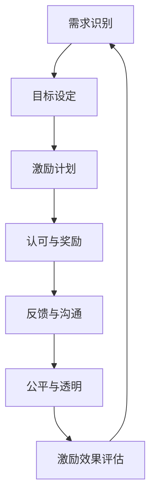

                 

## 引言

### 团队激励的重要性

在现代企业中，团队是实现目标的核心单元。一个高效的团队不仅需要成员具备专业技能，还需要有效的激励来保持其活力和创造力。团队激励的重要性在于，它能够促进团队成员之间的协作，提升整体绩效，并增强团队凝聚力。有效的团队激励不仅能提高员工的工作满意度和忠诚度，还能激发创新思维和解决问题的能力。

然而，团队激励并非易事。如何在激励与批评之间找到平衡，是每一位领导者面临的挑战。认可与批评是激励的重要工具，但如何正确使用它们，却是一门艺术。本文旨在探讨团队激励中认可与批评的平衡艺术，通过理论阐述、实践指导和案例研究，帮助读者深入理解这一主题。

### 本书的目的和结构

本书的目标是提供一个系统的框架，帮助读者理解和实践团队激励中的认可与批评。我们将首先介绍团队激励的基本概念，接着深入探讨认可的艺术和批评的平衡。随后，将介绍一系列团队激励的策略，并结合实际案例进行详细分析。最后，我们将对全文进行反思与总结，并提供一些最佳实践建议。

本书的结构分为八个章节：

1. **引言**：介绍团队激励的重要性、本书的目的和结构。
2. **团队激励的基本概念**：定义团队激励，介绍团队激励的理论基础。
3. **认可的艺术**：讨论认可的理论和实践，介绍不同情境下的认可方法。
4. **批评的平衡**：探讨批评的理论和实践，如何有效地给予批评。
5. **团队激励的策略**：介绍团队目标的设定、团队文化的建设和团队成员的激励。
6. **案例研究**：分析成功的团队激励案例，提供实际操作的指导。
7. **反思与总结**：总结团队激励的关键点，讨论如何在实践中应用。
8. **附录**：提供相关的资源、工具和参考文献。

通过这些章节，我们希望读者能够对团队激励有一个全面的理解，并能够在实际工作中运用这些知识，提升团队的整体表现。

## 团队激励的基本概念

### 定义

团队激励是指通过一系列方法和手段，激发团队成员的工作热情和积极性，以达到提高团队绩效和实现团队目标的目的。激励不仅仅是物质上的奖励，还包括精神上的认可和成就感。有效的激励可以增强团队凝聚力，提高工作效率，促进创新思维，从而在竞争激烈的市场环境中保持竞争优势。

### 理论基础

团队激励的理论基础涵盖了多种激励理论，包括马斯洛的需求层次理论、赫茨伯格的双因素理论、维克托·弗鲁姆的期望理论等。每种理论都从不同的角度解释了如何通过满足团队成员的需求来激励他们。

- **马斯洛的需求层次理论**：马斯洛认为人的需求可以分为五个层次，从基本的生理需求到最高级的自我实现需求。团队激励要关注不同层次的需求，通过满足不同需求来激发成员的动力。

- **赫茨伯格的双因素理论**：赫茨伯格提出，工作满意度由两种因素决定：激励因素和保健因素。激励因素与工作本身的性质相关，如成就感、认可和责任，而保健因素则与工作环境相关，如薪酬、工作条件、人际关系等。团队激励应重点关注激励因素，以提高成员的工作满意度。

- **维克托·弗鲁姆的期望理论**：期望理论认为，个体的行为动机取决于对结果价值的期望和实现结果的概率。团队激励要激发成员的期望，让他们相信通过努力可以实现目标，并获得预期的奖励。

### 核心要素

团队激励的核心要素包括以下几个方面：

- **目标设定**：明确的目标是激励团队成员的重要动力。目标应具有挑战性，同时可实现，以激发成员的积极性和成就感。

- **认可与奖励**：认可和奖励是激励的重要手段。通过及时和适度的认可，可以增强成员的自信心和归属感。奖励可以是物质上的，如奖金、晋升机会，也可以是精神上的，如表扬、荣誉称号。

- **反馈与沟通**：及时的反馈和有效的沟通是团队激励的关键。通过沟通，团队领导者可以了解成员的需求和问题，并给予相应的支持和指导。

- **公平与透明**：公平和透明是建立信任和增强激励的重要前提。团队激励应确保每个人都能公平地获得认可和奖励，避免因偏见或不公正而引起的负面影响。

### 团队激励模型

为了更好地理解和应用团队激励，我们可以构建一个简单的团队激励模型，如下图所示。

在这个模型中，需求识别是团队激励的起点，通过分析团队成员的需求来设定明确的目标。激励计划是针对目标制定的奖励和认可措施，包括物质和精神激励。认可与奖励是激励计划的实施过程，通过及时的反馈和沟通，可以确保激励措施的有效性。公平与透明是激励过程中必须遵守的原则，确保每个成员都能公平地获得激励。最后，激励效果评估是对激励效果的检验，通过反馈和调整，不断优化激励策略。

通过这个模型，团队领导者可以系统地规划和管理团队激励，从而提高团队的绩效和凝聚力。

## 认可的艺术

### 认可的理论与实践

认可在团队激励中扮演着至关重要的角色。根据行为心理学理论，人类有追求认同和尊重的需求，这种需求通过认可得以满足。认可不仅能够增强团队成员的自信心和归属感，还能激发他们的工作热情和创造力。

在实践中，认可的形式多种多样。有效的认可不仅仅是口头表扬，还包括书面感谢、荣誉称号、团队聚餐等多种方式。例如，在项目管理中，项目经理可以通过电子邮件或公开会议的方式，表扬在项目中表现出色的成员，这不仅能够激励该成员，还能鼓励其他成员积极工作。

### 不同情境下的认可方法

不同情境下的认可方法需要根据具体情况灵活调整。以下是一些常见的认可方法：

#### 正面反馈

正面反馈是认可的基本形式，包括口头表扬、书面感谢、奖状或荣誉称号等。在团队会议或公开场合进行表扬，可以增强认可的效果。

#### 负面反馈

负面反馈虽然不如正面反馈直接，但同样重要。在给予负面反馈时，应注重具体问题具体分析，避免指责个人。例如，可以指出某个任务完成的时间不够理想，而不是直接批评成员的工作效率。

#### 非言语认可

非言语认可通过肢体语言、表情和姿态传达认可的信息。例如，一个微笑、一个握手或一个点头，都能传达出对成员工作的认可。

### 认可的语言和非语言表达

#### 语言表达

语言表达是认可的重要手段。以下是几种常用的语言表达方式：

- **具体化**：使用具体的事例来描述成员的优点，使认可更加真实和具体。
- **及时性**：及时认可能够使成员感受到自己的工作得到了重视和认可。
- **真诚性**：真诚的认可更能打动人心，使其具有更强的激励作用。

#### 非语言表达

非语言表达包括肢体语言、面部表情和环境布置等。以下是一些常见的非语言认可方式：

- **肢体语言**：点头、握手、拥抱等肢体语言可以传达认可和尊重。
- **面部表情**：微笑、眼神接触等面部表情可以传递积极的情感。
- **环境布置**：办公环境的布置，如展示优秀成员的照片或工作成果，也是一种认可。

通过语言和非语言表达的结合，可以更全面、更有效地传达认可的信息，从而激励团队成员。

### 认可的误区

尽管认可在团队激励中具有重要意义，但在实际操作中，也存在一些常见的误区：

- **过度泛泛**：过于泛泛的认可无法具体激励成员，反而可能被视为敷衍。
- **滞后反馈**：过晚的认可无法及时激发成员的热情和积极性。
- **虚假认可**：虚假的认可不仅不能激励成员，还可能破坏团队成员之间的信任。

避免这些误区的方法包括：

- **具体化认可**：确保认可具体且真实，避免泛泛而谈。
- **及时反馈**：及时给予认可，使成员感受到自己的工作受到了关注。
- **真诚表达**：真诚地表达认可，避免虚伪和做作。

通过正确理解和应用认可的艺术，团队领导者可以有效地激励团队成员，提升团队的整体表现。

## 批评的平衡

### 批评的理论与实践

批评是团队管理中不可避免的一部分，但如何有效地批评，是一门需要精心掌握的艺术。批评的理论和实践涵盖了批评的定义、必要性和原则。

#### 批评的定义

批评是一种反馈机制，通过指出成员在工作中的不足或错误，帮助他们改进和成长。有效的批评不仅仅是指出问题，更重要的是提供解决方案和建议，帮助成员克服困难，提升能力。

#### 批评的必要性

批评在团队管理中具有重要作用，主要体现在以下几个方面：

- **改进工作表现**：通过批评，成员可以意识到自身的不足，从而有针对性地改进工作方法，提高工作效率。
- **促进个人成长**：批评为成员提供了一个学习和成长的机会，有助于他们不断进步，提升自我。
- **维护团队秩序**：适当的批评可以维持团队纪律，确保工作环境的稳定和有序。

#### 批评的原则

为了确保批评的有效性和积极性，领导者应遵循以下原则：

- **客观公正**：批评应基于事实，避免主观臆断和偏见。
- **具体明确**：批评应具体指出问题所在，避免模糊和泛泛而谈。
- **建设性**：批评不仅要指出问题，还要提供解决方案和建议，以帮助成员改进。
- **适度及时**：批评应适时适度，避免过于频繁或滞后，以免造成负面情绪。

### 批评与激励的区别

批评和激励虽然都是团队管理的重要工具，但它们的性质和目的有所不同。以下是两者之间的主要区别：

- **性质**：批评通常带有纠正和指导的意味，旨在指出问题和改进不足；而激励则更多关注激发成员的积极性和潜力。
- **目的**：批评的目的是帮助成员认识到不足，改进工作；而激励的目的是提升成员的满意度和动力，促进团队整体表现。
- **反馈方式**：批评通常较为直接和严肃，可能包含一定的负面情绪；而激励则更多使用积极和鼓励的语言，旨在增强成员的信心和动力。

### 如何有效地给予批评

为了确保批评的有效性，领导者应遵循以下步骤：

#### 批评的时机

选择合适的时机进行批评至关重要。以下是一些合适的时机：

- **问题发生时**：及时指出问题，防止问题扩大。
- **工作交接时**：在工作交接过程中，对成员的工作进行评价和反馈。
- **团队会议中**：在团队会议上，针对特定问题进行讨论和批评。

#### 批评的方式

有效的批评应注重以下几点：

- **私下进行**：避免在公开场合批评成员，以免损害其自尊心。
- **使用事实**：以事实为依据，避免主观臆断和人身攻击。
- **具体明确**：明确指出问题所在，避免模糊和泛泛而谈。
- **提供解决方案**：除了指出问题，还应提供具体的解决方案和建议，帮助成员改进。

#### 批评的反馈

批评后，及时跟进反馈是确保批评效果的重要步骤。以下是一些反馈方法：

- **询问成员的看法**：鼓励成员表达自己的意见和感受，了解他们的理解和接受程度。
- **定期跟进**：定期检查成员的改进情况，提供持续的指导和支持。
- **总结与回顾**：在批评后，定期进行总结和回顾，评估批评的效果，并根据实际情况进行调整。

通过遵循这些原则和步骤，领导者可以有效地进行批评，帮助团队成员成长和提升团队的整体绩效。

## 团队激励的策略

### 团队目标的设定

团队目标的设定是团队激励的重要环节，明确的目标可以为团队成员提供方向和动力。以下是设定团队目标时需要考虑的几个关键点：

#### 目标设定的原则

- **SMART原则**：目标应具备明确性（Specific）、可衡量性（Measurable）、可实现性（Achievable）、相关性（Relevant）和时限性（Time-bound）。
- **挑战性**：目标应具有一定的挑战性，以激发成员的斗志和潜力。
- **共同制定**：团队目标应通过团队成员的共同参与和讨论制定，以确保目标的可行性和成员的认同感。

#### 目标设定的方法

- **头脑风暴**：通过头脑风暴，收集团队成员的意见和想法，形成初步的目标。
- **SWOT分析**：通过SWOT（Strengths、Weaknesses、Opportunities、Threats）分析，评估团队的优势和劣势，确定合适的奋斗目标。
- **关键绩效指标（KPI）**：根据团队目标和业务需求，设定关键绩效指标，以量化目标和衡量绩效。

### 团队文化的建设

团队文化是团队激励的重要基础，积极向上的团队文化可以增强成员的归属感和团队凝聚力。以下是建设团队文化时需要考虑的几个关键点：

#### 团队文化的定义

团队文化是指团队成员在共同工作过程中形成的价值观、信念和行为规范。它包括以下几个核心要素：

- **价值观**：团队共同认同的核心价值观，如诚信、创新、协作等。
- **信念**：团队成员对团队目标和使命的坚定信念。
- **行为规范**：团队成员在工作中的行为准则，如尊重、互助、开放等。

#### 团队文化的要素

- **透明沟通**：建立开放、透明的沟通机制，鼓励团队成员自由表达意见和想法。
- **共同目标**：明确团队的目标和愿景，使所有成员都明确自己的职责和目标。
- **尊重与信任**：尊重每个成员的个人差异和贡献，建立互信的关系，提高团队的协作效率。
- **持续学习**：鼓励团队成员不断学习和进步，提升团队的整体能力。

#### 如何建设积极向上的团队文化

- **领导者的榜样作用**：领导者应以身作则，带头践行团队价值观和行为规范，树立良好的榜样。
- **团队活动**：通过组织团队建设活动、团建活动和培训，增强团队成员之间的交流和了解。
- **奖励机制**：建立奖励机制，对在团队文化建设中做出贡献的成员给予认可和奖励。
- **反馈与改进**：定期收集团队成员的反馈，及时调整和改进团队文化建设的措施。

### 团队成员的激励

团队成员的激励是团队激励的核心内容，有效的激励机制可以增强成员的工作动力和积极性。以下是激励团队成员时需要考虑的几个关键点：

#### 激励的理论基础

- **需求层次理论**：根据马斯洛的需求层次理论，不同层次的员工有不同的需求，激励措施应针对不同需求层次进行设计。
- **期望理论**：根据维克托·弗鲁姆的期望理论，员工的动机取决于对结果价值的期望和实现结果的概率，激励措施应激发员工的期望。
- **公平理论**：根据亚当斯的公平理论，员工会将自己的付出和回报与同事进行比较，激励措施应确保公平性。

#### 激励的方法

- **物质激励**：包括薪酬、奖金、福利等，满足员工的基本需求，提高生活质量。
- **精神激励**：包括认可、表扬、荣誉称号等，满足员工的尊重和自我实现需求。
- **工作激励**：通过赋予员工更多的责任和挑战，满足员工的工作成就感和自我实现需求。

#### 激励的实践

- **定期评估**：定期对团队成员的工作进行评估，根据评估结果调整激励措施。
- **个性化激励**：根据员工的个性特点和需求，设计个性化的激励方案。
- **反馈与沟通**：及时给予员工反馈和沟通，使员工明确自己的工作表现和改进方向。
- **持续激励**：建立持续的激励机制，使员工在长期的工作中保持积极性和动力。

通过有效的团队目标设定、团队文化建设以及团队成员的激励，团队领导者可以构建一个高效、积极和有凝聚力的团队，从而实现团队的目标和使命。

## 案例研究

### 成功的团队激励案例

#### 案例一：谷歌的员工激励机制

谷歌以其卓越的团队激励机制而闻名，成为全球企业学习的典范。以下是谷歌在员工激励方面的一些成功做法：

1. **灵活的工作环境**：谷歌提供了灵活的工作时间、远程办公和休假政策，使员工能够在舒适的环境中高效工作。

2. **创新奖励机制**：谷歌设有“蓝色天空项目”，鼓励员工探索非核心业务的新想法，并提供资金支持。许多成功的谷歌产品，如Gmail和Google News，都源于这个项目。

3. **绩效评估体系**：谷歌采用“OKR”（目标与关键结果）体系，使员工明确自己的工作目标和期望结果，通过透明的评估机制激励员工努力工作。

4. **股权激励**：谷歌为员工提供股权奖励，使员工成为公司的利益相关者，增强他们的长期承诺和动力。

#### 案例分析

谷歌的成功在于其多维度的激励机制，不仅关注物质激励，还注重精神激励和工作环境的优化。通过灵活的工作制度、创新奖励、透明的绩效评估和股权激励，谷歌有效地激发了员工的工作热情和创新潜力。

#### 案例应用指南

1. **营造灵活的工作环境**：企业可以借鉴谷歌的灵活工作时间、远程办公等政策，提高员工的工作满意度和效率。

2. **建立创新奖励机制**：企业可以设立创新项目或奖项，鼓励员工提出新想法，推动企业创新发展。

3. **实施透明的绩效评估**：通过制定明确的绩效指标和透明的评估机制，帮助员工明确工作目标和期望，提高绩效。

4. **提供股权激励**：适当的股权激励可以增强员工的归属感和长期承诺，激励他们为企业的发展贡献力量。

通过这些实际案例和应用指南，企业可以更好地理解和实践团队激励，提升团队的整体表现和竞争力。

## 反思与总结

### 团队激励的关键点

在本文中，我们探讨了团队激励中的认可与批评的平衡艺术，总结了以下几个关键点：

1. **认可的重要性**：认可能够满足团队成员的尊重和自我实现需求，增强他们的自信心和归属感，从而激发工作热情和创造力。

2. **批评的必要性**：批评是指出团队成员不足的重要工具，但必须注重其建设性和公正性，避免负面影响。

3. **目标设定**：明确、具有挑战性和可实现性的目标能够为团队成员提供方向和动力，是实现团队激励的基础。

4. **团队文化**：积极向上的团队文化能够增强团队凝聚力，促进团队成员之间的协作和创新。

5. **激励策略**：结合物质激励和精神激励，以及灵活的工作环境和透明的绩效评估，能够有效提升团队的整体表现。

### 实践中的挑战与对策

在实际操作中，团队激励面临诸多挑战：

- **公平性问题**：如何确保激励措施的公平性，避免偏袒和不满？
  - **对策**：建立透明、公正的评估和奖励机制，定期收集和反馈员工意见，确保激励措施的公正性。

- **激励不足**：如何确保激励措施能够持续激发团队成员的动力？
  - **对策**：根据员工的需求和表现，灵活调整激励措施，定期评估和更新激励策略。

- **文化差异**：不同文化背景的员工对激励的需求和接受度有所不同，如何有效应对？
  - **对策**：深入了解不同文化背景员工的需求，提供个性化的激励方案，加强跨文化交流和理解。

通过识别和应对这些挑战，企业可以更有效地实施团队激励，提升团队的绩效和竞争力。

### 未来展望

未来，团队激励将更加注重个性化、多元化和可持续性。随着技术的发展，企业可以利用大数据和人工智能技术，更精准地识别员工的需求和激励方式。同时，企业也需要关注员工的心理健康和职业发展，提供全面的关怀和支持。通过不断创新和实践，企业将能够构建一个高效、和谐且富有创造力的团队，实现持续的发展和成功。

## 附录

### 相关资源

- **书籍推荐**：
  - 《激励心理学》
  - 《团队激励与管理》
  - 《激励的艺术》

- **在线课程**：
  - Coursera上的“Leadership and Teamwork”课程
  - edX上的“Team Management and Collaboration”

- **专业网站**：
  - [Project Management Institute (PMI)](https://www.pmi.org/)
  - [LinkedIn Learning](https://www.linkedin.com/learning/)

### 工具与技巧

- **绩效评估工具**：如Google Analytics、Tableau等数据分析工具，用于监控和评估团队绩效。
- **沟通工具**：如Slack、Microsoft Teams等，用于团队内部沟通和协作。
- **反馈工具**：如SurveyMonkey、Qualtrics等，用于收集员工反馈和意见。

### 参考文献

- Maslow, A. H. (1943). *A Theory of Human Motivation*. Psychological Review, 50(4), 370-396.
- Herzberg, F., Mausner, B., & Snyderman, B. B. (1959). *The Motivation to Work*. John Wiley & Sons.
- Vroom, V. H. (1964). *Work and Motivation*. Wiley.
- Google. (n.d.). *Google's OKR Framework*. Retrieved from https://about.google/workforce/googles-okr-framework/
- Pichai, S. (2021). *Google's Commitment to Our Employees During the Pandemic*. Retrieved from https://blog.google/outreach-initiatives/covid19/google-employees-pandemic/

通过这些资源和工具，读者可以进一步深化对团队激励的理解和实践，提升团队的整体表现。

