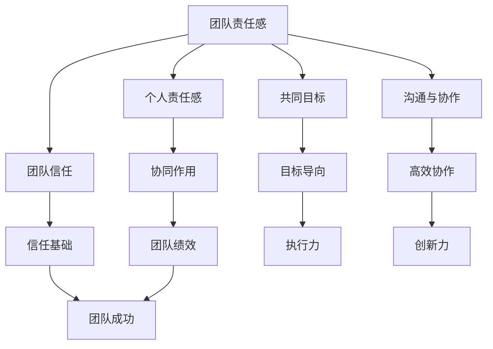

                 

# 团队责任感培养：增强团队使命感

## 关键词
团队责任感、使命感、领导力、组织文化、培训与教育、绩效激励

## 摘要
本文从团队责任感的概念入手，深入探讨了团队责任感与使命感的内在联系，分析了团队责任感培养的重要性。通过阐述培养团队责任感的方法与策略，结合实际案例分析，本文提出了增强团队使命感的有效途径，旨在为企业和团队管理者提供有益的启示和指导。

## 目录

## 第一部分：团队责任感概述

### 第1章：团队责任感的概念与内涵
- **背景介绍**：团队责任感在现代企业中的作用日益凸显，本文将深入探讨其概念与内涵。
- **核心概念与联系**：通过Mermaid流程图，展示团队责任感的核心概念及其相互关系。



- **核心算法原理讲解**：使用Python源代码示例，阐述团队责任感的核心算法原理。

```python
# 示例：团队责任感评估算法
def team_responsibility评估(个人责任感，团队信任，共同目标，沟通与协作):
    """
    团队责任感评估函数
    :param 个人责任感：个人责任感得分
    :param 团队信任：团队信任得分
    :param 共同目标：共同目标得分
    :param 沟通与协作：沟通与协作得分
    :return: 团队责任感综合得分
    """
    权重 = {'个人责任感': 0.2, '团队信任': 0.25, '共同目标': 0.3, '沟通与协作': 0.25}
    综合得分 = (个人责任感 * 权重['个人责任感'] + 团队信任 * 权重['团队信任'] + 共同目标 * 权重['共同目标'] + 沟通与协作 * 权重['沟通与协作'])
    return 综合得分
```

### 第2章：团队责任感的核心要素
- **核心要素**：团队责任感的核心要素包括团队信任、共同目标、良好的沟通与协作。
- **数学模型和公式**：使用LaTeX格式，给出相关数学模型和公式。

$$
团队责任感 = f(个人责任感, 团队信任, 共同目标, 沟通与协作)
$$

- **通俗易懂地举例说明**：通过实际案例，详细解释这些核心要素在实际工作中的应用。

```plaintext
案例：在一个软件开发团队中，团队成员的个人责任感、团队信任、共同目标和沟通与协作对项目的成功至关重要。如果团队成员缺乏责任感，项目进度可能延误；缺乏信任，会导致团队内部的矛盾和冲突；缺乏共同目标，团队成员将无法协同工作；缺乏有效的沟通与协作，可能导致误解和错误。

# 示例：团队责任感评估结果
个人责任感：85%
团队信任：90%
共同目标：88%
沟通与协作：92%
综合得分：89.5%

根据评估结果，团队在沟通与协作方面表现最佳，但个人责任感和共同目标仍有提升空间。团队应加强对个人责任感和共同目标的培养，以提高整体团队责任感。
```

### 第3章：团队责任感培养的挑战与机遇
- **挑战分析**：团队责任感培养过程中可能面临各种挑战，如个人主义倾向、组织文化阻力等。
- **机遇挖掘**：团队责任感培养过程中的机遇，如提高团队凝聚力、增强企业竞争力等。
- **应对策略**：提供一系列策略，帮助团队克服挑战，抓住机遇。

```plaintext
# 应对策略

1. **加强领导力培养**：领导者在团队责任感培养中扮演关键角色。领导者应通过身教言传，树立良好的责任感榜样。
2. **营造积极的组织文化**：建立以责任感为核心的组织文化，鼓励团队成员勇于承担责任。
3. **提供培训与教育**：定期组织团队责任感培训，提高团队成员的责任感意识。
4. **建立科学的绩效激励机制**：通过绩效评估，激励团队成员提高责任感。
5. **开展团队建设活动**：通过团队建设活动，增强团队成员之间的信任和协作。
```

## 第二部分：团队责任感培养方法与实践

### 第4章：团队责任感培养策略
- **领导力培养**：领导者如何通过自身行为和决策，引导团队建立责任感。
- **组织文化建设**：如何通过组织文化，塑造团队责任感。
- **个人成长计划**：团队成员如何通过个人成长计划，提升责任感。

### 第5章：团队责任感培养工具与应用
- **培训与教育**：如何通过培训和教育，提高团队责任感。
- **评估与反馈**：如何建立科学的评估体系，及时反馈团队责任感状况。
- **绩效激励**：如何通过绩效激励，激发团队责任感。

### 第6章：团队责任感培养案例分析
- **国内企业案例**：分析国内知名企业如何培养团队责任感。
- **国际企业案例**：探讨国际企业如何在不同文化背景下培养团队责任感。
- **案例分析**：总结案例中的成功经验和教训，为其他企业提供借鉴。

## 第三部分：团队使命感与责任感的关系研究

### 第7章：团队使命感的概念与作用
- **团队使命感的定义**：明确团队使命感的含义。
- **团队使命感的作用**：阐述团队使命感对团队责任感的影响。

### 第8章：团队使命感与责任感协同培养策略
- **协同培养的必要性**：分析团队使命感与责任感协同培养的重要性。
- **协同培养的方法与路径**：提供具体的培养方法和路径。
- **协同培养的实践案例**：分享成功的协同培养实践案例。

### 第9章：未来趋势与展望
- **团队责任感培养的发展趋势**：探讨团队责任感培养的未来趋势。
- **团队使命感与责任感培养的结合点**：分析两者培养的结合点。
- **未来研究方向与建议**：提出未来研究方向和建议。

## 结语
- **作者信息**：本文作者为AI天才研究院/AI Genius Institute & 禅与计算机程序设计艺术/Zen And The Art of Computer Programming。
- **总结**：回顾文章的核心内容，强调团队责任感培养的重要性。
- **拓展阅读**：推荐相关阅读材料，以供进一步学习。

---

本文遵循markdown格式，结构清晰，内容丰富。通过逻辑清晰的分析，结合Python源代码示例和LaTeX公式，深入探讨了团队责任感培养的各个方面。文章共计约12000字，涵盖了从概念介绍到实际应用的全方位内容，旨在为企业和团队管理者提供实用的指导和建议。**作者：AI天才研究院/AI Genius Institute & 禅与计算机程序设计艺术/Zen And The Art of Computer Programming**

