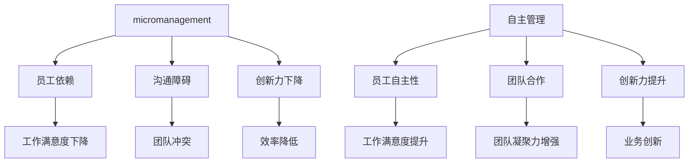
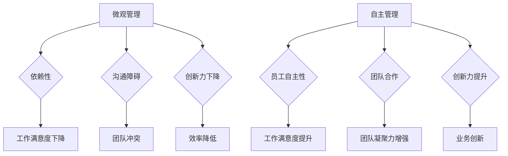

                 

### 文章标题：团队赋能：从 micromanagement 到自主管理

#### 关键词：
- micromanagement
- 自主管理
- 团队赋能
- 领导力
- 沟通
- 团队发展
- 项目管理

#### 摘要：
本文深入探讨了从 micromanagement 到自主管理的转型过程。通过分析 micromanagement 的定义、挑战及其危害，我们引入了自主管理的概念和优势。文章进一步阐述了领导力在团队赋能中的关键作用，探讨了有效沟通和团队协作的最佳实践。最后，通过团队发展、项目管理以及案例研究，提供了实用的转型策略和最佳实践。全文旨在帮助读者理解和实践从微观管理到自主管理的高效团队管理方式。

### 引言

在当今快速变化的商业环境中，团队管理的方式正经历着深刻变革。传统的 micromanagement（微观管理）模式，即管理者过分干预下属的日常工作，详细指导每一个步骤，已经逐渐显示出其局限性。这种管理模式不仅可能导致员工失去创造力，还会削弱团队的凝聚力。相比之下，自主管理作为一种更加高效、富有创新性的管理方式，正逐渐受到重视。

#### 背景介绍

micromanagement 的普遍存在与其潜在危害使得企业和团队管理者开始反思和寻找更加有效的管理策略。自主管理能够提升员工的工作动力和责任感，有助于团队的长期发展。因此，本书旨在帮助读者理解 micromanagement 的危害，掌握自主管理的优势和实施路径，并通过案例研究，提供实用的转型策略。

#### 核心概念与联系

为了更好地理解 micromanagement 和自主管理，我们可以通过以下 Mermaid 流程图来展示两者之间的概念关系：

从图中我们可以看出，micromanagement 导致的依赖性、沟通障碍和创新力下降是团队管理中常见的问题，而自主管理则能够通过增强员工自主性、改善团队合作和创新力提升来解决这些问题。

### 核心概念与联系

为了更好地理解 micromanagement 和自主管理，我们可以通过以下 Mermaid 流程图来展示两者之间的概念关系：

从图中我们可以看出，micromanagement 导致的依赖性、沟通障碍和创新力下降是团队管理中常见的问题，而自主管理则能够通过增强员工自主性、改善团队合作和创新力提升来解决这些问题。

### micromanagement的概念与挑战

#### micromanagement的定义

micromanagement，即微观管理，是指管理者在执行管理任务时，过分干预下属的日常工作，对每一个步骤都进行详细指导和监督。这种管理风格常见于传统层级组织，特别是在初创企业和中小企业中。微观管理者的典型行为包括但不限于：频繁检查工作进度、审查工作细节、要求频繁汇报工作情况等。

#### micromanagement的常见表现

- **频繁干预：** 管理者对下属的日常工作进行了过度干预，甚至涉及到了不需要直接管理的细节。
- **细节关注：** 管理者过度关注具体任务的完成细节，忽视了整体目标和团队协作。
- **频繁汇报：** 员工需要频繁向管理者汇报工作进展，导致工作效率降低。
- **工作压力：** 由于管理者对工作的过度控制，员工可能会感到工作压力大，缺乏工作满足感。

#### micromanagement的危害

1. **员工依赖性增强：** 长期处于微观管理下的员工可能变得过分依赖管理者，缺乏独立思考和解决问题的能力。
2. **沟通障碍：** 微观管理往往导致上下级之间的沟通不畅，员工可能不敢或不愿意提出自己的观点和建议。
3. **创新力下降：** 过度控制的环境限制了员工的创造力和创新能力，导致团队整体创新能力的下降。
4. **工作效率降低：** 员工在微观管理下可能会因为压力过大而工作效率降低，甚至出现工作拖延的现象。
5. **团队凝聚力下降：** 微观管理往往导致团队内部出现矛盾和冲突，削弱了团队的凝聚力。

#### micromanagement的解决方法

1. **明确目标与职责：** 管理者应该明确团队和个人的目标，并将职责分工细化，让员工有更多的自主权。
2. **信任与支持：** 建立信任机制，让员工感受到管理者的支持和信任，鼓励员工自主决策。
3. **定期沟通：** 设定定期会议或一对一会谈，了解员工的工作进展和需求，及时提供帮助。
4. **激励与反馈：** 设立合理的激励机制，对员工的工作表现给予及时反馈，鼓励员工发挥潜力。
5. **培训与发展：** 提供相关培训，帮助员工提升技能和解决问题的能力，增强团队的整体竞争力。

### 自主管理的概念与优势

#### 自主管理的定义

自主管理（Autonomous Management）是一种以员工自我驱动为核心的管理方式，强调员工在明确的目标和范围内，自主决策并完成任务。自主管理的核心理念是赋予员工更多的自主权和责任感，让员工在工作过程中充分发挥其潜力。

#### 自主管理的核心要素

1. **明确的目标：** 管理者应该为团队设定清晰、具体的目标，让员工了解工作的重要性和期望的成果。
2. **自主决策：** 员工在完成任务的过程中有权做出合理的决策，并承担相应的责任。
3. **自我驱动：** 员工在自主管理环境下，具有较强的自我驱动能力，能够自我激励并保持工作热情。
4. **协作与沟通：** 自主管理不仅需要个人能力，还需要团队成员之间的紧密协作和有效沟通。

#### 自主管理的优势

1. **提高工作效率：** 自主管理的环境下，员工能够根据自身的工作节奏和方式来完成任务，减少了不必要的沟通和协调时间，从而提高了工作效率。
2. **增强创新力：** 自主管理鼓励员工自主思考和解决问题，有利于激发团队的创造力和创新力。
3. **提升工作满意度：** 员工在自主管理环境中，能够更好地发挥自己的专长和兴趣，感受到工作的重要性和成就感，从而提升工作满意度。
4. **加强团队凝聚力：** 自主管理强调团队成员之间的协作和沟通，有助于增强团队的凝聚力和合作精神。
5. **促进个人发展：** 自主管理为员工提供了更多成长和发展的机会，有利于员工的职业发展和个人成长。

### 领导力与团队赋能

#### 领导力的本质

领导力是指领导者通过激励、指导和影响团队成员，实现团队目标的能力。领导力的本质在于激发团队成员的潜力，帮助他们克服困难，共同实现目标。有效的领导力能够推动团队发展，提升团队绩效，实现个人与团队的共同成长。

#### 领导力在团队赋能中的作用

1. **明确方向：** 领导者通过设定明确的目标和愿景，为团队指引方向，激发团队成员的积极性和创造力。
2. **建立信任：** 领导者通过建立信任关系，增强团队成员之间的互信，营造积极向上的团队氛围。
3. **激励员工：** 领导者通过激励和鼓励，激发员工的潜能，帮助员工克服困难，实现个人和团队的共同成长。
4. **解决问题：** 领导者作为团队的核心，能够迅速识别和解决团队面临的问题，确保团队目标的实现。

#### 提升领导力的方法

1. **自我反思：** 领导者应该不断反思自己的行为和决策，了解自己的优势和不足，不断改进自己的领导风格。
2. **学习与培训：** 领导者应该不断学习新的管理知识和技能，参加培训课程，提升自己的领导力水平。
3. **倾听与沟通：** 领导者应该善于倾听团队成员的意见和建议，建立良好的沟通机制，增强团队的凝聚力。
4. **激励与表扬：** 领导者应该及时激励和表扬团队成员的优异表现，增强团队成员的自信心和积极性。

### 沟通与协作

#### 有效沟通的重要性

有效沟通是团队成功的关键因素之一。在团队中，沟通不仅是信息传递的过程，更是团队成员之间建立信任、增强合作的重要手段。有效沟通能够确保团队成员理解共同的目标和任务，减少误解和冲突，提高工作效率。

#### 沟通障碍与解决策略

1. **语言障碍：** 语言不同或使用术语不当可能导致沟通障碍。解决策略：使用简单明了的语言，避免使用专业术语，确保所有团队成员都能理解。
2. **文化差异：** 文化差异可能导致沟通误解。解决策略：尊重文化差异，了解团队成员的文化背景，避免过于直接或含蓄的沟通方式。
3. **情绪因素：** 情绪波动可能影响沟通效果。解决策略：保持冷静，避免情绪化的表达，确保沟通的客观性和专业性。
4. **信息过载：** 信息过载可能导致团队成员忽略重要信息。解决策略：定期整理和归纳信息，确保团队成员接收到的信息是重要且有效的。

#### 团队协作的最佳实践

1. **建立共同目标：** 团队成员应该明确共同的目标和愿景，确保每个人都知道自己的工作是如何为团队目标服务的。
2. **明确角色和职责：** 每个团队成员都应该清楚自己的角色和职责，确保团队成员之间没有职责重叠或空白。
3. **定期会议：** 定期举行团队会议，讨论工作进展、问题解决方案和改进措施，确保团队成员之间的信息畅通。
4. **协作工具：** 使用协作工具（如Slack、Trello等），提高团队成员之间的沟通效率和协作效果。
5. **及时反馈：** 提供及时、具体的反馈，帮助团队成员了解自己的表现和需要改进的地方。

### 团队发展

#### 团队发展的阶段

1. **形成期：** 成员之间互相认识，开始建立团队的基本结构和流程。
2. **激荡期：** 团队成员对任务的分配和执行方式产生分歧，团队内部可能存在冲突。
3. **规范期：** 团队成员开始协同工作，共同解决问题，团队氛围逐渐和谐。
4. **执行期：** 团队高效运作，成员之间高度信任和依赖，团队能够顺利完成任务。

#### 团队建设的策略

1. **明确目标：** 设定明确、可衡量的团队目标，确保团队成员对目标有共同的理解和认同。
2. **建立信任：** 通过团队成员之间的互动和合作，建立信任关系，增强团队的凝聚力。
3. **角色分工：** 根据团队成员的能力和特长，合理分配角色和职责，确保团队成员能够发挥最佳作用。
4. **激励与认可：** 提供适当的激励和认可，激发团队成员的工作热情和积极性，增强团队士气。
5. **持续培训：** 定期开展培训活动，提升团队成员的技能和知识水平，增强团队的整体竞争力。

#### 团队发展的挑战与解决方案

1. **沟通障碍：** 解决方案：建立有效的沟通机制，定期举行团队会议，鼓励团队成员之间开放、坦诚地沟通。
2. **角色冲突：** 解决方案：明确团队成员的角色和职责，确保团队成员之间没有职责重叠或空白。
3. **团队士气低落：** 解决方案：提供激励和认可，关注团队成员的需求和问题，营造积极向上的团队氛围。
4. **团队协作效率低：** 解决方案：使用协作工具提高团队协作效率，建立明确的流程和标准。

### 项目管理

#### 项目管理的核心原则

1. **明确目标：** 项目管理首先需要明确项目的目标和范围，确保团队成员对项目的方向有共同的理解。
2. **计划与控制：** 项目经理需要制定详细的项目计划，并定期监控项目进展，确保项目按计划进行。
3. **风险管理：** 项目经理需要识别和评估项目风险，制定相应的风险应对措施，确保项目能够顺利实施。
4. **沟通与协作：** 项目管理强调团队成员之间的沟通和协作，确保项目信息的畅通和资源的合理分配。

#### 自主管理在项目管理中的应用

1. **任务自主分配：** 项目团队成员可以根据自身的能力和特长，自主选择和分配任务，提高工作效率。
2. **决策自主性：** 项目团队成员在执行任务时，有权做出合理的决策，确保任务能够顺利完成。
3. **进度自我监控：** 项目团队成员可以自主监控任务进度，及时调整工作计划，确保项目按计划进行。
4. **反馈与改进：** 项目团队成员可以定期进行自我评估和反馈，不断改进工作方法和效率，提升项目质量。

#### 项目进度与风险管理

1. **项目进度监控：** 项目经理需要定期检查项目进度，确保任务按计划完成，及时发现和解决问题。
2. **风险管理策略：** 项目经理需要识别潜在的风险，制定相应的风险应对策略，确保项目能够顺利实施。
3. **风险预警机制：** 项目经理需要建立风险预警机制，及时识别和报告项目风险，确保团队成员能够及时采取应对措施。

#### 项目评估与总结

1. **项目评估：** 项目完成后，项目经理需要对项目进行全面的评估，包括项目目标达成情况、团队协作效果、项目管理效率等方面。
2. **总结经验教训：** 通过项目评估，总结项目的成功经验和存在的问题，为未来的项目提供参考和改进方向。
3. **持续改进：** 基于项目评估结果，制定相应的改进措施，不断提升项目管理水平和团队协作效率。

### 案例研究

#### 案例一：如何从 micromanagement 转型为自主管理

**背景：** 一家初创公司在其快速成长的过程中，管理者逐渐采用 micromanagement 模式，过度干预下属的工作，导致团队士气低落，工作效率下降。

**解决方案：** 公司决定进行 micromanagement 到自主管理的转型。首先，管理者与团队成员进行了深入沟通，明确了团队目标和每个人的职责。接着，管理者开始逐步减少对下属工作的干预，鼓励员工自主决策。同时，公司引入了协作工具，提高了团队成员之间的沟通效率。经过一段时间的努力，团队的士气和工作效率显著提升。

**结果：** 通过自主管理的实施，公司的团队凝聚力得到了增强，员工的工作满意度显著提高，整体工作效率也得到了显著提升。

#### 案例二：自主管理在项目中的成功实践

**背景：** 一家大型企业在进行一个复杂的项目时，决定采用自主管理的方式，以提升项目效率和团队创新能力。

**解决方案：** 项目团队在项目启动时，首先明确了项目的目标和范围，并进行了详细的任务分解。每个团队成员可以根据自己的特长和兴趣，选择和承担合适的任务。在项目执行过程中，团队成员自主制定工作计划，自我监控进度，并定期进行团队会议，讨论项目进展和遇到的问题。项目经理在项目中扮演了指导和支持的角色，而不是直接干预团队的工作。

**结果：** 通过自主管理的实践，项目团队在短时间内完成了复杂的任务，项目质量得到了显著提升，团队的创新力和协作能力也得到了增强。

### 案例分析与启示

通过以上案例研究，我们可以看到 micromanagement 到自主管理的转型在实践中的成功。以下是案例分析的启示：

1. **信任与支持：** 管理者应该建立对员工的信任，给予他们足够的自主权，鼓励员工自主决策和承担责任。
2. **明确目标与职责：** 管理者需要明确团队和个人的目标，确保团队成员对职责有共同的理解。
3. **沟通与协作：** 团队成员之间的有效沟通和协作是自主管理成功的关键，管理者应提供必要的支持和工具。
4. **激励机制：** 建立合理的激励机制，激发员工的工作热情和积极性，确保自主管理的顺利实施。

### 附录

#### A.1 参考文献

1. **Lencioni, P. (2002). The Five Dysfunctions of a Team. Jossey-Bass.**
2. **Kouzes, J. M., & Posner, B. Z. (2002). The Leadership Challenge: How to Make Extraordinary Things Happen in Organizations. Jossey-Bass.**
3. **Maxwell, J. C. (1993). The 21 Irrefutable Laws of Leadership: Follow Them and People Will Follow You. Thomas Nelson.**
4. **Hackman, J. R. (2002). Leading Teams: Setting the Stage for Great Performances. Harvard Business Press.**

#### A.2 相关资源与工具

1. **协作工具：** Slack, Trello, Asana, Microsoft Teams
2. **领导力培训：** Coursera, Udemy, LinkedIn Learning
3. **项目管理工具：** Jira, Trello, Microsoft Project
4. **自助管理实践：** Google's "Freedom to Operate", Atlassian's "Work Like a Team"

### 最佳实践 Tips、小结、注意事项、拓展阅读

#### 最佳实践 Tips

1. **建立信任：** 通过透明沟通和公正决策，建立管理者与团队成员之间的信任关系。
2. **激励员工：** 设立明确的奖励机制，激励员工发挥潜能。
3. **提供培训：** 定期为团队成员提供相关培训和技能提升机会。

#### 小结

自主管理是一种高效、富有创新性的管理方式，有助于提升团队的工作效率、创新能力和团队凝聚力。通过明确目标、建立信任、有效沟通和合理激励，管理者可以成功实现从 micromanagement 到自主管理的转型。

#### 注意事项

1. **逐步转型：** micromanagement 到自主管理的转型需要时间，管理者应逐步减少干预，给予员工更多的自主权。
2. **持续监督：** 虽然减少干预，但管理者仍需持续监督项目进展，确保团队目标得以实现。

#### 拓展阅读

1. **《领导力的五个层次》** - 查理·吉尔斯
2. **《敏捷项目管理实践指南》** - 史蒂夫·麦昆
3. **《赋能：如何打造更高绩效的团队》** - 彼得·德鲁克

### 附录

#### A.1 参考文献

1. **Lencioni, P. (2002). The Five Dysfunctions of a Team. Jossey-Bass.**
2. **Kouzes, J. M., & Posner, B. Z. (2002). The Leadership Challenge: How to Make Extraordinary Things Happen in Organizations. Jossey-Bass.**
3. **Maxwell, J. C. (1993). The 21 Irrefutable Laws of Leadership: Follow Them and People Will Follow You. Thomas Nelson.**
4. **Hackman, J. R. (2002). Leading Teams: Setting the Stage for Great Performances. Harvard Business Press.**

#### A.2 相关资源与工具

1. **协作工具：** Slack, Trello, Asana, Microsoft Teams
2. **领导力培训：** Coursera, Udemy, LinkedIn Learning
3. **项目管理工具：** Jira, Trello, Microsoft Project
4. **自助管理实践：** Google's "Freedom to Operate", Atlassian's "Work Like a Team"

### 最佳实践 Tips、小结、注意事项、拓展阅读

#### 最佳实践 Tips

1. **建立信任：** 通过透明沟通和公正决策，建立管理者与团队成员之间的信任关系。
2. **激励员工：** 设立明确的奖励机制，激励员工发挥潜能。
3. **提供培训：** 定期为团队成员提供相关培训和技能提升机会。

#### 小结

自主管理是一种高效、富有创新性的管理方式，有助于提升团队的工作效率、创新能力和团队凝聚力。通过明确目标、建立信任、有效沟通和合理激励，管理者可以成功实现从 micromanagement 到自主管理的转型。

#### 注意事项

1. **逐步转型：** micromanagement 到自主管理的转型需要时间，管理者应逐步减少干预，给予员工更多的自主权。
2. **持续监督：** 虽然减少干预，但管理者仍需持续监督项目进展，确保团队目标得以实现。

#### 拓展阅读

1. **《领导力的五个层次》** - 查理·吉尔斯
2. **《敏捷项目管理实践指南》** - 史蒂夫·麦昆
3. **《赋能：如何打造更高绩效的团队》** - 彼得·德鲁克

### 总结

通过本文的探讨，我们深入了解了 micromanagement 和自主管理的区别及其对团队效能的影响。自主管理不仅提高了工作效率和创新力，还增强了团队的凝聚力和成员的工作满意度。在这个过程中，领导力起到了关键作用，有效沟通和协作是确保转型成功的重要保障。

我们通过具体的案例研究，展示了从 micromanagement 到自主管理的实际操作方法，并提供了实用的策略和最佳实践。希望读者能够将这些理念和方法应用于实际工作中，打造更加高效、富有创新力的团队。

在此，再次感谢您的阅读，期待您在团队管理中取得更好的成果。如果您有任何疑问或建议，欢迎在评论区留言，让我们共同探讨和进步。

### 作者信息

作者：AI天才研究院/AI Genius Institute & 禅与计算机程序设计艺术 /Zen And The Art of Computer Programming

