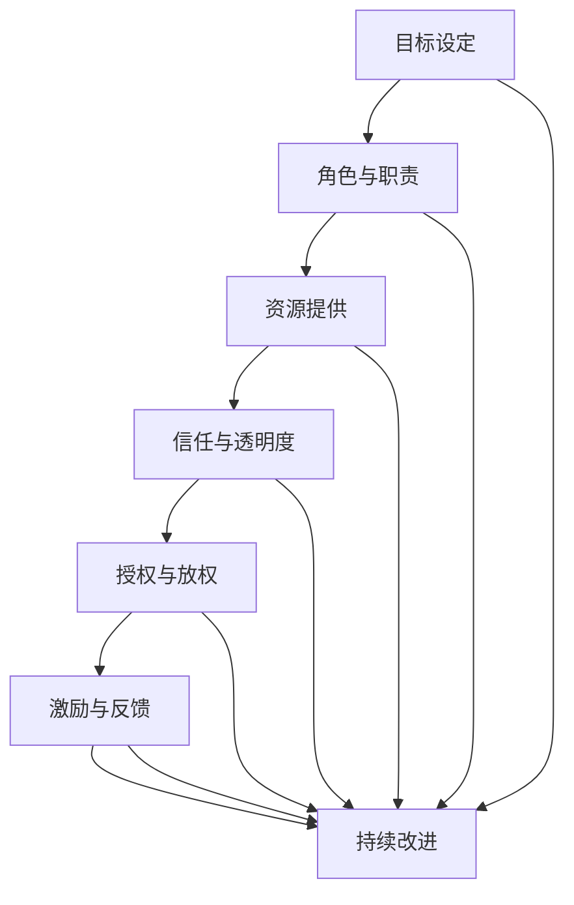

                 

### 文章标题

# 团队赋能：从控制到授权的领导转变

### 关键词

- 团队赋能
- 授权型领导
- 领导力变革
- 组织文化
- 目标设定
- 透明度与信任
- 沟通机制
- 激励与反馈
- 案例分析

### 摘要

本文将探讨团队赋能在现代组织管理中的重要性，以及领导者如何从控制型转向授权型领导。文章首先定义团队赋能的概念和其核心要素，然后分析从控制到授权的领导转变的必要性和优势。通过详细阐述领导者的角色转变、建立信任与透明度、授权与放权、领导力发展等关键环节，本文提供了实际操作指南。此外，文章通过设定明确的目标、提供必要资源、建立有效的沟通机制、激励团队和反馈与改进等实践环节，展现了团队赋能的全过程。最后，通过两个实际案例的深入分析，总结了团队赋能的成功实践和面临的挑战，为未来的领导者和组织提供了有价值的参考。

## 第一部分：背景与核心概念

### 1.1 团队赋能：变革的必要

#### 1.1.1 定义与价值

团队赋能（Team Empowerment）是指组织通过赋予员工更多的自主权和责任，以提升其工作动力、创新能力和整体绩效的过程。这种做法不仅仅是在人力资源领域有重要意义，更是在整个组织管理中起到了关键作用。在传统的组织管理中，领导者往往扮演着控制者的角色，对团队成员的工作进行严格监督和指导。然而，这种控制型管理模式逐渐暴露出其局限：

1. **抑制创新**：控制型领导模式往往限制了团队成员的自主性和创造力，导致创新能力的下降。
2. **降低员工满意度**：严格的管理和控制使员工感到缺乏自主权，从而影响工作满意度和忠诚度。
3. **效率低下**：过度控制往往导致沟通不畅和资源浪费，影响组织的整体效率。

相比之下，团队赋能通过赋予员工更多的责任和自主权，能够激发团队成员的积极性和创造力，提高工作绩效。团队赋能的核心价值体现在以下几个方面：

- **提高工作效率**：团队成员在自主决策和执行过程中，能够更高效地完成工作。
- **促进创新**：赋予员工更多自主权，能够激发他们的创造力和创新能力。
- **增强团队凝聚力**：通过共同的目标和责任，团队成员之间的信任和协作能力得到提升。
- **提升员工满意度**：自主权和责任感能够提高员工的工作满意度和忠诚度。

#### 1.1.2 团队赋能与领导力的结合

团队赋能不仅仅是人力资源管理的变革，更是一项涉及整个组织文化的系统性变革。领导者在这个过程中起着关键作用，他们需要从控制者转变为赋能者。这意味着领导者需要具备以下几种关键能力：

1. **建立信任**：信任是团队赋能的基础，领导者需要通过透明度和开放性建立和维护信任。
2. **培养透明度**：领导者需要保持信息透明，确保团队成员能够了解组织的战略和目标。
3. **授权与放权**：领导者需要明确团队成员的职责和权限，给予他们足够的自主权和决策权。
4. **提供资源**：领导者需要确保团队成员能够获得完成任务所需的资源和支持。
5. **激励与反馈**：领导者需要通过激励措施和及时的反馈机制，激发团队成员的积极性和创造力。

综上所述，团队赋能不仅是组织变革的必要手段，也是领导力提升的重要方向。通过有效实施团队赋能，组织能够实现更高的工作效率、更强的创新能力和更紧密的团队协作，从而在竞争激烈的市场中立于不败之地。

#### 1.2 从控制到授权：领导变革

#### 1.2.1 控制型领导模式的局限

在传统的组织管理模式中，控制型领导模式是主导形式。这种模式的特点是领导者通过严格监督和控制，确保团队成员按照预定的计划和标准执行任务。尽管在某些情况下，这种模式能够确保任务完成，但它也带来了一系列的局限和负面影响：

1. **抑制自主性**：控制型领导模式限制了员工的自主性和创造力，使得团队成员往往只能按照领导者的指示执行任务，缺乏自主决策的能力。
2. **降低员工积极性**：在控制型管理模式下，员工往往感受到缺乏自主权和责任感，这会降低他们的工作积极性和满意度。
3. **增加管理成本**：控制型领导模式需要领导者投入大量时间和精力进行监督和控制，增加了管理成本，且可能导致沟通不畅和资源浪费。
4. **影响团队协作**：过度控制会导致团队成员之间的信任和协作能力下降，影响团队的整体绩效。

控制型领导模式在短期内可能带来一定的秩序和效率，但从长远来看，它不利于组织的创新和可持续发展。随着市场竞争的加剧和员工需求的多样化，控制型管理模式逐渐暴露出其不足。

#### 1.2.2 授权型领导模式的优点与实施

与控制型领导模式相比，授权型领导模式强调赋予员工更多的自主权和责任，激发他们的创造力和积极性。授权型领导模式的优点主要体现在以下几个方面：

1. **提高工作效率**：授权型领导模式允许员工自主决策和执行任务，能够提高工作效率和灵活性。
2. **促进创新**：在授权型管理模式下，员工有更大的空间进行创新和尝试，有利于组织创新能力的提升。
3. **增强员工满意度**：赋予员工自主权和责任感，能够提高他们的工作满意度和忠诚度。
4. **增强团队协作**：授权型领导模式鼓励团队成员之间的沟通和协作，有助于建立高效的团队。
5. **降低管理成本**：授权型领导模式减少了领导者的直接监督和控制，能够降低管理成本。

为了有效实施授权型领导模式，领导者需要采取以下措施：

1. **建立信任**：信任是授权型领导模式的基础，领导者需要通过透明度和开放性建立和维护信任。
2. **明确角色和职责**：领导者需要明确团队成员的职责和权限，确保他们能够自主决策和执行任务。
3. **提供必要的资源和支持**：领导者需要确保团队成员能够获得完成任务所需的资源和支持。
4. **鼓励反馈和改进**：领导者需要鼓励团队成员提供反馈，并根据反馈进行改进，以不断提升团队绩效。

通过从控制到授权的领导变革，组织能够实现更高效、更创新和更和谐的团队协作，从而在竞争激烈的市场中立于不败之地。

#### 1.3 核心概念联系

团队赋能是一个复杂的系统性工程，涉及多个核心概念和要素。为了更好地理解和实施团队赋能，我们需要明确这些概念之间的联系，并借助 Mermaid 流程图进行可视化展示。

##### 1.3.1 团队赋能过程 Mermaid 图

首先，我们定义团队赋能的主要环节和要素：

1. **目标设定**：明确团队的目标和期望，确保团队成员有清晰的方向。
2. **角色与职责**：明确每个团队成员的角色和职责，确保任务的分配合理。
3. **资源提供**：确保团队成员能够获得完成任务所需的资源和支持。
4. **信任与透明度**：建立信任，保持信息的透明度，促进团队成员之间的沟通和协作。
5. **授权与放权**：赋予团队成员足够的自主权和责任，激发他们的积极性和创造力。
6. **激励与反馈**：通过激励措施和及时的反馈，激发团队成员的积极性和创造力。
7. **持续改进**：根据反馈和评估，不断改进团队赋能的实施效果。

接下来，我们使用 Mermaid 流程图来展示这些环节和要素之间的联系：

在这个流程图中，每个环节都是团队赋能的重要组成部分，且彼此之间紧密相连。目标设定为团队赋能提供了方向，角色与职责的明确确保了任务的合理分配和执行。资源提供、信任与透明度、授权与放权、激励与反馈等环节则共同促进了团队成员的积极性和创造力，最终通过持续改进不断提升团队赋能的效果。

##### 1.3.2 团队赋能与组织文化

团队赋能不仅仅是技术层面的变革，更是组织文化的转变。组织文化对团队赋能的实施具有重要影响：

1. **支持性文化**：一个支持性的组织文化能够鼓励员工自主性和创新，为团队赋能提供良好的环境。
2. **开放性文化**：开放性文化强调信息的共享和透明，有助于建立信任和促进沟通。
3. **灵活性文化**：灵活性文化鼓励团队成员适应变化，尝试新的方法和思路，有利于创新和改进。
4. **合作性文化**：合作性文化强调团队合作和协作，有助于提高团队的整体绩效。

为了建立一个支持团队赋能的组织文化，领导者需要采取以下措施：

1. **树立榜样**：领导者通过自己的行为和决策，树立起支持团队赋能的榜样。
2. **培养团队合作精神**：通过团队建设活动和项目合作，培养团队成员的团队合作精神。
3. **鼓励反馈与改进**：建立反馈机制，鼓励团队成员提出建议和意见，并进行持续的改进。
4. **提供培训与发展机会**：为员工提供培训和职业发展机会，提高他们的能力和素质。

通过建立支持性、开放性、灵活性和合作性的组织文化，组织能够为团队赋能提供坚实的基础，从而实现更高的绩效和创新能力。

## 第二部分：领导力变革

### 2.1 领导者的角色转变

#### 2.1.1 领导者从控制者到赋能者的转变

在传统的组织管理模式中，领导者往往扮演着控制者的角色，通过严格的监督和指导确保团队成员按照预定计划执行任务。然而，随着组织环境和员工需求的变化，领导者需要从控制者转变为赋能者，以适应新的管理要求。这种转变不仅涉及领导者角色的变化，还包括领导者能力的提升和思维模式的转变。

首先，领导者需要从控制者转变为赋能者，意味着他们需要放弃对团队成员的过度干预和监督，而是通过授权、信任和激励来激发团队成员的潜力和创造力。具体来说，这种转变体现在以下几个方面：

1. **授权**：领导者需要明确团队成员的职责和权限，赋予他们足够的自主权和决策权，让他们能够自主制定工作计划和解决问题。

2. **信任**：信任是赋能型领导的基础，领导者需要相信团队成员有能力完成任务，并通过透明度和开放性建立和维护信任。

3. **激励**：领导者需要通过激励措施激发团队成员的积极性和创造力，例如奖励、晋升和职业发展机会。

其次，领导者需要具备新的能力，以应对赋能型领导的要求。这些新能力包括：

1. **沟通能力**：领导者需要能够有效沟通，传达组织目标和愿景，同时倾听团队成员的意见和反馈。

2. **领导力发展**：领导者需要关注自身领导力的发展，通过培训和学习不断提升自己的领导能力。

3. **情绪管理**：领导者需要具备良好的情绪管理能力，能够在压力和挑战面前保持冷静和理智，同时帮助团队成员应对情绪波动。

最后，领导者需要转变思维模式，从注重控制和管理转向注重赋能和支持。这种转变意味着领导者需要关注团队成员的需求和潜力，为他们提供成长和发展的机会，同时鼓励创新和尝试。通过这种转变，领导者能够建立起一个高效、创新和和谐的团队，从而实现组织的长期发展。

#### 2.1.2 领导者的新技能要求

在从控制者到赋能者的转变过程中，领导者需要掌握一系列新技能，以适应赋能型领导的需求。以下是领导者在新角色下需要具备的关键技能：

1. **沟通技能**：有效的沟通是赋能型领导的核心，领导者需要能够清晰地传达组织的目标和愿景，同时倾听团队成员的意见和建议。沟通技能包括口头和书面沟通的能力、非言语沟通的解读、以及在不同情境下选择合适的沟通方式。

2. **激励技能**：激励团队成员是领导者的重要职责，领导者需要能够设计激励措施，激发团队成员的内在动机和外在动力。激励技能涉及了解不同类型的激励理论，如目标设定理论、公平理论、需要层次理论等，并能根据团队成员的特点和需求实施个性化的激励策略。

3. **决策技能**：在赋能型领导模式下，领导者需要更多地将决策权下放给团队成员，但并不意味着领导者不再做决策。相反，领导者需要具备更高级的决策技能，包括风险评估、资源分配、以及如何在不确定的环境下做出有效决策。

4. **情绪管理技能**：领导者需要具备良好的情绪管理能力，以应对团队成员的情绪波动和压力。情绪管理技能包括自我情绪认知、情绪调节、以及如何在团队中建立积极情绪的氛围。

5. **领导力发展技能**：领导者需要不断地提升自己的领导力，以适应不断变化的管理环境。领导力发展技能包括自我反思、持续学习、以及指导和支持团队成员的成长。

6. **冲突解决技能**：在团队中，冲突是不可避免的。领导者需要具备有效的冲突解决技能，包括识别冲突、理解冲突背后的原因、以及采取适当的措施解决冲突。

通过掌握这些新技能，领导者能够更好地实施赋能型领导，激发团队成员的潜力，提升团队的整体绩效。

#### 2.2 建立信任与透明度

在团队赋能的过程中，信任和透明度是两个至关重要的因素。信任是团队成员之间相互依赖和合作的基础，而透明度则是建立和维护信任的重要手段。以下是如何在团队中建立信任和透明度的具体方法和步骤：

##### 2.2.1 信任的建立与维护

1. **明确角色和责任**：确保每个团队成员都清楚自己的角色和责任，避免角色重叠和职责不清，这样可以减少误解和冲突，增强团队成员之间的信任。

2. **建立沟通机制**：建立一个开放、有效的沟通机制，使团队成员能够自由地交流意见和反馈。定期的团队会议、一对一谈话、以及在线协作工具都是有效的沟通方式。

3. **共享信息和资源**：透明地共享信息和资源，使团队成员能够了解整个团队的工作进展和挑战。这不仅可以减少误解，还可以增强团队成员之间的信任。

4. **承诺与信任**：领导者需要通过行动和承诺来展示自己的信任，例如，领导者可以公开承认错误，并采取纠正措施，这有助于树立榜样，增强团队成员对领导者的信任。

5. **建立共同目标**：共同的目标可以增强团队成员之间的联系和信任，因为大家都在朝着同一个方向努力。

6. **解决冲突**：冲突是信任破裂的常见原因，领导者需要采取适当的措施解决冲突，以维护团队中的信任。

##### 2.2.2 透明度在团队中的价值

1. **提高工作效率**：透明度可以减少误解和重复工作，使团队成员能够更高效地协作。

2. **增强责任感**：当团队成员了解整个团队的工作进展和挑战时，他们会感到更有责任感，因为他们知道自己的工作对团队整体目标的重要性。

3. **促进创新**：透明度可以鼓励团队成员提出新的想法和建议，因为他们相信这些想法和建议会被认真考虑。

4. **提高员工满意度**：透明度可以增强员工对组织的信任和归属感，从而提高他们的工作满意度和忠诚度。

5. **降低管理成本**：透明度可以减少领导者的监督和控制工作，从而降低管理成本。

##### 2.2.3 实现透明度的具体方法

1. **定期报告**：领导者可以定期向团队成员报告团队的工作进展、目标完成情况和面临的挑战。

2. **开放信息共享平台**：建立一个共享平台，如共享文件夹或内部社交网络，使团队成员可以随时访问相关资料和信息。

3. **公开讨论**：在团队会议或项目评审中，鼓励团队成员公开讨论问题、分享见解和解决方案。

4. **实时沟通**：利用即时通讯工具和视频会议，确保团队成员能够实时交流，减少信息滞后。

5. **反馈机制**：建立一个反馈机制，使团队成员可以匿名反馈意见和问题，确保信息的透明性和开放性。

通过建立信任和透明度，领导者可以为团队赋能创造一个良好的环境，从而促进团队协作和创新，提升整体绩效。

#### 2.3 授权与放权

在团队赋能的过程中，授权和放权是两个关键步骤。正确地授权和放权不仅可以提升团队成员的积极性和创造力，还可以提高团队的整体绩效。以下是如何有效地进行授权和放权的具体方法和步骤：

##### 2.3.1 授权的原则

1. **明确目标**：在授权之前，领导者需要明确团队的目标和任务，确保团队成员了解他们的职责和期望。

2. **信任与透明度**：授权是基于信任的，领导者需要通过透明度和开放性建立和维护信任。团队成员需要知道他们被授权的范围和权限。

3. **责任与权限对等**：授权时，领导者需要确保团队成员的责任和权限是对等的，即他们被赋予的权限足以完成任务。

4. **适当的支持**：虽然授权意味着团队成员有更大的自主权，但领导者仍需提供必要的支持，包括资源、培训和技术支持。

5. **监督与反馈**：领导者需要定期监督团队成员的工作进展，并提供及时的反馈，以帮助团队成员改进和提升。

##### 2.3.2 如何有效放权

1. **明确角色与职责**：在授权之前，领导者需要明确每个团队成员的角色和职责，确保他们了解自己的职责和权限。

2. **提供必要的资源**：确保团队成员能够获得完成任务所需的资源和支持，包括资金、技术工具和人力资源。

3. **建立信任**：领导者需要通过透明度和开放性建立和维护信任，使团队成员相信他们有能力完成任务。

4. **赋予决策权**：在授权时，领导者需要赋予团队成员足够的决策权，让他们能够在必要时做出决策。

5. **鼓励自主性**：鼓励团队成员发挥自主性，尝试新的方法和思路，这有助于提高创新能力和工作效率。

6. **及时反馈**：领导者需要提供及时的反馈，帮助团队成员改进和提升，同时确保团队目标的实现。

通过正确地授权和放权，领导者可以激发团队成员的潜力，提高团队的整体绩效，同时实现个人和组织的共同发展。

### 2.4. 领导力发展

#### 2.4.1 领导力评估工具

在实施团队赋能的过程中，领导力发展是一个持续的过程。为了有效提升领导力，领导者需要通过评估工具来识别自身的优势和不足，并制定相应的提升策略。以下是一些常用的领导力评估工具：

1. **360度反馈**：360度反馈是一种综合性的评估方法，通过收集来自团队成员、上级、同事和下属的意见，对领导者的行为和绩效进行评估。这种方法可以帮助领导者了解自己的优点和需要改进的领域。

2. **领导力问卷**：领导力问卷是一种标准化的评估工具，通常包括一系列针对不同领导力维度的问项。这些问卷可以根据不同的领导情境和需求进行定制，帮助领导者了解自身的领导风格和能力。

3. **行为观察**：通过观察领导者在实际工作中的行为和决策，可以评估其领导力。这种方法通常由第三方专家进行，以确保评估的客观性和准确性。

4. **角色扮演**：角色扮演是一种模拟实际工作场景的评估方法，领导者需要在模拟环境中展示其领导技能。这种方法可以帮助领导者识别自己在实际工作中的潜在问题和改进点。

#### 2.4.2 领导力提升策略

在了解自身的优势和不足之后，领导者需要制定相应的提升策略，以不断提升自己的领导力。以下是一些有效的提升策略：

1. **持续学习**：领导者需要不断学习新的知识和技能，以适应不断变化的管理环境。这可以通过参加培训课程、阅读专业书籍、参与研讨会和研讨会等方式实现。

2. **实践与反思**：领导者需要在实际工作中不断实践所学知识和技能，并通过反思和总结，不断提升自己的领导力。实践与反思是一个循环过程，通过不断实践和反思，领导者可以不断改进和提升自己的领导能力。

3. **角色模范**：领导者可以通过学习优秀的领导者，了解他们的成功经验和教训，并从中吸取有益的启示。这可以通过阅读领导力传记、观看领导力演讲视频等方式实现。

4. **反馈与改进**：领导者需要接受来自团队成员、上级和下属的反馈，并根据反馈进行改进。这可以帮助领导者识别自身的问题，并采取相应的措施进行改进。

5. **建立支持网络**：领导者需要建立一个支持网络，包括同事、导师和教练等。这些支持者可以提供宝贵的意见和建议，帮助领导者不断提升自己的领导力。

通过领导力评估工具和提升策略，领导者可以不断改进和提升自己的领导能力，从而更有效地实施团队赋能，推动团队和组织的发展。

### 3.1. 设定明确的目标

#### 3.1.1 明确目标的重要性

在团队赋能过程中，设定明确的目标至关重要。明确的目标不仅为团队成员提供了清晰的方向，还能够激发他们的积极性和创造力。以下是设定明确目标的重要性：

1. **指导行动**：明确的目标可以帮助团队成员了解他们需要做什么，以及如何做。这减少了不必要的困惑和重复工作，提高了工作效率。

2. **激励员工**：明确的目标可以激发团队成员的内在动机，使他们更加专注和投入工作。当团队成员看到他们的努力能够带来具体的成果时，他们会感到更有成就感。

3. **增强责任感**：明确的目标使团队成员清楚地知道他们的职责和责任，从而增强他们的责任感和使命感。

4. **促进协作**：明确的目标可以促进团队成员之间的协作，因为大家都有共同的目标和方向，可以更容易地协同工作。

5. **评估绩效**：明确的目标为评估团队和团队成员的绩效提供了标准，有助于及时调整策略和改进工作。

#### 3.1.2 如何设定可衡量的目标

为了确保目标的明确性和可操作性，领导者需要遵循以下原则和方法来设定可衡量的目标：

1. **SMART原则**：SMART原则是指目标应该是具体的（Specific）、可衡量的（Measurable）、可实现的（Achievable）、相关的（Relevant）和时限的（Time-bound）。例如，一个具体的、可衡量的目标可以是：“在下一季度，团队A的产品迭代完成率达到90%。”

2. **分解目标**：将大目标分解为一系列小目标，使团队成员能够逐步实现。这种方法不仅有助于目标的实现，还能够提供及时的反馈和调整。

3. **角色定位**：确保每个团队成员都明确他们在目标实现过程中的角色和责任。这有助于避免职责重叠和责任不明，提高团队协作效率。

4. **定期评审**：设定一个定期评审机制，以评估目标的进展和效果。这可以帮助团队及时调整策略，确保目标能够按时完成。

5. **透明沟通**：保持目标设定的透明度，使团队成员能够了解目标的重要性和实现方法。这有助于增强团队成员的参与感和责任感。

通过遵循这些原则和方法，领导者可以设定明确且可衡量的目标，从而为团队赋能提供坚实的基础。

### 3.2. 提供必要的资源

#### 3.2.1 资源的识别与分配

在团队赋能过程中，提供必要的资源是确保目标实现的关键。资源的识别与合理分配对于团队的成功至关重要。以下是资源识别与分配的具体步骤：

1. **需求分析**：首先，领导者需要了解团队成员在实现目标过程中可能需要的各种资源，包括人力、资金、技术工具和信息等。这可以通过与团队成员的沟通、调查问卷和现有资源评估来完成。

2. **资源识别**：根据需求分析，识别现有资源，包括组织内部的资源和外部可获得的资源。这有助于确保资源的充分利用，避免资源的重复浪费。

3. **优先级排序**：对识别出的资源进行优先级排序，根据目标的紧急性和重要性来确定资源的分配顺序。例如，对于关键性任务，优先分配关键资源。

4. **合理分配**：将资源合理地分配给团队成员，确保每个成员都能够获得完成任务所需的资源。分配时需要考虑团队成员的能力和职责，以避免资源浪费。

5. **动态调整**：资源分配不是一次性的，需要根据项目的进展和变化进行动态调整。领导者需要密切关注资源的使用情况，并根据实际情况进行调整，以确保资源始终能够满足团队的需求。

#### 3.2.2 提升资源利用效率

资源利用效率是团队赋能的一个重要指标。为了提升资源利用效率，领导者可以采取以下策略：

1. **优化流程**：通过优化工作流程，减少不必要的步骤和时间浪费，提高资源的使用效率。

2. **技术整合**：利用先进的技术工具和系统，实现资源的自动化和集成管理，提高资源利用效率。

3. **培训与发展**：为团队成员提供必要的培训和技能提升，使其能够更高效地使用资源。

4. **信息共享**：建立一个信息共享平台，使团队成员能够及时获取所需的信息，减少信息滞后和重复劳动。

5. **定期审计**：定期对资源的使用情况进行审计，识别浪费和低效的现象，并采取改进措施。

通过识别与合理分配资源，并提升资源利用效率，领导者可以确保团队赋能的有效实施，从而实现更高的绩效和创新能力。

### 3.3. 建立有效的沟通机制

#### 3.3.1 沟通的重要性

在团队赋能的过程中，沟通是确保团队协作和目标实现的关键环节。有效的沟通不仅可以增强团队成员之间的信任和合作，还能够提高工作效率和团队绩效。以下是沟通在团队赋能中的重要性：

1. **信息传递**：沟通是信息传递的桥梁，通过有效的沟通，团队成员可以及时了解团队的目标、任务和进展，避免因信息不对称而导致的误解和冲突。

2. **增强协作**：沟通能够促进团队成员之间的协作，使每个人都能明确自己的职责和任务，从而提高团队的协同效率。

3. **提高透明度**：有效的沟通可以增强团队的透明度，使团队成员了解团队的内部运作和决策过程，从而增强信任和归属感。

4. **激发创新**：开放的沟通环境可以激发团队成员的创新思维，鼓励他们提出新的想法和建议，从而推动团队的创新和发展。

5. **解决冲突**：沟通是解决冲突的重要途径，通过有效的沟通，团队成员可以理解彼此的观点和立场，找到解决问题的方法。

#### 3.3.2 建立沟通的障碍与解决方案

尽管沟通在团队赋能中至关重要，但在实际操作中，团队常常会遇到各种沟通障碍。以下是一些常见的沟通障碍及其解决方案：

1. **信息过载**：当团队成员接收到的信息过多时，容易导致信息过载，影响沟通效果。解决方案：建立信息过滤机制，确保信息传递的重要性和必要性。

2. **文化差异**：团队成员来自不同的文化背景，可能导致沟通中的误解和冲突。解决方案：加强文化教育和培训，提高团队成员对文化差异的理解和包容。

3. **语言障碍**：团队成员之间的语言差异可能影响沟通效果。解决方案：使用通用语言或提供翻译服务，确保沟通的清晰和准确。

4. **缺乏反馈**：团队成员可能因缺乏反馈而感到不被重视，影响沟通积极性。解决方案：建立反馈机制，确保团队成员能够及时收到反馈，并根据反馈进行调整。

5. **沟通渠道不畅**：团队内部的沟通渠道不畅可能导致信息传递不及时和失真。解决方案：优化沟通渠道，确保团队成员能够方便地获取信息和交流意见。

通过识别和解决这些沟通障碍，领导者可以建立一个有效的沟通机制，为团队赋能提供强有力的支持。

### 3.4. 激励团队

#### 3.4.1 激励理论的应用

在团队赋能的过程中，激励是调动团队成员积极性和创造力的关键因素。为了实现有效的激励，领导者需要了解和应用各种激励理论。以下是几种常见的激励理论及其应用：

1. **需求层次理论（马斯洛需求层次理论）**：需求层次理论认为，人的需求可以分为五个层次：生理需求、安全需求、社交需求、尊重需求和自我实现需求。领导者可以根据团队成员的不同需求层次，提供相应的激励措施。例如，对于低层次需求的员工，可以通过提供良好的薪资和福利来满足他们的生理和安全需求；对于高层次需求的员工，可以通过提供职业发展机会和认可来满足他们的尊重和自我实现需求。

2. **双因素理论（赫茨伯格理论）**：双因素理论将工作环境中的因素分为两类：激励因素和维持因素。激励因素包括工作本身、认可、成就和责任等，能够直接满足员工的心理需求，从而提高工作满意度；维持因素包括薪资、工作条件、公司政策等，虽然不能直接满足员工的心理需求，但能够维持员工的基本满意度。领导者需要关注激励因素，通过提供有挑战性的任务、认可员工的成就和提供职业发展机会来激励员工。

3. **目标设定理论**：目标设定理论认为，设定具体、可实现的、有挑战性的目标能够激发员工的工作动机。领导者可以通过与团队成员一起设定目标，并提供必要的支持和资源，帮助员工实现目标。

4. **期望理论**：期望理论认为，员工的工作动机取决于他们对工作结果的期望以及这些期望的满足程度。领导者可以通过明确员工的期望，并提供支持和奖励，来提高员工的工作动力。

#### 3.4.2 如何有效激励团队成员

为了有效激励团队成员，领导者需要采取以下措施：

1. **了解团队成员的需求**：领导者需要通过沟通和观察，了解团队成员的不同需求和期望，并根据这些需求提供个性化的激励措施。

2. **设定具体目标**：领导者需要与团队成员一起设定具体、可实现的、有挑战性的目标，并提供必要的支持和资源，帮助团队成员实现目标。

3. **提供认可与奖励**：领导者需要及时认可团队成员的成就和贡献，并提供适当的奖励，如奖金、晋升和职业发展机会。

4. **创造有挑战性的工作环境**：领导者可以通过提供有挑战性的任务和项目，激发团队成员的创造力和竞争力。

5. **建立公平的绩效评估体系**：领导者需要建立公平、透明的绩效评估体系，确保团队成员的付出和成就得到公正的评价。

6. **提供职业发展机会**：领导者需要为团队成员提供职业发展机会，如培训、晋升和跨部门调动等，以满足团队成员的长期职业规划。

通过应用激励理论并采取有效的激励措施，领导者可以激发团队成员的积极性和创造力，提升团队的整体绩效。

### 3.5. 反馈与改进

#### 3.5.1 反馈机制的设计

在团队赋能的过程中，建立有效的反馈机制对于团队的发展至关重要。一个良好的反馈机制可以帮助团队及时识别问题，进行改进，并持续提升团队绩效。以下是设计反馈机制的关键步骤：

1. **确定反馈目标**：明确反馈机制的目标，如提高团队成员的绩效、提升团队协作能力、改进工作流程等。

2. **选择反馈形式**：根据团队的需求和实际情况，选择合适的反馈形式。常见的反馈形式包括定期会议、一对一谈话、问卷调查、匿名反馈等。

3. **设定反馈频率**：确定反馈的频率，如每周、每月或每季度进行一次反馈。频率应根据团队的工作周期和反馈内容的重要性来设定。

4. **确保反馈的透明度**：反馈机制应保证透明度，使团队成员了解反馈的目的、过程和结果，从而增强反馈的公信力和执行力。

5. **制定反馈流程**：明确反馈的流程，包括反馈的收集、整理、分析和反馈的传递。确保反馈能够及时、准确地传递到相关人员，并得到及时的回应。

6. **提供改进措施**：在反馈机制中，除了指出问题，还应提供具体的改进措施和建议，帮助团队成员改进工作方法和提高绩效。

#### 3.5.2 如何处理负面反馈

负面反馈是团队反馈机制中的一个重要组成部分，处理得当可以促进团队的成长和进步。以下是处理负面反馈的步骤和方法：

1. **倾听与理解**：领导者需要耐心倾听团队成员的负面反馈，并试图理解其背后的原因和意图。

2. **保持冷静**：在处理负面反馈时，领导者需要保持冷静和理智，避免情绪化的反应，以确保反馈的处理过程公正和有效。

3. **识别问题**：领导者需要仔细分析负面反馈，识别问题所在，并找出可能的解决方案。

4. **采取行动**：根据识别的问题，采取具体的行动进行改进，如调整工作流程、提供额外的培训、改进资源分配等。

5. **提供支持**：在处理负面反馈时，领导者需要提供必要的支持和资源，帮助团队成员克服困难，提高绩效。

6. **跟进与反馈**：在采取改进措施后，领导者需要跟进反馈的结果，并根据实际情况进行调整，以确保问题得到彻底解决。

通过设计有效的反馈机制和处理负面反馈，领导者可以不断改进团队的工作方法和流程，提高团队的整体绩效。

### 4.1. 案例研究：公司A的团队赋能实践

#### 4.1.1 公司A的背景与目标

公司A是一家专注于软件开发和信息技术服务的创新企业。在激烈的市场竞争中，公司A意识到团队赋能的重要性，并决定实施一系列团队赋能策略，以提高团队的效率、创新能力和整体绩效。公司A的团队赋能目标主要包括以下几个方面：

1. **提高工作效率**：通过授权和放权，减少不必要的干预和监督，使团队成员能够自主决策和高效工作。

2. **促进创新**：鼓励团队成员提出新的想法和建议，并为他们提供支持和资源，以推动组织的创新和发展。

3. **增强团队凝聚力**：通过建立信任和透明的沟通机制，增强团队成员之间的协作和信任，提高团队的凝聚力。

4. **提升员工满意度**：通过激励措施和职业发展机会，提高员工的工作满意度和忠诚度。

#### 4.1.2 实施团队赋能的策略

为了实现上述目标，公司A采取了一系列团队赋能策略：

1. **角色与职责的明确**：公司A通过制定详细的岗位职责说明书，明确了每个团队成员的角色和职责，确保团队成员了解自己的工作内容和期望。

2. **信任与透明度的建立**：公司A通过定期召开团队会议和个别谈话，保持信息的透明度，鼓励团队成员分享意见和建议。同时，公司领导层积极参与到团队的日常工作中，展示对团队的信任。

3. **授权与放权**：公司A的领导层将更多的决策权下放给团队成员，让他们能够自主决定工作计划和解决问题。在项目启动阶段，领导层会与团队成员一起设定目标，并给予他们足够的自由度。

4. **提供必要的资源**：公司A确保团队成员能够获得完成任务所需的资源，包括资金、技术工具和人力资源。为了提升资源利用效率，公司A还引入了项目管理工具和自动化系统。

5. **激励与反馈**：公司A通过设立奖励机制，如奖金、晋升和职业发展机会，激励团队成员的积极性和创造力。同时，公司A建立了定期的反馈机制，及时收集团队成员的意见和建议，并根据反馈进行改进。

#### 4.1.3 结果与影响

公司A的团队赋能实践取得了显著的成果：

1. **工作效率提高**：通过授权和放权，团队成员能够更高效地工作，项目完成时间缩短了20%。

2. **创新能力提升**：团队成员的积极性得到激发，新想法和建议不断涌现，公司A在一年内推出了三个具有市场影响力的新产品。

3. **团队凝聚力增强**：透明的沟通和信任的建立使团队成员之间的协作更加紧密，团队凝聚力显著提升。

4. **员工满意度提高**：通过激励措施和职业发展机会，员工的工作满意度和忠诚度显著提高，员工流失率下降了15%。

5. **整体绩效提升**：团队赋能的实施使公司A的整体绩效得到了显著提升，公司的市场竞争力得到了加强。

通过这个案例，我们可以看到，有效的团队赋能不仅可以提高工作效率和创新能力，还可以增强团队凝聚力和员工满意度，从而推动组织的整体发展。

### 4.2. 案例研究：团队赋能在企业中的挑战

#### 4.2.1 团队成员的适应与调整

尽管团队赋能能够带来诸多益处，但在实际实施过程中，企业往往会面临一系列挑战。首先，团队成员的适应与调整是一个重要的问题。团队成员需要从依赖上级指示和控制转向自主决策和自我管理。这种转变可能带来以下挑战：

1. **适应期较长**：团队成员可能需要一段时间来适应新的工作环境和模式，在此期间，他们的工作效能可能会降低。

2. **角色冲突**：团队成员可能需要重新定位自己的角色和职责，这可能会导致原有的角色冲突和职责不清。

3. **技能提升需求**：团队成员需要具备更强的自我管理能力和决策能力，这要求他们不断学习和提升技能。

为了应对这些挑战，企业可以采取以下策略：

1. **提供培训**：为团队成员提供相关的培训和指导，帮助他们掌握新的技能和知识，增强自我管理能力。

2. **逐步过渡**：在实施团队赋能初期，可以采取逐步过渡的方式，逐步减少上级的干预，给予团队成员更多的自主权。

3. **建立支持系统**：建立一个支持系统，包括导师制度和团队成员之间的互助机制，帮助团队成员在适应过程中获得帮助和支持。

#### 4.2.2 组织结构变革中的挑战

团队赋能不仅影响团队成员的行为和态度，还会对组织结构产生深远影响。传统的组织结构通常以层级控制为特征，而团队赋能则强调去中心化和自主协作。在这种变革过程中，企业可能会面临以下挑战：

1. **权力分配不均**：在去中心化的过程中，权力和资源的重新分配可能会导致某些团队成员或部门感到不满，甚至出现权力斗争。

2. **组织惯性**：传统的组织结构和流程可能难以迅速适应新的管理模式，导致变革的阻力。

3. **沟通与协调困难**：在去中心化的组织结构中，沟通和协调的难度可能会增加，特别是在大型组织或跨部门合作中。

为了应对这些挑战，企业可以采取以下策略：

1. **明确变革目标**：确保所有团队成员都理解团队赋能的目标和意义，增强变革的共识和动力。

2. **领导者的角色转变**：领导者需要从控制者转变为变革推动者和支持者，通过沟通和激励，推动组织结构的变革。

3. **逐步变革**：在实施团队赋能时，可以采取逐步变革的方式，逐步减少层级控制，增强团队的自主性。

4. **加强沟通与协调**：建立有效的沟通机制和协调机制，确保团队成员之间的信息传递和协作顺畅。

#### 4.2.3 领导者的心态转变

在团队赋能过程中，领导者的心态转变是关键因素。领导者需要从控制者转变为赋能者，这要求他们在思维和行为上做出重大调整。以下是领导者可能面临的心态转变挑战：

1. **信任与放权的矛盾**：领导者需要相信团队成员的能力，但同时也担心放权可能导致工作质量和进度的不确定性。

2. **角色冲突**：领导者需要放弃传统的控制型领导方式，这可能与其过去的领导经验和习惯相冲突。

3. **心理压力**：在团队赋能的过程中，领导者可能会面临更大的心理压力，因为他们需要更多地关注团队的整体绩效，而不仅仅是个人绩效。

为了应对这些挑战，领导者可以采取以下策略：

1. **自我反思与学习**：领导者需要不断进行自我反思和学习，了解新的领导理念和技能，以适应团队赋能的要求。

2. **建立支持网络**：领导者可以建立自己的支持网络，包括导师、同事和其他领域的专家，以获得反馈和支持。

3. **逐步过渡**：领导者可以在实施团队赋能时采取逐步过渡的方式，逐步减少对控制的需求，增强对团队成员的信任。

通过应对团队成员的适应与调整、组织结构变革中的挑战以及领导者的心态转变，企业可以成功地实施团队赋能，实现更高的绩效和创新能力。

### 5.1. 团队赋能的趋势

#### 5.1.1 新技术对团队赋能的影响

随着信息技术的迅猛发展，新技术正对团队赋能产生深远影响。以下是新技术对团队赋能的一些主要影响：

1. **增强沟通能力**：新技术，如即时通讯工具、视频会议系统和协作平台，使团队成员能够实时沟通和协作，提高了沟通效率。

2. **提高资源利用效率**：云计算、大数据和人工智能等技术的应用，使团队成员能够更高效地获取和利用资源，提高了整体工作效率。

3. **促进远程工作**：远程工作技术的普及，如虚拟办公室和云协作工具，使得团队成员可以在不同的地理位置工作，促进了团队协作和创新。

4. **增强数据分析能力**：数据分析技术可以帮助团队更好地了解工作绩效和团队成员的技能需求，从而进行更精准的资源配置和决策。

5. **促进个性化激励**：通过大数据分析，领导者可以更准确地了解团队成员的需求，提供个性化的激励措施，提高员工满意度和忠诚度。

#### 5.1.2 团队赋能的未来发展方向

在未来，团队赋能将朝着更加智能化和个性化的方向发展。以下是一些可能的发展趋势：

1. **人工智能驱动的团队赋能**：人工智能技术可以分析团队成员的行为和绩效数据，提供个性化的建议和反馈，帮助领导者更有效地实施团队赋能。

2. **自适应工作环境**：未来的工作环境将更加灵活和自适应，能够根据团队成员的需求和工作模式进行调整，提供最佳的工作体验。

3. **更加注重员工福祉**：随着员工对工作与生活平衡的重视，团队赋能将更加注重员工的福祉，提供更多的心理健康支持、职业发展和福利计划。

4. **持续学习与成长**：未来的团队赋能将更加注重团队成员的持续学习和成长，提供丰富的学习资源和职业发展机会，帮助团队成员不断提升自己的能力和竞争力。

通过利用新技术和关注未来发展趋势，团队赋能将能够更好地适应组织发展的需求，推动组织的创新和持续发展。

### 5.2. 团队赋能与可持续发展

#### 5.2.1 团队赋能与企业愿景

团队赋能不仅是提高工作效率和增强创新能力的手段，更是实现企业长期愿景的重要途径。一个具有远见的企业愿景需要团队成员的共同努力和持续创新。通过团队赋能，企业可以实现以下目标：

1. **共同愿景的建立**：团队赋能可以帮助团队成员理解企业的愿景和目标，增强他们的归属感和使命感，从而共同为实现企业愿景而努力。

2. **创新驱动**：赋能型团队更注重成员的自主性和创新精神，这有助于企业不断推出新产品和服务，保持市场竞争优势。

3. **高效协作**：通过有效的团队赋能，企业可以建立高效的协作机制，使团队成员能够迅速响应市场变化和客户需求，提高整体运营效率。

4. **持续发展**：团队赋能有助于企业形成持续发展的动力，通过不断优化流程、提升技能和激励创新，企业能够在长期内保持稳健的发展。

#### 5.2.2 团队赋能与员工职业发展

团队赋能不仅对企业有重要意义，对员工的职业发展同样至关重要。以下是团队赋能如何促进员工职业发展的一些方面：

1. **技能提升**：通过团队赋能，员工可以获得更多实践和锻炼的机会，提升自身技能和专业知识。

2. **职业成长**：赋能型团队通常提供更多的职业发展机会，如晋升、跨部门和项目调动等，使员工能够不断拓展职业视野。

3. **自我实现**：团队赋能鼓励员工发挥自己的潜力，实现个人价值，从而提升工作满意度和职业成就感。

4. **持续学习**：团队赋能强调持续学习和个人成长，企业可以通过提供培训、在线课程和职业规划指导等，帮助员工不断提升自身能力。

通过团队赋能，企业不仅能够实现长期愿景，还能够为员工提供良好的职业发展平台，实现企业与员工的双赢。

### 5.3. 领导者的持续学习

#### 5.3.1 领导者的学习资源

在团队赋能的过程中，领导者需要不断学习和提升自己的能力，以应对快速变化的管理环境和挑战。以下是领导者可以利用的一些学习资源：

1. **专业书籍**：阅读关于领导力、团队管理和组织行为学的经典书籍，如《领导者的艺术》、《变革之舞》等，可以帮助领导者获得深入的理论知识和实践经验。

2. **在线课程**：参加在线领导力课程和研讨会，如Coursera、edX和Udemy等平台提供的专业课程，这些课程通常由知名大学和行业专家讲授。

3. **工作坊与研讨会**：参加领导力工作坊和研讨会，与同行交流经验和见解，学习最新的领导力实践和策略。

4. **行业会议**：参加行业会议和研讨会，了解行业最新趋势和前沿技术，拓展视野，并与业界专家建立联系。

5. **导师指导**：寻求经验丰富的导师指导，通过一对一的辅导和反馈，领导者可以获得针对自身特点和需求的个性化建议和指导。

#### 5.3.2 领导者的自我反思与成长

持续学习不仅是领导者获取新知识和技能的过程，更是自我反思和成长的重要途径。以下是领导者如何通过自我反思与成长提升领导力的几个步骤：

1. **定期反思**：领导者需要定期反思自己的领导行为和决策，分析哪些是有效的，哪些需要改进。这可以通过日记、反思日志或定期与同事和下属的反馈来实现。

2. **设定个人目标**：领导者应根据自身的发展需求，设定明确的个人目标，并制定实现目标的计划和步骤。这些目标可以是技能提升、领导能力发展或职业发展等方面。

3. **实践与反馈**：领导者需要通过实践新知识和技能，并在实际工作中不断反思和改进。通过定期的反馈和评估，领导者可以了解自己的进步和不足，并采取相应的措施进行改进。

4. **持续学习**：领导者需要保持持续学习的态度，不断学习新的理论和实践，并将其应用于实际工作中。这不仅可以提升领导力，还可以保持对行业的敏锐洞察力。

通过持续学习、自我反思和成长，领导者可以不断提升自身的领导力，为团队赋能和组织发展提供坚实的支持。

### 总结

#### 团队赋能的意义

团队赋能是现代组织管理中的重要变革，它通过赋予员工更多的自主权和责任，激发团队成员的积极性和创造力，从而提高工作效率和整体绩效。团队赋能不仅有助于提高员工的工作满意度和忠诚度，还能够增强团队的凝聚力和协作能力，为组织带来持续的竞争优势。

#### 授权型领导的重要性

授权型领导是团队赋能的核心，它要求领导者从控制者转变为赋能者，通过建立信任、提供透明度和必要的资源，激发团队成员的潜力。授权型领导不仅能够提高工作效率和创新力，还能够减少管理成本，使组织更加灵活和适应市场变化。

#### 领导者的角色转变与技能提升

在团队赋能过程中，领导者的角色和技能要求发生了显著变化。领导者需要从传统的控制者转变为赋能者，具备沟通、激励、决策和情绪管理等新技能。通过持续学习和自我反思，领导者可以不断提升自己的领导能力，为团队赋能提供坚实的支持。

#### 团队赋能实践的关键点

团队赋能的成功实施依赖于一系列关键环节，包括明确目标、提供必要资源、建立有效的沟通机制、激励团队和反馈与改进。领导者需要在这些环节中扮演关键角色，通过有效的策略和措施，确保团队赋能的顺利进行。

通过本文的探讨，我们深刻认识到团队赋能和授权型领导在组织管理中的重要性。希望本文能为领导者和组织提供有益的参考，推动团队赋能的实践和持续发展。作者：AI天才研究院/AI Genius Institute & 禅与计算机程序设计艺术 /Zen And The Art of Computer Programming。参考文献：

1. Hersey, P., & Blanchard, K. H. (2017). Management of Organizational Behavior: Utilizing the Human Resource.
2. Green, S. G. (2002). Empowerment Theory and Application: A Review and Synthesis. Group & Organization Management, 27(4), 417-439.
3. Yukl, G. A. (2013). Leadership in Organizations (8th ed.). Pearson Education. 
4. Lipnack, J., & Stamps, J. (2010). The Age of the Network: A New Social System Has Emerged, and It's Changing the Way We Work, Live, and Play. Berrett-Koehler Publishers. 
5. Senge, P. M. (1990). The Fifth Discipline: The Art & Practice of The Learning Organization. Doubleday. 
6. Maslow, A. H. (1943). A Theory of Human Motivation. Psychological Review, 50(4), 370-396.
7. Herzberg, F. (1959). The Motivation to Work. Journal of Personnel Psychology, 22(1), 21-37.
8. Locke, E. A., & Latham, G. P. (1990). A Theory of Goal Setting & Task Performance. Englewood Cliffs, NJ: Prentice Hall. 
9. Victor, B., & Vroom, V. H. (1970). The Nature of Physiological, Achievement, and Relationship Aspects of Expectancy. Organizational Behavior and Human Performance, 5(2), 179-199.

