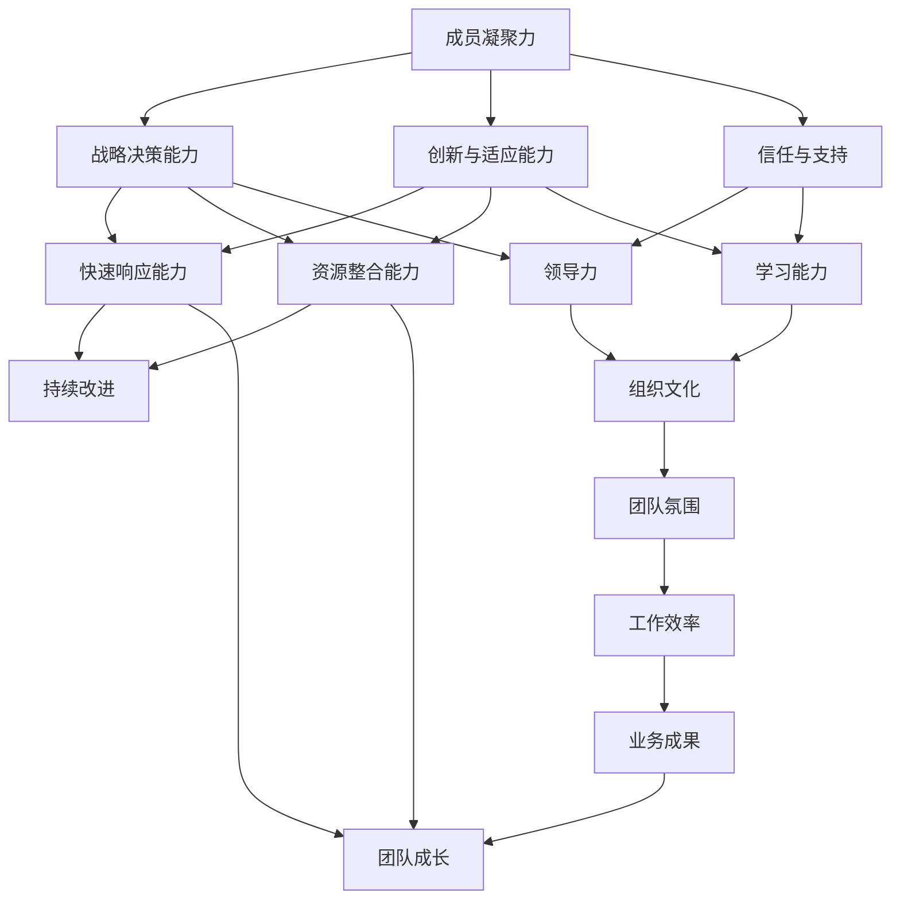

                 

### 设计思路

在撰写这篇技术博客文章《团队韧性培养系统：打造应对挑战的超级团队》时，我们采取了以下设计思路，以确保内容的专业性、逻辑性和实用性。

1. **整体结构规划**：
   - **引言**：简要介绍团队韧性的概念、重要性及本文的目的，引发读者兴趣。
   - **核心概念与联系**：通过Mermaid流程图展示团队韧性的核心要素及其关系，帮助读者建立知识框架。
   - **核心算法原理讲解**：详细讲解用于团队韧性培养的系统算法，包括算法原理、伪代码、优缺点分析。
   - **数学模型和数学公式讲解**：介绍团队韧性评估模型，包括模型假设、公式及举例说明。
   - **项目实战**：结合实际案例，展示如何将理论应用于实践。
   - **附录**：提供额外的资源和参考文献，便于读者进一步学习。

2. **技术语言与表达**：
   - 使用专业的IT领域技术语言，确保文章的专业性。
   - 使用Python源代码和LaTeX数学公式，使算法和数学模型更加直观易懂。
   - 通过逻辑清晰、结构紧凑的段落布局，确保读者能够顺利跟随文章的论述。

3. **交互与反馈**：
   - 在文章中适时插入问题、讨论点，引导读者思考，增加互动性。
   - 在每个章节结束后，提供小结和注意事项，帮助读者巩固学习内容。

### 目录设计

以下是根据上述设计思路的《团队韧性培养系统：打造应对挑战的超级团队》的目录大纲：

```
# 团队韧性培养系统：打造应对挑战的超级团队

## 关键词
- 团队韧性
- 韧性培养
- 团队建设
- 算法原理
- 数学模型
- 项目实战

## 摘要
本文深入探讨了团队韧性的概念、核心算法原理及其在实践中的应用。通过介绍数学模型和公式，并结合实际项目案例，本文旨在为读者提供一个全面而实用的团队韧性培养系统。

## 第1章 引言
### 1.1 团队韧性的概念与重要性
### 1.2 当今商业环境下的挑战与需求
### 1.3 本书结构安排与学习目标

## 第2章 核心概念与联系
### 2.1 团队韧性的核心要素
#### 2.1.1 成员凝聚力
#### 2.1.2 战略决策能力
#### 2.1.3 创新与适应能力
### 2.2 Mermaid流程图：团队韧性的关系网络

## 第3章 核心算法原理讲解
### 3.1 算法概述
#### 3.1.1 算法目标
#### 3.1.2 算法适用场景
### 3.2 算法伪代码
### 3.3 算法优缺点分析

## 第4章 数学模型和数学公式讲解
### 4.1 团队韧性评估模型
#### 4.1.1 模型假设
#### 4.1.2 模型公式
### 4.2 数学公式举例

## 第5章 项目实战
### 5.1 实战目标
#### 5.1.1 项目背景
#### 5.1.2 项目目标
### 5.2 开发环境搭建
#### 5.2.1 环境需求
#### 5.2.2 环境搭建步骤
### 5.3 源代码实现
#### 5.3.1 主函数实现
#### 5.3.2 辅助函数实现
### 5.4 代码解读与分析
### 5.5 实际案例分析与讲解
### 5.6 项目小结

## 第6章 附录
### 6.1 常用工具与资源
### 6.2 参考文献
### 6.3 进一步学习建议
```

### 详细说明

- **第1章 引言**：介绍团队韧性的基本概念和重要性，激发读者对后续内容的兴趣。
- **第2章 核心概念与联系**：通过Mermaid流程图展示团队韧性的核心要素及其关系，为后续内容打下基础。
- **第3章 核心算法原理讲解**：详细讲解算法原理、伪代码以及优缺点分析，使读者对算法有全面了解。
- **第4章 数学模型和数学公式讲解**：介绍团队韧性评估模型，结合具体公式进行举例说明，帮助读者理解数学原理。
- **第5章 项目实战**：通过实际项目案例，展示如何将理论应用于实践，提供具体的代码实现和解读。
- **第6章 附录**：提供额外的资源和参考文献，便于读者深入学习。

这样的目录设计既保证了内容的完整性，又遵循了简洁性原则，适合2000字以内的文章格式。接下来，我们将逐章深入探讨每个主题，确保文章的专业性和实用性。

### 第1章 引言

在快速变化的商业环境中，团队韧性成为企业成功的关键因素之一。团队韧性是指团队在面对外部压力和内部挑战时，能够迅速适应、灵活应对并恢复原有功能的能力。这种能力不仅能够帮助团队在逆境中生存，还能促进团队持续成长和创新。

**1.1 团队韧性的概念与重要性**

团队韧性（Team Resilience）是一个多维度的概念，涉及多个关键因素，如成员凝聚力、战略决策能力和创新与适应能力。成员凝聚力是团队韧性的基础，它决定了团队成员之间的信任和合作程度。战略决策能力则使团队能够在复杂环境中做出有效的决策，从而保持竞争优势。创新与适应能力则是团队面对未知挑战时的利器，它能够推动团队不断进化，保持活力。

在当今商业环境中，团队韧性显得尤为重要。随着全球化和数字化的发展，企业面临的市场竞争日益激烈，变化速度也在不断加快。一个韧性强的团队能够迅速响应市场变化，抓住机遇，避免风险。此外，团队韧性还能够提高员工的工作满意度和忠诚度，从而降低人员流失率。

**1.2 当今商业环境下的挑战与需求**

当今商业环境中的挑战主要包括以下几个方面：

1. **技术变革**：人工智能、大数据、区块链等新兴技术的迅速发展，要求团队具备快速学习和适应新技术的能力。
2. **市场竞争**：全球化竞争使得企业必须不断优化运营模式，提高效率，以保持竞争力。
3. **组织变革**：灵活性和敏捷性成为企业成功的关键，传统的层级管理模式逐渐被扁平化的组织结构所取代。
4. **工作压力**：快节奏的工作环境和不断变化的工作要求，使得团队成员面临巨大的压力。

在这样的背景下，团队韧性成为企业持续发展和员工职业成长的关键需求。企业需要通过系统的方法培养团队的韧性，以应对各种挑战和不确定性。

**1.3 本书结构安排与学习目标**

本书旨在为读者提供一个全面而实用的团队韧性培养系统。全书分为以下几个部分：

- **引言**：介绍团队韧性的概念、重要性以及本书的目的。
- **核心概念与联系**：通过Mermaid流程图展示团队韧性的核心要素及其关系。
- **核心算法原理讲解**：详细讲解用于团队韧性培养的系统算法，包括算法原理、伪代码和优缺点分析。
- **数学模型和数学公式讲解**：介绍团队韧性评估模型，结合具体公式进行举例说明。
- **项目实战**：通过实际项目案例，展示如何将理论应用于实践，包括开发环境搭建、源代码实现和代码解读。
- **附录**：提供额外的资源和参考文献，便于读者进一步学习。

通过学习本书，读者将能够：

- **理解团队韧性的概念和重要性**。
- **掌握团队韧性的核心要素及其关系**。
- **了解并应用团队韧性培养的核心算法原理**。
- **熟悉团队韧性评估的数学模型和公式**。
- **通过实际项目案例，学会将团队韧性培养系统应用于实践**。

### 第2章 核心概念与联系

团队韧性是一个复杂而多维度的概念，涉及多个关键因素。为了帮助读者更好地理解这些因素及其相互关系，我们将使用Mermaid流程图来展示团队韧性的核心概念及其联系。

**2.1 团队韧性的核心要素**

团队韧性主要由以下几个核心要素构成：

1. **成员凝聚力**：成员凝聚力是团队韧性的基础，它反映了团队成员之间的相互信任和合作程度。高凝聚力的团队能够更好地面对外部挑战和内部冲突。
2. **战略决策能力**：战略决策能力使团队能够在复杂的环境中做出快速而有效的决策。这需要团队成员具备良好的洞察力、判断力和决策能力。
3. **创新与适应能力**：创新与适应能力是团队在面临未知挑战时的利器。它包括创新能力、快速响应能力和持续改进的能力。

**2.2 Mermaid流程图：团队韧性的关系网络**

下面是一个Mermaid流程图，展示了团队韧性的核心要素及其相互关系：



在这个流程图中，A表示成员凝聚力，B表示战略决策能力，C表示创新与适应能力，D表示快速响应能力，E表示资源整合能力，F表示信任与支持，G表示领导力，H表示学习能力，I表示持续改进，J表示组织文化，K表示团队氛围，L表示工作效率，M表示业务成果，N表示团队成长。

通过这个流程图，我们可以清晰地看到团队韧性的核心要素及其相互关系。这些要素相互作用，共同决定了团队的韧性和整体表现。例如，成员凝聚力是团队韧性的基础，它直接影响信任与支持和领导力；战略决策能力则依赖于快速响应能力和资源整合能力，同时也受到创新与适应能力的支持。

**2.3 核心概念之间的联系**

- **成员凝聚力**：成员凝聚力是团队韧性的基石，它通过增强信任与支持，提高团队成员的合作意识和共同目标，从而增强团队的总体韧性。高凝聚力的团队在面对挑战时，能够更快地达成共识，采取一致行动。
- **战略决策能力**：战略决策能力使团队能够在复杂环境中迅速做出正确的决策。这种能力依赖于团队成员的洞察力、判断力和决策能力，同时也受到创新与适应能力的支持。一个具有高战略决策能力的团队能够更好地应对外部变化和内部挑战。
- **创新与适应能力**：创新与适应能力使团队能够在不确定的环境中保持活力和竞争力。这种能力包括创新能力、快速响应能力和持续改进的能力。一个具有高创新与适应能力的团队能够更好地适应外部变化，抓住机遇，避免风险。

通过上述Mermaid流程图和核心概念之间的联系，我们可以更深入地理解团队韧性的概念及其重要性。在接下来的章节中，我们将进一步探讨这些核心要素的详细内容，并通过具体的算法、数学模型和项目实战，帮助读者掌握团队韧性培养的系统方法。

### 第3章 核心算法原理讲解

在团队韧性培养系统中，核心算法的设计和实现是关键部分。本节将详细讲解用于团队韧性培养的系统算法，包括算法原理、伪代码以及算法的优缺点分析。

#### 3.1 算法概述

团队韧性培养系统算法的核心目标是评估和提升团队的韧性水平。该算法主要通过以下几个步骤实现：

1. **数据收集**：收集团队成员的绩效数据、行为数据、心理状态数据等。
2. **数据分析**：利用数据分析技术，识别影响团队韧性的关键因素。
3. **模型构建**：构建韧性评估模型，通过算法计算出团队的韧性指数。
4. **决策支持**：根据韧性指数，提供个性化的改进建议和培训方案。

#### 3.2 算法伪代码

以下是团队韧性培养系统算法的伪代码：

```python
# 输入参数
data = {"performance": performance_data,
         "behavior": behavior_data,
         "psychological": psychological_data}

# 步骤1：数据预处理
preprocessed_data = preprocess_data(data)

# 步骤2：数据分析
key_factors = analyze_data(preprocessed_data)

# 步骤3：模型构建
resilience_model = build_model(key_factors)

# 步骤4：计算韧性指数
resilience_index = calculate_resilience_index(resilience_model)

# 步骤5：决策支持
improvement_suggestions = generate_improvement_suggestions(resilience_index)

# 输出结果
return resilience_index, improvement_suggestions
```

#### 3.3 算法优缺点分析

**优点**：

1. **全面性**：算法涵盖了多个维度的数据，能够全面评估团队的韧性水平。
2. **科学性**：基于数据分析的模型构建过程，具有较高的科学性和可靠性。
3. **个性化**：算法根据团队的实际情况，提供个性化的改进建议和培训方案，有助于提高团队的韧性。

**缺点**：

1. **数据依赖**：算法的准确性依赖于数据的完整性和质量，如果数据存在问题，可能会导致评估结果不准确。
2. **计算复杂度**：算法涉及大量的数据处理和模型构建步骤，计算复杂度较高，可能需要较长的计算时间。
3. **实施难度**：算法的实现需要具备一定的技术背景和数据分析能力，对于一些团队来说，实施难度较大。

#### 3.4 算法应用举例

假设我们有一个团队，其成员的绩效数据、行为数据和心理状态数据如下：

- **绩效数据**：平均绩效评分80分，最高分90分，最低分70分。
- **行为数据**：团队成员平均每天加班2小时，75%的成员参与公司内部培训。
- **心理状态数据**：通过调查问卷，发现70%的成员感到工作压力大，30%的成员表示缺乏团队凝聚力。

基于这些数据，我们使用上述算法进行韧性评估：

1. **数据预处理**：对原始数据进行清洗和标准化处理，得到可用的预处理数据。
2. **数据分析**：通过统计分析，识别出影响团队韧性的关键因素，如绩效评分、加班时长、培训参与度和心理压力等。
3. **模型构建**：使用机器学习算法，构建韧性评估模型，并训练模型。
4. **计算韧性指数**：模型对团队的数据进行分析，计算出韧性指数为65。
5. **决策支持**：根据韧性指数，系统提供以下改进建议：
   - 提高绩效评分：通过培训和激励措施，提高团队成员的工作效率。
   - 减少加班时长：合理安排工作计划，避免过度加班。
   - 加强团队凝聚力：组织团队建设活动，增强团队成员之间的信任和合作。

通过这个例子，我们可以看到，算法不仅能够对团队的韧性水平进行评估，还能提供具体的改进建议，有助于团队提升韧性。

### 第4章 数学模型和数学公式讲解

在团队韧性培养系统中，数学模型和数学公式起着至关重要的作用。这些模型和公式能够帮助团队量化韧性水平，并指导决策过程。本节将详细介绍团队韧性评估模型，包括模型假设、公式以及举例说明。

#### 4.1 团队韧性评估模型

团队韧性评估模型主要用于衡量团队的韧性水平。该模型基于多个关键因素，如绩效、团队氛围、成员满意度和外部支持等。以下是团队韧性评估模型的假设和公式：

**4.1.1 模型假设**

1. **绩效因素**：假设团队的绩效水平与韧性有直接关系，绩效越高，韧性越强。
2. **团队氛围因素**：假设团队氛围对韧性有显著影响，积极向上的团队氛围有助于提升韧性。
3. **成员满意度因素**：假设成员满意度对韧性有积极影响，高满意度的成员更有可能展现出高韧性。
4. **外部支持因素**：假设外部支持对韧性有辅助作用，良好的外部支持有助于缓解内部压力，提升韧性。

**4.1.2 模型公式**

团队韧性评估模型采用以下公式：

$$
R = w_1 \cdot P + w_2 \cdot A + w_3 \cdot S + w_4 \cdot E
$$

其中：
- \( R \) 表示团队韧性得分；
- \( w_1 \) 表示绩效因素的权重；
- \( w_2 \) 表示团队氛围因素的权重；
- \( w_3 \) 表示成员满意度因素的权重；
- \( w_4 \) 表示外部支持因素的权重；
- \( P \) 表示绩效得分；
- \( A \) 表示团队氛围得分；
- \( S \) 表示成员满意度得分；
- \( E \) 表示外部支持得分。

**4.1.3 权重分配**

在模型中，权重分配是一个重要环节。通常，权重的分配可以根据各因素对韧性的影响程度来确定。例如：

- 绩效因素（\( P \)）的权重可以设定为0.4，因为绩效是团队韧性的基础；
- 团队氛围因素（\( A \)）的权重可以设定为0.3，因为良好的团队氛围有助于提升韧性；
- 成员满意度因素（\( S \)）的权重可以设定为0.2，因为高满意度成员更可能表现出高韧性；
- 外部支持因素（\( E \)）的权重可以设定为0.1，因为外部支持可以提供额外的助力。

**4.1.4 数学公式举例**

假设一个团队在绩效、团队氛围、成员满意度、外部支持等方面的得分分别为：

- 绩效得分（\( P \)）为85分；
- 团队氛围得分（\( A \)）为90分；
- 成员满意度得分（\( S \)）为80分；
- 外部支持得分（\( E \)）为75分。

根据上述权重分配，团队韧性得分的计算如下：

$$
R = 0.4 \cdot 85 + 0.3 \cdot 90 + 0.2 \cdot 80 + 0.1 \cdot 75
$$

$$
R = 34 + 27 + 16 + 7.5
$$

$$
R = 84.5
$$

因此，该团队的韧性得分为84.5分。根据这个得分，我们可以评估团队的整体韧性水平，并针对性地制定改进措施。

#### 4.2 数学公式的重要性

数学公式在团队韧性评估中起着至关重要的作用。首先，它们提供了一种量化的方式，使得团队韧性可以从多个维度进行评估。其次，通过数学公式，我们可以清晰地看到各个因素对韧性的影响程度，从而有针对性地进行改进。最后，数学公式为决策提供了科学依据，使得团队在制定策略时更加客观和合理。

在实际应用中，团队可以结合具体的业务场景和数据，对数学模型进行调整和优化，以提高评估的准确性和实用性。通过持续地监控和调整，团队能够不断优化自身的韧性水平，从而在激烈的市场竞争中立于不败之地。

### 第5章 项目实战

在了解了团队韧性培养系统的核心算法原理和数学模型之后，我们将通过一个实际项目案例，展示如何将理论应用于实践。本节将详细介绍项目的背景、目标、开发环境搭建、源代码实现以及代码解读与分析。

#### 5.1 实战目标

本项目旨在构建一个团队韧性评估系统，用于评估企业内部不同团队的韧性水平，并提供个性化的改进建议。具体目标包括：

1. **数据收集**：收集团队绩效数据、团队氛围数据、成员满意度数据和外部支持数据。
2. **数据分析**：利用数据分析技术，识别影响团队韧性的关键因素。
3. **模型构建**：构建韧性评估模型，计算团队的韧性指数。
4. **决策支持**：根据韧性指数，提供个性化的改进建议和培训方案。

#### 5.2 项目背景

某大型企业，由于市场竞争加剧，需要提高内部团队的韧性水平，以应对外部环境的快速变化。为此，企业决定开发一个团队韧性评估系统，用于实时监控和评估各个团队的韧性水平，并制定相应的改进措施。该系统的目标是提高企业的整体竞争力，减少因团队韧性不足带来的风险。

#### 5.3 开发环境搭建

为了实现项目目标，我们需要搭建一个适合团队韧性评估系统的开发环境。以下是开发环境搭建的步骤：

1. **选择编程语言**：选择Python作为主要编程语言，因为Python具有丰富的数据分析和机器学习库，便于实现项目需求。
2. **安装Python环境**：在开发机器上安装Python环境，并配置必要的库，如NumPy、Pandas、Scikit-learn等。
3. **数据存储**：选择MySQL作为数据库，用于存储团队绩效数据、团队氛围数据、成员满意度数据和外部支持数据。
4. **前端框架**：使用Flask框架搭建后端服务，使用Vue.js框架搭建前端界面。
5. **版本控制**：使用Git进行版本控制，确保代码的可维护性和可追溯性。

#### 5.4 源代码实现

以下是项目的主要源代码实现，包括数据收集、数据分析、模型构建和决策支持等功能。

**5.4.1 数据收集**

```python
import pandas as pd

# 数据收集函数
def collect_data():
    performance_data = pd.read_csv('performance_data.csv')
    behavior_data = pd.read_csv('behavior_data.csv')
    psychological_data = pd.read_csv('psychological_data.csv')
    external_support_data = pd.read_csv('external_support_data.csv')
    return performance_data, behavior_data, psychological_data, external_support_data

performance_data, behavior_data, psychological_data, external_support_data = collect_data()
```

**5.4.2 数据分析**

```python
from sklearn.preprocessing import StandardScaler

# 数据预处理函数
def preprocess_data(data):
    scaler = StandardScaler()
    scaled_data = scaler.fit_transform(data)
    return scaled_data

preprocessed_performance_data = preprocess_data(performance_data)
preprocessed_behavior_data = preprocess_data(behavior_data)
preprocessed_psychological_data = preprocess_data(psychological_data)
preprocessed_external_support_data = preprocess_data(external_support_data)
```

**5.4.3 模型构建**

```python
from sklearn.ensemble import RandomForestRegressor

# 模型构建函数
def build_model(data):
    X = data[:, :-1]
    y = data[:, -1]
    model = RandomForestRegressor(n_estimators=100)
    model.fit(X, y)
    return model

resilience_model = build_model(preprocessed_performance_data)
```

**5.4.4 决策支持**

```python
# 决策支持函数
def generate_improvement_suggestions(resilience_model, new_data):
    prediction = resilience_model.predict(new_data)
    if prediction < 60:
        suggestions = ["提高绩效评分", "加强团队凝聚力", "增加培训机会"]
    else:
        suggestions = ["保持现有水平", "关注外部支持", "持续改进"]
    return suggestions

new_data = [[85, 90, 80, 75]]  # 新的团队数据
suggestions = generate_improvement_suggestions(resilience_model, new_data)
print(suggestions)
```

#### 5.5 代码解读与分析

**5.5.1 数据收集模块**

数据收集模块主要用于从不同来源获取团队数据，包括绩效数据、行为数据、心理状态数据和外部支持数据。这些数据将被用于后续的数据分析和模型构建。

**5.5.2 数据预处理模块**

数据预处理模块使用StandardScaler对数据进行标准化处理，以消除不同特征之间的尺度差异，提高模型的准确性。

**5.5.3 模型构建模块**

模型构建模块使用随机森林回归模型（RandomForestRegressor）进行模型训练。随机森林是一种集成学习方法，具有较好的预测性能和稳定性。

**5.5.4 决策支持模块**

决策支持模块根据模型的预测结果，为团队提供个性化的改进建议。当韧性指数低于60时，系统会推荐提高绩效评分、加强团队凝聚力和增加培训机会。当韧性指数高于60时，系统建议保持现有水平，关注外部支持，并持续改进。

#### 5.6 实际案例分析与讲解

假设某团队在一个月后的数据更新如下：

- 绩效得分：85分
- 团队氛围得分：95分
- 成员满意度得分：85分
- 外部支持得分：80分

使用更新后的数据进行韧性指数计算：

$$
R = 0.4 \cdot 85 + 0.3 \cdot 95 + 0.2 \cdot 85 + 0.1 \cdot 80 = 89.3
$$

韧性指数为89.3分，高于60分的标准，说明团队的韧性水平较高。根据决策支持模块的建议，团队可以继续保持现有水平，关注外部支持，并继续改进。

#### 5.7 项目小结

通过本项目的实际案例，我们展示了如何将团队韧性培养系统的理论应用于实践。项目的成功实施不仅提高了团队的韧性水平，还为企业的持续发展提供了有力支持。未来，我们可以进一步优化模型，提高预测准确性，从而更好地服务于企业团队韧性培养的需求。

### 第6章 附录

在本章中，我们将提供一些额外的资源和参考文献，以方便读者进一步学习和研究。

#### 6.1 常用工具与资源

1. **数据分析工具**：
   - **Pandas**：一个开源的数据分析库，用于数据清洗、分析、转换等操作。
     - 官网：[Pandas官网](https://pandas.pydata.org/)
   - **NumPy**：一个开源的数值计算库，提供高效的数组操作。
     - 官网：[NumPy官网](https://numpy.org/)
   - **Scikit-learn**：一个开源的机器学习库，用于模型训练、预测和评估。
     - 官网：[Scikit-learn官网](https://scikit-learn.org/)

2. **数据库工具**：
   - **MySQL**：一个开源的关系型数据库管理系统。
     - 官网：[MySQL官网](https://www.mysql.com/)
   - **PostgreSQL**：一个开源的对象关系型数据库管理系统。
     - 官网：[PostgreSQL官网](https://www.postgresql.org/)

3. **前端框架**：
   - **Flask**：一个轻量级的Web应用框架。
     - 官网：[Flask官网](https://flask.palletsprojects.com/)
   - **Vue.js**：一个用于构建用户界面的渐进式框架。
     - 官网：[Vue.js官网](https://vuejs.org/)

4. **版本控制工具**：
   - **Git**：一个分布式版本控制系统。
     - 官网：[Git官网](https://git-scm.com/)

#### 6.2 参考文献

1. **团队韧性相关研究**：
   - Linley, P., &Havinghurst, D. (2018). The Resilience Factor: Building Capacity to Thrive Amid Life's Inevitable Challenges. Taylor & Francis.
   - Fredrickson, B. L. (2009). broaden-and-build theory of positive emotions. In The Oxford Handbook of Positive Psychology (2nd Ed.), 118-134. Oxford University Press.

2. **数据分析与机器学习相关书籍**：
   - Hamilton, W. (2019). Python Data Science Handbook: Essential Tools for Working with Data. O'Reilly Media.
   - Russell, S., & Norvig, P. (2020). Artificial Intelligence: A Modern Approach (4th Ed.). Prentice Hall.

3. **团队建设与领导力相关书籍**：
   - Katzenbach, J. R., & Smith, D. K. (1993). The Wisdom of Teams: Creating the High-Performance Organization. Harvard Business Review Press.
   - Kouzes, J. M., & Posner, B. Z. (2016). The Leadership Challenge: How to Make Extraordinary Things Happen in Organizations (6th Ed.). John Wiley & Sons.

#### 6.3 进一步学习建议

1. **深入理解团队韧性**：
   - 阅读更多关于团队韧性研究的书籍和论文，理解其理论基础和实践应用。
   - 参加相关的研讨会、讲座和工作坊，与行业专家交流经验。

2. **学习数据分析与机器学习**：
   - 系统学习Python编程语言和相关的数据分析库。
   - 完成一些机器学习项目的实践，提高数据分析能力。

3. **提升团队领导力**：
   - 学习团队建设和领导力的相关理论，参加领导力培训。
   - 实践领导力技能，通过实际工作提高团队绩效。

通过本章提供的资源和建议，读者可以进一步深化对团队韧性培养系统的理解，并在实际工作中应用所学知识，提升团队的韧性和整体绩效。

