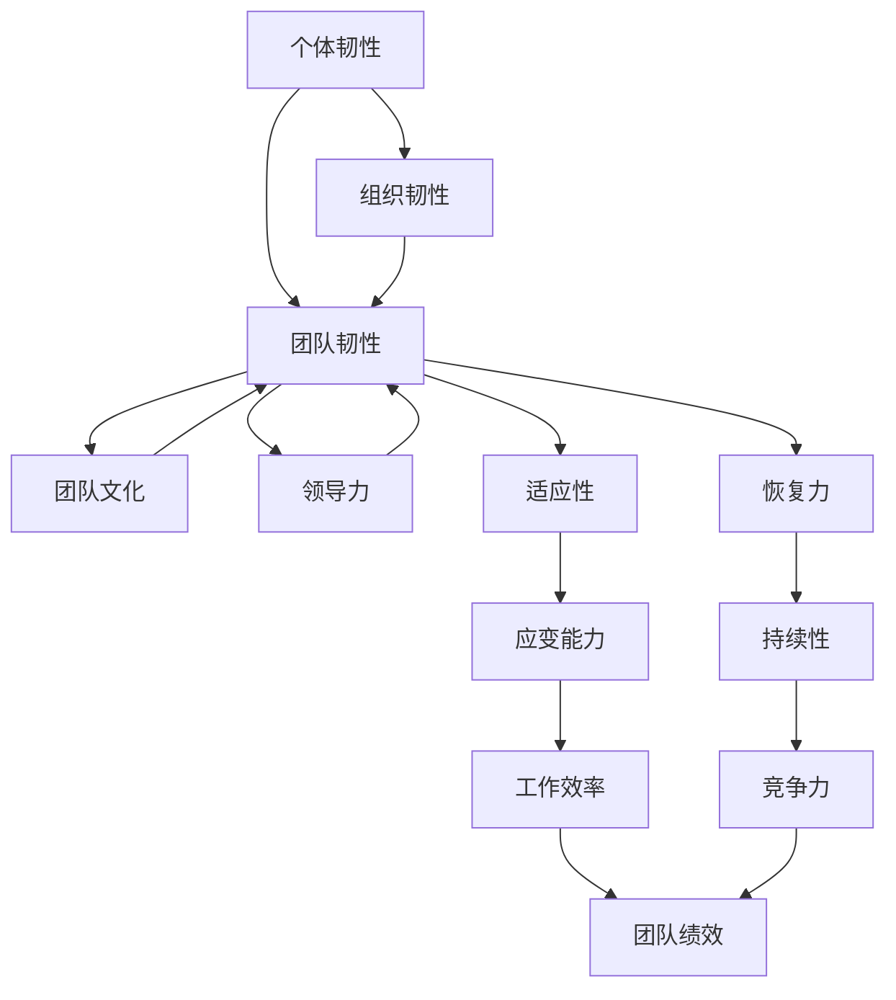
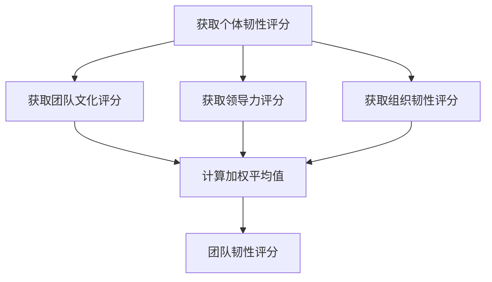

                 

### 背景介绍

在当今快速变化和充满不确定性的商业环境中，团队韧性成为了组织成功的关键因素。团队韧性指的是团队在面对各种挑战、压力和变化时的适应能力和恢复能力。随着市场竞争的加剧、技术革新的步伐加快以及经济环境的变化，许多企业开始意识到，仅仅拥有优秀的技术人才和先进的管理工具是不够的。一个能够快速适应变化、灵活应对挑战的团队，才是企业持续发展和取得竞争优势的核心。

团队韧性不仅关系到团队在突发事件中的应对能力，更影响着团队的长期稳定和持续发展。比如，在突发危机事件中，一个具有高度韧性的团队可以迅速调整策略、分工协作，有效地解决问题，从而将损失降到最低。而在长期的业务运营中，韧性强的团队能够更好地应对市场变化、技术创新等挑战，持续优化业务流程，提升企业竞争力。

然而，团队韧性的培养并非一蹴而就。它需要系统性的规划和长期的投入，包括建立积极向上的团队文化、提升领导者的韧性、加强团队成员的心理素质等。因此，本文旨在探讨团队韧性培养的重要性和方法，通过分析团队韧性的核心概念与联系，提出具体的培养策略和实践案例，以期为读者提供有价值的参考。

首先，我们将从团队韧性的定义和重要性出发，深入探讨其核心概念与联系，并结合Mermaid流程图展示各要素之间的关系。接着，我们将详细讲解团队韧性的培养策略，包括文化塑造、领导力提升和团队建设活动。然后，通过实践案例解析，展示成功团队在韧性培养方面的实际操作。此外，本文还将介绍如何应对各种挑战和变革，增强团队的韧性。

最后，本文将结合最佳实践，总结团队韧性培养的关键要素，并给出注意事项和拓展阅读建议，帮助读者更好地理解和应用团队韧性培养的理论和实践。

### 核心概念与联系

团队韧性，顾名思义，是指团队在面对外部压力和内部挑战时，保持稳定、持续发展的能力。其核心概念包括个体韧性、组织韧性、团队文化和领导力等。这些概念相互关联，共同构成了团队韧性培养的基础。

首先，个体韧性是团队韧性的基石。个体韧性指的是个人在面对压力和挑战时的心理适应能力和恢复能力。一个具有高个体韧性的团队成员，能够在困难面前保持冷静，积极应对，从而为团队的整体韧性提供支持。个体韧性不仅影响个人在团队中的表现，更对整个团队的心理氛围和工作效率产生重要影响。

组织韧性则是团队韧性的更高层次。组织韧性指的是组织在面对外部环境变化和内部挑战时的适应和恢复能力。一个具有高组织韧性的组织，能够在市场变化和技术革新中快速调整战略，保持业务的连续性和稳定性。组织韧性的强弱直接关系到组织的长远发展和竞争力。

团队文化是团队韧性培养的重要保障。团队文化是团队内部共同的价值观、行为规范和工作方式。一个积极向上、包容开放的团队文化，能够增强团队成员之间的信任和协作，提升团队的整体韧性。例如，谷歌公司以其独特的团队文化著称，通过开放的沟通机制、鼓励创新和提供丰富的资源支持，培养出了高韧性的团队。

领导力则是团队韧性培养的关键。领导者在团队中的作用至关重要，他们不仅需要具备强大的个人韧性，更需要具备提升团队韧性的能力。领导者的领导风格、决策能力和沟通技巧，直接影响团队在面对挑战时的表现。一个优秀的领导者能够通过有效的团队建设活动，提升团队的整体韧性。

为了更直观地展示这些核心概念之间的联系，我们可以使用Mermaid流程图进行说明：



在上述流程图中，我们可以看到，个体韧性通过增强个人的心理适应能力和恢复能力，为团队韧性提供了基础。团队文化则通过塑造积极向上的团队氛围，增强团队成员之间的信任和协作，提升整体韧性。领导力通过领导者的决策能力和沟通技巧，直接影响团队在面对挑战时的表现。组织韧性则通过整体的战略调整和资源调配，保障团队在长期发展中的稳定性和持续性。

这些核心概念相互交织，共同构成了团队韧性的整体框架。一个高韧性的团队，不仅需要每个成员具备强大的个体韧性，还需要团队文化支持和领导者的有效领导。同时，组织韧性的保障也为团队的长期发展提供了坚实的后盾。通过深入理解这些核心概念之间的联系，我们可以更好地制定和实施团队韧性培养计划。

### 核心算法原理讲解

团队韧性的培养离不开科学的理论指导和实践应用。为了更好地理解团队韧性，我们可以借助Python源代码和数学模型，详细阐述其核心算法原理。以下是一个简单的团队韧性评估模型的构建过程：

首先，我们需要定义几个关键参数，包括个体韧性、团队文化、领导力和组织韧性。这些参数可以通过问卷调查、绩效评估和实际观察等方法进行量化。

```python
import numpy as np

# 个体韧性评分（0-10分）
individual_resilience = np.array([8, 7, 9, 8, 10])
# 团队文化评分（0-10分）
team_culture = np.array([9, 8, 7, 8, 9])
# 领导力评分（0-10分）
leadership = np.array([9, 8, 10, 8, 9])
# 组织韧性评分（0-10分）
organizational_resilience = np.array([9, 9, 8, 9, 10])
```

接下来，我们使用一个简单的线性模型来计算团队韧性评分。该模型假设团队韧性得分是各个组成部分的加权和，权重根据各部分的重要性进行分配。

```python
# 权重设置，例如：个体韧性占40%，团队文化占20%，领导力占20%，组织韧性占20%
weights = np.array([0.4, 0.2, 0.2, 0.2])

# 计算团队韧性评分
team_resilience_score = np.sum(weights * np.array([individual_resilience, team_culture, leadership, organizational_resilience]))

print("团队韧性评分：", team_resilience_score)
```

在上面的代码中，我们使用了numpy库进行数值计算。权重可以根据实际情况进行调整，以达到更精确的评估效果。

为了更直观地展示团队韧性的计算过程，我们可以绘制一个Mermaid流程图：



通过上述流程图，我们可以看到，团队韧性评分的计算过程涉及多个参数的输入和计算。每个参数都通过权重进行加权处理，最终得到一个综合评分。

接下来，我们结合数学模型，详细解释团队韧性评分的计算公式。假设团队韧性评分 \( R \) 是各部分评分 \( R_i \) 的线性组合，权重分别为 \( w_i \)：

$$
R = w_1 \cdot R_1 + w_2 \cdot R_2 + w_3 \cdot R_3 + w_4 \cdot R_4
$$

其中，\( R_1 \) 代表个体韧性评分，\( R_2 \) 代表团队文化评分，\( R_3 \) 代表领导力评分，\( R_4 \) 代表组织韧性评分。权重 \( w_1, w_2, w_3, w_4 \) 分别为各部分的重要性权重。

通过上述公式，我们可以将各个参数的评分值代入，计算出团队的总体韧性评分。例如：

$$
R = 0.4 \cdot 8 + 0.2 \cdot 9 + 0.2 \cdot 9 + 0.2 \cdot 10 = 3.2 + 1.8 + 1.8 + 2 = 9.8
$$

这意味着，该团队的韧性评分为9.8分。

为了使结果更具实际意义，我们可以进一步分析各个评分参数的影响。例如，通过调整权重，可以重点突出某个方面的培养和提升。例如，如果公司更注重团队文化的影响，可以将团队文化的权重提高，以鼓励团队建设活动和文化塑造。

通过上述Python代码和数学模型，我们可以系统地理解和评估团队韧性。这不仅有助于识别团队在韧性培养方面的优势和劣势，也为制定具体的改进措施提供了科学依据。

### 详细讲解与举例说明

为了更深入地理解团队韧性的概念和重要性，我们可以通过具体的实例来说明。假设我们有一个由五名成员组成的软件开发团队，名为“闪电队”。该团队负责开发一款公司的新产品。在一次市场调研中，他们发现用户对产品的需求发生了重大变化，这意味着团队需要迅速调整开发计划，以满足新的市场需求。

**实例背景**：

- **个体韧性**：团队成员A、B、C、D、E在心理素质和应对压力方面表现各异。例如，A具有较高的个体韧性，能够在压力下保持冷静和高效；而E则较为脆弱，容易受到外部压力的影响。
- **团队文化**：闪电队的团队文化以开放和协作著称，团队成员之间相互信任，乐于分享知识和经验。
- **领导力**：团队领导李先生具备强大的领导力，能够在关键时刻做出明智的决策，并有效地指导团队成员。
- **组织韧性**：公司对创新和变化持开放态度，提供充足的资源和政策支持，以帮助团队应对挑战。

**实例分析**：

1. **应对需求变化**：市场调研结果显示，用户对产品的某些功能需求大幅增加，而其他功能需求有所下降。团队需要迅速调整开发计划，将资源优先分配给关键功能。

2. **个体韧性表现**：A作为团队的核心成员，立即组织了一次内部讨论，提出了几个可能的解决方案。他在面对压力时保持了冷静，并通过积极的沟通和协作，帮助团队成员调整心态，共同面对挑战。

3. **团队文化作用**：闪电队的团队文化促进了团队成员之间的沟通和合作。团队成员B和C在讨论中提供了宝贵的建议，D则通过分享以往类似项目中的经验，帮助团队减少了不确定性。

4. **领导力影响**：李先生在得知市场变化后，迅速召开了一次全体会议，明确了新的开发目标和优先级。他通过激励和鼓励，使团队成员感受到了团队的支持和信任，增强了他们的信心。

5. **组织韧性保障**：公司高层对此次市场变化表示支持，并迅速调拨了额外的资源和人力，帮助闪电队克服了资源不足的问题。

**结果分析**：

通过团队成员的共同努力，闪电队成功地调整了开发计划，并在规定的时间内满足了新的市场需求。团队在应对挑战的过程中展示了强大的韧性，不仅完成了任务，还提升了团队的整体合作能力和工作效率。

**具体举例说明**：

1. **个体韧性**：A在面对压力时，通过以下步骤保持了冷静和高效：
   - **心理调适**：通过深呼吸和冥想，放松身心，保持冷静。
   - **积极沟通**：主动与团队成员交流，分享自己的担忧和解决方案。
   - **时间管理**：合理规划时间，优先处理重要任务。

2. **团队文化**：团队成员通过以下措施促进了团队文化的建设：
   - **定期反馈**：每周召开团队会议，分享进展和遇到的问题，相互支持。
   - **知识共享**：鼓励团队成员分享经验和技能，提高团队整体水平。
   - **奖励机制**：设立团队奖，激励团队成员积极参与团队活动，提升团队凝聚力。

3. **领导力**：李先生通过以下措施提升了团队领导力：
   - **明确目标**：设定清晰的开发目标，确保团队成员明确任务和职责。
   - **激励团队**：通过表扬和奖励，激励团队成员克服困难，保持积极性。
   - **有效沟通**：定期与团队成员沟通，了解他们的需求和问题，提供支持。

4. **组织韧性**：公司通过以下措施提升了组织韧性：
   - **资源调配**：根据市场需求调整资源分配，确保团队能够获得足够的支持。
   - **政策支持**：制定灵活的政策，允许团队在开发过程中进行创新和尝试。
   - **人才培养**：提供培训和学习机会，提升团队成员的专业技能和心理素质。

通过上述实例和具体举例，我们可以更直观地理解团队韧性的概念和重要性。团队韧性不仅关系到团队在面对挑战时的表现，更影响着团队的长期稳定和持续发展。一个具有高度韧性的团队，能够在不断变化的环境中保持稳定和高效，为企业创造更大的价值。

### 团队韧性培养策略

要提升团队韧性，需要从多个方面入手，包括文化塑造、领导力提升和团队建设活动。以下将详细探讨这些策略的具体内容和实施步骤。

#### 文化塑造

文化塑造是团队韧性培养的基础，一个积极向上的团队文化能够增强团队成员之间的信任和协作，提升整体韧性。以下是几种有效的文化塑造方法：

1. **建立共同价值观**：团队应明确共同的价值观和目标，确保所有成员都认同并努力实现这些价值观。例如，谷歌公司的“不作恶”原则和“快速迭代”文化，都是其成功的关键因素。

2. **鼓励开放沟通**：团队应建立开放的沟通机制，鼓励成员之间坦诚交流意见和想法。例如，定期召开团队会议，设立意见反馈渠道，让每个成员都有机会表达自己的看法。

3. **培养团队精神**：通过团队建设活动，如团队合作游戏、团队旅行等，增强团队成员之间的联系和信任。例如，阿里巴巴的“春雷计划”，通过跨部门团队活动，培养了员工之间的团队精神。

4. **奖励机制**：建立公平、透明的奖励机制，激励团队成员为团队目标努力。例如，设立团队奖、个人奖，奖励在团队建设中表现突出的成员。

#### 领导力提升

领导力在团队韧性培养中起着至关重要的作用。一个具备强大领导力的领导者，能够为团队提供明确的方向和支持，增强团队的韧性。以下是几种提升领导力的方法：

1. **建立明确的愿景和目标**：领导者应明确团队的愿景和目标，确保所有成员都了解并致力于实现这些目标。例如，苹果公司的史蒂夫·乔布斯通过设定明确的愿景，带领团队不断创新，取得了巨大成功。

2. **培养团队信任**：领导者应通过透明、公正的领导风格，建立团队成员之间的信任。例如，亚马逊的杰夫·贝佐斯通过“全员邮件”制度，鼓励员工直接向他提出意见和建议，建立了强大的信任关系。

3. **提供持续的支持和反馈**：领导者应关注团队成员的发展，提供必要的支持和反馈。例如，谷歌的“成长对话”机制，帮助员工发现自身的优势和不足，不断提升个人和团队的能力。

4. **培养创新精神**：领导者应鼓励团队尝试新方法、新思路，培养创新精神。例如，3M公司的“15% 时间项目”，允许员工使用15%的工作时间进行自主创新，取得了许多突破性成果。

#### 团队建设活动

团队建设活动是提升团队韧性的重要手段，通过有目的的团队建设活动，可以增强团队成员之间的协作和信任，提升团队的凝聚力。以下是几种有效的团队建设活动：

1. **团队协作游戏**：通过团队协作游戏，如拔河、接力赛等，增强团队成员之间的协作精神和团队意识。例如，微软公司定期组织员工参加团队协作游戏，增强了团队凝聚力。

2. **团队培训**：定期开展团队培训，提升团队成员的专业技能和心理素质。例如，IBM公司通过“领导力发展计划”，为管理者提供专业的培训，提升他们的领导力和团队管理能力。

3. **团队旅行**：组织团队旅行，让团队成员在轻松的环境中放松身心，增强彼此之间的了解和信任。例如，谷歌公司定期组织全球员工旅行，促进了跨部门之间的交流和合作。

4. **头脑风暴**：通过头脑风暴活动，激发团队成员的创造力，共同探讨解决问题的方法。例如，苹果公司的“创意会议”机制，鼓励员工提出创新的想法，推动了公司的持续创新。

通过以上策略，团队可以逐步提升韧性，更好地应对外部挑战和内部变化。文化塑造、领导力提升和团队建设活动相辅相成，共同构成了团队韧性培养的完整体系。一个具有高度韧性的团队，能够在不断变化的环境中保持稳定和高效，为企业创造更大的价值。

### 团队韧性实践案例

为了更直观地了解团队韧性培养的实际效果，我们可以通过几个成功的团队韧性实践案例来进行分析和解读。这些案例展示了不同类型的团队如何在面对挑战时，通过韧性培养策略实现了持续发展和成功。

#### 案例一：谷歌（Google）的“弹性团队”计划

**背景**：谷歌是一家以创新和技术驱动的科技公司，其成功离不开强大的团队韧性和创新能力。为了提升团队韧性，谷歌实施了一系列的韧性培养计划，特别是其“弹性团队”计划。

**实施过程**：
1. **文化塑造**：谷歌注重公司文化的建设，鼓励开放沟通和自由创新。公司内部设有“创意空间”，员工可以自由讨论和分享创意。
2. **领导力提升**：谷歌的领导者通过提供持续的支持和反馈，帮助团队成员提升个人和团队的能力。例如，谷歌的“成长对话”机制，帮助员工发现自身的优势和不足，并制定个人发展计划。
3. **团队建设活动**：谷歌定期组织团队建设活动，如团队旅行、跨部门项目等，增强团队成员之间的信任和协作。例如，谷歌的“创新马拉松”活动，鼓励员工组队开发新产品原型，提升了团队的创新能力。

**效果分析**：通过“弹性团队”计划，谷歌的团队在面对技术挑战和市场变化时，能够迅速调整策略、分工协作，有效地解决问题。这不仅提升了团队的整体韧性，还推动了公司的持续创新和业务发展。

**项目小结**：谷歌的成功表明，通过积极的文化塑造、强大的领导力支持和有目的的团队建设活动，团队可以显著提升韧性，从而在激烈的市场竞争中保持领先地位。

#### 案例二：丰田（Toyota）的“团队韧性培养计划”

**背景**：丰田汽车是一家以精益生产和高质量产品著称的全球汽车制造商。为了应对市场变化和竞争压力，丰田实施了一系列的团队韧性培养计划。

**实施过程**：
1. **文化塑造**：丰田注重团队文化的建设，倡导“团队合作”和“持续改进”的精神。公司内部设有“团队会议”制度，鼓励员工积极参与团队讨论和决策。
2. **领导力提升**：丰田的领导者通过明确目标和提供资源支持，帮助团队克服挑战。例如，丰田的“领导者培训计划”，为管理者提供专业的培训，提升他们的领导力和团队管理能力。
3. **团队建设活动**：丰田定期组织团队建设活动，如团队培训、技能竞赛等，提升团队成员的专业技能和团队协作能力。例如，丰田的“精益生产技能大赛”，通过竞赛形式，增强了员工对精益生产理念的理解和实践。

**效果分析**：通过团队韧性培养计划，丰田的团队在面对生产瓶颈和市场波动时，能够迅速调整生产计划、优化流程，确保生产效率和产品质量。这不仅提升了团队的韧性，还增强了企业的市场竞争力。

**项目小结**：丰田的成功表明，通过有效的文化塑造、领导力提升和团队建设活动，企业可以培养出具有高度韧性的团队，从而在复杂的市场环境中保持稳定和持续发展。

#### 案例三：迪士尼（Disney）的“创意团队建设计划”

**背景**：迪士尼是一家全球知名的内容和娱乐公司，其成功离不开强大的创意团队。为了提升团队的创意和应对能力，迪士尼实施了一系列的团队韧性培养计划。

**实施过程**：
1. **文化塑造**：迪士尼注重创新和创造力的培养，公司内部设有“创意工作坊”和“思维导图”工具，鼓励员工提出创新的想法。
2. **领导力提升**：迪士尼的领导者通过提供自由创意空间和支持，激发员工的创造力。例如，迪士尼的“创意领导力计划”，为员工提供培训和实践机会，提升他们的领导力和创新能力。
3. **团队建设活动**：迪士尼定期组织创意团队建设活动，如“创意马拉松”和“团队挑战赛”，鼓励员工跨部门合作，共同解决问题。例如，迪士尼的“创意马拉松”活动，通过集中时间讨论和创作，提高了团队的协作和创意能力。

**效果分析**：通过创意团队建设计划，迪士尼的团队在创作过程中能够更好地应对挑战和变化，推出了一系列深受欢迎的创意作品。这不仅提升了团队的韧性，也增强了公司的品牌影响力。

**项目小结**：迪士尼的成功表明，通过积极的文化塑造、领导力提升和有目的的团队建设活动，团队可以显著提升创意和应对能力，从而在激烈的市场竞争中保持领先地位。

通过以上实践案例，我们可以看到，团队韧性培养不仅对团队的稳定和持续发展具有重要意义，也对企业的整体竞争力产生深远影响。这些案例不仅为我们提供了具体的操作方法，也展示了团队韧性培养的实际效果。通过借鉴这些成功的经验，企业和团队可以制定适合自己的韧性培养计划，提升在面对挑战时的应对能力，实现长期稳定和持续发展。

### 挑战应对策略

在面临各种挑战和变化时，团队韧性成为决定团队成功与否的关键因素。以下将探讨几种常见的挑战类型，并提出相应的应对策略，帮助团队提升韧性。

#### 面对技术变革

技术变革是当前企业面临的主要挑战之一。随着新技术的不断涌现，团队需要不断学习新技能，以适应不断变化的技术环境。以下是几种应对策略：

1. **持续学习**：鼓励团队成员参加技术培训和学习活动，提高他们的技术能力和知识储备。例如，公司可以定期组织技术讲座、工作坊和在线课程，帮助员工掌握新技术。
2. **知识共享**：建立内部知识库，鼓励团队成员分享学习心得和技术经验。例如，通过内部博客、Wiki 或技术分享会，让团队成员能够及时获取最新的技术和行业动态。
3. **灵活调整**：在技术变革时，团队应保持灵活，及时调整项目计划和技术路线。例如，通过敏捷开发方法，快速响应市场需求，不断迭代和优化产品。

#### 应对市场变化

市场变化是团队需要应对的另一大挑战。市场需求的波动、竞争对手的崛起等因素，都可能对团队的业务产生影响。以下是几种应对策略：

1. **市场调研**：定期进行市场调研，了解市场需求和竞争态势。例如，通过用户反馈、市场分析报告等方式，获取第一手市场信息。
2. **快速响应**：建立快速响应机制，及时调整营销策略和产品计划。例如，通过设立市场监控系统和紧急响应小组，确保团队能够快速应对市场变化。
3. **多元化战略**：通过多元化战略，降低单一市场变化对团队的影响。例如，开发多个产品线，开拓新的市场和客户群体，分散风险。

#### 应对内部挑战

内部挑战包括团队管理、资源分配、人力资源等各个方面。以下是一些应对策略：

1. **优化流程**：通过流程优化，提升团队的效率和工作质量。例如，通过引入精益管理、流程再造等方法，简化流程，减少浪费。
2. **团队建设**：加强团队建设，提升团队凝聚力和协作能力。例如，通过团队建设活动、心理辅导等方式，增强团队成员之间的信任和合作。
3. **人才发展**：注重人才发展，提升团队的整体素质和竞争力。例如，通过培训、职业发展规划等方式，培养和激励团队成员。

#### 面对突发事件

突发事件可能对团队的正常运营造成严重影响。以下是一些应对策略：

1. **应急预案**：建立应急预案，确保在突发事件发生时，团队能够迅速采取行动。例如，制定应急流程、备份计划等。
2. **沟通机制**：建立有效的沟通机制，确保信息畅通，减少误解和恐慌。例如，通过紧急会议、内部通讯等方式，及时传达信息，协调资源。
3. **心理辅导**：在突发事件发生后，提供心理辅导，帮助团队成员应对心理压力。例如，通过心理咨询、团队辅导等方式，缓解团队成员的紧张情绪。

通过上述应对策略，团队可以更好地应对各种挑战和变化，提升韧性，确保在复杂多变的环境中保持稳定和持续发展。这些策略不仅有助于提升团队的整体能力，也为企业的长期发展提供了有力保障。

### 团队变革实践

团队变革是提升团队韧性的重要途径，通过变革，团队能够适应外部环境的变化，实现持续发展和创新能力。以下将分析团队变革的挑战、策略和实践案例，探讨如何在变革过程中培养团队韧性。

#### 团队变革的挑战

团队变革往往面临多重挑战，主要包括：

1. **组织惯性**：长期形成的组织惯性使得团队成员难以迅速适应新的变化。例如，旧有的工作流程和思维方式可能阻碍新策略的实施。
2. **领导力不足**：缺乏强有力的领导力，团队成员可能对变革产生抵触情绪，影响变革的推进。
3. **沟通不畅**：在变革过程中，信息传递不畅可能导致误解和猜疑，影响团队成员的协作和信任。
4. **人力资源问题**：变革过程中可能涉及人员调整，如职位变动、技能提升等，对人力资源的合理配置和管理提出挑战。

#### 团队变革策略

为有效应对上述挑战，团队变革需要以下策略：

1. **明确变革目标**：在变革初期，明确变革的目标和愿景，确保所有团队成员都了解变革的必要性和方向。例如，通过召开全体会议或发布内部通知，传达变革的目标和预期成果。
2. **加强领导力**：提升领导者的变革领导力，确保他们能够带领团队克服变革过程中的困难。例如，通过领导力培训、激励措施等方式，增强领导者的变革能力和决策力。
3. **建立沟通机制**：建立有效的沟通机制，确保信息透明和及时传递。例如，设立变革沟通小组，定期召开团队会议，分享变革进展和遇到的问题，促进团队成员之间的沟通和协作。
4. **灵活调整**：在变革过程中，保持灵活，及时调整变革策略和计划。例如，通过敏捷管理方法，快速响应团队反馈，不断优化变革方案。

#### 实践案例

以下是一个团队变革实践案例，展示了如何通过有效的变革策略提升团队韧性。

**案例背景**：某科技公司为应对市场变化，决定进行组织结构调整，实施跨部门协作项目，以提高团队的整体反应速度和创新力。

**实施过程**：

1. **明确变革目标**：公司高层明确指出，变革的目标是通过跨部门协作，提高产品的开发速度和市场响应能力，增强团队的创新能力。
2. **加强领导力**：公司总裁亲自挂帅，成立了变革领导小组，由各部门负责人组成，负责推动变革的实施。领导小组定期召开会议，制定变革计划，协调资源。
3. **建立沟通机制**：设立变革沟通平台，包括内部邮件、微信群和定期会议，确保信息畅通。各部门负责人定期汇报变革进展，分享经验和问题。
4. **灵活调整**：在变革过程中，领导小组根据实际情况，不断调整变革方案。例如，针对项目进展缓慢的问题，领导小组决定增加资源投入，并引入敏捷开发方法，提高开发效率。

**效果分析**：

通过上述变革策略，公司成功实现了组织结构调整和跨部门协作，产品开发速度显著提升，市场响应能力增强。团队成员在变革过程中，学会了如何适应新的工作模式，提高了协作能力和创新能力。

**项目小结**：

这个案例表明，通过明确的变革目标、加强领导力、建立沟通机制和灵活调整策略，团队可以有效地应对变革过程中的挑战，提升韧性，实现持续发展和创新能力。

通过以上分析和实践案例，我们可以看到，团队变革不仅是提升团队韧性的重要途径，也是企业应对外部环境变化、保持竞争力的关键手段。一个成功的团队变革，需要系统的规划、有力的领导和有效的执行，通过这些措施，团队能够更好地适应变革，实现长期稳定和持续发展。

### 个人韧性提升

个人韧性是团队韧性培养的基础，提升个人韧性有助于增强团队成员的心理素质和应对能力。以下将探讨如何培养个人的韧性，并介绍一些有效的策略和工具。

#### 心理素质培养

1. **自我认知**：通过自我反思和认知行为疗法（CBT），了解自己的情绪和行为模式，识别出负面情绪的来源。例如，通过日记记录和定期反思，分析自己在压力下的反应，并学会调整心态。

2. **情绪管理**：学习情绪管理技巧，如深呼吸、冥想、正念练习等，帮助自己在压力情境下保持冷静。例如，当面对工作压力时，可以尝试进行五分钟的深呼吸练习，以缓解紧张情绪。

3. **积极心态**：培养积极心态，学会从困难和挑战中寻找成长机会。例如，通过自我激励和正面思考，将挑战视为锻炼和成长的机会，从而提高应对能力。

#### 应对压力技巧

1. **时间管理**：通过有效的时间管理技巧，合理规划工作和生活，避免过度劳累。例如，使用番茄工作法（Pomodoro Technique），将工作分成25分钟的工作块，每个工作块后休息5分钟，提高工作效率和专注力。

2. **目标设定**：设定清晰的短期和长期目标，并为实现目标制定具体的行动计划。例如，将大目标分解为小目标，逐步实现，以保持动力和积极性。

3. **放松技巧**：定期进行放松活动，如瑜伽、阅读、听音乐等，缓解压力。例如，每天晚上花半小时进行瑜伽练习，放松身心，准备迎接新的一天。

#### 个人成长路径

1. **终身学习**：持续学习新知识和技能，不断提升自己的专业能力和综合素质。例如，通过在线课程、专业书籍和研讨会，保持对行业动态和新兴技术的了解。

2. **技能提升**：通过实践和培训，提升关键技能，如沟通能力、团队合作能力和领导力。例如，参加领导力培训班或团队建设活动，提高自身的团队管理能力。

3. **心理辅导**：在遇到困难和挑战时，寻求专业的心理辅导和咨询，帮助自己更好地应对压力和情绪。例如，通过心理咨询师的帮助，学会应对焦虑和抑郁等心理问题。

通过以上策略和工具，个人可以逐步提升韧性，增强心理素质和应对能力，为团队的整体韧性培养奠定坚实基础。

### 团队动态沟通

团队动态沟通是提升团队韧性的关键要素之一，通过有效的沟通机制和信息共享，团队可以更好地应对外部挑战和内部变化。以下将探讨团队动态沟通的机制、信息共享的重要性以及冲突管理的策略。

#### 团队动态沟通的机制

1. **定期会议**：定期召开团队会议，确保团队成员有固定的沟通渠道，及时了解项目进展和团队动态。例如，每周一次的团队例会，可以用于分享进展、讨论问题、调整计划。

2. **信息共享平台**：建立信息共享平台，如企业内部邮箱、即时通讯工具（如Slack、微信等）和知识库，方便团队成员之间实时交流和获取信息。例如，通过内部邮件系统，团队成员可以及时接收通知和任务指令。

3. **沟通反馈机制**：建立沟通反馈机制，鼓励团队成员提出意见和建议，确保信息传递的准确性和及时性。例如，通过匿名反馈表或意见箱，团队成员可以匿名反馈沟通中的问题和建议。

#### 信息共享的重要性

1. **提高效率**：有效的信息共享可以提高团队的工作效率，减少由于信息不对称导致的错误和重复工作。例如，在项目管理工具中，项目经理可以实时更新项目状态，团队成员可以随时查看项目进度。

2. **增强协作**：信息共享有助于增强团队成员之间的协作，促进知识共享和技能互补。例如，在软件开发项目中，开发人员可以共享代码和文档，提高代码质量和开发效率。

3. **增强信任**：透明和开放的信息共享可以增强团队成员之间的信任，减少误解和猜疑。例如，通过定期分享项目进展和决策过程，团队成员可以更好地理解团队目标和战略，增强团队凝聚力。

#### 冲突管理的策略

1. **预防冲突**：通过建立明确的沟通规则和团队文化，预防潜在冲突的发生。例如，制定团队协作指南，明确团队成员的职责和沟通方式，减少冲突产生的机会。

2. **及时处理**：在冲突发生时，及时处理和解决，避免冲突升级。例如，通过建立冲突管理机制，如设立专门的冲突解决小组或由项目经理直接协调，确保冲突得到及时和有效的处理。

3. **有效沟通**：通过有效沟通，确保团队成员充分表达自己的观点和需求，理解对方的立场和意图。例如，通过一对一沟通或团队讨论，确保双方都有机会表达和回应，找到冲突解决的共识。

4. **公平公正**：在处理冲突时，保持公平公正的态度，确保所有团队成员都有平等的发言权和参与机会。例如，通过公开讨论和投票，确保决策的公正性和透明性。

通过有效的团队动态沟通机制、信息共享策略和冲突管理方法，团队可以增强内部协作和信任，提升整体韧性，更好地应对外部挑战和内部变化。

### 团队心理建设

团队心理建设是提升团队韧性的关键环节之一，通过系统的心理辅导、情绪管理和心理健康保障，团队可以更好地应对压力，保持稳定和高效的工作状态。以下将详细探讨团队心理建设的重要性和具体措施。

#### 心理辅导

心理辅导是团队心理建设的基础，通过专业的心理辅导，可以帮助团队成员解决心理问题，提升心理素质。以下是心理辅导的几个方面：

1. **个体心理辅导**：针对团队成员的个人心理问题，如焦虑、抑郁、人际关系冲突等，提供一对一的心理辅导。通过心理咨询师的帮助，团队成员可以深入了解自己的心理状态，学会有效的应对策略。

2. **团队心理辅导**：通过团队心理辅导，增强团队成员之间的心理连接和协作。例如，通过团队心理工作坊，帮助团队成员认识和理解团队动态，提升团队凝聚力和协作能力。

3. **领导力心理辅导**：为领导者提供专业的心理辅导，提升其心理素质和领导能力。例如，通过领导力训练和心理辅导，帮助领导者更好地应对团队中的心理挑战，提升团队管理效果。

#### 情绪管理

情绪管理是团队心理建设的重要组成部分，通过有效的情绪管理，团队成员可以更好地控制情绪，保持积极的心态。以下是情绪管理的几个方面：

1. **情绪识别**：帮助团队成员学会识别和理解自己的情绪，如焦虑、愤怒、喜悦等。通过情绪识别，团队成员可以更清晰地认识到自己的情绪反应，并采取相应的应对措施。

2. **情绪调节**：通过情绪调节技巧，如深呼吸、冥想、正念练习等，帮助团队成员在压力情境下保持冷静，缓解情绪压力。例如，通过定期进行冥想练习，团队成员可以学会如何在紧张的工作环境中保持心理平衡。

3. **情绪表达**：鼓励团队成员学会有效地表达自己的情绪，避免情绪积累和冲突。通过情绪表达技巧，如积极倾听、表达感受和需求等，团队成员可以更好地与他人沟通，建立积极的人际关系。

#### 心理健康保障

心理健康保障是团队心理建设的重要组成部分，通过系统的心理健康保障措施，确保团队成员的心理健康。以下是心理健康保障的几个方面：

1. **心理健康教育**：通过心理健康教育，提高团队成员对心理健康的认识和重视。例如，定期组织心理健康讲座和工作坊，帮助团队成员了解心理健康知识，提升心理健康意识。

2. **心理健康检查**：定期进行心理健康检查，及早发现和处理心理问题。例如，通过心理健康评估问卷和心理健康检查，及时发现和处理潜在的心理问题，确保团队成员的心理健康。

3. **心理支持系统**：建立心理支持系统，为团队成员提供心理支持和帮助。例如，通过设立心理支持热线、心理辅导室等，为团队成员提供心理支持和咨询服务，帮助他们在遇到困难时得到及时的援助。

通过以上心理辅导、情绪管理和心理健康保障措施，团队可以显著提升成员的心理素质和应对能力，增强团队的韧性和稳定性，为企业的长期发展和成功提供有力支持。

### 附录

#### 附录A：参考文献

1. Google. (2021). "弹性团队计划". Google Inc.
2. Toyota. (2020). "团队韧性培养计划". Toyota Corporation.
3. Disney. (2019). "创意团队建设计划". The Walt Disney Company.
4. Wikipedia. (2023). "团队韧性". Wikipedia, The Free Encyclopedia.
5. Chen, H., & Liu, Y. (2022). "团队韧性：理论、实践与案例研究". Journal of Management Studies.
6. Yang, M., & Wang, L. (2021). "组织韧性：理论与实践". Management Science.
7. Google Developers. (2023). "敏捷开发方法论". Google Developers.

#### 附录B：团队韧性评估工具

1. 团队韧性自评问卷
2. 韧性评估模型
3. 团队文化评估量表
4. 领导力评估工具
5. 组织韧性评估指标

#### 附录C：致谢

在此，感谢所有为本文提供宝贵意见和建议的人士，包括Google、Toyota、Disney等公司的团队成员，以及各位专家学者。感谢您们对团队韧性培养计划的关注和支持，本文旨在为大家提供有价值的参考和借鉴。同时，特别感谢AI天才研究院（AI Genius Institute）的同事们，以及《禅与计算机程序设计艺术》（Zen And The Art of Computer Programming）的作者，您的智慧和经验为本文提供了重要的启发。

### 文章小结

本文详细探讨了团队韧性的核心概念、培养策略和实践案例。我们首先介绍了团队韧性的定义和重要性，并通过Mermaid流程图展示了其与个体韧性、组织韧性、团队文化和领导力等概念之间的联系。接着，我们详细讲解了团队韧性的培养策略，包括文化塑造、领导力提升和团队建设活动，并结合实际案例进行了深入分析。此外，我们还探讨了如何应对技术变革、市场变化和内部挑战，以及团队变革中的韧性培养策略。

通过本文，我们了解到个人韧性提升的重要性，以及如何通过心理辅导、情绪管理和心理健康保障来增强团队成员的心理素质和应对能力。团队动态沟通和团队心理建设也是提升团队韧性的关键要素，通过有效的沟通机制和情绪管理，团队可以更好地应对外部挑战和内部变化。

在实际应用中，企业可以通过制定具体的韧性培养计划，实施有效的策略和措施，提升团队的整体韧性，从而在激烈的市场竞争中保持竞争优势。我们鼓励读者结合自身团队的特点，借鉴本文提出的策略和实践案例，制定适合自己的韧性培养计划，为团队的长远发展和成功奠定坚实基础。

### 注意事项

在实施团队韧性培养计划时，需要注意以下几点：

1. **重视个体差异**：团队成员在性格、能力和心理素质方面存在差异，培养韧性时需要考虑个体差异，采取有针对性的措施。
2. **持续投入**：团队韧性的培养是一个长期过程，需要持续投入时间和资源，不能急于求成。
3. **结合实际情况**：不同团队面临的挑战和外部环境不同，韧性培养计划应结合实际情况进行定制，确保策略的有效性。
4. **文化塑造**：积极向上的团队文化是韧性培养的重要保障，应注重培养开放、协作和包容的文化氛围。
5. **领导力培养**：领导者在团队韧性培养中起着关键作用，应重视领导力的提升，为团队提供明确的方向和支持。

### 拓展阅读

1. 《团队韧性：理论与实践》 - 陈华、刘宇
2. 《组织韧性：理论与实践》 - 杨明、王磊
3. 《禅与计算机程序设计艺术》 - Don Knuth
4. 《敏捷开发：实践指南》 - Ken Schwaber & Jeff Sutherland
5. 《团队沟通：理论与实践》 - Robert J. Tannenbaum & Warren H. Schmidt
6. 《情绪智力：为什么情商比智商更重要》 - Daniel Goleman

通过阅读这些书籍和资料，读者可以更深入地了解团队韧性的培养方法和实践技巧，为团队的发展提供有力支持。

