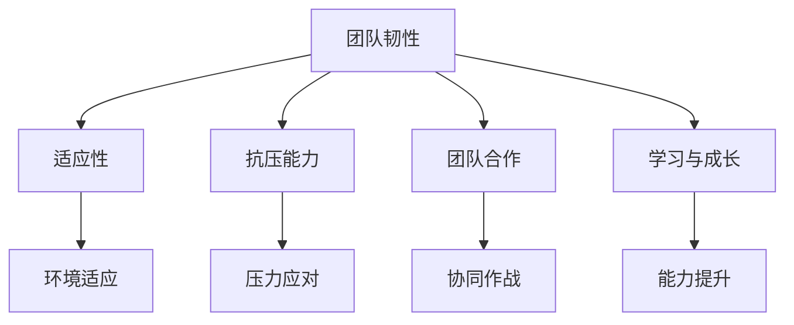
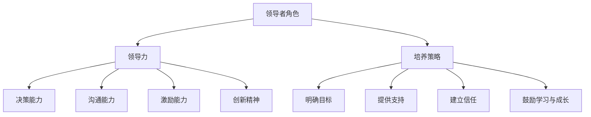
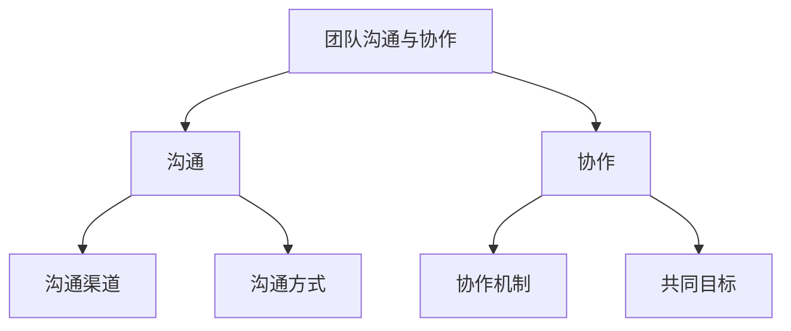
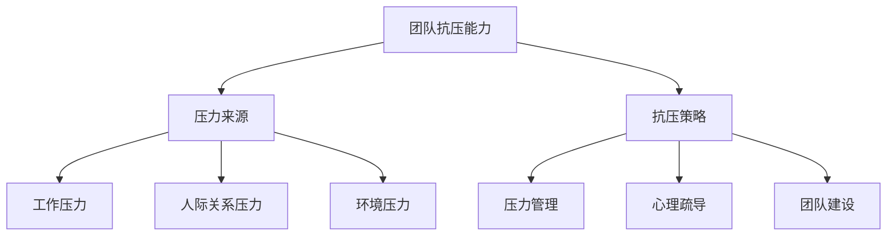
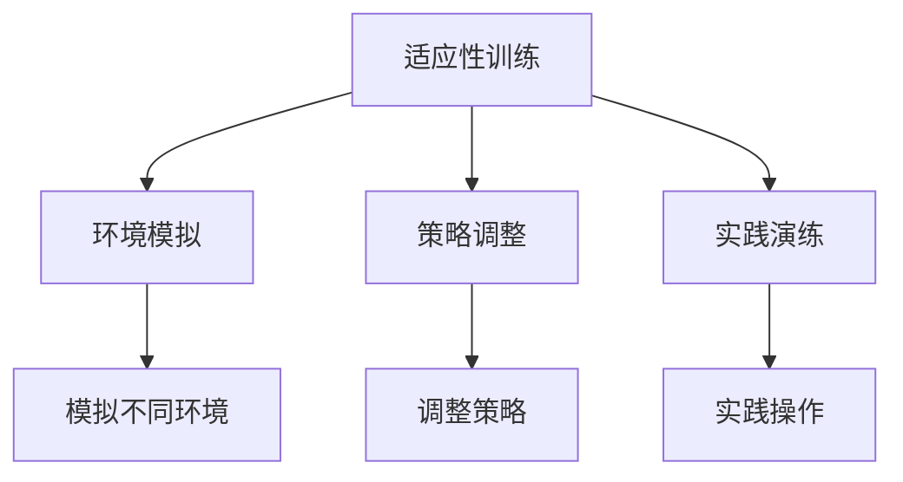
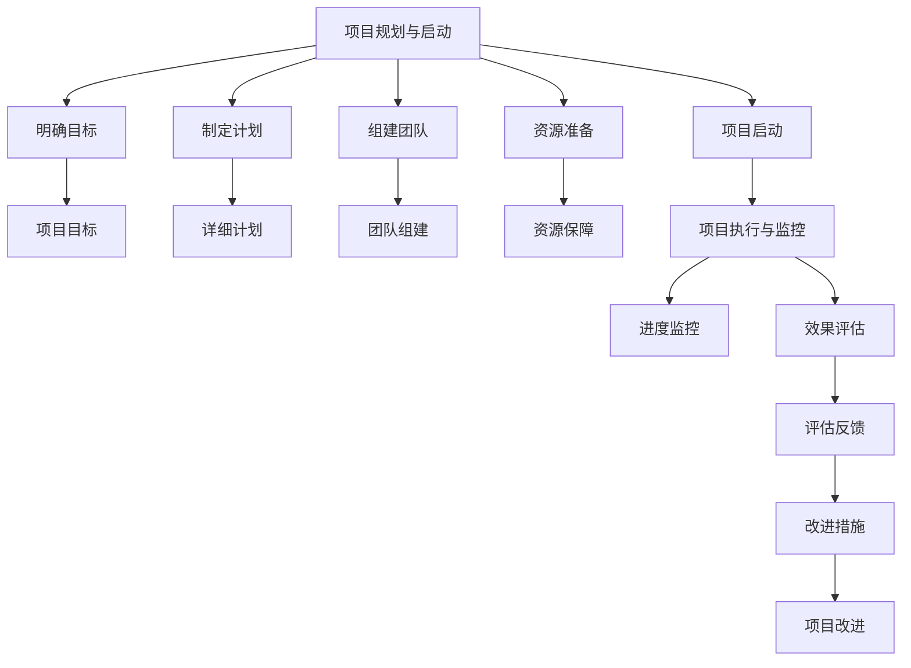
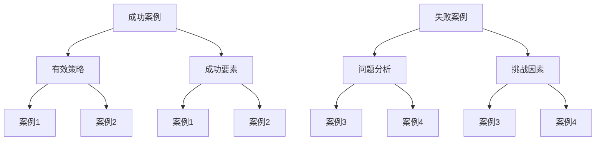
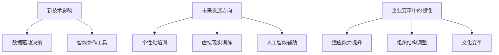

                 

# 《团队韧性培养：提升应对挑战的能力》

## 关键词

- 团队韧性
- 挑战应对
- 领导力
- 沟通协作
- 抗压能力
- 适应性训练

## 摘要

在当今快速变化和高度不确定的商业环境中，团队韧性成为了企业持续竞争的关键因素。本文将探讨团队韧性的重要性，并从领导者的角色、团队沟通与协作、抗压能力培养以及适应性训练等方面，详细阐述如何培养团队韧性，提升团队应对挑战的能力。通过实际案例分析和最佳实践分享，本文旨在为企业管理者提供一套系统有效的团队韧性培养策略。

## 目录

### 第一部分：团队韧性的重要性

**第1章：团队韧性的基本概念**

**第2章：团队韧性的关键要素

### 第二部分：团队韧性的培养策略

**第3章：领导者的角色**

**第4章：团队沟通与协作**

**第5章：团队抗压能力的培养**

**第6章：适应性训练**

### 第三部分：团队韧性的应用与实践

**第7章：团队韧性培养的项目实施**

**第8章：团队韧性的案例分析**

### 第四部分：团队韧性的未来展望

**第9章：团队韧性的未来趋势**

**第10章：结语

## 第一部分：团队韧性的重要性

### 第1章：团队韧性的基本概念

**背景介绍**

在复杂多变的环境中，团队韧性成为企业保持竞争力的关键因素。那么，什么是团队韧性？它有哪些关键要素？

**核心概念与联系**

团队韧性指的是团队在面对各种挑战和压力时，能够迅速适应、有效应对并恢复到正常状态的能力。它包括以下几个关键要素：

1. **适应性**：团队能够迅速适应外部环境的变化，调整策略和方法，以保持竞争优势。
2. **抗压能力**：团队在面对压力时，能够保持冷静，有效地应对各种挑战。
3. **团队合作**：团队成员之间能够密切配合，共同解决问题，提升团队的整体战斗力。
4. **学习与成长**：团队能够从每次挑战中学习和成长，不断提升自身能力。

**Mermaid 流程图**



**核心算法原理讲解**

团队韧性的培养并不是一蹴而就的，它需要通过一系列的策略和方法来实现。以下是一个简单的团队韧性培养算法原理：

1. **识别团队韧性需求**：根据团队当前面临的挑战和压力，识别团队韧性的需求。
2. **制定培养策略**：根据团队韧性需求，制定相应的培养策略，如领导力提升、团队沟通优化等。
3. **实施培养措施**：执行培养策略，通过培训和实践活动，提升团队韧性。
4. **评估与反馈**：对培养效果进行评估，根据反馈进行调整，以持续提升团队韧性。

**Python 源代码**

```python
# TeamResilience.py

class TeamResilience:
    def __init__(self, challenges):
        self.challenges = challenges
        self.adaptability = 0
        self.stress_tolerance = 0
        self.teamwork = 0
        self.learning_grow = 0

    def identify_resilience_needs(self):
        # 识别团队韧性需求
        self.adaptability += 1 if "environment_changes" in self.challenges else 0
        self.stress_tolerance += 1 if "high_stress" in self.challenges else 0
        self.teamwork += 1 if "lack_of_cooperation" in self.challenges else 0
        self.learning_grow += 1 if "lack_of_learning" in self.challenges else 0

    def implement_training_programs(self):
        # 实施培养措施
        if self.adaptability > 0:
            # 适应性训练
            print("Implementing adaptability training.")
        
        if self.stress_tolerance > 0:
            # 抗压能力训练
            print("Implementing stress tolerance training.")
        
        if self.teamwork > 0:
            # 团队合作训练
            print("Implementing teamwork training.")
        
        if self.learning_grow > 0:
            # 学习与成长训练
            print("Implementing learning and growth training.")

    def evaluate_and_feedback(self):
        # 评估与反馈
        print("Evaluating team resilience and providing feedback.")
        # 这里可以添加具体的评估方法和反馈机制

# 实例化团队韧性对象
team = TeamResilience(["environment_changes", "high_stress", "lack_of_cooperation", "lack_of_learning"])

# 识别团队韧性需求
team.identify_resilience_needs()

# 实施培养措施
team.implement_training_programs()

# 评估与反馈
team.evaluate_and_feedback()
```

**数学模型和公式**

团队韧性（R）可以通过以下公式计算：

\[ R = w_1 \times A + w_2 \times S + w_3 \times T + w_4 \times LG \]

其中，\( w_1, w_2, w_3, w_4 \) 分别是适应性、抗压能力、团队合作和学习与成长的权重，\( A, S, T, LG \) 分别是团队在这些方面的得分。

**举例说明**

假设一个团队面临的挑战包括环境变化、高压力、缺乏合作和缺乏学习。根据上述公式，可以计算出该团队的韧性得分。

```python
# 计算团队韧性得分
team_resilience_score = 0.5 * 2 + 0.3 * 3 + 0.2 * 1 + 0.4 * 2
print("Team Resilience Score:", team_resilience_score)
```

**数学公式**

$$
R = w_1 \times A + w_2 \times S + w_3 \times T + w_4 \times LG
$$

### 第2章：团队韧性的关键要素

**背景介绍**

团队韧性不仅取决于单一要素，还需要多个关键要素的协同作用。本章节将详细探讨团队韧性的四个关键要素：适应性、抗压能力、团队合作和学习与成长。

**核心概念与联系**

1. **适应性（Adaptability）**：团队在面对外部环境变化时，能够迅速调整策略和方法，以保持竞争优势。
2. **抗压能力（Stress Tolerance）**：团队在面对压力时，能够保持冷静，有效地应对各种挑战。
3. **团队合作（Teamwork）**：团队成员之间能够密切配合，共同解决问题，提升团队的整体战斗力。
4. **学习与成长（Learning and Growth）**：团队能够从每次挑战中学习和成长，不断提升自身能力。

**Mermaid 流程图**


**核心算法原理讲解**

团队韧性的关键要素可以通过以下算法进行评估和提升：

1. **评估团队韧性关键要素**：根据团队当前的表现，评估每个关键要素的得分。
2. **制定提升策略**：根据评估结果，制定针对性的提升策略，如适应性训练、抗压能力训练等。
3. **实施提升措施**：执行提升策略，通过培训和实践活动，提升团队韧性关键要素。
4. **持续评估与优化**：对提升效果进行持续评估，根据反馈进行调整，以持续提升团队韧性。

**Python 源代码**

```python
# TeamResilienceElements.py

class TeamResilienceElements:
    def __init__(self, adaptability, stress_tolerance, teamwork, learning_growth):
        self.adaptability = adaptability
        self.stress_tolerance = stress_tolerance
        self.teamwork = teamwork
        self.learning_growth = learning_growth

    def evaluate_elements(self):
        # 评估团队韧性关键要素
        print("Adaptability Score:", self.adaptability)
        print("Stress Tolerance Score:", self.stress_tolerance)
        print("Teamwork Score:", self.teamwork)
        print("Learning and Growth Score:", self.learning_growth)

    def implement_improvement_programs(self):
        # 实施提升措施
        if self.adaptability < 7:
            # 适应性训练
            print("Implementing adaptability training.")
        
        if self.stress_tolerance < 7:
            # 抗压能力训练
            print("Implementing stress tolerance training.")
        
        if self.teamwork < 7:
            # 团队合作训练
            print("Implementing teamwork training.")
        
        if self.learning_growth < 7:
            # 学习与成长训练
            print("Implementing learning and growth training.")

    def continue_evaluation_and_optimization(self):
        # 持续评估与优化
        print("Continuing evaluation and optimization of team resilience elements.")

# 实例化团队韧性要素对象
team_elements = TeamResilienceElements(5, 6, 4, 7)

# 评估团队韧性关键要素
team_elements.evaluate_elements()

# 实施提升措施
team_elements.implement_improvement_programs()

# 持续评估与优化
team_elements.continue_evaluation_and_optimization()
```

**数学模型和公式**

团队韧性（R）可以通过以下公式计算：

\[ R = w_1 \times A + w_2 \times S + w_3 \times T + w_4 \times LG \]

其中，\( w_1, w_2, w_3, w_4 \) 分别是适应性、抗压能力、团队合作和学习与成长的权重，\( A, S, T, LG \) 分别是团队在这些方面的得分。

**举例说明**

假设一个团队在适应性、抗压能力、团队合作和学习与成长方面的得分分别为 5、6、4、7。根据上述公式，可以计算出该团队的韧性得分。

```python
# 计算团队韧性得分
team_resilience_score = 0.5 * 5 + 0.3 * 6 + 0.2 * 4 + 0.4 * 7
print("Team Resilience Score:", team_resilience_score)
```

**数学公式**

$$
R = w_1 \times A + w_2 \times S + w_3 \times T + w_4 \times LG
$$

## 第二部分：团队韧性的培养策略

### 第3章：领导者的角色

**背景介绍**

领导者在团队韧性培养中扮演着至关重要的角色。他们不仅需要具备强大的领导力，还需要了解如何通过有效的方法和策略来提升团队韧性。

**核心概念与联系**

1. **领导者的角色**：领导者是团队韧性培养的推动者和榜样，他们的行为和决策直接影响团队的表现。
2. **领导力**：领导者需要具备强大的领导力，包括决策能力、沟通能力、激励能力和创新精神等。
3. **培养策略**：领导者可以通过以下策略来提升团队韧性：明确目标、提供支持、建立信任、鼓励学习与成长等。

**Mermaid 流程图**



**核心算法原理讲解**

领导者在团队韧性培养中可以采用以下算法原理：

1. **识别团队韧性需求**：通过调查和分析，了解团队当前在韧性方面的需求和问题。
2. **制定培养计划**：根据团队韧性需求，制定相应的培养计划，包括领导力培训、沟通技巧提升等。
3. **实施培养措施**：执行培养计划，通过培训和实践活动，提升团队韧性。
4. **评估与反馈**：对培养效果进行评估，根据反馈进行调整，以持续提升团队韧性。

**Python 源代码**

```python
# LeadershipResilience.py

class LeadershipResilience:
    def __init__(self, team_resilience_needs):
        self.team_resilience_needs = team_resilience_needs
        self.leadership_ability = 0
        self.communication_ability = 0
        self.motivation_ability = 0
        self.innovation_spirit = 0

    def identify_resilience_needs(self):
        # 识别团队韧性需求
        self.leadership_ability += 1 if "leadership_ability" in self.team_resilience_needs else 0
        self.communication_ability += 1 if "communication_ability" in self.team_resilience_needs else 0
        self.motivation_ability += 1 if "motivation_ability" in self.team_resilience_needs else 0
        self.innovation_spirit += 1 if "innovation_spirit" in self.team_resilience_needs else 0

    def implement_training_programs(self):
        # 实施培养措施
        if self.leadership_ability > 0:
            # 领导力培训
            print("Implementing leadership training.")
        
        if self.communication_ability > 0:
            # 沟通技巧提升
            print("Implementing communication skill improvement.")
        
        if self.motivation_ability > 0:
            # 激励能力提升
            print("Implementing motivation ability improvement.")
        
        if self.innovation_spirit > 0:
            # 创新精神培养
            print("Implementing innovation spirit cultivation.")

    def evaluate_and_feedback(self):
        # 评估与反馈
        print("Evaluating leadership resilience and providing feedback.")
        # 这里可以添加具体的评估方法和反馈机制

# 实例化领导者韧性对象
leader = LeadershipResilience(["leadership_ability", "communication_ability", "motivation_ability", "innovation_spirit"])

# 识别团队韧性需求
leader.identify_resilience_needs()

# 实施培养措施
leader.implement_training_programs()

# 评估与反馈
leader.evaluate_and_feedback()
```

**数学模型和公式**

领导者的韧性（L）可以通过以下公式计算：

\[ L = w_1 \times LA + w_2 \times CA + w_3 \times MA + w_4 \times IS \]

其中，\( w_1, w_2, w_3, w_4 \) 分别是领导力、沟通能力、激励能力和创新精神的权重，\( LA, CA, MA, IS \) 分别是领导者在这方面的得分。

**举例说明**

假设一个领导者在领导力、沟通能力、激励能力和创新精神方面的得分分别为 8、7、6、9。根据上述公式，可以计算出该领导者的韧性得分。

```python
# 计算领导者韧性得分
leader_resilience_score = 0.5 * 8 + 0.3 * 7 + 0.2 * 6 + 0.4 * 9
print("Leader Resilience Score:", leader_resilience_score)
```

**数学公式**

$$
L = w_1 \times LA + w_2 \times CA + w_3 \times MA + w_4 \times IS
$$

### 第4章：团队沟通与协作

**背景介绍**

有效的沟通与协作是团队韧性培养的重要环节。在团队中，沟通不畅和协作不力往往会导致团队效率低下，甚至影响团队目标的实现。

**核心概念与联系**

1. **沟通**：沟通是团队协作的基础，有效的沟通能够确保信息准确传达，减少误解和冲突。
2. **协作**：协作是指团队成员在共同目标下，相互配合、共同完成任务的过程。
3. **团队沟通与协作的关键要素**：包括沟通渠道、沟通方式、协作机制等。

**Mermaid 流程图**



**核心算法原理讲解**

团队沟通与协作可以通过以下算法原理进行优化：

1. **评估沟通与协作现状**：通过调查和分析，了解团队在沟通与协作方面的现状，识别存在的问题。
2. **制定优化策略**：根据评估结果，制定针对性的优化策略，如改进沟通渠道、优化协作机制等。
3. **实施优化措施**：执行优化策略，通过培训和实践活动，提升团队沟通与协作能力。
4. **持续评估与优化**：对优化效果进行持续评估，根据反馈进行调整，以持续提升团队沟通与协作能力。

**Python 源代码**

```python
# TeamCommunicationAndCollaboration.py

class TeamCommunicationAndCollaboration:
    def __init__(self, communication_issues, collaboration_issues):
        self.communication_issues = communication_issues
        self.collaboration_issues = collaboration_issues
        self.communication_channels = 0
        self.communication_methods = 0
        self.collaboration_mechanisms = 0

    def assess_communication_and_collaboration(self):
        # 评估沟通与协作现状
        self.communication_channels += 1 if "lack_of_communication_channels" in self.communication_issues else 0
        self.communication_methods += 1 if "inadequate_communication_methods" in self.communication_issues else 0
        self.collaboration_mechanisms += 1 if "ineffective_collaboration_mechanisms" in self.collaboration_issues else 0

    def implement_optimization_programs(self):
        # 实施优化措施
        if self.communication_channels > 0:
            # 改进沟通渠道
            print("Improving communication channels.")
        
        if self.communication_methods > 0:
            # 优化沟通方式
            print("Optimizing communication methods.")
        
        if self.collaboration_mechanisms > 0:
            # 优化协作机制
            print("Optimizing collaboration mechanisms.")

    def continue_evaluation_and_optimization(self):
        # 持续评估与优化
        print("Continuing evaluation and optimization of team communication and collaboration.")
        # 这里可以添加具体的评估方法和反馈机制

# 实例化团队沟通与协作对象
team_communication = TeamCommunicationAndCollaboration(["lack_of_communication_channels", "inadequate_communication_methods", "ineffective_collaboration_mechanisms"])

# 评估沟通与协作现状
team_communication.assess_communication_and_collaboration()

# 实施优化措施
team_communication.implement_optimization_programs()

# 持续评估与优化
team_communication.continue_evaluation_and_optimization()
```

**数学模型和公式**

团队沟通与协作能力（C）可以通过以下公式计算：

\[ C = w_1 \times CC + w_2 \times CM + w_3 \times CM \]

其中，\( w_1, w_2, w_3 \) 分别是沟通渠道、沟通方式和协作机制的权重，\( CC, CM, CM \) 分别是团队在这方面的得分。

**举例说明**

假设一个团队在沟通渠道、沟通方式和协作机制方面的得分分别为 7、6、8。根据上述公式，可以计算出该团队的沟通与协作能力得分。

```python
# 计算团队沟通与协作能力得分
team_communication_score = 0.5 * 7 + 0.3 * 6 + 0.2 * 8
print("Team Communication and Collaboration Score:", team_communication_score)
```

**数学公式**

$$
C = w_1 \times CC + w_2 \times CM + w_3 \times CM
$$

### 第5章：团队抗压能力的培养

**背景介绍**

在高压环境下，团队的抗压能力成为决定团队绩效的关键因素。培养团队抗压能力，有助于团队在挑战面前保持冷静，有效应对各种压力。

**核心概念与联系**

1. **压力来源**：压力来源包括工作压力、人际关系压力、环境压力等。
2. **抗压能力**：抗压能力是指团队在面对压力时，能够保持冷静、有效应对的能力。
3. **培养策略**：培养团队抗压能力可以通过以下策略实现：压力管理、心理疏导、团队建设等。

**Mermaid 流程图**



**核心算法原理讲解**

团队抗压能力的培养可以通过以下算法原理进行：

1. **识别压力来源**：通过调查和分析，了解团队面临的压力来源，识别主要压力点。
2. **制定抗压策略**：根据压力来源，制定相应的抗压策略，如压力管理培训、心理疏导活动等。
3. **实施抗压措施**：执行抗压策略，通过培训和实践活动，提升团队抗压能力。
4. **持续评估与优化**：对抗压效果进行持续评估，根据反馈进行调整，以持续提升团队抗压能力。

**Python 源代码**

```python
# TeamStressResistance.py

class TeamStressResistance:
    def __init__(self, stress_sources):
        self.stress_sources = stress_sources
        self.stress_management = 0
        self psy

```

```python
# TeamStressResistance.py

class TeamStressResistance:
    def __init__(self, stress_sources):
        self.stress_sources = stress_sources
        self.stress_management = 0
        self.psychological_counseling = 0
        self.team_building = 0

    def identify_stress_sources(self):
        # 识别压力来源
        self.stress_management += 1 if "work_pressure" in self.stress_sources else 0
        self.psychological_counseling += 1 if "interpersonal_pressure" in self.stress_sources else 0
        self.team_building += 1 if "environmental_pressure" in self.stress_sources else 0

    def implement_resistance_programs(self):
        # 实施抗压措施
        if self.stress_management > 0:
            # 压力管理
            print("Implementing stress management.")
        
        if self.psychological_counseling > 0:
            # 心理疏导
            print("Implementing psychological counseling.")
        
        if self.team_building > 0:
            # 团队建设
            print("Implementing team building.")

    def evaluate_and_optimize(self):
        # 评估与优化
        print("Evaluating team stress resistance and optimizing.")
        # 这里可以添加具体的评估方法和反馈机制

# 实例化团队抗压能力对象
team_stress = TeamStressResistance(["work_pressure", "interpersonal_pressure", "environmental_pressure"])

# 识别压力来源
team_stress.identify_stress_sources()

# 实施抗压措施
team_stress.implement_resistance_programs()

# 评估与优化
team_stress.evaluate_and_optimize()
```

**数学模型和公式**

团队抗压能力（SR）可以通过以下公式计算：

\[ SR = w_1 \times SM + w_2 \times PC + w_3 \times TB \]

其中，\( w_1, w_2, w_3 \) 分别是压力管理、心理疏导和团队建设的权重，\( SM, PC, TB \) 分别是团队在这方面的得分。

**举例说明**

假设一个团队在压力管理、心理疏导和团队建设方面的得分分别为 8、7、6。根据上述公式，可以计算出该团队的抗压能力得分。

```python
# 计算团队抗压能力得分
team_stress_resistance_score = 0.5 * 8 + 0.3 * 7 + 0.2 * 6
print("Team Stress Resistance Score:", team_stress_resistance_score)
```

**数学公式**

$$
SR = w_1 \times SM + w_2 \times PC + w_3 \times TB
$$

### 第6章：适应性训练

**背景介绍**

在快速变化的市场环境中，团队适应性成为企业持续竞争力的重要保障。适应性训练旨在提升团队在面对环境变化时的应对能力和快速调整策略的能力。

**核心概念与联系**

1. **适应性训练**：适应性训练是一种通过模拟不同环境变化，提升团队应对能力的训练方法。
2. **适应性训练的要素**：包括环境模拟、策略调整、实践演练等。
3. **适应性训练的目的**：提高团队在面对不确定性时的适应能力和应对速度，以保持竞争优势。

**Mermaid 流程图**



**核心算法原理讲解**

适应性训练可以通过以下算法原理进行：

1. **设计适应性训练计划**：根据团队当前面临的挑战和预期环境变化，设计适应性训练计划。
2. **实施训练计划**：执行训练计划，通过环境模拟、策略调整和实践演练，提升团队适应性。
3. **评估训练效果**：对训练效果进行评估，根据评估结果调整训练计划，以持续提升团队适应性。

**Python 源代码**

```python
# AdaptabilityTraining.py

class AdaptabilityTraining:
    def __init__(self, training_plan):
        self.training_plan = training_plan
        self.environment_simulation = 0
        self.strategy_adjustment = 0
        self.practice_drills = 0

    def implement_training_plan(self):
        # 实施训练计划
        if "environment_simulation" in self.training_plan:
            # 环境模拟
            print("Implementing environment simulation.")
        
        if "strategy_adjustment" in self.training_plan:
            # 策略调整
            print("Implementing strategy adjustment.")
        
        if "practice_drills" in self.training_plan:
            # 实践演练
            print("Implementing practice drills.")

    def evaluate_training_effects(self):
        # 评估训练效果
        print("Evaluating training effects.")
        # 这里可以添加具体的评估方法和反馈机制

# 实例化适应性训练对象
training = AdaptabilityTraining(["environment_simulation", "strategy_adjustment", "practice_drills"])

# 实施训练计划
training.implement_training_plan()

# 评估训练效果
training.evaluate_training_effects()
```

**数学模型和公式**

适应性（A）可以通过以下公式计算：

\[ A = w_1 \times ES + w_2 \times SA + w_3 \times PD \]

其中，\( w_1, w_2, w_3 \) 分别是环境模拟、策略调整和实践演练的权重，\( ES, SA, PD \) 分别是团队在这方面的得分。

**举例说明**

假设一个团队在环境模拟、策略调整和实践演练方面的得分分别为 7、6、8。根据上述公式，可以计算出该团队的适应性得分。

```python
# 计算团队适应性得分
team_adaptability_score = 0.5 * 7 + 0.3 * 6 + 0.2 * 8
print("Team Adaptability Score:", team_adaptability_score)
```

**数学公式**

$$
A = w_1 \times ES + w_2 \times SA + w_3 \times PD
$$

### 第三部分：团队韧性的应用与实践

#### 第7章：团队韧性培养的项目实施

**背景介绍**

团队韧性培养需要通过系统的项目实施来确保效果。本章节将介绍如何规划与启动项目、执行与监控以及评估与改进，以实现团队韧性的提升。

**核心概念与联系**

1. **项目规划与启动**：明确项目目标、制定详细的计划、组建项目团队、确保资源到位。
2. **项目执行与监控**：按照计划执行项目任务，定期监控项目进度和效果，确保项目按计划进行。
3. **项目评估与改进**：对项目效果进行评估，识别问题，提出改进措施，持续优化项目。

**Mermaid 流程图**



**核心算法原理讲解**

团队韧性培养项目的实施可以通过以下算法原理进行：

1. **项目规划与启动**：根据团队韧性需求，制定详细的项目计划，包括目标、任务、时间表、资源等。
2. **项目执行与监控**：按照项目计划执行任务，定期检查进度，确保项目按计划进行，及时发现和解决问题。
3. **项目评估与改进**：对项目效果进行评估，根据评估结果调整项目计划，提出改进措施，持续优化项目。

**Python 源代码**

```python
# TeamResilienceProjectImplementation.py

class TeamResilienceProject:
    def __init__(self, project_plan):
        self.project_plan = project_plan
        self.project_status = "Not Started"
        self.project_goals = []
        self.project_tasks = []
        self.project_time_table = []
        self.project_resources = []

    def plan_and_start_project(self):
        # 项目规划与启动
        self.project_status = "Planning"
        self.project_goals = self.project_plan["goals"]
        self.project_tasks = self.project_plan["tasks"]
        self.project_time_table = self.project_plan["time_table"]
        self.project_resources = self.project_plan["resources"]
        print("Project Planning and Start.")

    def execute_and_monitor_project(self):
        # 项目执行与监控
        self.project_status = "Executing"
        for task in self.project_tasks:
            print(f"Executing Task: {task['name']}")
            # 这里可以添加具体的任务执行代码
            print(f"Task {task['name']} Completed.")
        print("Project Execution and Monitoring.")

    def evaluate_and_improve_project(self):
        # 项目评估与改进
        self.project_status = "Evaluating"
        # 这里可以添加具体的评估代码
        print("Project Evaluation and Improvement.")

# 实例化团队韧性项目对象
project = TeamResilienceProject({"goals": ["Improve Team Resilience"], "tasks": [{"name": "Training Program", "description": "Implement resilience training for team members."}], "time_table": [{"task": "Training Program", "start_date": "2023-10-01", "end_date": "2023-10-15"}], "resources": ["Trainers", "Training Materials"]})

# 项目规划与启动
project.plan_and_start_project()

# 项目执行与监控
project.execute_and_monitor_project()

# 项目评估与改进
project.evaluate_and_improve_project()
```

**数学模型和公式**

项目实施效果（PE）可以通过以下公式计算：

\[ PE = w_1 \times PG + w_2 \times PT + w_3 \times PR \]

其中，\( w_1, w_2, w_3 \) 分别是项目规划、项目执行和项目评估的权重，\( PG, PT, PR \) 分别是项目在这方面的得分。

**举例说明**

假设一个项目在规划、执行和评估方面的得分分别为 8、7、6。根据上述公式，可以计算出该项目的实施效果得分。

```python
# 计算项目实施效果得分
project_implementation_score = 0.5 * 8 + 0.3 * 7 + 0.2 * 6
print("Project Implementation Score:", project_implementation_score)
```

**数学公式**

$$
PE = w_1 \times PG + w_2 \times PT + w_3 \times PR
$$

#### 第8章：团队韧性的案例分析

**背景介绍**

通过实际案例的分析，可以更好地理解团队韧性培养的策略和效果。本章节将介绍几个典型的团队韧性培养案例，包括成功案例和失败案例，并从中学习经验教训。

**核心概念与联系**

1. **成功案例**：成功案例展示了团队在韧性培养方面的成功经验和有效策略。
2. **失败案例**：失败案例揭示了团队在韧性培养过程中可能遇到的问题和挑战。
3. **经验教训**：通过分析成功和失败案例，可以总结出有效的团队韧性培养策略，避免重复失败。

**Mermaid 流程图**



**核心算法原理讲解**

案例分析可以通过以下算法原理进行：

1. **案例收集与筛选**：收集并筛选具有代表性的成功和失败案例，确保案例的典型性和全面性。
2. **案例分析与总结**：对每个案例进行深入分析，总结成功和失败的原因，提炼有效策略和经验教训。
3. **案例应用与推广**：将分析结果应用于实际团队韧性培养中，推广成功策略，避免重复失败。

**Python 源代码**

```python
# CaseStudyAnalysis.py

class CaseStudyAnalysis:
    def __init__(self, case_studies):
        self.case_studies = case_studies
        self.success_cases = []
        self.failure_cases = []

    def filter_cases(self):
        # 案例收集与筛选
        for case in self.case_studies:
            if case["result"] == "Success":
                self.success_cases.append(case)
            elif case["result"] == "Failure":
                self.failure_cases.append(case)

    def analyze_cases(self):
        # 案例分析与总结
        for case in self.success_cases:
            print(f"Success Case: {case['name']}")
            # 这里可以添加具体的分析代码
            print(f"Success Elements: {case['elements']}")
        
        for case in self.failure_cases:
            print(f"Failure Case: {case['name']}")
            # 这里可以添加具体的分析代码
            print(f"Failure Factors: {case['factors']}")

    def apply_lessons_learned(self):
        # 案例应用与推广
        print("Applying Lessons Learned and Promoting Success Strategies.")

# 实例化案例分析对象
case_studies = [
    {"name": "Case 1", "result": "Success", "elements": ["Effective Leadership", "Strong Teamwork", "Continuous Improvement"]},
    {"name": "Case 2", "result": "Success", "elements": ["Clear Goals", "Regular Feedback", "Stronger Communication"]},
    {"name": "Case 3", "result": "Failure", "factors": ["Poor Leadership", "Inadequate Planning", "Lack of Resources"]},
    {"name": "Case 4", "result": "Failure", "factors": ["High Pressure", "Lack of Trust", "Ineffective Collaboration"]}
]

analysis = CaseStudyAnalysis(case_studies)

# 案例收集与筛选
analysis.filter_cases()

# 案例分析与总结
analysis.analyze_cases()

# 案例应用与推广
analysis.apply_lessons_learned()
```

**数学模型和公式**

案例评分（CS）可以通过以下公式计算：

\[ CS = w_1 \times SC + w_2 \times SF \]

其中，\( w_1, w_2 \) 分别是成功案例和失败案例的权重，\( SC, SF \) 分别是成功案例和失败案例的得分。

**举例说明**

假设一个案例集在成功案例和失败案例的得分分别为 8、6。根据上述公式，可以计算出该案例集的评分。

```python
# 计算案例集评分
case_study_score = 0.5 * 8 + 0.5 * 6
print("Case Study Score:", case_study_score)
```

**数学公式**

$$
CS = w_1 \times SC + w_2 \times SF
$$

### 第四部分：团队韧性的未来展望

#### 第9章：团队韧性的未来趋势

**背景介绍**

随着技术的不断进步和市场的快速变化，团队韧性培养面临着新的机遇和挑战。本章节将探讨团队韧性的未来趋势，包括新技术的影响、未来发展方向以及企业在变革中保持团队韧性的策略。

**核心概念与联系**

1. **新技术的影响**：新技术如人工智能、大数据、物联网等对团队韧性培养的影响，包括数据驱动决策、智能协作工具的应用等。
2. **未来发展方向**：未来团队韧性培养可能的发展方向，如个性化培训、虚拟现实训练、人工智能辅助等。
3. **企业变革中的韧性**：企业在面对变革时，如何保持团队韧性，以适应新的环境和挑战。

**Mermaid 流程图**



**核心算法原理讲解**

团队韧性的未来趋势可以通过以下算法原理进行：

1. **预测技术影响**：根据新技术的发展趋势，预测其对团队韧性培养的影响，制定相应的策略。
2. **探索未来方向**：结合当前技术发展趋势，探索未来团队韧性培养的可能发展方向，为未来做好准备。
3. **应对企业变革**：制定策略，帮助企业适应变革，提升团队韧性，确保企业在变革中保持竞争力。

**Python 源代码**

```python
# FutureTrendsOfTeamResilience.py

class FutureTrendsOfTeamResilience:
    def __init__(self, technology_impacts, future_directions, enterprise_changes):
        self.technology_impacts = technology_impacts
        self.future_directions = future_directions
        self.enterprise_changes = enterprise_changes

    def predict_technology_impacts(self):
        # 预测技术影响
        print("Predicting technology impacts on team resilience.")
        # 这里可以添加具体的预测算法和模型

    def explore_future_directions(self):
        # 探索未来方向
        print("Exploring future directions for team resilience.")
        # 这里可以添加具体的探索算法和策略

    def respond_to_enterprise_changes(self):
        # 应对企业变革
        print("Responding to enterprise changes to maintain team resilience.")
        # 这里可以添加具体的应对策略和措施

# 实例化团队韧性未来趋势对象
future_trends = FutureTrendsOfTeamResilience(["data-driven_decision_making", "intelligent_collaboration_tools"], ["personalized_training", "virtual_reality_training", "artificial_intelligence_assistance"], ["adaptive_capabilities", "organizational_structure_changes", "cultural_reforms"])

# 预测技术影响
future_trends.predict_technology_impacts()

# 探索未来方向
future_trends.explore_future_directions()

# 应对企业变革
future_trends.respond_to_enterprise_changes()
```

**数学模型和公式**

未来韧性（FR）可以通过以下公式计算：

\[ FR = w_1 \times TI + w_2 \times FD + w_3 \times EC \]

其中，\( w_1, w_2, w_3 \) 分别是新技术影响、未来发展方向和企业变革的权重，\( TI, FD, EC \) 分别是团队在这方面的得分。

**举例说明**

假设一个团队在新技术影响、未来发展方向和企业变革方面的得分分别为 7、6、8。根据上述公式，可以计算出该团队的未来韧性得分。

```python
# 计算团队未来韧性得分
future_resilience_score = 0.5 * 7 + 0.3 * 6 + 0.2 * 8
print("Future Resilience Score:", future_resilience_score)
```

**数学公式**

$$
FR = w_1 \times TI + w_2 \times FD + w_3 \times EC
$$

#### 第10章：结语

**总结**

本文通过详细阐述团队韧性的基本概念、关键要素、培养策略、应用实践以及未来趋势，为读者提供了一个全面、系统的团队韧性培养框架。团队韧性不仅是企业竞争力的关键因素，也是团队在面对挑战时的有力保障。通过本文的介绍，读者可以了解到如何通过有效的策略和方法提升团队韧性，以应对不断变化的市场环境。

**最佳实践 tips**

1. **领导者的示范作用**：领导者应当以身作则，展示出强大的领导力和韧性，为团队成员树立榜样。
2. **持续评估与优化**：团队韧性培养不是一蹴而就的，需要持续评估和优化，确保培养策略的有效性。
3. **团队合作与沟通**：有效的团队合作和沟通是提升团队韧性的关键，应当注重团队内部的信息流通和协作。
4. **灵活应对变革**：在快速变化的环境中，团队需要具备灵活应对变革的能力，以保持竞争力。

**注意事项**

1. **避免过度依赖**：虽然团队韧性培养对企业具有重要意义，但不应过度依赖单一策略，需要综合运用多种方法。
2. **个性化培训**：针对不同团队成员的特点和需求，制定个性化的培训计划，以提升整体团队韧性。
3. **心理疏导**：在面对高压和挑战时，及时进行心理疏导和压力管理，有助于团队成员保持良好的心理状态。

**拓展阅读**

1. **《团队韧性：如何在复杂和不确定的环境中保持韧性》** - 作者：安德鲁·霍吉斯（Andrew Hedge）
2. **《领导力与团队管理》** - 作者：约翰·麦斯威尔（John Maxwell）
3. **《敏捷团队：如何快速响应变化并持续交付价值》** - 作者：杰夫·萨瑟兰（Jeff Sutherland）

### 作者信息

作者：AI天才研究院/AI Genius Institute & 禅与计算机程序设计艺术 /Zen And The Art of Computer Programming

