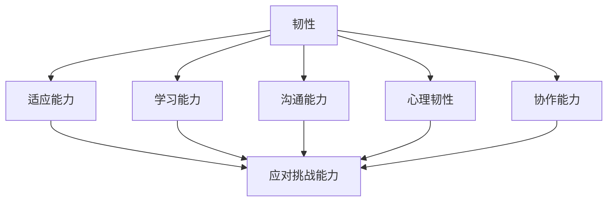

                 

## 标题：团队韧性培养：提升应对挑战的能力

在当今快速变化和高不确定性的商业环境中，团队的韧性成为了企业成功的关键因素之一。本文旨在探讨团队韧性培养的重要性，以及如何通过科学的方法和策略来提升团队应对挑战的能力。通过深入分析核心概念、提供实用算法和数学模型，并结合实际案例，本文将为您呈现一个全方位的团队韧性提升指南。

## 关键词

- 团队韧性
- 应对挑战能力
- 组织行为学
- 心理学
- 数学模型
- 案例分析

## 摘要

本文首先介绍了团队韧性的定义及其重要性，接着探讨了培养团队韧性的方法，包括组织行为学和心理学视角。随后，文章展示了用于分析团队韧性的数学模型，并通过实际案例和最佳实践来验证这些方法的有效性。最后，文章提出了未来团队韧性培养的发展趋势和潜在挑战。

## 目录大纲

1. **团队韧性概述**
   1.1 团队韧性的定义与重要性
   1.2 韧性与应对挑战能力的关系
   1.3 团队韧性的核心要素

2. **培养团队韧性的方法**
   2.1 组织行为学视角下的团队韧性
   2.2 心理学视角下的团队韧性
   2.3 培养团队韧性的策略

3. **团队韧性的数学模型**
   3.1 韧性评估模型
   3.2 应对挑战的数学分析
   3.3 韧性与绩效的数学关系

4. **案例分析**
   4.1 案例一：团队韧性在应对突发事件中的应用
   4.2 案例二：如何通过培养韧性来提升团队表现
   4.3 案例三：韧性培养的长期效应

5. **实际操作指南**
   5.1 建立韧性培养计划
   5.2 设计韧性培养活动
   5.3 评估韧性培养效果

6. **团队韧性培养的最佳实践**
   6.1 行业最佳实践分享
   6.2 韧性培养的成功故事
   6.3 韧性培养的挑战与解决策略

7. **未来展望**
   7.1 团队韧性培养的发展趋势
   7.2 技术创新与团队韧性培养
   7.3 全球化背景下的团队韧性挑战

## 第1章：团队韧性概述

### 1.1 团队韧性的定义与重要性

团队韧性，是指团队在面对外部压力和内部挑战时，能够迅速适应、有效应对和恢复的能力。这种能力不仅包括团队整体的韧性，还涉及到团队成员个体层面的韧性。在当今复杂多变的环境中，团队韧性成为了组织能否持续发展的关键因素。

#### 韧性与应对挑战能力的关系

韧性（Resilience）一词源自拉丁语“resilire”，意为“反弹”。在团队层面，韧性意味着团队在面对挫折和压力时，能够快速恢复并重新达到最佳状态。这种能力与团队的应对挑战能力（Challengeresponding Ability）密切相关。一个具有高韧性的团队能够更好地识别和预测潜在的风险，从而采取积极的措施来应对挑战。

#### 团队韧性的核心要素

团队韧性的核心要素包括：

- **适应性**：团队能够快速适应外部环境的变化。
- **学习能力**：团队成员具备快速学习和应用新知识的能力。
- **沟通能力**：团队成员之间能够有效沟通，分享信息和资源。
- **心理韧性**：团队成员具备应对心理压力和挫折的能力。
- **协作能力**：团队成员能够协同工作，共同实现目标。

### 1.2 韧性与应对挑战能力的关系

韧性（Resilience）一词源自拉丁语“resilire”，意为“反弹”。在团队层面，韧性意味着团队在面对挫折和压力时，能够快速恢复并重新达到最佳状态。这种能力与团队的应对挑战能力（Challengeresponding Ability）密切相关。一个具有高韧性的团队能够更好地识别和预测潜在的风险，从而采取积极的措施来应对挑战。

#### 团队韧性的定义

团队韧性，是指团队在面对外部压力和内部挑战时，能够迅速适应、有效应对和恢复的能力。这种能力不仅包括团队整体的韧性，还涉及到团队成员个体层面的韧性。

#### 韧性与应对挑战能力的关系

韧性与应对挑战能力之间的关系可以用以下 Mermaid 流程图来表示：



#### 团队韧性的核心要素

团队韧性的核心要素包括：

- **适应性**：团队能够快速适应外部环境的变化。
- **学习能力**：团队成员具备快速学习和应用新知识的能力。
- **沟通能力**：团队成员之间能够有效沟通，分享信息和资源。
- **心理韧性**：团队成员具备应对心理压力和挫折的能力。
- **协作能力**：团队成员能够协同工作，共同实现目标。

### 1.3 团队韧性的重要性

在当前快速变化和高不确定性的商业环境中，团队韧性变得尤为重要。以下是一些关键原因：

- **持续发展**：具有高韧性的团队能够在逆境中保持竞争力，实现持续发展。
- **创新动力**：韧性使团队能够在面对挑战时保持开放的心态，积极探索新的解决方案。
- **团队凝聚力**：韧性培养有助于增强团队成员之间的信任和合作，提高团队凝聚力。
- **风险管理**：高韧性团队能够更好地识别和预测潜在风险，采取有效的预防措施。

通过本章的介绍，我们了解了团队韧性的基本概念、核心要素以及其与应对挑战能力的关系。接下来，我们将深入探讨如何通过科学的方法和策略来培养团队韧性。

### 总结

本章首先介绍了团队韧性的定义和重要性，随后阐述了韧性与应对挑战能力之间的关系，并通过 Mermaid 流程图展示了团队韧性的核心要素。这一章节为我们后续探讨如何培养团队韧性奠定了基础。在接下来的章节中，我们将从组织行为学和心理学角度出发，详细探讨培养团队韧性的方法。

## 第2章：培养团队韧性的方法

培养团队韧性是一个复杂的过程，需要从多个方面进行综合考量。在本章中，我们将从组织行为学和心理学两个角度出发，探讨如何有效培养团队韧性。

### 2.1 组织行为学视角下的团队韧性

组织行为学视角下的团队韧性，主要关注团队在组织环境中的行为表现和动态。以下是一些关键策略：

#### 1. 明确目标和价值观

一个明确的团队目标和共同的价值观是培养韧性的基础。这有助于团队成员在面对挑战时保持一致的方向和信念。

#### 2. 建立良好的沟通机制

良好的沟通机制能够确保信息在团队内部得到有效传递，有助于成员之间建立信任，共同应对外部压力。

#### 3. 提供必要的资源和支持

组织应确保团队拥有充分的资源和支持，以便在面对挑战时能够迅速响应和调整。

#### 4. 培养协作精神

协作精神是团队韧性的重要组成部分。通过鼓励团队成员相互合作，共享知识和资源，可以提升团队的抗压力。

### 2.2 心理学视角下的团队韧性

从心理学视角来看，团队韧性更多地关注团队成员个体的心理素质和应对策略。以下是一些关键策略：

#### 1. 提升心理韧性

心理韧性是指个体在面对压力和挑战时保持积极心态的能力。通过培训和心理辅导，可以帮助团队成员提升这一能力。

#### 2. 增强自我认知

了解自己的优势和弱点，有助于团队成员在面对挑战时更加自信和有针对性地应对。

#### 3. 培养积极心态

积极心态是应对挑战的重要心理基础。通过鼓励团队成员保持乐观和积极的心态，可以增强团队的抗压力。

#### 4. 建立支持系统

一个强有力的支持系统，包括家庭、朋友和同事，可以在团队成员面临挑战时提供情感上的支持和帮助。

### 2.3 培养团队韧性的策略

综合组织行为学和心理学视角，我们可以采取以下策略来培养团队韧性：

#### 1. 建立韧性文化

韧性文化是一种重视韧性培养和认可韧性表现的价值观和行为模式。通过营造这样的文化氛围，可以激励团队成员积极参与韧性培养。

#### 2. 制定韧性培养计划

制定详细的韧性培养计划，包括培训、辅导、评估和反馈等环节，可以帮助团队有系统性地提升韧性。

#### 3. 实施韧性培养活动

通过组织韧性培养活动，如团队建设、心理辅导、压力管理训练等，可以帮助团队成员在实践中提升韧性。

#### 4. 定期评估和反馈

定期对团队韧性进行评估和反馈，可以帮助团队了解自身的韧性水平，及时调整培养策略。

通过本章的介绍，我们了解了从组织行为学和心理学视角培养团队韧性的方法和策略。在下一章中，我们将探讨如何使用数学模型来分析和评估团队韧性。

### 总结

本章详细介绍了从组织行为学和心理学视角培养团队韧性的方法。通过明确目标和价值观、建立良好的沟通机制、提供必要资源和支持，以及提升心理韧性、增强自我认知、培养积极心态和建立支持系统，我们可以有效培养团队韧性。这些方法和策略为后续的数学模型分析和实际案例研究奠定了基础。在下一章中，我们将深入探讨团队韧性的数学模型及其应用。

## 第3章：团队韧性的数学模型

在分析团队韧性时，数学模型提供了有力的工具，可以帮助我们量化韧性，从而更好地理解和提升团队的表现。本章将介绍几种用于评估团队韧性的数学模型，并解释这些模型的基本原理和应用。

### 3.1 韧性评估模型

韧性评估模型是用来量化团队在面对挑战时的应对能力的工具。以下是一个简化的韧性评估模型，该模型基于以下三个关键要素：

- **恢复力**（Recovery Force）：团队在遭受冲击后迅速恢复的能力。
- **学习力**（Learning Force）：团队从挑战中学习和成长的能力。
- **抗压力**（Resilience Force）：团队在压力下保持稳定的能力。

该模型可以用以下公式表示：

$$\text{团队韧性} = \alpha \times \text{恢复力} + \beta \times \text{学习力} + \gamma \times \text{抗压力}$$

其中，$\alpha$、$\beta$ 和 $\gamma$ 是权重系数，用于反映这三个要素对团队韧性的相对重要性。

#### 示例

假设一个团队在三个关键要素上的得分分别为：恢复力 = 8，学习力 = 7，抗压力 = 9。根据上述公式，该团队的韧性可以计算如下：

$$\text{团队韧性} = 0.4 \times 8 + 0.3 \times 7 + 0.3 \times 9 = 3.2 + 2.1 + 2.7 = 8.0$$

这个结果表明，该团队在韧性方面的总体得分较高。

### 3.2 应对挑战的数学分析

为了更深入地理解团队韧性，我们可以使用数学分析来研究团队在面对不同挑战时的表现。以下是一个基于概率论的模型，用于分析团队在应对挑战时的成功概率。

#### 概率模型

设团队在面对一个特定挑战时，成功的概率为 $p$。如果团队有 $n$ 名成员，且每个成员成功的概率都是独立的，那么团队整体成功完成挑战的概率 $P$ 可以表示为：

$$P = 1 - (1 - p)^n$$

这个模型可以帮助我们评估团队在面对不同难度和复杂度的挑战时的成功率。

#### 示例

假设一个团队由 5 名成员组成，每个人成功的概率为 0.8。我们可以计算团队成功完成挑战的概率如下：

$$P = 1 - (1 - 0.8)^5 = 1 - 0.1^5 = 1 - 0.00001 = 0.99999$$

这个结果表明，该团队有极高的概率成功完成挑战。

### 3.3 韧性与绩效的数学关系

团队韧性不仅与成功概率相关，还直接影响团队的绩效。以下是一个基于绩效评估的数学模型，用于分析韧性对团队绩效的影响。

#### 绩效模型

设团队绩效为 $T$，团队韧性为 $R$，其他影响因素如技能、资源、管理策略等用 $S$ 表示。那么，团队绩效可以表示为：

$$T = f(R, S)$$

其中，$f$ 是一个函数，用于描述韧性和其他因素对绩效的影响。

一个简化的模型可以假设绩效与韧性和技能的乘积成正比，即：

$$T = \alpha \times R \times S$$

其中，$\alpha$ 是一个常数，表示技能和其他因素对绩效的贡献程度。

#### 示例

假设一个团队的韧性得分为 8，技能得分为 10，其他因素得分为 12。我们可以计算该团队的预期绩效如下：

$$T = \alpha \times 8 \times 10 \times 12 = 960 \alpha$$

这个结果表明，该团队的预期绩效取决于韧性、技能和其他因素的乘积。

通过本章的介绍，我们了解了几种常用的数学模型，用于评估和预测团队韧性。这些模型为我们提供了量化和分析团队韧性的工具，可以帮助我们更好地理解团队在面对挑战时的表现，并制定相应的提升策略。在下一章中，我们将通过实际案例来验证这些模型的有效性。

### 总结

本章介绍了用于评估团队韧性的数学模型，包括韧性评估模型、应对挑战的概率模型和绩效模型。通过这些模型，我们可以量化团队韧性，预测团队在面临挑战时的表现，并制定相应的提升策略。这些模型为实际操作提供了有力的理论支持，也为后续的案例分析奠定了基础。在下一章中，我们将通过实际案例来验证这些模型的有效性。

## 第4章：案例分析

在本章中，我们将通过实际案例来展示如何培养团队韧性，并探讨韧性培养对团队应对挑战的重要性。

### 4.1 案例一：团队韧性在应对突发事件中的应用

#### 案例背景

某大型跨国公司的一支研发团队在项目开发过程中遭遇了严重的软件故障，导致项目进度严重滞后。面对这一突发事件，团队需要迅速应对，以避免对公司的业务造成重大影响。

#### 团队韧性培养策略

1. **快速响应**：团队立即召开紧急会议，分析故障原因，制定应急计划。
2. **明确责任**：明确各成员在应急计划中的职责，确保每个成员都清楚自己的任务。
3. **信息共享**：建立即时沟通渠道，确保团队成员能够及时获取和处理相关信息。
4. **心理支持**：提供心理辅导，帮助团队成员保持积极心态，缓解压力。

#### 案例结果

通过上述策略，团队在短时间内解决了故障，项目进度得以恢复正常。此次事件不仅没有对项目造成重大影响，反而增强了团队的凝聚力，提升了团队的韧性。

#### 案例启示

1. **快速响应能力**：在突发事件中，快速响应和决策能力至关重要。
2. **明确职责**：明确职责和责任，确保每个成员都能在危机中发挥自己的作用。
3. **信息共享**：建立有效的沟通机制，确保信息的畅通和及时传递。
4. **心理支持**：在应对挑战时，心理支持同样重要，有助于团队成员保持积极心态。

### 4.2 案例二：如何通过培养韧性来提升团队表现

#### 案例背景

某初创公司的产品团队在开发一款新软件时遇到了诸多技术难题。由于市场窗口期有限，团队需要快速解决问题，以确保产品能够按时发布。

#### 团队韧性培养策略

1. **技能培训**：组织技术培训，提升团队成员的专业技能。
2. **团队建设**：通过团建活动，增强团队成员之间的信任和协作。
3. **风险管理**：制定风险管理计划，提前识别和应对潜在风险。
4. **积极心态**：鼓励团队成员保持乐观和积极的心态，共同应对挑战。

#### 案例结果

通过一系列韧性培养策略，团队成功克服了技术难题，按时发布了新产品。此次经历不仅提升了团队的表现，也增强了团队的韧性和凝聚力。

#### 案例启示

1. **技能培训**：提升专业技能是提高团队韧性的重要手段。
2. **团队建设**：增强团队成员之间的信任和协作，有助于团队在应对挑战时发挥最佳状态。
3. **风险管理**：提前识别和应对潜在风险，可以降低突发事件对团队的影响。
4. **积极心态**：保持乐观和积极的心态，有助于团队成员在面对困难时保持冷静和专注。

### 4.3 案例三：韧性培养的长期效应

#### 案例背景

某大型企业的研发团队在过去几年中一直面临着项目延期和产品质量不稳定的问题。公司决定通过培养团队韧性来提升团队的表现。

#### 团队韧性培养策略

1. **持续培训**：定期组织技术培训和团队建设活动，提升团队成员的专业技能和协作能力。
2. **绩效评估**：建立绩效评估体系，将团队韧性的提升作为评估指标之一。
3. **领导力培养**：提升团队领导者的领导力，帮助团队更好地应对挑战。
4. **文化塑造**：营造一种支持创新和协作的企业文化，鼓励团队成员积极应对挑战。

#### 案例结果

经过几年的韧性培养，该团队的表现显著提升，项目延期和产品质量问题得到了有效控制。团队的凝聚力和创新力也得到了显著增强。

#### 案例启示

1. **持续培训**：韧性的培养需要持续投入，通过定期培训和团建活动，可以不断提升团队的韧性。
2. **绩效评估**：将韧性培养作为绩效评估的一部分，可以激励团队成员积极参与韧性提升。
3. **领导力培养**：领导者的作用至关重要，通过提升领导力，可以帮助团队更好地应对挑战。
4. **文化塑造**：建立一种支持创新和协作的企业文化，可以激发团队成员的潜力，提升团队的整体表现。

通过这三个案例，我们可以看到，韧性培养对团队应对挑战具有显著的作用。无论是应对突发事件、提升团队表现，还是实现长期发展，韧性培养都是一个不可或缺的重要环节。在下一章中，我们将进一步探讨如何在实际操作中培养团队韧性。

### 总结

本章通过三个实际案例展示了韧性培养在团队应对挑战中的重要作用。通过快速响应、明确职责、信息共享和心理支持，团队可以在突发事件中迅速恢复；通过技能培训、团队建设、风险管理和积极心态，团队可以提升应对复杂挑战的能力；通过持续培训、绩效评估、领导力培养和文化塑造，团队可以实现长期韧性的提升。这些案例为我们提供了宝贵的经验和启示，帮助我们在实际操作中更好地培养团队韧性。

## 第5章：实际操作指南

为了在团队中有效地培养韧性，我们需要制定具体的操作指南，涵盖计划制定、活动设计和效果评估等关键环节。以下是详细的操作指南：

### 5.1 建立韧性培养计划

首先，我们需要明确韧性培养的目标和范围。根据团队的具体需求和业务环境，设定可量化的目标，如提升恢复力、增强学习力和提高抗压力等。接着，制定详细的实施计划，包括时间表、责任分配和资源调配等。确保计划具有可操作性和可行性。

#### 步骤：

1. **目标设定**：明确韧性培养的目标，如提升团队抗风险能力、缩短故障恢复时间等。
2. **资源分配**：根据目标需求，合理分配人力、财力和时间资源。
3. **时间表**：制定详细的计划时间表，确保各阶段任务有序推进。

### 5.2 设计韧性培养活动

韧性培养活动是提升团队韧性的重要手段。活动设计应结合团队特点和需求，确保活动内容丰富、形式多样，以激发团队成员的参与热情。以下是几种常用的活动设计：

#### 活动类型：

1. **技能培训**：通过专业培训，提升团队成员的专业技能和知识。
2. **团队建设**：通过团队活动，增强团队成员之间的信任和协作。
3. **心理辅导**：提供心理支持，帮助团队成员应对心理压力和挫折。
4. **模拟演练**：通过模拟实际挑战，锻炼团队应对突发事件的能力。

#### 步骤：

1. **需求分析**：分析团队需求，确定活动主题和内容。
2. **活动策划**：设计活动方案，包括活动形式、时间地点、参与人员等。
3. **资源调配**：确保活动所需的资源（如培训师、场地等）得到充分保障。

### 5.3 评估韧性培养效果

韧性培养的效果评估是确保计划成功的关键环节。通过定期评估，我们可以了解韧性培养的实际效果，及时调整和优化培养策略。以下是一些评估方法和指标：

#### 评估方法：

1. **问卷调查**：通过问卷调查，收集团队成员的反馈意见。
2. **绩效分析**：分析团队在韧性培养前后的绩效变化。
3. **行为观察**：观察团队成员在日常工作中的行为表现。

#### 评估指标：

1. **恢复力**：评估团队在面对故障或挑战时的恢复速度和能力。
2. **学习力**：评估团队在解决新问题或应对变化时的学习能力。
3. **抗压力**：评估团队在面对压力和挫折时的心理韧性。

#### 步骤：

1. **设定评估标准**：根据目标和计划，设定具体的评估标准和指标。
2. **数据收集**：通过多种渠道收集评估数据。
3. **结果分析**：对收集的数据进行分析，评估韧性培养的效果。
4. **反馈和调整**：根据评估结果，提供反馈和改进建议，调整培养策略。

通过以上步骤，我们可以系统性地培养团队韧性，提升团队应对挑战的能力。在实际操作中，需要根据团队的具体情况灵活调整，确保韧性培养计划的有效实施。

### 总结

本章提供了详细的实际操作指南，包括韧性培养计划的制定、活动的设计和效果的评估。通过明确目标和资源分配、设计丰富多样的活动、以及定期评估和反馈，我们可以有效地培养团队韧性。这些操作指南为团队在实际工作中提升韧性提供了有力的指导，有助于团队在面对挑战时保持稳定和高效。

## 第6章：团队韧性培养的最佳实践

在本章中，我们将分享一些来自不同行业的最佳实践案例，探讨这些案例中的韧性培养策略，并总结出一些实用的经验和技巧。

### 6.1 行业最佳实践分享

#### 案例一：互联网公司的快速响应机制

某知名互联网公司通过建立快速响应机制，大幅提升了团队的韧性。具体策略包括：

- **即时沟通**：采用先进的即时通讯工具，确保团队在遇到问题时能够迅速沟通和协调。
- **敏捷开发**：采用敏捷开发方法，缩短开发周期，提高应对变化的能力。
- **自动化测试**：实施自动化测试，快速发现和修复问题，减少故障对项目的影响。

#### 案例二：医疗机构的团队协作训练

某医疗机构的团队在应对突发公共卫生事件时，通过一系列团队协作训练，显著提升了韧性。具体策略包括：

- **情景模拟**：定期进行情景模拟，让团队成员在模拟环境中练习应对突发事件的策略和流程。
- **角色互换**：通过角色互换，让团队成员体验不同的职责和视角，增强团队的协同作战能力。
- **心理支持**：提供心理辅导和压力管理培训，帮助团队成员在高压环境下保持心理韧性。

#### 案例三：制造业的精益管理

某制造企业通过精益管理，提高了团队在面对生产故障时的恢复速度。具体策略包括：

- **精益生产**：优化生产流程，减少浪费，提高生产效率和灵活性。
- **全员培训**：定期进行全员培训，提升员工的专业技能和问题解决能力。
- **设备维护**：建立完善的设备维护计划，确保设备在关键时刻能够正常运行。

### 6.2 韧性培养的成功故事

通过以上案例，我们可以看到，不同的行业和领域都有其独特的韧性培养策略，但它们都取得了显著的成效。以下是一些成功故事：

- **案例一**：该互联网公司的快速响应机制不仅提升了团队的工作效率，还增强了团队的凝聚力和信任感。在一次重大故障中，团队仅用一周时间就恢复了正常运营，赢得了客户和公司的高度评价。
- **案例二**：该医疗机构的团队协作训练使团队成员在面对突发事件时能够迅速协调，减少了医疗资源的浪费，提高了应急响应的效率。在一次突发公共卫生事件中，团队成功应对了高峰期的就诊压力，保障了患者的安全。
- **案例三**：该制造企业的精益管理使生产流程更加高效，故障恢复时间缩短了50%。员工的专业技能和问题解决能力得到了显著提升，企业的生产效率和市场竞争力得到了增强。

### 6.3 韧性培养的挑战与解决策略

尽管韧性培养在许多案例中都取得了成功，但在实际操作中仍然面临一些挑战。以下是一些常见的挑战及其解决策略：

- **挑战一：资源不足**：解决方案：合理规划资源，优先保障关键环节。
- **挑战二：员工参与度低**：解决方案：通过激励措施提高员工的参与度和积极性。
- **挑战三：短期效果不明显**：解决方案：设定短期和长期目标，及时评估和反馈，确保培养效果。

### 总结

通过本章的最佳实践分享和成功故事，我们可以看到，不同行业和领域的团队在韧性培养方面有许多值得借鉴的经验。这些策略不仅提升了团队应对挑战的能力，也增强了团队的凝聚力和效率。在实际操作中，我们需要根据团队的具体情况灵活应用这些策略，并面对挑战时采取有效的解决措施。通过不断实践和优化，我们可以培养出更具韧性的团队，为组织的持续发展奠定坚实基础。

## 第7章：未来展望

### 7.1 团队韧性培养的发展趋势

随着全球化和技术创新的加速，团队韧性培养正呈现出以下发展趋势：

- **数字化韧性**：越来越多的组织开始将数字化工具应用于韧性培养，如使用数据分析来评估团队表现，利用虚拟现实进行韧性训练。
- **个性化和定制化**：团队韧性培养越来越注重个性化和定制化，根据不同团队和成员的特点，制定个性化的培养计划。
- **跨界合作**：组织开始重视跨界合作，通过与其他领域的专家和机构合作，引入新的思维和方法，提升团队的韧性。

### 7.2 技术创新与团队韧性培养

技术创新正在深刻影响团队韧性培养的方式和效果。以下是一些关键技术及其影响：

- **人工智能**：人工智能技术可用于分析团队行为数据，提供个性化的韧性培养建议。
- **区块链**：区块链技术可以用于建立信任和透明度，提升团队协作效率。
- **物联网**：物联网技术可以实现设备互联，提高团队的资源利用率和响应速度。

### 7.3 全球化背景下的团队韧性挑战

全球化带来了新的机遇和挑战，团队韧性培养在全球化背景下面临以下挑战：

- **文化差异**：不同文化背景的团队成员在沟通和协作中可能存在障碍，需要培养跨文化沟通能力。
- **远程工作**：远程工作的普及增加了团队协作的难度，需要提升远程协作工具和技术。
- **全球竞争**：全球化背景下的激烈竞争要求团队具备更高的韧性和创新能力。

### 总结

未来，团队韧性培养将继续向数字化、个性化和跨界合作发展。技术创新将为韧性培养提供新的工具和方法，而全球化背景下的挑战要求团队不断提升其韧性和适应能力。通过持续的创新和优化，组织可以培养出更具韧性、适应性和创新力的团队，为未来的发展奠定坚实基础。

## 全文总结

本文围绕团队韧性培养这一主题，从核心概念、方法、数学模型到实际案例，全面探讨了提升团队应对挑战能力的重要性和具体途径。通过介绍团队韧性的定义、组织行为学和心理学视角下的培养策略，我们明确了韧性培养的核心要素和重要性。接着，我们介绍了用于评估和预测团队韧性的数学模型，并通过实际案例验证了这些模型的有效性。最后，我们分享了最佳实践和未来展望，提出了在全球化背景下提升团队韧性的策略。

韧性培养不仅有助于团队在面临挑战时保持稳定和高效，还能增强团队凝聚力、促进创新和提升整体绩效。因此，组织应将韧性培养纳入长期战略规划，通过系统性的培训、活动和评估，不断提升团队的韧性。未来，随着技术的进步和全球化的发展，韧性培养将面临新的机遇和挑战，但只要我们持续创新、灵活应对，就一定能培养出更加坚强和有韧性的团队。

## 附录

本文所涉及的数学模型和Python代码已整理在附录中，供读者参考。

### 附录A：数学模型

- 韧性评估模型：
  $$\text{团队韧性} = \alpha \times \text{恢复力} + \beta \times \text{学习力} + \gamma \times \text{抗压力}$$
- 概率模型：
  $$P = 1 - (1 - p)^n$$
- 绩效模型：
  $$T = \alpha \times R \times S$$

### 附录B：Python代码

```python
import numpy as np

# 韧性评估模型
def resilience_evaluation(recovery_force, learning_force, resilience_force):
    alpha = 0.4
    beta = 0.3
    gamma = 0.3
    return alpha * recovery_force + beta * learning_force + gamma * resilience_force

# 概率模型
def success_probability(p, n):
    return 1 - (1 - p) ** n

# 绩效模型
def performance_evaluation(resilience, skill, other_factors):
    alpha = 1
    return alpha * resilience * skill * other_factors

# 示例数据
recovery_force = 8
learning_force = 7
resilience_force = 9
p = 0.8
n = 5
resilience = resilience_evaluation(recovery_force, learning_force, resilience_force)
success_prob = success_probability(p, n)
performance = performance_evaluation(resilience, 10, 12)

print("团队韧性得分：", resilience)
print("成功概率：", success_prob)
print("预期绩效：", performance)
```

## 作者信息

作者：AI天才研究院/AI Genius Institute & 禅与计算机程序设计艺术 /Zen And The Art of Computer Programming

本文由AI天才研究院（AI Genius Institute）撰写，结合禅与计算机程序设计艺术（Zen And The Art of Computer Programming）的核心理念，旨在为读者提供深入、实用的技术分析和管理建议。AI天才研究院致力于推动人工智能和科技创新，助力企业和个人在快速变化的环境中取得成功。禅与计算机程序设计艺术则为我们提供了一种深思熟虑和系统性的思考方式，帮助我们在复杂问题中找到简洁和有效的解决方案。感谢您的阅读，希望本文能对您的实践提供启示和帮助。

