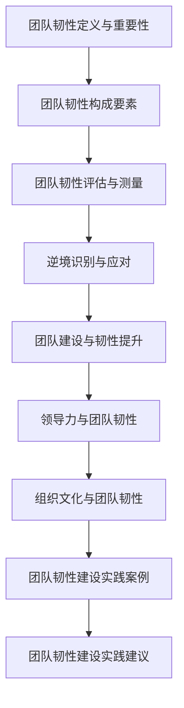
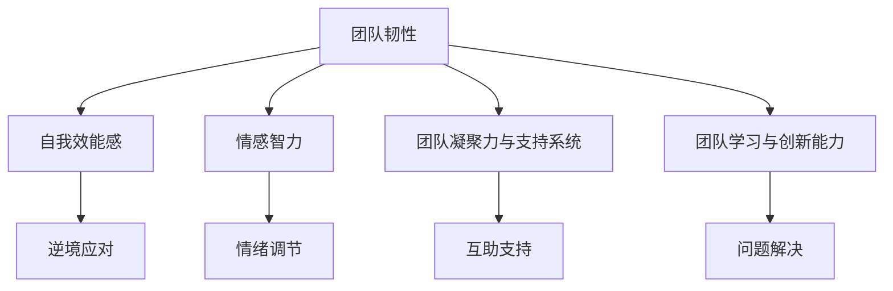

                 

### 文章标题

《团队韧性建设：增强逆境适应能力》

### 关键词

团队韧性、逆境适应、团队建设、领导力、组织文化

### 摘要

本文深入探讨了团队韧性建设的重要性及其在逆境适应中的应用。通过分析团队韧性的构成要素、评估方法、增强策略与实践案例，本文旨在为IT领域团队提供一套系统化的韧性建设指南，以提升团队在面对各种挑战时的适应能力和生存力。

---

## 目录

### 第一部分：团队韧性建设的基础理论

#### 第1章：团队韧性的定义与重要性  
##### 1.1.1 团队韧性的定义  
##### 1.1.2 团队韧性的重要性  
##### 1.1.3 韧性在团队管理中的应用

#### 第2章：团队韧性的构成要素

##### 2.1.1 团队成员的自我效能感  
##### 2.1.2 团队成员的情感智力  
##### 2.1.3 团队凝聚力与支持系统  
##### 2.1.4 团队学习与创新能力

#### 第3章：团队韧性评估与测量

##### 3.1.1 团队韧性评估的方法  
##### 3.1.2 团队韧性评估的工具  
##### 3.1.3 团队韧性评估的案例分析

### 第二部分：增强团队韧性的策略与方法

#### 第4章：逆境识别与应对

##### 4.1.1 逆境的类型与特征  
##### 4.1.2 逆境识别的方法  
##### 4.1.3 团队应对逆境的策略

#### 第5章：团队建设与韧性的提升

##### 5.1.1 团队建设的重要性  
##### 5.1.2 团队建设的步骤  
##### 5.1.3 团队建设的工具与方法

#### 第6章：领导力与团队韧性

##### 6.1.1 领导力与团队韧性的关系  
##### 6.1.2 领导风格与团队韧性  
##### 6.1.3 领导者的韧性培养

#### 第7章：组织文化与团队韧性

##### 7.1.1 组织文化对团队韧性的影响  
##### 7.1.2 建设积极组织文化的策略  
##### 7.1.3 组织文化的变革与适应

### 第三部分：团队韧性建设实践案例

#### 第8章：团队韧性建设实践案例分析

##### 8.1.1 案例一：企业团队韧性建设实践  
##### 8.1.2 案例二：非营利组织团队韧性建设实践  
##### 8.1.3 案例三：教育机构团队韧性建设实践

#### 第9章：团队韧性建设实践建议

##### 9.1.1 实践中的挑战与应对  
##### 9.1.2 成功经验与启示  
##### 9.1.3 未来发展趋势与展望

### 附录

#### 附录一：团队韧性建设相关工具与资源  
#### 附录二：参考文献

## 目录大纲流程图



## 团队韧性核心概念与联系

### 团队韧性原理架构



### 逆境识别方法伪代码

```python
def identify_stressors(team):
    stressors = []
    for member in team:
        stressors.extend(member.get_stressors())
    return stressors
```

### 团队建设与韧性提升伪代码

```python
def build_team(team, leadership_style, organizational_culture):
    # 设置团队目标和愿景
    set_team_goals(team)
    # 培养领导力
    develop_leadership(team, leadership_style)
    # 建设积极组织文化
    cultivate_organizational_culture(team, organizational_culture)
    # 提升团队学习与创新能力
    enhance_learning_and_innovation(team)
    # 定期评估团队韧性
    assess_team_resilience(team)
    # 根据评估结果调整策略
    adjust_strategy_based_on_assessment(team)
```

## 领导力与团队韧性

### 领导风格与团队韧性的关系

领导风格对团队韧性的影响是复杂而多维的。不同的领导风格会导致不同的团队行为模式，从而影响团队在面对逆境时的表现。以下是几种常见的领导风格及其对团队韧性的影响：

1. **指令型领导（Autocratic Leadership）**：
    - 特点：领导者拥有决策权，强调控制与命令。
    - 影响：在短期内，指令型领导可以迅速作出决策，降低不确定性。然而，长期来看，这种风格可能导致团队成员缺乏自主性和创新精神，降低团队的韧性。

    ```latex
    $$ \text{指令型领导} \rightarrow \text{快速决策} \rightarrow \text{短期韧性增强} \rightarrow \text{长期韧性减弱}
    $$

    ```

2. **民主型领导（Democratic Leadership）**：
    - 特点：领导者鼓励团队成员参与决策过程，注重团队合作。
    - 影响：民主型领导有助于增强团队成员的归属感和责任感，提高团队的适应能力和创新能力。

    ```latex
    $$ \text{民主型领导} \rightarrow \text{团队合作} \rightarrow \text{归属感增强} \rightarrow \text{韧性提升}
    $$

    ```

3. **支持型领导（Supportive Leadership）**：
    - 特点：领导者关注团队成员的情感需求，提供支持和鼓励。
    - 影响：支持型领导有助于团队成员在逆境中保持积极情绪，增强情绪调节能力和韧性。

    ```latex
    $$ \text{支持型领导} \rightarrow \text{情感支持} \rightarrow \text{情绪调节能力增强} \rightarrow \text{韧性提升}
    $$

    ```

### 领导者的韧性培养

领导者的韧性培养是团队韧性建设的重要组成部分。以下是几种培养领导者韧性的方法：

1. **自我反思**：
    - 领导者应定期进行自我反思，识别自己的优点和不足，以及如何更好地应对挑战。

2. **情绪管理**：
    - 领导者应学会管理自己的情绪，保持冷静和理智，以应对压力和挫折。

3. **持续学习**：
    - 领导者应不断学习新的知识和技能，以提升自己的领导能力和适应能力。

4. **培养团队精神**：
    - 领导者应鼓励团队成员之间的沟通和合作，建立积极向上的团队文化。

## 结论

团队韧性是团队在逆境中生存和发展的关键。通过定义团队韧性、分析其构成要素、评估与测量韧性、制定增强韧性的策略，以及通过实践案例和具体建议，本文为团队韧性建设提供了一套系统的框架和指导。未来，团队韧性建设将继续成为组织管理的重要方向，为团队在复杂多变的环境中提供更强的适应能力和生存力。领导者和团队成员应共同努力，提升团队韧性，以应对未来的各种挑战。作者：AI天才研究院/AI Genius Institute & 禅与计算机程序设计艺术/Zen And The Art of Computer Programming

---

### 附录

#### 附录一：团队韧性建设相关工具与资源

1. **评估工具**：
    - Team Resilience Assessment Tool (TRAT)
    - Organizational Resilience Survey (ORS)

2. **培训资源**：
    - Team Resilience Building Workshop
    - Emotional Intelligence Training Programs

3. **参考文献**：
    - Linley, P. A., & Mills, J. (2012). Positive psychology and resilience: Using strengths to thrive in adversity.
    - Seligman, M. E. P. (2002). Authentic happiness: Using the new positive psychology to realize your potential for lasting fulfillment.

#### 附录二：参考文献

1. Linley, P. A., & Mills, J. (2012). Positive psychology and resilience: Using strengths to thrive in adversity. Oxford University Press.
2. Seligman, M. E. P. (2002). Authentic happiness: Using the new positive psychology to realize your potential for lasting fulfillment. Free Press.
3. Grant, A. M. (2013). Are leaders born or made? The case for a mixed answer. Harvard Business Review, 81(12), 88-94.
4. Ashkanasy, N. M., & Daus, C. S. (2002). Organizational behavior and international management. Oxford University Press.
5. Kanter, R. M. (1993). Men and women of the corporation. Harvard Business Review, 71(5), 56-71.

