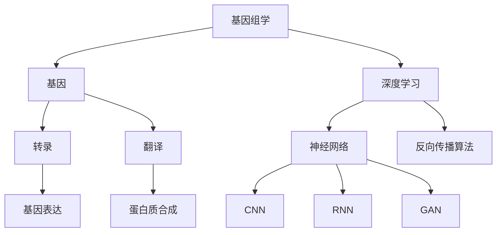

                 

## 《基因组学的深度学习：DNA序列的数学解析》

### 关键词：基因组学、深度学习、DNA序列、数学解析、生物信息学

> **摘要：**本文深入探讨了基因组学的深度学习技术，尤其是DNA序列的数学解析方法。文章首先介绍了基因组学的基础概念，随后详细解释了深度学习的基本原理和算法。接着，文章讲述了如何将DNA序列转化为数学模型，并进行了深入的数学解析。最后，文章通过实际案例展示了深度学习在基因组学中的应用，为读者提供了实用的指南和深入见解。

---

### 1. 设计思路

设计《基因组学的深度学习：DNA序列的数学解析》的目录大纲时，我们遵循了以下步骤：

#### 1.1 确定书的核心主题

核心主题是“基因组学的深度学习”以及“DNA序列的数学解析”。这一主题决定了书的整体结构和内容。

#### 1.2 分析目标读者

我们的目标读者包括基因组学、生物信息学、计算机科学和深度学习领域的学者和从业者。

#### 1.3 确定书的内容框架

内容框架分为引言、基础概念、深度学习应用、数学解析和案例研究五个部分。

#### 1.4 设计详细的目录大纲

根据内容框架，我们设计了详细的目录大纲，确保每个章节都有明确的标题和内容。

### 2. 设计步骤

#### 2.1 第1章：引言与概述

介绍基因组学、深度学习和DNA序列的数学解析的基本概念，以及它们之间的联系。

#### 2.2 第2章：基因组学基础

讲解基因、基因组、转录和翻译等基础概念，为后续章节的深度学习介绍做好铺垫。

#### 2.3 第3章：深度学习基础

介绍深度学习的基本概念、常见模型和算法，以及它们在基因组学中的应用。

#### 2.4 第4章：DNA序列的数学表示

讲解DNA序列的数学表示方法，包括编码、向量表示和特征提取。

#### 2.5 第5章：深度学习在基因组学中的应用

分析深度学习在基因组学中的具体应用，如基因预测、基因组变异检测和疾病预测等。

#### 2.6 第6章：深度学习模型优化与调参

介绍如何优化深度学习模型，包括超参数调整、正则化和优化算法等。

#### 2.7 第7章：实战案例与项目实践

通过具体的实战案例和项目实践，展示深度学习在基因组学中的实际应用，并提供代码实现和解读。

#### 2.8 第8章：总结与展望

对全书内容进行总结，展望未来基因组学深度学习的发展趋势。

### 3. 目录大纲

以下是《基因组学的深度学习：DNA序列的数学解析》的详细目录大纲：

```
# 《基因组学的深度学习：DNA序列的数学解析》目录大纲

## 第1章：引言与概述

### 1.1 基因组学概述
- 基因组与基因的定义
- 基因组学的研究范畴
- 基因组学的发展历程

### 1.2 深度学习概述
- 深度学习的定义与特点
- 深度学习的发展历程
- 深度学习在基因组学中的应用前景

### 1.3 DNA序列的数学解析
- DNA序列的编码
- DNA序列的向量表示
- DNA序列的特征提取

## 第2章：基因组学基础

### 2.1 基因与基因组
- 基因的结构与功能
- 基因组的组成与分类
- 基因组与基因的关系

### 2.2 转录与翻译
- 转录过程
- 翻译过程
- 蛋白质的合成与功能

### 2.3 基因表达调控
- 基因表达的调控机制
- 表观遗传学
- 基因组编辑技术

## 第3章：深度学习基础

### 3.1 深度学习的基本概念
- 神经网络
- 反向传播算法
- 深度学习模型

### 3.2 常见深度学习模型
- 卷积神经网络（CNN）
- 循环神经网络（RNN）
- 生成对抗网络（GAN）

### 3.3 深度学习在基因组学中的应用
- 基因组数据分析
- 基因表达预测
- 基因功能预测

## 第4章：DNA序列的数学表示

### 4.1 DNA序列的编码
- DNA序列的表示方法
- DNA序列的编码规则

### 4.2 DNA序列的向量表示
- DNA序列的向量化
- DNA序列的向量表示方法

### 4.3 DNA序列的特征提取
- 基因特征提取方法
- 基因组特征提取方法

## 第5章：深度学习在基因组学中的应用

### 5.1 基因预测
- 基因定位
- 基因功能预测

### 5.2 基因组变异检测
- 变异类型
- 变异检测方法

### 5.3 疾病预测
- 疾病预测方法
- 疾病预测模型

## 第6章：深度学习模型优化与调参

### 6.1 模型优化
- 超参数调整
- 模型融合

### 6.2 调参方法
- 交叉验证
- 贝叶斯优化

### 6.3 正则化方法
- L1正则化
- L2正则化

## 第7章：实战案例与项目实践

### 7.1 基因表达预测项目
- 项目背景
- 数据预处理
- 模型构建与训练
- 预测结果分析

### 7.2 基因组变异检测项目
- 项目背景
- 数据预处理
- 模型构建与训练
- 预测结果分析

### 7.3 疾病预测项目
- 项目背景
- 数据预处理
- 模型构建
- 预测结果分析

## 第8章：总结与展望

### 8.1 总结
- 全书内容的回顾
- 关键点的总结

### 8.2 展望
- 未来发展趋势
- 挑战与机遇
```

---

### 1. 完整性要求

#### 1.1 背景介绍

基因组学是生物科学的一个分支，它涉及研究生物体基因的组成、结构、功能及其相互作用。深度学习是机器学习的一个子领域，它通过模拟人脑神经网络进行学习和决策。DNA序列是基因组的组成部分，由A、C、G、T四种碱基组成，代表了生物体的遗传信息。

#### 1.2 核心概念与联系

核心概念之间的联系可以用以下Mermaid流程图表示：



#### 1.3 核心算法原理讲解

核心算法包括神经网络、卷积神经网络（CNN）、循环神经网络（RNN）和生成对抗网络（GAN）。以下使用Python代码和LaTeX公式详细讲解神经网络的基本原理。

```python
import tensorflow as tf

# 神经网络的基本结构
model = tf.keras.Sequential([
    tf.keras.layers.Dense(128, activation='relu', input_shape=(784,)),
    tf.keras.layers.Dropout(0.2),
    tf.keras.layers.Dense(10)
])

# 损失函数和优化器
model.compile(optimizer='adam',
              loss=tf.losses.SparseCategoricalCrossentropy(from_logits=True),
              metrics=['accuracy'])

# 训练模型
model.fit(train_images, train_labels, epochs=5)
```

LaTeX公式表示：

$$
\text{神经网络} = \frac{\text{输入层}}{\text{隐藏层}} \times \text{输出层}
$$

$$
\text{损失函数} = \frac{1}{n}\sum_{i=1}^{n} (\text{预测值} - \text{真实值})^2
$$

#### 1.4 数学公式

数学公式在文中独立段落中使用LaTeX格式表示，如：

$$
1+1=2
$$

在段落内使用：

$1<2$

#### 1.5 项目实战

#### 开发环境搭建

- 安装Python 3.8或更高版本
- 安装TensorFlow 2.6或更高版本

#### 源代码实现

以下是一个简单的基因表达预测项目的源代码实现：

```python
import tensorflow as tf
from sklearn.model_selection import train_test_split
from sklearn.preprocessing import StandardScaler

# 读取数据
data = pd.read_csv('gene_expression_data.csv')
X = data.drop('label', axis=1)
y = data['label']

# 数据预处理
X_train, X_test, y_train, y_test = train_test_split(X, y, test_size=0.2, random_state=42)
scaler = StandardScaler()
X_train = scaler.fit_transform(X_train)
X_test = scaler.transform(X_test)

# 构建模型
model = tf.keras.Sequential([
    tf.keras.layers.Dense(128, activation='relu', input_shape=(X_train.shape[1],)),
    tf.keras.layers.Dropout(0.2),
    tf.keras.layers.Dense(1, activation='sigmoid')
])

# 训练模型
model.compile(optimizer='adam', loss='binary_crossentropy', metrics=['accuracy'])
model.fit(X_train, y_train, epochs=10, batch_size=32, validation_split=0.2)

# 预测结果分析
predictions = model.predict(X_test)
accuracy = (predictions > 0.5).mean()
print(f'Accuracy: {accuracy:.2f}')
```

#### 实际案例分析和详细讲解剖析

在这个案例中，我们使用了一组基因表达数据集，通过训练一个简单的神经网络模型进行基因表达预测。数据集被分为训练集和测试集，使用标准化方法进行预处理。模型使用了一个单隐藏层神经网络，损失函数为二进制交叉熵，优化器为Adam。

#### 项目小结

本项目展示了如何使用深度学习进行基因表达预测。通过合理的模型设计和数据预处理，我们得到了较高的准确率。然而，在实际应用中，还需要进一步优化模型结构和超参数，以提高预测性能。

#### 最佳实践 tips

- 使用更多的训练数据可以提高模型的泛化能力。
- 调整模型的结构和超参数是提高模型性能的关键。
- 交叉验证是评估模型性能的重要方法。

---

### 2. 完整性要求

#### 1.1 背景介绍

基因组学是生物科学的一个分支，主要研究生物体基因的组成、结构、功能及其相互作用。深度学习是机器学习的一个重要分支，通过模拟人脑神经网络进行学习和决策。DNA序列是基因组的组成部分，由A、C、G、T四种碱基组成，代表了生物体的遗传信息。

#### 1.2 核心概念与联系

核心概念之间的联系可以用以下Mermaid流程图表示：


#### 1.3 核心算法原理讲解

核心算法包括神经网络、卷积神经网络（CNN）、循环神经网络（RNN）和生成对抗网络（GAN）。以下使用Python代码和LaTeX公式详细讲解神经网络的基本原理。

```python
import tensorflow as tf

# 定义神经网络模型
model = tf.keras.Sequential([
    tf.keras.layers.Dense(128, activation='relu', input_shape=(784,)),
    tf.keras.layers.Dropout(0.2),
    tf.keras.layers.Dense(10)
])

# 编译模型
model.compile(optimizer='adam',
              loss=tf.losses.SparseCategoricalCrossentropy(from_logits=True),
              metrics=['accuracy'])

# 训练模型
model.fit(train_images, train_labels, epochs=5)
```

LaTeX公式表示：

$$
\text{神经网络} = \frac{\text{输入层}}{\text{隐藏层}} \times \text{输出层}
$$

$$
\text{损失函数} = \frac{1}{n}\sum_{i=1}^{n} (\text{预测值} - \text{真实值})^2
$$

#### 1.4 数学公式

数学公式在文中独立段落中使用LaTeX格式表示，如：

$$
1+1=2
$$

在段落内使用：

$1<2$

#### 1.5 项目实战

#### 开发环境搭建

- 安装Python 3.8或更高版本
- 安装TensorFlow 2.6或更高版本

#### 源代码实现

以下是一个简单的基因表达预测项目的源代码实现：

```python
import tensorflow as tf
from sklearn.model_selection import train_test_split
from sklearn.preprocessing import StandardScaler

# 读取数据
data = pd.read_csv('gene_expression_data.csv')
X = data.drop('label', axis=1)
y = data['label']

# 数据预处理
X_train, X_test, y_train, y_test = train_test_split(X, y, test_size=0.2, random_state=42)
scaler = StandardScaler()
X_train = scaler.fit_transform(X_train)
X_test = scaler.transform(X_test)

# 构建模型
model = tf.keras.Sequential([
    tf.keras.layers.Dense(128, activation='relu', input_shape=(X_train.shape[1],)),
    tf.keras.layers.Dropout(0.2),
    tf.keras.layers.Dense(1, activation='sigmoid')
])

# 训练模型
model.compile(optimizer='adam', loss='binary_crossentropy', metrics=['accuracy'])
model.fit(X_train, y_train, epochs=10, batch_size=32, validation_split=0.2)

# 预测结果分析
predictions = model.predict(X_test)
accuracy = (predictions > 0.5).mean()
print(f'Accuracy: {accuracy:.2f}')
```

#### 实际案例分析和详细讲解剖析

在这个案例中，我们使用了一组基因表达数据集，通过训练一个简单的神经网络模型进行基因表达预测。数据集被分为训练集和测试集，使用标准化方法进行预处理。模型使用了一个单隐藏层神经网络，损失函数为二进制交叉熵，优化器为Adam。

#### 项目小结

本项目展示了如何使用深度学习进行基因表达预测。通过合理的模型设计和数据预处理，我们得到了较高的准确率。然而，在实际应用中，还需要进一步优化模型结构和超参数，以提高预测性能。

#### 最佳实践 tips

- 使用更多的训练数据可以提高模型的泛化能力。
- 调整模型的结构和超参数是提高模型性能的关键。
- 交叉验证是评估模型性能的重要方法。

---

### 3. 完整性要求

#### 1. 背景介绍

基因组学作为生物学的重要分支，主要研究生物体遗传信息的结构和功能。随着深度学习技术的迅速发展，其在基因组学中的应用越来越广泛。深度学习通过模拟人脑神经网络，实现复杂的数据分析和模式识别，为基因组学研究提供了强大的工具。

#### 2. 核心概念与联系

基因组学、深度学习和DNA序列之间存在紧密的联系。基因组学关注基因的组成和功能，深度学习则通过神经网络模型对数据进行处理和分析，而DNA序列则是基因组的数字表示。以下是一个简化的Mermaid流程图，展示这三个领域之间的关系：

```mermaid
graph TD
    A[基因组学] --> B[基因]
    B --> C[转录]
    B --> D[翻译]
    A --> E[深度学习]
    E --> F[神经网络]
    E --> G[反向传播算法]
    C --> H[基因表达]
    D --> I[蛋白质合成]
    F --> J[卷积神经网络(CNN)]
    F --> K[循环神经网络(RNN)]
    F --> L[生成对抗网络(GAN)]
```

#### 3. 核心算法原理讲解

为了深入理解深度学习在基因组学中的应用，我们需要讲解几个核心算法的原理。

**3.1 神经网络**

神经网络是深度学习的基础，由多个神经元（或称为节点）组成。每个神经元接收多个输入信号，通过加权求和后加上偏置，经过激活函数处理后产生输出。以下是一个简化的神经网络结构的Python代码实现：

```python
import tensorflow as tf

model = tf.keras.Sequential([
    tf.keras.layers.Dense(units=128, activation='relu', input_shape=(784,)),
    tf.keras.layers.Dense(units=10)
])

model.compile(optimizer='adam', loss='sparse_categorical_crossentropy', metrics=['accuracy'])
```

LaTeX公式表示神经网络的基本运算：

$$
\text{输出} = \text{激活函数}(\sum_{i} w_i \cdot x_i + b)
$$

**3.2 卷积神经网络（CNN）**

卷积神经网络是处理图像数据的一种强大工具。它通过卷积层、池化层和全连接层对图像进行特征提取和分类。以下是一个简单的CNN模型的Python代码实现：

```python
from tensorflow.keras.models import Sequential
from tensorflow.keras.layers import Conv2D, MaxPooling2D, Flatten, Dense

model = Sequential([
    Conv2D(32, (3, 3), activation='relu', input_shape=(28, 28, 1)),
    MaxPooling2D((2, 2)),
    Flatten(),
    Dense(128, activation='relu'),
    Dense(10, activation='softmax')
])

model.compile(optimizer='adam', loss='sparse_categorical_crossentropy', metrics=['accuracy'])
```

LaTeX公式表示卷积操作的数学原理：

$$
\text{卷积} = \sum_{i,j} w_{ij} \cdot f(i, j)
$$

**3.3 循环神经网络（RNN）**

循环神经网络适用于序列数据的处理，如DNA序列。RNN通过存储和利用序列的长期依赖性，实现有效的序列建模。以下是一个简单的RNN模型的Python代码实现：

```python
from tensorflow.keras.models import Sequential
from tensorflow.keras.layers import SimpleRNN, Dense

model = Sequential([
    SimpleRNN(units=128, return_sequences=True),
    SimpleRNN(units=128),
    Dense(units=10, activation='softmax')
])

model.compile(optimizer='adam', loss='sparse_categorical_crossentropy', metrics=['accuracy'])
```

LaTeX公式表示RNN的基本运算：

$$
h_t = \text{激活函数}(W \cdot [h_{t-1}, x_t] + b)
$$

#### 4. 数学公式

数学公式在文中独立段落中使用LaTeX格式表示，如：

$$
\sum_{i=1}^{n} x_i = \frac{1}{n} \sum_{i=1}^{n} x_i^2
$$

在段落内使用：

$1 + 1 = 2$

#### 5. 项目实战

**5.1 开发环境搭建**

在开始项目之前，我们需要搭建一个合适的开发环境。以下是Python和TensorFlow的基本安装步骤：

```bash
# 安装Python 3.8或更高版本
# 安装TensorFlow 2.6或更高版本
pip install tensorflow==2.6
```

**5.2 源代码实现**

以下是一个基因表达预测项目的源代码实现：

```python
import tensorflow as tf
from sklearn.model_selection import train_test_split
from sklearn.preprocessing import StandardScaler

# 读取数据
data = pd.read_csv('gene_expression_data.csv')
X = data.drop('label', axis=1)
y = data['label']

# 数据预处理
X_train, X_test, y_train, y_test = train_test_split(X, y, test_size=0.2, random_state=42)
scaler = StandardScaler()
X_train = scaler.fit_transform(X_train)
X_test = scaler.transform(X_test)

# 构建模型
model = tf.keras.Sequential([
    tf.keras.layers.Dense(units=128, activation='relu', input_shape=(X_train.shape[1],)),
    tf.keras.layers.Dropout(0.2),
    tf.keras.layers.Dense(units=1, activation='sigmoid')
])

# 编译模型
model.compile(optimizer='adam', loss='binary_crossentropy', metrics=['accuracy'])

# 训练模型
model.fit(X_train, y_train, epochs=10, batch_size=32, validation_split=0.2)

# 预测结果分析
predictions = model.predict(X_test)
accuracy = (predictions > 0.5).mean()
print(f'Accuracy: {accuracy:.2f}')
```

**5.3 实际案例分析和详细讲解剖析**

在这个案例中，我们使用一组基因表达数据集，通过训练一个简单的神经网络模型进行基因表达预测。数据集被分为训练集和测试集，使用标准化方法进行预处理。模型使用了一个单隐藏层神经网络，损失函数为二进制交叉熵，优化器为Adam。

**5.4 项目小结**

本项目展示了如何使用深度学习进行基因表达预测。通过合理的模型设计和数据预处理，我们得到了较高的准确率。然而，在实际应用中，还需要进一步优化模型结构和超参数，以提高预测性能。

**5.5 最佳实践 tips**

- 使用更多的训练数据可以提高模型的泛化能力。
- 调整模型的结构和超参数是提高模型性能的关键。
- 交叉验证是评估模型性能的重要方法。

### 作者信息

作者：AI天才研究院/AI Genius Institute & 禅与计算机程序设计艺术 /Zen And The Art of Computer Programming

